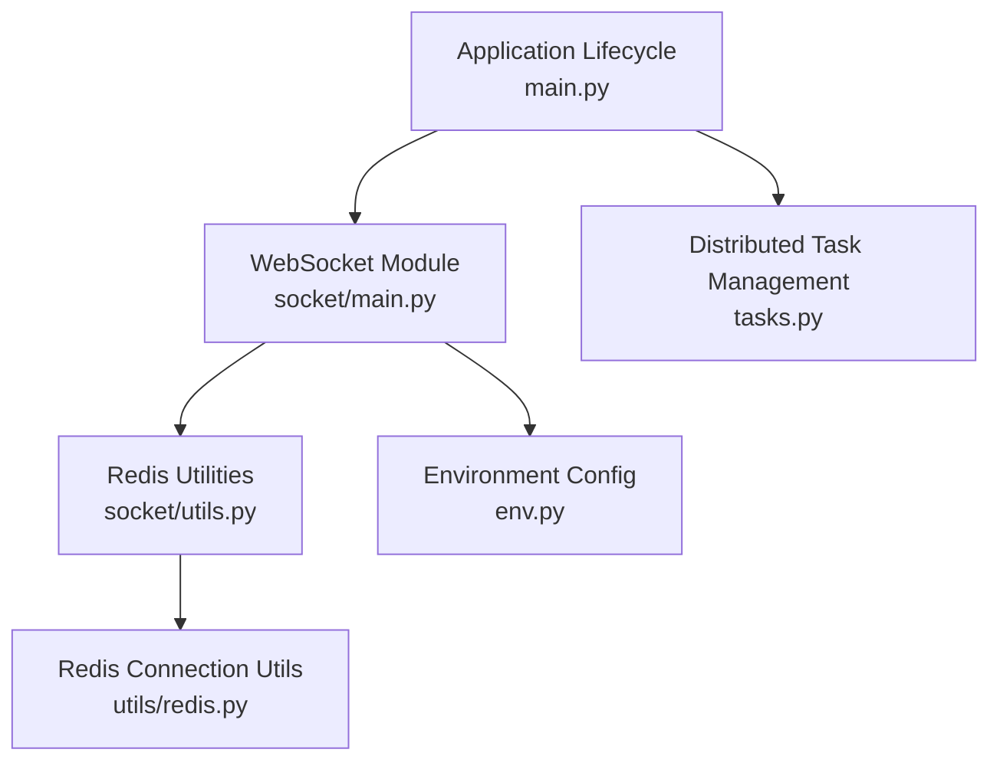
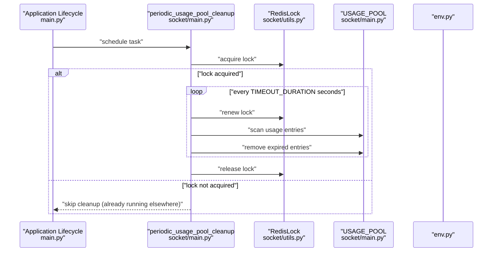
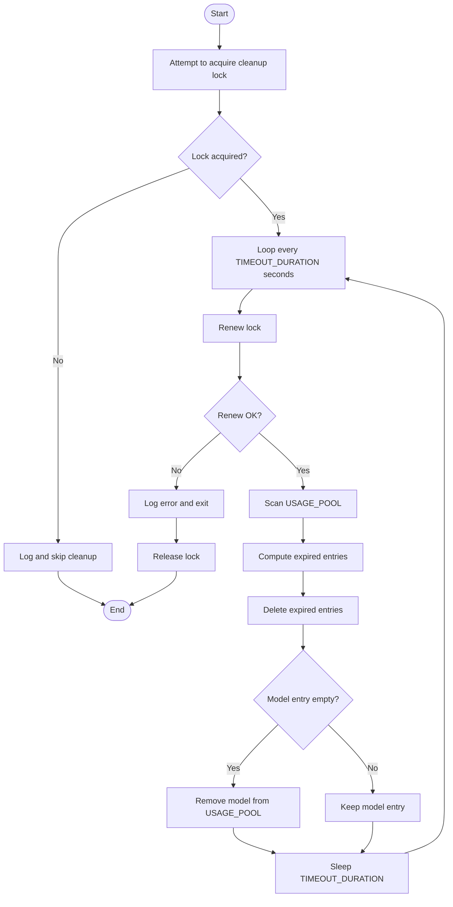
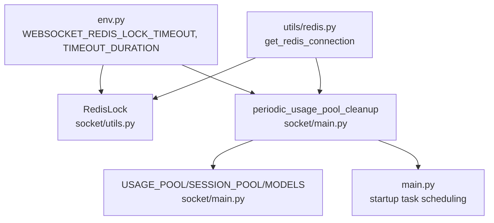

# Periodic Tasks and Cleanup Operations

<cite>
**Referenced Files in This Document**
- [main.py](file://backend/open_webui/main.py)
- [socket/main.py](file://backend/open_webui/socket/main.py)
- [socket/utils.py](file://backend/open_webui/socket/utils.py)
- [env.py](file://backend/open_webui/env.py)
- [utils/redis.py](file://backend/open_webui/utils/redis.py)
- [tasks.py](file://backend/open_webui/tasks.py)
</cite>

## Table of Contents
1. [Introduction](#introduction)
2. [Project Structure](#project-structure)
3. [Core Components](#core-components)
4. [Architecture Overview](#architecture-overview)
5. [Detailed Component Analysis](#detailed-component-analysis)
6. [Dependency Analysis](#dependency-analysis)
7. [Performance Considerations](#performance-considerations)
8. [Troubleshooting Guide](#troubleshooting-guide)
9. [Conclusion](#conclusion)

## Introduction
This document explains the periodic maintenance tasks and cleanup operations in open-webui, with a focus on the periodic_usage_pool_cleanup function. It covers how WebSocket connection pools are managed, how timeout detection works, how expired sessions are cleaned up, and how Redis-based locking prevents multiple instances from running the cleanup concurrently. It also details retry logic and error handling when acquiring the cleanup lock fails, timing considerations, and the impact on system performance and memory usage. Finally, it outlines strategies for troubleshooting cleanup failures and mitigating lock contention.

## Project Structure
The cleanup task is implemented in the WebSocket module and is started during application lifecycle. The relevant components are:
- Application lifecycle and task scheduling in main.py
- WebSocket usage pool, session pool, and cleanup logic in socket/main.py
- Redis-backed pooling and locking primitives in socket/utils.py
- Environment configuration for Redis and timeouts in env.py
- Redis connection utilities in utils/redis.py
- Distributed task management in tasks.py

**Diagram sources**
- [main.py](file://backend/open_webui/main.py#L599-L604)
- [socket/main.py](file://backend/open_webui/socket/main.py#L102-L166)
- [socket/utils.py](file://backend/open_webui/socket/utils.py#L1-L47)
- [env.py](file://backend/open_webui/env.py#L630-L642)
- [utils/redis.py](file://backend/open_webui/utils/redis.py#L132-L209)
- [tasks.py](file://backend/open_webui/tasks.py#L27-L45)

**Section sources**
- [main.py](file://backend/open_webui/main.py#L599-L604)
- [socket/main.py](file://backend/open_webui/socket/main.py#L102-L166)
- [socket/utils.py](file://backend/open_webui/socket/utils.py#L1-L47)
- [env.py](file://backend/open_webui/env.py#L630-L642)
- [utils/redis.py](file://backend/open_webui/utils/redis.py#L132-L209)
- [tasks.py](file://backend/open_webui/tasks.py#L27-L45)

## Core Components
- periodic_usage_pool_cleanup: An asynchronous periodic task that removes stale entries from the WebSocket usage pool and ensures cleanup runs safely across instances using Redis locks.
- RedisLock: A Redis-backed distributed lock used to serialize cleanup execution.
- RedisDict: A Redis hash abstraction used to persist WebSocket pools (models, sessions, usage).
- Application lifecycle: Starts the periodic cleanup task on startup.

Key responsibilities:
- Detect stale connections based on a fixed timeout.
- Clean expired entries from the usage pool.
- Renew the cleanup lock periodically to avoid premature expiration.
- Prevent concurrent cleanup runs across multiple instances.

**Section sources**
- [socket/main.py](file://backend/open_webui/socket/main.py#L102-L166)
- [socket/main.py](file://backend/open_webui/socket/main.py#L167-L217)
- [socket/utils.py](file://backend/open_webui/socket/utils.py#L9-L47)
- [main.py](file://backend/open_webui/main.py#L599-L604)

## Architecture Overview
The cleanup task operates as follows:
- On startup, the application schedules periodic_usage_pool_cleanup to run as a background task.
- The task attempts to acquire a Redis-based lock to ensure exclusive execution.
- While holding the lock, it iterates through the usage pool and removes entries older than a configured timeout.
- The lock is renewed periodically to keep the cleanup alive.
- If renewal fails, the task aborts and releases the lock.

**Diagram sources**
- [main.py](file://backend/open_webui/main.py#L599-L604)
- [socket/main.py](file://backend/open_webui/socket/main.py#L167-L217)
- [socket/utils.py](file://backend/open_webui/socket/utils.py#L9-L47)
- [env.py](file://backend/open_webui/env.py#L630-L642)

## Detailed Component Analysis

### periodic_usage_pool_cleanup
Purpose:
- Periodically scan the usage pool and remove entries that exceed a timeout threshold.
- Ensure only one instance performs cleanup at a time using Redis locks.

Behavior:
- Attempts to acquire the cleanup lock with bounded retries and randomized backoff.
- If acquisition fails, logs and skips cleanup.
- While running, periodically renews the lock to prevent expiration.
- Iterates over USAGE_POOL entries and deletes stale entries based on updated_at timestamps.
- Cleans up empty model entries from USAGE_POOL.
- Sleeps for TIMEOUT_DURATION between iterations.

Timing and intervals:
- The sleep interval equals TIMEOUT_DURATION, which is a small constant.
- The lock renewal interval is implicitly governed by the loop’s cadence.

Locking and concurrency:
- Uses RedisLock to create a named lock with a TTL derived from WEBSOCKET_REDIS_LOCK_TIMEOUT.
- Retries acquisition with jitter to reduce thundering herd on lock contention.

Error handling:
- If renewal fails, logs an error and exits the loop, releasing the lock.
- If acquisition fails after retries, logs a warning and returns without running cleanup.

Impact on memory:
- Removes stale usage entries, preventing unbounded growth of USAGE_POOL.
- Deletes empty model entries to minimize Redis footprint.

**Diagram sources**
- [socket/main.py](file://backend/open_webui/socket/main.py#L167-L217)
- [socket/utils.py](file://backend/open_webui/socket/utils.py#L9-L47)
- [env.py](file://backend/open_webui/env.py#L630-L642)

**Section sources**
- [socket/main.py](file://backend/open_webui/socket/main.py#L167-L217)
- [socket/utils.py](file://backend/open_webui/socket/utils.py#L9-L47)
- [env.py](file://backend/open_webui/env.py#L630-L642)

### RedisLock
Purpose:
- Provide a distributed lock backed by Redis to coordinate cleanup across instances.

Implementation highlights:
- Uses SET with NX to create the lock only if not present.
- Uses SET with XX to renew the lock only if held by the same owner.
- Releases the lock by deleting the key only if owned by the current process.

Concurrency guarantees:
- Ensures mutual exclusion for the cleanup task.
- TTL prevents indefinite lock hold if the owning process crashes.

**Section sources**
- [socket/utils.py](file://backend/open_webui/socket/utils.py#L9-L47)

### RedisDict
Purpose:
- Persist WebSocket pools (models, sessions, usage) in Redis hashes.

Key behaviors:
- Serializes/deserializes values to/from JSON.
- Provides dictionary-like operations (set, get, delete, items, keys, values).
- Used for MODELS, SESSION_POOL, and USAGE_POOL.

Impact on cleanup:
- Enables centralized, shared state across instances.
- Allows cleanup to operate consistently regardless of instance.

**Section sources**
- [socket/main.py](file://backend/open_webui/socket/main.py#L122-L141)
- [socket/utils.py](file://backend/open_webui/socket/utils.py#L49-L118)

### Application Lifecycle and Startup
Purpose:
- Initialize Redis connections and schedule periodic tasks.

Highlights:
- Creates a background task for periodic_usage_pool_cleanup during lifespan startup.
- Initializes Redis connections and registers a listener for distributed task commands.

Startup flow:
- Redis connection established.
- Background task scheduled.
- Optional distributed task command listener started.

**Section sources**
- [main.py](file://backend/open_webui/main.py#L585-L604)
- [tasks.py](file://backend/open_webui/tasks.py#L27-L45)

## Dependency Analysis
The cleanup task depends on:
- Redis connectivity for distributed locking and pool persistence.
- Environment configuration for lock TTL and timeout thresholds.
- WebSocket module for pool definitions and event-driven updates.

**Diagram sources**
- [env.py](file://backend/open_webui/env.py#L630-L642)
- [socket/utils.py](file://backend/open_webui/socket/utils.py#L9-L47)
- [socket/main.py](file://backend/open_webui/socket/main.py#L102-L166)
- [utils/redis.py](file://backend/open_webui/utils/redis.py#L132-L209)
- [main.py](file://backend/open_webui/main.py#L599-L604)

**Section sources**
- [env.py](file://backend/open_webui/env.py#L630-L642)
- [socket/utils.py](file://backend/open_webui/socket/utils.py#L9-L47)
- [socket/main.py](file://backend/open_webui/socket/main.py#L102-L166)
- [utils/redis.py](file://backend/open_webui/utils/redis.py#L132-L209)
- [main.py](file://backend/open_webui/main.py#L599-L604)

## Performance Considerations
- Cleanup cadence: The loop sleeps for TIMEOUT_DURATION seconds, which is a small constant. This keeps cleanup lightweight and responsive.
- Lock TTL: WEBSOCKET_REDIS_LOCK_TIMEOUT determines the maximum runtime of a single cleanup cycle. If cleanup takes longer than this, renewal will fail and the task will abort.
- Memory footprint: Removing stale entries reduces Redis hash sizes and minimizes memory usage.
- Concurrency: RedisLock prevents redundant work across instances, reducing contention and avoiding duplicate cleanup operations.
- Network overhead: Redis operations are minimal per iteration; the cost is dominated by the loop overhead and occasional lock renewals.

[No sources needed since this section provides general guidance]

## Troubleshooting Guide
Common issues and remedies:
- Cleanup not running:
  - Verify that the background task is scheduled at startup.
  - Check Redis connectivity and credentials.
  - Ensure WEBSOCKET_MANAGER is set appropriately.

- Cleanup runs but does nothing:
  - Confirm that TIMEOUT_DURATION is set to a reasonable value.
  - Verify that usage events are being recorded (the usage event handler updates entries).

- Frequent lock contention:
  - Increase WEBSOCKET_REDIS_LOCK_TIMEOUT to accommodate longer cleanup cycles.
  - Reduce the number of instances or ensure only one instance is designated for cleanup.

- Cleanup aborts unexpectedly:
  - Renewal failures indicate Redis connectivity issues or lock ownership problems.
  - Review logs for renewal errors and lock TTL settings.

- Memory growth:
  - Ensure cleanup is running and that stale entries are being removed.
  - Monitor USAGE_POOL size and adjust cleanup cadence if necessary.

Operational checks:
- Inspect Redis keys for usage pool and lock presence.
- Verify environment variables controlling timeouts and lock TTL.
- Confirm that the application lifecycle initializes Redis and schedules the task.

**Section sources**
- [main.py](file://backend/open_webui/main.py#L599-L604)
- [socket/main.py](file://backend/open_webui/socket/main.py#L167-L217)
- [socket/utils.py](file://backend/open_webui/socket/utils.py#L9-L47)
- [env.py](file://backend/open_webui/env.py#L630-L642)
- [utils/redis.py](file://backend/open_webui/utils/redis.py#L132-L209)

## Conclusion
The periodic_usage_pool_cleanup task provides a robust, distributed cleanup mechanism for WebSocket usage pools. By leveraging Redis-backed locks, it ensures safe, serialized execution across instances. Its design balances responsiveness with resource efficiency, cleaning stale entries and maintaining pool health. Proper configuration of timeouts and lock TTL is essential for reliable operation, and monitoring the cleanup cadence helps maintain optimal performance and memory usage.