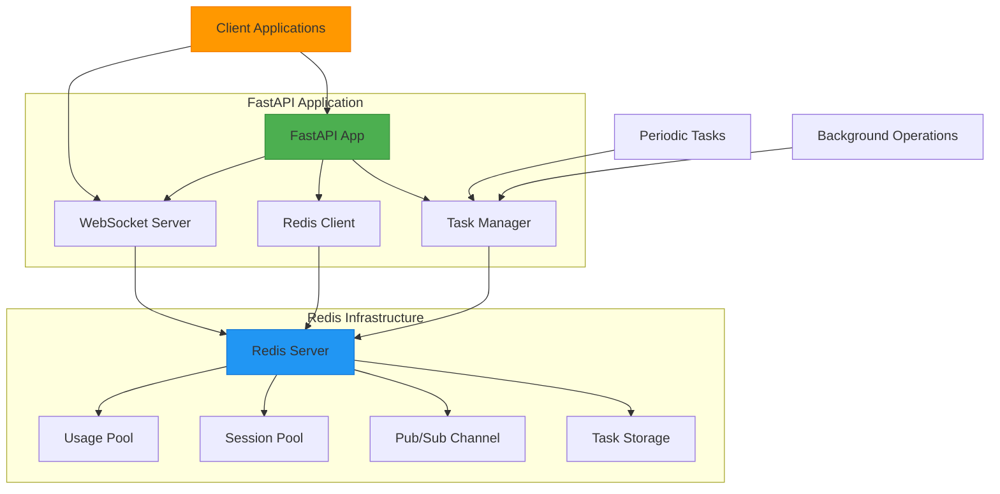
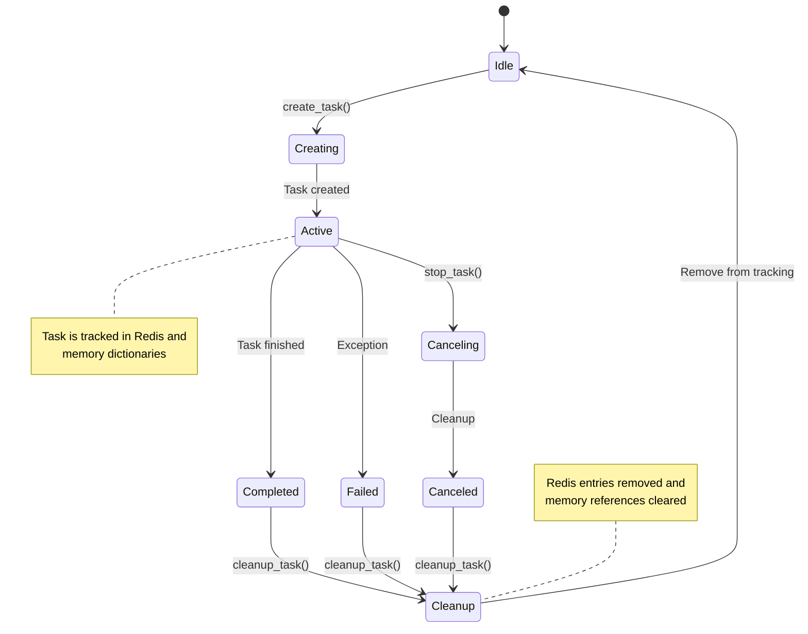
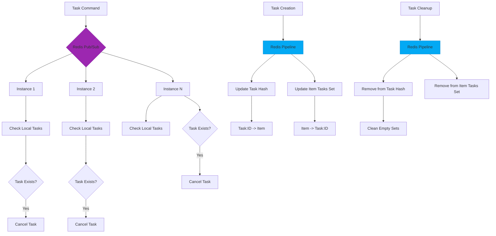
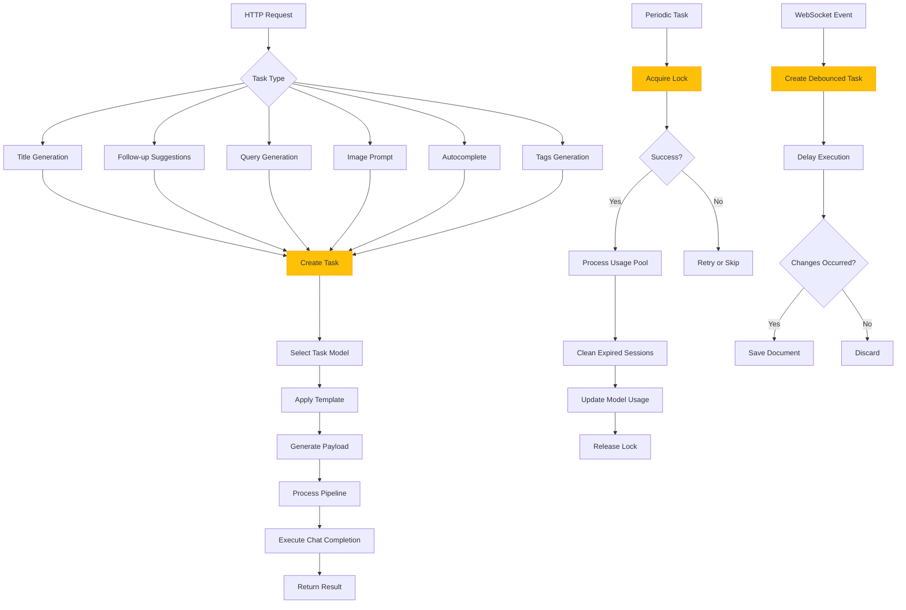
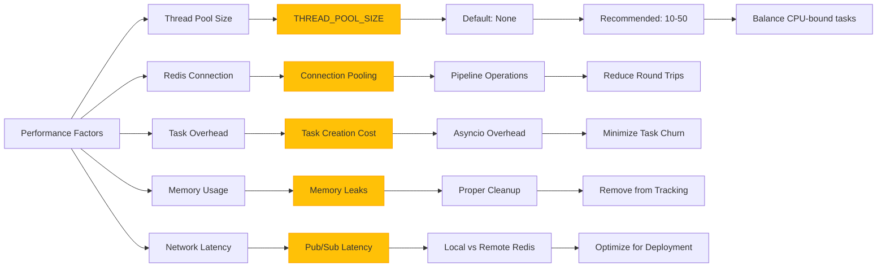
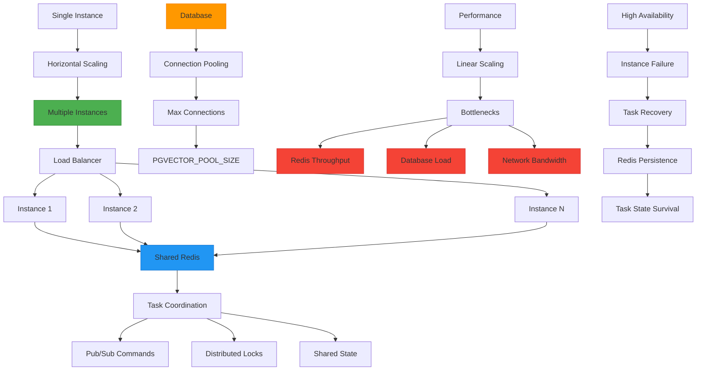

# Task Execution Framework

<cite>
**Referenced Files in This Document**   
- [tasks.py](file://backend/open_webui/tasks.py)
- [main.py](file://backend/open_webui/main.py)
- [socket/main.py](file://backend/open_webui/socket/main.py)
- [routers/tasks.py](file://backend/open_webui/routers/tasks.py)
- [utils/redis.py](file://backend/open_webui/utils/redis.py)
- [socket/utils.py](file://backend/open_webui/socket/utils.py)
- [config.py](file://backend/open_webui/config.py)
</cite>

## Table of Contents
1. [Introduction](#introduction)
2. [Architecture Overview](#architecture-overview)
3. [Task Lifecycle Management](#task-lifecycle-management)
4. [Redis Integration and Message Broker](#redis-integration-and-message-broker)
5. [FastAPI Application State Integration](#fastapi-application-state-integration)
6. [Task Execution Patterns](#task-execution-patterns)
7. [WebSocket Integration and Real-time Updates](#websocket-integration-and-real-time-updates)
8. [Error Handling and Retry Mechanisms](#error-handling-and-retry-mechanisms)
9. [Resource Management Strategies](#resource-management-strategies)
10. [Performance Considerations](#performance-considerations)
11. [Scalability Implications](#scalability-implications)

## Introduction
The Background Task Execution Framework in open-webui provides a robust system for managing asynchronous operations using Redis as a message broker and event loop integration. This framework enables the application to handle long-running operations, periodic maintenance tasks, and real-time updates through WebSocket connections. The system is designed to efficiently manage task creation, execution, cancellation, and status tracking while maintaining high performance and scalability.

The framework integrates seamlessly with the FastAPI application state, allowing for centralized task management across multiple application instances. It supports distributed task coordination through Redis pub/sub channels, ensuring consistent task state across a cluster of servers. The implementation includes comprehensive error handling, retry mechanisms, and resource management strategies to ensure reliability and stability.

**Section sources**
- [tasks.py](file://backend/open_webui/tasks.py#L1-L187)
- [main.py](file://backend/open_webui/main.py#L1-L800)

## Architecture Overview



**Diagram sources **
- [main.py](file://backend/open_webui/main.py#L570-L655)
- [tasks.py](file://backend/open_webui/tasks.py#L27-L44)
- [socket/main.py](file://backend/open_webui/socket/main.py#L107-L152)

The architecture of the Background Task Execution Framework consists of several interconnected components that work together to manage asynchronous operations. At the core is the FastAPI application, which serves as the main entry point for HTTP requests and API endpoints. The application integrates with Redis as a message broker and persistent storage for task state.

The task manager component handles the creation, tracking, and cancellation of background tasks, using Redis to store task metadata and coordinate between multiple application instances. The WebSocket server provides real-time updates to clients, enabling bidirectional communication for task progress and status updates.

Periodic tasks and background operations are managed through dedicated functions that run on scheduled intervals or in response to specific events. The system uses Redis pub/sub channels to broadcast task commands across all instances, ensuring consistent state management in distributed environments.

**Section sources**
- [main.py](file://backend/open_webui/main.py#L570-L655)
- [tasks.py](file://backend/open_webui/tasks.py#L17-L187)
- [socket/main.py](file://backend/open_webui/socket/main.py#L107-L152)

## Task Lifecycle Management



**Diagram sources **
- [tasks.py](file://backend/open_webui/tasks.py#L80-L119)
- [tasks.py](file://backend/open_webui/tasks.py#L139-L170)

The task lifecycle in the open-webui framework follows a well-defined state transition pattern, ensuring proper resource management and state consistency. The lifecycle begins with task creation through the `create_task` function, which generates a unique task ID, creates an asyncio task, and registers it in both memory and Redis storage.

Once created, tasks enter the Active state where they execute their designated coroutine. During execution, tasks can be monitored, and their status can be queried through various API endpoints. The framework provides mechanisms for both graceful completion and forced cancellation.

Task cancellation is initiated through the `stop_task` function, which sends a cancellation signal to the asyncio task and broadcasts a stop command through Redis pub/sub to ensure cancellation across all instances in a distributed environment. When a task completes (either successfully or through cancellation), the `cleanup_task` function is automatically called to remove the task from tracking dictionaries and Redis storage.

The framework ensures that all tasks are properly cleaned up regardless of their termination state, preventing memory leaks and ensuring consistent state management. This comprehensive lifecycle management enables reliable execution of background operations while maintaining system stability.

**Section sources**
- [tasks.py](file://backend/open_webui/tasks.py#L80-L170)
- [tasks.py](file://backend/open_webui/tasks.py#L97-L119)

## Redis Integration and Message Broker



**Diagram sources **
- [tasks.py](file://backend/open_webui/tasks.py#L27-L44)
- [tasks.py](file://backend/open_webui/tasks.py#L51-L66)
- [tasks.py](file://backend/open_webui/tasks.py#L58-L66)

The Redis integration in the open-webui framework serves as both a message broker and persistent storage for task state management. The system uses Redis pub/sub channels to enable distributed task coordination, allowing multiple application instances to communicate task commands and maintain consistent state.

The framework utilizes several Redis data structures to manage task state:
- A hash map (`tasks`) stores task IDs as keys with their associated item IDs as values
- Set structures (`tasks:item:<item_id>`) maintain reverse mappings from items to their associated tasks
- A pub/sub channel (`tasks:commands`) broadcasts task commands across all instances

When a task is created, the system uses Redis pipelines to atomically update both the task hash and item task sets, ensuring data consistency. Similarly, task cleanup operations use pipelines to remove entries from both data structures and clean up empty sets to prevent storage bloat.

The pub/sub mechanism enables real-time task cancellation across distributed instances. When a stop command is issued, it is published to the command channel, and all instances listen for these messages and cancel local tasks that match the specified task ID. This ensures that tasks are properly terminated even in clustered deployments.

**Section sources**
- [tasks.py](file://backend/open_webui/tasks.py#L22-L66)
- [tasks.py](file://backend/open_webui/tasks.py#L77-L78)
- [utils/redis.py](file://backend/open_webui/utils/redis.py#L117-L209)

## FastAPI Application State Integration

```mermaid
classDiagram
class FastAPI {
+state : AppState
+lifespan() : ContextManager
}
class AppState {
+redis : Redis
+redis_task_command_listener : Task
+config : AppConfig
+instance_id : str
}
class Redis {
+pubsub() : PubSub
+pipeline() : Pipeline
+hset() : Future
+hdel() : Future
+publish() : Future
}
class TaskManager {
+create_task() : str
+stop_task() : dict
+list_tasks() : list
+cleanup_task() : None
}
FastAPI --> AppState : has
AppState --> Redis : uses
AppState --> TaskManager : delegates
TaskManager --> Redis : uses
note right of FastAPI
FastAPI app instance with
extended state object
end note
note left of AppState
Application state contains
Redis client and configuration
end note
note right of TaskManager
Task management functions
operate on Redis state
end note
```

**Diagram sources **
- [main.py](file://backend/open_webui/main.py#L570-L655)
- [tasks.py](file://backend/open_webui/tasks.py#L27-L44)
- [main.py](file://backend/open_webui/main.py#L585-L597)

The integration between the FastAPI application state and the background task system is a critical aspect of the framework's architecture. During application startup, the lifespan context manager initializes the Redis connection and stores it in the application state, making it accessible to all routes and components.

The application state object is extended with several task-related properties:
- `redis`: The Redis client connection used for task storage and messaging
- `redis_task_command_listener`: An asyncio task that listens for distributed task commands
- `config`: Application configuration including task-related settings
- `instance_id`: A unique identifier for the current application instance

This integration enables centralized access to the task system throughout the application. Route handlers can access the Redis client through `request.app.state.redis` to create, monitor, and control background tasks. The lifespan context manager ensures proper initialization and cleanup of task resources, starting the Redis command listener on startup and canceling it on shutdown.

The tight integration with FastAPI's dependency injection system allows for seamless use of task functionality in route handlers while maintaining proper resource management and error handling.

**Section sources**
- [main.py](file://backend/open_webui/main.py#L570-L655)
- [main.py](file://backend/open_webui/main.py#L585-L597)
- [tasks.py](file://backend/open_webui/tasks.py#L27-L44)

## Task Execution Patterns



**Diagram sources **
- [routers/tasks.py](file://backend/open_webui/routers/tasks.py#L166-L753)
- [socket/main.py](file://backend/open_webui/socket/main.py#L167-L217)
- [socket/main.py](file://backend/open_webui/socket/main.py#L618-L625)

The open-webui framework implements several distinct task execution patterns for different use cases, each optimized for its specific requirements. These patterns include long-running operations for AI-generated content, periodic maintenance tasks, and real-time document synchronization.

For AI-generated content tasks such as title generation, follow-up suggestions, query generation, image prompts, autocomplete, and tags generation, the framework follows a consistent pattern:
1. Receive an HTTP request with task parameters
2. Validate configuration and permissions
3. Select the appropriate task model based on user preferences
4. Apply templating to generate the prompt
5. Create an asyncio task with proper error handling
6. Execute the chat completion through the appropriate API
7. Return results to the client

Periodic maintenance tasks, exemplified by the `periodic_usage_pool_cleanup` function, follow a different pattern designed for scheduled execution:
1. Attempt to acquire a distributed lock to prevent multiple instances from running simultaneously
2. Process the usage pool by removing expired sessions
3. Update model usage statistics
4. Release the lock and handle any errors

Real-time document synchronization tasks use a debounced execution pattern to optimize performance:
1. Capture changes from WebSocket events
2. Create a delayed task to allow for multiple rapid changes
3. Only save the document if changes have occurred during the delay period
4. Prevent unnecessary database writes for rapid successive edits

These execution patterns demonstrate the framework's flexibility in handling different types of background operations while maintaining efficiency and reliability.

**Section sources**
- [routers/tasks.py](file://backend/open_webui/routers/tasks.py#L166-L753)
- [socket/main.py](file://backend/open_webui/socket/main.py#L167-L217)
- [socket/main.py](file://backend/open_webui/socket/main.py#L618-L625)

## WebSocket Integration and Real-time Updates

```mermaid
sequenceDiagram
participant Client
participant WebSocket
participant TaskSystem
participant Redis
Client->>WebSocket : Connect (with auth token)
WebSocket->>TaskSystem : user_join event
TaskSystem->>Redis : Store session in SESSION_POOL
Redis-->>TaskSystem : Success
TaskSystem->>WebSocket : Join user room
WebSocket-->>Client : Connection established
Client->>WebSocket : Send usage update
WebSocket->>TaskSystem : usage event
TaskSystem->>Redis : Update USAGE_POOL
Redis-->>TaskSystem : Success
TaskSystem->>TaskSystem : periodic_usage_pool_cleanup()
TaskSystem->>Redis : Acquire cleanup lock
Redis-->>TaskSystem : Lock acquired
TaskSystem->>Redis : Scan expired sessions
Redis-->>TaskSystem : Expired session list
TaskSystem->>Redis : Remove expired sessions
TaskSystem->>Redis : Release lock
Client->>WebSocket : Edit document
WebSocket->>TaskSystem : ydoc : document : update
TaskSystem->>TaskSystem : stop_item_tasks()
TaskSystem->>TaskSystem : create_task(debounced_save)
TaskSystem->>Redis : Append update to YDOC_MANAGER
Redis-->>WebSocket : Broadcast to other clients
TaskSystem->>TaskSystem : Wait 500ms
TaskSystem->>TaskSystem : Save document if changes exist
note right of TaskSystem
Real-time coordination
between clients and
background tasks
end note
```

**Diagram sources **
- [socket/main.py](file://backend/open_webui/socket/main.py#L303-L317)
- [socket/main.py](file://backend/open_webui/socket/main.py#L288-L301)
- [socket/main.py](file://backend/open_webui/socket/main.py#L167-L217)
- [socket/main.py](file://backend/open_webui/socket/main.py#L618-L625)

The WebSocket integration in the open-webui framework enables real-time communication between clients and the background task system, creating a responsive and interactive user experience. The integration follows a sophisticated pattern that coordinates client connections, task execution, and state synchronization.

When a client connects to the WebSocket server, the system authenticates the user and stores their session in the Redis-backed `SESSION_POOL`. The client is then added to user-specific rooms that enable targeted message broadcasting. This room-based architecture allows for efficient communication with specific users or groups of users.

The framework uses WebSocket events to trigger background tasks and update task state. For example, when a client sends a usage update, the system records this information in the `USAGE_POOL` Redis dictionary, which tracks model usage across all connected clients. This data is then used by the periodic `periodic_usage_pool_cleanup` task to identify and remove expired sessions.

Document editing operations demonstrate the tight integration between WebSocket events and background tasks. When a client makes changes to a document, the system:
1. Stops any existing tasks for that document to prevent conflicts
2. Creates a debounced save task that delays execution by 500ms
3. Stores the update in Redis for real-time synchronization with other clients
4. Only saves the document if additional changes have occurred during the delay period

This approach optimizes performance by reducing unnecessary database writes while ensuring data consistency across all connected clients. The integration of WebSocket events with the background task system enables real-time collaboration and responsive user interfaces.

**Section sources**
- [socket/main.py](file://backend/open_webui/socket/main.py#L303-L317)
- [socket/main.py](file://backend/open_webui/socket/main.py#L288-L301)
- [socket/main.py](file://backend/open_webui/socket/main.py#L167-L217)
- [socket/main.py](file://backend/open_webui/socket/main.py#L618-L625)

## Error Handling and Retry Mechanisms

```mermaid
flowchart TD
A[Task Execution] --> B{Error Occurred?}
B --> |No| C[Complete Successfully]
B --> |Yes| D[Log Error Details]
D --> E{Error Type}
E --> F[Connection Error]
E --> G[Timeout Error]
E --> H[Server Error (5xx)]
E --> I[Rate Limit (429)]
E --> J[Authentication Error]
E --> K[Bad Request (400)]
E --> L[Not Found (404)]
F --> M[Retry with Backoff]
G --> M
H --> M
I --> M
J --> N[Fail Immediately]
K --> N
L --> N
M --> O[Calculate Wait Time]
O --> P[Exponential Backoff]
P --> Q[Cap at 30s]
Q --> R[Wait and Retry]
R --> A
N --> S[Clean Up Resources]
S --> T[Remove from Tracking]
T --> U[Return Error to Client]
V[Task Cancellation] --> W[Handle CancelledError]
W --> X[Clean Up Resources]
X --> Y[Remove from Tracking]
Y --> Z[Return Cancellation Status]
style M fill:#4CAF50,stroke:#388E3C
style N fill:#F44336,stroke:#D32F2F
style P fill:#2196F3,stroke:#1976D2
```

**Diagram sources **
- [retrieval/loaders/mistral.py](file://backend/open_webui/retrieval/loaders/mistral.py#L151-L215)
- [tasks.py](file://backend/open_webui/tasks.py#L161-L165)
- [tasks.py](file://backend/open_webui/tasks.py#L80-L89)

The error handling and retry mechanisms in the open-webui background task framework are designed to ensure reliability and resilience in the face of various failure scenarios. The system implements a sophisticated error classification system that distinguishes between retryable and non-retryable errors, preventing wasted attempts on errors that will never succeed.

For retryable errors, the framework uses exponential backoff with jitter to avoid thundering herd problems when multiple tasks encounter errors simultaneously. The backoff algorithm increases the wait time between retries exponentially but caps it at 30 seconds to prevent excessive delays. This approach balances the need to avoid overwhelming external services with the requirement to eventually succeed when transient issues resolve.

Retryable errors include:
- Network connection errors (temporary network issues)
- Timeouts (server might be temporarily overloaded)
- Server errors (5xx status codes - server-side issues)
- Rate limiting (429 status - temporary throttling)

Non-retryable errors that cause immediate failure include:
- Authentication errors (401, 403 - won't fix with retry)
- Bad request errors (400 - malformed request)
- Not found errors (404 - resource doesn't exist)

The framework also handles task cancellation gracefully by catching `asyncio.CancelledError` exceptions and performing proper cleanup operations. When a task is cancelled, the system removes it from tracking dictionaries and Redis storage, ensuring no resource leaks occur.

Comprehensive logging is implemented throughout the error handling process, capturing detailed information about errors while respecting privacy and security considerations. This enables effective monitoring and debugging while maintaining system stability.

**Section sources**
- [retrieval/loaders/mistral.py](file://backend/open_webui/retrieval/loaders/mistral.py#L151-L215)
- [tasks.py](file://backend/open_webui/tasks.py#L161-L165)
- [tasks.py](file://backend/open_webui/tasks.py#L80-L89)

## Resource Management Strategies

```mermaid
classDiagram
class RedisDict {
-name : str
-redis : Redis
+__setitem__() : None
+__getitem__() : Any
+__delitem__() : None
+keys() : list
+values() : list
+items() : list
+get() : Any
+clear() : None
+update() : None
+setdefault() : Any
}
class RedisLock {
-lock_name : str
-lock_id : str
-timeout_secs : int
-redis : Redis
-lock_obtained : bool
+aquire_lock() : bool
+renew_lock() : bool
+release_lock() : None
}
class YdocManager {
-_updates : dict
-_users : dict
-_redis : Redis
-_redis_key_prefix : str
+append_to_updates() : None
+get_updates() : list
+document_exists() : bool
+get_users() : list
+add_user() : None
+remove_user() : None
+remove_user_from_all_documents() : None
+clear_document() : None
}
RedisDict --> Redis : uses
RedisLock --> Redis : uses
YdocManager --> Redis : uses
note right of RedisDict
Dictionary-like interface
backed by Redis hash
end note
note left of RedisLock
Distributed lock implementation
for coordinating periodic tasks
end note
note right of YdocManager
Manages Yjs document updates
and user presence
end note
```

**Diagram sources **
- [socket/utils.py](file://backend/open_webui/socket/utils.py#L8-L224)
- [socket/main.py](file://backend/open_webui/socket/main.py#L121-L141)
- [socket/main.py](file://backend/open_webui/socket/main.py#L161-L164)

The resource management strategies in the open-webui background task framework are designed to efficiently handle memory, connections, and distributed state while preventing resource leaks and ensuring system stability. The framework implements several key components that work together to manage resources effectively.

The `RedisDict` class provides a dictionary-like interface backed by Redis hashes, enabling shared state across multiple application instances. This is used for several critical data structures:
- `MODELS`: Tracks available AI models
- `SESSION_POOL`: Maintains user session information
- `USAGE_POOL`: Monitors model usage across connected clients

The `RedisLock` class implements distributed locking using Redis, which is essential for coordinating periodic tasks across multiple instances. The `periodic_usage_pool_cleanup` function uses this lock to ensure that only one instance performs cleanup operations at a time, preventing race conditions and redundant processing.

The `YdocManager` class manages Yjs document updates and user presence, storing document state and user information in Redis. This enables real-time collaboration while ensuring data persistence and consistency across server restarts.

Additional resource management strategies include:
- Automatic cleanup of tasks through done callbacks
- Pipeline operations to reduce Redis round trips
- Connection pooling for Redis operations
- Memory-efficient storage of task state
- Regular cleanup of expired sessions and unused data

These strategies work together to create a robust resource management system that scales efficiently and maintains performance under varying loads.

**Section sources**
- [socket/utils.py](file://backend/open_webui/socket/utils.py#L8-L224)
- [socket/main.py](file://backend/open_webui/socket/main.py#L121-L141)
- [socket/main.py](file://backend/open_webui/socket/main.py#L161-L164)

## Performance Considerations



**Diagram sources **
- [config.py](file://backend/open_webui/config.py#L1576-L1587)
- [main.py](file://backend/open_webui/main.py#L599-L602)
- [tasks.py](file://backend/open_webui/tasks.py#L51-L66)
- [tasks.py](file://backend/open_webui/tasks.py#L80-L89)

The performance of the background task framework in open-webui is influenced by several key factors that must be carefully considered and optimized for different deployment scenarios. These factors include thread pool configuration, Redis connection efficiency, task overhead, memory usage, and network latency.

The `THREAD_POOL_SIZE` configuration parameter controls the number of worker threads available for CPU-bound operations. When not explicitly set, the system uses the default AnyIO thread limiter. For optimal performance, it is recommended to set this value based on the expected workload and available CPU resources, typically between 10 and 50 threads.

Redis connection performance is critical to the framework's efficiency. The system uses connection pooling and pipeline operations to minimize round trips and reduce latency. Pipeline operations batch multiple Redis commands into a single network request, significantly improving throughput for operations that modify multiple data structures.

Task creation and management overhead is minimized through efficient data structures and algorithms. The framework avoids excessive task churn by reusing tasks when possible and ensuring proper cleanup of completed tasks. Memory usage is carefully managed to prevent leaks, with all tasks being removed from tracking dictionaries and Redis storage upon completion or cancellation.

Network latency considerations vary depending on the deployment architecture. When Redis is hosted locally, latency is minimal, but in distributed deployments with remote Redis servers, network latency can become a bottleneck. The pub/sub mechanism used for distributed task coordination is particularly sensitive to network latency, making local Redis deployment preferable for high-performance requirements.

These performance considerations must be balanced based on the specific use case and deployment environment to achieve optimal results.

**Section sources**
- [config.py](file://backend/open_webui/config.py#L1576-L1587)
- [main.py](file://backend/open_webui/main.py#L599-L602)
- [tasks.py](file://backend/open_webui/tasks.py#L51-L66)
- [tasks.py](file://backend/open_webui/tasks.py#L80-L89)

## Scalability Implications



**Diagram sources **
- [main.py](file://backend/open_webui/main.py#L585-L597)
- [socket/main.py](file://backend/open_webui/socket/main.py#L64-L87)
- [config.py](file://backend/open_webui/config.py#L2230-L2237)
- [socket/main.py](file://backend/open_webui/socket/main.py#L107-L152)

The scalability implications of the open-webui background task framework are significant, as the architecture is designed to support horizontal scaling across multiple instances while maintaining consistent state and coordinated task management. The framework's reliance on Redis as a shared message broker and state store enables seamless scaling to multiple instances.

When scaling horizontally, multiple application instances can be deployed behind a load balancer, with all instances connecting to the same Redis server or cluster. This shared Redis infrastructure enables several critical scalability features:
- Distributed task coordination through pub/sub commands
- Shared task state across all instances
- Distributed locking for periodic tasks
- Consistent session and usage tracking

The framework handles instance failures gracefully, as task state is persisted in Redis rather than in-memory. If an instance fails, other instances can detect and handle orphaned tasks through the shared state. Redis persistence ensures that task state survives server restarts and instance failures.

Database connection pooling is another critical scalability consideration. The `PGVECTOR_POOL_SIZE` configuration parameter controls the maximum number of database connections, which must be carefully tuned based on the number of application instances and expected load. Connection pooling prevents database connection exhaustion under high load.

Potential bottlenecks in a scaled deployment include:
- Redis throughput and memory capacity
- Database load and connection limits
- Network bandwidth between instances and Redis
- Pub/sub message volume

These bottlenecks can be mitigated through proper infrastructure planning, Redis clustering, database optimization, and careful configuration of connection limits and pool sizes. The framework's architecture supports scaling to meet the demands of large user bases while maintaining performance and reliability.

**Section sources**
- [main.py](file://backend/open_webui/main.py#L585-L597)
- [socket/main.py](file://backend/open_webui/socket/main.py#L64-L87)
- [config.py](file://backend/open_webui/config.py#L2230-L2237)
- [socket/main.py](file://backend/open_webui/socket/main.py#L107-L152)