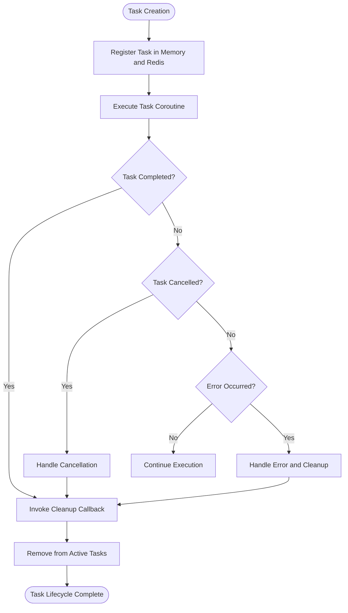
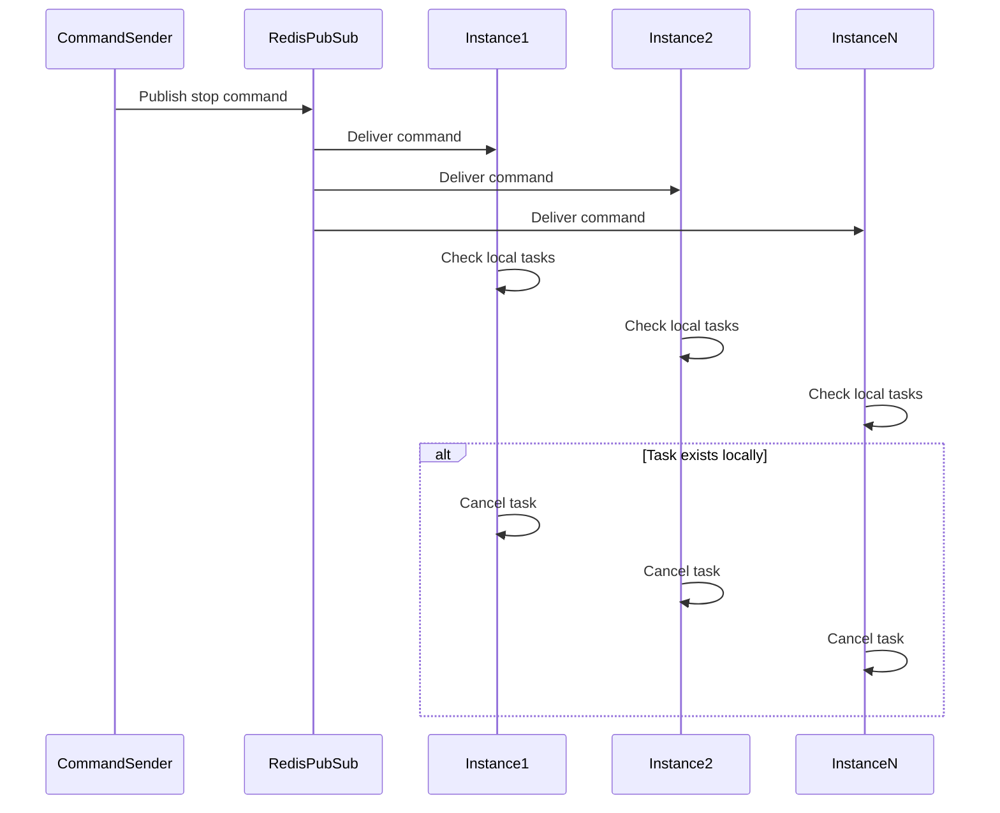
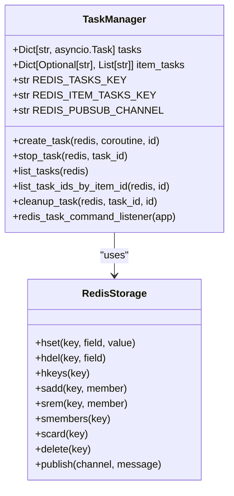
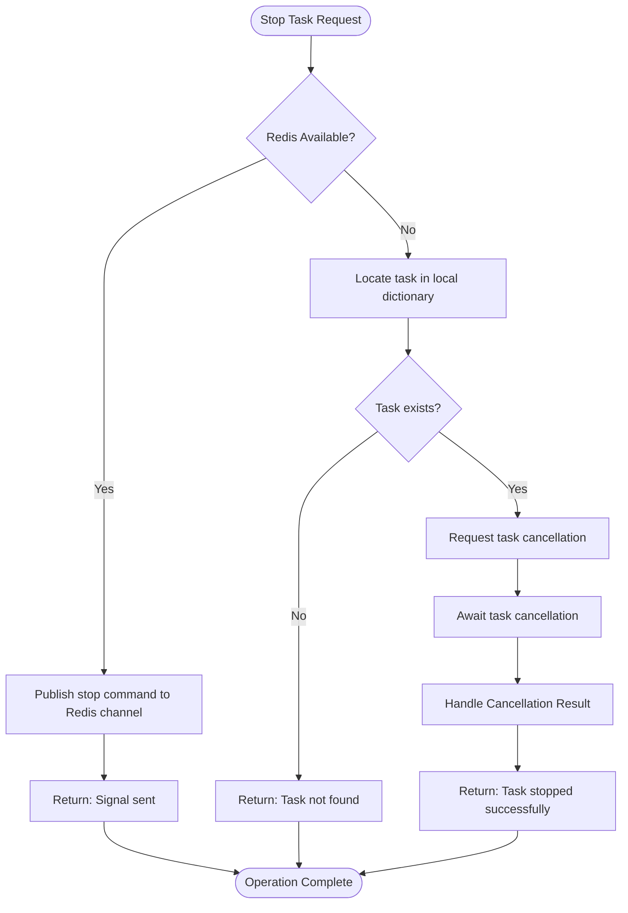
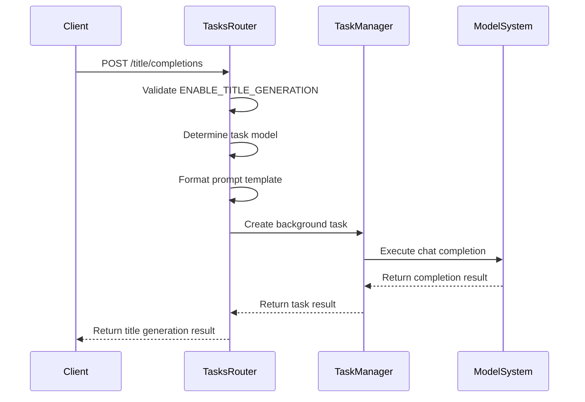
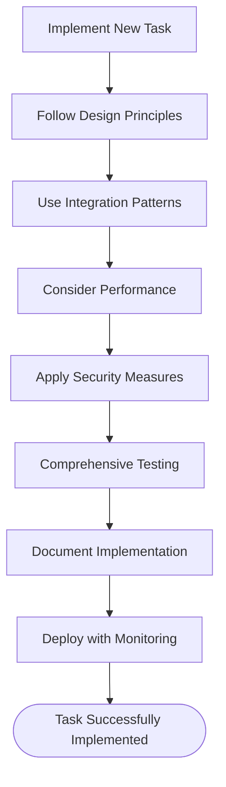

# Task Management and Lifecycle

<cite>
**Referenced Files in This Document**   
- [tasks.py](file://backend/open_webui/tasks.py)
- [routers/tasks.py](file://backend/open_webui/routers/tasks.py)
- [main.py](file://backend/open_webui/main.py)
- [constants.py](file://backend/open_webui/constants.py)
- [utils/redis.py](file://backend/open_webui/utils/redis.py)
- [env.py](file://backend/open_webui/env.py)
</cite>

## Table of Contents
1. [Introduction](#introduction)
2. [Task Lifecycle Overview](#task-lifecycle-overview)
3. [Task Creation and Registration](#task-creation-and-registration)
4. [Redis Task Command Listener](#redis-task-command-listener)
5. [Task Data Structures and State Tracking](#task-data-structures-and-state-tracking)
6. [Task Cancellation Mechanism](#task-cancellation-mechanism)
7. [Task Management Endpoints](#task-management-endpoints)
8. [Common Issues and Mitigation Strategies](#common-issues-and-mitigation-strategies)
9. [Best Practices for Implementing Background Tasks](#best-practices-for-implementing-background-tasks)
10. [Conclusion](#conclusion)

## Introduction

The Task Management and Lifecycle system in open-webui provides a robust framework for managing background tasks across distributed instances. This system enables the creation, monitoring, and termination of asynchronous operations while maintaining consistency across multiple application instances through Redis-based coordination. The architecture supports various AI-related tasks such as title generation, follow-up suggestions, tag generation, and query formulation, all managed through a centralized task coordination system.

The system leverages Redis for both persistent task state tracking and real-time command distribution via pub/sub channels. This dual approach ensures that tasks are properly tracked even during instance restarts while allowing immediate command propagation across all instances in a cluster.

**Section sources**
- [tasks.py](file://backend/open_webui/tasks.py#L1-L187)
- [main.py](file://backend/open_webui/main.py#L514-L655)

## Task Lifecycle Overview

The task lifecycle in open-webui follows a comprehensive state management pattern that ensures proper resource cleanup and consistent state across distributed instances. Each task progresses through several distinct phases from creation to completion or cancellation.

When a task is created, it is assigned a unique UUID and registered in both in-memory dictionaries and Redis storage. The task is then monitored throughout its execution, with automatic cleanup occurring upon completion, cancellation, or failure. The system maintains references to tasks both globally and in relation to specific items (such as chat sessions), allowing for targeted operations on groups of related tasks.

The lifecycle is designed to handle both graceful completion and abrupt termination scenarios. When a task completes normally, its cleanup callback is automatically invoked. When a task is cancelled, the system ensures proper resource release and state synchronization across all instances.



**Diagram sources**
- [tasks.py](file://backend/open_webui/tasks.py#L97-L119)
- [tasks.py](file://backend/open_webui/tasks.py#L81-L95)

## Task Creation and Registration

Task creation in open-webui is handled through the `create_task` function, which serves as the primary entry point for registering new background operations. This function accepts a coroutine to execute and an optional item ID to associate with the task, enabling grouped task management.

The task creation process involves several critical steps:
1. Generation of a unique UUID for the task identifier
2. Creation of an asyncio task from the provided coroutine
3. Registration of a cleanup callback that executes when the task completes
4. Storage of the task reference in the global tasks dictionary
5. Association of the task with the provided item ID (if any)
6. Persistence of task metadata in Redis for cross-instance visibility

The system uses a done callback pattern to ensure automatic cleanup upon task completion. This callback invokes the `cleanup_task` function, which removes the task from both in-memory structures and Redis storage. This approach guarantees that completed tasks do not leak memory or maintain stale references in the distributed state.

```python
async def create_task(redis, coroutine, id=None):
    task_id = str(uuid4())
    task = asyncio.create_task(coroutine)
    
    task.add_done_callback(
        lambda t: asyncio.create_task(cleanup_task(redis, task_id, id))
    )
    tasks[task_id] = task
    
    if item_tasks.get(id):
        item_tasks[id].append(task_id)
    else:
        item_tasks[id] = [task_id]
    
    if redis:
        await redis_save_task(redis, task_id, id)
    
    return task_id, task
```

**Section sources**
- [tasks.py](file://backend/open_webui/tasks.py#L97-L119)

## Redis Task Command Listener

The `redis_task_command_listener` is a critical component of the distributed task management system, enabling cross-instance coordination of task operations. This listener runs as a long-lived coroutine that subscribes to a Redis pub/sub channel dedicated to task commands.

The listener operates by continuously polling for messages on the `REDIS_PUBSUB_CHANNEL` (`{prefix}:tasks:commands`). When a message is received, it parses the JSON payload and processes the requested command. Currently, the only implemented command is "stop", which triggers task cancellation across all instances.

The listener's architecture ensures that task termination commands are propagated immediately to all running instances in a cluster. This is essential for maintaining consistency in distributed environments where the same task might be referenced across multiple application instances.



**Diagram sources**
- [tasks.py](file://backend/open_webui/tasks.py#L27-L43)
- [env.py](file://backend/open_webui/env.py#L382-L382)

## Task Data Structures and State Tracking

The task management system employs a dual-layer approach to state tracking, combining in-memory data structures with Redis persistence to ensure both performance and reliability.

Two primary data structures are used for tracking active tasks:

1. **Global tasks dictionary**: A Python dictionary that maps task IDs to asyncio.Task objects, providing O(1) access to currently running tasks.
2. **Item-based task mapping**: A dictionary that associates item IDs (such as chat session IDs) with lists of task IDs, enabling grouped operations on related tasks.

These in-memory structures are complemented by Redis storage using two key patterns:

1. **Hash storage**: The `REDIS_TASKS_KEY` hash stores task IDs as keys with optional item IDs as values, allowing for efficient listing of all active tasks.
2. **Set storage**: The `REDIS_ITEM_TASKS_KEY` uses Redis sets to maintain task ID collections for each item, enabling fast membership checks and bulk operations.



**Diagram sources**
- [tasks.py](file://backend/open_webui/tasks.py#L17-L24)
- [tasks.py](file://backend/open_webui/tasks.py#L51-L66)

## Task Cancellation Mechanism

The task cancellation mechanism in open-webui implements a graceful shutdown process that ensures proper resource cleanup while maintaining system stability. The cancellation process differs based on whether Redis is available, providing both distributed and local operation modes.

When Redis is configured, the `stop_task` function publishes a "stop" command to the Redis pub/sub channel. This ensures that all instances in a cluster receive the cancellation request simultaneously. The function then returns immediately with a confirmation that the stop signal was sent, without waiting for actual task termination.

When Redis is not available, the system performs local cancellation by:
1. Removing the task from the global tasks dictionary
2. Requesting cancellation via the asyncio task's cancel() method
3. Awaiting the task to handle the cancellation exception
4. Returning appropriate status based on the cancellation outcome

The system also provides the `stop_item_tasks` function, which cancels all tasks associated with a specific item ID. This is particularly useful for cleaning up all background operations related to a particular chat session or user interaction.



**Diagram sources**
- [tasks.py](file://backend/open_webui/tasks.py#L140-L170)
- [tasks.py](file://backend/open_webui/tasks.py#L173-L186)

## Task Management Endpoints

The task management system exposes several API endpoints through the tasks router, allowing clients to interact with the task system and configure task-related settings. These endpoints provide both configuration management and operational capabilities.

The primary endpoints include:

1. **GET /tasks/config**: Retrieves the current task configuration, including enabled features and prompt templates
2. **POST /tasks/config/update**: Updates task configuration settings (admin only)
3. **POST /tasks/title/completions**: Generates chat titles using AI models
4. **POST /tasks/follow_up/completions**: Generates follow-up question suggestions
5. **POST /tasks/tags/completions**: Generates tags for chat sessions
6. **POST /tasks/image_prompt/completions**: Generates image generation prompts
7. **POST /tasks/queries/completions**: Generates search queries for web or retrieval
8. **POST /tasks/auto/completions**: Generates autocompletion suggestions
9. **POST /tasks/emoji/completions**: Generates emoji suggestions
10. **POST /tasks/moa/completions**: Generates responses using the MOA (Mixture of Agents) pattern

Each endpoint follows a consistent pattern of validating configuration settings, determining the appropriate task model, formatting prompts using template functions, and invoking the chat completion system. The endpoints are protected by authentication and authorization checks to ensure only verified users can access them.



**Diagram sources**
- [routers/tasks.py](file://backend/open_webui/routers/tasks.py#L166-L247)
- [tasks.py](file://backend/open_webui/tasks.py#L97-L119)

## Common Issues and Mitigation Strategies

The task management system addresses several common issues that arise in distributed background task processing environments.

### Task Leakage
Task leakage can occur if cleanup callbacks fail to execute or if exceptions prevent proper cleanup. The system mitigates this through:
- Using asyncio task done callbacks that are guaranteed to execute
- Storing task state in Redis for persistence across restarts
- Implementing the `redis_cleanup_task` function to remove stale entries

### Zombie Processes
Zombie processes are prevented by:
- Proper exception handling in task coroutines
- Using asyncio cancellation mechanisms rather than forceful termination
- Implementing timeout mechanisms in the underlying operations

### Race Conditions
Race conditions during task termination are minimized by:
- Using Redis atomic operations (pipelines) for state updates
- Implementing the pub/sub pattern for distributed commands
- Designing idempotent operations where possible

### Cross-Instance Consistency
The system ensures consistency across instances by:
- Using Redis as the source of truth for task state
- Propagating commands via pub/sub to all instances simultaneously
- Implementing retry logic for Redis operations in the SentinelRedisProxy

```mermaid
flowchart TD
Issue[Common Issue] --> Mitigation[Mitigation Strategy]
Issue1[Task Leakage] --> Mitigation1[Automatic cleanup callbacks]
Issue1 --> Mitigation2[Redis persistence]
Issue1 --> Mitigation3[Atomic cleanup operations]
Issue2[Zombie Processes] --> Mitigation4[Proper exception handling]
Issue2 --> Mitigation5[Asyncio cancellation]
Issue2 --> Mitigation6[Operation timeouts]
Issue3[Race Conditions] --> Mitigation7[Redis atomic operations]
Issue3 --> Mitigation8[Pub/sub command distribution]
Issue3 --> Mitigation9[Idempotent operations]
Issue4[Cross-Instance Inconsistency] --> Mitigation10[Redis as source of truth]
Issue4 --> Mitigation11[Simultaneous command propagation]
Issue4 --> Mitigation12[Retry logic for Redis operations]
```



**Diagram sources**
- [tasks.py](file://backend/open_webui/tasks.py#L81-L95)
- [utils/redis.py](file://backend/open_webui/utils/redis.py#L22-L101)

## Best Practices for Implementing Background Tasks

When implementing new background tasks within the open-webui system, several best practices should be followed to ensure reliability, maintainability, and proper integration with the existing architecture.

### Task Design Principles
1. **Idempotency**: Design tasks to be idempotent where possible, allowing safe retry of operations
2. **Progressive Enhancement**: Implement features as optional enhancements that degrade gracefully when disabled
3. **Resource Management**: Properly manage resources and ensure cleanup in all execution paths
4. **Error Handling**: Implement comprehensive error handling with appropriate logging

### Integration Patterns
1. **Configuration-Driven**: Use the configuration system to enable/disable features
2. **Template-Based**: Leverage the prompt template system for consistent formatting
3. **Model Agnostic**: Support both local and external models through the task model selection
4. **Metadata Enrichment**: Include appropriate metadata in task payloads for monitoring and debugging

### Performance Considerations
1. **Batching**: Where appropriate, batch operations to reduce overhead
2. **Caching**: Implement caching for expensive operations when possible
3. **Rate Limiting**: Consider rate limiting for external API calls
4. **Timeouts**: Implement appropriate timeouts to prevent hanging operations

### Security Considerations
1. **Input Validation**: Validate all inputs before processing
2. **Authentication**: Ensure proper authentication and authorization checks
3. **Rate Limiting**: Implement rate limiting to prevent abuse
4. **Logging**: Implement appropriate logging without exposing sensitive information



**Diagram sources**
- [routers/tasks.py](file://backend/open_webui/routers/tasks.py#L166-L753)
- [tasks.py](file://backend/open_webui/tasks.py#L97-L119)

## Conclusion

The Task Management and Lifecycle system in open-webui provides a comprehensive framework for handling background operations in a distributed environment. By leveraging Redis for both state persistence and real-time command distribution, the system ensures consistent task management across multiple application instances.

Key strengths of the system include:
- Robust task lifecycle management with automatic cleanup
- Distributed coordination through Redis pub/sub
- Flexible configuration system for enabling/disabling features
- Comprehensive error handling and resource management
- Integration with the broader application architecture

The system effectively addresses common challenges in background task processing, including task leakage, zombie processes, and race conditions, through careful design and implementation of state management patterns. The separation of concerns between task execution, state tracking, and command distribution creates a maintainable and extensible architecture.

For developers implementing new background tasks, following the established patterns and best practices ensures seamless integration with the existing system while maintaining the reliability and performance characteristics that users expect.

**Section sources**
- [tasks.py](file://backend/open_webui/tasks.py#L1-L187)
- [routers/tasks.py](file://backend/open_webui/routers/tasks.py#L1-L753)
- [main.py](file://backend/open_webui/main.py#L514-L655)