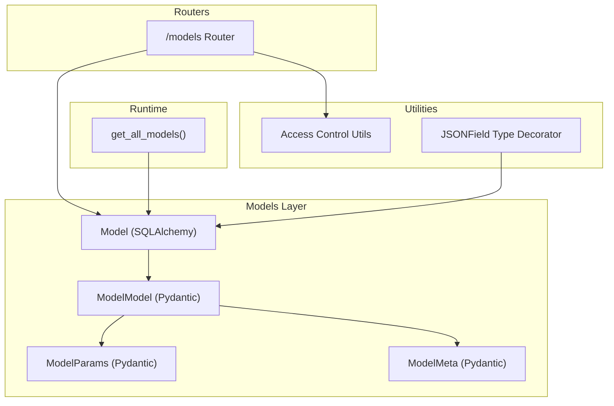
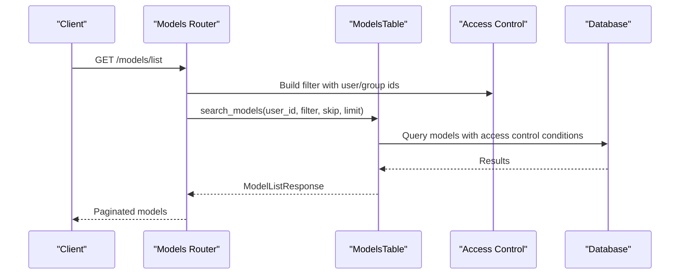
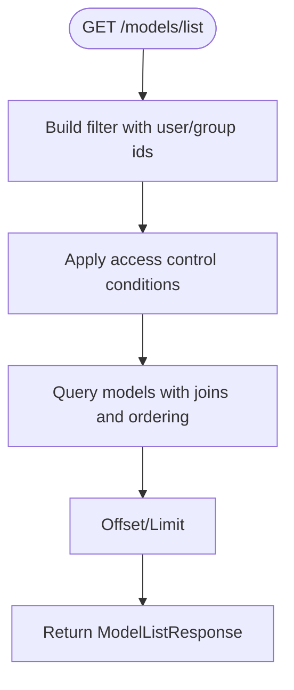
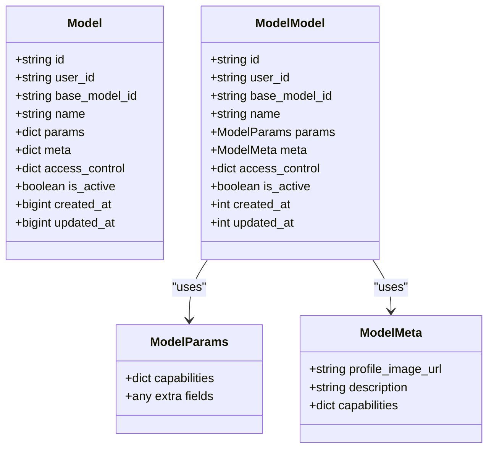
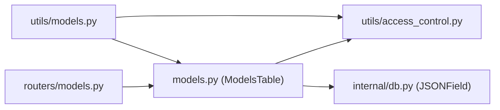

# AI Model Configuration Model

<cite>
**Referenced Files in This Document**
- [models.py](file://backend/open_webui/models/models.py)
- [routers/models.py](file://backend/open_webui/routers/models.py)
- [access_control.py](file://backend/open_webui/utils/access_control.py)
- [db.py](file://backend/open_webui/internal/db.py)
- [models.py](file://backend/open_webui/utils/models.py)
- [users.py](file://backend/open_webui/models/users.py)
</cite>

## Table of Contents
1. [Introduction](#introduction)
2. [Project Structure](#project-structure)
3. [Core Components](#core-components)
4. [Architecture Overview](#architecture-overview)
5. [Detailed Component Analysis](#detailed-component-analysis)
6. [Dependency Analysis](#dependency-analysis)
7. [Performance Considerations](#performance-considerations)
8. [Troubleshooting Guide](#troubleshooting-guide)
9. [Conclusion](#conclusion)

## Introduction
This document describes the AI Model Configuration Model used by the open-webui project. It covers the entity schema, JSON fields for parameters and metadata, access control semantics, and operational patterns such as model discovery, access validation, and parameter retrieval. It also explains how the id field acts as the API identifier and can override existing models, and how base_model_id enables proxying to underlying providers.

## Project Structure
The model configuration is implemented as a SQLAlchemy declarative model with Pydantic serialization/deserialization, backed by a JSON field type for flexible storage of structured data. Access control is enforced via utility functions that evaluate group and user permissions. Routers expose CRUD and discovery endpoints.

**Diagram sources**
- [models.py](file://backend/open_webui/models/models.py#L55-L123)
- [access_control.py](file://backend/open_webui/utils/access_control.py#L124-L175)
- [db.py](file://backend/open_webui/internal/db.py#L31-L52)
- [routers/models.py](file://backend/open_webui/routers/models.py#L1-L120)
- [models.py](file://backend/open_webui/utils/models.py#L82-L120)

**Section sources**
- [models.py](file://backend/open_webui/models/models.py#L55-L123)
- [db.py](file://backend/open_webui/internal/db.py#L31-L52)
- [routers/models.py](file://backend/open_webui/routers/models.py#L1-L120)
- [access_control.py](file://backend/open_webui/utils/access_control.py#L124-L175)
- [models.py](file://backend/open_webui/utils/models.py#L82-L120)

## Core Components
- Model (SQLAlchemy): Declares the persistent schema with id, user_id, base_model_id, name, params, meta, access_control, is_active, and timestamps.
- ModelModel (Pydantic): Serializes/deserializes model records for API responses and forms.
- ModelParams (Pydantic): Typed container for model parameters stored in params.
- ModelMeta (Pydantic): Typed container for model metadata stored in meta.
- JSONField (TypeDecorator): Ensures JSON values are persisted as text and loaded back as Python dicts.
- Access Control Utilities: Functions to compute permissions and validate access for read/write operations.
- Routers: Endpoints for listing, searching, retrieving, toggling, updating, importing, exporting, and syncing models.

**Section sources**
- [models.py](file://backend/open_webui/models/models.py#L55-L123)
- [models.py](file://backend/open_webui/models/models.py#L125-L151)
- [db.py](file://backend/open_webui/internal/db.py#L31-L52)
- [access_control.py](file://backend/open_webui/utils/access_control.py#L124-L175)
- [routers/models.py](file://backend/open_webui/routers/models.py#L1-L120)

## Architecture Overview
The runtime integrates custom models with base provider models (OpenAI, Ollama, functions). Custom models can override base models by using the same id or extend them via base_model_id. Access control is enforced at both router and runtime layers.

**Diagram sources**
- [routers/models.py](file://backend/open_webui/routers/models.py#L51-L89)
- [models.py](file://backend/open_webui/models/models.py#L267-L353)
- [access_control.py](file://backend/open_webui/utils/access_control.py#L124-L175)

## Detailed Component Analysis

### Entity Schema and Fields
- id: Text, primary key, unique. Acts as the API identifier. If set to an existing base model id, it overrides that model.
- user_id: Text. Links the model to a user who owns or manages it.
- base_model_id: Text, nullable. When set, indicates the underlying base model to proxy requests to.
- name: Text. Human-readable display name.
- params: JSONField. Stores structured parameters (ModelParams).
- meta: JSONField. Stores structured metadata (ModelMeta).
- access_control: JSON. Access control policy:
  - None: Public access (available to users with role "user").
  - {}: Private access (owner-only).
  - Custom: Read/write permissions specifying group_ids and user_ids for each permission type.
- is_active: Boolean, default True. Enables/disables model availability.
- created_at, updated_at: BigInteger timestamps.

These fields are declared in the SQLAlchemy Model and validated by ModelModel.

**Section sources**
- [models.py](file://backend/open_webui/models/models.py#L55-L123)
- [models.py](file://backend/open_webui/models/models.py#L107-L123)

### JSON Fields: ModelParams and ModelMeta
- ModelParams: Flexible JSON blob for model-specific parameters. Supports arbitrary extra fields.
- ModelMeta: Structured metadata with fields such as profile_image_url, description, capabilities, and others. Designed to be extensible.

Both are stored as JSONField in the database and validated by Pydantic models for API operations.

**Section sources**
- [models.py](file://backend/open_webui/models/models.py#L33-L53)
- [models.py](file://backend/open_webui/models/models.py#L107-L123)
- [db.py](file://backend/open_webui/internal/db.py#L31-L52)

### Access Control Semantics
Access control policies are represented as JSON and evaluated by utility functions:
- None: Public access (read) for users with role "user".
- {} or missing: Private access (owner-only).
- Custom: Read and write entries with group_ids and user_ids lists.

Validation logic:
- has_access(user_id, type, access_control, user_group_ids) returns True if the user or any of their groups is permitted for the requested type ("read" or "write").
- get_permitted_group_and_user_ids extracts permitted groups/users from the policy.
- get_users_with_access enumerates users who can access a resource.

Routers enforce access control during read/update/delete operations.

**Section sources**
- [models.py](file://backend/open_webui/models/models.py#L84-L100)
- [access_control.py](file://backend/open_webui/utils/access_control.py#L124-L175)
- [routers/models.py](file://backend/open_webui/routers/models.py#L269-L353)

### Operational Patterns

#### Model Discovery and Listing
- List base models: Admin-only endpoint returns top-level base models.
- List custom models: Non-admin users receive filtered results based on ownership and access control.
- Search with filters: Query, tag, order_by, direction, view_option (created/shared), pagination.
- Tag extraction: Aggregates tags from model metadata.

**Diagram sources**
- [routers/models.py](file://backend/open_webui/routers/models.py#L51-L89)
- [models.py](file://backend/open_webui/models/models.py#L267-L353)

**Section sources**
- [routers/models.py](file://backend/open_webui/routers/models.py#L51-L123)
- [models.py](file://backend/open_webui/models/models.py#L180-L212)
- [models.py](file://backend/open_webui/models/models.py#L267-L353)

#### Access Control Validation
- Read validation: Owner, admin with bypass, or explicit read permission grants access.
- Write validation: Owner, admin with bypass, or explicit write permission grants modification.
- Group membership is considered when evaluating permissions.

**Section sources**
- [routers/models.py](file://backend/open_webui/routers/models.py#L269-L353)
- [access_control.py](file://backend/open_webui/utils/access_control.py#L124-L175)

#### Parameter Retrieval and Overrides
- Runtime integration: get_all_models merges base provider models with custom models. Custom models can override base model names and metadata when id matches or when base_model_id points to a base model.
- Sensitive params are excluded from public model listings to avoid leaking secrets.

**Section sources**
- [models.py](file://backend/open_webui/utils/models.py#L82-L120)
- [models.py](file://backend/open_webui/utils/models.py#L151-L244)
- [models.py](file://backend/open_webui/utils/models.py#L341-L402)

#### Relationship Between Models and Users
- user_id links each model to a user.
- Routers and ModelsTable use user_id and group membership to enforce access control.
- User model definition includes identity and timestamps.

**Section sources**
- [models.py](file://backend/open_webui/models/models.py#L55-L123)
- [routers/models.py](file://backend/open_webui/routers/models.py#L1-L120)
- [users.py](file://backend/open_webui/models/users.py#L45-L76)

### Class and Data Model Diagram

**Diagram sources**
- [models.py](file://backend/open_webui/models/models.py#L55-L123)
- [models.py](file://backend/open_webui/models/models.py#L33-L53)

## Dependency Analysis
- ModelsTable depends on:
  - SQLAlchemy session via get_db.
  - Access control utilities for permission checks.
  - Users and Groups models for user/group resolution.
- Routers depend on:
  - ModelsTable for persistence operations.
  - Access control utilities for runtime checks.
  - Authentication helpers to resolve current user.
- Runtime model integration depends on:
  - Provider model sources (OpenAI, Ollama, functions).
  - Custom models from ModelsTable.

**Diagram sources**
- [routers/models.py](file://backend/open_webui/routers/models.py#L1-L120)
- [models.py](file://backend/open_webui/models/models.py#L153-L461)
- [access_control.py](file://backend/open_webui/utils/access_control.py#L124-L175)
- [db.py](file://backend/open_webui/internal/db.py#L31-L52)
- [models.py](file://backend/open_webui/utils/models.py#L82-L120)

**Section sources**
- [routers/models.py](file://backend/open_webui/routers/models.py#L1-L120)
- [models.py](file://backend/open_webui/models/models.py#L153-L461)
- [access_control.py](file://backend/open_webui/utils/access_control.py#L124-L175)
- [db.py](file://backend/open_webui/internal/db.py#L31-L52)
- [models.py](file://backend/open_webui/utils/models.py#L82-L120)

## Performance Considerations
- JSONField storage: Values are serialized/deserialized on read/write; keep params/meta compact to minimize overhead.
- Access control filtering: The search implementation builds conditions based on user/group ids and applies dialect-specific JSON containment checks. Indexing on user_id and access_control fields could improve performance for large datasets.
- Pagination: The list/search endpoints support skip/limit; ensure appropriate limits to avoid heavy queries.
- Runtime model merging: get_all_models iterates base and custom models; caching base models reduces repeated provider calls.

[No sources needed since this section provides general guidance]

## Troubleshooting Guide
- Access denied errors:
  - Verify user role and whether admin bypass is configured.
  - Check access_control policy for None, {}, or custom read/write entries.
- Model not found:
  - Ensure id is valid and not taken when creating.
  - Confirm base_model_id matches an existing base model id.
- Parameter leakage:
  - Params are intentionally excluded from public model listings in runtime integration.

**Section sources**
- [routers/models.py](file://backend/open_webui/routers/models.py#L129-L166)
- [routers/models.py](file://backend/open_webui/routers/models.py#L269-L353)
- [models.py](file://backend/open_webui/utils/models.py#L151-L244)

## Conclusion
The AI Model Configuration Model provides a flexible, extensible way to manage custom model configurations while integrating with base provider models. Its JSON-based params and meta fields enable rich customization, while robust access control ensures secure sharing and ownership. The combination of SQLAlchemy persistence, Pydantic validation, and runtime integration delivers a cohesive system for model discovery, access enforcement, and parameter retrieval.