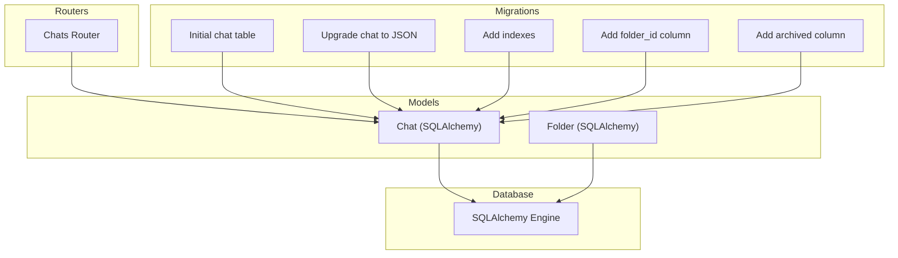
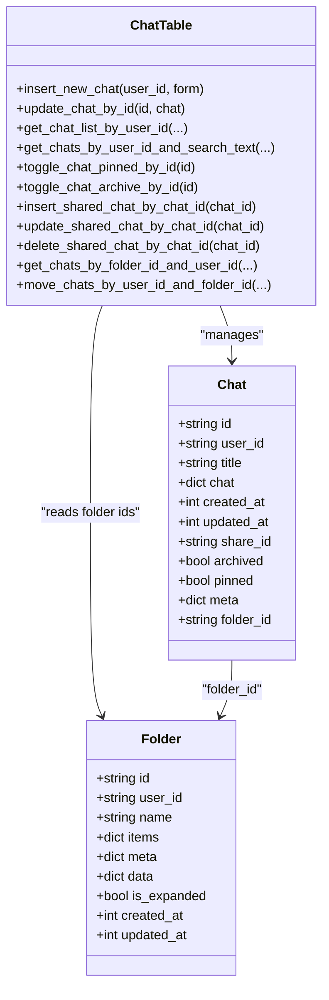
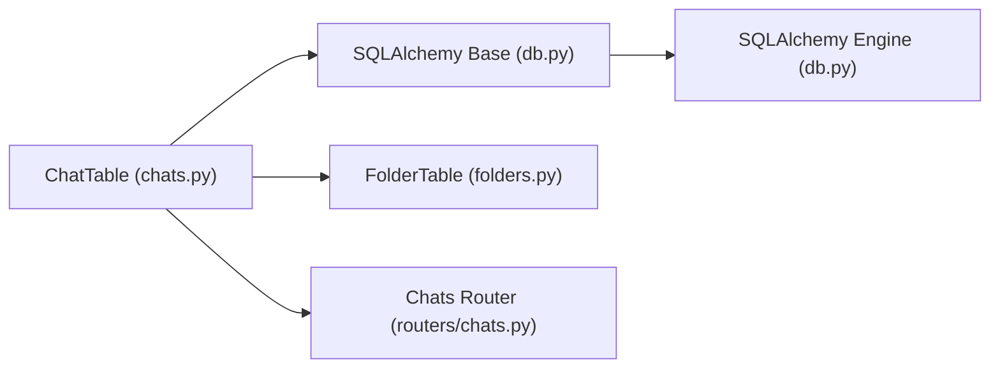

# Chat Model

<cite>
**Referenced Files in This Document**
- [chats.py](file://backend/open_webui/models/chats.py)
- [folders.py](file://backend/open_webui/models/folders.py)
- [db.py](file://backend/open_webui/internal/db.py)
- [018012973d35_add_indexes.py](file://backend/open_webui/migrations/versions/018012973d35_add_indexes.py)
- [242a2047eae0_update_chat_table.py](file://backend/open_webui/migrations/versions/242a2047eae0_update_chat_table.py)
- [7e5b5dc7342b_init.py](file://backend/open_webui/migrations/versions/7e5b5dc7342b_init.py)
- [c69f45358db4_add_folder_table.py](file://backend/open_webui/migrations/versions/c69f45358db4_add_folder_table.py)
- [004_add_archived.py](file://backend/open_webui/internal/migrations/004_add_archived.py)
- [chats.py](file://backend/open_webui/routers/chats.py)
</cite>

## Table of Contents
1. [Introduction](#introduction)
2. [Project Structure](#project-structure)
3. [Core Components](#core-components)
4. [Architecture Overview](#architecture-overview)
5. [Detailed Component Analysis](#detailed-component-analysis)
6. [Dependency Analysis](#dependency-analysis)
7. [Performance Considerations](#performance-considerations)
8. [Troubleshooting Guide](#troubleshooting-guide)
9. [Conclusion](#conclusion)

## Introduction
This document describes the Chat ORM model used by the open-webui backend. It covers the entity schema, JSON-based chat storage, indexes, relationships to Users and Folders, and operational patterns for common tasks such as retrieving recent chats, filtering by archive/pin status, and organizing by folder. It also explains data lifecycle management including creation, updates, archiving, and sharing via share_id.

## Project Structure
The Chat model is defined in the backend models layer and is used by routers and services. The database schema is managed via Alembic migrations, and the database engine/session is configured in the internal database module.

**Diagram sources**
- [chats.py](file://backend/open_webui/models/chats.py#L26-L56)
- [folders.py](file://backend/open_webui/models/folders.py#L24-L36)
- [018012973d35_add_indexes.py](file://backend/open_webui/migrations/versions/018012973d35_add_indexes.py#L18-L24)
- [242a2047eae0_update_chat_table.py](file://backend/open_webui/migrations/versions/242a2047eae0_update_chat_table.py#L21-L79)
- [7e5b5dc7342b_init.py](file://backend/open_webui/migrations/versions/7e5b5dc7342b_init.py#L39-L52)
- [c69f45358db4_add_folder_table.py](file://backend/open_webui/migrations/versions/c69f45358db4_add_folder_table.py#L18-L45)
- [004_add_archived.py](file://backend/open_webui/internal/migrations/004_add_archived.py#L37-L41)
- [db.py](file://backend/open_webui/internal/db.py#L148-L154)

**Section sources**
- [chats.py](file://backend/open_webui/models/chats.py#L26-L56)
- [db.py](file://backend/open_webui/internal/db.py#L148-L154)

## Core Components
- Chat SQLAlchemy model defines the persistent schema for chats, including identifiers, ownership, metadata, and JSON content.
- ChatTable provides the ORM-backed service layer with methods for CRUD, search, tagging, pinning, archiving, and sharing.
- Folder model and FolderTable define folder organization and are referenced by Chat via folder_id.

Key attributes of the Chat model:
- id: string, primary key
- user_id: string, links chat to a user
- title: text, human-readable chat title
- chat: JSON, stores conversational history and metadata
- created_at: integer epoch timestamp
- updated_at: integer epoch timestamp
- share_id: text, unique identifier for shared chat copies
- archived: boolean, marks chat as archived
- pinned: boolean, marks chat as pinned
- meta: JSON, free-form metadata (e.g., tags)
- folder_id: text, optional folder association

**Section sources**
- [chats.py](file://backend/open_webui/models/chats.py#L26-L56)
- [chats.py](file://backend/open_webui/models/chats.py#L59-L76)
- [folders.py](file://backend/open_webui/models/folders.py#L24-L36)

## Architecture Overview
The Chat model participates in two primary relationships:
- User relationship: user_id is a foreign key to the user identity (via application-level logic). There is no explicit foreign key constraint in the schema definition.
- Folder relationship: folder_id references the Folder.id. There is no explicit foreign key constraint in the schema definition.

Indexes defined in __table_args__ optimize common queries:
- folder_id_idx: supports folder-scoped lookups
- user_id_pinned_idx: supports user + pinned filtering
- user_id_archived_idx: supports user + archived filtering
- updated_at_user_id_idx: supports user-centric sorted retrieval
- folder_id_user_id_idx: supports combined folder + user filtering

**Diagram sources**
- [chats.py](file://backend/open_webui/models/chats.py#L26-L56)
- [chats.py](file://backend/open_webui/models/chats.py#L129-L1175)
- [folders.py](file://backend/open_webui/models/folders.py#L24-L36)

**Section sources**
- [chats.py](file://backend/open_webui/models/chats.py#L26-L56)
- [chats.py](file://backend/open_webui/models/chats.py#L129-L1175)
- [folders.py](file://backend/open_webui/models/folders.py#L24-L36)

## Detailed Component Analysis

### Entity Schema and JSON Storage
- The chat field is stored as JSON. The initial schema used TEXT, later migrated to JSON. The migration converts TEXT to JSON and populates the new column while dropping the old column.
- The chat JSON structure is interpreted by the service layer to access fields such as title and history. Methods demonstrate reading/writing history and message maps.

Implications for querying and performance:
- JSON queries require dialect-specific handling (SQLite JSON1 vs PostgreSQL JSON/JSONB operators).
- Searching within chat content is supported via SQL-level JSON operators and is paginated.
- JSON storage enables flexible schema evolution but can increase storage and complicate indexing.

Common operations:
- Insert new chat: creates a new record with sanitized title and chat content.
- Update chat: replaces the entire chat JSON and refreshes timestamps.
- Retrieve chat by id: returns the ChatModel with sanitization checks.
- Search chats: supports text search across title and messages, plus filters by tags, folders, pinned/archived/shared states.

**Section sources**
- [242a2047eae0_update_chat_table.py](file://backend/open_webui/migrations/versions/242a2047eae0_update_chat_table.py#L21-L79)
- [7e5b5dc7342b_init.py](file://backend/open_webui/migrations/versions/7e5b5dc7342b_init.py#L39-L52)
- [chats.py](file://backend/open_webui/models/chats.py#L167-L191)
- [chats.py](file://backend/open_webui/models/chats.py#L231-L248)
- [chats.py](file://backend/open_webui/models/chats.py#L632-L646)
- [chats.py](file://backend/open_webui/models/chats.py#L800-L914)

### Indexes and Query Optimization
Indexes defined in __table_args__:
- folder_id_idx: B-tree index on folder_id
- user_id_pinned_idx: composite index on (user_id, pinned)
- user_id_archived_idx: composite index on (user_id, archived)
- updated_at_user_id_idx: composite index on (updated_at, user_id)
- folder_id_user_id_idx: composite index on (folder_id, user_id)

Purpose:
- folder_id_idx: efficient retrieval of chats by folder
- user_id_pinned_idx: efficient filtering by user and pinned state
- user_id_archived_idx: efficient filtering by user and archived state
- updated_at_user_id_idx: efficient user-centric sorting by last updated
- folder_id_user_id_idx: efficient combined folder + user filtering

**Section sources**
- [chats.py](file://backend/open_webui/models/chats.py#L44-L56)
- [018012973d35_add_indexes.py](file://backend/open_webui/migrations/versions/018012973d35_add_indexes.py#L18-L24)

### Relationships and Foreign Keys
- Relationship with Users: user_id is present and used extensively in queries and operations. No explicit foreign key constraint is defined in the SQLAlchemy model.
- Relationship with Folders: folder_id is present and used for grouping chats. No explicit foreign key constraint is defined in the SQLAlchemy model. The Folder model defines its own schema.

Operational impact:
- Application-level enforcement is required to maintain referential integrity if foreign keys are not enforced at the database level.
- Folder-related operations rely on FolderTable to resolve folder names and IDs.

**Section sources**
- [chats.py](file://backend/open_webui/models/chats.py#L26-L56)
- [folders.py](file://backend/open_webui/models/folders.py#L24-L36)
- [c69f45358db4_add_folder_table.py](file://backend/open_webui/migrations/versions/c69f45358db4_add_folder_table.py#L18-L45)

### Data Lifecycle Management
Creation:
- New chats are inserted with sanitized title and chat content, setting created_at and updated_at to the current epoch.

Updates:
- Updating chat content replaces the entire chat JSON and refreshes updated_at.
- Updating title modifies the title within the chat JSON and persists updated_at.

Archiving and Pinning:
- Toggle archive/unarchive updates the archived flag and resets folder_id when archiving.
- Toggle pinned updates the pinned flag and refreshes updated_at.

Sharing:
- Sharing a chat duplicates the record under a synthetic user_id prefix and sets share_id on the original chat. Subsequent updates to the shared copy update the shared record and refresh timestamps.

Deletion:
- Deleting a chat removes the record and attempts to delete associated shared chats.

**Section sources**
- [chats.py](file://backend/open_webui/models/chats.py#L167-L191)
- [chats.py](file://backend/open_webui/models/chats.py#L231-L248)
- [chats.py](file://backend/open_webui/models/chats.py#L370-L404)
- [chats.py](file://backend/open_webui/models/chats.py#L405-L428)
- [chats.py](file://backend/open_webui/models/chats.py#L429-L438)
- [chats.py](file://backend/open_webui/models/chats.py#L473-L483)
- [chats.py](file://backend/open_webui/models/chats.py#L461-L472)
- [chats.py](file://backend/open_webui/models/chats.py#L1102-L1121)

### Common Operations and Examples
Retrieving recent chats:
- Use get_chat_list_by_user_id with ordering by updated_at descending and optional pagination.

Filtering by archive/pin status:
- Use get_archived_chats_by_user_id for archived-only lists.
- Use get_pinned_chats_by_user_id for pinned-only lists.
- Use get_chat_list_by_user_id with include_archived flag to include or exclude archived.

Organizing by folder:
- Use get_chats_by_folder_id_and_user_id or get_chats_by_folder_ids_and_user_id to list chats within a folder.
- Move chats between folders via update_chat_folder_id_by_id_and_user_id and move_chats_by_user_id_and_folder_id.

Searching and filtering:
- get_chats_by_user_id_and_search_text supports text search across title and messages, plus filters by tags, folders, pinned/archived/shared states.

**Section sources**
- [chats.py](file://backend/open_webui/models/chats.py#L535-L572)
- [chats.py](file://backend/open_webui/models/chats.py#L495-L534)
- [chats.py](file://backend/open_webui/models/chats.py#L687-L704)
- [chats.py](file://backend/open_webui/models/chats.py#L687-L694)
- [chats.py](file://backend/open_webui/models/chats.py#L915-L947)
- [chats.py](file://backend/open_webui/models/chats.py#L705-L914)

### API Usage Patterns
Routers coordinate user-facing operations:
- Create new chat: POST /chats/new
- Import chats: POST /chats/import
- List chats: GET /chats/list
- Search chats: GET /chats/search
- Admin access to user chat lists: GET /chats/list/user/{user_id}

These endpoints delegate to ChatTable methods for persistence and retrieval.

**Section sources**
- [chats.py](file://backend/open_webui/routers/chats.py#L133-L143)
- [chats.py](file://backend/open_webui/routers/chats.py#L150-L159)
- [chats.py](file://backend/open_webui/routers/chats.py#L38-L67)
- [chats.py](file://backend/open_webui/routers/chats.py#L167-L194)
- [chats.py](file://backend/open_webui/routers/chats.py#L94-L126)

## Dependency Analysis
- ChatTable depends on SQLAlchemy Base and get_db for sessions.
- ChatTable uses FolderTable to resolve folder names and IDs during search.
- Database engine and session are configured centrally in db.py.

**Diagram sources**
- [chats.py](file://backend/open_webui/models/chats.py#L129-L1175)
- [folders.py](file://backend/open_webui/models/folders.py#L86-L367)
- [db.py](file://backend/open_webui/internal/db.py#L148-L154)
- [chats.py](file://backend/open_webui/routers/chats.py#L1-L200)

**Section sources**
- [chats.py](file://backend/open_webui/models/chats.py#L129-L1175)
- [folders.py](file://backend/open_webui/models/folders.py#L86-L367)
- [db.py](file://backend/open_webui/internal/db.py#L148-L154)

## Performance Considerations
- JSON storage: Enables flexible content but can increase storage and complicate indexing. Queries against JSON fields use dialect-specific operators and are executed at SQL level.
- Indexes: The five indexes target common access patterns. Ensure they remain aligned with query workloads.
- Pagination: Many operations support skip/limit to control result size.
- Sanitization: Title and chat content are sanitized to remove null bytes before persistence, reducing corruption risks.

[No sources needed since this section provides general guidance]

## Troubleshooting Guide
- JSON conversion errors: During migration from TEXT to JSON, malformed JSON is handled by setting null values. Verify chat content validity if unexpected nulls appear.
- Unsupported dialect: The search logic raises an error for unsupported SQL dialects. Ensure the configured database is SQLite or PostgreSQL.
- Shared chat deletion: Deleting a chat attempts to remove associated shared chats. If failures occur, verify the share_id linkage and shared chat records.

**Section sources**
- [242a2047eae0_update_chat_table.py](file://backend/open_webui/migrations/versions/242a2047eae0_update_chat_table.py#L60-L75)
- [chats.py](file://backend/open_webui/models/chats.py#L902-L905)
- [chats.py](file://backend/open_webui/models/chats.py#L1102-L1121)

## Conclusion
The Chat model provides a robust foundation for storing conversational histories as JSON, with indexes tailored to frequent access patterns. Its relationships with Users and Folders are enforced at the application level via user_id and folder_id fields. The ChatTable service layer encapsulates lifecycle operations, search, tagging, pinning, archiving, and sharing, enabling efficient and scalable chat management.