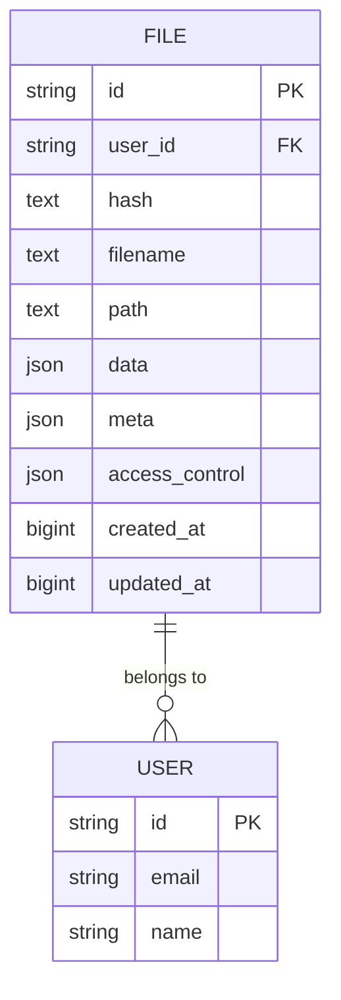
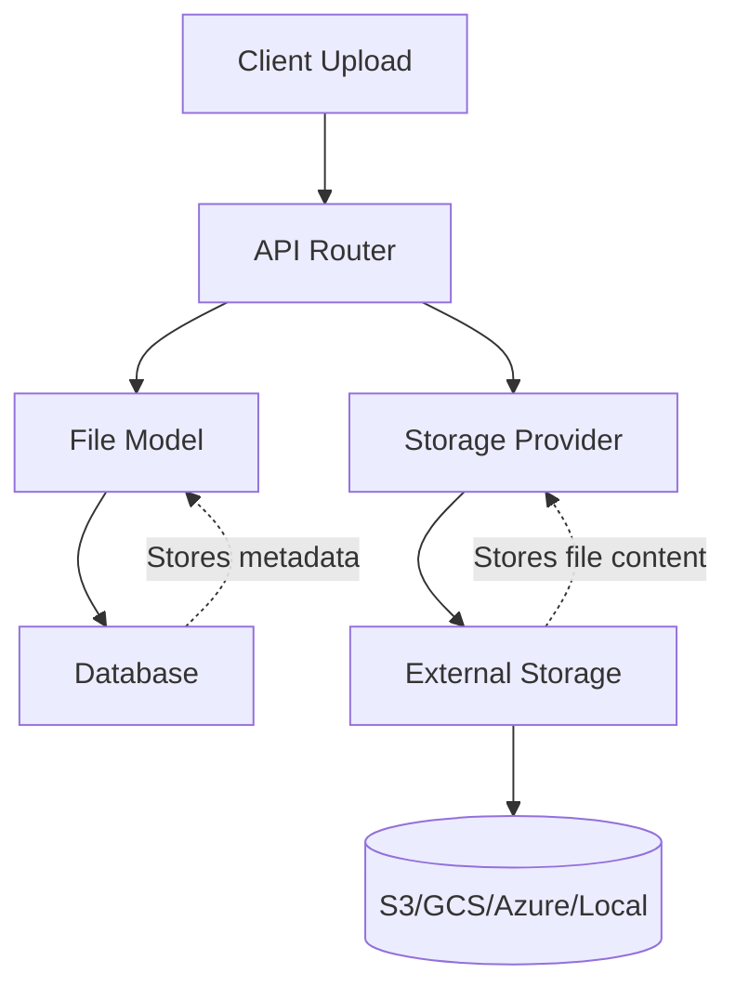
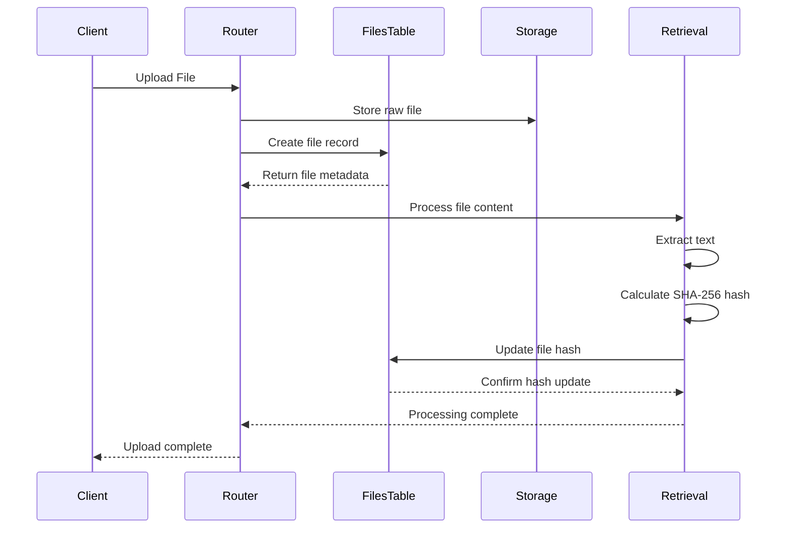
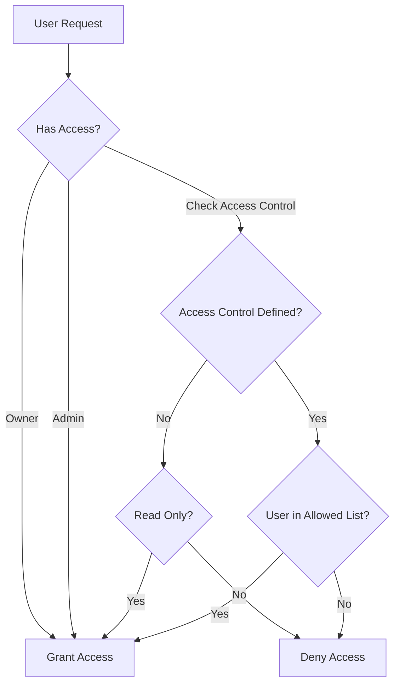
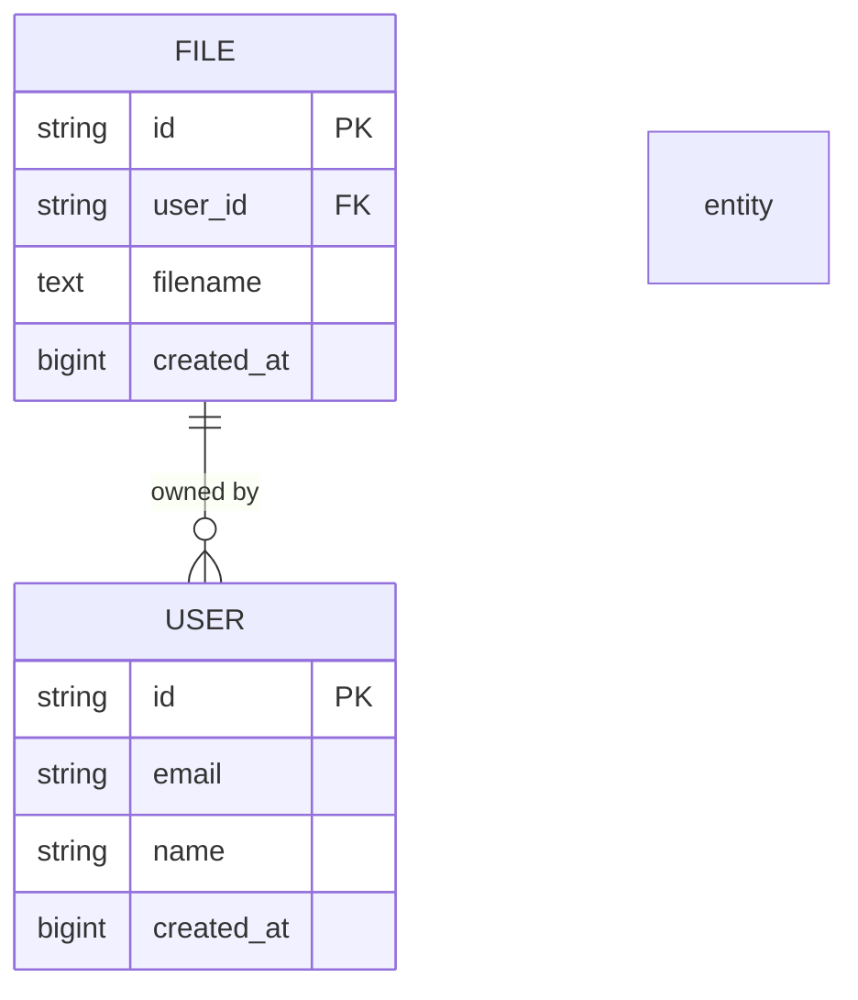
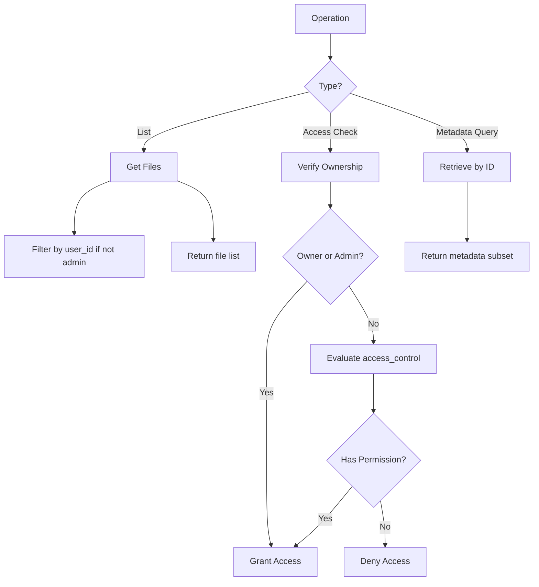
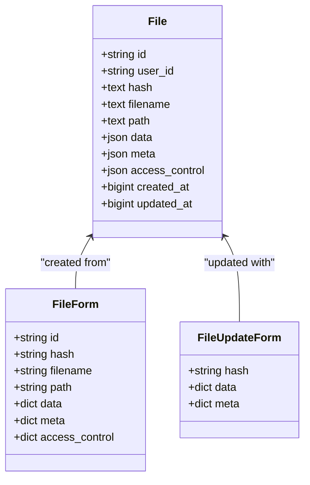

# File Model

<cite>
**Referenced Files in This Document**   
- [files.py](file://backend/open_webui/models/files.py)
- [provider.py](file://backend/open_webui/storage/provider.py)
- [retrieval.py](file://backend/open_webui/routers/retrieval.py)
- [access_control.py](file://backend/open_webui/utils/access_control.py)
- [users.py](file://backend/open_webui/models/users.py)
</cite>

## Table of Contents
1. [Introduction](#introduction)
2. [Entity Structure](#entity-structure)
3. [File Metadata and External Storage](#file-metadata-and-external-storage)
4. [Hash Field for Integrity and Deduplication](#hash-field-for-integrity-and-deduplication)
5. [Access Control System](#access-control-system)
6. [User Relationship and Ownership](#user-relationship-and-ownership)
7. [Common Operations](#common-operations)
8. [Flexible JSON Fields](#flexible-json-fields)
9. [Conclusion](#conclusion)

## Introduction
The File model in open-webui serves as a central component for managing file metadata within the application. It tracks essential information about uploaded files while delegating actual file storage to external systems. This documentation provides a comprehensive overview of the File ORM model, detailing its structure, relationships, and functionality. The model enables robust file management with features like access control, integrity verification, and flexible metadata storage, all while maintaining separation between metadata and physical file storage.

**Section sources**
- [files.py](file://backend/open_webui/models/files.py#L1-L290)

## Entity Structure
The File model defines a comprehensive schema for tracking file information with the following fields:

- **id**: Primary key and unique identifier for the file
- **user_id**: Reference to the user who uploaded the file
- **hash**: SHA-256 hash of the file content for integrity verification and duplicate detection
- **filename**: Original name of the uploaded file
- **path**: Storage path or URI pointing to the physical file location
- **data**: JSON field storing processing status, content, and other dynamic information
- **meta**: JSON field containing file metadata such as content type, size, and additional properties
- **access_control**: JSON field defining permission rules for file access
- **created_at**: Timestamp (epoch) when the file was created
- **updated_at**: Timestamp (epoch) when the file was last modified

The model is implemented using SQLAlchemy with appropriate field types: String for id and user_id, Text for hash and path, JSON for data, meta, and access_control fields, and BigInteger for timestamps.



**Diagram sources **
- [files.py](file://backend/open_webui/models/files.py#L18-L33)

**Section sources**
- [files.py](file://backend/open_webui/models/files.py#L18-L33)

## File Metadata and External Storage
The File model implements a separation between metadata management and physical file storage. While the database stores comprehensive metadata about each file, the actual file content is stored externally through a pluggable storage system.

The storage architecture supports multiple providers including local storage, Amazon S3, Google Cloud Storage (GCS), and Azure Blob Storage. The `Storage` class in the provider module implements an abstract base class with concrete implementations for each storage backend. When a file is uploaded, it's stored through the configured provider, and the resulting path is recorded in the `path` field of the File model.

The `meta` field contains essential metadata extracted during upload, including:
- name: Original filename
- content_type: MIME type of the file
- size: File size in bytes
- data: Additional metadata provided during upload

This separation allows the application to scale storage independently of the database and supports cloud-native deployments where files may be stored in distributed object storage systems.



**Diagram sources **
- [files.py](file://backend/open_webui/models/files.py#L24-L29)
- [provider.py](file://backend/open_webui/storage/provider.py#L43-L377)

**Section sources**
- [files.py](file://backend/open_webui/models/files.py#L24-L29)
- [provider.py](file://backend/open_webui/storage/provider.py#L43-L377)

## Hash Field for Integrity and Deduplication
The `hash` field in the File model plays a critical role in ensuring data integrity and preventing duplicate file processing. It stores the SHA-256 hash of the file's processed content, which is calculated after the file has been extracted and prepared for use within the system.

The hash is generated using the `calculate_sha256_string` function when a file is processed, typically during ingestion into the vector database for retrieval purposes. This occurs in the retrieval module where the processed text content is hashed and stored in the file record. The hash serves multiple purposes:

1. **Integrity Verification**: By comparing the stored hash with a recalculated hash of the current content, the system can verify that the file content hasn't been corrupted or altered.

2. **Duplicate Detection**: When processing new files, the system can check if a file with the same hash already exists, preventing redundant processing and storage of identical content.

3. **Content Identification**: The hash provides a unique fingerprint of the processed content, which can be used as a collection name in the vector database.

The hash is updated through the `update_file_hash_by_id` method of the FilesTable class, which is called after successful processing of a file's content. This ensures that only successfully processed files have their hashes recorded.



**Diagram sources **
- [files.py](file://backend/open_webui/models/files.py#L236-L245)
- [retrieval.py](file://backend/open_webui/routers/retrieval.py#L1599-L1600)

**Section sources**
- [files.py](file://backend/open_webui/models/files.py#L236-L245)
- [retrieval.py](file://backend/open_webui/routers/retrieval.py#L1599-L1600)

## Access Control System
The File model implements a sophisticated access control system through the `access_control` JSON field, which defines permission rules for file access at various levels. This field supports three main access patterns:

1. **Public Access**: When `access_control` is null (None), the file is publicly accessible to all users with the "user" role.

2. **Private Access**: When `access_control` is an empty object ({}), the file is private and restricted exclusively to the owner.

3. **Custom Permissions**: When `access_control` contains a structured object, it defines specific access control rules for reading and writing, with support for group and user-level restrictions.

The access control structure follows this format:
```json
{
  "read": {
    "group_ids": ["group_id1", "group_id2"],
    "user_ids": ["user_id1", "user_id2"]
  },
  "write": {
    "group_ids": ["group_id1", "group_id2"],
    "user_ids": ["user_id1", "user_id2"]
  }
}
```

The system uses the `has_access` function from the access_control utility to evaluate permissions. This function checks if a user has the required permission level (read or write) by examining:
- Whether the user is the file owner
- Whether the user belongs to any groups with access permissions
- Whether the user's ID is explicitly listed in the access control rules

The access control system integrates with the Groups model to support team-based collaboration, allowing files to be shared with specific groups of users.



**Diagram sources **
- [files.py](file://backend/open_webui/models/files.py#L30-L31)
- [access_control.py](file://backend/open_webui/utils/access_control.py#L124-L150)

**Section sources**
- [files.py](file://backend/open_webui/models/files.py#L30-L31)
- [access_control.py](file://backend/open_webui/utils/access_control.py#L124-L150)

## User Relationship and Ownership
The File model establishes a clear ownership relationship with users through the `user_id` field, which creates a foreign key relationship to the User model. This relationship defines the fundamental ownership semantics where each file belongs to a specific user who has full control over it.

When a file is created, the `user_id` is set to the ID of the authenticated user who uploaded the file. This owner has implicit read and write access to the file regardless of the access_control settings. The relationship enables several key functionalities:

1. **Ownership Verification**: The system can quickly verify if a user owns a file by comparing the user_id field with the current user's ID.

2. **User-Specific Queries**: The model supports efficient queries for retrieving all files belonging to a specific user through the `get_files_by_user_id` method.

3. **Access Control Foundation**: Ownership forms the basis of the access control system, where owners always have full permissions even if not explicitly listed in access_control rules.

4. **Data Isolation**: In multi-tenant scenarios, the user_id enables data isolation, ensuring users can only access their own files by default.

The relationship is implemented at the database level with no formal foreign key constraint but is enforced at the application level through business logic in the FilesTable class methods that always validate user ownership when performing operations.



**Diagram sources **
- [files.py](file://backend/open_webui/models/files.py#L21-L22)
- [users.py](file://backend/open_webui/models/users.py#L48-L53)

**Section sources**
- [files.py](file://backend/open_webui/models/files.py#L21-L22)
- [users.py](file://backend/open_webui/models/users.py#L48-L53)

## Common Operations
The File model supports several common operations through the FilesTable class methods, enabling comprehensive file management capabilities:

### File Listing
Files can be retrieved through various methods:
- `get_files()`: Returns all files (admin only)
- `get_files_by_user_id(user_id)`: Returns files owned by a specific user
- `get_files_by_ids(ids)`: Returns files with specified IDs

These methods support both complete file records and metadata-only responses through the `get_file_metadatas_by_ids` method, which retrieves only essential metadata fields for performance optimization.

### Access Control Checks
The system performs access control checks through a combination of:
1. Direct ownership verification (user_id comparison)
2. Role-based checks (admin users have full access)
3. Access control rule evaluation using the `has_access` function
4. Knowledge base inheritance (files accessible through associated knowledge bases)

### Metadata Queries
The model supports flexible metadata queries through:
- Direct ID-based lookups (`get_file_by_id`)
- User-specific queries (`get_files_by_user_id`)
- Combined metadata retrieval (`get_file_metadata_by_id`)
- Batch operations (`get_files_by_ids`)

These operations are optimized with appropriate database queries and include error handling for cases where files do not exist or access is denied.



**Diagram sources **
- [files.py](file://backend/open_webui/models/files.py#L132-L287)

**Section sources**
- [files.py](file://backend/open_webui/models/files.py#L132-L287)

## Flexible JSON Fields
The File model leverages JSON fields (`data`, `meta`, and `access_control`) to provide flexible storage for file-specific information and processing results. This approach enables schema flexibility without requiring database migrations for new attributes.

### Data Field
The `data` field stores dynamic information related to file processing and status:
- status: Processing state (pending, completed, failed)
- error: Error message if processing failed
- content: Extracted text content for retrieval
- Other processing-specific metadata

The field is updated using a merge strategy in the `update_file_data_by_id` method, which combines new data with existing values rather than overwriting the entire field.

### Meta Field
The `meta` field contains file metadata with a defined structure:
- name: Original filename
- content_type: MIME type
- size: File size in bytes
- data: Additional metadata provided during upload

This field was migrated from a Text/JSONField to a native JSON type in a database migration, improving query capabilities and data integrity.

### Update Strategy
Both JSON fields use a merge update strategy that preserves existing data while incorporating new values:
```python
file.data = {**(file.data if file.data else {}), **form_data.data}
file.meta = {**(file.meta if file.meta else {}), **form_data.meta}
```

This approach ensures that updates don't inadvertently remove existing metadata and supports incremental updates to file records.



**Diagram sources **
- [files.py](file://backend/open_webui/models/files.py#L27-L29)
- [files.py](file://backend/open_webui/models/files.py#L91-L105)

**Section sources**
- [files.py](file://backend/open_webui/models/files.py#L27-L29)
- [files.py](file://backend/open_webui/models/files.py#L91-L105)

## Conclusion
The File model in open-webui provides a robust foundation for file management with a clear separation between metadata storage and physical file storage. By tracking essential file information in the database while delegating actual storage to external systems, the model achieves scalability and flexibility. The comprehensive access control system enables fine-grained permission management, supporting both individual and team-based workflows. The use of JSON fields for flexible metadata storage allows the system to adapt to evolving requirements without schema changes. The hash field implementation provides critical functionality for integrity verification and duplicate detection, ensuring data quality within the system. Together, these features create a powerful file management system that supports the core functionality of the open-webui application.