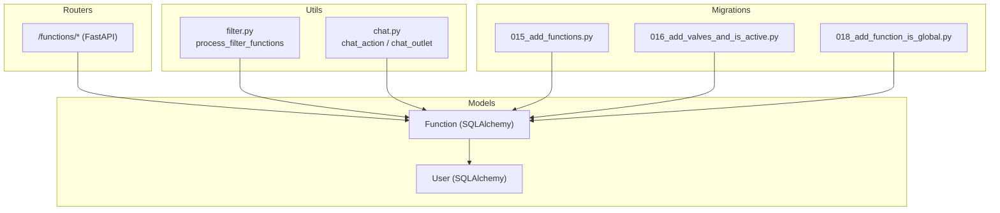
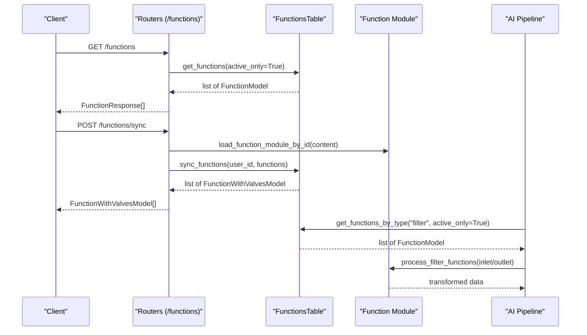
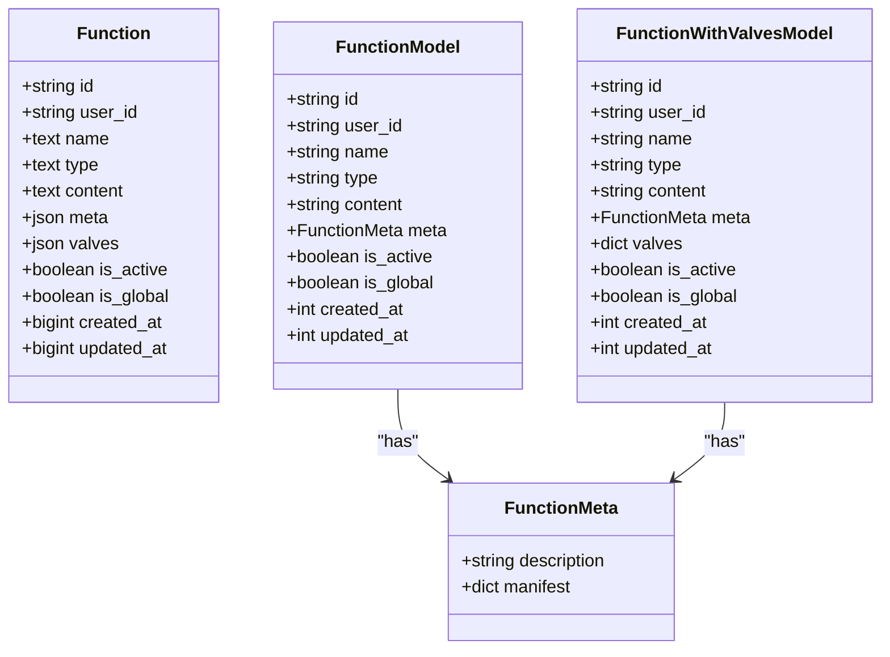
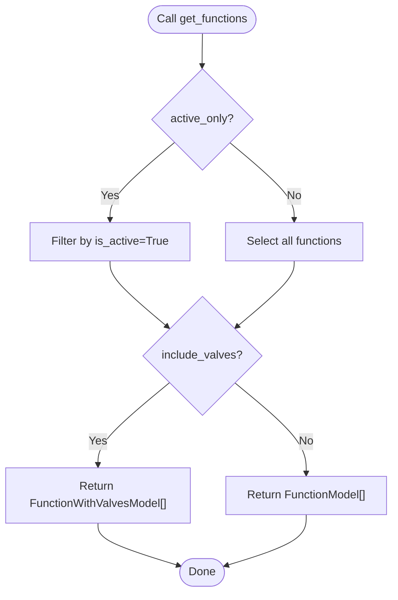
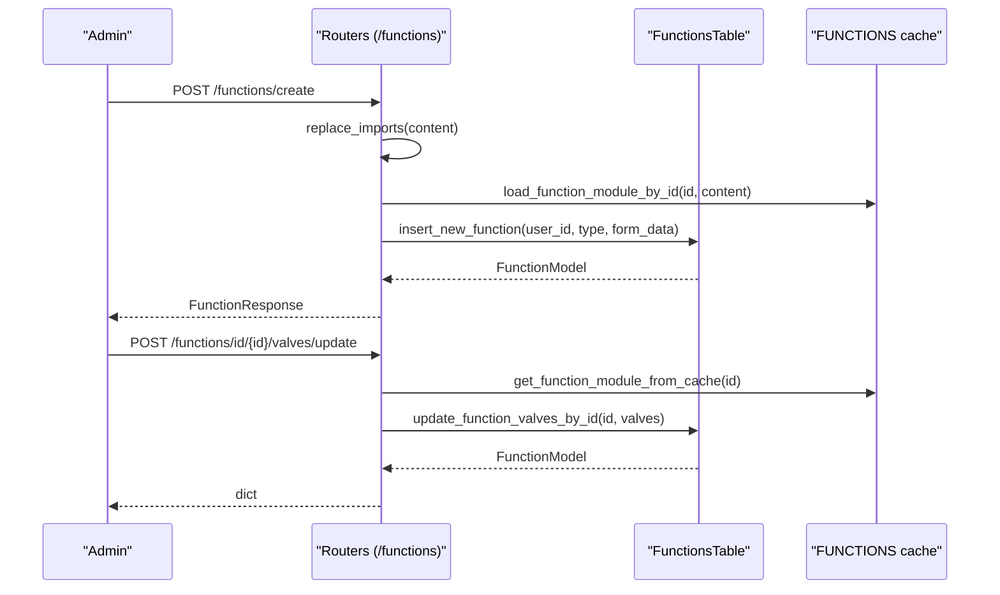
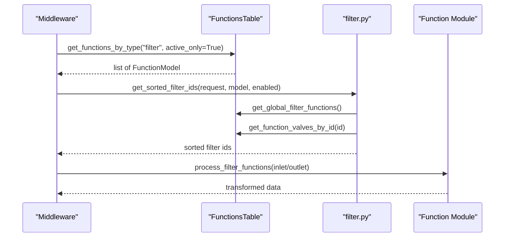
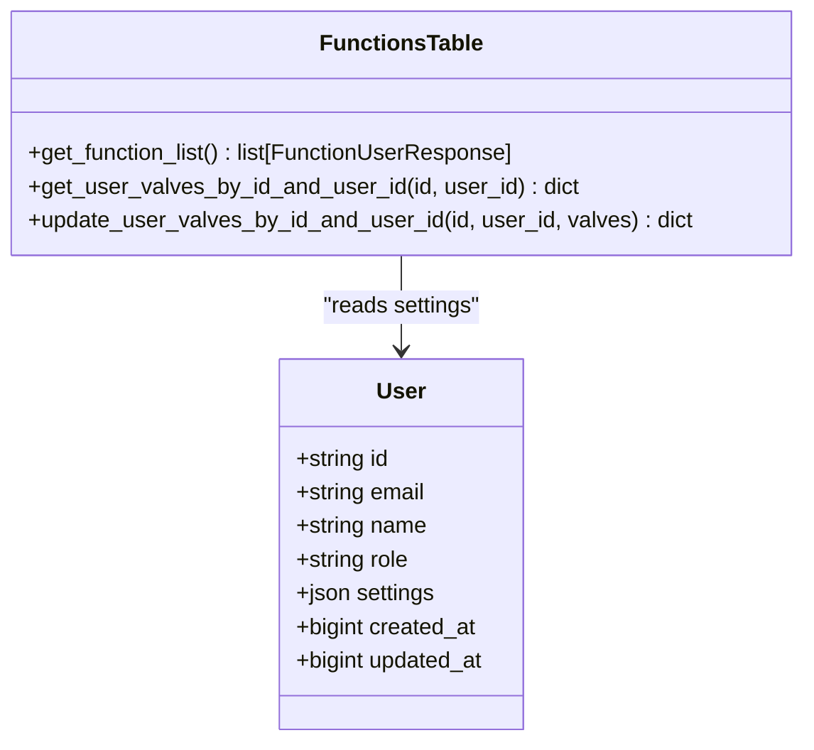
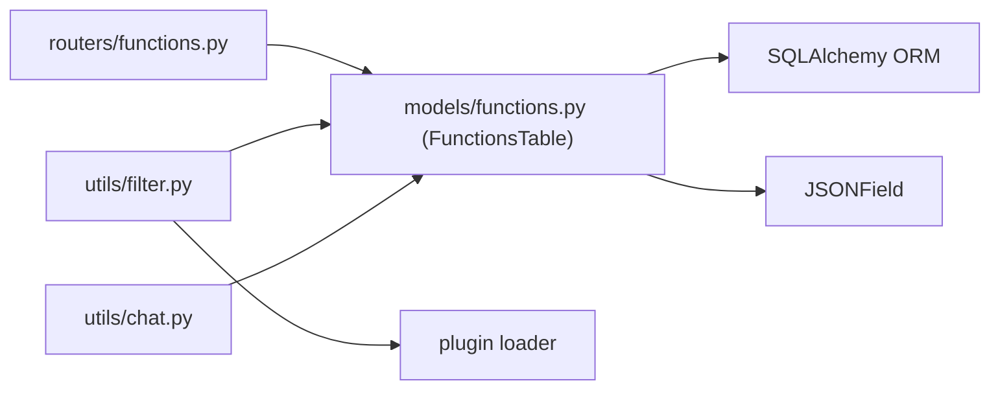

# Function Configuration Model

<cite>
**Referenced Files in This Document**
- [models/functions.py](file://backend/open_webui/models/functions.py)
- [routers/functions.py](file://backend/open_webui/routers/functions.py)
- [utils/filter.py](file://backend/open_webui/utils/filter.py)
- [utils/chat.py](file://backend/open_webui/utils/chat.py)
- [internal/migrations/015_add_functions.py](file://backend/open_webui/internal/migrations/015_add_functions.py)
- [internal/migrations/016_add_valves_and_is_active.py](file://backend/open_webui/internal/migrations/016_add_valves_and_is_active.py)
- [internal/migrations/018_add_function_is_global.py](file://backend/open_webui/internal/migrations/018_add_function_is_global.py)
- [models/users.py](file://backend/open_webui/models/users.py)
</cite>

## Table of Contents
1. [Introduction](#introduction)
2. [Project Structure](#project-structure)
3. [Core Components](#core-components)
4. [Architecture Overview](#architecture-overview)
5. [Detailed Component Analysis](#detailed-component-analysis)
6. [Dependency Analysis](#dependency-analysis)
7. [Performance Considerations](#performance-considerations)
8. [Troubleshooting Guide](#troubleshooting-guide)
9. [Conclusion](#conclusion)

## Introduction
This document describes the Function ORM model used to store reusable functions that can be invoked by AI systems. It covers the entity schema, indexing, relationships with Users, and operational semantics for managing function availability, global scope, and configurable parameters (valves). It also explains how these functions integrate with the AI pipeline via filter/action handlers and how to discover and validate access to functions.

## Project Structure
The Function model is defined in the backend models layer and exposed via FastAPI routers. It integrates with the AI pipeline through filter/action processing utilities. Migrations define the initial schema and subsequent additions (valves, activation flag, global flag).

**Diagram sources**
- [models/functions.py](file://backend/open_webui/models/functions.py#L1-L120)
- [routers/functions.py](file://backend/open_webui/routers/functions.py#L1-L120)
- [utils/filter.py](file://backend/open_webui/utils/filter.py#L1-L137)
- [utils/chat.py](file://backend/open_webui/utils/chat.py#L374-L419)
- [internal/migrations/015_add_functions.py](file://backend/open_webui/internal/migrations/015_add_functions.py#L37-L61)
- [internal/migrations/016_add_valves_and_is_active.py](file://backend/open_webui/internal/migrations/016_add_valves_and_is_active.py#L37-L51)
- [internal/migrations/018_add_function_is_global.py](file://backend/open_webui/internal/migrations/018_add_function_is_global.py#L37-L50)

**Section sources**
- [models/functions.py](file://backend/open_webui/models/functions.py#L1-L120)
- [routers/functions.py](file://backend/open_webui/routers/functions.py#L1-L120)
- [utils/filter.py](file://backend/open_webui/utils/filter.py#L1-L137)
- [utils/chat.py](file://backend/open_webui/utils/chat.py#L374-L419)
- [internal/migrations/015_add_functions.py](file://backend/open_webui/internal/migrations/015_add_functions.py#L37-L61)
- [internal/migrations/016_add_valves_and_is_active.py](file://backend/open_webui/internal/migrations/016_add_valves_and_is_active.py#L37-L51)
- [internal/migrations/018_add_function_is_global.py](file://backend/open_webui/internal/migrations/018_add_function_is_global.py#L37-L50)

## Core Components
- Function ORM entity: stores function metadata, content, and configuration flags.
- Pydantic models: typed representations for API responses and forms.
- FunctionsTable: persistence and query helpers for CRUD and discovery.
- Routers: HTTP endpoints to manage functions and valves.
- Utilities: filter/action processing that invokes function handlers.

Key attributes:
- id: unique identifier for the function.
- user_id: owner of the function.
- name, type, content: human-readable name, category, and source code.
- meta: JSON metadata (e.g., description, manifest).
- valves: JSON configuration for function behavior.
- is_active: enables/disables function availability.
- is_global: makes function available system-wide.
- created_at, updated_at: timestamps.

Indexes:
- is_global_idx: index on is_global to optimize global function discovery.

Relationships:
- Functions belong to Users via user_id.

**Section sources**
- [models/functions.py](file://backend/open_webui/models/functions.py#L18-L35)
- [models/functions.py](file://backend/open_webui/models/functions.py#L37-L72)
- [models/functions.py](file://backend/open_webui/models/functions.py#L106-L120)
- [models/users.py](file://backend/open_webui/models/users.py#L45-L76)

## Architecture Overview
The Function model underpins two primary AI capabilities:
- Filters: pre/post-process AI requests/responses.
- Actions: trigger external operations based on user intent.

The system discovers active functions, loads their modules, applies valves, and executes handler functions (e.g., inlet/outlet/stream).

**Diagram sources**
- [routers/functions.py](file://backend/open_webui/routers/functions.py#L41-L90)
- [routers/functions.py](file://backend/open_webui/routers/functions.py#L145-L176)
- [utils/filter.py](file://backend/open_webui/utils/filter.py#L60-L137)
- [models/functions.py](file://backend/open_webui/models/functions.py#L190-L210)
- [models/functions.py](file://backend/open_webui/models/functions.py#L232-L248)

## Detailed Component Analysis

### Function ORM Entity and Pydantic Models
- SQLAlchemy model defines columns for id, user_id, name, type, content, meta, valves, is_active, is_global, timestamps, and an index on is_global.
- Pydantic models provide typed serialization/deserialization for API responses and forms, including optional valves and metadata.

**Diagram sources**
- [models/functions.py](file://backend/open_webui/models/functions.py#L18-L35)
- [models/functions.py](file://backend/open_webui/models/functions.py#L37-L72)

**Section sources**
- [models/functions.py](file://backend/open_webui/models/functions.py#L18-L35)
- [models/functions.py](file://backend/open_webui/models/functions.py#L37-L72)

### FunctionsTable: Persistence and Discovery
- Insert, sync, get by id, list, filter by type, and global discovery helpers.
- Global filter/action discovery helpers return active, global functions by type.
- Valves management: get, update function valves; get/update user-specific valves stored in user settings.
- Metadata updates and deactivation bulk update.

**Diagram sources**
- [models/functions.py](file://backend/open_webui/models/functions.py#L190-L210)

**Section sources**
- [models/functions.py](file://backend/open_webui/models/functions.py#L106-L181)
- [models/functions.py](file://backend/open_webui/models/functions.py#L190-L210)
- [models/functions.py](file://backend/open_webui/models/functions.py#L232-L266)
- [models/functions.py](file://backend/open_webui/models/functions.py#L267-L393)

### API Endpoints: Management and Valves
- Retrieve functions, export with valves, load from URL, sync, create, toggle activation, toggle global, update, delete.
- Manage function valves and user-specific valves via dedicated endpoints.

**Diagram sources**
- [routers/functions.py](file://backend/open_webui/routers/functions.py#L183-L234)
- [routers/functions.py](file://backend/open_webui/routers/functions.py#L420-L461)
- [models/functions.py](file://backend/open_webui/models/functions.py#L276-L312)

**Section sources**
- [routers/functions.py](file://backend/open_webui/routers/functions.py#L41-L90)
- [routers/functions.py](file://backend/open_webui/routers/functions.py#L136-L176)
- [routers/functions.py](file://backend/open_webui/routers/functions.py#L183-L234)
- [routers/functions.py](file://backend/open_webui/routers/functions.py#L281-L306)
- [routers/functions.py](file://backend/open_webui/routers/functions.py#L308-L367)
- [routers/functions.py](file://backend/open_webui/routers/functions.py#L370-L461)

### AI Integration: Filter and Action Processing
- Filters: discovered via global and model-specific lists, sorted by priority from valves, executed as inlet/outlet handlers.
- Actions: resolved by id and executed against selected models.

**Diagram sources**
- [utils/filter.py](file://backend/open_webui/utils/filter.py#L25-L58)
- [utils/filter.py](file://backend/open_webui/utils/filter.py#L60-L137)
- [utils/chat.py](file://backend/open_webui/utils/chat.py#L374-L419)
- [models/functions.py](file://backend/open_webui/models/functions.py#L249-L266)

**Section sources**
- [utils/filter.py](file://backend/open_webui/utils/filter.py#L25-L58)
- [utils/filter.py](file://backend/open_webui/utils/filter.py#L60-L137)
- [utils/chat.py](file://backend/open_webui/utils/chat.py#L374-L419)

### Relationship Between Functions and Users
- FunctionsTable.get_function_list joins with Users to enrich responses with user details.
- User-specific valves are persisted in user settings under a structured path.

**Diagram sources**
- [models/users.py](file://backend/open_webui/models/users.py#L45-L76)
- [models/functions.py](file://backend/open_webui/models/functions.py#L313-L355)

**Section sources**
- [models/functions.py](file://backend/open_webui/models/functions.py#L210-L231)
- [models/functions.py](file://backend/open_webui/models/functions.py#L313-L355)
- [models/users.py](file://backend/open_webui/models/users.py#L45-L76)

## Dependency Analysis
- FunctionsTable depends on SQLAlchemy ORM and JSONField for storing JSON metadata and valves.
- Routers depend on FunctionsTable and plugin utilities to load function modules.
- filter.py orchestrates discovery and execution of filter functions.
- chat.py demonstrates action invocation by id.

**Diagram sources**
- [routers/functions.py](file://backend/open_webui/routers/functions.py#L1-L120)
- [models/functions.py](file://backend/open_webui/models/functions.py#L106-L181)
- [utils/filter.py](file://backend/open_webui/utils/filter.py#L1-L81)
- [utils/chat.py](file://backend/open_webui/utils/chat.py#L374-L419)

**Section sources**
- [routers/functions.py](file://backend/open_webui/routers/functions.py#L1-L120)
- [models/functions.py](file://backend/open_webui/models/functions.py#L106-L181)
- [utils/filter.py](file://backend/open_webui/utils/filter.py#L1-L81)
- [utils/chat.py](file://backend/open_webui/utils/chat.py#L374-L419)

## Performance Considerations
- is_global_idx index on is_global accelerates global function discovery.
- Using active_only filters reduces result sets for runtime processing.
- Sorting filters by priority from valves avoids expensive runtime computations.

[No sources needed since this section provides general guidance]

## Troubleshooting Guide
Common issues and resolutions:
- Function not found: Ensure id exists and is accessible to the caller; verify permissions.
- Validation errors on valves: The API validates valves against the function’s schema; adjust values accordingly.
- Global vs. local scope: Toggle is_global to change visibility; remember that global functions are system-wide.
- Activation state: Toggle is_active to enable/disable function usage in pipelines.

Operational tips:
- Use export endpoints to synchronize functions across environments.
- Validate function content via load-from-url and sync endpoints before enabling globally.

**Section sources**
- [routers/functions.py](file://backend/open_webui/routers/functions.py#L281-L306)
- [routers/functions.py](file://backend/open_webui/routers/functions.py#L308-L367)
- [routers/functions.py](file://backend/open_webui/routers/functions.py#L420-L461)

## Conclusion
The Function ORM model provides a robust foundation for reusable, configurable functions integrated into the AI pipeline. Its schema supports categorization (filter/action), global/system-wide availability, and fine-grained control via valves. The provided APIs and utilities streamline creation, synchronization, discovery, and execution, enabling flexible and extensible AI capabilities.