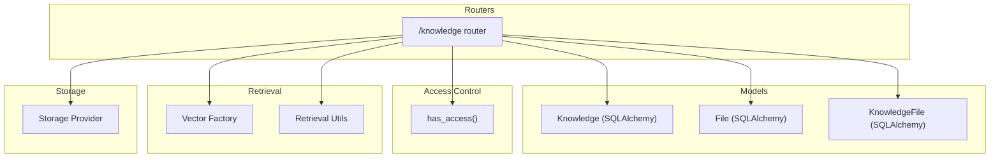
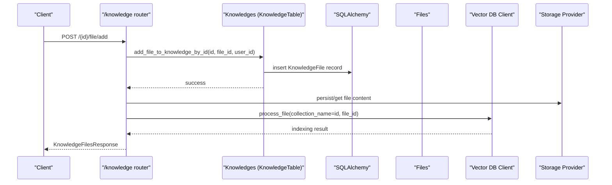
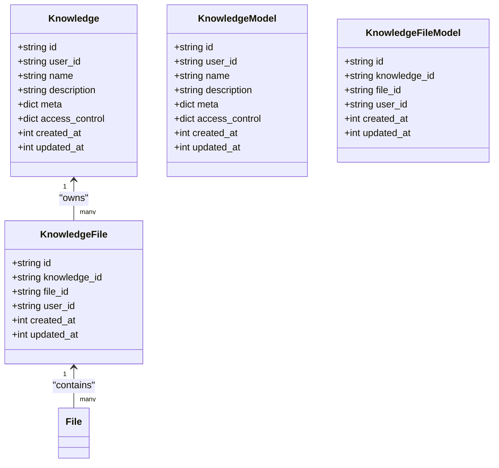
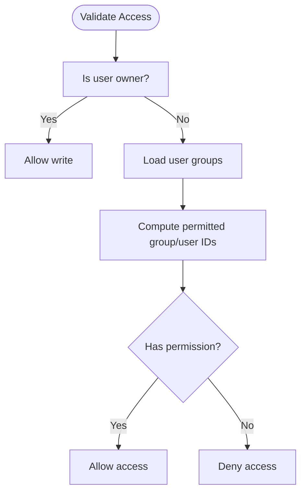
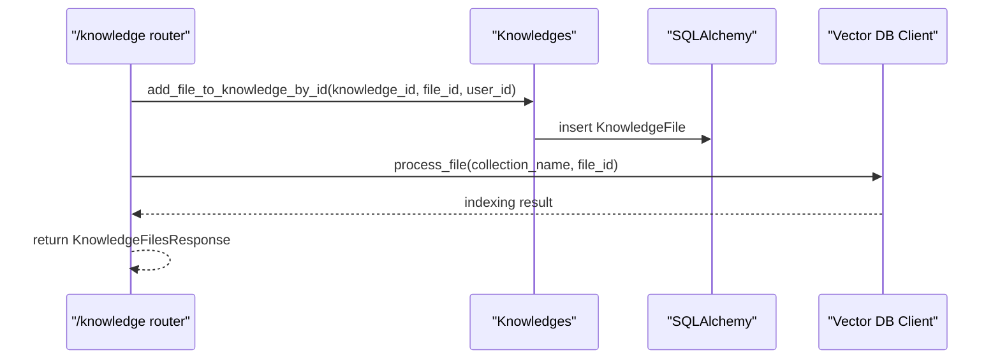
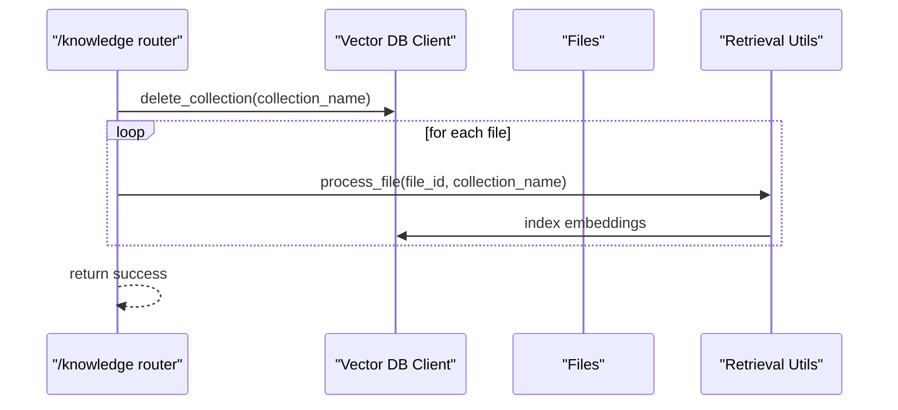
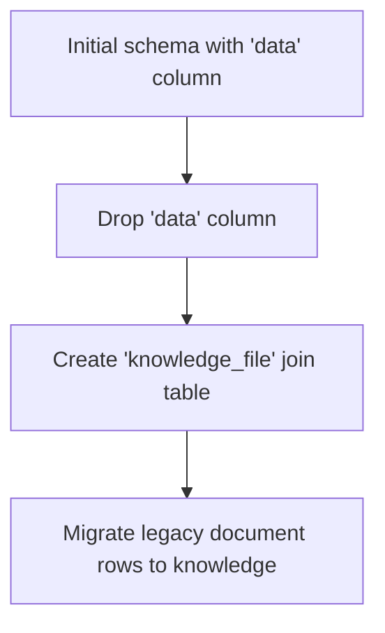
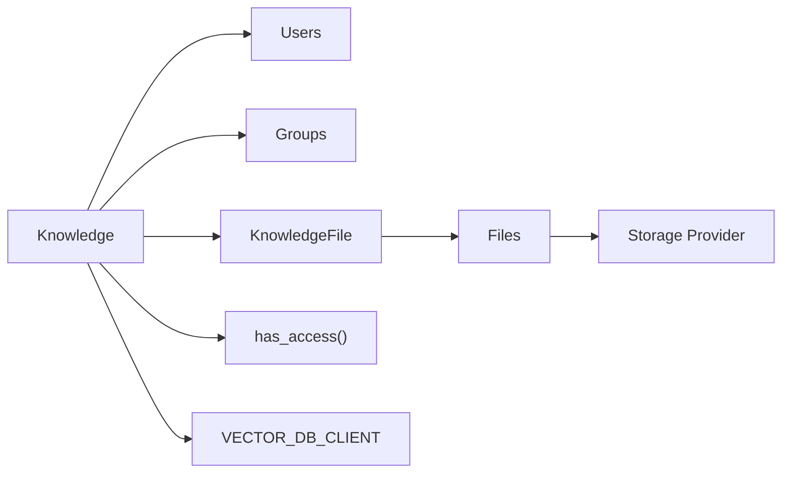

# Knowledge Base Model

<cite>
**Referenced Files in This Document**
- [knowledge.py](file://backend/open_webui/models/knowledge.py)
- [6a39f3d8e55c_add_knowledge_table.py](file://backend/open_webui/migrations/versions/6a39f3d8e55c_add_knowledge_table.py)
- [922e7a387820_add_group_table.py](file://backend/open_webui/migrations/versions/922e7a387820_add_group_table.py)
- [knowledge.py](file://backend/open_webui/routers/knowledge.py)
- [access_control.py](file://backend/open_webui/utils/access_control.py)
- [factory.py](file://backend/open_webui/retrieval/vector/factory.py)
- [retrieval.py](file://backend/open_webui/retrieval/utils.py)
- [files.py](file://backend/open_webui/models/files.py)
- [provider.py](file://backend/open_webui/storage/provider.py)
- [3e0e00844bb0_add_knowledge_file_table.py](file://backend/open_webui/migrations/versions/3e0e00844bb0_add_knowledge_file_table.py)
</cite>

## Table of Contents
1. [Introduction](#introduction)
2. [Project Structure](#project-structure)
3. [Core Components](#core-components)
4. [Architecture Overview](#architecture-overview)
5. [Detailed Component Analysis](#detailed-component-analysis)
6. [Dependency Analysis](#dependency-analysis)
7. [Performance Considerations](#performance-considerations)
8. [Troubleshooting Guide](#troubleshooting-guide)
9. [Conclusion](#conclusion)
10. [Appendices](#appendices)

## Introduction
This document provides comprehensive data model documentation for the Knowledge ORM model in open-webui. It explains the entity structure, access control semantics, and how the model integrates with the retrieval system and file management for Retrieval-Augmented Generation (RAG). It also covers common operations such as knowledge base discovery, access validation, listing user-owned knowledge bases, and managing content ingestion.

## Project Structure
The Knowledge model resides in the backend models layer and is exposed via FastAPI routers. It integrates with:
- Access control utilities for permission checks
- Retrieval vector database clients for indexing and querying
- File management for ingestion and metadata
- Storage providers for file persistence

**Diagram sources**
- [knowledge.py](file://backend/open_webui/models/knowledge.py#L36-L115)
- [knowledge.py](file://backend/open_webui/routers/knowledge.py#L1-L120)
- [access_control.py](file://backend/open_webui/utils/access_control.py#L124-L151)
- [factory.py](file://backend/open_webui/retrieval/vector/factory.py#L1-L79)
- [retrieval.py](file://backend/open_webui/retrieval/utils.py#L135-L187)
- [files.py](file://backend/open_webui/models/files.py#L1-L120)
- [provider.py](file://backend/open_webui/storage/provider.py#L1-L120)

**Section sources**
- [knowledge.py](file://backend/open_webui/models/knowledge.py#L36-L115)
- [knowledge.py](file://backend/open_webui/routers/knowledge.py#L1-L120)

## Core Components
- Knowledge entity: Represents a knowledge base with identifiers, ownership, metadata, access control, and timestamps.
- KnowledgeFile join entity: Links knowledge bases to files.
- KnowledgeTable service: Provides CRUD and access-control-aware operations.
- Routers: Expose endpoints for discovery, creation, updates, ingestion, and cleanup.
- Access control utilities: Enforce granular read/write permissions.
- Retrieval integration: Indexes and queries content via vector databases.
- File and storage integration: Manages ingestion and persistence.

**Section sources**
- [knowledge.py](file://backend/open_webui/models/knowledge.py#L36-L115)
- [knowledge.py](file://backend/open_webui/models/knowledge.py#L138-L371)
- [knowledge.py](file://backend/open_webui/routers/knowledge.py#L1-L200)
- [access_control.py](file://backend/open_webui/utils/access_control.py#L124-L151)
- [factory.py](file://backend/open_webui/retrieval/vector/factory.py#L1-L79)
- [retrieval.py](file://backend/open_webui/retrieval/utils.py#L135-L187)
- [files.py](file://backend/open_webui/models/files.py#L1-L120)
- [provider.py](file://backend/open_webui/storage/provider.py#L1-L120)

## Architecture Overview
The Knowledge model underpins RAG by:
- Storing knowledge base metadata and access control
- Associating files via KnowledgeFile
- Triggering ingestion into the vector database when files are added
- Enforcing access control during discovery and mutations
- Supporting reindexing and cleanup operations

**Diagram sources**
- [knowledge.py](file://backend/open_webui/routers/knowledge.py#L276-L341)
- [knowledge.py](file://backend/open_webui/models/knowledge.py#L256-L282)
- [retrieval.py](file://backend/open_webui/retrieval/utils.py#L135-L187)
- [provider.py](file://backend/open_webui/storage/provider.py#L1-L120)

## Detailed Component Analysis

### Knowledge Entity and Access Control Semantics
- Fields:
  - id: unique identifier for the knowledge base
  - user_id: owner identifier
  - name, description: human-readable metadata
  - meta: JSON for additional configuration and indexing information
  - access_control: JSON controlling read/write access
  - created_at, updated_at: epoch timestamps
- Access control modes:
  - None: public read access for users with the "user" role
  - {} (empty object): private access restricted to the owner
  - Custom permissions: specify group_ids and user_ids for read and write
- Relationship to Users: user_id links to the owning user

**Diagram sources**
- [knowledge.py](file://backend/open_webui/models/knowledge.py#L36-L115)
- [knowledge.py](file://backend/open_webui/models/knowledge.py#L84-L115)

**Section sources**
- [knowledge.py](file://backend/open_webui/models/knowledge.py#L36-L115)
- [access_control.py](file://backend/open_webui/utils/access_control.py#L124-L151)

### Access Control Validation Workflow
Access validation follows a strict precedence:
- Owner always has write access
- Group membership is derived and checked against access_control
- Public vs private modes are enforced by has_access()

**Diagram sources**
- [knowledge.py](file://backend/open_webui/models/knowledge.py#L189-L210)
- [access_control.py](file://backend/open_webui/utils/access_control.py#L124-L151)

**Section sources**
- [knowledge.py](file://backend/open_webui/models/knowledge.py#L189-L210)
- [access_control.py](file://backend/open_webui/utils/access_control.py#L124-L151)

### KnowledgeFile Join and File Management
- KnowledgeFile links knowledge bases to files with timestamps and ownership
- Operations:
  - Add file to knowledge base
  - Update file in knowledge base (re-index)
  - Remove file from knowledge base (and optionally delete file and its collection)
  - Reset knowledge base (clear file associations and update timestamps)
  - List files associated with a knowledge base

**Diagram sources**
- [knowledge.py](file://backend/open_webui/routers/knowledge.py#L276-L341)
- [knowledge.py](file://backend/open_webui/models/knowledge.py#L256-L282)
- [retrieval.py](file://backend/open_webui/retrieval/utils.py#L135-L187)

**Section sources**
- [knowledge.py](file://backend/open_webui/models/knowledge.py#L84-L115)
- [knowledge.py](file://backend/open_webui/models/knowledge.py#L235-L313)
- [knowledge.py](file://backend/open_webui/routers/knowledge.py#L276-L341)

### Retrieval Integration and Indexing
- Vector database client selection is configured centrally
- Retrieval utilities query and enrich results from the vector database
- Knowledge base ID serves as the collection name for vector operations
- Reindexing deletes existing collection and re-processes all files

**Diagram sources**
- [knowledge.py](file://backend/open_webui/routers/knowledge.py#L124-L179)
- [factory.py](file://backend/open_webui/retrieval/vector/factory.py#L1-L79)
- [retrieval.py](file://backend/open_webui/retrieval/utils.py#L135-L187)

**Section sources**
- [knowledge.py](file://backend/open_webui/routers/knowledge.py#L124-L179)
- [factory.py](file://backend/open_webui/retrieval/vector/factory.py#L1-L79)
- [retrieval.py](file://backend/open_webui/retrieval/utils.py#L135-L187)

### Migration History and Legacy Data
- Initial knowledge table included a data column for raw content
- Later migration removed the data column and introduced a dedicated KnowledgeFile join table
- Legacy document data was migrated into knowledge records with meta indicating legacy/document flags

**Diagram sources**
- [6a39f3d8e55c_add_knowledge_table.py](file://backend/open_webui/migrations/versions/6a39f3d8e55c_add_knowledge_table.py#L21-L77)
- [3e0e00844bb0_add_knowledge_file_table.py](file://backend/open_webui/migrations/versions/3e0e00844bb0_add_knowledge_file_table.py#L112-L160)

**Section sources**
- [6a39f3d8e55c_add_knowledge_table.py](file://backend/open_webui/migrations/versions/6a39f3d8e55c_add_knowledge_table.py#L21-L77)
- [3e0e00844bb0_add_knowledge_file_table.py](file://backend/open_webui/migrations/versions/3e0e00844bb0_add_knowledge_file_table.py#L112-L160)

## Dependency Analysis
- Knowledge depends on:
  - Users (via user_id)
  - Groups (for group-based permissions)
  - Files (via KnowledgeFile)
  - Access control utilities (has_access)
  - Vector DB client (for indexing)
  - Storage provider (for file persistence)

**Diagram sources**
- [knowledge.py](file://backend/open_webui/models/knowledge.py#L36-L115)
- [knowledge.py](file://backend/open_webui/models/knowledge.py#L189-L210)
- [factory.py](file://backend/open_webui/retrieval/vector/factory.py#L1-L79)
- [files.py](file://backend/open_webui/models/files.py#L1-L120)
- [provider.py](file://backend/open_webui/storage/provider.py#L1-L120)

**Section sources**
- [knowledge.py](file://backend/open_webui/models/knowledge.py#L36-L115)
- [knowledge.py](file://backend/open_webui/models/knowledge.py#L189-L210)
- [factory.py](file://backend/open_webui/retrieval/vector/factory.py#L1-L79)
- [files.py](file://backend/open_webui/models/files.py#L1-L120)
- [provider.py](file://backend/open_webui/storage/provider.py#L1-L120)

## Performance Considerations
- Access control checks involve group membership resolution; cache group memberships at the router layer if needed.
- Vector indexing is I/O bound; batch operations reduce overhead.
- Large knowledge bases benefit from efficient filtering and pagination in routers.
- Consider indexing limits and collection naming consistency to avoid collisions.

[No sources needed since this section provides general guidance]

## Troubleshooting Guide
Common issues and resolutions:
- Unauthorized access:
  - Ensure user has appropriate read/write permissions or is the owner.
  - Verify access_control mode and group membership.
- Missing or unprocessed files:
  - Files must be processed before adding to a knowledge base.
  - Check that vector database indexing succeeded.
- Cleanup failures:
  - Deleting a knowledge base removes its collection and associated file links.
  - If embedding processing was bypassed, manual cleanup of orphaned collections may be required.

**Section sources**
- [knowledge.py](file://backend/open_webui/routers/knowledge.py#L182-L211)
- [knowledge.py](file://backend/open_webui/routers/knowledge.py#L276-L341)
- [knowledge.py](file://backend/open_webui/routers/knowledge.py#L405-L483)
- [knowledge.py](file://backend/open_webui/routers/knowledge.py#L485-L546)

## Conclusion
The Knowledge model provides a robust foundation for RAG by encapsulating knowledge base metadata, access control, and file associations. Its integration with retrieval and storage enables scalable content ingestion and querying. Proper use of access control ensures secure sharing while maintaining flexibility for public, private, and group-scoped knowledge bases.

[No sources needed since this section summarizes without analyzing specific files]

## Appendices

### Common Operations and Examples
- Knowledge base discovery:
  - GET /knowledge: lists knowledge bases with read access
  - GET /knowledge/list: lists knowledge bases with write access
- Access validation:
  - Check read/write access using has_access() with user_id and access_control
- Listing user-owned knowledge bases:
  - Filter by user_id or apply has_access() for group-based visibility
- Ingestion and indexing:
  - Add file to knowledge base and trigger process_file
  - Reindex all knowledge bases to rebuild vector indices
- Cleanup:
  - Delete knowledge base and remove its vector collection
  - Optionally remove the underlying file and its collection

**Section sources**
- [knowledge.py](file://backend/open_webui/routers/knowledge.py#L39-L76)
- [knowledge.py](file://backend/open_webui/routers/knowledge.py#L182-L211)
- [knowledge.py](file://backend/open_webui/routers/knowledge.py#L276-L341)
- [knowledge.py](file://backend/open_webui/routers/knowledge.py#L124-L179)
- [knowledge.py](file://backend/open_webui/routers/knowledge.py#L485-L546)

### Access Control Modes Reference
- None: public read access for users with the "user" role
- {} (empty object): private access restricted to the owner
- Custom permissions: specify group_ids and user_ids for read and write

**Section sources**
- [knowledge.py](file://backend/open_webui/models/knowledge.py#L46-L62)
- [access_control.py](file://backend/open_webui/utils/access_control.py#L124-L151)