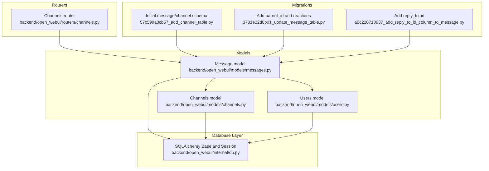
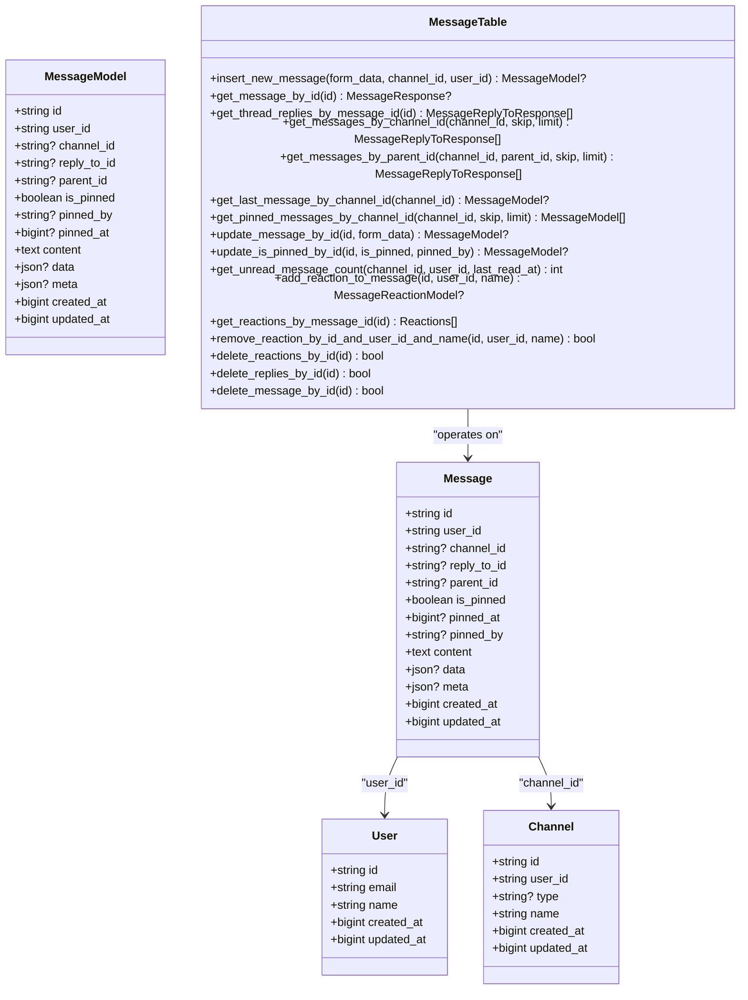
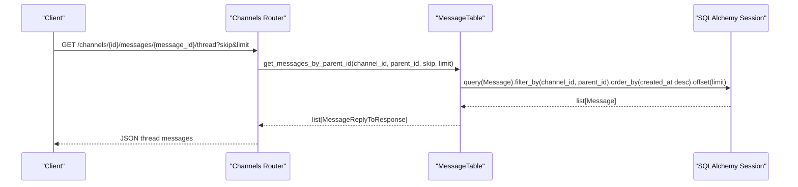
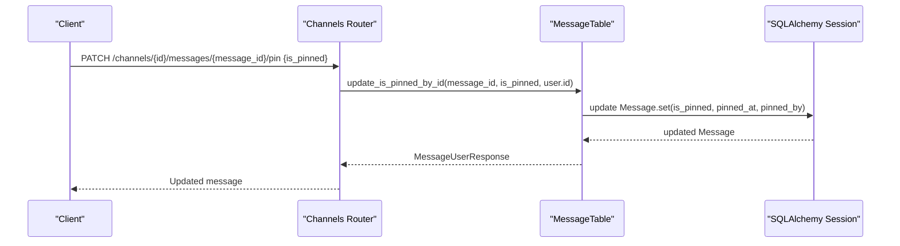
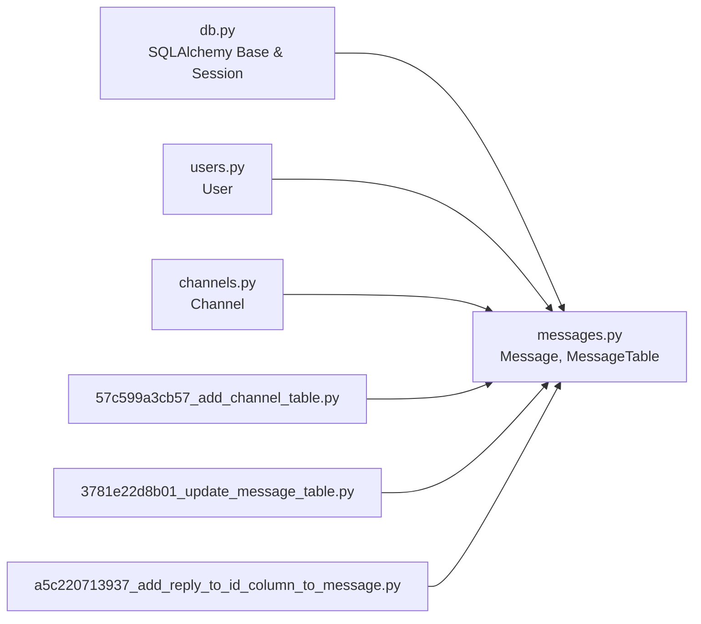

# Message Model

<cite>
**Referenced Files in This Document**
- [messages.py](file://backend/open_webui/models/messages.py)
- [channels.py](file://backend/open_webui/models/channels.py)
- [users.py](file://backend/open_webui/models/users.py)
- [57c599a3cb57_add_channel_table.py](file://backend/open_webui/migrations/versions/57c599a3cb57_add_channel_table.py)
- [3781e22d8b01_update_message_table.py](file://backend/open_webui/migrations/versions/3781e22d8b01_update_message_table.py)
- [a5c220713937_add_reply_to_id_column_to_message.py](file://backend/open_webui/migrations/versions/a5c220713937_add_reply_to_id_column_to_message.py)
- [db.py](file://backend/open_webui/internal/db.py)
- [channels_router.py](file://backend/open_webui/routers/channels.py)
</cite>

## Table of Contents
1. [Introduction](#introduction)
2. [Project Structure](#project-structure)
3. [Core Components](#core-components)
4. [Architecture Overview](#architecture-overview)
5. [Detailed Component Analysis](#detailed-component-analysis)
6. [Dependency Analysis](#dependency-analysis)
7. [Performance Considerations](#performance-considerations)
8. [Troubleshooting Guide](#troubleshooting-guide)
9. [Conclusion](#conclusion)

## Introduction
This document provides comprehensive data model documentation for the Message ORM model in open-webui. It explains the entity structure, threading capabilities via reply_to_id and parent_id, pinning functionality, and the roles of data and meta JSON fields. It also describes relationships with Users and Channels, and outlines common query patterns for retrieving message threads, recent messages, and pinned messages. Finally, it addresses performance considerations around time_ns precision and indexing strategies.

## Project Structure
The Message model is defined in the backend models layer and is used by routers and services. Migrations define the schema evolution, and the database layer provides the SQLAlchemy base and session management.



**Diagram sources**
- [messages.py](file://backend/open_webui/models/messages.py#L41-L62)
- [channels.py](file://backend/open_webui/models/channels.py#L22-L49)
- [users.py](file://backend/open_webui/models/users.py#L45-L76)
- [57c599a3cb57_add_channel_table.py](file://backend/open_webui/migrations/versions/57c599a3cb57_add_channel_table.py#L18-L48)
- [3781e22d8b01_update_message_table.py](file://backend/open_webui/migrations/versions/3781e22d8b01_update_message_table.py#L29-L33)
- [a5c220713937_add_reply_to_id_column_to_message.py](file://backend/open_webui/migrations/versions/a5c220713937_add_reply_to_id_column_to_message.py#L21-L26)
- [channels_router.py](file://backend/open_webui/routers/channels.py#L735-L740)

**Section sources**
- [messages.py](file://backend/open_webui/models/messages.py#L41-L62)
- [channels.py](file://backend/open_webui/models/channels.py#L22-L49)
- [users.py](file://backend/open_webui/models/users.py#L45-L76)
- [57c599a3cb57_add_channel_table.py](file://backend/open_webui/migrations/versions/57c599a3cb57_add_channel_table.py#L18-L48)
- [3781e22d8b01_update_message_table.py](file://backend/open_webui/migrations/versions/3781e22d8b01_update_message_table.py#L29-L33)
- [a5c220713937_add_reply_to_id_column_to_message.py](file://backend/open_webui/migrations/versions/a5c220713937_add_reply_to_id_column_to_message.py#L21-L26)
- [db.py](file://backend/open_webui/internal/db.py#L148-L165)
- [channels_router.py](file://backend/open_webui/routers/channels.py#L735-L740)

## Core Components
- Message entity: Stores message content, threading fields, pinning fields, JSON metadata, and timestamps.
- MessageTable: ORM service providing CRUD and query methods for messages.
- Relationships:
  - Message.user_id references Users.
  - Message.channel_id references Channels.

Key fields and their purposes:
- id: Unique identifier for the message.
- user_id: Owner of the message.
- channel_id: Channel the message belongs to.
- reply_to_id: References another message this message replies to (for direct replies).
- parent_id: Root of a thread; messages with the same parent_id belong to the same thread.
- content: Text content of the message.
- data: Structured metadata stored as JSON.
- meta: Extended information stored as JSON.
- created_at, updated_at: Timestamps in time_ns.
- is_pinned, pinned_at, pinned_by: Pinning fields enabling highlighting and organization.

**Section sources**
- [messages.py](file://backend/open_webui/models/messages.py#L41-L62)
- [messages.py](file://backend/open_webui/models/messages.py#L64-L85)
- [messages.py](file://backend/open_webui/models/messages.py#L125-L158)
- [channels.py](file://backend/open_webui/models/channels.py#L22-L49)
- [users.py](file://backend/open_webui/models/users.py#L45-L76)

## Architecture Overview
The Message model participates in two major workflows:
- Threading: reply_to_id enables direct replies; parent_id enables nested threads.
- Pinning: is_pinned, pinned_at, pinned_by enable message highlighting and organization.



**Diagram sources**
- [messages.py](file://backend/open_webui/models/messages.py#L41-L62)
- [messages.py](file://backend/open_webui/models/messages.py#L64-L85)
- [messages.py](file://backend/open_webui/models/messages.py#L125-L461)
- [users.py](file://backend/open_webui/models/users.py#L45-L76)
- [channels.py](file://backend/open_webui/models/channels.py#L22-L49)

## Detailed Component Analysis

### Message Entity and Fields
- Identity and ownership: id, user_id.
- Channel association: channel_id.
- Threading:
  - reply_to_id: Points to a specific message being replied to (direct reply).
  - parent_id: Root of a thread; all nested replies share the same parent_id.
- Pinning:
  - is_pinned: Boolean flag indicating if the message is pinned.
  - pinned_at: Timestamp (time_ns) when the message was pinned.
  - pinned_by: Identifier of the user who pinned the message.
- Content and metadata:
  - content: Free-form text.
  - data: Structured metadata (JSON).
  - meta: Extended information (JSON).
- Timestamps:
  - created_at, updated_at: Stored as time_ns.

Threading semantics:
- Top-level messages in a channel have parent_id=None.
- Replies to a top-level message set parent_id to the top-level message’s id.
- Direct replies to a specific message set reply_to_id to that message’s id.

Pinning semantics:
- is_pinned toggled by administrators or authorized users.
- pinned_at tracks when the pin action occurred.
- pinned_by records the actor who pinned the message.

**Section sources**
- [messages.py](file://backend/open_webui/models/messages.py#L41-L62)
- [messages.py](file://backend/open_webui/models/messages.py#L64-L85)
- [messages.py](file://backend/open_webui/models/messages.py#L125-L158)
- [messages.py](file://backend/open_webui/models/messages.py#L314-L326)

### Threading Capabilities: reply_to_id and parent_id
- reply_to_id supports direct replies to a specific message.
- parent_id supports nested threads rooted at a parent message.
- Retrieval patterns:
  - Get thread replies by parent id.
  - Get a message and its reply-to chain.
  - Get channel top-level messages (parent_id=None).



**Diagram sources**
- [channels_router.py](file://backend/open_webui/routers/channels.py#L1223-L1237)
- [messages.py](file://backend/open_webui/models/messages.py#L261-L302)

**Section sources**
- [messages.py](file://backend/open_webui/models/messages.py#L189-L218)
- [messages.py](file://backend/open_webui/models/messages.py#L261-L302)
- [channels_router.py](file://backend/open_webui/routers/channels.py#L1223-L1237)

### Pinning Functionality: is_pinned, pinned_at, pinned_by
- Pin/unpin operations update is_pinned, pinned_at, and pinned_by.
- Retrieval by channel with ordering by pinned_at desc.
- UI integration allows toggling pin state.



**Diagram sources**
- [channels_router.py](file://backend/open_webui/routers/channels.py#L1200-L1216)
- [messages.py](file://backend/open_webui/models/messages.py#L347-L358)

**Section sources**
- [messages.py](file://backend/open_webui/models/messages.py#L347-L358)
- [messages.py](file://backend/open_webui/models/messages.py#L314-L326)
- [channels_router.py](file://backend/open_webui/routers/channels.py#L735-L740)

### Purpose of data and meta JSON Fields
- data: Structured metadata (e.g., tool calls, artifacts, structured payloads).
- meta: Extended information (e.g., UI hints, rendering preferences, moderation flags).
- Both are JSON fields allowing flexible extensions without altering schema.

**Section sources**
- [messages.py](file://backend/open_webui/models/messages.py#L56-L58)
- [messages.py](file://backend/open_webui/models/messages.py#L328-L345)

### Relationships with Users and Channels
- Users: Message.user_id references User.id.
- Channels: Message.channel_id references Channel.id.

```mermaid
erDiagram
USER {
string id PK
string email
string name
bigint created_at
bigint updated_at
}
CHANNEL {
string id PK
string user_id
string name
bigint created_at
bigint updated_at
}
MESSAGE {
string id PK
string user_id FK
string channel_id FK
string reply_to_id
string parent_id
boolean is_pinned
bigint? pinned_at
string? pinned_by
text content
json? data
json? meta
bigint created_at
bigint updated_at
}
USER ||--o{ MESSAGE : "owns"
CHANNEL ||--o{ MESSAGE : "contains"
```

**Diagram sources**
- [users.py](file://backend/open_webui/models/users.py#L45-L76)
- [channels.py](file://backend/open_webui/models/channels.py#L22-L49)
- [messages.py](file://backend/open_webui/models/messages.py#L41-L62)

**Section sources**
- [users.py](file://backend/open_webui/models/users.py#L45-L76)
- [channels.py](file://backend/open_webui/models/channels.py#L22-L49)
- [messages.py](file://backend/open_webui/models/messages.py#L41-L62)

### Common Query Patterns
- Retrieve recent top-level messages in a channel:
  - Filter by channel_id and parent_id=None, order by created_at desc, apply pagination.
- Retrieve a message thread by parent id:
  - Filter by channel_id and parent_id, order by created_at desc, optionally include the parent message if under limit.
- Retrieve pinned messages in a channel:
  - Filter by channel_id and is_pinned=True, order by pinned_at desc, apply pagination.
- Count unread top-level messages:
  - Filter by channel_id, parent_id=None, created_at > last_read_at, exclude own messages if desired.

These patterns are implemented by MessageTable methods and exposed via channels router endpoints.

**Section sources**
- [messages.py](file://backend/open_webui/models/messages.py#L227-L302)
- [messages.py](file://backend/open_webui/models/messages.py#L314-L326)
- [messages.py](file://backend/open_webui/models/messages.py#L359-L371)
- [channels_router.py](file://backend/open_webui/routers/channels.py#L698-L726)
- [channels_router.py](file://backend/open_webui/routers/channels.py#L728-L761)

## Dependency Analysis
- MessageTable depends on:
  - SQLAlchemy Base and sessions from db.py.
  - Users and Channels models for user resolution and channel membership checks.
- Migrations define:
  - Initial message and channel schema.
  - Addition of parent_id and message_reaction table.
  - Addition of reply_to_id.



**Diagram sources**
- [db.py](file://backend/open_webui/internal/db.py#L148-L165)
- [messages.py](file://backend/open_webui/models/messages.py#L125-L461)
- [users.py](file://backend/open_webui/models/users.py#L45-L76)
- [channels.py](file://backend/open_webui/models/channels.py#L22-L49)
- [57c599a3cb57_add_channel_table.py](file://backend/open_webui/migrations/versions/57c599a3cb57_add_channel_table.py#L18-L48)
- [3781e22d8b01_update_message_table.py](file://backend/open_webui/migrations/versions/3781e22d8b01_update_message_table.py#L29-L33)
- [a5c220713937_add_reply_to_id_column_to_message.py](file://backend/open_webui/migrations/versions/a5c220713937_add_reply_to_id_column_to_message.py#L21-L26)

**Section sources**
- [db.py](file://backend/open_webui/internal/db.py#L148-L165)
- [messages.py](file://backend/open_webui/models/messages.py#L125-L461)
- [57c599a3cb57_add_channel_table.py](file://backend/open_webui/migrations/versions/57c599a3cb57_add_channel_table.py#L18-L48)
- [3781e22d8b01_update_message_table.py](file://backend/open_webui/migrations/versions/3781e22d8b01_update_message_table.py#L29-L33)
- [a5c220713937_add_reply_to_id_column_to_message.py](file://backend/open_webui/migrations/versions/a5c220713937_add_reply_to_id_column_to_message.py#L21-L26)

## Performance Considerations
- Timestamp precision: created_at and updated_at are stored as time_ns. This increases precision but may require careful handling in queries and UI conversions.
- Indexing strategy:
  - Current migrations do not define explicit indexes for message tables. Consider adding indexes on:
    - channel_id for channel-scoped queries.
    - parent_id for thread retrieval.
    - reply_to_id for reply navigation.
    - is_pinned for pinned message retrieval.
    - created_at for chronological sorting.
  - These suggestions are derived from observed query patterns in MessageTable and channels router.
- Pagination: Methods accept skip and limit parameters; ensure appropriate indexes to avoid table scans.
- JSON fields: data and meta are JSON; avoid heavy filtering on these fields. Prefer selective retrieval and indexing on non-JSON fields.

**Section sources**
- [messages.py](file://backend/open_webui/models/messages.py#L304-L326)
- [messages.py](file://backend/open_webui/models/messages.py#L227-L302)
- [channels_router.py](file://backend/open_webui/routers/channels.py#L698-L726)
- [channels_router.py](file://backend/open_webui/routers/channels.py#L728-L761)

## Troubleshooting Guide
- Threading anomalies:
  - Ensure parent_id is set consistently when creating replies to threads.
  - Verify reply_to_id is set when performing direct replies.
- Pinning issues:
  - Confirm pinned_at and pinned_by are updated when toggling is_pinned.
  - Check that pinned messages are ordered by pinned_at desc.
- Relationship errors:
  - Validate that user_id references an existing User and channel_id references an existing Channel.
- Unread counts:
  - Ensure last_read_at is passed correctly and parent_id=None is used to count top-level messages.

**Section sources**
- [messages.py](file://backend/open_webui/models/messages.py#L125-L158)
- [messages.py](file://backend/open_webui/models/messages.py#L347-L358)
- [messages.py](file://backend/open_webui/models/messages.py#L359-L371)

## Conclusion
The Message model in open-webui provides robust support for threaded conversations and pinning, with flexible JSON fields for structured metadata. Its relationships with Users and Channels enable contextual messaging. The provided query patterns and performance considerations help optimize retrieval and scalability. Future enhancements could include targeted indexes on frequently queried columns to improve performance.