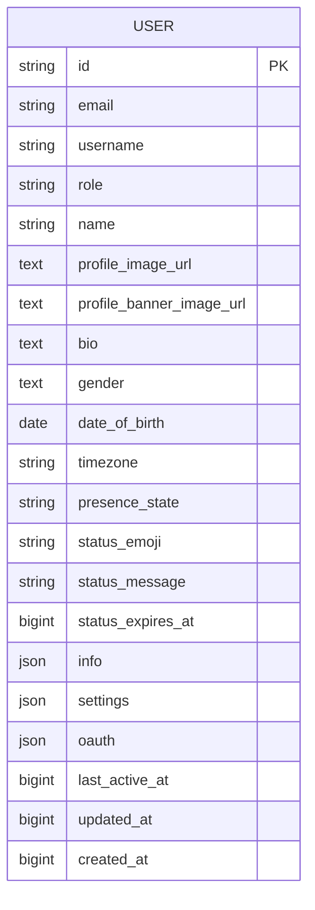
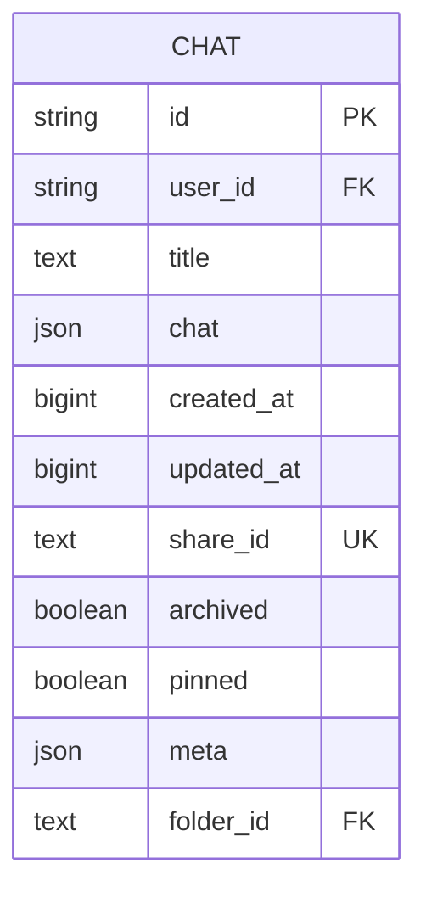
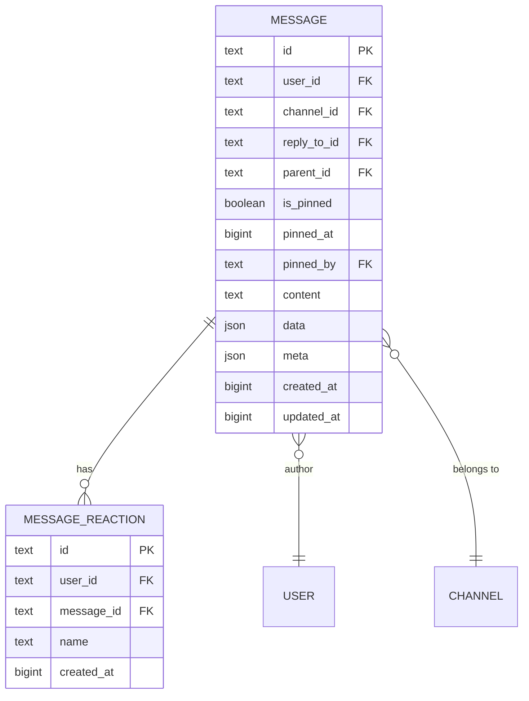
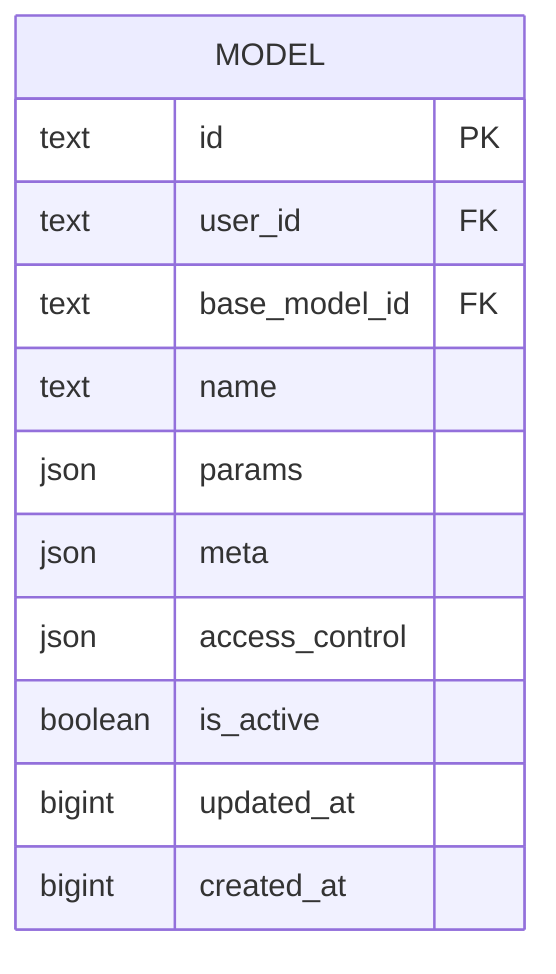
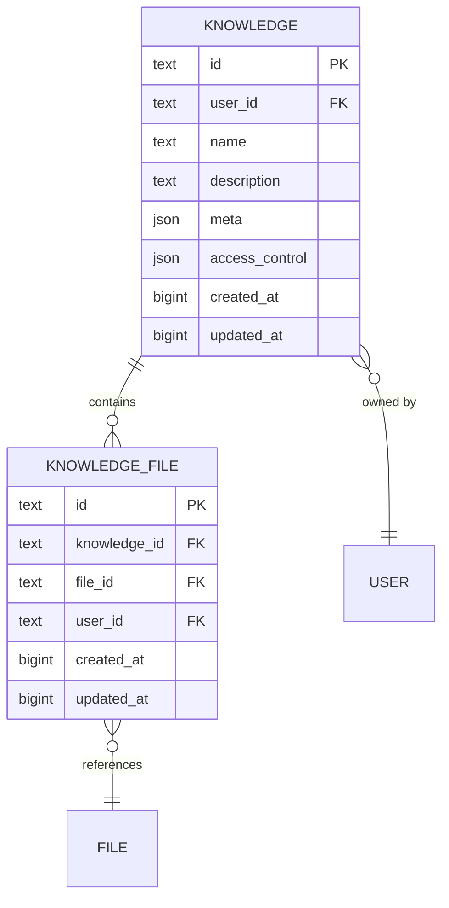
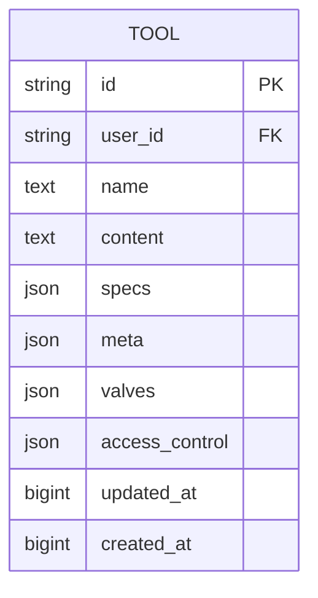
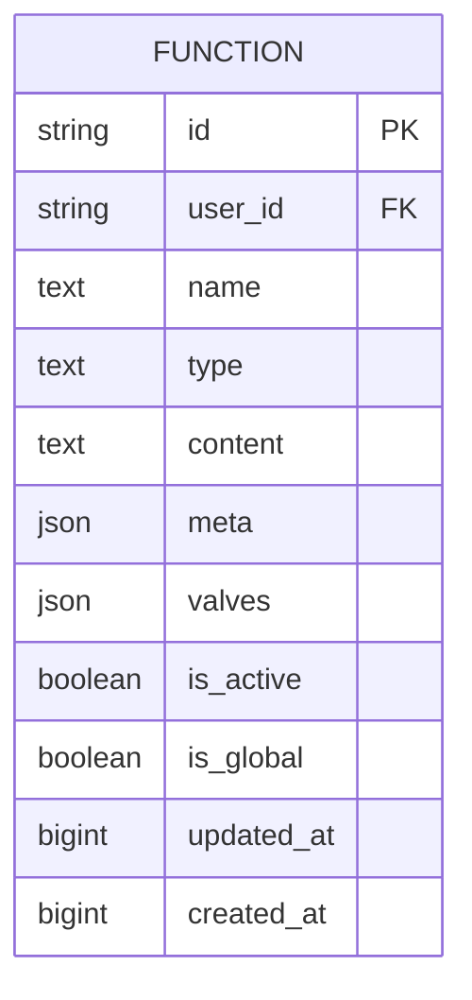
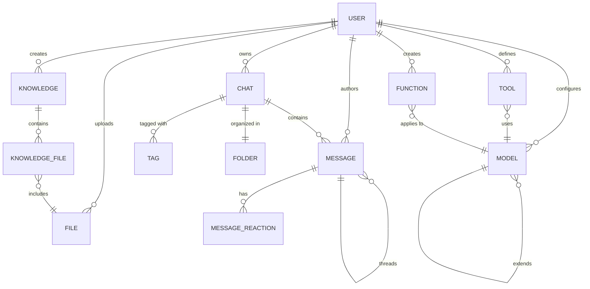

# ORM Models

<cite>
**Referenced Files in This Document**   
- [users.py](file://backend/open_webui/models/users.py)
- [chats.py](file://backend/open_webui/models/chats.py)
- [messages.py](file://backend/open_webui/models/messages.py)
- [files.py](file://backend/open_webui/models/files.py)
- [models.py](file://backend/open_webui/models/models.py)
- [knowledge.py](file://backend/open_webui/models/knowledge.py)
- [tools.py](file://backend/open_webui/models/tools.py)
- [functions.py](file://backend/open_webui/models/functions.py)
- [db.py](file://backend/open_webui/internal/db.py)
- [7e5b5dc7342b_init.py](file://backend/open_webui/migrations/versions/7e5b5dc7342b_init.py)
- [018012973d35_add_indexes.py](file://backend/open_webui/migrations/versions/018012973d35_add_indexes.py)
</cite>

## Table of Contents
1. [Introduction](#introduction)
2. [Data Model Overview](#data-model-overview)
3. [Users Model](#users-model)
4. [Chats Model](#chats-model)
5. [Messages Model](#messages-model)
6. [Files Model](#files-model)
7. [Models Model](#models-model)
8. [Knowledge Model](#knowledge-model)
9. [Tools Model](#tools-model)
10. [Functions Model](#functions-model)
11. [Entity Relationships](#entity-relationships)
12. [Data Access Patterns](#data-access-patterns)
13. [Query Optimization](#query-optimization)
14. [Data Lifecycle Management](#data-lifecycle-management)
15. [Conclusion](#conclusion)

## Introduction

This document provides comprehensive documentation for the ORM models used in the open-webui application. The system uses SQLAlchemy as its ORM framework to manage database interactions across various entities including Users, Chats, Messages, Files, Models, Knowledge, Tools, and Functions. These models represent the core data structures that power the application's functionality, from user management and chat history to AI model configuration and knowledge base management.

The models are designed with scalability and performance in mind, incorporating features such as JSON field storage for flexible data structures, comprehensive indexing for query optimization, and access control mechanisms for data security. The database schema has evolved through multiple migration versions, with the initial schema established in the `7e5b5dc7342b_init.py` migration and subsequent enhancements added through incremental migration files.

Each model follows a consistent pattern with a corresponding Pydantic model for data validation and serialization, and a table class that encapsulates common database operations. The system supports both SQLite and PostgreSQL databases, with appropriate configuration for connection pooling and performance tuning based on the database backend.

**Section sources**
- [db.py](file://backend/open_webui/internal/db.py#L1-L165)
- [7e5b5dc7342b_init.py](file://backend/open_webui/migrations/versions/7e5b5dc7342b_init.py#L1-L205)

## Data Model Overview

The open-webui application employs a relational database schema with several interconnected entities that represent the core functionality of the system. The data model is designed to support a collaborative AI interface where users can create and manage chats, configure AI models, store files, and organize knowledge bases.

The primary entities in the system include:
- **Users**: Represents application users with authentication, profile, and settings data
- **Chats**: Stores conversational history and metadata for user interactions
- **Messages**: Contains individual messages within chats, supporting threading and reactions
- **Files**: Manages file uploads and attachments with metadata and access control
- **Models**: Configures AI models with parameters, metadata, and access permissions
- **Knowledge**: Organizes knowledge bases that can be linked to multiple files
- **Tools**: Stores tool configurations with specifications and access controls
- **Functions**: Manages executable functions with types, content, and activation states

The database schema uses a combination of relational and semi-structured data approaches. Core relationships are maintained through foreign key constraints, while flexible data is stored in JSON fields to accommodate varying requirements without schema changes. This hybrid approach provides both data integrity and flexibility.

All models include standard audit fields (`created_at`, `updated_at`) stored as Unix timestamps in seconds, providing consistent temporal tracking across the system. The models also implement soft deletion patterns where appropriate, using boolean flags like `archived` instead of physical record deletion to preserve data integrity and support recovery.

**Section sources**
- [7e5b5dc7342b_init.py](file://backend/open_webui/migrations/versions/7e5b5dc7342b_init.py#L1-L205)

## Users Model

The Users model represents the core identity system for the open-webui application, storing user accounts, authentication data, profile information, and preferences. This model serves as the foundation for all user-specific operations and permissions within the system.

### Entity Definition


**Diagram sources**
- [users.py](file://backend/open_webui/models/users.py#L45-L76)

### Field Definitions
- **id**: Primary key, unique identifier for the user (String)
- **email**: User's email address, used for authentication and identification (String)
- **username**: Optional display name for the user (String, 50 characters)
- **role**: User role determining permissions (String, e.g., "pending", "user", "admin")
- **name**: Full name of the user (String)
- **profile_image_url**: URL to the user's profile image (Text)
- **profile_banner_image_url**: URL to the user's profile banner image (Text, nullable)
- **bio**: User biography or description (Text, nullable)
- **gender**: User's gender information (Text, nullable)
- **date_of_birth**: User's date of birth (Date, nullable)
- **timezone**: User's preferred timezone (String, nullable)
- **presence_state**: Current presence status (String, nullable)
- **status_emoji**: Emoji representing user status (String, nullable)
- **status_message**: Custom status message (Text, nullable)
- **status_expires_at**: Timestamp when status expires (BigInteger, nullable)
- **info**: JSON field for additional user information (JSON, nullable)
- **settings**: JSON field for user preferences and UI settings (JSON, nullable)
- **oauth**: JSON field storing OAuth provider information (JSON, nullable)
- **last_active_at**: Timestamp of last user activity (BigInteger)
- **updated_at**: Timestamp of last record update (BigInteger)
- **created_at**: Timestamp of record creation (BigInteger)

### Constraints and Indexes
The Users table has the following constraints:
- Primary key on `id`
- Unique constraint on `email`
- Unique constraint on `api_key` (in related ApiKey table)
- Unique constraint on `oauth_sub` (in related OAuth data)

The model includes comprehensive methods for user management:
- User creation and authentication
- Role management and permission updates
- Profile information updates
- OAuth integration for third-party authentication
- Active user tracking and status management
- API key generation and management

The model also implements business logic for user status determination, with methods to check if a user is currently active based on their last activity timestamp. The system considers users active if they have been active within the last 3 minutes.

**Section sources**
- [users.py](file://backend/open_webui/models/users.py#L45-L719)

## Chats Model

The Chats model represents conversational sessions between users and AI models, storing the complete chat history, metadata, and organizational information. This model is central to the application's functionality, enabling users to maintain and retrieve their conversation history.

### Entity Definition


**Diagram sources**
- [chats.py](file://backend/open_webui/models/chats.py#L26-L43)

### Field Definitions
- **id**: Primary key, unique identifier for the chat (String)
- **user_id**: Foreign key referencing the owner user (String)
- **title**: Display title for the chat (Text)
- **chat**: JSON structure containing the complete conversation history (JSON)
- **created_at**: Timestamp of chat creation (BigInteger)
- **updated_at**: Timestamp of last chat modification (BigInteger)
- **share_id**: Unique identifier for shared chats (Text, unique, nullable)
- **archived**: Flag indicating if the chat is archived (Boolean, default: False)
- **pinned**: Flag indicating if the chat is pinned (Boolean, default: False, nullable)
- **meta**: JSON field for additional metadata (JSON, server_default: "{}")
- **folder_id**: Foreign key referencing the containing folder (Text, nullable)

### Constraints and Indexes
The Chats table includes several performance-optimized indexes:
- `folder_id_idx`: Index on `folder_id` for folder-based queries
- `user_id_pinned_idx`: Composite index on `user_id` and `pinned` for pinned chat retrieval
- `user_id_archived_idx`: Composite index on `user_id` and `archived` for archived chat filtering
- `updated_at_user_id_idx`: Composite index on `updated_at` and `user_id` for chronological sorting
- `folder_id_user_id_idx`: Composite index on `folder_id` and `user_id` for folder membership queries

The model implements comprehensive chat management functionality:
- Creation and deletion of chats
- Title and content updates
- Pinning and unpinning operations
- Archiving and unarchiving functionality
- Sharing mechanisms with share ID generation
- Tag management for chat categorization
- Folder organization and management
- Search functionality with support for filters by tag, folder, pinned status, and archive status

The chat data is stored as a JSON structure that includes message history, allowing for flexible schema evolution without database migrations. The system includes methods to safely handle null bytes in chat content to prevent database corruption.

**Section sources**
- [chats.py](file://backend/open_webui/models/chats.py#L26-L800)
- [018012973d35_add_indexes.py](file://backend/open_webui/migrations/versions/018012973d35_add_indexes.py#L1-L47)

## Messages Model

The Messages model represents individual messages within chat conversations, supporting rich interactions including threading, reactions, and metadata. This model enables the application's collaborative features, allowing users to engage in complex conversations with AI models.

### Entity Definition


**Diagram sources**
- [messages.py](file://backend/open_webui/models/messages.py#L41-L63)

### Field Definitions
- **id**: Primary key, unique identifier for the message (Text)
- **user_id**: Foreign key referencing the message author (Text)
- **channel_id**: Foreign key referencing the containing channel (Text, nullable)
- **reply_to_id**: Reference to the message being replied to (Text, nullable)
- **parent_id**: Reference to the parent message in a thread (Text, nullable)
- **is_pinned**: Flag indicating if the message is pinned (Boolean, default: False)
- **pinned_at**: Timestamp when the message was pinned (BigInteger, nullable)
- **pinned_by**: User ID of the user who pinned the message (Text, nullable)
- **content**: Message text content (Text)
- **data**: JSON field for structured message data (JSON, nullable)
- **meta**: JSON field for additional metadata (JSON, nullable)
- **created_at**: Timestamp of message creation (BigInteger)
- **updated_at**: Timestamp of last message update (BigInteger)

The Messages model also includes a related MessageReaction entity:
- **id**: Primary key for the reaction (Text)
- **user_id**: User who added the reaction (Text)
- **message_id**: Message being reacted to (Text)
- **name**: Reaction emoji or identifier (Text)
- **created_at**: Timestamp of reaction creation (BigInteger)

### Constraints and Indexes
The Messages table supports hierarchical message organization through:
- Threaded conversations via `parent_id`
- Reply chains via `reply_to_id`
- Message reactions with user attribution
- Pinning functionality for important messages

The model implements comprehensive message management:
- Creation and deletion of messages
- Editing and updating message content
- Thread management with nested replies
- Reaction system supporting multiple reactions per message
- Pinning and unpinning operations
- Unread message counting for notification systems
- Access control for message visibility

The system maintains message integrity by automatically cleaning null bytes from message content to prevent database issues. Message timestamps use nanosecond precision to ensure accurate ordering even with high-frequency message creation.

**Section sources**
- [messages.py](file://backend/open_webui/models/messages.py#L41-L463)

## Files Model

The Files model manages file uploads and attachments within the open-webui application, providing storage for documents, images, and other media that can be referenced in chats and knowledge bases. This model supports both direct file access and integration with external storage systems.

### Entity Definition


**Diagram sources**
- [files.py](file://backend/open_webui/models/files.py#L18-L34)

### Field Definitions
- **id**: Primary key, unique identifier for the file (String)
- **user_id**: Foreign key referencing the owner user (String)
- **hash**: Cryptographic hash of the file content for deduplication (Text, nullable)
- **filename**: Original filename (Text)
- **path**: Filesystem path or storage location (Text, nullable)
- **data**: JSON field for structured file data (JSON, nullable)
- **meta**: JSON field for file metadata (JSON, nullable)
- **access_control**: JSON field defining access permissions (JSON, nullable)
- **created_at**: Timestamp of file upload (BigInteger)
- **updated_at**: Timestamp of last file update (BigInteger)

### Constraints and Indexes
The Files model implements a flexible access control system:
- Public access (access_control = NULL): Available to all users with "user" role
- Private access (access_control = {}): Restricted to the owner only
- Custom permissions: Specific read/write access for users and groups

The model provides comprehensive file management functionality:
- File upload and metadata storage
- Hash-based deduplication to prevent storage of identical files
- Access control management with user and group permissions
- Metadata extraction and storage
- Batch operations for multiple files
- Secure file deletion with proper cleanup

The system separates file metadata from actual file content, allowing for efficient querying and indexing without loading large binary data. The `meta` field can store information such as content type, size, and extracted text for searchability.

**Section sources**
- [files.py](file://backend/open_webui/models/files.py#L18-L290)

## Models Model

The Models model configures AI models used within the open-webui application, allowing users to define custom model parameters, metadata, and access controls. This model enables the system's flexibility in supporting various AI models with different configurations.

### Entity Definition


**Diagram sources**
- [models.py](file://backend/open_webui/models/models.py#L55-L105)

### Field Definitions
- **id**: Primary key, model identifier used in API calls (Text)
- **user_id**: Foreign key referencing the owner user (Text)
- **base_model_id**: Optional pointer to the actual model for proxying requests (Text, nullable)
- **name**: Human-readable display name (Text)
- **params**: JSON field containing model parameters (JSONField)
- **meta**: JSON field containing model metadata (JSONField)
- **access_control**: JSON field defining access permissions (JSON, nullable)
- **is_active**: Flag indicating if the model is active (Boolean, default: True)
- **updated_at**: Timestamp of last update (BigInteger)
- **created_at**: Timestamp of creation (BigInteger)

### Constraints and Indexes
The Models model implements a sophisticated access control system similar to other entities:
- Public access (access_control = NULL): Available to all users with "user" role
- Private access (access_control = {}): Restricted to the owner only
- Custom permissions: Group and user-level read/write access

The model supports two types of models:
- Base models (base_model_id = NULL): Foundational models that can be extended
- Derived models (base_model_id != NULL): Custom configurations based on base models

Key functionality includes:
- Model creation and configuration
- Parameter management for AI model tuning
- Metadata storage for model descriptions and capabilities
- Activation/deactivation of models
- Synchronization of model configurations
- Permission-based model sharing
- Search and filtering by name, base model, and access permissions

The system allows model overriding, where a custom model can replace an existing model in the API by using the same ID, enabling users to customize default models.

**Section sources**
- [models.py](file://backend/open_webui/models/models.py#L55-L461)

## Knowledge Model

The Knowledge model manages knowledge bases that organize files for retrieval-augmented generation (RAG) and other AI applications. This model enables users to create curated collections of documents that can be referenced by AI models during conversations.

### Entity Definition


**Diagram sources**
- [knowledge.py](file://backend/open_webui/models/knowledge.py#L36-L65)

### Field Definitions
- **id**: Primary key, unique identifier for the knowledge base (Text)
- **user_id**: Foreign key referencing the owner user (Text)
- **name**: Display name for the knowledge base (Text)
- **description**: Description of the knowledge base contents (Text)
- **meta**: JSON field for additional metadata (JSON, nullable)
- **access_control**: JSON field defining access permissions (JSON, nullable)
- **created_at**: Timestamp of creation (BigInteger)
- **updated_at**: Timestamp of last update (BigInteger)

The Knowledge model also includes a related KnowledgeFile entity:
- **id**: Primary key for the knowledge-file association (Text)
- **knowledge_id**: Foreign key referencing the knowledge base (Text)
- **file_id**: Foreign key referencing the file (Text)
- **user_id**: User who added the file to the knowledge base (Text)
- **created_at**: Timestamp of association creation (BigInteger)
- **updated_at**: Timestamp of last update (BigInteger)

### Constraints and Indexes
The Knowledge model implements a many-to-many relationship between knowledge bases and files through the KnowledgeFile junction table. This design allows:
- Multiple files to be included in a single knowledge base
- A single file to be part of multiple knowledge bases
- Tracking of which user added each file to a knowledge base
- Prevention of duplicate file entries through a unique constraint on knowledge_id and file_id

Key functionality includes:
- Creation and management of knowledge bases
- Adding and removing files from knowledge bases
- Access control with public, private, and custom permission levels
- Resetting knowledge bases (removing all files while preserving the base)
- Metadata management for knowledge base organization
- Search and filtering of knowledge bases

The system migrated from an older "document" table to the current knowledge base system, preserving legacy data through migration scripts that converted document collections into knowledge bases.

**Section sources**
- [knowledge.py](file://backend/open_webui/models/knowledge.py#L36-L371)
- [6a39f3d8e55c_add_knowledge_table.py](file://backend/open_webui/migrations/versions/6a39f3d8e55c_add_knowledge_table.py#L1-L81)

## Tools Model

The Tools model manages tool configurations that extend the capabilities of AI models in the open-webui application. These tools represent external services, APIs, or functions that can be invoked by AI models during conversations to perform specific tasks.

### Entity Definition


**Diagram sources**
- [tools.py](file://backend/open_webui/models/tools.py#L24-L54)

### Field Definitions
- **id**: Primary key, unique identifier for the tool (String)
- **user_id**: Foreign key referencing the owner user (String)
- **name**: Display name for the tool (Text)
- **content**: Tool implementation or configuration (Text)
- **specs**: JSON field containing tool specifications (JSONField)
- **meta**: JSON field containing tool metadata (JSONField)
- **valves**: JSON field for tool configuration parameters (JSONField)
- **access_control**: JSON field defining access permissions (JSON, nullable)
- **updated_at**: Timestamp of last update (BigInteger)
- **created_at**: Timestamp of creation (BigInteger)

### Constraints and Indexes
The Tools model implements a comprehensive access control system:
- Public access (access_control = NULL): Available to all users with "user" role
- Private access (access_control = {}): Restricted to the owner only
- Custom permissions: Group and user-level access controls

The model supports advanced tool management features:
- Tool creation and configuration with specifications
- Metadata storage for tool descriptions and manifests
- Valves system for configurable tool parameters
- User-specific valve settings that override tool defaults
- Permission-based tool sharing
- Search and filtering of available tools

The "valves" concept allows for dynamic configuration of tools, where both global tool settings and user-specific overrides can be managed independently. This enables personalized tool behavior while maintaining consistent tool definitions.

**Section sources**
- [tools.py](file://backend/open_webui/models/tools.py#L24-L275)

## Functions Model

The Functions model manages executable functions that can be invoked within the open-webui application, supporting both user-defined and system functions with different types and activation states. This model enables programmatic extensions to the application's capabilities.

### Entity Definition


**Diagram sources**
- [functions.py](file://backend/open_webui/models/functions.py#L19-L34)

### Field Definitions
- **id**: Primary key, unique identifier for the function (String)
- **user_id**: Foreign key referencing the owner user (String)
- **name**: Display name for the function (Text)
- **type**: Function category (Text, e.g., "filter", "action")
- **content**: Function implementation or code (Text)
- **meta**: JSON field containing function metadata (JSONField)
- **valves**: JSON field for function configuration parameters (JSONField)
- **is_active**: Flag indicating if the function is active (Boolean)
- **is_global**: Flag indicating if the function is globally available (Boolean)
- **updated_at**: Timestamp of last update (BigInteger)
- **created_at**: Timestamp of creation (BigInteger)

### Constraints and Indexes
The Functions model includes an index on the `is_global` field to optimize queries for global functions. This supports efficient retrieval of system-wide functions regardless of user context.

Key functionality includes:
- Function creation and management by users
- Type-based categorization (e.g., filter, action)
- Activation and deactivation of functions
- Global function designation for system-wide availability
- Valves system for configurable function parameters
- User-specific valve settings
- Synchronization of function configurations
- Search and filtering by type and activation status

The model supports different function types with specialized use cases:
- Filter functions: Process input or output data
- Action functions: Perform specific operations or integrations
- Global functions: Available to all users when active
- User functions: Private to the creating user or shared based on permissions

The system includes methods to retrieve global active functions by type, enabling efficient access to commonly used functionality.

**Section sources**
- [functions.py](file://backend/open_webui/models/functions.py#L19-L396)
- [018012973d35_add_indexes.py](file://backend/open_webui/migrations/versions/018012973d35_add_indexes.py#L1-L47)

## Entity Relationships

The open-webui data model features a comprehensive network of relationships between entities, enabling the application's rich functionality. These relationships form the backbone of the system's data integrity and navigation capabilities.

### Primary Relationships


**Diagram sources**
- [users.py](file://backend/open_webui/models/users.py#L45-L719)
- [chats.py](file://backend/open_webui/models/chats.py#L26-L800)
- [messages.py](file://backend/open_webui/models/messages.py#L41-L463)
- [files.py](file://backend/open_webui/models/files.py#L18-L290)
- [models.py](file://backend/open_webui/models/models.py#L55-L461)
- [knowledge.py](file://backend/open_webui/models/knowledge.py#L36-L371)
- [tools.py](file://backend/open_webui/models/tools.py#L24-L275)
- [functions.py](file://backend/open_webui/models/functions.py#L19-L396)

### Relationship Details
The system implements several key relationship patterns:

**Ownership Relationships**: Most entities follow a user ownership pattern where a User entity owns multiple instances of other entities (Chats, Files, Models, etc.). This establishes the foundation for access control and data organization.

**Hierarchical Relationships**: The Messages model implements a tree structure through `parent_id` and `reply_to_id` fields, enabling threaded conversations and nested replies.

**Many-to-Many Relationships**: The Knowledge-File relationship is implemented through a junction table (KnowledgeFile), allowing flexible associations between knowledge bases and files.

**Self-Referencing Relationships**: The Models entity can reference other models through the `base_model_id` field, creating an inheritance-like pattern where custom models extend base models.

**Referential Integrity**: The system uses foreign key constraints with appropriate cascade behaviors:
- CASCADE deletion for owned entities (e.g., deleting a user deletes their chats)
- RESTRICT deletion for shared references to prevent orphaned data

These relationships enable complex queries and data operations while maintaining data consistency and integrity across the application.

**Section sources**
- [users.py](file://backend/open_webui/models/users.py#L45-L719)
- [chats.py](file://backend/open_webui/models/chats.py#L26-L800)
- [messages.py](file://backend/open_webui/models/messages.py#L41-L463)

## Data Access Patterns

The open-webui application implements consistent data access patterns across all models, following a repository pattern that encapsulates database operations within dedicated table classes. This approach provides a clean separation between data access logic and business logic.

### Repository Pattern Implementation
Each model is accompanied by a corresponding table class that implements the repository pattern:
- **Insert operations**: Methods like `insert_new_user`, `insert_new_chat` handle record creation
- **Query operations**: Methods like `get_user_by_id`, `get_chat_by_id` retrieve specific records
- **Update operations**: Methods like `update_user_role_by_id`, `update_chat_title_by_id` modify existing records
- **Delete operations**: Methods like `delete_user_by_id`, `delete_chat_by_id` handle record removal
- **Search operations**: Methods like `get_users`, `get_chats_by_user_id_and_search_text` support complex queries

### Common Access Patterns
The system implements several recurring access patterns:

**Pagination**: Most list retrieval methods support skip and limit parameters for efficient pagination:
```python
def get_chat_list_by_user_id(self, user_id: str, skip: int = 0, limit: int = 50)
```

**Filtering and Sorting**: Query methods accept filter dictionaries that support:
- Text search on multiple fields
- Filtering by status (archived, pinned, active)
- Sorting by various criteria (name, date, etc.)
- Directional sorting (ascending/descending)

**Access Control**: Many operations incorporate permission checks:
```python
def get_models_by_user_id(self, user_id: str, permission: str = "write")
```

**Batch Operations**: Methods support operations on multiple records:
```python
def import_chats(self, user_id: str, chat_import_forms: list[ChatImportForm])
```

**Transaction Management**: Database operations use context managers to ensure proper transaction handling and connection cleanup.

These patterns ensure consistent, secure, and efficient data access throughout the application, with proper error handling and resource management.

**Section sources**
- [users.py](file://backend/open_webui/models/users.py#L237-L719)
- [chats.py](file://backend/open_webui/models/chats.py#L129-L800)
- [messages.py](file://backend/open_webui/models/messages.py#L125-L463)

## Query Optimization

The open-webui application implements several query optimization techniques to ensure responsive performance even with large datasets. These optimizations focus on indexing, query structure, and caching strategies.

### Indexing Strategy
The system employs a comprehensive indexing strategy to accelerate common queries:

**Chats Table Indexes**:
- `folder_id_idx`: Optimizes folder-based queries
- `user_id_pinned_idx`: Accelerates retrieval of pinned chats
- `user_id_archived_idx`: Speeds up archived chat filtering
- `updated_at_user_id_idx`: Optimizes chronological sorting by user
- `folder_id_user_id_idx`: Improves performance for folder membership queries

**Function Table Index**:
- `is_global_idx`: Optimizes queries for global functions

**Tag Table Index**:
- `user_id_idx`: Accelerates tag retrieval by user

These indexes were added in the `018012973d35_add_indexes.py` migration and are critical for maintaining performance as data volumes grow.

### Query Optimization Techniques
The application implements several query optimization patterns:

**Eager Loading**: Related data is often loaded in a single query to avoid N+1 problems:
```python
# Join User so all user info is fetched in one query
results = db.query(MessageReaction, User).join(User, MessageReaction.user_id == User.id)
```

**Conditional Filtering**: Queries are constructed dynamically based on provided filters, avoiding unnecessary operations.

**Count Optimization**: Total counts are obtained before applying pagination limits to avoid double queries.

**Database-Specific Optimizations**: The system adapts queries based on the database dialect (SQLite vs PostgreSQL), particularly for JSON field operations.

### Caching Strategies
While not explicitly implemented in the models, the access patterns support external caching:
- Timestamp-based invalidation using `updated_at` fields
- User-specific data isolation enabling per-user caching
- Immutable identifiers enabling reliable cache keys

The combination of proper indexing and optimized query patterns ensures that the application can efficiently handle typical user operations, from chat retrieval to model searching.

**Section sources**
- [chats.py](file://backend/open_webui/models/chats.py#L44-L56)
- [functions.py](file://backend/open_webui/models/functions.py#L34-L35)
- [018012973d35_add_indexes.py](file://backend/open_webui/migrations/versions/018012973d35_add_indexes.py#L1-L47)

## Data Lifecycle Management

The open-webui application implements comprehensive data lifecycle management strategies to ensure data integrity, security, and efficient storage utilization. These strategies cover data creation, modification, archival, and deletion across all entities.

### Retention Policies
The system implements several retention mechanisms:

**Soft Deletion**: Many entities use soft deletion patterns rather than physical deletion:
- Chats use an `archived` flag instead of deletion
- Users are retained even when deleted to preserve chat history attribution
- Messages are preserved to maintain conversation context

**Data Expiration**: Some data has implicit expiration:
- User status expires based on `status_expires_at`
- API keys can have `expires_at` timestamps
- Session data may have time-based expiration

### Migration Strategies
The system uses Alembic for database migrations, with a well-organized migration history:
- Initial schema in `7e5b5dc7342b_init.py`
- Incremental migrations for new features and optimizations
- Data migration scripts (e.g., document to knowledge conversion)
- Downgrade paths for rollback capability

Migration files are numbered sequentially and include descriptive names, making the schema evolution clear and manageable.

### Data Integrity
The application maintains data integrity through:
- Foreign key constraints with appropriate cascade behaviors
- Unique constraints on critical fields (IDs, share IDs, etc.)
- Transactional operations to ensure atomicity
- Validation through Pydantic models before database operations

### Cleanup Operations
The system includes methods for data cleanup:
- `reset_knowledge_by_id`: Removes all files from a knowledge base
- `delete_all_tags_by_id_and_user_id`: Cleans up tags associated with a chat
- Batch deletion methods for removing multiple records efficiently

These lifecycle management strategies ensure that data remains consistent and usable throughout its lifetime while providing mechanisms for organization, archival, and removal when appropriate.

**Section sources**
- [chats.py](file://backend/open_webui/models/chats.py#L473-L494)
- [knowledge.py](file://backend/open_webui/models/knowledge.py#L294-L310)
- [7e5b5dc7342b_init.py](file://backend/open_webui/migrations/versions/7e5b5dc7342b_init.py#L1-L205)

## Conclusion

The ORM models in the open-webui application form a comprehensive and well-structured data layer that supports the application's rich functionality. The system employs SQLAlchemy as its ORM framework, combining relational database principles with flexible JSON storage to create a powerful and adaptable data model.

Key strengths of the data architecture include:
- **Consistent patterns**: Uniform implementation of models, repositories, and access patterns
- **Performance optimization**: Comprehensive indexing and query optimization
- **Flexible data storage**: Hybrid approach using relational fields and JSON blobs
- **Robust access control**: Consistent permission system across entities
- **Data integrity**: Proper constraints and transaction management
- **Extensibility**: Support for custom configurations and extensions

The models are organized into logical domains (Users, Chats, Files, Models, etc.) with clear relationships and responsibilities. Each model follows a consistent pattern with corresponding Pydantic models for validation and dedicated repository classes for data access operations.

The system demonstrates thoughtful design decisions, such as using soft deletion for chats, implementing hierarchical message threading, and providing flexible access control mechanisms. The migration strategy ensures that schema changes are managed safely and reversibly.

Overall, the ORM model design effectively supports the application's requirements for a collaborative AI interface, balancing data integrity, performance, and flexibility to deliver a robust user experience.

**Section sources**
- [users.py](file://backend/open_webui/models/users.py#L45-L719)
- [chats.py](file://backend/open_webui/models/chats.py#L26-L800)
- [messages.py](file://backend/open_webui/models/messages.py#L41-L463)
- [files.py](file://backend/open_webui/models/files.py#L18-L290)
- [models.py](file://backend/open_webui/models/models.py#L55-L461)
- [knowledge.py](file://backend/open_webui/models/knowledge.py#L36-L371)
- [tools.py](file://backend/open_webui/models/tools.py#L24-L275)
- [functions.py](file://backend/open_webui/models/functions.py#L19-L396)