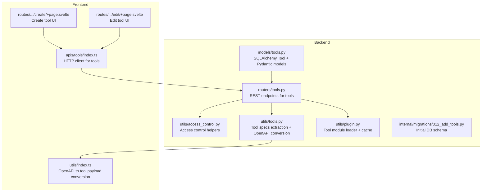
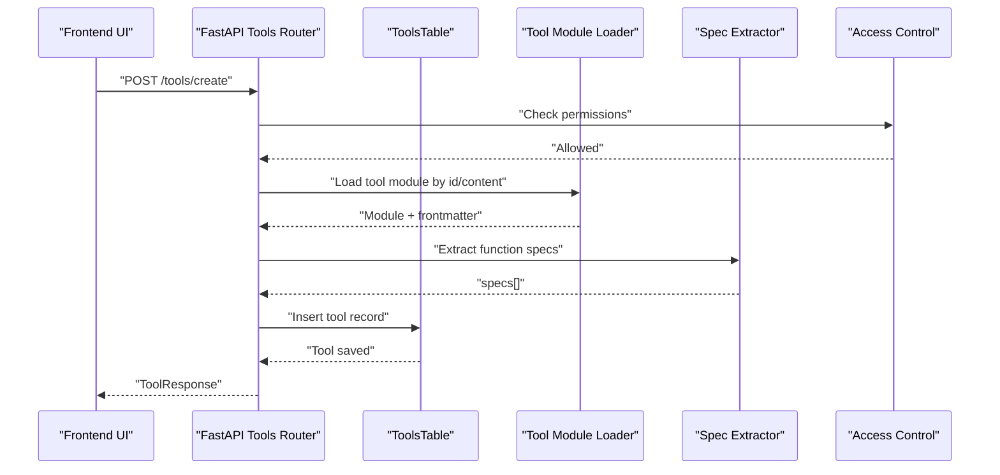
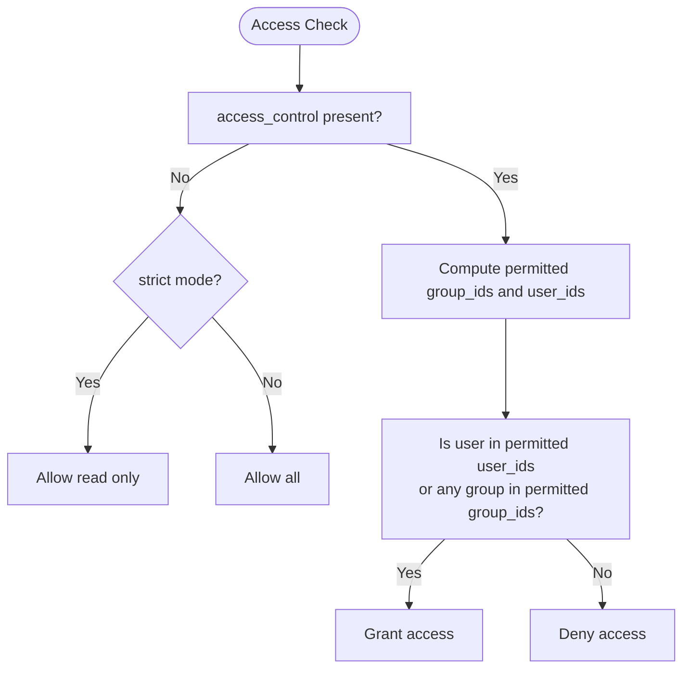
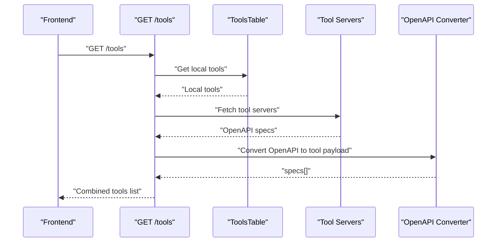
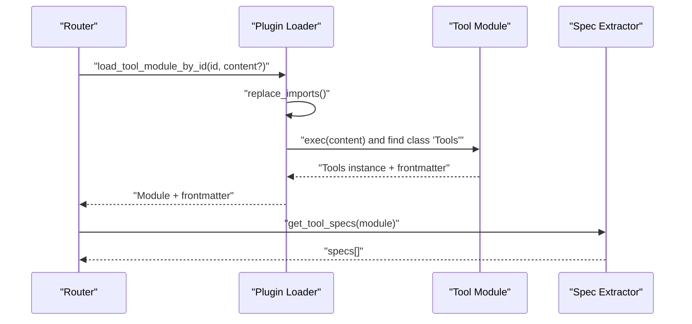
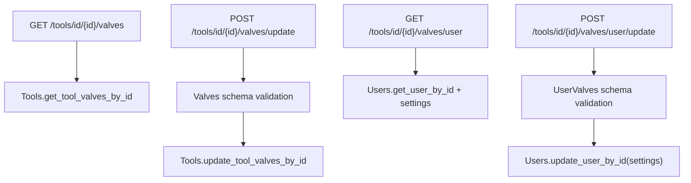
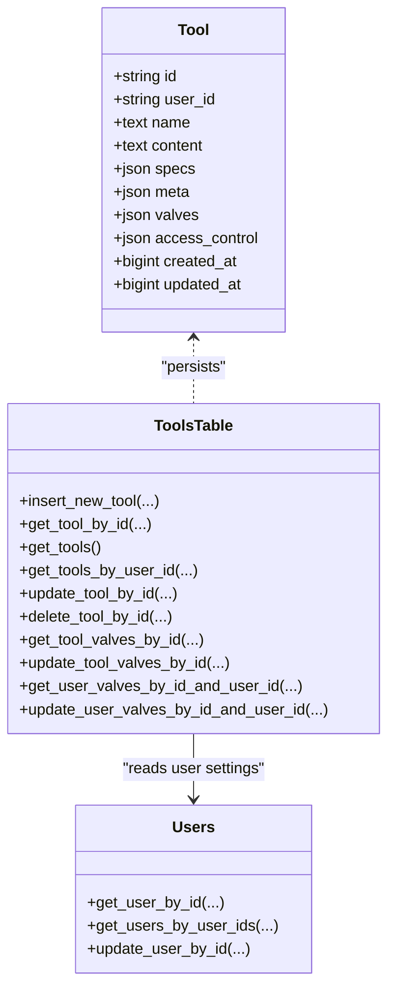
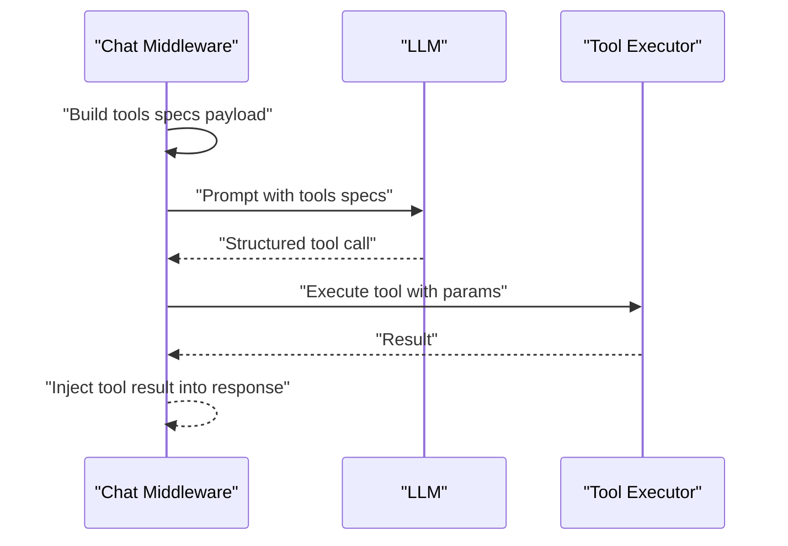
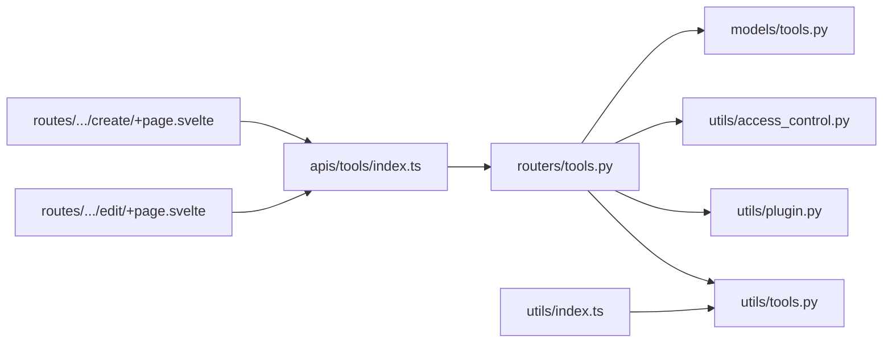

# Tool Integration Model

<cite>
**Referenced Files in This Document**
- [models/tools.py](file://backend/open_webui/models/tools.py)
- [routers/tools.py](file://backend/open_webui/routers/tools.py)
- [utils/access_control.py](file://backend/open_webui/utils/access_control.py)
- [utils/tools.py](file://backend/open_webui/utils/tools.py)
- [utils/plugin.py](file://backend/open_webui/utils/plugin.py)
- [internal/migrations/012_add_tools.py](file://backend/open_webui/internal/migrations/012_add_tools.py)
- [apis/tools/index.ts](file://src/lib/apis/tools/index.ts)
- [routes/(app)/workspace/tools/create/+page.svelte](file://src/routes/(app)/workspace/tools/create/+page.svelte)
- [routes/(app)/workspace/tools/edit/+page.svelte](file://src/routes/(app)/workspace/tools/edit/+page.svelte)
- [utils/index.ts](file://src/lib/utils/index.ts)
</cite>

## Table of Contents
1. [Introduction](#introduction)
2. [Project Structure](#project-structure)
3. [Core Components](#core-components)
4. [Architecture Overview](#architecture-overview)
5. [Detailed Component Analysis](#detailed-component-analysis)
6. [Dependency Analysis](#dependency-analysis)
7. [Performance Considerations](#performance-considerations)
8. [Troubleshooting Guide](#troubleshooting-guide)
9. [Conclusion](#conclusion)
10. [Appendices](#appendices)

## Introduction
This document describes the Tool ORM model used in open-webui to represent tools that integrate with the AI workflow. It covers the entity schema, JSON fields (specs, meta, valves), access control semantics, and how tools are discovered, validated, and executed during function calling. It also explains how the content field stores tool implementation and how the system converts tool specifications into function-callable schemas compatible with LLMs.

## Project Structure
The Tool model spans backend SQLAlchemy ORM definitions, FastAPI routers, access control utilities, tool loading and specification extraction, and frontend APIs and UI pages for tool creation and editing.

**Diagram sources**
- [models/tools.py](file://backend/open_webui/models/tools.py#L24-L110)
- [routers/tools.py](file://backend/open_webui/routers/tools.py#L50-L153)
- [utils/access_control.py](file://backend/open_webui/utils/access_control.py#L124-L175)
- [utils/tools.py](file://backend/open_webui/utils/tools.py#L438-L559)
- [utils/plugin.py](file://backend/open_webui/utils/plugin.py#L71-L116)
- [internal/migrations/012_add_tools.py](file://backend/open_webui/internal/migrations/012_add_tools.py#L40-L56)
- [apis/tools/index.ts](file://src/lib/apis/tools/index.ts#L1-L120)
- [routes/(app)/workspace/tools/create/+page.svelte](file://src/routes/(app)/workspace/tools/create/+page.svelte#L1-L52)
- [routes/(app)/workspace/tools/edit/+page.svelte](file://src/routes/(app)/workspace/tools/edit/+page.svelte#L1-L44)
- [utils/index.ts](file://src/lib/utils/index.ts#L1246-L1311)

**Section sources**
- [models/tools.py](file://backend/open_webui/models/tools.py#L24-L110)
- [routers/tools.py](file://backend/open_webui/routers/tools.py#L50-L153)
- [utils/access_control.py](file://backend/open_webui/utils/access_control.py#L124-L175)
- [utils/tools.py](file://backend/open_webui/utils/tools.py#L438-L559)
- [utils/plugin.py](file://backend/open_webui/utils/plugin.py#L71-L116)
- [internal/migrations/012_add_tools.py](file://backend/open_webui/internal/migrations/012_add_tools.py#L40-L56)
- [apis/tools/index.ts](file://src/lib/apis/tools/index.ts#L1-L120)
- [routes/(app)/workspace/tools/create/+page.svelte](file://src/routes/(app)/workspace/tools/create/+page.svelte#L1-L52)
- [routes/(app)/workspace/tools/edit/+page.svelte](file://src/routes/(app)/workspace/tools/edit/+page.svelte#L1-L44)
- [utils/index.ts](file://src/lib/utils/index.ts#L1246-L1311)

## Core Components
- Tool ORM entity: id, user_id, name, content, specs (JSON), meta (JSON), valves (JSON), access_control (JSON), timestamps.
- Pydantic models for Tool CRUD responses and forms.
- ToolsTable service with persistence operations (insert, get, update, delete) and valves management.
- Access control enforcement via has_access and group membership.
- Tool loading and specification extraction pipeline for function calling.

Key responsibilities:
- Store tool metadata and runtime configuration in JSON fields.
- Enforce access control for tool visibility and modification.
- Convert tool code into function specs consumable by LLMs.
- Manage per-tool and per-user configurable valves.

**Section sources**
- [models/tools.py](file://backend/open_webui/models/tools.py#L24-L110)
- [models/tools.py](file://backend/open_webui/models/tools.py#L113-L275)

## Architecture Overview
The Tool integration follows a layered architecture:
- Frontend UI triggers tool operations via HTTP APIs.
- Backend FastAPI routes validate permissions and orchestrate tool lifecycle.
- Tool content is dynamically loaded and cached.
- Specifications are extracted and exposed for function calling.
- Access control is enforced at discovery and mutation endpoints.

**Diagram sources**
- [routers/tools.py](file://backend/open_webui/routers/tools.py#L270-L333)
- [utils/plugin.py](file://backend/open_webui/utils/plugin.py#L71-L116)
- [utils/tools.py](file://backend/open_webui/utils/tools.py#L438-L448)
- [models/tools.py](file://backend/open_webui/models/tools.py#L113-L170)
- [utils/access_control.py](file://backend/open_webui/utils/access_control.py#L124-L175)

## Detailed Component Analysis

### Tool Entity and JSON Fields
- id: Unique identifier for the tool.
- user_id: Owner association for ownership and access control.
- name: Human-readable tool name.
- content: Tool implementation code stored as text.
- specs: JSON array of function specifications derived from the tool module.
- meta: JSON object containing metadata (e.g., manifest extracted from frontmatter).
- valves: JSON object for tool-level configurable parameters.
- access_control: JSON object controlling who can read/write the tool.
- created_at/updated_at: Epoch timestamps.

The specs field stores function-callable schemas compatible with LLM function calling. The meta field captures frontmatter metadata parsed from the tool content. The valves field holds runtime configuration for the tool.

**Section sources**
- [models/tools.py](file://backend/open_webui/models/tools.py#L24-L54)
- [models/tools.py](file://backend/open_webui/models/tools.py#L56-L74)
- [utils/plugin.py](file://backend/open_webui/utils/plugin.py#L18-L51)

### Access Control Semantics
- None: Public access (available to users with role "user").
- {} (empty): Private access (owner-only).
- Custom permissions: Nested structure specifying allowed group_ids and user_ids for read/write.

Access control is enforced in tool discovery and mutation endpoints. The has_access helper checks user permissions against the tool’s access_control and the user’s group memberships.

**Diagram sources**
- [utils/access_control.py](file://backend/open_webui/utils/access_control.py#L124-L175)
- [routers/tools.py](file://backend/open_webui/routers/tools.py#L141-L152)
- [models/tools.py](file://backend/open_webui/models/tools.py#L35-L51)

**Section sources**
- [models/tools.py](file://backend/open_webui/models/tools.py#L35-L51)
- [utils/access_control.py](file://backend/open_webui/utils/access_control.py#L124-L175)
- [routers/tools.py](file://backend/open_webui/routers/tools.py#L141-L152)

### Tool Discovery and Specification Retrieval
- Tool discovery aggregates:
  - Local tools from the database.
  - Tool servers (OpenAPI/MCP) fetched and augmented with access control.
- Specification retrieval:
  - Local tools: specs are stored in the database and returned.
  - Tool servers: OpenAPI specs are fetched, parsed, and converted to tool payloads.

**Diagram sources**
- [routers/tools.py](file://backend/open_webui/routers/tools.py#L55-L153)
- [utils/tools.py](file://backend/open_webui/utils/tools.py#L481-L559)
- [utils/index.ts](file://src/lib/utils/index.ts#L1246-L1311)

**Section sources**
- [routers/tools.py](file://backend/open_webui/routers/tools.py#L55-L153)
- [utils/tools.py](file://backend/open_webui/utils/tools.py#L481-L559)
- [utils/index.ts](file://src/lib/utils/index.ts#L1246-L1311)

### Tool Implementation Storage and Execution
- content stores the tool implementation code.
- Tool modules are dynamically loaded and cached; the loader replaces import paths and extracts frontmatter.
- Specifications are generated from the module’s callable functions and converted to OpenAI-compatible function specs.

**Diagram sources**
- [utils/plugin.py](file://backend/open_webui/utils/plugin.py#L71-L116)
- [utils/tools.py](file://backend/open_webui/utils/tools.py#L438-L448)
- [routers/tools.py](file://backend/open_webui/routers/tools.py#L270-L333)

**Section sources**
- [utils/plugin.py](file://backend/open_webui/utils/plugin.py#L71-L116)
- [utils/tools.py](file://backend/open_webui/utils/tools.py#L438-L448)
- [routers/tools.py](file://backend/open_webui/routers/tools.py#L270-L333)

### Valves Management
- Tool-level valves: persisted in the tool record for global configuration.
- User-level valves: stored under user settings for per-user overrides.
- APIs expose endpoints to get/update tool valves and user valves, validating schema via Pydantic models if present.

**Diagram sources**
- [routers/tools.py](file://backend/open_webui/routers/tools.py#L456-L648)
- [models/tools.py](file://backend/open_webui/models/tools.py#L184-L247)

**Section sources**
- [routers/tools.py](file://backend/open_webui/routers/tools.py#L456-L648)
- [models/tools.py](file://backend/open_webui/models/tools.py#L184-L247)

### Relationship Between Tools and Users
- Tools are owned by a user (user_id).
- Access control determines who can read/write tools.
- Tool discovery filters results by ownership or granted access.

**Diagram sources**
- [models/tools.py](file://backend/open_webui/models/tools.py#L24-L110)
- [models/tools.py](file://backend/open_webui/models/tools.py#L113-L275)

**Section sources**
- [models/tools.py](file://backend/open_webui/models/tools.py#L24-L110)
- [models/tools.py](file://backend/open_webui/models/tools.py#L113-L275)

### Integration Into AI Workflow
- During chat completion, the system builds a function calling prompt embedding all tool specs.
- The LLM responds with structured tool calls; the middleware parses and executes them.
- Tool execution uses the loaded module and its configured valves.

**Diagram sources**
- [utils/tools.py](file://backend/open_webui/utils/tools.py#L438-L448)
- [utils/middleware.py](file://backend/open_webui/utils/middleware.py#L317-L396)

**Section sources**
- [utils/tools.py](file://backend/open_webui/utils/tools.py#L438-L448)
- [utils/middleware.py](file://backend/open_webui/utils/middleware.py#L317-L396)

## Dependency Analysis
- ToolsTable depends on:
  - SQLAlchemy ORM Tool model for persistence.
  - Users model for user settings and group membership.
  - Access control utilities for permission checks.
  - Plugin loader for dynamic module loading.
  - Spec extractor for function specs.
- Routers depend on ToolsTable and access control utilities.
- Frontend APIs depend on routers.

**Diagram sources**
- [routers/tools.py](file://backend/open_webui/routers/tools.py#L50-L153)
- [models/tools.py](file://backend/open_webui/models/tools.py#L113-L275)
- [utils/access_control.py](file://backend/open_webui/utils/access_control.py#L124-L175)
- [utils/plugin.py](file://backend/open_webui/utils/plugin.py#L71-L116)
- [utils/tools.py](file://backend/open_webui/utils/tools.py#L438-L559)
- [apis/tools/index.ts](file://src/lib/apis/tools/index.ts#L1-L120)
- [routes/(app)/workspace/tools/create/+page.svelte](file://src/routes/(app)/workspace/tools/create/+page.svelte#L1-L52)
- [routes/(app)/workspace/tools/edit/+page.svelte](file://src/routes/(app)/workspace/tools/edit/+page.svelte#L1-L44)
- [utils/index.ts](file://src/lib/utils/index.ts#L1246-L1311)

**Section sources**
- [routers/tools.py](file://backend/open_webui/routers/tools.py#L50-L153)
- [models/tools.py](file://backend/open_webui/models/tools.py#L113-L275)
- [utils/access_control.py](file://backend/open_webui/utils/access_control.py#L124-L175)
- [utils/plugin.py](file://backend/open_webui/utils/plugin.py#L71-L116)
- [utils/tools.py](file://backend/open_webui/utils/tools.py#L438-L559)
- [apis/tools/index.ts](file://src/lib/apis/tools/index.ts#L1-L120)
- [routes/(app)/workspace/tools/create/+page.svelte](file://src/routes/(app)/workspace/tools/create/+page.svelte#L1-L52)
- [routes/(app)/workspace/tools/edit/+page.svelte](file://src/routes/(app)/workspace/tools/edit/+page.svelte#L1-L44)
- [utils/index.ts](file://src/lib/utils/index.ts#L1246-L1311)

## Performance Considerations
- Tool module caching: The loader caches modules and content to avoid repeated parsing and imports.
- Redis-backed tool server caching: Tool server specs are cached to reduce network overhead.
- Efficient filtering: Tool discovery filters by ownership and access control to minimize unnecessary loads.
- JSON field indexing: Consider adding indexes on frequently queried JSON fields if performance degrades.

[No sources needed since this section provides general guidance]

## Troubleshooting Guide
Common issues and resolutions:
- Tool not found: Ensure the tool id exists and the user has read access.
- Permission denied: Verify the user’s role and group permissions align with the tool’s access_control.
- Specs not appearing: Confirm the tool module exports a class with callable functions and that get_tool_specs runs successfully.
- Valves validation errors: Ensure the submitted values conform to the tool’s Valves/UserValves schema.

**Section sources**
- [routers/tools.py](file://backend/open_webui/routers/tools.py#L339-L356)
- [routers/tools.py](file://backend/open_webui/routers/tools.py#L363-L419)
- [routers/tools.py](file://backend/open_webui/routers/tools.py#L456-L648)
- [utils/tools.py](file://backend/open_webui/utils/tools.py#L438-L448)

## Conclusion
The Tool integration model provides a robust foundation for managing tools that participate in AI workflows. It supports secure sharing via access control, dynamic loading of tool implementations, and standardized function specifications for LLM function calling. The valves system enables flexible configuration at both tool and user levels. Together, these components enable a scalable and extensible tool ecosystem.

[No sources needed since this section summarizes without analyzing specific files]

## Appendices

### Appendix A: Database Migration for Tools
The initial schema included id, user_id, name, content, specs, meta, created_at, updated_at. The migration defines the table structure and uniqueness constraints.

**Section sources**
- [internal/migrations/012_add_tools.py](file://backend/open_webui/internal/migrations/012_add_tools.py#L40-L56)

### Appendix B: Frontend Tool Operations
- Create tool: UI posts tool metadata and content; backend validates and persists.
- Edit tool: UI updates tool metadata and content; backend reloads module and regenerates specs.
- Delete tool: UI requests deletion; backend enforces ownership/write access and removes the record.

**Section sources**
- [routes/(app)/workspace/tools/create/+page.svelte](file://src/routes/(app)/workspace/tools/create/+page.svelte#L1-L52)
- [routes/(app)/workspace/tools/edit/+page.svelte](file://src/routes/(app)/workspace/tools/edit/+page.svelte#L1-L44)
- [apis/tools/index.ts](file://src/lib/apis/tools/index.ts#L1-L120)
- [routers/tools.py](file://backend/open_webui/routers/tools.py#L270-L454)