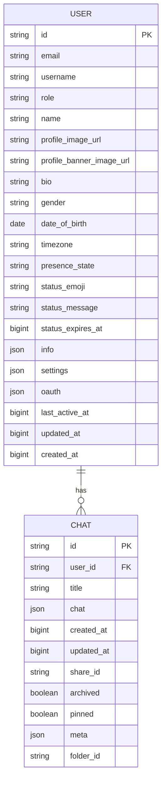
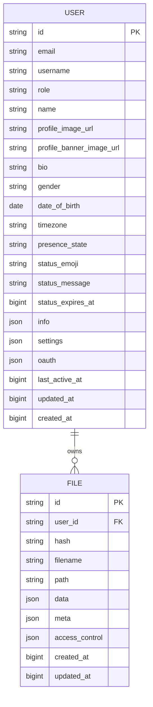
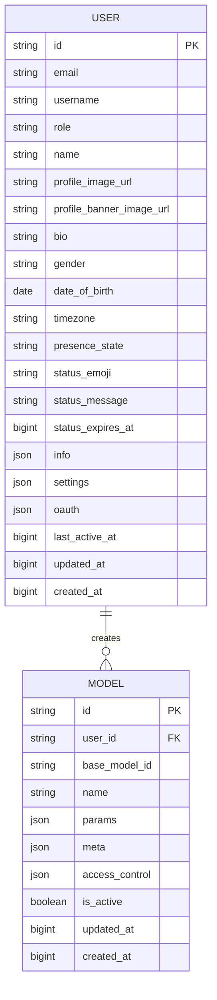
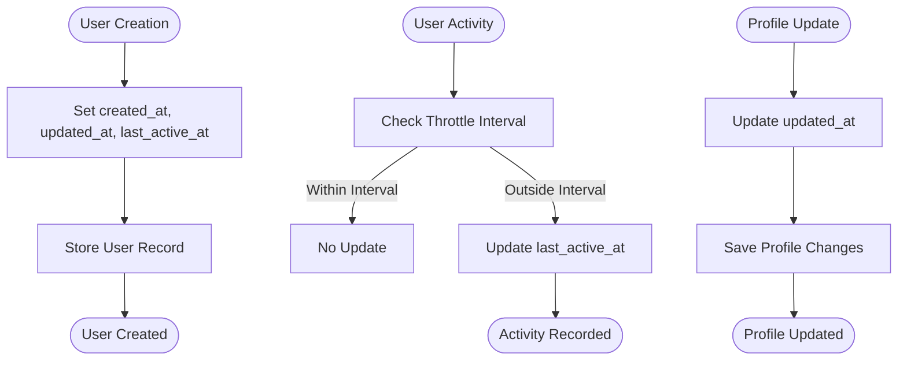
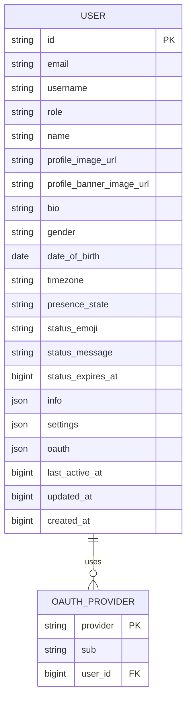

# User Model

<cite>
**Referenced Files in This Document**   
- [users.py](file://backend/open_webui/models/users.py)
- [db.py](file://backend/open_webui/internal/db.py)
- [001_initial_schema.py](file://backend/open_webui/internal/migrations/001_initial_schema.py)
- [011_add_user_settings.py](file://backend/open_webui/internal/migrations/011_add_user_settings.py)
- [017_add_user_oauth_sub.py](file://backend/open_webui/internal/migrations/017_add_user_oauth_sub.py)
- [3af16a1c9fb6_update_user_table.py](file://backend/open_webui/migrations/versions/3af16a1c9fb6_update_user_table.py)
- [b10670c03dd5_update_user_table.py](file://backend/open_webui/migrations/versions/b10670c03dd5_update_user_table.py)
- [chats.py](file://backend/open_webui/models/chats.py)
- [files.py](file://backend/open_webui/models/files.py)
- [models.py](file://backend/open_webui/models/models.py)
</cite>

## Table of Contents
1. [Introduction](#introduction)
2. [Entity Structure and Fields](#entity-structure-and-fields)
3. [Primary Key and Constraints](#primary-key-and-constraints)
4. [Data Types and Nullable Properties](#data-types-and-nullable-properties)
5. [Relationships with Other Models](#relationships-with-other-models)
6. [Data Lifecycle Management](#data-lifecycle-management)
7. [JSON Field Usage](#json-field-usage)
8. [Indexing and Performance](#indexing-and-performance)
9. [Common Database Queries](#common-database-queries)
10. [Conclusion](#conclusion)

## Introduction

The User model in open-webui serves as the central entity for user management, authentication, and profile information storage. This comprehensive data model supports a wide range of functionality including user authentication, profile management, presence tracking, and preference storage. The model has evolved through multiple migrations to support additional features while maintaining backward compatibility. It forms the foundation for user-related operations across the application, connecting to various other models through foreign key relationships.

**Section sources**
- [users.py](file://backend/open_webui/models/users.py#L45-L719)

## Entity Structure and Fields

The User model contains a comprehensive set of fields that support authentication, profile management, and user preferences. The core fields include:

- **id**: Unique identifier for the user (primary key)
- **email**: User's email address used for authentication and identification
- **username**: Optional username for display and identification purposes
- **role**: User role that determines permissions and access levels (default: "pending")
- **name**: User's display name
- **profile_image_url**: URL to the user's profile image
- **profile_banner_image_url**: Optional URL to the user's profile banner image
- **bio**: Optional biography or description
- **gender**: Optional gender information
- **date_of_birth**: Optional date of birth
- **timezone**: Optional timezone preference
- **presence_state**: Current presence state (e.g., online, offline)
- **status_emoji**: Emoji representing the user's current status
- **status_message**: Custom status message
- **status_expires_at**: Timestamp when the status expires
- **info**: JSON field for additional user information
- **settings**: JSON field for user preferences and settings
- **oauth**: JSON field storing OAuth provider information
- **last_active_at**: Timestamp of the user's last activity
- **updated_at**: Timestamp of the last update to the user record
- **created_at**: Timestamp when the user record was created

The model also includes related entities such as ApiKey, which stores API key information linked to users through the user_id foreign key.

**Section sources**
- [users.py](file://backend/open_webui/models/users.py#L48-L75)

## Primary Key and Constraints

The User model implements a robust constraint system to ensure data integrity:

- **Primary Key**: The `id` field serves as the primary key with a unique constraint, ensuring each user has a unique identifier
- **Unique Constraints**: The primary key constraint on `id` ensures uniqueness across all user records
- **Foreign Key Relationships**: The model establishes relationships with other entities through foreign keys, particularly the `user_id` field in related tables like Chats, Files, and Models
- **Index Constraints**: While not explicitly defined in the model, the Alembic migrations suggest indexing strategies for performance optimization on commonly queried fields

The primary key is implemented as a String field with a unique constraint, allowing for flexible ID generation strategies (such as UUIDs) while ensuring referential integrity across the database.

**Section sources**
- [users.py](file://backend/open_webui/models/users.py#L48)
- [b10670c03dd5_update_user_table.py](file://backend/open_webui/migrations/versions/b10670c03dd5_update_user_table.py#L137-L145)

## Data Types and Nullable Properties

The User model employs a variety of data types to accommodate different kinds of information:

- **String**: Used for `id`, `email`, `username`, `role`, `name`, `presence_state`, `status_emoji`, and `timezone`
- **Text**: Used for longer text fields like `profile_image_url`, `profile_banner_image_url`, `bio`, and `status_message`
- **Date**: Used for `date_of_birth` to store date information
- **BigInteger**: Used for timestamp fields (`last_active_at`, `updated_at`, `created_at`) and `status_expires_at` to store Unix timestamps
- **JSON**: Used for flexible storage in `info`, `settings`, and `oauth` fields

Regarding nullable properties:
- **Non-nullable fields**: `id`, `email`, `role`, `name`, `profile_image_url`, `last_active_at`, `updated_at`, and `created_at` are required
- **Nullable fields**: `username`, `bio`, `gender`, `date_of_birth`, `timezone`, `presence_state`, `status_emoji`, `status_message`, `status_expires_at`, `info`, `settings`, and `oauth` can be null

This design ensures essential user information is always present while allowing flexibility for optional profile data and preferences.

**Section sources**
- [users.py](file://backend/open_webui/models/users.py#L48-L75)

## Relationships with Other Models

The User model serves as the central entity in a network of relationships with other models through the `user_id` foreign key pattern:

### Chats Model Relationship
The User model has a one-to-many relationship with the Chats model, where each user can have multiple chat records. The Chats model contains a `user_id` field that references the User's `id`, enabling:
- Retrieval of all chats belonging to a specific user
- User-specific chat organization and filtering
- Access control based on user ownership



**Diagram sources**
- [users.py](file://backend/open_webui/models/users.py#L45-L75)
- [chats.py](file://backend/open_webui/models/chats.py#L26-L43)

### Files Model Relationship
The User model has a one-to-many relationship with the Files model, where each user can have multiple file records. The Files model contains a `user_id` field that references the User's `id`, enabling:
- User-specific file storage and organization
- Access control for file operations
- File ownership tracking



**Diagram sources**
- [users.py](file://backend/open_webui/models/users.py#L45-L75)
- [files.py](file://backend/open_webui/models/files.py#L18-L34)

### Models Model Relationship
The User model has a one-to-many relationship with the Models model, where each user can have multiple model records. The Models model contains a `user_id` field that references the User's `id`, enabling:
- User-specific model configuration and management
- Ownership tracking for custom models
- Access control for model operations



**Diagram sources**
- [users.py](file://backend/open_webui/models/users.py#L45-L75)
- [models.py](file://backend/open_webui/models/models.py#L55-L105)

## Data Lifecycle Management

The User model implements comprehensive data lifecycle management through timestamp fields and automated updates:

### Creation Process
When a new user is created, the system automatically sets three timestamp fields:
- **created_at**: Set to the current Unix timestamp when the user record is first created
- **updated_at**: Set to the current Unix timestamp during creation
- **last_active_at**: Set to the current Unix timestamp when the user first logs in

The `insert_new_user` method in the `UsersTable` class handles user creation, initializing these timestamps and setting default values for other fields.

### Update Process
The `updated_at` field is updated whenever any user information is modified. This includes:
- Profile updates (name, bio, profile image, etc.)
- Role changes
- Status updates
- Settings modifications
- OAuth information updates

The system provides specific methods for updating different aspects of the user record, such as `update_user_by_id`, `update_user_role_by_id`, and `update_user_settings_by_id`, all of which update the `updated_at` timestamp.

### Last Active Tracking
The `last_active_at` field is crucial for presence detection and user activity monitoring:
- Updated when the user interacts with the system
- Used to determine if a user is currently active
- Powers the "last seen" functionality in the UI
- Used in calculating active user counts

The `update_last_active_by_id` method is decorated with a throttle decorator to prevent excessive database updates from frequent user activity, optimizing performance while maintaining accurate presence information.



**Diagram sources**
- [users.py](file://backend/open_webui/models/users.py#L73-L75)
- [users.py](file://backend/open_webui/models/users.py#L551-L563)

**Section sources**
- [users.py](file://backend/open_webui/models/users.py#L73-L75)
- [users.py](file://backend/open_webui/models/users.py#L551-L563)

## JSON Field Usage

The User model leverages JSON fields for flexible storage of structured data that may vary between users or evolve over time:

### info Field
The `info` field stores additional user information in JSON format. This flexible structure allows for:
- Storing arbitrary user metadata without requiring database schema changes
- Supporting future extensions to user data without migrations
- Accommodating user-specific information that doesn't fit predefined fields

### settings Field
The `settings` field stores user preferences and configuration options. The `UserSettings` Pydantic model defines the structure:
- **ui**: Nested object for UI-related settings
- **Additional properties**: The model allows extra fields through `model_config = ConfigDict(extra="allow")`

This design enables users to customize their experience with various interface preferences and application settings.

### oauth Field
The `oauth` field stores authentication information from OAuth providers in a structured JSON format:
```json
{
  "google": { "sub": "123" },
  "github": { "sub": "abc" }
}
```
This structure supports:
- Multiple OAuth providers for a single user
- Secure storage of provider-specific identifiers
- Flexible authentication methods

The system provides methods like `update_user_oauth_by_id` to safely update this field, ensuring proper JSON structure and data integrity.



**Diagram sources**
- [users.py](file://backend/open_webui/models/users.py#L68-L71)
- [users.py](file://backend/open_webui/models/users.py#L565-L595)

**Section sources**
- [users.py](file://backend/open_webui/models/users.py#L68-L71)
- [users.py](file://backend/open_webui/models/users.py#L565-L595)

## Indexing and Performance

The User model's indexing strategy has evolved through migrations to optimize query performance:

### Migration History
The database schema has undergone several migrations that affect indexing:
- **001_initial_schema.py**: Initial schema with basic user fields
- **011_add_user_settings.py**: Added the `settings` field
- **017_add_user_oauth_sub.py**: Added OAuth support
- **3af16a1c9fb6_update_user_table.py**: Added profile fields like username, bio, gender, and date_of_birth
- **b10670c03dd5_update_user_table.py**: Comprehensive update adding presence state, status fields, and converting text fields to JSON

### Query Optimization
While explicit indexes on the User table are not visible in the provided code, the query patterns suggest optimization for:
- User lookups by ID (`get_user_by_id`)
- User lookups by email (`get_user_by_email`)
- User lookups by API key (`get_user_by_api_key`)
- User lookups by OAuth sub (`get_user_by_oauth_sub`)
- User searches with filtering and pagination (`get_users`)

The `get_users` method implements sophisticated filtering capabilities including:
- Text search on name and email
- Filtering by channel membership
- Filtering by group membership
- Role-based filtering (including exclusion with "!role" syntax)
- Various ordering options (name, email, created_at, last_active_at, etc.)

These query patterns indicate that appropriate indexes would be beneficial on fields frequently used in WHERE clauses and ORDER BY operations.

**Section sources**
- [users.py](file://backend/open_webui/models/users.py#L270-L453)
- [3af16a1c9fb6_update_user_table.py](file://backend/open_webui/migrations/versions/3af16a1c9fb6_update_user_table.py)
- [b10670c03dd5_update_user_table.py](file://backend/open_webui/migrations/versions/b10670c03dd5_update_user_table.py)

## Common Database Queries

The User model supports a variety of common database queries through its `UsersTable` class methods:

### User Retrieval Queries
```python
# Get user by ID
def get_user_by_id(self, id: str) -> Optional[UserModel]:
    with get_db() as db:
        user = db.query(User).filter_by(id=id).first()
        return UserModel.model_validate(user)

# Get user by email
def get_user_by_email(self, email: str) -> Optional[UserModel]:
    with get_db() as db:
        user = db.query(User).filter_by(email=email).first()
        return UserModel.model_validate(user)

# Get user by API key
def get_user_by_api_key(self, api_key: str) -> Optional[UserModel]:
    with get_db() as db:
        user = (
            db.query(User)
            .join(ApiKey, User.id == ApiKey.user_id)
            .filter(ApiKey.key == api_key)
            .first()
        )
        return UserModel.model_validate(user) if user else None
```

### User Search and Filtering
```python
# Get users with filtering options
def get_users(
    self,
    filter: Optional[dict] = None,
    skip: Optional[int] = None,
    limit: Optional[int] = None,
) -> dict:
    with get_db() as db:
        query = db.query(User)
        
        # Text search
        if filter and filter.get("query"):
            query = query.filter(
                or_(
                    User.name.ilike(f"%{filter['query']}%"),
                    User.email.ilike(f"%{filter['query']}%"),
                )
            )
            
        # Filter by roles
        if filter and filter.get("roles"):
            include_roles = [role for role in roles if not role.startswith("!")]
            exclude_roles = [role[1:] for role in roles if role.startswith("!")]
            
            if include_roles:
                query = query.filter(User.role.in_(include_roles))
            if exclude_roles:
                query = query.filter(~User.role.in_(exclude_roles))
                
        # Ordering
        if order_by == "last_active_at":
            if direction == "asc":
                query = query.order_by(User.last_active_at.asc())
            else:
                query = query.order_by(User.last_active_at.desc())
```

### User Update Operations
```python
# Update user settings
def update_user_settings_by_id(self, id: str, updated: dict) -> Optional[UserModel]:
    try:
        with get_db() as db:
            user_settings = db.query(User).filter_by(id=id).first().settings
            if user_settings is None:
                user_settings = {}
            user_settings.update(updated)
            
            db.query(User).filter_by(id=id).update({"settings": user_settings})
            db.commit()
            user = db.query(User).filter_by(id=id).first()
            return UserModel.model_validate(user)
    except Exception:
        return None

# Update last active timestamp
@throttle(DATABASE_USER_ACTIVE_STATUS_UPDATE_INTERVAL)
def update_last_active_by_id(self, id: str) -> Optional[UserModel]:
    try:
        with get_db() as db:
            db.query(User).filter_by(id=id).update(
                {"last_active_at": int(time.time())}
            )
            db.commit()
            user = db.query(User).filter_by(id=id).first()
            return UserModel.model_validate(user)
    except Exception:
        return None
```

### User Management Queries
```python
# Check if user is active
def is_user_active(self, user_id: str) -> bool:
    with get_db() as db:
        user = db.query(User).filter_by(id=user_id).first()
        if user and user.last_active_at:
            three_minutes_ago = int(time.time()) - 180
            return user.last_active_at >= three_minutes_ago
        return False

# Get active user count
def get_active_user_count(self) -> int:
    with get_db() as db:
        three_minutes_ago = int(time.time()) - 180
        count = (
            db.query(User).filter(User.last_active_at >= three_minutes_ago).count()
        )
        return count
```

These queries demonstrate the comprehensive API provided by the UsersTable class for interacting with user data, covering creation, retrieval, updating, and deletion operations with appropriate error handling and database transaction management.

**Section sources**
- [users.py](file://backend/open_webui/models/users.py#L270-L716)

## Conclusion

The User model in open-webui represents a comprehensive and well-designed data structure that serves as the foundation for user management in the application. It effectively balances data integrity with flexibility through a combination of strongly-typed fields and JSON storage for variable data. The model supports essential functionality including authentication, profile management, presence tracking, and preference storage.

Key strengths of the model include:
- Comprehensive field coverage for user information and preferences
- Robust data lifecycle management with creation, update, and activity tracking
- Flexible JSON fields for extensible data storage
- Well-defined relationships with other models through foreign key patterns
- Efficient query patterns with filtering, sorting, and pagination

The model has evolved through a series of migrations that demonstrate thoughtful design progression, from initial implementation to the addition of advanced features like OAuth authentication, presence state, and detailed user settings. The use of Pydantic models for data validation and the SQLAlchemy ORM for database operations ensures type safety and maintainability.

For future development, potential improvements could include:
- Explicit indexing on frequently queried fields to enhance performance
- Enhanced validation for JSON field structures
- Additional audit fields for security and compliance
- Improved documentation of the JSON schema for settings and info fields

Overall, the User model provides a solid foundation for user management in open-webui, supporting current functionality while allowing for future expansion.

**Section sources**
- [users.py](file://backend/open_webui/models/users.py#L45-L719)
- [db.py](file://backend/open_webui/internal/db.py)
- [migrations](file://backend/open_webui/migrations/versions/)