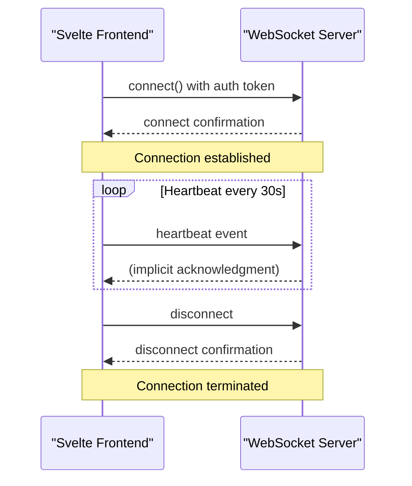
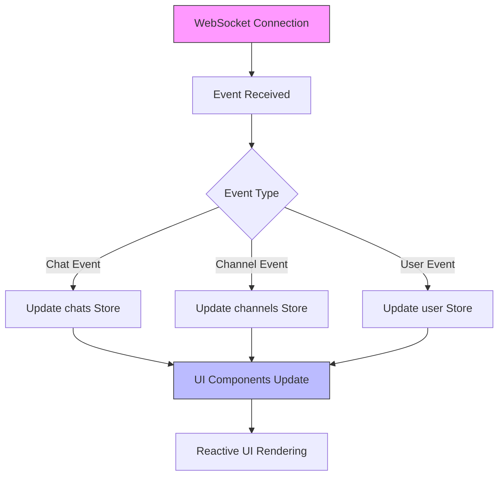
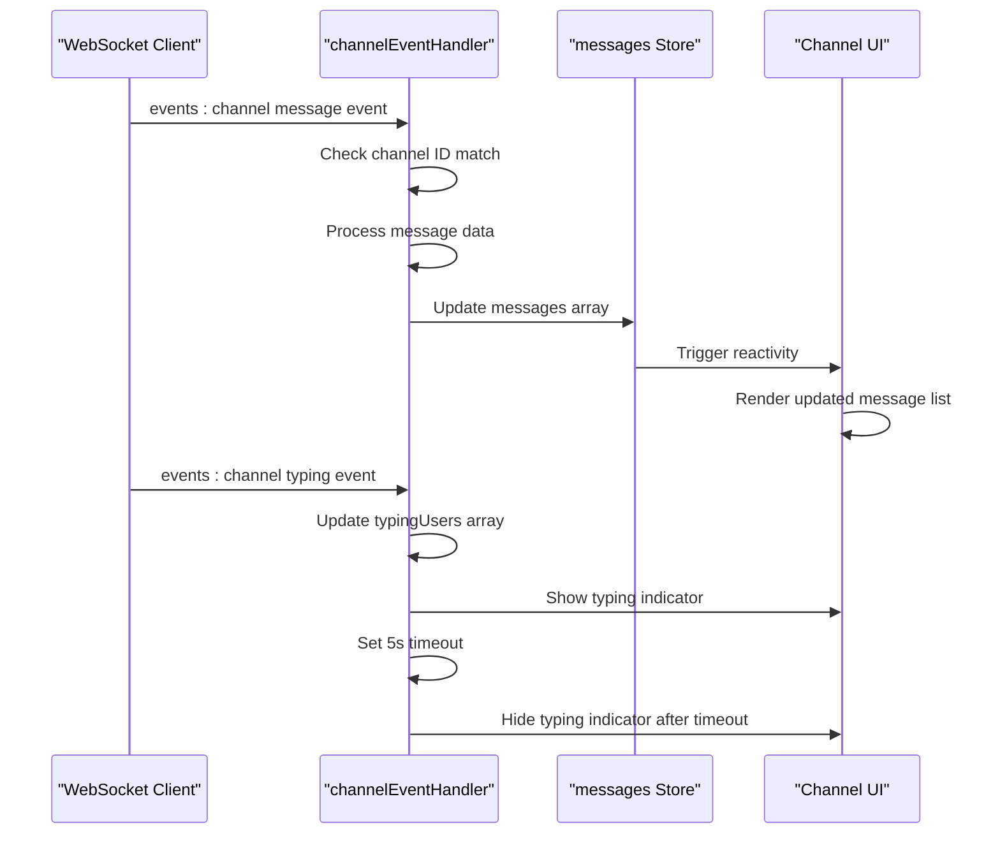

# Client-Side Implementation

<cite>
**Referenced Files in This Document**   
- [index.ts](file://src/lib/stores/index.ts)
- [+layout.svelte](file://src/routes/+layout.svelte)
- [main.py](file://backend/open_webui/socket/main.py)
- [utils.py](file://backend/open_webui/socket/utils.py)
- [Channel.svelte](file://src/lib/components/channel/Channel.svelte)
- [Messages.svelte](file://src/lib/components/channel/Messages.svelte)
</cite>

## Table of Contents
1. [WebSocket Client Initialization](#websocket-client-initialization)
2. [Connection Configuration](#connection-configuration)
3. [Event Listener Registration](#event-listener-registration)
4. [Svelte Store Integration](#svelte-store-integration)
5. [Chat Event Handler](#chat-event-handler)
6. [Channel Event Handler](#channel-event-handler)
7. [Error Handling and Reconnection](#error-handling-and-reconnection)
8. [Component Subscription Management](#component-subscription-management)

## WebSocket Client Initialization

The WebSocket client in open-webui's Svelte frontend is initialized within the `+layout.svelte` component, which serves as the root layout for the application. The Socket.IO client is imported from the `socket.io-client` package and configured during the `onMount` lifecycle event. The socket instance is stored in a Svelte store named `socket`, which is defined in the central stores module at `src/lib/stores/index.ts`. This store-based approach enables reactive state management across components that need access to the WebSocket connection.

The initialization process begins by retrieving backend configuration through the `getBackendConfig` API call. Once the configuration is available, the `setupSocket` function is called with a boolean parameter indicating whether WebSocket support is enabled on the server. This function creates a new Socket.IO client instance using the `io` function, passing the base URL of the application and a configuration object that defines connection options.

**Section sources**
- [index.ts](file://src/lib/stores/index.ts#L28)
- [+layout.svelte](file://src/routes/+layout.svelte#L97-L107)

## Connection Configuration

The Socket.IO client is configured with several options to ensure reliable and efficient communication with the server. The connection is established to the server's base URL with a custom path `/ws/socket.io`, which routes requests to the WebSocket endpoint. Authentication is handled by including the user's token from `localStorage` in the `auth` property of the configuration object, allowing the server to authenticate the client upon connection.

The client is configured with reconnection settings that include a base delay of 1000ms, a maximum delay of 5000ms, and a randomization factor of 0.5 to prevent connection storms. The transport mechanism is dynamically selected based on the server's capabilities, with WebSocket preferred when available, falling back to polling if necessary. This ensures compatibility across different network environments and server configurations.

A heartbeat mechanism is implemented to maintain the connection and detect user activity. A 30-second interval timer sends a heartbeat event to the server, which updates the user's last active timestamp. This heartbeat is cleared when the connection is lost and re-established upon reconnection, ensuring efficient resource usage.

**Diagram sources**
- [+layout.svelte](file://src/routes/+layout.svelte#L98-L106)
- [+layout.svelte](file://src/routes/+layout.svelte#L131-L137)
- [main.py](file://backend/open_webui/socket/main.py#L354-L359)

**Section sources**
- [+layout.svelte](file://src/routes/+layout.svelte#L97-L141)

## Event Listener Registration

Event listeners are registered to handle various WebSocket events throughout the application lifecycle. The primary event listeners are set up in the `+layout.svelte` component when a user session is established. The `user` store's subscription callback manages the registration and cleanup of event listeners, ensuring proper lifecycle management.

Two main event handlers are registered: `chatEventHandler` for the "events" channel and `channelEventHandler` for the "events:channel" channel. These handlers are attached when a user is authenticated and detached when the user logs out or the component is destroyed. This pattern prevents memory leaks and ensures that event handlers are only active when relevant.

The event listener registration is reactive to the user's authentication state. When the user store receives a value (indicating login), the existing handlers are first removed using `off()` calls, and then the new handlers are attached using `on()` calls. This approach ensures that there are no duplicate listeners and that the handlers have access to the current application state.

**Section sources**
- [+layout.svelte](file://src/routes/+layout.svelte#L683-L707)

## Svelte Store Integration

The WebSocket implementation integrates tightly with Svelte stores to enable reactive state management across the application. The central `socket` store, defined in `src/lib/stores/index.ts`, holds the Socket.IO client instance and is accessible to all components that import it. This store pattern allows components to reactively respond to changes in the connection state without requiring direct references to the socket instance.

Several other stores are updated in response to WebSocket events, creating a reactive data flow throughout the application. For example, the `channels` store is updated when channel-related events are received, and the `chats` store is updated when chat-related events occur. This store-based architecture ensures that UI components automatically re-render when data changes, providing a seamless user experience.

The integration between WebSocket events and stores is implemented through the event handler functions. When an event is received, the handler updates the relevant store(s) with new data, triggering reactive updates in all subscribed components. This pattern decouples the WebSocket communication layer from the UI components, making the code more maintainable and testable.

**Diagram sources**
- [index.ts](file://src/lib/stores/index.ts#L28-L31)
- [+layout.svelte](file://src/routes/+layout.svelte#L325-L383)
- [+layout.svelte](file://src/routes/+layout.svelte#L482-L500)

**Section sources**
- [index.ts](file://src/lib/stores/index.ts#L1-L51)
- [+layout.svelte](file://src/routes/+layout.svelte#L325-L500)

## Chat Event Handler

The chat event handler, defined as `chatEventHandler` in the `+layout.svelte` component, processes incoming events related to chat interactions. This handler is registered to listen for "events" on the WebSocket connection and processes different event types to update the application state accordingly.

The handler first determines whether the event is relevant to the current context by checking if the chat ID in the event matches the currently active chat or if the temporary chat feature is enabled. It also considers the tab's focus state to determine whether to show notifications. For chat completion events, the handler checks user settings to determine whether to play a notification sound or show a browser notification.

When a chat completion event is received with `done: true`, indicating the completion is finished, the handler triggers user feedback mechanisms. If the "notification sound always" setting is enabled, an audio notification is played. If the user has notifications enabled and this tab is the last active one, a browser notification is displayed with the chat title and content.

The handler also processes other chat-related events such as chat title updates and tag updates, refreshing the relevant stores to ensure the UI reflects the latest data. For events originating from the same client session, the handler processes execution requests for Python code and tool execution, coordinating with worker threads to execute the code and return results.

**Section sources**
- [+layout.svelte](file://src/routes/+layout.svelte#L325-L478)

## Channel Event Handler

The channel event handler, implemented as `channelEventHandler` in the `+layout.svelte` component, manages events related to channel communications. This handler is specifically registered for the "events:channel" event and processes various types of channel interactions including new messages, message updates, deletions, reactions, and typing indicators.

The handler first filters events to only process those relevant to the current channel context. When a new message event is received, it updates the messages array by adding the new message and removing any temporary message with the same temp_id. This ensures that optimistic UI updates are properly replaced with server-confirmed messages.

For typing indicators, the handler maintains a list of users who are currently typing, updating this list based on incoming typing events. A timeout mechanism clears the typing indicator after 5 seconds of inactivity, providing a smooth user experience in collaborative environments. The handler also processes message updates, deletions, and reactions, updating the local messages array accordingly to reflect changes in real-time.

The channel event handler is also implemented in the `Channel.svelte` component for more granular control within the channel context. This component-specific handler allows for focused event processing and UI updates specific to the channel view, while the global handler in `+layout.svelte` ensures that channel events are processed even when the user is not directly viewing the channel.

**Diagram sources**
- [+layout.svelte](file://src/routes/+layout.svelte#L482-L500)
- [Channel.svelte](file://src/lib/components/channel/Channel.svelte#L115-L174)

**Section sources**
- [+layout.svelte](file://src/routes/+layout.svelte#L482-L500)
- [Channel.svelte](file://src/lib/components/channel/Channel.svelte#L115-L174)

## Error Handling and Reconnection

The WebSocket implementation includes comprehensive error handling and reconnection logic to ensure a resilient user experience. The client registers listeners for various connection lifecycle events, including `connect_error`, `reconnect_attempt`, `reconnect_failed`, and `disconnect`. These listeners provide visibility into connection issues and enable appropriate user feedback.

When a connection error occurs, the `connect_error` event handler logs the error to the console, aiding in debugging and monitoring. During reconnection attempts, the `reconnect_attempt` handler logs each attempt, while the `reconnect_failed` handler logs when reconnection ultimately fails. The `disconnect` handler logs the reason for disconnection and clears the heartbeat interval to prevent unnecessary network activity.

The reconnection strategy leverages Socket.IO's built-in reconnection mechanism with configurable parameters. The client automatically attempts to reconnect with exponential backoff, starting at 1 second and increasing to a maximum of 5 seconds between attempts. This approach balances responsiveness with network efficiency, preventing overwhelming the server with connection requests during outages.

User feedback is integrated into the connection status changes through the use of Svelte stores. The `isLastActiveTab` store, combined with visibility change events, ensures that notifications are only shown when appropriate. This prevents redundant notifications across multiple browser tabs while still informing users of important events when they return to the application.

**Section sources**
- [+layout.svelte](file://src/routes/+layout.svelte#L109-L177)

## Component Subscription Management

The application implements a robust pattern for managing component subscriptions to WebSocket events, preventing memory leaks and ensuring proper cleanup. The primary mechanism is the use of Svelte's store subscription pattern in conjunction with explicit event listener removal.

In the `+layout.svelte` component, the user store's subscription callback manages the lifecycle of event listeners. When a user logs in (value is truthy), existing listeners are first removed with `off()` calls before new ones are added with `on()` calls. This ensures that there are no duplicate listeners and that handlers have access to the current application state. When a user logs out (value is falsy), the listeners are removed to prevent processing events for an unauthenticated session.

Component-specific subscriptions are managed using Svelte's `onDestroy` lifecycle function. For example, in the `Thread.svelte` component, the `onDestroy` function explicitly removes the channel event listener to prevent memory leaks when the component is destroyed. This pattern ensures that event listeners are cleaned up when components are removed from the DOM.

The application also uses a BroadcastChannel to coordinate state across multiple browser tabs, ensuring that only the active tab processes certain events and displays notifications. This prevents duplicate notifications and ensures a consistent user experience when the application is open in multiple tabs.

**Section sources**
- [+layout.svelte](file://src/routes/+layout.svelte#L683-L707)
- [Thread.svelte](file://src/lib/components/channel/Thread.svelte#L162-L164)