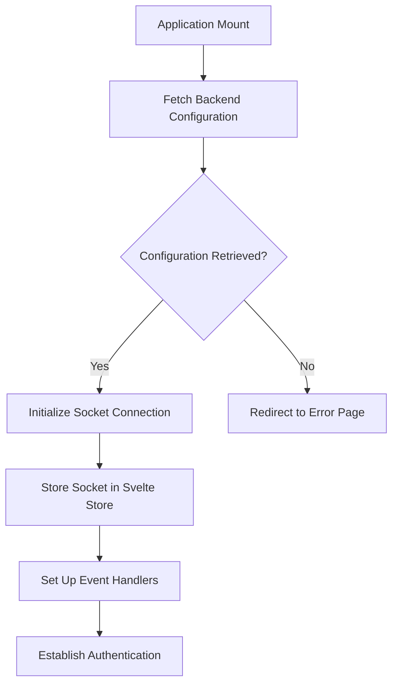
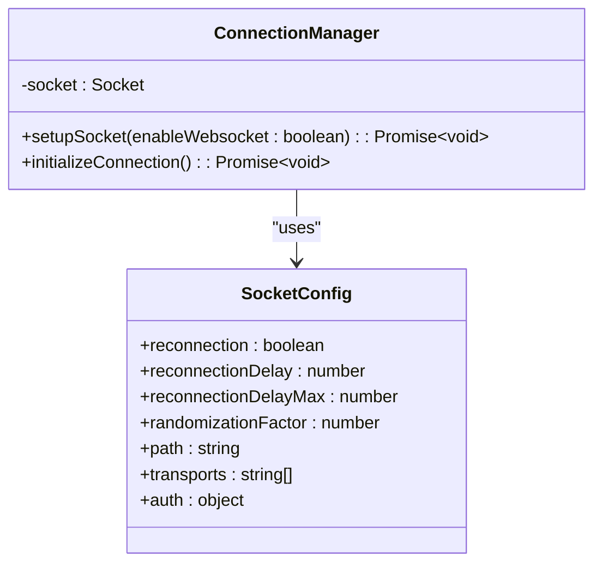
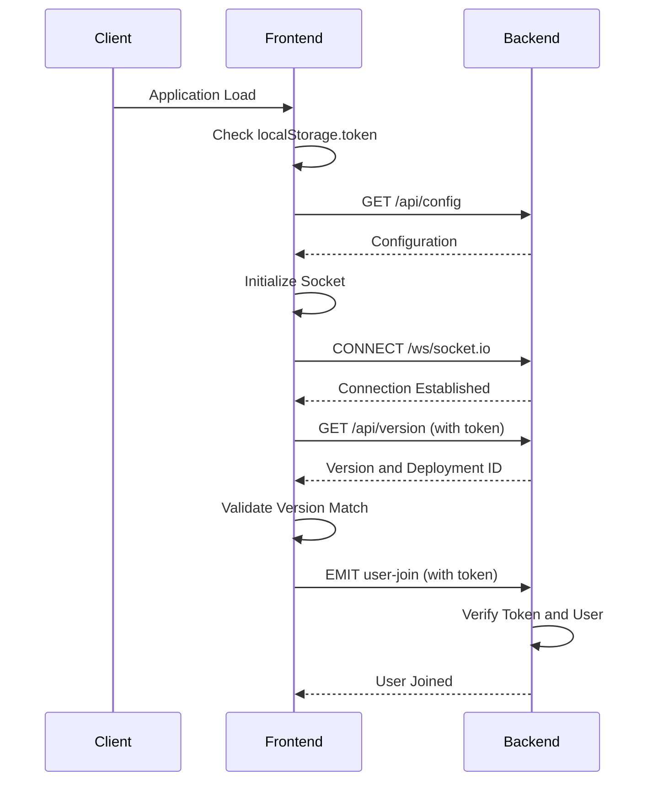
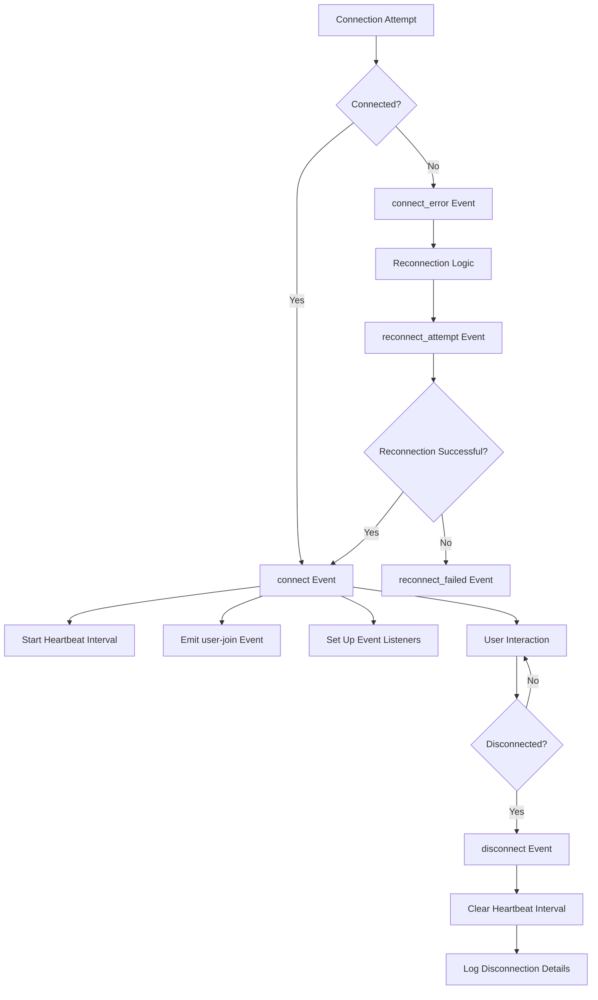
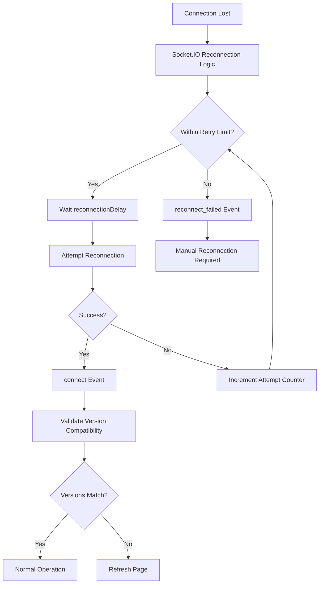
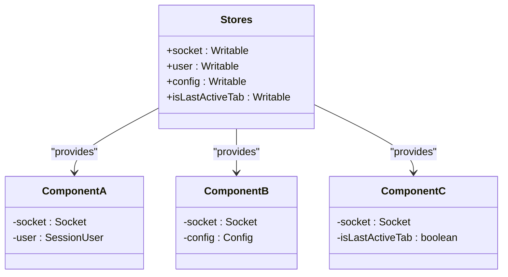
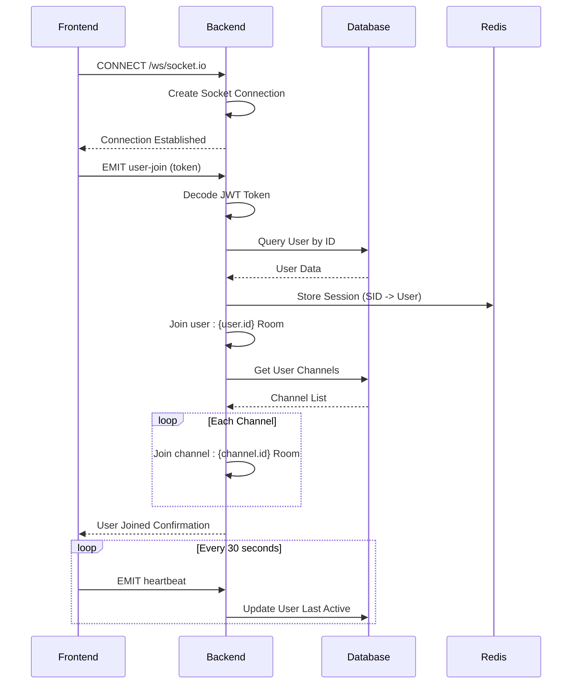

# Connection Initialization

<cite>
**Referenced Files in This Document**   
- [constants.ts](file://src/lib/constants.ts)
- [index.ts](file://src/lib/stores/index.ts)
- [+layout.svelte](file://src/routes/+layout.svelte)
- [main.py](file://backend/open_webui/socket/main.py)
</cite>

## Table of Contents
1. [Introduction](#introduction)
2. [WebSocket Client Initialization](#websocket-client-initialization)
3. [Connection Configuration](#connection-configuration)
4. [Authentication and Session Management](#authentication-and-session-management)
5. [Connection Lifecycle Events](#connection-lifecycle-events)
6. [Error Handling and Reconnection](#error-handling-and-reconnection)
7. [Connection State Management](#connection-state-management)
8. [Backend Socket Implementation](#backend-socket-implementation)

## Introduction
This document provides a comprehensive analysis of the WebSocket client connection initialization in open-webui's Svelte frontend. It details how the Socket.IO client is instantiated within the Svelte layout component, including configuration options, authentication mechanisms, and integration with environment variables. The documentation covers the complete lifecycle of the connection from initialization to state management across the application.

**Section sources**
- [constants.ts](file://src/lib/constants.ts)
- [index.ts](file://src/lib/stores/index.ts)
- [+layout.svelte](file://src/routes/+layout.svelte)

## WebSocket Client Initialization
The WebSocket client connection is initialized in the `+layout.svelte` file, which serves as the root layout component for the application. The Socket.IO client is imported and instantiated during the component's mount lifecycle.

The connection setup is managed through the `setupSocket` function, which creates a new Socket.IO instance with specific configuration options. This function is called during the `onMount` lifecycle hook after retrieving the backend configuration. The socket instance is stored in a Svelte store, making it accessible to all components throughout the application.

The initialization process begins by fetching the backend configuration via the `getBackendConfig` API call. Once the configuration is retrieved, the `setupSocket` function is invoked with the `enable_websocket` flag from the backend features configuration. This approach allows dynamic control over WebSocket usage based on server-side settings.

**Diagram sources **
- [+layout.svelte](file://src/routes/+layout.svelte#L590-L742)

**Section sources**
- [+layout.svelte](file://src/routes/+layout.svelte#L97-L177)
- [index.ts](file://src/lib/stores/index.ts#L28)

## Connection Configuration
The WebSocket connection is configured with several options that control its behavior and transport mechanisms. These configuration parameters are defined when creating the Socket.IO instance in the `setupSocket` function.

The connection endpoint is dynamically constructed using the `WEBUI_BASE_URL` constant, which is derived from environment variables and browser location information. The WebSocket path is set to `/ws/socket.io`, following the standard Socket.IO convention.

Key configuration options include:
- **Reconnection settings**: Enabled with a base delay of 1000ms, maximum delay of 5000ms, and randomization factor of 0.5
- **Transport protocols**: Configurable between WebSocket-only or fallback to polling
- **Authentication**: Token-based authentication passed in the auth object
- **Custom path**: Specified as '/ws/socket.io' for the Socket.IO endpoint

The transport protocol selection is dynamic, based on the `enableWebsocket` parameter. When enabled, only WebSocket transport is used; otherwise, the client falls back to polling with WebSocket as a secondary option. This provides flexibility for environments where WebSocket connections might be restricted.

**Diagram sources **
- [+layout.svelte](file://src/routes/+layout.svelte#L98-L106)
- [constants.ts](file://src/lib/constants.ts#L6-L8)

**Section sources**
- [+layout.svelte](file://src/routes/+layout.svelte#L98-L106)
- [constants.ts](file://src/lib/constants.ts#L6-L8)

## Authentication and Session Management
The WebSocket connection implements a multi-layered authentication and session management system. Authentication is established through JWT tokens stored in localStorage, with additional version and deployment ID validation to ensure client-server compatibility.

When the socket connects, it first validates the client version against the server version by calling the `getVersion` API with the authentication token. If there's a mismatch between the client and server versions or deployment IDs, the application triggers a refresh to ensure consistency.

The authentication flow proceeds as follows:
1. After successful connection, the client emits a `user-join` event with the authentication token
2. The backend verifies the token and associates the socket connection with the user session
3. The client sets up event handlers for chat and channel events
4. A heartbeat mechanism is established to maintain the connection and update user activity

Session tokens are stored in localStorage under the 'token' key and are automatically included in the socket authentication object. The application also implements token expiry checking, with a dedicated timer that runs every 15 seconds to validate the token's validity.

**Diagram sources **
- [+layout.svelte](file://src/routes/+layout.svelte#L115-L154)
- [main.py](file://backend/open_webui/socket/main.py#L318-L351)

**Section sources**
- [+layout.svelte](file://src/routes/+layout.svelte#L115-L154)
- [main.py](file://backend/open_webui/socket/main.py#L318-L351)

## Connection Lifecycle Events
The WebSocket connection implements a comprehensive event handling system that manages the various stages of the connection lifecycle. These events provide visibility into the connection status and enable appropriate application responses.

The primary lifecycle events include:
- **connect**: Triggered when the socket successfully connects to the server
- **connect_error**: Fired when a connection attempt fails
- **reconnect_attempt**: Emitted when the client attempts to reconnect
- **reconnect_failed**: Triggered when reconnection attempts have been exhausted
- **disconnect**: Fired when the socket disconnects from the server

Upon successful connection, the client initiates a heartbeat mechanism that sends a 'heartbeat' event every 30 seconds. This serves multiple purposes: maintaining the connection alive, updating the user's last active timestamp on the server, and preventing connection timeouts.

The disconnect event handler includes cleanup logic to clear the heartbeat interval and log disconnection details. This ensures proper resource management and provides debugging information when connections are terminated.

**Diagram sources **
- [+layout.svelte](file://src/routes/+layout.svelte#L109-L176)

**Section sources**
- [+layout.svelte](file://src/routes/+layout.svelte#L109-L176)

## Error Handling and Reconnection
The WebSocket implementation includes robust error handling and automatic reconnection capabilities. The Socket.IO client is configured with built-in reconnection logic that attempts to restore the connection when it is lost.

The reconnection strategy uses exponential backoff with a base delay of 1000ms and a maximum delay of 5000ms. The randomization factor of 0.5 introduces jitter to prevent thundering herd problems when multiple clients attempt to reconnect simultaneously.

Error handling is implemented at multiple levels:
1. **Connection errors**: Logged to the console with details about the error
2. **Reconnection attempts**: Tracked and logged to monitor connection stability
3. **Reconnection failures**: Handled when the maximum number of reconnection attempts is reached
4. **Disconnection reasons**: Captured and logged to diagnose connection issues

The application also implements version synchronization logic that can trigger a full page refresh if there's a mismatch between the client and server versions. This ensures that users always operate with compatible frontend and backend code.

**Diagram sources **
- [+layout.svelte](file://src/routes/+layout.svelte#L157-L176)

**Section sources**
- [+layout.svelte](file://src/routes/+layout.svelte#L157-L176)

## Connection State Management
The WebSocket connection state is managed through Svelte stores, providing a reactive and centralized approach to state management across the application. The socket instance is stored in a writable store, allowing components to subscribe to connection changes.

The `socket` store is defined in `src/lib/stores/index.ts` and imported into components that require WebSocket functionality. This pattern enables any component to access the current socket connection and listen for events without prop drilling or complex dependency injection.

Additional stores are used to manage related connection states:
- `user`: Stores the current user session information
- `config`: Contains the backend configuration including WebSocket settings
- `isLastActiveTab`: Tracks whether the current browser tab is active

Components react to connection status changes by subscribing to the socket store and setting up event listeners when the connection is established. The user store subscription is particularly important, as it controls the registration of event handlers for chat and channel events.

**Diagram sources **
- [index.ts](file://src/lib/stores/index.ts#L28)
- [+layout.svelte](file://src/routes/+layout.svelte#L683-L708)

**Section sources**
- [index.ts](file://src/lib/stores/index.ts#L28)
- [+layout.svelte](file://src/routes/+layout.svelte#L683-L708)

## Backend Socket Implementation
The backend Socket.IO server is implemented in `backend/open_webui/socket/main.py` and configured to handle WebSocket connections with proper authentication and room management. The server is configured with CORS settings, transport options, and connection timeouts.

The backend implements several key event handlers:
- `user-join`: Authenticates the user and associates the socket with the user session
- `heartbeat`: Updates the user's last active timestamp in the database
- `join-channel`: Joins the user to channel-specific rooms for targeted messaging
- `events` and `events:channel`: Handle various application events and broadcast them to appropriate recipients

The server uses Redis for session management when configured, allowing horizontal scaling across multiple server instances. The session pool stores user information associated with each socket connection, enabling user identification for all incoming events.

Authentication is performed by decoding the JWT token sent in the `user-join` event and verifying the user's existence in the database. Once authenticated, the user is added to their personal room (`user:{user.id}`) and all channel rooms they have access to, enabling targeted event broadcasting.

**Diagram sources **
- [main.py](file://backend/open_webui/socket/main.py#L76-L87)
- [main.py](file://backend/open_webui/socket/main.py#L318-L351)

**Section sources**
- [main.py](file://backend/open_webui/socket/main.py#L76-L87)
- [main.py](file://backend/open_webui/socket/main.py#L318-L351)