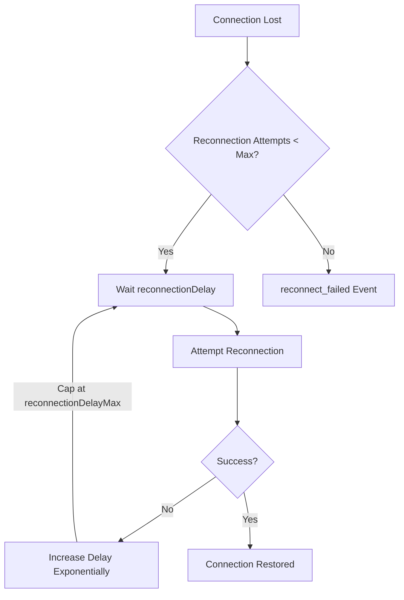
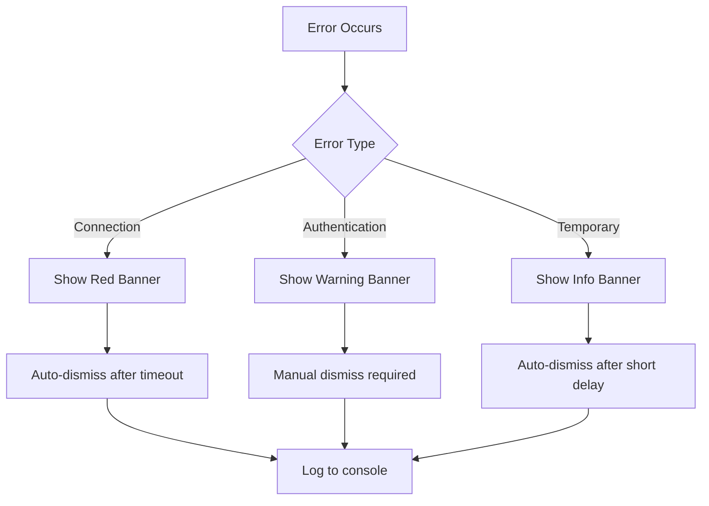

# Error Handling and Reconnection

<cite>
**Referenced Files in This Document**   
- [index.ts](file://src/lib/stores/index.ts)
- [+layout.svelte](file://src/routes/+layout.svelte)
- [main.py](file://backend/open_webui/socket/main.py)
- [env.py](file://backend/open_webui/env.py)
- [Banner.svelte](file://src/lib/components/common/Banner.svelte)
- [NotificationToast.svelte](file://src/lib/components/NotificationToast.svelte)
</cite>

## Table of Contents
1. [Introduction](#introduction)
2. [WebSocket Client Error Detection](#websocket-client-error-detection)
3. [Reconnection Strategy](#reconnection-strategy)
4. [Error Event Propagation to UI](#error-event-propagation-to-ui)
5. [User Feedback Mechanisms](#user-feedback-mechanisms)
6. [Cleanup Procedures](#cleanup-procedures)
7. [Conclusion](#conclusion)

## Introduction
The open-webui application implements a robust WebSocket client error handling and reconnection system to maintain reliable communication between the frontend and backend. This documentation details the mechanisms for detecting network interruptions, authentication failures, and protocol errors, along with the reconnection strategy, error propagation to the UI, user feedback mechanisms, and cleanup procedures during disconnection.

**Section sources**
- [index.ts](file://src/lib/stores/index.ts#L1-L302)
- [+layout.svelte](file://src/routes/+layout.svelte#L1-L857)

## WebSocket Client Error Detection
The WebSocket client in open-webui detects various error conditions through specific event handlers provided by the socket.io-client library. The system monitors for connection errors, disconnections, and failed reconnection attempts.

The primary error detection mechanisms include:
- **connect_error**: Triggered when a connection attempt fails, capturing network issues or server unavailability
- **disconnect**: Fired when an established connection is terminated, with reasons including "io server disconnect", "io client disconnect", "ping timeout", or "transport close"
- **reconnect_failed**: Activated when all reconnection attempts have been exhausted

The client also implements heartbeat monitoring by sending periodic heartbeat messages every 30 seconds to verify the connection remains active. This helps detect silent connection failures that might not trigger immediate disconnect events.

**Section sources**
- [+layout.svelte](file://src/routes/+layout.svelte#L109-L111)
- [+layout.svelte](file://src/routes/+layout.svelte#L164-L176)
- [+layout.svelte](file://src/routes/+layout.svelte#L160-L161)

## Reconnection Strategy
The open-webui WebSocket client implements an exponential backoff reconnection strategy with configurable parameters to balance responsiveness and server load.

Key reconnection configuration:
- **reconnection**: Enabled by default, allowing automatic reconnection attempts
- **reconnectionDelay**: Initial delay of 1000ms before the first reconnection attempt
- **reconnectionDelayMax**: Maximum delay capped at 5000ms between attempts
- **randomizationFactor**: Set to 0.5 to introduce jitter and prevent thundering herd problems

The reconnection process follows these steps:
1. On connection failure, the client waits the initial reconnectionDelay (1000ms)
2. After each failed attempt, the delay increases exponentially up to the reconnectionDelayMax
3. Randomization factor is applied to prevent synchronized reconnection attempts from multiple clients
4. The process continues until either a connection is established or reconnect_failed event is triggered

The server-side WebSocket configuration complements this strategy with ping_interval set to 25 seconds and ping_timeout set to 20 seconds, allowing for timely detection of unresponsive clients.



**Diagram sources**
- [+layout.svelte](file://src/routes/+layout.svelte#L98-L102)
- [main.py](file://backend/open_webui/socket/main.py#L84-L85)
- [env.py](file://backend/open_webui/env.py#L651-L661)

## Error Event Propagation to UI
Error events are propagated to the UI through Svelte stores and displayed using notification components. The system uses a combination of Svelte stores and event handlers to communicate connection status changes to the user interface.

The socket connection is stored in a Svelte writable store, allowing components to subscribe to connection state changes:
```typescript
export const socket: Writable<null | Socket> = writable(null);
```

When errors occur, they are handled through specific event listeners that can trigger UI updates:
- connect_error events are logged and can be used to update connection status indicators
- disconnect events trigger cleanup of heartbeat intervals and can display appropriate UI feedback
- reconnect_attempt events provide visibility into reconnection progress

The system also uses banners and toast notifications to inform users of connection issues. The Banner component can display different types of messages (info, warning, error, success) with dismissible functionality, while the NotificationToast component provides temporary notifications with click handling.

**Section sources**
- [index.ts](file://src/lib/stores/index.ts#L28)
- [Banner.svelte](file://src/lib/components/common/Banner.svelte#L1-L148)
- [NotificationToast.svelte](file://src/lib/components/NotificationToast.svelte#L1-L101)

## User Feedback Mechanisms
The open-webui application provides multiple user feedback mechanisms to communicate connection status and errors. These mechanisms ensure users are aware of connectivity issues and system status.

Connection status is indicated through:
- **Visual indicators**: Banners with color-coded backgrounds (blue for info, red for error) that appear at the top of the interface
- **Notification toasts**: Temporary pop-up notifications that appear in the corner of the screen
- **Console logging**: Development-time feedback through browser console logs

The banner system supports different severity levels:
- **Info**: General information about system status
- **Warning**: Potential issues that don't disrupt functionality
- **Error**: Critical issues affecting connectivity or functionality
- **Success**: Confirmation of successful operations

Users can dismiss banners manually, and the system can programmatically dismiss notifications. The NotificationToast component also provides audio feedback when enabled in user settings, playing a notification sound to alert users to important events.



**Diagram sources**
- [Banner.svelte](file://src/lib/components/common/Banner.svelte#L27-L32)
- [NotificationToast.svelte](file://src/lib/components/NotificationToast.svelte#L52-L67)

## Cleanup Procedures
The open-webui application implements proper cleanup procedures during disconnection to prevent memory leaks and ensure proper resource deallocation.

Key cleanup operations include:
- **Heartbeat interval cleanup**: When a disconnect event occurs, any active heartbeat interval is cleared to prevent memory leaks from ongoing setInterval calls
- **Event listener removal**: The system properly removes event listeners when they are no longer needed, particularly when user sessions end
- **Resource deallocation**: WebSocket connections are properly closed, releasing network resources

The disconnect handler specifically addresses cleanup:
```javascript
_socket.on('disconnect', (reason, details) => {
    console.log(`Socket ${_socket.id} disconnected due to ${reason}`);
    
    if (heartbeatInterval) {
        clearInterval(heartbeatInterval);
        heartbeatInterval = null;
    }
    
    if (details) {
        console.log('Additional details:', details);
    }
});
```

Additionally, when a user signs out or the token expires, the system removes the authentication token from localStorage and cleans up related timers to prevent unauthorized access and resource consumption.

**Section sources**
- [+layout.svelte](file://src/routes/+layout.svelte#L168-L171)
- [+layout.svelte](file://src/routes/+layout.svelte#L581-L587)

## Conclusion
The open-webui application implements a comprehensive WebSocket error handling and reconnection system that ensures reliable communication between client and server. The system detects various error conditions through socket.io-client events, implements an exponential backoff reconnection strategy with appropriate timing parameters, and propagates errors to the UI through Svelte stores and notification components. User feedback mechanisms provide clear visual indicators of connection status, while proper cleanup procedures prevent memory leaks and ensure efficient resource management. This robust approach to WebSocket management enhances the overall user experience by maintaining connectivity and providing clear feedback during network disruptions.

[No sources needed since this section summarizes without analyzing specific files]