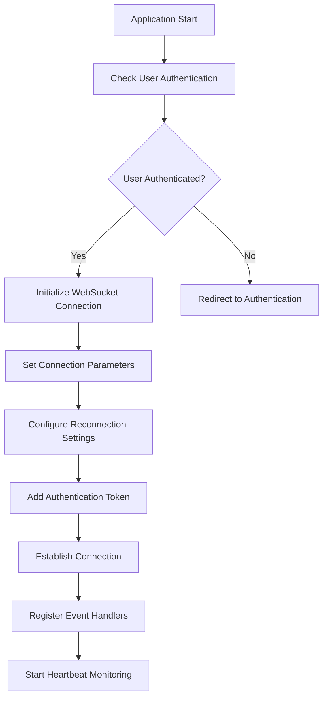
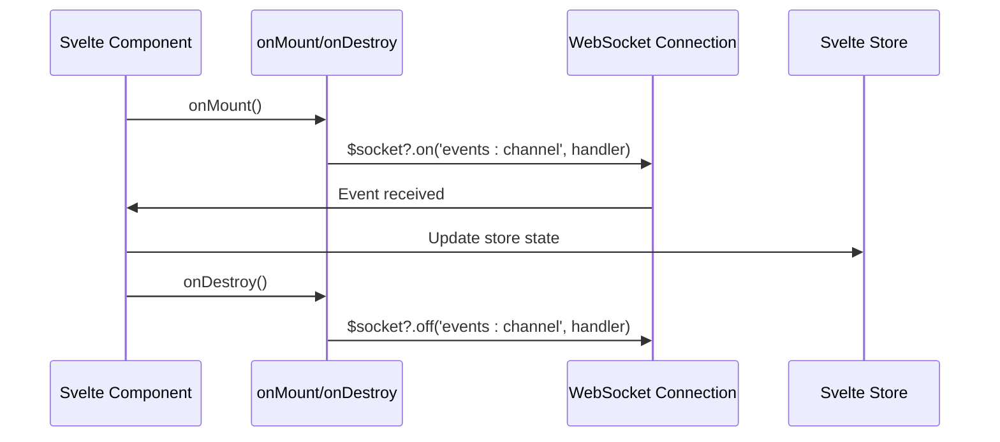
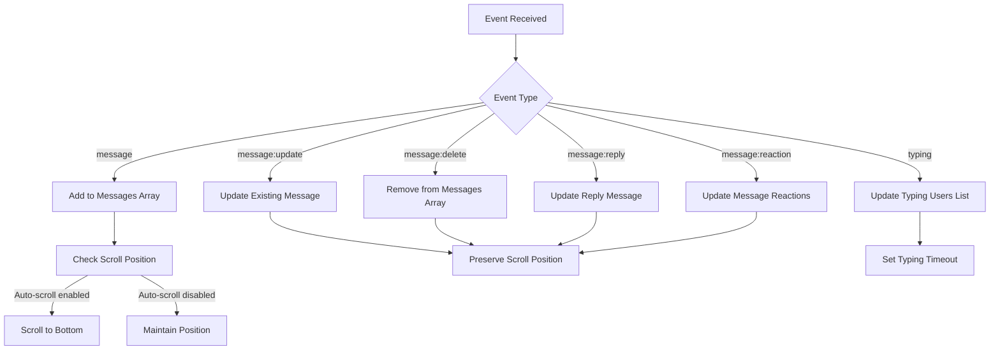
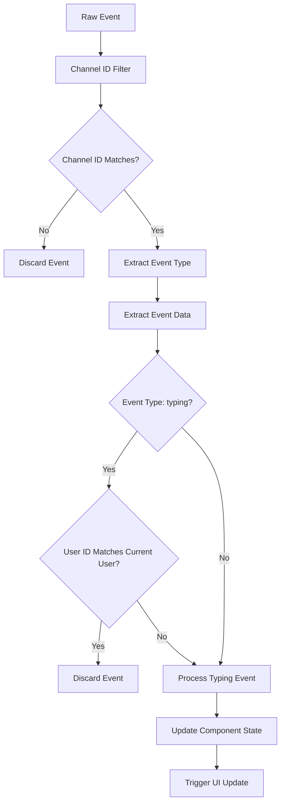
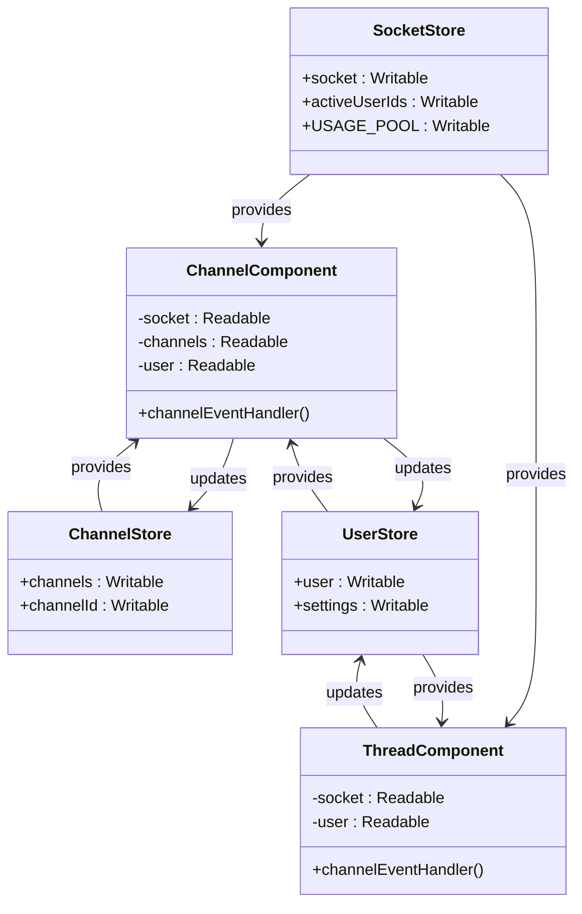

# Event Handling Mechanism

<cite>
**Referenced Files in This Document**   
- [Channel.svelte](file://src/lib/components/channel/Channel.svelte)
- [Thread.svelte](file://src/lib/components/channel/Thread.svelte)
- [main.py](file://backend/open_webui/socket/main.py)
- [index.ts](file://src/lib/stores/index.ts)
- [+layout.svelte](file://src/routes/+layout.svelte)
</cite>

## Table of Contents
1. [Introduction](#introduction)
2. [WebSocket Client Initialization](#websocket-client-initialization)
3. [Event Registration Pattern](#event-registration-pattern)
4. [Chat Message Event Processing](#chat-message-event-processing)
5. [Event Filtering and Transformation](#event-filtering-and-transformation)
6. [Integration with Svelte Stores](#integration-with-svelte-stores)
7. [Error Handling Best Practices](#error-handling-best-practices)
8. [Conclusion](#conclusion)

## Introduction
The open-webui application implements a robust WebSocket client event handling mechanism that enables real-time communication between the Svelte frontend and backend services. This documentation details how the frontend subscribes to various Socket.IO events including chat messages, channel updates, and user presence events. The system leverages Svelte's lifecycle methods to manage event listeners efficiently, preventing memory leaks while maintaining reactive state updates through Svelte stores. The architecture supports collaborative features such as typing indicators, message reactions, and real-time message updates across multiple clients.

## WebSocket Client Initialization

The WebSocket client initialization occurs in the `+layout.svelte` file, which serves as the root layout component for the application. The socket connection is established through the `setupSocket` function that creates an io instance with specific configuration options including reconnection settings, transport methods, and authentication tokens.

**Diagram sources**
- [+layout.svelte](file://src/routes/+layout.svelte#L97-L107)

**Section sources**
- [+layout.svelte](file://src/routes/+layout.svelte#L97-L141)

## Event Registration Pattern

The event registration pattern in open-webui follows Svelte's best practices for lifecycle management, utilizing `onMount` and `onDestroy` lifecycle methods to prevent memory leaks. Components subscribe to events when mounted and unsubscribe when destroyed, ensuring proper resource cleanup. The `Channel.svelte` and `Thread.svelte` components demonstrate this pattern by registering handlers for the 'events:channel' event.

**Diagram sources**
- [Channel.svelte](file://src/lib/components/channel/Channel.svelte#L246-L267)
- [Thread.svelte](file://src/lib/components/channel/Thread.svelte#L159-L164)

**Section sources**
- [Channel.svelte](file://src/lib/components/channel/Channel.svelte#L242-L267)
- [Thread.svelte](file://src/lib/components/channel/Thread.svelte#L158-L164)

## Chat Message Event Processing

Chat message event processing is implemented in the `channelEventHandler` function within both `Channel.svelte` and `Thread.svelte` components. When a message event is received, the system processes various event types including new messages, message updates, deletions, replies, reactions, and typing indicators. The processing logic filters events based on the current channel or thread context before updating the component state.

**Diagram sources**
- [Channel.svelte](file://src/lib/components/channel/Channel.svelte#L115-L180)
- [Thread.svelte](file://src/lib/components/channel/Thread.svelte#L62-L123)

**Section sources**
- [Channel.svelte](file://src/lib/components/channel/Channel.svelte#L115-L180)
- [Thread.svelte](file://src/lib/components/channel/Thread.svelte#L62-L123)

## Event Filtering and Transformation

The event filtering and transformation logic implements several layers of validation and context awareness before updating component state. Events are first filtered by channel or thread ID to ensure they are relevant to the current context. The payload is then transformed by extracting the event type and data from the nested structure. Additional filtering occurs based on user identity, particularly for typing events where users don't receive their own typing indicators.

**Diagram sources**
- [Channel.svelte](file://src/lib/components/channel/Channel.svelte#L116-L117)
- [Thread.svelte](file://src/lib/components/channel/Thread.svelte#L64-L65)

**Section sources**
- [Channel.svelte](file://src/lib/components/channel/Channel.svelte#L115-L180)
- [Thread.svelte](file://src/lib/components/channel/Thread.svelte#L62-L123)

## Integration with Svelte Stores

The WebSocket event handling system integrates with Svelte stores to enable reactive state management across components. The `socket` store in `index.ts` provides centralized access to the WebSocket connection, while other stores like `channels`, `user`, and `settings` receive updates triggered by WebSocket events. This architecture allows multiple components to react to the same events without requiring direct references to each other.

**Diagram sources**
- [index.ts](file://src/lib/stores/index.ts#L28-L30)
- [Channel.svelte](file://src/lib/components/channel/Channel.svelte#L14-L16)
- [Thread.svelte](file://src/lib/components/channel/Thread.svelte#L4-L5)

**Section sources**
- [index.ts](file://src/lib/stores/index.ts#L1-L51)
- [Channel.svelte](file://src/lib/components/channel/Channel.svelte#L1-L27)
- [Thread.svelte](file://src/lib/components/channel/Thread.svelte#L1-L7)

## Error Handling Best Practices

The open-webui application implements several best practices for error handling when processing WebSocket events. The system includes null checks for optional properties in event payloads, try-catch blocks around asynchronous operations, and defensive programming techniques to handle unexpected data structures. Additionally, the event subscription pattern includes cleanup logic in the `onDestroy` lifecycle method to prevent memory leaks and ensure proper disconnection from event listeners.

The backend implementation in `main.py` also includes comprehensive error handling, validating authentication tokens, checking user permissions, and verifying data integrity before processing events. This multi-layered approach ensures that both client and server handle unexpected conditions gracefully, maintaining application stability even when receiving malformed or unauthorized events.

**Section sources**
- [Channel.svelte](file://src/lib/components/channel/Channel.svelte#L117-L118)
- [Thread.svelte](file://src/lib/components/channel/Thread.svelte#L65-L66)
- [main.py](file://backend/open_webui/socket/main.py#L384-L407)

## Conclusion
The WebSocket client event handling mechanism in open-webui demonstrates a well-architected approach to real-time communication in a Svelte application. By leveraging Svelte's lifecycle methods, the system efficiently manages event subscriptions and prevents memory leaks. The integration with Svelte stores enables reactive state updates across components, while comprehensive event filtering and transformation logic ensures data integrity. The implementation supports collaborative features like typing indicators and message reactions through a consistent event-driven architecture. Following best practices for error handling, the system gracefully manages unexpected conditions, providing a robust foundation for real-time interactions in the application.