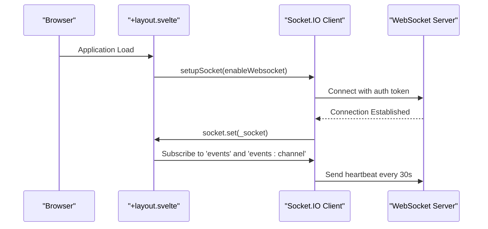
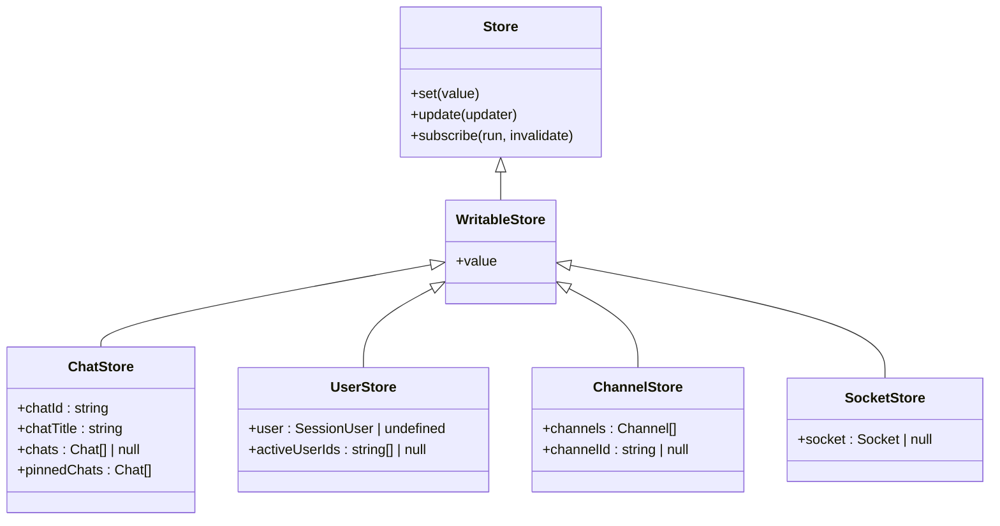
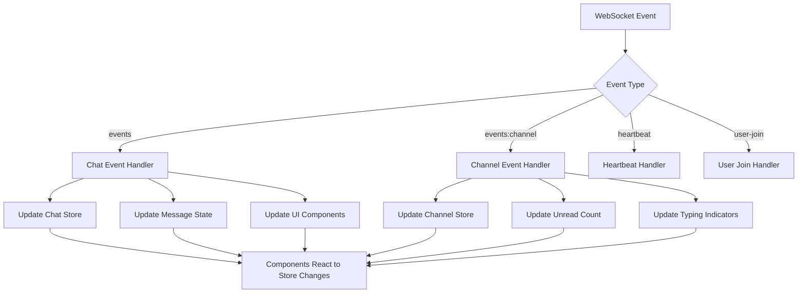
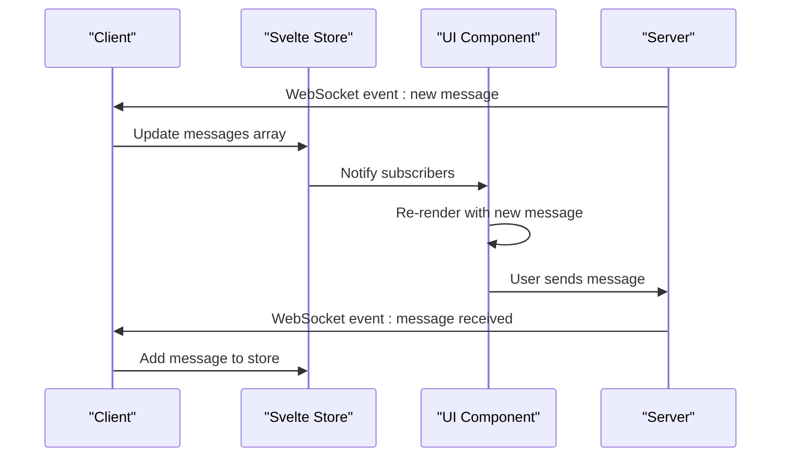
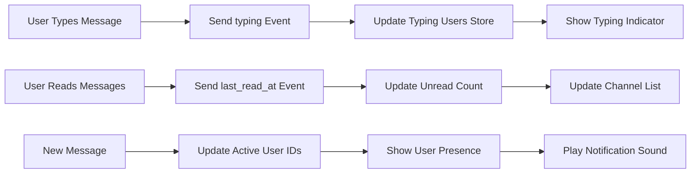
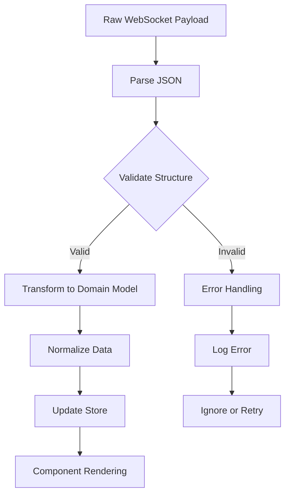
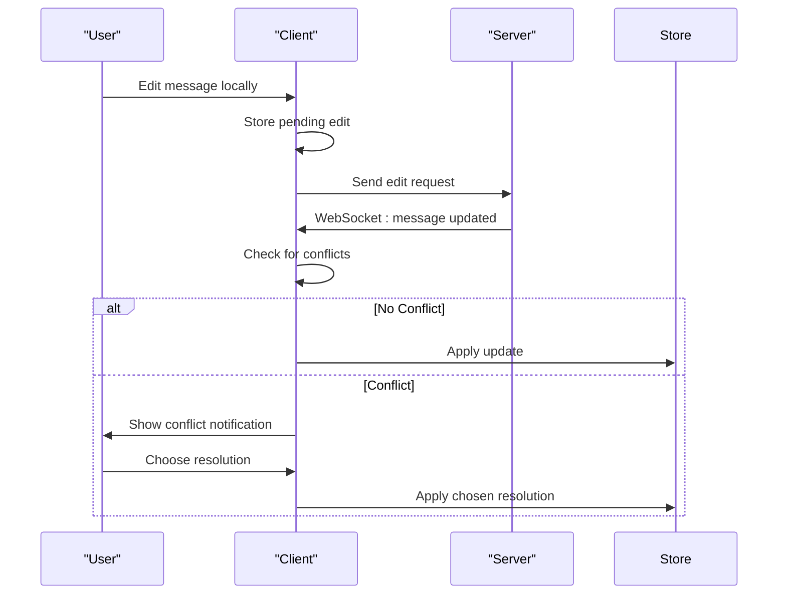
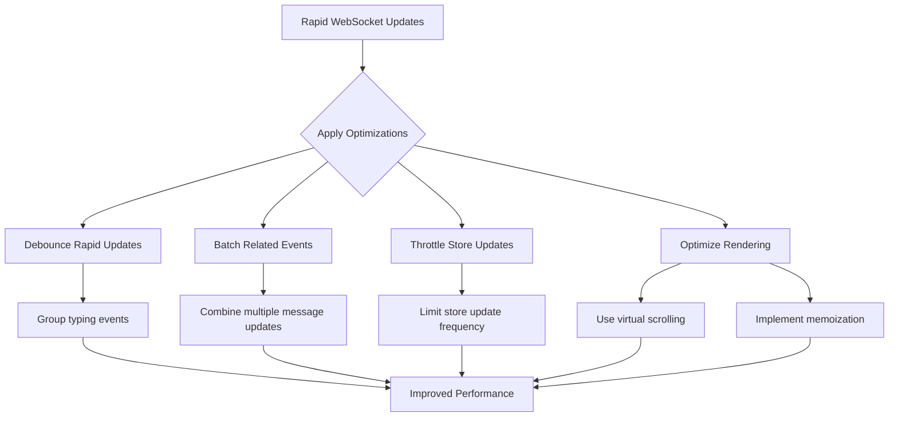

# State Management Integration

<cite>
**Referenced Files in This Document**   
- [index.ts](file://src/lib/stores/index.ts)
- [+layout.svelte](file://src/routes/+layout.svelte)
- [Channel.svelte](file://src/lib/components/channel/Channel.svelte)
- [Thread.svelte](file://src/lib/components/channel/Thread.svelte)
- [Chat.svelte](file://src/lib/components/chat/Chat.svelte)
- [main.py](file://backend/open_webui/socket/main.py)
- [chats/index.ts](file://src/lib/apis/chats/index.ts)
</cite>

## Table of Contents
1. [Introduction](#introduction)
2. [WebSocket Client Initialization](#websocket-client-initialization)
3. [Svelte Store Architecture](#svelte-store-architecture)
4. [Event Handling and State Synchronization](#event-handling-and-state-synchronization)
5. [Chat State Management](#chat-state-management)
6. [User Presence and Notification Updates](#user-presence-and-notification-updates)
7. [Data Transformation Pipeline](#data-transformation-pipeline)
8. [Conflict Resolution Strategy](#conflict-resolution-strategy)
9. [Performance Considerations](#performance-considerations)
10. [Conclusion](#conclusion)

## Introduction
The Open WebUI application implements a sophisticated state management system that integrates WebSocket real-time communication with Svelte stores to maintain consistent application state across components. This documentation details how WebSocket events are synchronized with Svelte stores, the architecture of the store system designed to handle concurrent updates, and the data transformation pipeline from raw WebSocket payloads to normalized store state. The system enables real-time collaboration features such as chat messaging, user presence indicators, and notifications while maintaining performance and consistency.

**Section sources**
- [index.ts](file://src/lib/stores/index.ts#L1-L302)
- [+layout.svelte](file://src/routes/+layout.svelte#L88-L857)

## WebSocket Client Initialization
The WebSocket client is initialized in the application layout component, establishing a persistent connection to the server for real-time communication. The connection is configured with reconnection logic and authentication via JWT tokens stored in localStorage.

**Diagram sources**
- [+layout.svelte](file://src/routes/+layout.svelte#L97-L177)

The WebSocket connection is established using Socket.IO with the following configuration:
- Reconnection enabled with exponential backoff (1-5 seconds)
- Authentication via JWT token from localStorage
- Custom path `/ws/socket.io` for the WebSocket endpoint
- Heartbeat mechanism sending ping every 30 seconds

The connection is only established after the user authentication token is available, and event handlers are registered for various WebSocket events that will update the application state.

**Section sources**
- [+layout.svelte](file://src/routes/+layout.svelte#L97-L177)

## Svelte Store Architecture
The application uses Svelte's writable stores to manage global state, with a comprehensive set of stores for different aspects of the application state. The store architecture is designed to handle concurrent updates from multiple WebSocket events while maintaining data consistency.

**Diagram sources**
- [index.ts](file://src/lib/stores/index.ts#L1-L302)

The store architecture includes specialized stores for:
- **Chat state**: Managing current chat, chat list, pinned chats, and chat metadata
- **User state**: Tracking current user session and active user IDs
- **Channel state**: Managing channel list and current channel
- **Socket state**: Maintaining the WebSocket connection reference
- **Configuration state**: Storing application settings and backend configuration
- **UI state**: Managing sidebar visibility, search state, and other UI controls

Each store is implemented as a writable store, allowing components to subscribe to changes and update the state in a reactive manner. The stores are imported and used across various components to maintain a consistent application state.

**Section sources**
- [index.ts](file://src/lib/stores/index.ts#L1-L302)

## Event Handling and State Synchronization
The application implements a comprehensive event handling system that synchronizes WebSocket events with Svelte store updates. Event handlers are registered for specific WebSocket events and update the appropriate stores based on the received data.

**Diagram sources**
- [+layout.svelte](file://src/routes/+layout.svelte#L179-L742)
- [Channel.svelte](file://src/lib/components/channel/Channel.svelte#L57-L123)

The event handling system follows these key patterns:
1. **Event subscription**: Event handlers are subscribed to WebSocket events when the user is authenticated
2. **Type-based routing**: Events are routed to specific handlers based on their type
3. **Store updates**: Handlers update the relevant Svelte stores with new data
4. **Component reactivity**: Components automatically update when store values change

The chat event handler processes various message types including:
- New messages
- Message updates
- Message deletions
- Message reactions
- Status updates

The channel event handler manages:
- Channel creation
- Last read timestamp updates
- Typing indicators
- Message updates in channels

**Section sources**
- [+layout.svelte](file://src/routes/+layout.svelte#L179-L742)
- [Channel.svelte](file://src/lib/components/channel/Channel.svelte#L57-L123)
- [Thread.svelte](file://src/lib/components/channel/Thread.svelte#L62-L100)

## Chat State Management
The chat state management system handles the synchronization of chat data between the server and client, ensuring that all components display consistent information. The system manages both the chat list and individual chat messages.

**Diagram sources**
- [Chat.svelte](file://src/lib/components/chat/Chat.svelte#L1-L200)
- [chats/index.ts](file://src/lib/apis/chats/index.ts#L1-L800)

The chat state management follows these principles:
1. **Single source of truth**: The Svelte store serves as the single source of truth for chat data
2. **Immutable updates**: Stores are updated using immutable patterns to ensure reactivity
3. **Batch processing**: Related events are processed together to minimize re-renders
4. **Conflict resolution**: Local actions and remote updates are reconciled appropriately

When a new message is received via WebSocket, the system:
1. Parses the message payload
2. Updates the messages array in the store
3. Removes temporary messages with matching IDs
4. Triggers UI updates through store subscriptions

The system also handles message editing, deletion, and reaction events, ensuring that all clients see a consistent view of the chat state.

**Section sources**
- [Chat.svelte](file://src/lib/components/chat/Chat.svelte#L1-L200)
- [chats/index.ts](file://src/lib/apis/chats/index.ts#L1-L800)

## User Presence and Notification Updates
The application implements real-time user presence and notification systems using WebSocket events to keep users informed of activity in channels and chats.

**Diagram sources**
- [Channel.svelte](file://src/lib/components/channel/Channel.svelte#L57-L123)
- [Thread.svelte](file://src/lib/components/channel/Thread.svelte#L62-L100)

The user presence system tracks:
- **Typing indicators**: When users are composing messages in a channel
- **Last read timestamps**: When users have viewed messages in a channel
- **Active user IDs**: Which users are currently active in a channel
- **Notification state**: Whether to play notification sounds

The system uses debouncing to prevent excessive updates when users are actively typing. Typing indicators are cleared after a timeout period if no additional typing events are received.

Notification updates are processed with consideration for user preferences and tab focus state, ensuring that notifications are only displayed when appropriate.

**Section sources**
- [Channel.svelte](file://src/lib/components/channel/Channel.svelte#L57-L123)
- [Thread.svelte](file://src/lib/components/channel/Thread.svelte#L62-L100)

## Data Transformation Pipeline
The application implements a data transformation pipeline that processes raw WebSocket payloads into normalized store state. This pipeline ensures that data is consistently formatted and ready for use by components.

**Diagram sources**
- [+layout.svelte](file://src/routes/+layout.svelte#L179-L742)
- [index.ts](file://src/lib/stores/index.ts#L1-L302)

The data transformation pipeline includes these stages:
1. **Payload parsing**: Converting JSON strings to JavaScript objects
2. **Structure validation**: Ensuring the payload has the expected fields
3. **Type conversion**: Converting string dates to Date objects, etc.
4. **Normalization**: Standardizing data formats across the application
5. **Store update**: Applying the transformed data to the appropriate store

For chat messages, the transformation includes:
- Converting timestamp strings to Date objects
- Normalizing message content format
- Processing message metadata (reactions, edits, etc.)
- Handling temporary message IDs

The pipeline is designed to be resilient to malformed data, with appropriate error handling and logging to maintain application stability.

**Section sources**
- [+layout.svelte](file://src/routes/+layout.svelte#L179-L742)
- [index.ts](file://src/lib/stores/index.ts#L1-L302)

## Conflict Resolution Strategy
The application implements a conflict resolution strategy to handle situations where local user actions conflict with incoming real-time updates from WebSocket messages.

**Diagram sources**
- [Channel.svelte](file://src/lib/components/channel/Channel.svelte#L57-L123)
- [Thread.svelte](file://src/lib/components/channel/Thread.svelte#L62-L100)

The conflict resolution strategy follows these principles:
1. **Server authority**: Server updates take precedence over local changes
2. **Change tracking**: Local changes are tracked with temporary IDs
3. **Conflict detection**: Incoming updates are checked against pending local changes
4. **User notification**: Users are notified of conflicts when they occur
5. **Resolution options**: Users can choose to accept the server version or retry their action

For message editing, the system uses temporary IDs to track pending edits. When a message update is received from the server, the system checks if there is a pending local edit for the same message. If so, the user is notified of the conflict and can choose how to resolve it.

The strategy ensures data consistency while providing a good user experience by making conflicts visible and resolvable.

**Section sources**
- [Channel.svelte](file://src/lib/components/channel/Channel.svelte#L57-L123)
- [Thread.svelte](file://src/lib/components/channel/Thread.svelte#L62-L100)

## Performance Considerations
The application implements several performance optimizations to handle rapid WebSocket updates and maintain a responsive user interface.

**Diagram sources**
- [+layout.svelte](file://src/routes/+layout.svelte#L132-L137)
- [Channel.svelte](file://src/lib/components/channel/Channel.svelte#L57-L123)

Key performance optimizations include:

### Debouncing Rapid Updates
The system uses debouncing to handle rapid updates from WebSocket messages:
- **Typing indicators**: Updates are debounced to prevent excessive UI updates
- **Presence updates**: User presence changes are batched when possible
- **Heartbeat messages**: Sent every 30 seconds to maintain connection without excessive traffic

### Batch Processing of Related Events
Related events are processed together to minimize store updates and component re-renders:
- Multiple message updates are combined when received in quick succession
- Channel metadata updates are batched with message updates
- UI state changes are grouped to reduce re-renders

### Connection Management
The WebSocket connection is managed to balance real-time updates with resource usage:
- Reconnection logic with exponential backoff
- Heartbeat mechanism to detect connection issues
- Proper cleanup of event listeners on component destruction

### Memory Management
The application manages memory usage by:
- Cleaning up unused store subscriptions
- Removing event listeners when components are destroyed
- Implementing proper garbage collection patterns

These optimizations ensure that the application remains responsive even under heavy load and maintains good performance across different devices and network conditions.

**Section sources**
- [+layout.svelte](file://src/routes/+layout.svelte#L132-L137)
- [Channel.svelte](file://src/lib/components/channel/Channel.svelte#L57-L123)

## Conclusion
The WebSocket client state management integration in Open WebUI provides a robust foundation for real-time collaboration features. By synchronizing WebSocket events with Svelte stores, the application maintains consistent state across components while providing a responsive user experience. The store architecture is designed to handle concurrent updates from multiple WebSocket events, with a clear data transformation pipeline from raw payloads to normalized store state. The system effectively manages chat state, user presence, and notifications, with a thoughtful conflict resolution strategy for handling local and remote update conflicts. Performance optimizations such as debouncing and batch processing ensure the application remains responsive under various conditions. This integration enables the real-time features that are essential for a collaborative chat application while maintaining code maintainability and scalability.