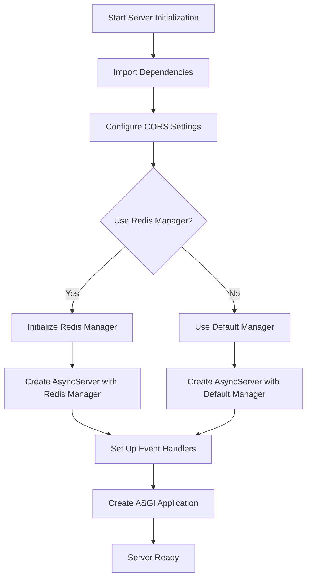
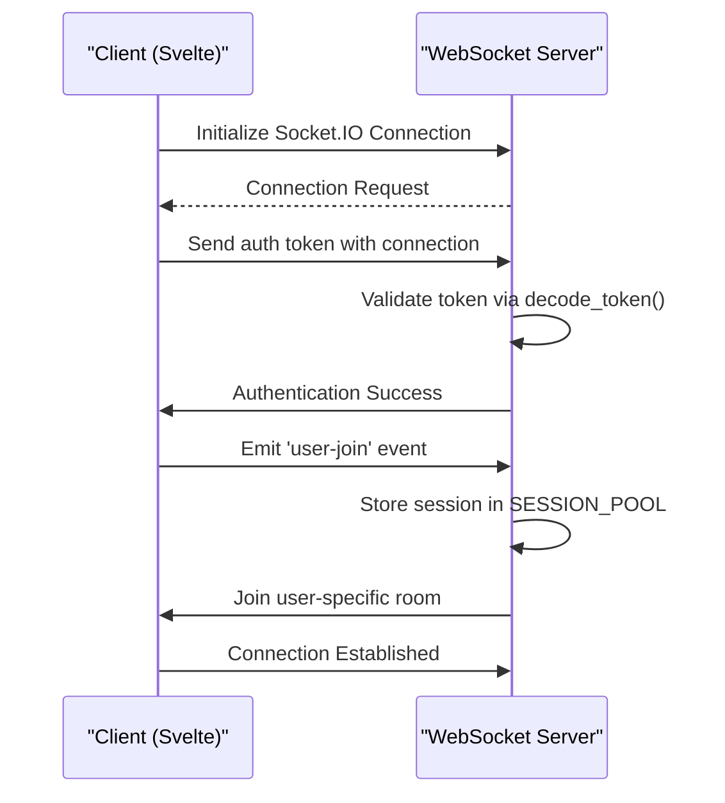
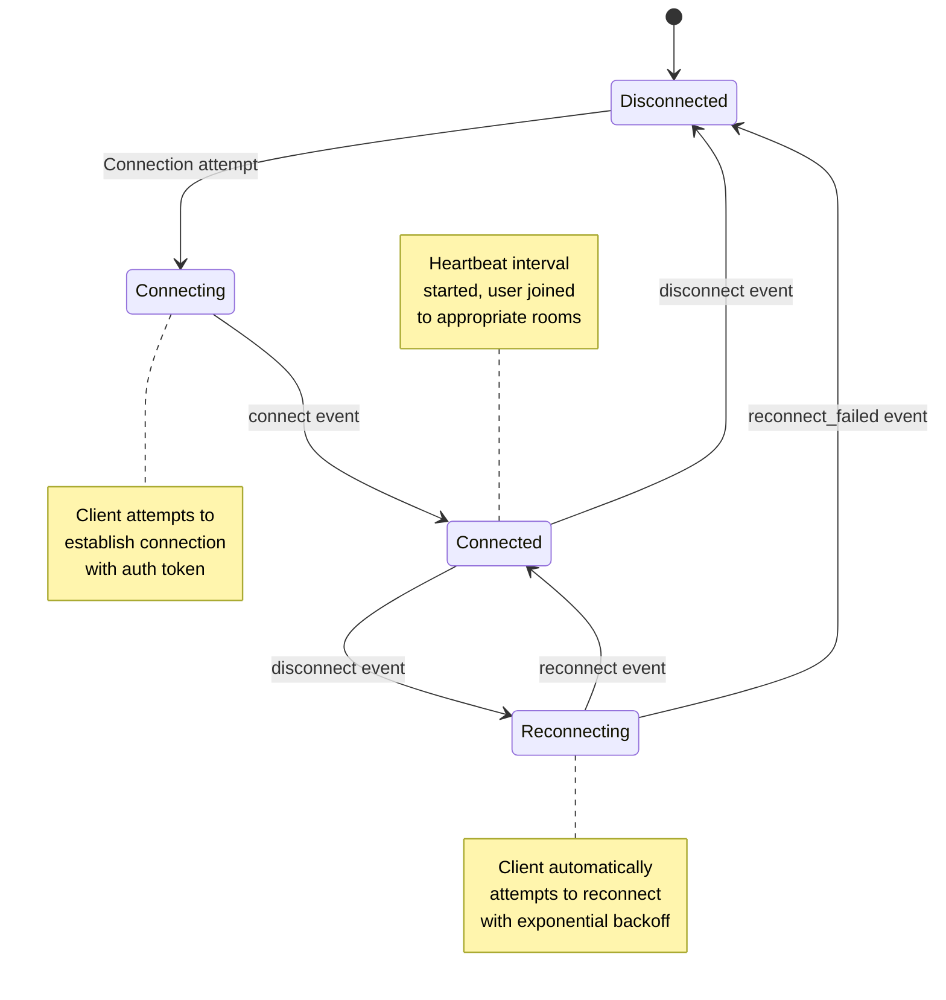
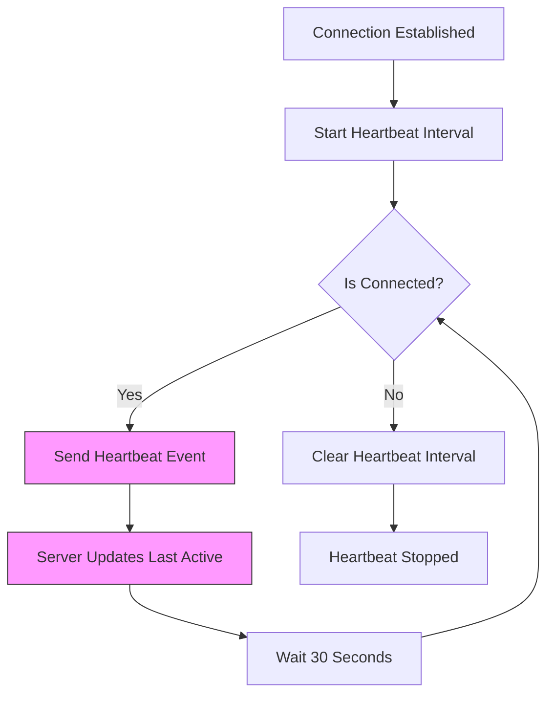
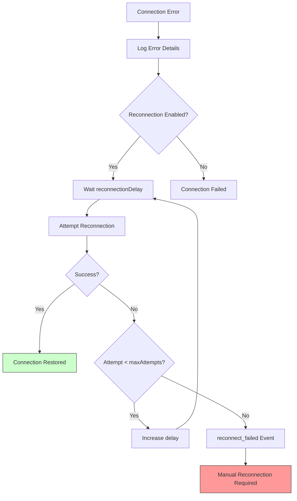

# Connection Management

<cite>
**Referenced Files in This Document**   
- [main.py](file://backend/open_webui/socket/main.py)
- [utils.py](file://backend/open_webui/socket/utils.py)
- [+layout.svelte](file://src/routes/+layout.svelte)
- [index.ts](file://src/lib/stores/index.ts)
</cite>

## Table of Contents
1. [Introduction](#introduction)
2. [WebSocket Server Initialization](#websocket-server-initialization)
3. [Client-Side Connection Establishment](#client-side-connection-establishment)
4. [Connection Lifecycle Events](#connection-lifecycle-events)
5. [Heartbeat Mechanism](#heartbeat-mechanism)
6. [Session Management](#session-management)
7. [Error Handling and Reconnection Strategies](#error-handling-and-reconnection-strategies)
8. [Conclusion](#conclusion)

## Introduction
The open-webui application implements a robust WebSocket connection management system using Socket.IO to enable real-time communication between the client and server. This documentation details the architecture and implementation of the WebSocket system, covering server initialization, client connection establishment, connection lifecycle management, heartbeat mechanisms, session handling, and error recovery strategies. The system is designed to maintain persistent connections for real-time features such as chat updates, collaborative editing, and presence indicators.

## WebSocket Server Initialization
The Socket.IO server is initialized in the backend within the `main.py` file located in the socket module. The server configuration includes CORS settings, transport options, and Redis integration for horizontal scaling. The server is configured with specific ping intervals and timeouts to maintain connection health.

The initialization process begins by importing the necessary dependencies and configuring the Socket.IO server based on environment variables. The CORS configuration is set using the `CORS_ALLOW_ORIGIN` setting from the application configuration, allowing cross-origin requests from specified domains or all domains if configured to do so.



**Diagram sources**
- [main.py](file://backend/open_webui/socket/main.py#L61-L100)

**Section sources**
- [main.py](file://backend/open_webui/socket/main.py#L1-L100)

## Client-Side Connection Establishment
The client-side connection is established in the Svelte application through the `+layout.svelte` file, which serves as the root layout component. The connection process involves creating a Socket.IO client instance with specific configuration options and handling the authentication process.

The client establishes a connection to the WebSocket server by calling the `setupSocket` function, which creates a new Socket.IO instance with the appropriate configuration. The connection includes authentication by transmitting a JWT token in the auth object during the handshake process. This token is retrieved from localStorage and sent to the server for validation.



**Diagram sources**
- [+layout.svelte](file://src/routes/+layout.svelte#L97-L155)
- [main.py](file://backend/open_webui/socket/main.py#L318-L352)

**Section sources**
- [+layout.svelte](file://src/routes/+layout.svelte#L97-L155)
- [main.py](file://backend/open_webui/socket/main.py#L318-L352)

## Connection Lifecycle Events
The WebSocket system implements a comprehensive set of lifecycle events to manage the connection state and provide feedback on connection status. These events include 'connect', 'disconnect', 'reconnect_attempt', and 'reconnect_failed', each serving a specific purpose in the connection management process.

The 'connect' event is triggered when a successful connection is established between the client and server. During this event, the server validates the authentication token and sets up the user session. The 'disconnect' event handles cleanup operations when a connection is terminated, removing the user session from the session pool and cleaning up any associated resources.



**Diagram sources**
- [+layout.svelte](file://src/routes/+layout.svelte#L113-L167)
- [main.py](file://backend/open_webui/socket/main.py#L303-L317)

**Section sources**
- [+layout.svelte](file://src/routes/+layout.svelte#L113-L167)
- [main.py](file://backend/open_webui/socket/main.py#L303-L317)

## Heartbeat Mechanism
The heartbeat mechanism is implemented to maintain persistent connections and track user activity. The client sends a heartbeat signal to the server at regular intervals (every 30 seconds) to indicate that the connection is active and the user is engaged with the application.

On the client side, a setInterval timer is established upon successful connection to send the heartbeat event. This timer is cleared when the connection is disconnected to prevent unnecessary network requests. The server handles the heartbeat event by updating the user's last active timestamp in the database, which is used for presence indicators and session management.



**Diagram sources**
- [+layout.svelte](file://src/routes/+layout.svelte#L131-L137)
- [main.py](file://backend/open_webui/socket/main.py#L354-L359)

**Section sources**
- [+layout.svelte](file://src/routes/+layout.svelte#L131-L137)
- [main.py](file://backend/open_webui/socket/main.py#L354-L359)

## Session Management
Session management in the WebSocket system is handled through the SESSION_POOL data structure, which maintains a mapping between socket session IDs and user information. When a user connects, their session is added to this pool, allowing the server to associate WebSocket connections with authenticated users.

The session management system uses Redis for distributed storage when configured, allowing the application to scale across multiple server instances. The SESSION_POOL stores essential user information (excluding sensitive fields like date of birth and bio) and associates it with the socket session ID. This enables the server to identify which user is sending messages and to route events to the appropriate recipients.

```mermaid
classDiagram
class SocketIO {
+string sid
+object environ
+object auth
+connect()
+disconnect()
+emit()
+on()
}
class SessionPool {
+Dict[str, User] sessions
+add_session(sid, user)
+get_user(sid)
+remove_session(sid)
+get_user_id(sid)
}
class User {
+string id
+string name
+string email
+string role
+string profile_image_url
}
class RedisDict {
+string name
+Redis redis
+__setitem__()
+__getitem__()
+__delitem__()
+get()
+set()
+clear()
}
SocketIO --> SessionPool : "uses"
SessionPool --> User : "contains"
SessionPool --> RedisDict : "extends"
RedisDict ..> Redis : "connects to"
note right of SessionPool
Stores user session data
Maps socket ID to user info
Uses Redis for persistence
end note
```

**Diagram sources**
- [main.py](file://backend/open_webui/socket/main.py#L129-L135)
- [utils.py](file://backend/open_webui/socket/utils.py#L49-L118)

**Section sources**
- [main.py](file://backend/open_webui/socket/main.py#L129-L135)
- [utils.py](file://backend/open_webui/socket/utils.py#L49-L118)

## Error Handling and Reconnection Strategies
The WebSocket system implements comprehensive error handling and automatic reconnection strategies to ensure reliable connectivity. The client-side configuration includes parameters for reconnection attempts, with exponential backoff to prevent overwhelming the server during network disruptions.

When a connection error occurs, the client logs the error and automatically attempts to reconnect according to the configured parameters. The reconnection process includes a delay that increases with each failed attempt (from 1 second to a maximum of 5 seconds), with a randomization factor to prevent synchronized reconnection attempts from multiple clients.



**Diagram sources**
- [+layout.svelte](file://src/routes/+layout.svelte#L109-L163)

**Section sources**
- [+layout.svelte](file://src/routes/+layout.svelte#L109-L163)

## Conclusion
The WebSocket connection management system in open-webui provides a robust foundation for real-time communication between the client and server. By leveraging Socket.IO with proper configuration for CORS, authentication, and scaling via Redis, the system ensures reliable and secure connections. The implementation includes comprehensive lifecycle event handling, a heartbeat mechanism for connection maintenance, and sophisticated session management that associates WebSocket connections with authenticated users. The client-side reconnection strategies with exponential backoff ensure resilience against network interruptions, while the structured error handling provides visibility into connection issues. This architecture enables the application to deliver real-time features such as chat updates, collaborative editing, and presence indicators with high reliability and performance.