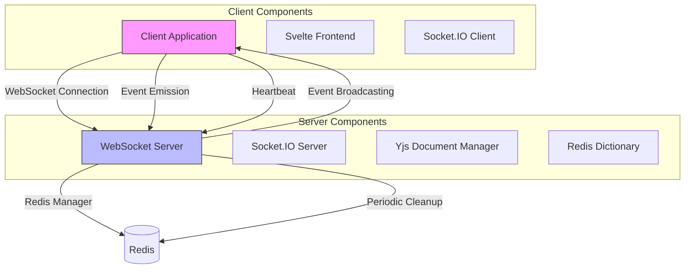
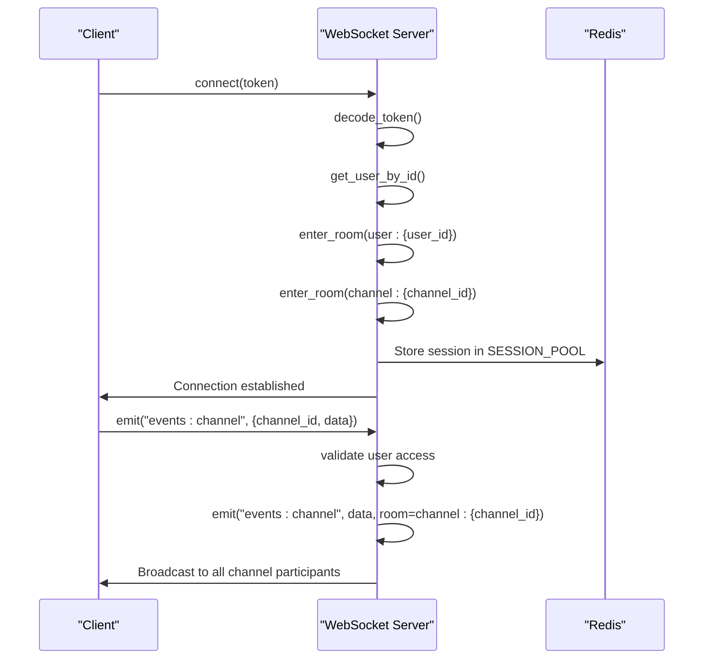
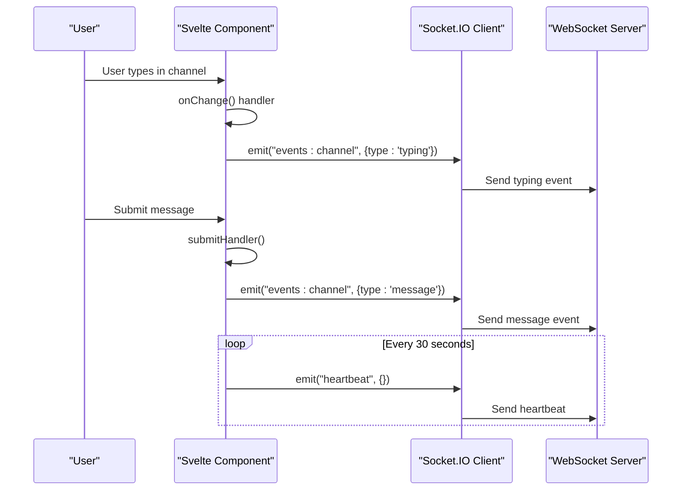
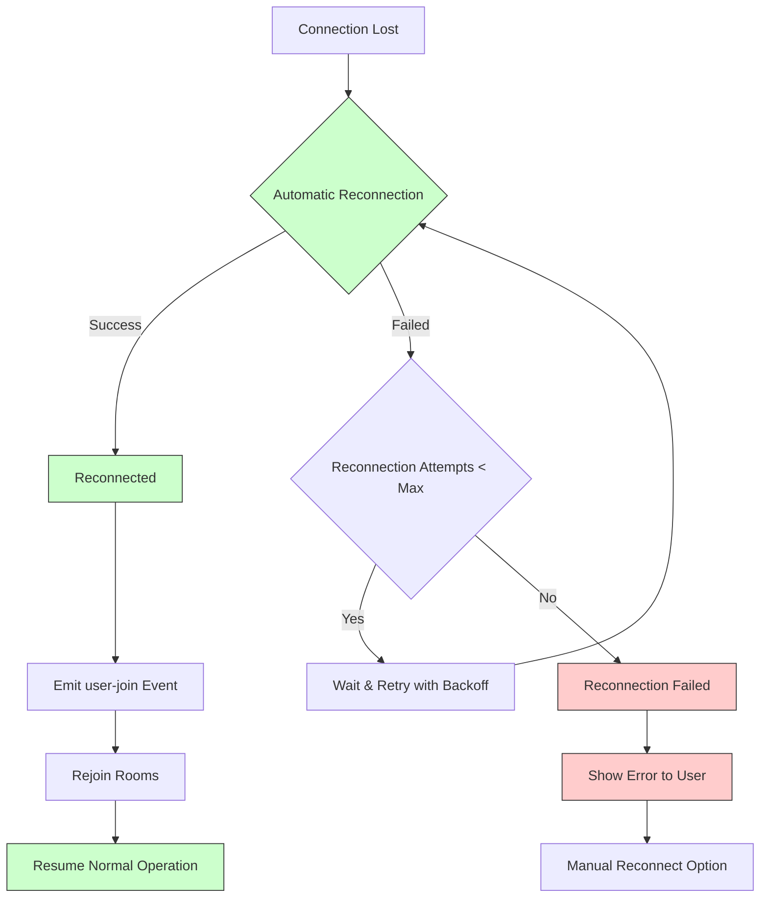

# Client-Server Event Emission and Handling

<cite>
**Referenced Files in This Document**   
- [main.py](file://backend/open_webui/socket/main.py)
- [utils.py](file://backend/open_webui/socket/utils.py)
- [chat.py](file://backend/open_webui/utils/chat.py)
- [env.py](file://backend/open_webui/env.py)
- [+layout.svelte](file://src/routes/+layout.svelte)
- [Channel.svelte](file://src/lib/components/channel/Channel.svelte)
- [Thread.svelte](file://src/lib/components/channel/Thread.svelte)
- [Messages.svelte](file://src/lib/components/channel/Messages.svelte)
- [Collaboration.ts](file://src/lib/components/common/RichTextInput/Collaboration.ts)
- [index.ts](file://src/lib/stores/index.ts)
</cite>

## Table of Contents
1. [Introduction](#introduction)
2. [WebSocket Architecture Overview](#websocket-architecture-overview)
3. [Server-Side Event Emission](#server-side-event-emission)
4. [Client-Side Event Emission](#client-side-event-emission)
5. [Round-Trip Event Communication](#round-trip-event-communication)
6. [Error Handling and Reconnection Logic](#error-handling-and-reconnection-logic)
7. [Conclusion](#conclusion)

## Introduction
The open-webui WebSocket system provides real-time communication between clients and servers through a robust event-driven architecture. This documentation details the complete event emission and handling process, covering both client and server implementations. The system uses Socket.IO for WebSocket communication, enabling bidirectional event exchange for chat interactions, collaborative editing, presence tracking, and other real-time features. The architecture supports both direct message emission and broadcast to specific rooms, ensuring efficient and targeted communication.

## WebSocket Architecture Overview



**Diagram sources**
- [main.py](file://backend/open_webui/socket/main.py#L1-L839)
- [+layout.svelte](file://src/routes/+layout.svelte#L88-L742)

**Section sources**
- [main.py](file://backend/open_webui/socket/main.py#L1-L839)
- [+layout.svelte](file://src/routes/+layout.svelte#L88-L742)

## Server-Side Event Emission

The server-side event emission in open-webui follows a structured pattern using Socket.IO methods like `emit()` and `to()`. The system implements various event handlers for different types of interactions, including chat events, collaborative editing, and presence updates.

The server uses a room-based broadcasting system where users are assigned to specific rooms based on their user ID, channel membership, or document access. This allows for targeted event emission to specific groups of users. The `emit()` method is used to send events to specific rooms, while the `to()` parameter in event callers allows for direct communication with specific session IDs.

Key server-side event emission patterns include:

1. **Room-based broadcasting**: Events are emitted to specific rooms using the `room` parameter in the `emit()` method. For example, chat events are broadcast to `channel:{channel_id}` rooms, ensuring only participants in that channel receive the updates.

2. **User-specific messaging**: Events can be sent to specific users by emitting to `user:{user_id}` rooms, which are created when a user connects and joins their personal room.

3. **Document collaboration**: For real-time collaborative editing, the system uses Yjs documents with corresponding Socket.IO rooms (`doc_{document_id}`) to synchronize changes between multiple users editing the same document.



**Diagram sources**
- [main.py](file://backend/open_webui/socket/main.py#L302-L351)
- [main.py](file://backend/open_webui/socket/main.py#L413-L447)

**Section sources**
- [main.py](file://backend/open_webui/socket/main.py#L288-L838)

## Client-Side Event Emission

The client-side event emission in open-webui is implemented using Svelte components that interact with the Socket.IO client. User actions trigger WebSocket messages that are sent to the server for processing and potential broadcast to other clients.

The client establishes a WebSocket connection during application initialization, authenticating with a JWT token stored in localStorage. Once connected, the client can emit various events based on user interactions, such as typing indicators, message submissions, and document editing operations.

Key client-side event emission patterns include:

1. **Connection initialization**: When the application loads, the client establishes a WebSocket connection and emits a `user-join` event with authentication credentials to register the user session.

2. **User interaction events**: Various user actions trigger specific events:
   - Typing indicators emit `events:channel` with `type: 'typing'`
   - Message submissions emit chat completion requests
   - Document editing emits Yjs document updates

3. **Heartbeat mechanism**: The client sends periodic heartbeat events to maintain the connection and update the user's last active status on the server.



**Diagram sources**
- [+layout.svelte](file://src/routes/+layout.svelte#L150-L152)
- [Channel.svelte](file://src/lib/components/channel/Channel.svelte#L224-L233)

**Section sources**
- [+layout.svelte](file://src/routes/+layout.svelte#L88-L742)
- [Channel.svelte](file://src/lib/components/channel/Channel.svelte#L57-L387)

## Round-Trip Event Communication

The round-trip event communication in open-webui demonstrates the complete flow from user interaction to server processing and broadcast. This process ensures real-time updates across all connected clients while maintaining data consistency.

The typical round-trip flow for a chat message is:

1. User types a message in the chat interface
2. Client emits a typing event to notify other participants
3. User submits the message
4. Client sends the message to the server via WebSocket
5. Server validates the message and user permissions
6. Server stores the message in the database
7. Server broadcasts the message to all participants in the channel
8. All clients receive the message and update their UI

For collaborative document editing, the flow is more complex, involving Yjs document synchronization:

1. User makes changes to a document
2. Yjs generates document updates as binary data
3. Client emits `ydoc:document:update` with the update data
4. Server stores the update in Redis and broadcasts to other users
5. Other clients receive the update and apply it to their local Yjs document
6. The UI automatically updates to reflect the changes

```mermaid
flowchart TD
A[User Action] --> B[Client Event Emission]
B --> C[Server Event Handling]
C --> D[Data Processing]
D --> E[Database Update]
E --> F[Event Broadcasting]
F --> G[Client Event Reception]
G --> H[UI Update]
A --> |Typing| B
B --> |emit('events:channel', {type: 'typing'})| C
C --> |Validate user access| D
D --> |Update typing status| E
E --> |emit('events:channel', room=channel:{id})| F
F --> |Receive typing event| G
G --> |Update typing indicators| H
A --> |Message Send| B
B --> |emit('events:channel', {type: 'message'})| C
C --> |Validate message| D
D --> |Store in database| E
E --> |Broadcast to channel| F
F --> |Receive message| G
G --> |Update message list| H
```

**Diagram sources**
- [main.py](file://backend/open_webui/socket/main.py#L413-L447)
- [Channel.svelte](file://src/lib/components/channel/Channel.svelte#L183-L214)

**Section sources**
- [main.py](file://backend/open_webui/socket/main.py#L413-L447)
- [Channel.svelte](file://src/lib/components/channel/Channel.svelte#L183-L214)

## Error Handling and Reconnection Logic

The open-webui WebSocket system implements comprehensive error handling and reconnection logic to ensure reliable real-time communication even under unstable network conditions.

### Server-Side Error Handling

The server implements several error handling mechanisms:

1. **Connection validation**: The server validates authentication tokens on connection and on specific events, rejecting unauthorized access attempts.

2. **Graceful disconnection**: When a client disconnects, the server cleans up session data, removes the user from active rooms, and notifies other users in collaborative sessions.

3. **Redis fallback**: The system can operate without Redis by using in-memory data structures, providing resilience when the Redis service is unavailable.

4. **Lock management**: For critical operations, the system uses Redis locks with timeout mechanisms to prevent race conditions while ensuring operations don't hang indefinitely.

### Client-Side Reconnection Logic

The client implements robust reconnection logic to maintain a stable connection:

1. **Automatic reconnection**: The Socket.IO client is configured with automatic reconnection enabled, attempting to reconnect with exponential backoff.

2. **Heartbeat mechanism**: The client sends periodic heartbeat messages to maintain the connection and detect disconnections early.

3. **Event listeners**: The client registers listeners for connection errors, reconnection attempts, and disconnection events to provide feedback and handle state appropriately.

4. **State recovery**: After reconnection, the client re-emits the `user-join` event to re-establish the user session and rejoin appropriate rooms.



**Diagram sources**
- [+layout.svelte](file://src/routes/+layout.svelte#L157-L163)
- [main.py](file://backend/open_webui/socket/main.py#L684-L693)

**Section sources**
- [+layout.svelte](file://src/routes/+layout.svelte#L109-L176)
- [main.py](file://backend/open_webui/socket/main.py#L684-L693)

## Conclusion
The open-webui WebSocket system provides a robust foundation for real-time communication between clients and servers. By leveraging Socket.IO's event-driven architecture, the system enables efficient bidirectional communication for chat interactions, collaborative editing, and presence tracking. The implementation follows best practices for event emission, with clear patterns for server-side broadcasting and client-side event triggering. The comprehensive error handling and reconnection logic ensure reliable operation even under challenging network conditions. This architecture supports the application's core functionality while providing a responsive and interactive user experience.