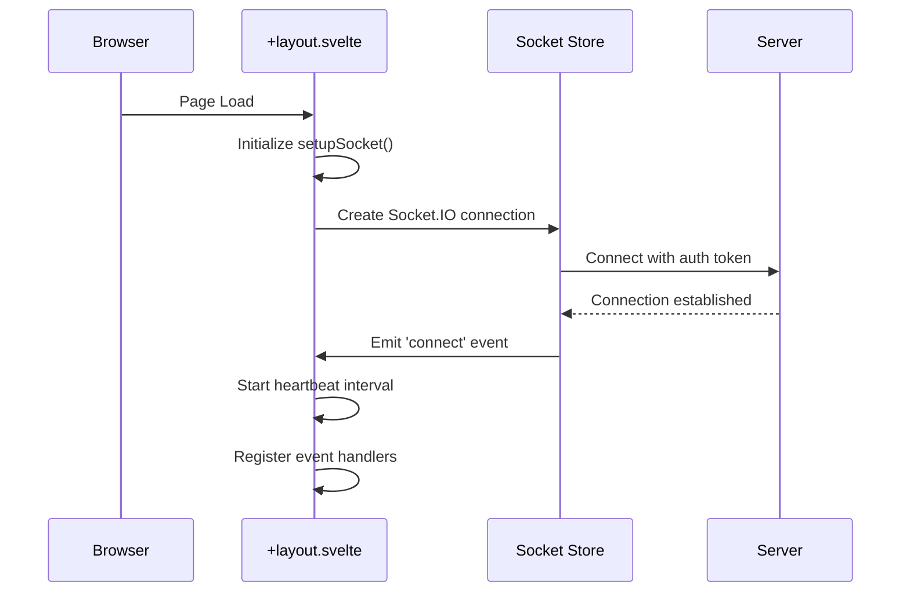
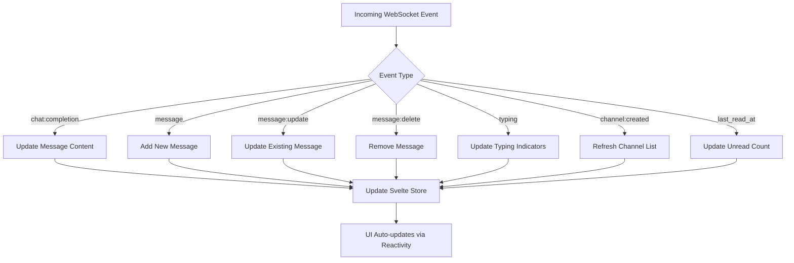
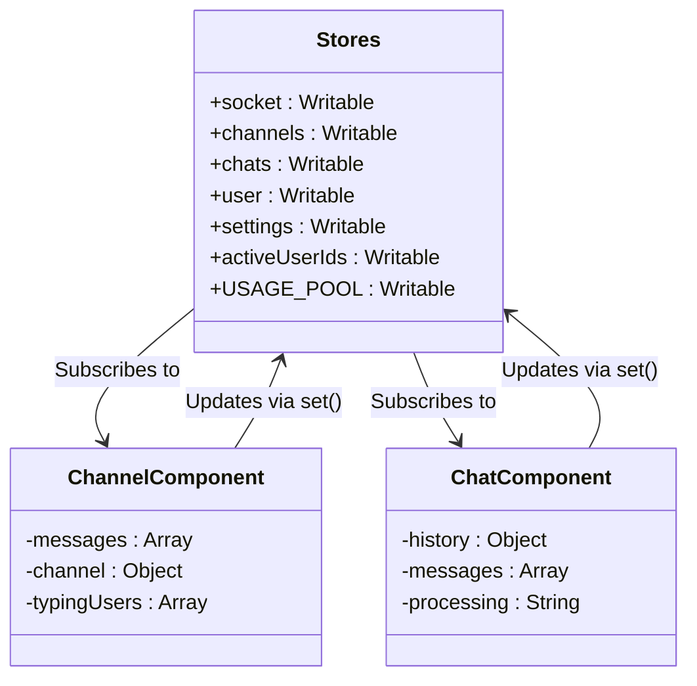
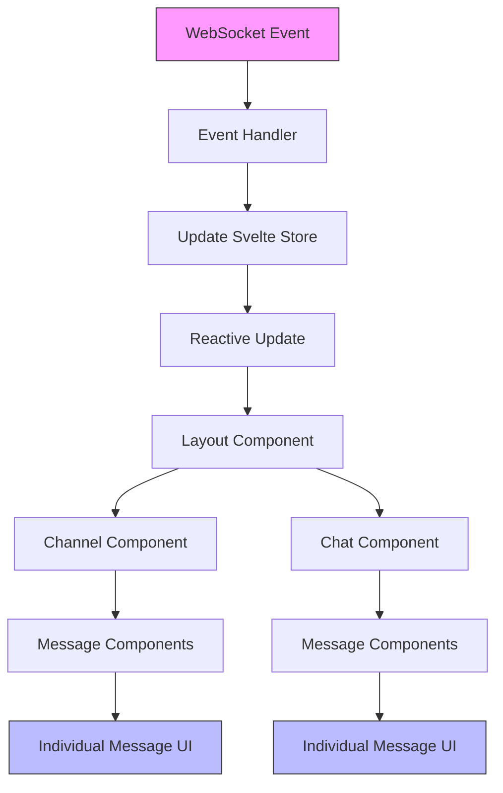
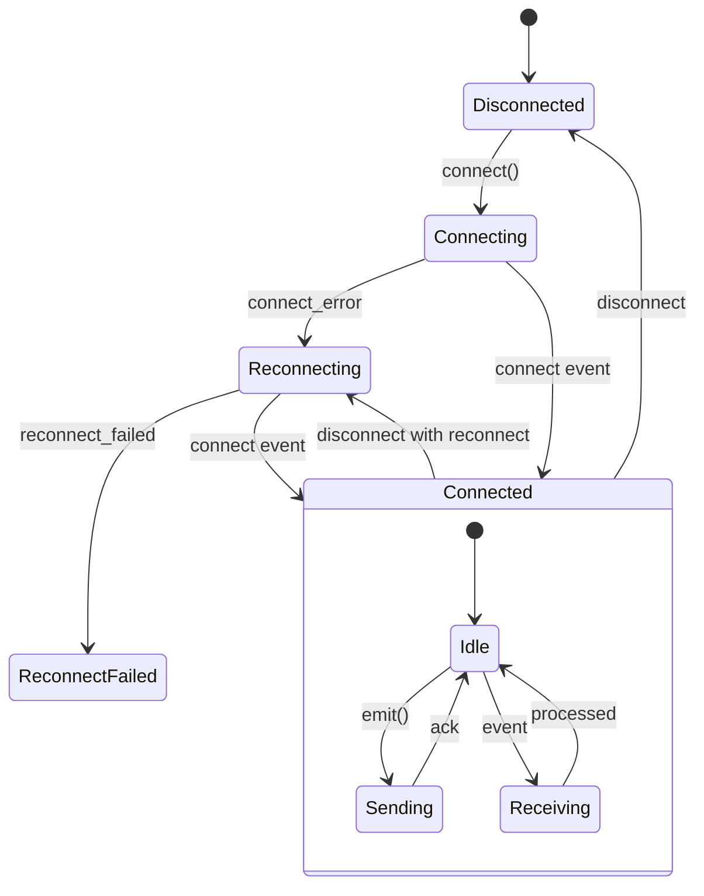
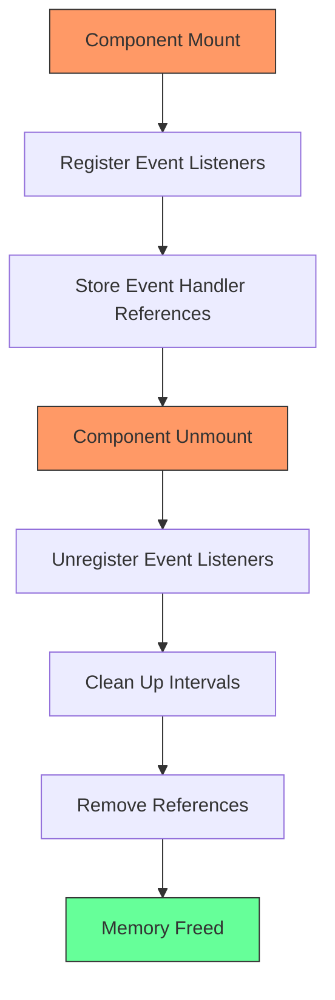

# Client-Side Event Listeners and State Updates

<cite>
**Referenced Files in This Document**   
- [src/lib/stores/index.ts](file://src/lib/stores/index.ts)
- [src/routes/+layout.svelte](file://src/routes/+layout.svelte)
- [src/lib/components/channel/Channel.svelte](file://src/lib/components/channel/Channel.svelte)
- [src/lib/components/channel/Thread.svelte](file://src/lib/components/channel/Thread.svelte)
- [src/lib/components/chat/Chat.svelte](file://src/lib/components/chat/Chat.svelte)
- [backend/open_webui/socket/main.py](file://backend/open_webui/socket/main.py)
</cite>

## Table of Contents
1. [Introduction](#introduction)
2. [WebSocket Connection and Event Registration](#websocket-connection-and-event-registration)
3. [Event Listener Implementation](#event-listener-implementation)
4. [State Management with Svelte Stores](#state-management-with-svelte-stores)
5. [UI Component Response to Events](#ui-component-response-to-events)
6. [Connection State Management and Error Handling](#connection-state-management-and-error-handling)
7. [Memory Leak Prevention](#memory-leak-prevention)
8. [Conclusion](#conclusion)

## Introduction
The open-webui application implements a real-time communication system using WebSocket connections to provide instant updates to the user interface. This document details the client-side event listeners that handle real-time updates from the server, focusing on how these events are processed and integrated into the application state through Svelte stores. The system enables collaborative features such as chat messaging, user presence indicators, and typing notifications, creating a responsive and interactive user experience. The implementation follows a reactive programming model where UI components automatically update in response to state changes triggered by incoming WebSocket events.

## WebSocket Connection and Event Registration

The WebSocket connection is established in the `+layout.svelte` file, which serves as the root layout component for the application. The connection setup occurs during the component initialization phase, ensuring that the WebSocket is available throughout the user's session.



**Diagram sources**
- [src/routes/+layout.svelte](file://src/routes/+layout.svelte#L97-L177)

The WebSocket connection is configured with several important options:
- Reconnection is enabled with exponential backoff (1-5 seconds)
- Authentication token is sent with the connection request
- The connection path is set to `/ws/socket.io`
- Both polling and WebSocket transports are supported

The connection establishment process includes emitting a `user-join` event with the authentication token, which allows the server to identify the user and subscribe them to relevant channels. A heartbeat mechanism is also implemented, sending a heartbeat event every 30 seconds to maintain the connection and detect disconnections promptly.

**Section sources**
- [src/routes/+layout.svelte](file://src/routes/+layout.svelte#L97-L177)

## Event Listener Implementation

The application implements event listeners for various event types, each handling specific real-time updates from the server. The primary event listeners are registered for the `events` and `events:channel` channels, which handle chat-related and channel-specific events respectively.



**Diagram sources**
- [src/routes/+layout.svelte](file://src/routes/+layout.svelte#L481-L545)
- [src/lib/components/channel/Channel.svelte](file://src/lib/components/channel/Channel.svelte#L115-L174)

The event handling system is implemented through dedicated handler functions that process incoming events and update the application state accordingly. The `chatEventHandler` function handles events related to chat interactions, while the `channelEventHandler` manages channel-specific events such as message creation, updates, and deletions.

For chat events, the handler processes various event types:
- `message`: Adds a new message to the conversation
- `message:update`: Updates an existing message's content
- `message:delete`: Removes a message from the conversation
- `typing`: Updates typing indicators for collaborative editing
- `chat:completion`: Streams partial responses during message generation

Channel events are handled similarly, with the `channelEventHandler` function processing events specific to channel interactions. When a new message arrives, the handler checks if it belongs to the currently active channel and updates the messages array accordingly. Typing indicators are managed through a combination of user tracking and timeout mechanisms to ensure they disappear after a period of inactivity.

**Section sources**
- [src/routes/+layout.svelte](file://src/routes/+layout.svelte#L481-L545)
- [src/lib/components/channel/Channel.svelte](file://src/lib/components/channel/Channel.svelte#L115-L174)
- [src/lib/components/channel/Thread.svelte](file://src/lib/components/channel/Thread.svelte#L62-L100)

## State Management with Svelte Stores

The application uses Svelte stores as the central mechanism for state management, enabling reactive updates across the user interface. The stores are defined in the `stores/index.ts` file and imported by components that need to access or modify the application state.



**Diagram sources**
- [src/lib/stores/index.ts](file://src/lib/stores/index.ts#L1-L302)
- [src/lib/components/channel/Channel.svelte](file://src/lib/components/channel/Channel.svelte#L57-L246)
- [src/lib/components/chat/Chat.svelte](file://src/lib/components/chat/Chat.svelte#L349-L389)

The state management pattern follows these key principles:
1. **Centralized State**: All shared state is stored in Svelte stores, making it accessible to any component that needs it.
2. **Reactivity**: Components automatically re-render when store values change, eliminating the need for manual DOM updates.
3. **Immutability**: State updates are performed by creating new objects/arrays rather than modifying existing ones, ensuring predictable change detection.
4. **Batched Updates**: Multiple state changes are batched together to minimize re-renders and improve performance.

When an event is received, the handler function updates the relevant store, which triggers automatic updates in all subscribed components. For example, when a new message arrives, the `messages` array in the channel component is updated using the spread operator to create a new array instance, which triggers Svelte's reactivity system.

Performance optimizations include:
- Using the `$: ` reactive declaration to create derived values
- Implementing memoization for expensive computations
- Debouncing rapid state updates to prevent excessive re-renders
- Using keyed each blocks to optimize list rendering

**Section sources**
- [src/lib/stores/index.ts](file://src/lib/stores/index.ts#L1-L302)
- [src/lib/components/channel/Channel.svelte](file://src/lib/components/channel/Channel.svelte#L57-L246)
- [src/lib/components/chat/Chat.svelte](file://src/lib/components/chat/Chat.svelte#L349-L389)

## UI Component Response to Events

UI components respond to incoming events by updating their local state and re-rendering to reflect the changes. The component hierarchy is designed to efficiently propagate state changes from the top-level layout to individual UI elements.



**Diagram sources**
- [src/lib/components/channel/Channel.svelte](file://src/lib/components/channel/Channel.svelte#L115-L174)
- [src/lib/components/chat/Chat.svelte](file://src/lib/components/chat/Chat.svelte#L350-L389)
- [src/lib/components/channel/Messages.svelte](file://src/lib/components/channel/Messages.svelte#L1-L255)

Specific UI components respond to events in the following ways:

**Chat Interface Updates**
When a new message event is received, the chat interface updates by:
1. Adding the new message to the messages array
2. Scrolling to the bottom if the user is already at the end of the conversation
3. Updating message counters and timestamps
4. Processing any embedded content (code blocks, images, etc.)

The `Messages.svelte` component uses a keyed each block to efficiently update the message list, ensuring that only changed messages are re-rendered.

**User Presence Indicators**
The system implements user presence indicators through:
- Typing indicators that show when other users are composing messages
- Last read markers that update when users view messages
- Online status indicators for channel members

These indicators are updated in real-time as events are received, providing immediate feedback to users about the activity of others in the channel.

**Error and Status Notifications**
The application handles various status events by displaying appropriate notifications:
- Success messages for completed actions
- Error messages for failed operations
- Warning messages for potential issues
- Informational messages for system events

These notifications are implemented using a toast notification system that appears temporarily and then disappears automatically.

**Section sources**
- [src/lib/components/channel/Channel.svelte](file://src/lib/components/channel/Channel.svelte#L115-L174)
- [src/lib/components/chat/Chat.svelte](file://src/lib/components/chat/Chat.svelte#L350-L389)
- [src/lib/components/channel/Messages.svelte](file://src/lib/components/channel/Messages.svelte#L1-L255)

## Connection State Management and Error Handling

The application implements comprehensive connection state management and error handling to ensure a robust user experience during network fluctuations. The system monitors the WebSocket connection state and responds appropriately to various connection events.



**Diagram sources**
- [src/routes/+layout.svelte](file://src/routes/+layout.svelte#L109-L176)

The connection state management includes:

**Error Event Handlers**
The application registers handlers for various connection events:
- `connect_error`: Handles connection failures with logging and user feedback
- `reconnect_attempt`: Logs reconnection attempts for debugging
- `reconnect_failed`: Handles permanent disconnection scenarios
- `disconnect`: Cleans up resources and notifies the user

**Network Resilience Features**
To handle network fluctuations, the system implements:
- Automatic reconnection with exponential backoff
- Heartbeat mechanism to detect stale connections
- Local state preservation during disconnections
- Queueing of outgoing messages during offline periods

**User Experience Considerations**
The application maintains a good user experience during network issues by:
- Displaying clear status indicators for connection state
- Preserving user input during temporary disconnections
- Providing feedback when operations cannot be completed
- Automatically resuming normal operation when connectivity is restored

The error handling strategy follows a progressive approach, attempting to recover from transient issues while providing appropriate feedback for persistent problems.

**Section sources**
- [src/routes/+layout.svelte](file://src/routes/+layout.svelte#L109-L176)

## Memory Leak Prevention

The application implements several strategies to prevent memory leaks, particularly related to event listener registration and unregistration. Proper cleanup is essential to maintain performance and prevent resource exhaustion over time.



**Diagram sources**
- [src/routes/+layout.svelte](file://src/routes/+layout.svelte#L683-L647)
- [src/lib/components/chat/Chat.svelte](file://src/lib/components/chat/Chat.svelte#L635-L647)

Key memory leak prevention techniques include:

**Event Listener Cleanup**
Event listeners are properly cleaned up when components are destroyed:
- The `onDestroy` lifecycle function is used to unregister event listeners
- Socket event listeners are removed using the `off` method
- Window and document event listeners are explicitly removed

In the `+layout.svelte` file, the user store subscription includes cleanup logic that removes event listeners when the user logs out or the component is destroyed:

```typescript
user.subscribe(async (value) => {
    if (value) {
        $socket?.on('events', chatEventHandler);
        $socket?.on('events:channel', channelEventHandler);
    } else {
        $socket?.off('events', chatEventHandler);
        $socket?.off('events:channel', channelEventHandler);
    }
});
```

**Interval and Timeout Management**
Timers are properly managed to prevent memory leaks:
- The heartbeat interval is cleared when the socket disconnects
- Typing indicator timeouts are cleared when users stop typing
- Polling intervals are cleared when components are destroyed

**Subscription Management**
Store subscriptions are properly cleaned up:
- Subscription cleanup functions are called in onDestroy
- Event listeners are removed when no longer needed
- References to event handlers are cleared

These practices ensure that event listeners do not persist after their associated components are destroyed, preventing memory leaks and ensuring efficient resource usage.

**Section sources**
- [src/routes/+layout.svelte](file://src/routes/+layout.svelte#L683-L647)
- [src/lib/components/chat/Chat.svelte](file://src/lib/components/chat/Chat.svelte#L635-L647)

## Conclusion
The open-webui application implements a robust real-time communication system using WebSocket connections and Svelte's reactivity model. The client-side event listeners effectively handle various event types, updating the application state through Svelte stores to provide a responsive user interface. The state management pattern leverages Svelte's reactivity system to automatically update UI components in response to incoming events, creating a seamless user experience.

Key aspects of the implementation include:
- Centralized state management using Svelte stores
- Efficient event handling with dedicated handler functions
- Reactive UI updates that automatically reflect state changes
- Comprehensive connection state management and error handling
- Proper cleanup to prevent memory leaks

The system demonstrates effective use of modern web technologies to create a real-time collaborative environment. By combining WebSocket for real-time communication with Svelte's reactivity model for state management, the application achieves high performance and responsiveness. The careful attention to memory management and error handling ensures a robust user experience even under challenging network conditions.