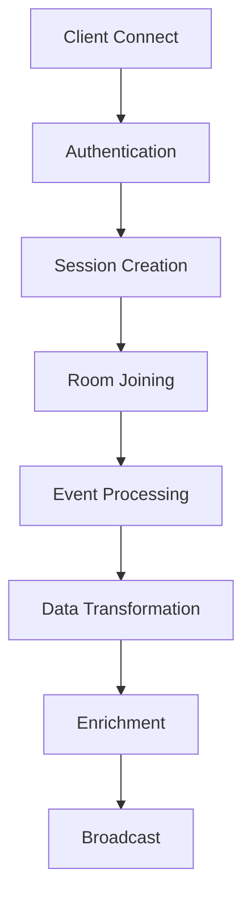
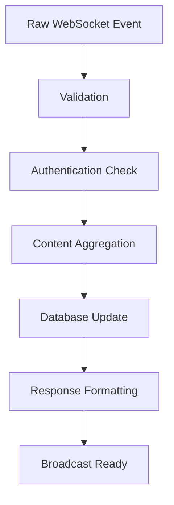
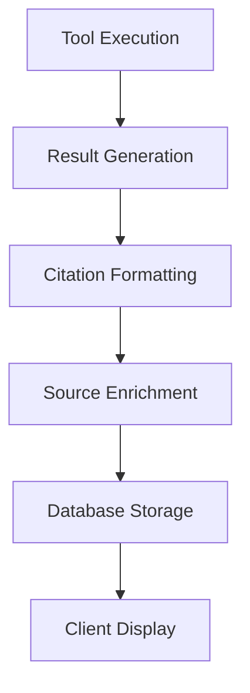
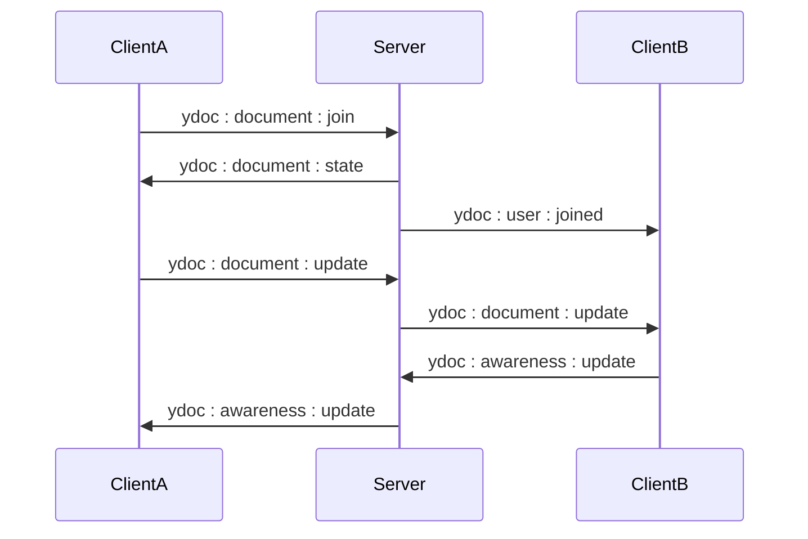
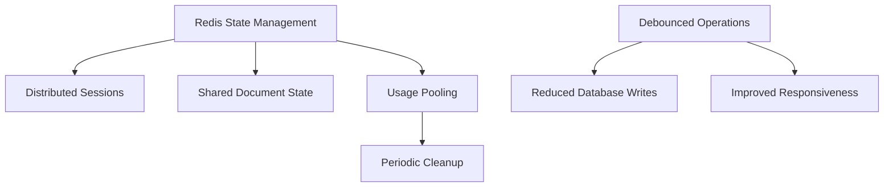
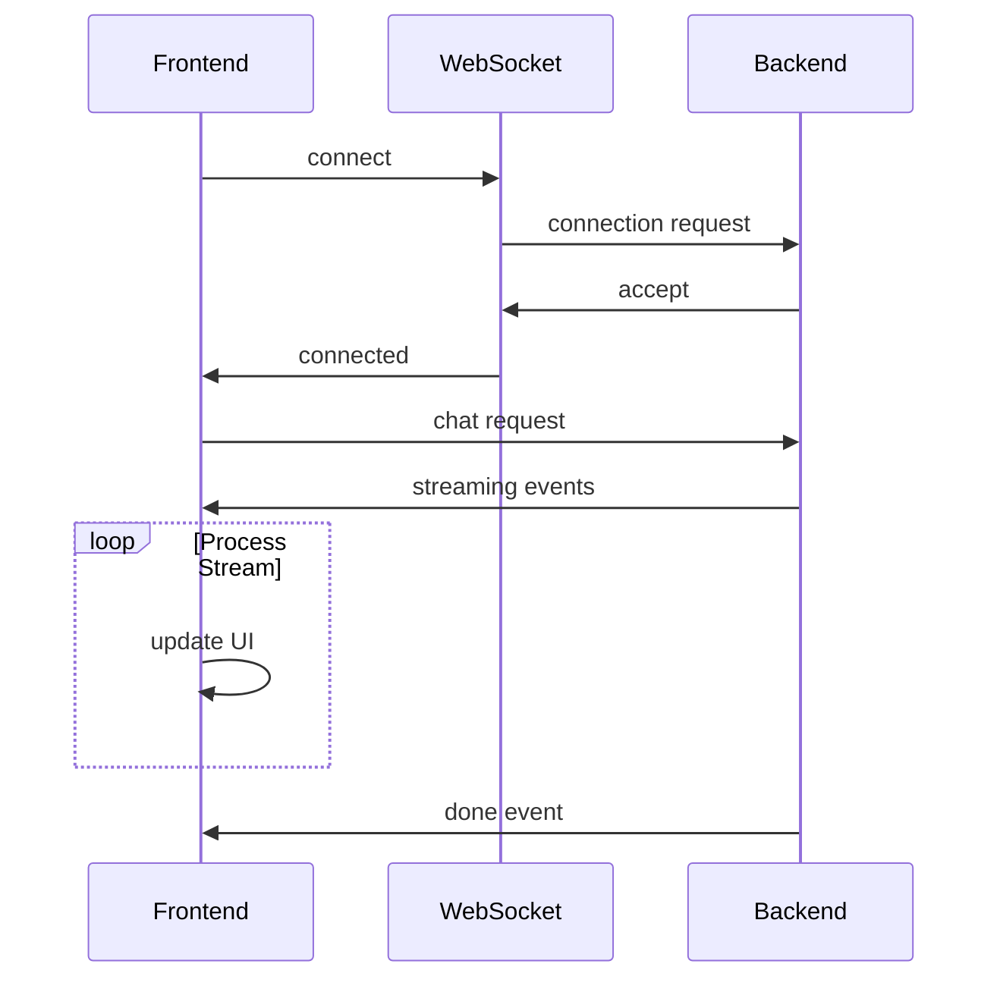

# Data Transformation and Enrichment

<cite>
**Referenced Files in This Document**   
- [main.py](file://backend/open_webui/socket/main.py)
- [utils.py](file://backend/open_webui/socket/utils.py)
- [chat.py](file://backend/open_webui/utils/chat.py)
- [middleware.py](file://backend/open_webui/utils/middleware.py)
- [chats.py](file://backend/open_webui/models/chats.py)
- [Citations.svelte](file://src/lib/components/chat/Messages/Citations.svelte)
- [+layout.svelte](file://src/routes/+layout.svelte)
- [Collaboration.ts](file://src/lib/components/common/RichTextInput/Collaboration.ts)
</cite>

## Table of Contents
1. [Introduction](#introduction)
2. [WebSocket Event Processing Pipeline](#websocket-event-processing-pipeline)
3. [Message Transformation and Enrichment](#message-transformation-and-enrichment)
4. [Source and Citation Integration](#source-and-citation-integration)
5. [Real-time Collaboration and Yjs Integration](#real-time-collaboration-and-yjs-integration)
6. [Performance Optimization and Caching](#performance-optimization-and-caching)
7. [Client-Side Event Handling](#client-side-event-handling)
8. [Conclusion](#conclusion)

## Introduction
The open-webui application implements a sophisticated data transformation and enrichment process for WebSocket events, enabling real-time communication with enhanced context and metadata. This document details the pipeline from raw message data to enriched broadcast format, focusing on how chat messages are enhanced with sources, how user presence information is enriched, and how tool execution results are integrated. The system leverages WebSocket technology with Redis for distributed state management, ensuring low-latency communication across multiple instances.

## WebSocket Event Processing Pipeline

The WebSocket event processing pipeline in open-webui begins with client connection and authentication, followed by event handling and message broadcasting. The core of this system is implemented in the socket module, which manages real-time communication between clients and the server.

**Diagram sources**
- [main.py](file://backend/open_webui/socket/main.py#L303-L351)
- [+layout.svelte](file://src/routes/+layout.svelte#L97-L106)

**Section sources**
- [main.py](file://backend/open_webui/socket/main.py#L303-L351)
- [+layout.svelte](file://src/routes/+layout.svelte#L97-L106)

## Message Transformation and Enrichment

The message transformation process in open-webui involves several stages of validation, sanitization, and formatting. When a WebSocket event is received, it undergoes a series of transformations before being broadcast to clients. The system handles various event types including chat messages, typing indicators, and channel events.

The transformation pipeline includes content aggregation, where partial message updates are combined into complete messages. For streaming responses, the system accumulates content chunks and updates the database incrementally. This is particularly important for large language model responses that are generated token by token.

**Diagram sources**
- [main.py](file://backend/open_webui/socket/main.py#L723-L803)
- [chats.py](file://backend/open_webui/models/chats.py#L304-L309)

**Section sources**
- [main.py](file://backend/open_webui/socket/main.py#L723-L803)
- [chats.py](file://backend/open_webui/models/chats.py#L304-L309)

## Source and Citation Integration

One of the key enrichment features in open-webui is the integration of sources and citations into chat messages. When tool results are generated, they are automatically converted into citation format and appended to the message sources. This process occurs during the middleware processing phase, where tool execution results are transformed into structured citation data.

The citation data structure includes the source name, document content, and metadata about the tool execution parameters. This enriched data is then stored in the message object and broadcast to clients, enabling the frontend to display proper citation references alongside the generated content.

**Diagram sources**
- [middleware.py](file://backend/open_webui/utils/middleware.py#L461-L486)
- [Citations.svelte](file://src/lib/components/chat/Messages/Citations.svelte#L53-L171)

**Section sources**
- [middleware.py](file://backend/open_webui/utils/middleware.py#L461-L486)
- [Citations.svelte](file://src/lib/components/chat/Messages/Citations.svelte#L53-L171)

## Real-time Collaboration and Yjs Integration

The real-time collaboration features in open-webui are powered by Yjs, a CRDT-based collaboration framework. When users join a document, their presence is tracked, and document updates are synchronized across all connected clients. The system implements a debounced save mechanism to prevent excessive database writes while ensuring data persistence.

The Yjs integration handles document updates, awareness information (such as cursor positions), and user presence. When a user makes changes to a document, the update is broadcast to all other users in the same document room, enabling real-time collaborative editing.

**Diagram sources**
- [main.py](file://backend/open_webui/socket/main.py#L448-L681)
- [Collaboration.ts](file://src/lib/components/common/RichTextInput/Collaboration.ts#L87-L256)

**Section sources**
- [main.py](file://backend/open_webui/socket/main.py#L448-L681)
- [Collaboration.ts](file://src/lib/components/common/RichTextInput/Collaboration.ts#L87-L256)

## Performance Optimization and Caching

The open-webui system implements several performance optimization techniques to minimize latency in real-time communication. The primary optimization is the use of Redis for distributed state management, allowing multiple server instances to share session and document state.

The system uses Redis-backed data structures like RedisDict and RedisLock to manage shared state across instances. Usage pooling tracks active model usage, and periodic cleanup tasks remove expired entries to prevent memory leaks. The debounced save mechanism for Yjs documents reduces database write frequency while maintaining data consistency.

**Diagram sources**
- [main.py](file://backend/open_webui/socket/main.py#L122-L148)
- [utils.py](file://backend/open_webui/socket/utils.py#L49-L117)

**Section sources**
- [main.py](file://backend/open_webui/socket/main.py#L122-L148)
- [utils.py](file://backend/open_webui/socket/utils.py#L49-L117)

## Client-Side Event Handling

The client-side implementation in open-webui handles WebSocket events through a structured event system. The frontend establishes a connection to the WebSocket server and listens for various event types, including chat completions, channel events, and document updates.

The event handling system processes streaming responses by emitting each chunk to the appropriate channel, allowing the UI to update incrementally as content is generated. Error handling is implemented through try-catch blocks and proper cleanup of event listeners when connections are terminated.

**Diagram sources**
- [+layout.svelte](file://src/routes/+layout.svelte#L447-L475)
- [chat.py](file://backend/open_webui/utils/chat.py#L86-L127)

**Section sources**
- [+layout.svelte](file://src/routes/+layout.svelte#L447-L475)
- [chat.py](file://backend/open_webui/utils/chat.py#L86-L127)

## Conclusion
The data transformation and enrichment process in open-webui demonstrates a sophisticated approach to real-time communication with contextual enhancement. By leveraging WebSocket technology, Redis for distributed state management, and Yjs for real-time collaboration, the system provides a responsive and feature-rich user experience. The pipeline effectively transforms raw message data into enriched content with sources, citations, and metadata, while implementing performance optimizations to minimize latency. This architecture enables seamless integration of tool execution results, collaborative editing, and real-time updates across multiple clients.