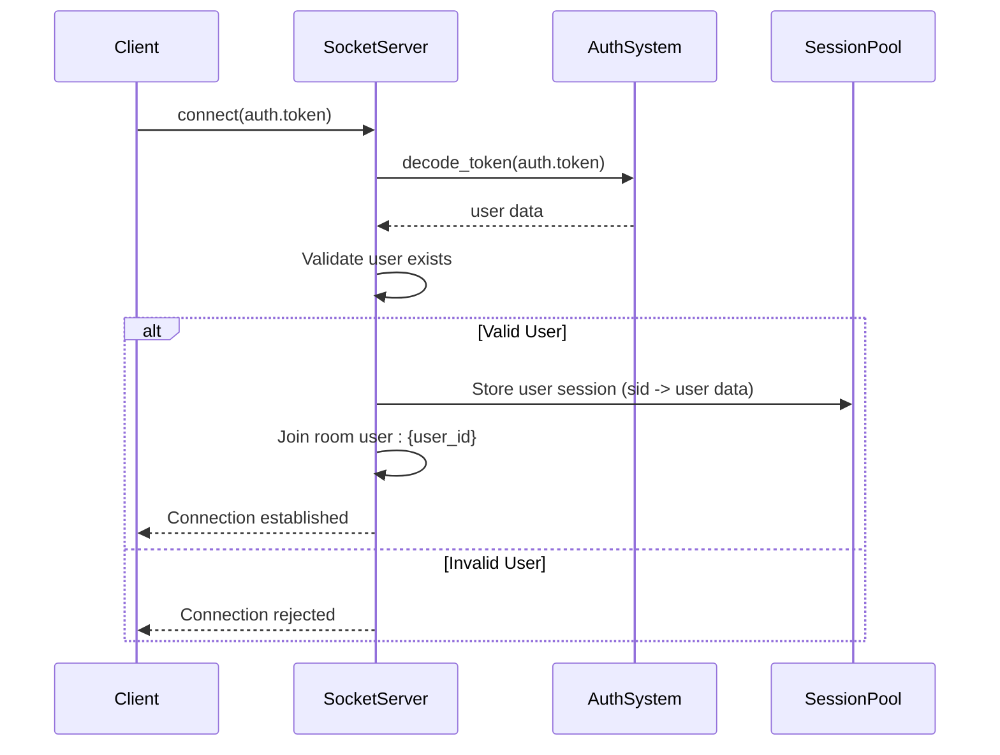
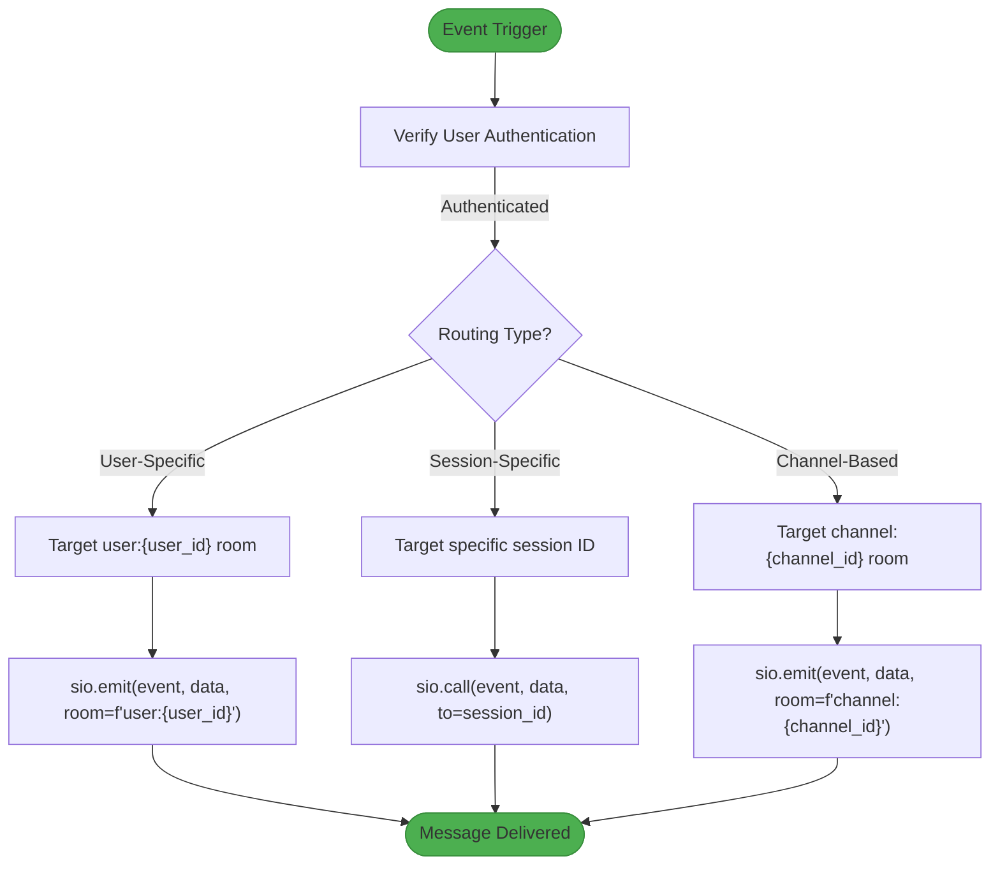
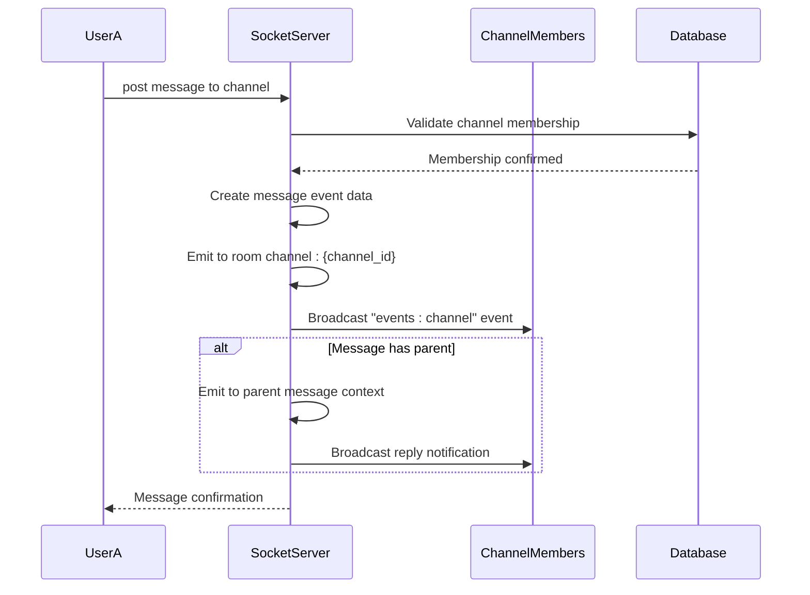

# Event Routing and Session Management

<cite>
**Referenced Files in This Document**   
- [main.py](file://backend/open_webui/socket/main.py)
- [utils.py](file://backend/open_webui/socket/utils.py)
- [channels.py](file://backend/open_webui/models/channels.py)
- [channels.py](file://backend/open_webui/routers/channels.py)
- [env.py](file://backend/open_webui/env.py)
</cite>

## Table of Contents
1. [Introduction](#introduction)
2. [Session Management System](#session-management-system)
3. [Event Routing Mechanism](#event-routing-mechanism)
4. [Channel-Based Message Broadcasting](#channel-based-message-broadcasting)
5. [Connection and Disconnection Handling](#connection-and-disconnection-handling)
6. [Room Management in Socket.IO](#room-management-in-socketio)
7. [WebSocket Configuration](#websocket-configuration)
8. [State Synchronization and Cleanup](#state-synchronization-and-cleanup)

## Introduction
This document provides a comprehensive analysis of the event routing mechanism in open-webui's WebSocket implementation, focusing on how messages are directed to specific sessions using the 'to' parameter in Socket.IO calls. The system leverages Socket.IO for real-time communication, with Redis for distributed state management in clustered environments. The architecture supports efficient message distribution through room-based broadcasting, user session tracking, and channel membership management. This documentation details the complete flow from connection establishment to message routing, including the session lifecycle, authentication integration, and state synchronization mechanisms.

## Session Management System

The session management system in open-webui establishes a secure connection between clients and the server by authenticating users through JWT tokens and maintaining session state in memory or Redis. When a client connects via WebSocket, the system verifies the authentication token and creates a session entry that associates the socket connection (sid) with the user's identity. This association enables personalized event routing and access control throughout the user's session.

The system maintains user sessions in the SESSION_POOL dictionary (or RedisDict when using Redis), which stores user information including their ID, name, and other profile data (excluding sensitive fields like date of birth, bio, and gender). Each connected session is automatically added to a user-specific room (user:{user_id}) upon successful authentication, enabling direct communication with that user across all their active sessions.



**Diagram sources**
- [main.py](file://backend/open_webui/socket/main.py#L303-L316)
- [main.py](file://backend/open_webui/socket/main.py#L318-L351)

**Section sources**
- [main.py](file://backend/open_webui/socket/main.py#L303-L351)

## Event Routing Mechanism

The event routing mechanism in open-webui utilizes Socket.IO's built-in capabilities with custom extensions to direct messages to specific recipients using the 'to' parameter. The system implements multiple routing patterns based on user IDs, channel memberships, and session-specific delivery. The primary routing function `emit_to_users` sends messages to all active sessions of specified users by targeting their user:{id} rooms, ensuring that users receive notifications across all their connected devices.

For more granular control, the system supports session-specific event calling through the `get_event_call` function, which uses the 'to' parameter to direct messages to a specific session ID. This enables scenarios where responses need to be sent only to the originating session rather than all sessions of a user. The routing logic also includes error handling and logging to monitor delivery failures and maintain system reliability.



**Diagram sources**
- [main.py](file://backend/open_webui/socket/main.py#L256-L269)
- [main.py](file://backend/open_webui/socket/main.py#L815-L838)

**Section sources**
- [main.py](file://backend/open_webui/socket/main.py#L256-L269)
- [main.py](file://backend/open_webui/socket/main.py#L695-L838)

## Channel-Based Message Broadcasting

Channel-based message broadcasting in open-webui enables efficient distribution of events to all members of a specific channel through Socket.IO rooms. When a message is posted to a channel, the system emits an "events:channel" event to the channel:{channel_id} room, ensuring that all currently connected members receive the update in real-time. This mechanism is implemented in the `channel_events` handler, which validates that the sending user is a participant of the channel before broadcasting the message to all room members.

The system automatically manages channel membership by having users join channel rooms upon connection and when explicitly joining channels. The `join_channel` and `join_note` handlers ensure that users are added to the appropriate rooms based on their permissions and access rights. For message replies, the system implements a dual-emission pattern, sending the message to both the main channel room and the parent message context, enabling rich conversation threading.



**Diagram sources**
- [main.py](file://backend/open_webui/socket/main.py#L413-L447)
- [channels.py](file://backend/open_webui/routers/channels.py#L1035-L1039)

**Section sources**
- [main.py](file://backend/open_webui/socket/main.py#L413-L447)
- [channels.py](file://backend/open_webui/routers/channels.py#L1023-L1060)

## Connection and Disconnection Handling

The connection and disconnection handling system in open-webui manages the complete lifecycle of WebSocket connections, ensuring proper session setup, cleanup, and state synchronization. When a client connects, the system authenticates the user via JWT token, establishes a session in the SESSION_POOL, and automatically joins the user to their personal room (user:{user_id}) and all channels they belong to. This initialization process ensures that users immediately begin receiving relevant events upon connection.

For disconnection handling, the system implements a comprehensive cleanup process that removes the session from the SESSION_POOL, removes the user from all Yjs documents they were collaborating on, and triggers any necessary state updates. The disconnect handler also manages heartbeat functionality through the "heartbeat" event, which updates the user's last active timestamp in the database, enabling presence detection and user activity tracking across the application.

```mermaid
flowchart TD
subgraph Connection
ConnectStart([Client Connect]) --> Auth["Authenticate with token"]
Auth --> |Success| SessionCreate["Create session in SESSION_POOL"]
SessionCreate --> JoinUserRoom["Join user:{user_id} room"]
JoinUserRoom --> JoinChannels["Join all user channels"]
JoinChannels --> CompleteConnection["Connection Complete"]
end
subgraph Disconnection
DisconnectStart([Client Disconnect]) --> RemoveSession["Remove session from SESSION_POOL"]
RemoveSession --> LeaveDocuments["Remove user from all Yjs documents"]
LeaveDocuments --> UpdateState["Update user presence state"]
UpdateState --> CompleteDisconnection["Cleanup Complete"]
end
style ConnectStart fill:#2196F3,stroke:#1976D2
style CompleteConnection fill:#4CAF50,stroke:#388E3C
style DisconnectStart fill:#F44336,stroke:#D32F2F
style CompleteDisconnection fill:#4CAF50,stroke:#388E3C
```



**Diagram sources**
- [main.py](file://backend/open_webui/socket/main.py#L303-L316)
- [main.py](file://backend/open_webui/socket/main.py#L318-L351)
- [main.py](file://backend/open_webui/socket/main.py#L684-L693)

**Section sources**
- [main.py](file://backend/open_webui/socket/main.py#L303-L351)
- [main.py](file://backend/open_webui/socket/main.py#L354-L359)
- [main.py](file://backend/open_webui/socket/main.py#L684-L693)

## Room Management in Socket.IO

Room management in Socket.IO is a core component of open-webui's event distribution system, enabling efficient message broadcasting to specific groups of users. The system implements a hierarchical room structure with user-specific rooms (user:{user_id}) and channel-specific rooms (channel:{channel_id}), allowing for targeted message delivery based on user identity and collaboration context. The `enter_room_for_users` utility function facilitates bulk room joining, enabling all sessions of specified users to join a particular room simultaneously.

The system leverages Socket.IO's built-in room management capabilities through the client manager, with methods like `get_participants`, `enter_room`, and `leave_room` to manage membership and retrieve active sessions. For distributed deployments, the system can use Redis as a message queue to synchronize room state across multiple server instances, ensuring consistent event delivery regardless of which server instance handles a particular client connection.

```mermaid
classDiagram
class SocketIO {
+AsyncServer sio
+AsyncRedisManager mgr (optional)
+emit(event, data, room)
+call(event, data, to)
+enter_room(sid, room)
+leave_room(sid, room)
+get_participants(namespace, room)
}
class RoomManager {
+str user_room_prefix
+str channel_room_prefix
+str note_room_prefix
+enter_room_for_users(room, user_ids)
+get_session_ids_from_room(room)
+get_user_ids_from_room(room)
}
class SessionPool {
+dict or RedisDict SESSION_POOL
+dict or RedisDict USAGE_POOL
+get_user_id_from_session_pool(sid)
}
SocketIO --> RoomManager : "uses"
SocketIO --> SessionPool : "uses"
RoomManager --> SessionPool : "queries"
note right of SocketIO : Core Socket.IO server instance<br/>Handles all WebSocket connections<br/>Manages rooms and event distribution
note left of RoomManager : Utility functions for room management<br/>Provides higher-level abstractions<br/>for common room operations
note right of SessionPool : Maintains session-to-user mapping<br/>Tracks user sessions and metadata<br/>Supports Redis or in-memory storage
```

**Diagram sources**
- [main.py](file://backend/open_webui/socket/main.py#L76-L99)
- [main.py](file://backend/open_webui/socket/main.py#L272-L285)
- [main.py](file://backend/open_webui/socket/main.py#L238-L244)

**Section sources**
- [main.py](file://backend/open_webui/socket/main.py#L64-L99)
- [main.py](file://backend/open_webui/socket/main.py#L272-L285)

## WebSocket Configuration

The WebSocket configuration in open-webui is controlled through environment variables that determine the transport mechanism, connection settings, and distributed deployment options. The system supports both WebSocket and HTTP long-polling transports, with WebSocket enabled by default when the ENABLE_WEBSOCKET_SUPPORT environment variable is set to "true". For distributed deployments, the system can use Redis as a message queue to synchronize state across multiple server instances, with support for Redis Sentinel for high availability configurations.

Key configuration parameters include ping interval and timeout settings that control the heartbeat mechanism, Redis connection details for distributed state management, and logging options for monitoring WebSocket server activity. The configuration also includes timeout durations for various operations, such as the 3-second timeout used in the periodic usage pool cleanup process, which helps maintain system performance by removing stale connections.

```mermaid
erDiagram
WEBSOCKET_CONFIG {
boolean ENABLE_WEBSOCKET_SUPPORT
string WEBSOCKET_MANAGER
string WEBSOCKET_REDIS_URL
boolean WEBSOCKET_REDIS_CLUSTER
int WEBSOCKET_REDIS_LOCK_TIMEOUT
string WEBSOCKET_SENTINEL_HOSTS
int WEBSOCKET_SENTINEL_PORT
boolean WEBSOCKET_SERVER_LOGGING
boolean WEBSOCKET_SERVER_ENGINEIO_LOGGING
int WEBSOCKET_SERVER_PING_TIMEOUT
int WEBSOCKET_SERVER_PING_INTERVAL
}
REDIS_CONFIG {
string REDIS_URL
boolean REDIS_CLUSTER
string REDIS_KEY_PREFIX
string REDIS_SENTINEL_HOSTS
int REDIS_SENTINEL_PORT
}
WEBSOCKET_CONFIG ||--o{ REDIS_CONFIG : "uses for distributed state"
note right of WEBSOCKET_CONFIG: WebSocket server configuration<br/>Controls transport, connection<br/>and distributed deployment settings
note left of REDIS_CONFIG: Redis configuration for<br/>distributed state management<br/>and message queuing
```

**Diagram sources**
- [env.py](file://backend/open_webui/env.py#L613-L662)
- [main.py](file://backend/open_webui/socket/main.py#L64-L99)

**Section sources**
- [env.py](file://backend/open_webui/env.py#L613-L662)

## State Synchronization and Cleanup

State synchronization and cleanup in open-webui ensures that user presence, resource usage, and collaborative editing states remain consistent across the system. The periodic_usage_pool_cleanup function runs continuously to remove stale connections from the USAGE_POOL based on a 3-second timeout threshold, preventing memory leaks and ensuring accurate tracking of active model usage. This cleanup process uses Redis locks to prevent race conditions in distributed deployments, with retry logic to handle lock contention.

For collaborative editing, the YdocManager class manages Yjs document state in Redis, tracking which users are connected to each document and synchronizing updates across all participants. When users disconnect or leave documents, the system automatically removes them from the document's user list and clears the document state when no users remain, optimizing resource usage. The system also implements debounced saving for document updates, reducing database write frequency while maintaining data durability.

```mermaid
flowchart TD
subgraph CleanupProcess
StartCleanup["periodic_usage_pool_cleanup()"] --> AcquireLock["Acquire Redis lock"]
AcquireLock --> |Success| CheckTimeouts["Check for expired connections"]
CheckTimeouts --> RemoveExpired["Remove connections > 3s old"]
RemoveExpired --> CleanupEmpty["Remove empty model entries"]
CleanupEmpty --> RenewLock["Renew Redis lock"]
RenewLock --> Wait["Wait 3s"]
Wait --> CheckLock["Can renew lock?"]
CheckLock --> |Yes| ContinueLoop
CheckLock --> |No| ReleaseLock["Release lock and exit"]
ContinueLoop --> CheckTimeouts
end
subgraph DocumentManagement
UserJoinsDoc["User joins document"] --> AddToYdoc["YDOC_MANAGER.add_user()"]
AddToYdoc --> JoinDocRoom["Join doc_{document_id} room"]
JoinDocRoom --> SendState["Send document state to user"]
UserUpdatesDoc["User updates document"] --> AppendUpdate["YDOC_MANAGER.append_to_updates()"]
AppendUpdate --> Broadcast["Broadcast update to room"]
Broadcast --> DebounceSave["Schedule debounced save"]
DebounceSave --> SaveToDB["Save to database after 0.5s delay"]
UserLeavesDoc["User leaves document"] --> RemoveFromYdoc["YDOC_MANAGER.remove_user()"]
RemoveFromYdoc --> LeaveDocRoom["Leave doc_{document_id} room"]
LeaveDocRoom --> CheckRemaining["Any users left?"]
CheckRemaining --> |No| ClearDocument["YDOC_MANAGER.clear_document()"]
end
style StartCleanup fill:#FF9800,stroke:#F57C00
style AcquireLock fill:#2196F3,stroke:#1976D2
style ReleaseLock fill:#F44336,stroke:#D32F2F
```



**Diagram sources**
- [main.py](file://backend/open_webui/socket/main.py#L167-L216)
- [utils.py](file://backend/open_webui/socket/utils.py#L120-L224)
- [main.py](file://backend/open_webui/socket/main.py#L448-L659)

**Section sources**
- [main.py](file://backend/open_webui/socket/main.py#L167-L216)
- [utils.py](file://backend/open_webui/socket/utils.py#L120-L224)