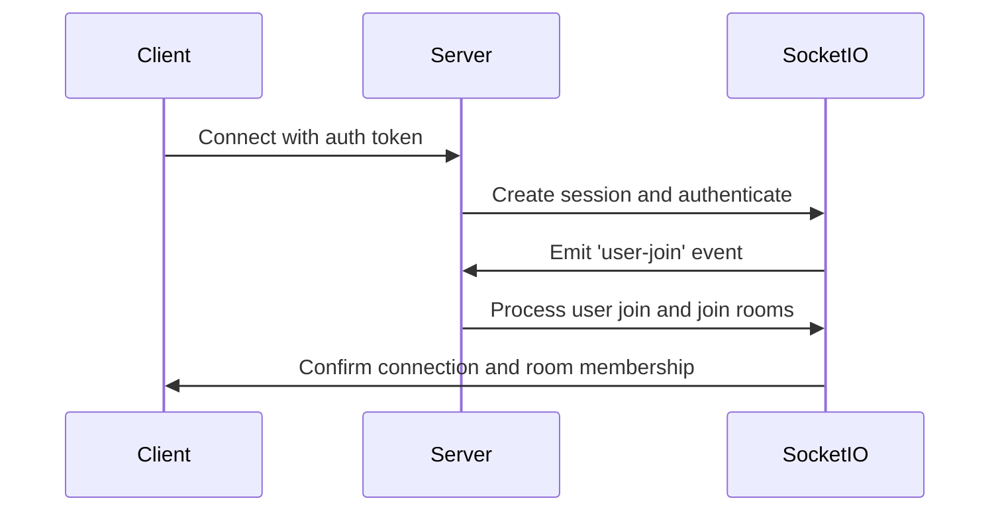
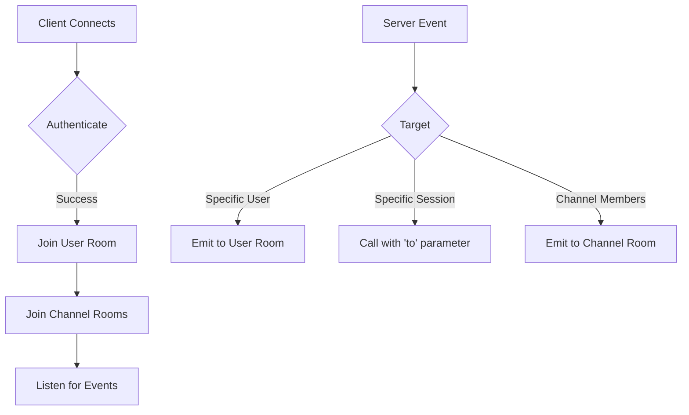
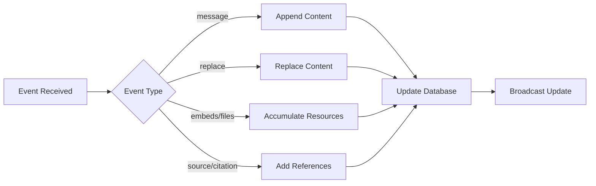
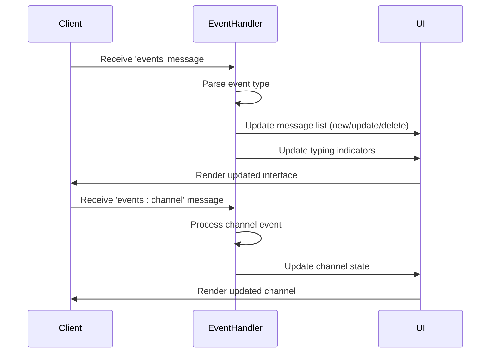

# Event System and Message Handling

<cite>
**Referenced Files in This Document**   
- [main.py](file://backend/open_webui/socket/main.py)
- [utils.py](file://backend/open_webui/socket/utils.py)
- [+layout.svelte](file://src/routes/+layout.svelte)
- [Channel.svelte](file://src/lib/components/channel/Channel.svelte)
- [Collaboration.ts](file://src/lib/components/common/RichTextInput/Collaboration.ts)
- [chat.py](file://backend/open_webui/utils/chat.py)
</cite>

## Table of Contents
1. [Introduction](#introduction)
2. [Event Types and Payload Structures](#event-types-and-payload-structures)
3. [Client and Server Event Emission](#client-and-server-event-emission)
4. [Event Routing Mechanism](#event-routing-mechanism)
5. [Data Transformation and Enrichment](#data-transformation-and-enrichment)
6. [Client-Side Event Listeners](#client-side-event-listeners)
7. [Conclusion](#conclusion)

## Introduction
The WebSocket event system in open-webui facilitates real-time communication between clients and servers, enabling dynamic updates and collaborative features. This document details the event types, emission mechanisms, routing strategies, data transformation processes, and client-side handling of events within the application.

**Section sources**
- [main.py](file://backend/open_webui/socket/main.py#L1-L839)

## Event Types and Payload Structures
The open-webui application utilizes several event types to manage real-time interactions. Key events include 'user-join', 'events', and 'events:channel', each serving distinct purposes with specific payload structures.

The 'user-join' event is triggered when a user connects to the WebSocket, authenticating with a token and joining relevant rooms based on their channels. The 'events' event is used for chat-related updates, including message content, status, and sources. The 'events:channel' event handles channel-specific activities such as typing indicators and last read timestamps.

Each event carries a structured payload containing metadata like chat_id, message_id, and type-specific data, ensuring proper context for event processing.

**Section sources**
- [main.py](file://backend/open_webui/socket/main.py#L318-L351)
- [main.py](file://backend/open_webui/socket/main.py#L701-L803)

## Client and Server Event Emission
Events are emitted from both client and server sides to maintain real-time synchronization. On the client side, the 'user-join' event is emitted upon successful connection, sending authentication tokens to establish user identity and room memberships.

On the server side, events are emitted through the Socket.IO interface using the `sio.emit()` method. The `get_event_emitter` function creates an emitter that sends events to specific users via their user-specific rooms. This mechanism is used in chat processing to update message content, status, and sources in real-time.

The server also uses `sio.call()` for request-response patterns, particularly in chat completion workflows where the server calls specific endpoints to process requests and return responses.

**Diagram sources**
- [main.py](file://backend/open_webui/socket/main.py#L318-L351)
- [main.py](file://backend/open_webui/socket/main.py#L695-L838)
- [+layout.svelte](file://src/routes/+layout.svelte#L150-L152)

**Section sources**
- [main.py](file://backend/open_webui/socket/main.py#L318-L351)
- [main.py](file://backend/open_webui/socket/main.py#L695-L838)
- [+layout.svelte](file://src/routes/+layout.svelte#L150-L152)

## Event Routing Mechanism
The event routing mechanism in open-webui leverages Socket.IO rooms to direct messages to specific sessions. When a user connects, they are automatically joined to their user-specific room (e.g., "user:{user_id}") and all their channel rooms (e.g., "channel:{channel_id}").

The 'to' parameter in Socket.IO calls is used to target specific sessions. In the `get_event_call` function, events are directed to a specific session using the session_id from the request_info. This ensures that responses to specific requests are delivered to the correct client instance.

Room-based broadcasting is used extensively, with events emitted to entire rooms when multiple users need to receive the same update. For example, when a message is sent in a channel, the event is broadcast to all members of that channel's room.

**Diagram sources**
- [main.py](file://backend/open_webui/socket/main.py#L238-L254)
- [main.py](file://backend/open_webui/socket/main.py#L817-L825)
- [Channel.svelte](file://src/lib/components/channel/Channel.svelte#L58-L64)

**Section sources**
- [main.py](file://backend/open_webui/socket/main.py#L238-L254)
- [main.py](file://backend/open_webui/socket/main.py#L817-L825)
- [Channel.svelte](file://src/lib/components/channel/Channel.svelte#L58-L64)

## Data Transformation and Enrichment
During event processing, significant data transformation and enrichment occurs. When chat events are received, the system updates message content incrementally, appending new content to existing messages. Status updates are recorded in the database, and sources are accumulated as they are discovered.

The `get_event_emitter` function handles various event types, each triggering specific data transformations:
- "message" events append content to existing messages
- "replace" events overwrite message content entirely
- "embeds" and "files" events accumulate additional resources
- "source" and "citation" events enrich messages with reference information

This transformation process ensures that the application state remains consistent and up-to-date, with all relevant information being properly stored and displayed.

**Diagram sources**
- [main.py](file://backend/open_webui/socket/main.py#L701-L803)
- [chat.py](file://backend/open_webui/utils/chat.py#L421-L428)

**Section sources**
- [main.py](file://backend/open_webui/socket/main.py#L701-L803)
- [chat.py](file://backend/open_webui/utils/chat.py#L421-L428)

## Client-Side Event Listeners
Client-side event listeners are implemented in Svelte components to update the application state in response to real-time events. The main layout component sets up listeners for 'events' and 'events:channel' when a user is authenticated.

The chat event handler processes various message types, updating the UI accordingly:
- New messages are added to the message list
- Message updates modify existing messages
- Message deletions remove messages from the list
- Reactions and replies update message metadata

The channel event handler manages collaborative features like typing indicators, updating the UI to show which users are currently typing in a channel.

**Diagram sources**
- [+layout.svelte](file://src/routes/+layout.svelte#L688-L689)
- [Channel.svelte](file://src/lib/components/channel/Channel.svelte#L115-L174)

**Section sources**
- [+layout.svelte](file://src/routes/+layout.svelte#L688-L689)
- [Channel.svelte](file://src/lib/components/channel/Channel.svelte#L115-L174)

## Conclusion
The WebSocket event system in open-webui provides a robust foundation for real-time collaboration and communication. By leveraging Socket.IO rooms and targeted event emission, the system efficiently routes messages to the appropriate clients. The data transformation pipeline ensures that messages are properly enriched with sources and other metadata, while client-side listeners maintain a responsive and up-to-date user interface. This architecture supports the application's collaborative features, enabling seamless interaction between users in channels and on shared documents.