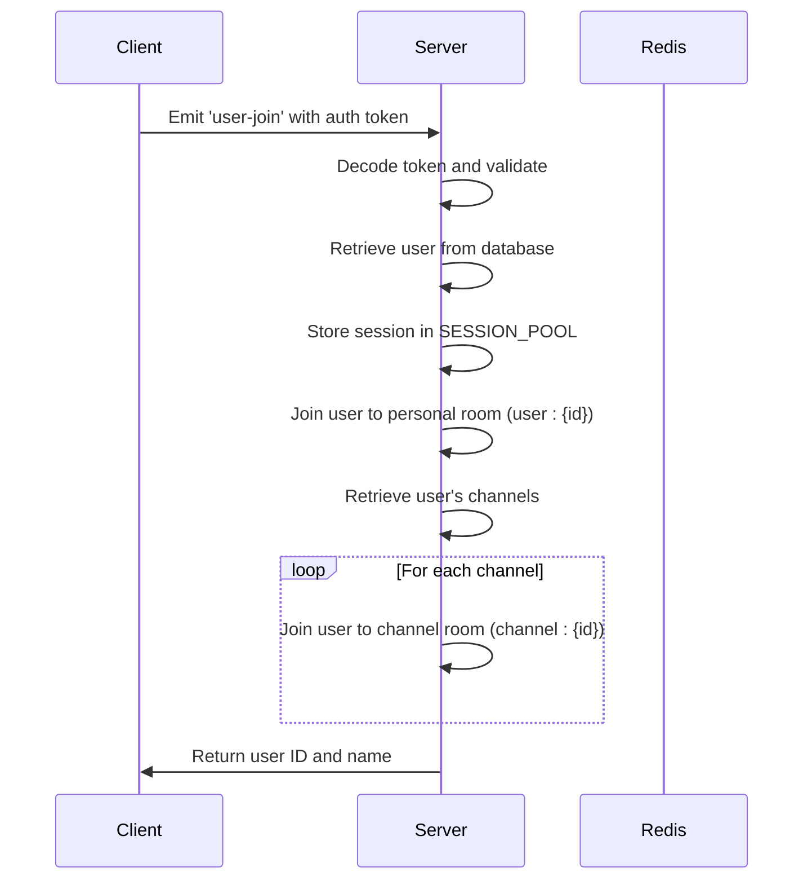
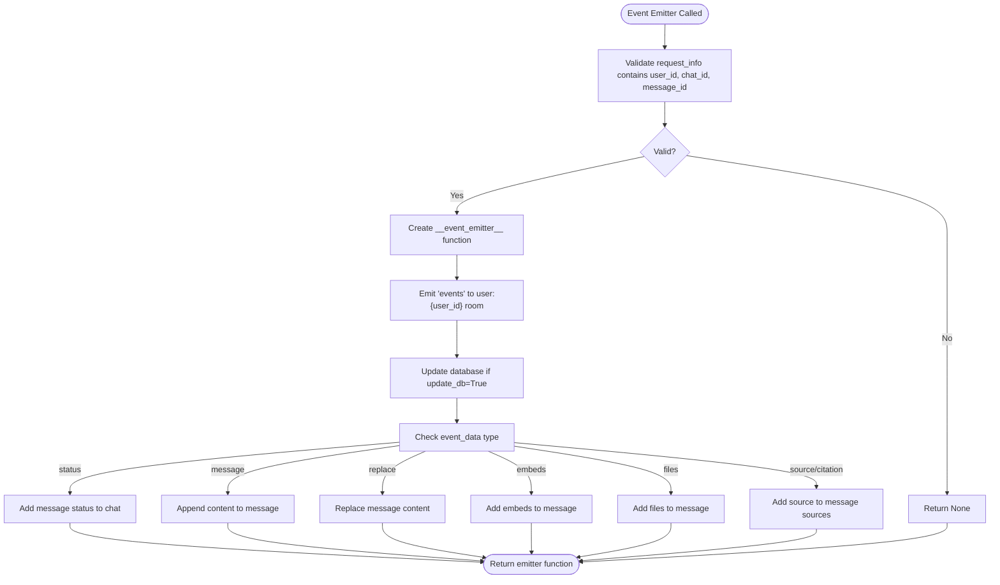
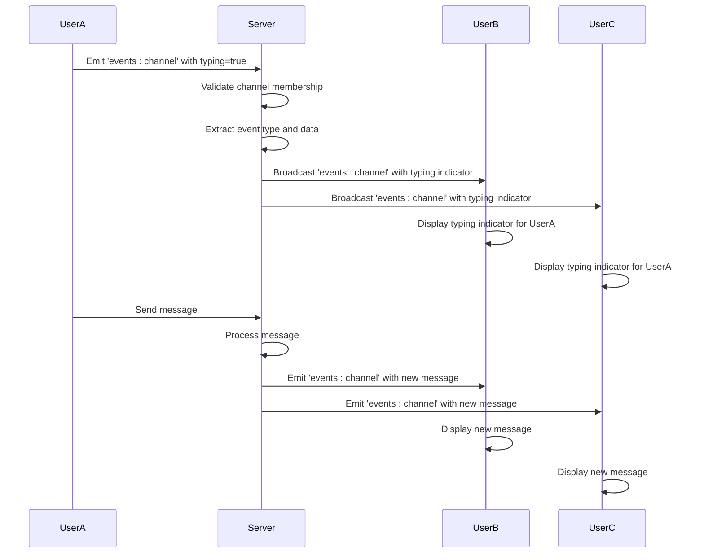
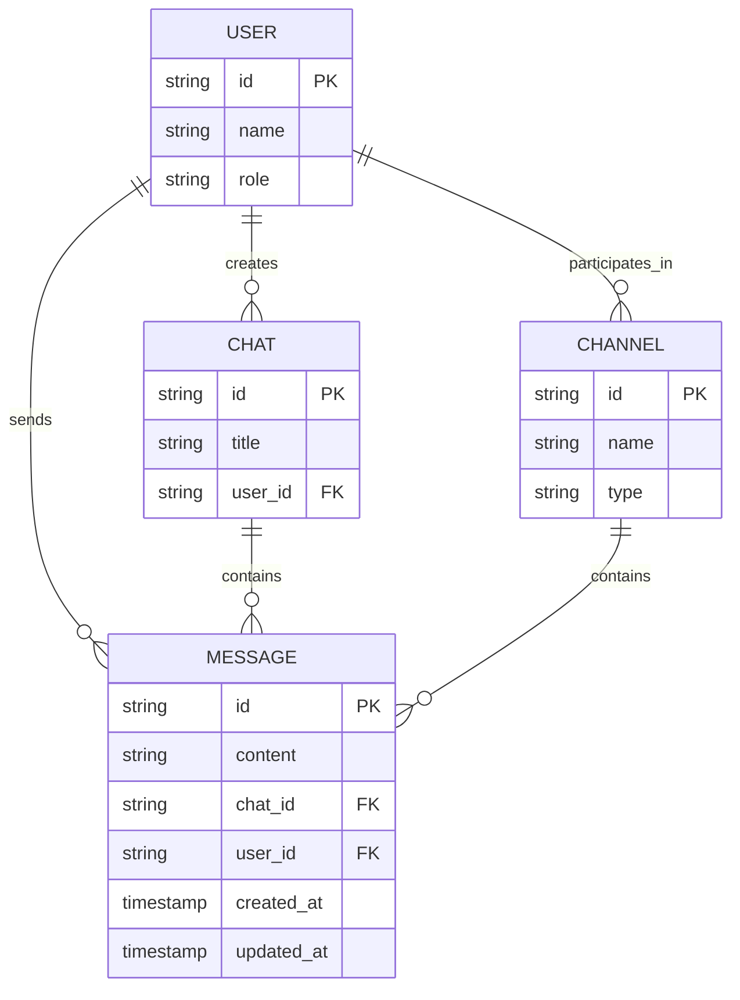

# Event Types and Payload Structures

<cite>
**Referenced Files in This Document**   
- [main.py](file://backend/open_webui/socket/main.py)
- [utils.py](file://backend/open_webui/socket/utils.py)
- [+layout.svelte](file://src/routes/+layout.svelte)
- [Channel.svelte](file://src/lib/components/channel/Channel.svelte)
- [Chat.svelte](file://src/lib/components/chat/Chat.svelte)
</cite>

## Table of Contents
1. [Introduction](#introduction)
2. [WebSocket Event Types Overview](#websocket-event-types-overview)
3. [Event Type: user-join](#event-type-user-join)
4. [Event Type: events](#event-type-events)
5. [Event Type: events:channel](#event-type-eventscategory)
6. [Event Naming Conventions and Namespace Usage](#event-naming-conventions-and-namespace-usage)
7. [Payload Structure Details](#payload-structure-details)
8. [Backend Implementation](#backend-implementation)
9. [Frontend Event Handling](#frontend-event-handling)
10. [Conclusion](#conclusion)

## Introduction
This document provides comprehensive documentation for the WebSocket event types used in open-webui, focusing on the 'user-join', 'events', and 'events:channel' events. These events form the core of the application's real-time communication system, enabling features such as chat participation, channel membership, and state synchronization. The document details the payload structure for each event, explains the semantic meaning of each field in the context of user interactions, and provides insights into the backend implementation and frontend handling of these events.

**Section sources**
- [main.py](file://backend/open_webui/socket/main.py#L1-L839)

## WebSocket Event Types Overview
The open-webui application implements a WebSocket-based real-time communication system using Socket.IO to facilitate various collaborative features. The system is designed around three primary event types: 'user-join', 'events', and 'events:channel'. These events serve distinct purposes within the application's architecture, enabling real-time updates, user presence tracking, and collaborative editing capabilities.

The WebSocket implementation is configured to support both WebSocket and polling transports, with Redis optionally used as a message broker for distributed deployments. The events are structured to support the application's collaborative features, including chat messaging, document editing, and user presence indicators. Each event type follows specific naming conventions and is associated with particular rooms or namespaces to ensure proper message routing and delivery.

**Section sources**
- [main.py](file://backend/open_webui/socket/main.py#L64-L103)
- [main.py](file://backend/open_webui/socket/main.py#L107-L158)

## Event Type: user-join
The 'user-join' event is triggered when a user establishes a WebSocket connection and authenticates with the server. This event serves as the entry point for user session management and initializes the user's presence in the application. When a client emits the 'user-join' event with a valid authentication token, the server validates the token, retrieves the user information, and establishes the user's session in the SESSION_POOL.

The event handler processes the authentication token, decodes it to extract user information, and verifies the user's existence in the system. Upon successful validation, the server adds the user's session to the SESSION_POOL dictionary, which maintains active user sessions. The server then automatically subscribes the user's session to their personal room (user:{user_id}) and all channel rooms associated with the user. This ensures that the user receives real-time updates for their personal notifications and all channels they participate in.

**Diagram sources**
- [main.py](file://backend/open_webui/socket/main.py#L318-L351)

**Section sources**
- [main.py](file://backend/open_webui/socket/main.py#L318-L351)
- [+layout.svelte](file://src/routes/+layout.svelte#L150-L154)

## Event Type: events
The 'events' event serves as a general-purpose communication channel for chat-related updates and system notifications. This event is used to transmit various types of data between the server and clients, including message completions, status updates, and chat metadata changes. The event is typically emitted to a specific user's room (user:{user_id}) to ensure that notifications are delivered to the appropriate recipient.

The payload structure for the 'events' event includes a chat_id, message_id, and a data object that contains the actual event content. The data object has a 'type' field that specifies the nature of the event, such as 'status', 'message', 'replace', 'embeds', 'files', 'source', or 'citation'. Depending on the event type, the server may also update the corresponding database records, such as adding message status to a chat or updating message content.

**Diagram sources**
- [main.py](file://backend/open_webui/socket/main.py#L695-L812)

**Section sources**
- [main.py](file://backend/open_webui/socket/main.py#L695-L812)
- [Chat.svelte](file://src/lib/components/chat/Chat.svelte#L550-L551)
- [+layout.svelte](file://src/routes/+layout.svelte#L687-L688)

## Event Type: events:channel
The 'events:channel' event is specifically designed for real-time communication within chat channels. This event type enables collaborative features such as typing indicators, message updates, and presence notifications. When a user performs an action within a channel, such as typing a message or updating their read status, the client emits an 'events:channel' event to the server, which then broadcasts the event to all other participants in the channel.

The event handler first validates that the session is a participant in the specified channel room. If the validation passes, the handler processes the event data based on its type. For 'typing' events, the server broadcasts the typing indicator to all other channel participants, allowing them to see when someone is composing a message. For 'last_read_at' events, the server updates the user's last read timestamp in the database, which is used to track message read status.

**Diagram sources**
- [main.py](file://backend/open_webui/socket/main.py#L413-L447)
- [Channel.svelte](file://src/lib/components/channel/Channel.svelte#L224-L233)

**Section sources**
- [main.py](file://backend/open_webui/socket/main.py#L413-L447)
- [Channel.svelte](file://src/lib/components/channel/Channel.svelte#L114-L181)
- [+layout.svelte](file://src/routes/+layout.svelte#L688-L688)

## Event Naming Conventions and Namespace Usage
The open-webui application follows a consistent naming convention for WebSocket events, using a combination of descriptive names and optional namespaces to organize event types. The naming convention typically follows the pattern of "event_name" or "namespace:event_name", where the namespace provides additional context about the event's purpose or scope.

The application uses several naming patterns:
- Simple event names like 'user-join' and 'heartbeat' for basic connection and presence events
- Namespaced events like 'events:channel' for events related to specific features or contexts
- Yjs collaboration events like 'ydoc:document:join' and 'ydoc:awareness:update' for real-time document editing

The application leverages Socket.IO rooms for message routing and delivery. Each user is automatically subscribed to their personal room (user:{user_id}) upon connection, allowing the server to send targeted notifications. Similarly, users are subscribed to channel rooms (channel:{channel_id}) based on their channel memberships, enabling real-time updates for specific conversations. The system also uses document-specific rooms (doc_{document_id}) for collaborative editing features, ensuring that document updates are only broadcast to users actively editing the same document.

**Section sources**
- [main.py](file://backend/open_webui/socket/main.py#L318-L351)
- [main.py](file://backend/open_webui/socket/main.py#L413-L447)
- [main.py](file://backend/open_webui/socket/main.py#L448-L662)

## Payload Structure Details
The WebSocket events in open-webui follow a consistent payload structure pattern, with variations based on the specific event type. The payload structure is designed to provide sufficient context for the client to process the event appropriately while minimizing data transfer overhead.

For the 'user-join' event, the payload includes an 'auth' object containing a JWT token for user authentication. The server response includes the user's ID and name, which are used by the client to establish the user's session.

The 'events' event uses a structured payload with the following fields:
- chat_id: String identifier for the chat session
- message_id: String identifier for the specific message
- data: Object containing the event content with:
  - type: String indicating the event type (e.g., 'status', 'message', 'replace')
  - data: Object with event-specific data (e.g., message content, status information)

The 'events:channel' event payload includes:
- channel_id: String identifier for the channel
- message_id: Optional string identifier for a specific message (null for general channel events)
- data: Object with:
  - type: String indicating the event type (e.g., 'typing', 'last_read_at')
  - data: Object with event-specific data (e.g., typing status)
- user: Object containing user information (id, name) for presence indicators

**Diagram sources**
- [main.py](file://backend/open_webui/socket/main.py#L318-L351)
- [main.py](file://backend/open_webui/socket/main.py#L695-L812)
- [main.py](file://backend/open_webui/socket/main.py#L413-L447)

**Section sources**
- [main.py](file://backend/open_webui/socket/main.py#L318-L351)
- [main.py](file://backend/open_webui/socket/main.py#L695-L812)
- [main.py](file://backend/open_webui/socket/main.py#L413-L447)

## Backend Implementation
The backend implementation of the WebSocket events is centered around the Socket.IO server instance configured in the main.py file. The server is initialized with specific options for CORS, transport methods, and connection timeouts. When Redis is configured as the WebSocket manager, the server uses AsyncRedisManager for distributed message brokering, enabling horizontal scaling of the application.

The event handlers are implemented as asynchronous functions decorated with @sio.on() or @sio.event decorators. Each handler follows a consistent pattern of authentication validation, data processing, and response generation. The implementation uses Redis-backed data structures (RedisDict and RedisLock) to maintain shared state across multiple server instances when Redis is enabled.

Key implementation details include:
- Session management through the SESSION_POOL dictionary, which stores user session data
- Room-based message routing using Socket.IO's built-in room functionality
- Periodic cleanup of inactive connections and usage tracking
- Integration with the application's database models for persistent data storage
- Error handling and logging for debugging and monitoring

The get_event_emitter() function provides a factory pattern for creating event emitters with pre-configured parameters, simplifying the process of emitting events from different parts of the application. This function returns a closure that encapsulates the user_id, chat_id, and message_id, allowing other components to emit events without needing to manage the connection details.

**Section sources**
- [main.py](file://backend/open_webui/socket/main.py#L1-L839)
- [utils.py](file://backend/open_webui/socket/utils.py#L1-L224)

## Frontend Event Handling
The frontend implementation of WebSocket events is primarily handled in the +layout.svelte file, which establishes the Socket.IO connection and sets up event listeners. The connection is configured with the appropriate URL, transport methods, and authentication token. When the connection is established, the client emits the 'user-join' event to authenticate and initialize the user's session.

Event handlers are registered for the 'events' and 'events:channel' events, with different components responsible for processing specific event types. The chatEventHandler processes chat-related events, displaying notifications when the user is not focused on the chat or updating the chat interface when the user is actively participating. The channelEventHandler processes channel-specific events, such as typing indicators and message updates, providing real-time feedback to users.

The frontend implementation includes several key features:
- Automatic connection management with reconnection logic
- Event listener registration and cleanup in component lifecycle hooks
- User interface updates based on received events
- Error handling and logging for debugging
- Integration with Svelte stores for state management

Components like Channel.svelte and Chat.svelte register their own event listeners when mounted and clean them up when destroyed, preventing memory leaks and ensuring proper event handling. The implementation uses Svelte's reactivity system to automatically update the user interface when event data changes.

**Section sources**
- [+layout.svelte](file://src/routes/+layout.svelte#L97-L155)
- [Channel.svelte](file://src/lib/components/channel/Channel.svelte#L245-L266)
- [Chat.svelte](file://src/lib/components/chat/Chat.svelte#L550-L642)

## Conclusion
The WebSocket event system in open-webui provides a robust foundation for real-time communication and collaboration features. The three primary event types—'user-join', 'events', and 'events:channel'—serve distinct purposes in the application's architecture, enabling user presence tracking, chat notifications, and collaborative editing capabilities.

The event system is designed with scalability in mind, supporting both single-instance deployments and distributed architectures through Redis integration. The consistent naming conventions and payload structures make the system easy to understand and extend, while the separation of concerns between backend event handling and frontend event processing ensures maintainability.

Key strengths of the implementation include:
- Comprehensive user session management
- Efficient message routing through Socket.IO rooms
- Flexible event payload structure supporting various use cases
- Robust error handling and logging
- Clean separation between connection management and event processing

The system effectively supports the application's collaborative features, providing a seamless real-time experience for users while maintaining code clarity and extensibility.