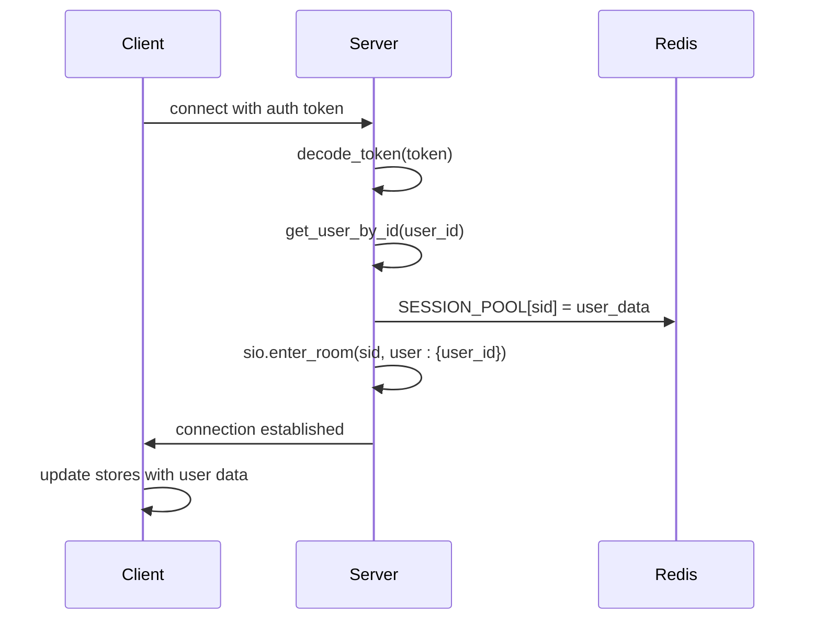
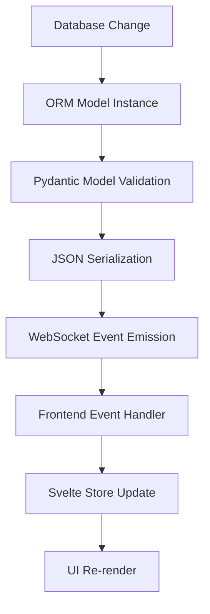
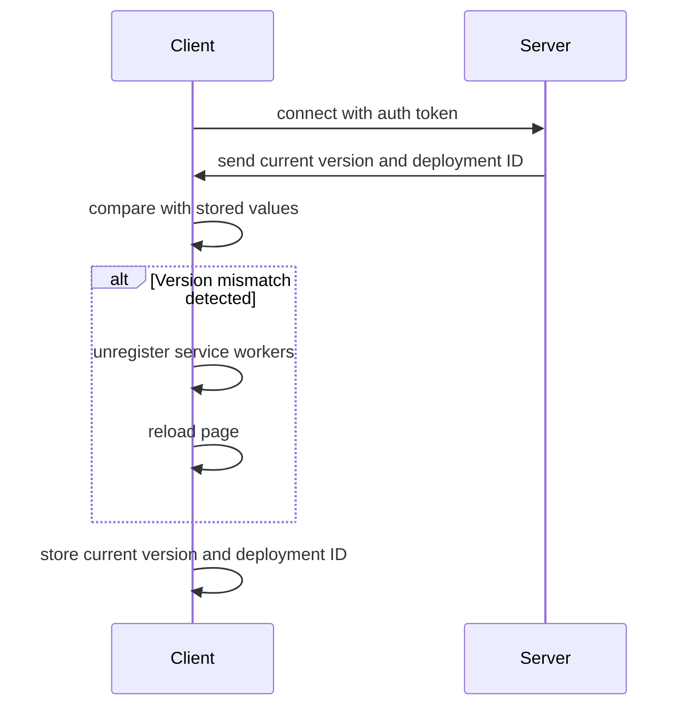
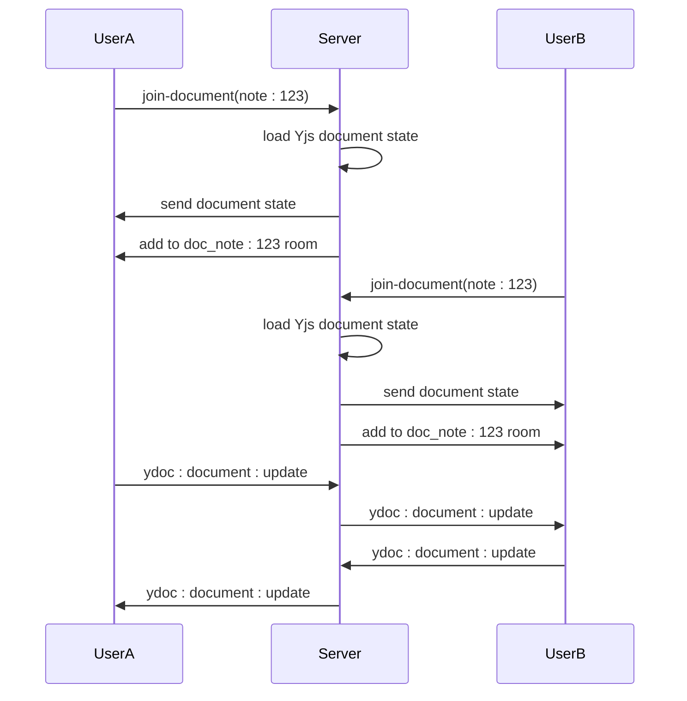
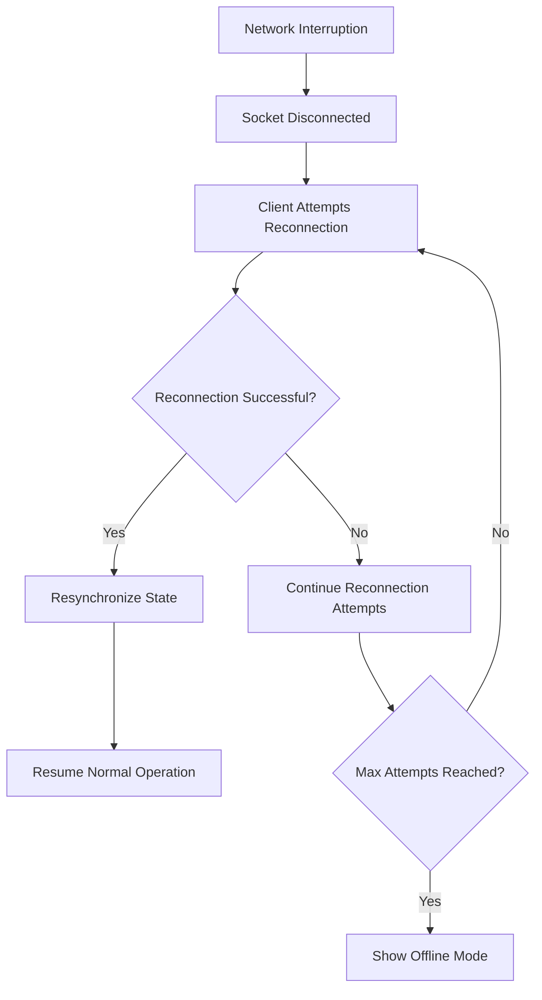

# Client-Server State Synchronization

<cite>
**Referenced Files in This Document**   
- [index.ts](file://src/lib/stores/index.ts)
- [main.py](file://backend/open_webui/socket/main.py)
- [utils.py](file://backend/open_webui/socket/utils.py)
- [+layout.svelte](file://src/routes/+layout.svelte)
- [chats.py](file://backend/open_webui/models/chats.py)
- [chats.py](file://backend/open_webui/routers/chats.py)
- [UserStatusModal.svelte](file://src/lib/components/layout/Sidebar/UserStatusModal.svelte)
</cite>

## Table of Contents
1. [Introduction](#introduction)
2. [WebSocket Integration with Svelte Stores](#websocket-integration-with-svelte-stores)
3. [Data Flow from Database to Frontend](#data-flow-from-database-to-frontend)
4. [Version Checking and Client Refresh Mechanism](#version-checking-and-client-refresh-mechanism)
5. [User-Specific State Synchronization](#user-specific-state-synchronization)
6. [Real-time Collaboration with Yjs](#real-time-collaboration-with-yjs)
7. [Network Resilience and Reconnection](#network-resilience-and-reconnection)
8. [Conclusion](#conclusion)

## Introduction
The open-webui application implements a sophisticated client-server state synchronization mechanism that ensures consistent application state across multiple clients. This system leverages WebSocket communication, Svelte stores, and Yjs for real-time collaboration, creating a seamless user experience. The architecture is designed to maintain data consistency, handle user-specific state, and provide real-time updates across all connected clients while ensuring data isolation between users.

**Section sources**
- [index.ts](file://src/lib/stores/index.ts#L1-L302)
- [main.py](file://backend/open_webui/socket/main.py#L1-L839)

## WebSocket Integration with Svelte Stores

The client-server state synchronization in open-webui is primarily facilitated through WebSocket connections that integrate directly with Svelte stores. The system uses Socket.IO for WebSocket communication, establishing a persistent connection between the client and server that enables real-time bidirectional data flow.

On the frontend, Svelte stores are used to manage application state reactively. The stores are initialized with writable values that can be subscribed to by components, ensuring that any changes to the store state automatically trigger UI updates. Key stores include:

- `socket`: Manages the WebSocket connection state
- `user`: Stores the current user's session data
- `chats`: Maintains the list of chat sessions
- `models`: Contains available AI models
- `settings`: Stores user preferences

When a user authenticates, the client establishes a WebSocket connection and emits a "user-join" event with the authentication token. The server validates the token and adds the user's session to the SESSION_POOL, a Redis-backed dictionary that tracks active user sessions. This allows the server to maintain a mapping between WebSocket session IDs and authenticated users.



**Diagram sources**
- [main.py](file://backend/open_webui/socket/main.py#L303-L351)
- [index.ts](file://src/lib/stores/index.ts#L28-L31)

**Section sources**
- [main.py](file://backend/open_webui/socket/main.py#L303-L351)
- [index.ts](file://src/lib/stores/index.ts#L28-L31)

## Data Flow from Database to Frontend

The data flow from database changes to store updates follows a well-defined pattern that ensures consistency across clients. When a database change occurs, the backend processes the change and propagates it to connected clients through the WebSocket layer.

The process begins with ORM model instances being transformed into JSON payloads. For example, when a chat is created or updated, the Chat model from the SQLAlchemy ORM is converted to a Pydantic model, which is then serialized to JSON. This JSON payload is sent through the WebSocket connection to all relevant clients.

On the frontend, event handlers subscribe to specific WebSocket events and update the corresponding Svelte stores. For instance, when a new chat message is received, the "events" handler processes the message and updates the chat store:



The transformation process includes several key steps:
1. Database operations create or modify ORM entities
2. Changes are committed to the database
3. Event emitters are called to notify connected clients
4. ORM instances are converted to Pydantic models for validation
5. Pydantic models are serialized to JSON
6. JSON payloads are sent via WebSocket events
7. Frontend event handlers receive and process the JSON
8. Svelte stores are updated, triggering reactive UI updates

This flow ensures that all clients receive consistent data and that the UI remains synchronized with the backend state.

**Diagram sources**
- [chats.py](file://backend/open_webui/models/chats.py#L58-L200)
- [chats.py](file://backend/open_webui/routers/chats.py#L133-L142)

**Section sources**
- [chats.py](file://backend/open_webui/models/chats.py#L58-L200)
- [chats.py](file://backend/open_webui/routers/chats.py#L133-L142)

## Version Checking and Client Refresh Mechanism

The open-webui application implements a robust version checking system that detects deployment updates and triggers client refreshes to ensure all users are running the latest version. This mechanism prevents compatibility issues and ensures that users benefit from the latest features and bug fixes.

The version checking process occurs during the WebSocket connection setup in the `setupSocket` function. When a client connects, it requests the current version and deployment ID from the server:

```javascript
const res = await getVersion(localStorage.token);
const deploymentId = res?.deployment_id ?? null;
const version = res?.version ?? null;
```

The client then compares these values with the current values stored in the Svelte stores (`WEBUI_VERSION` and `WEBUI_DEPLOYMENT_ID`). If there is a mismatch, indicating that the server has been updated, the client unregisters service workers and reloads the page:

```javascript
if (
    ($WEBUI_VERSION !== null && version !== $WEBUI_VERSION) ||
    ($WEBUI_DEPLOYMENT_ID !== null && deploymentId !== $WEBUI_DEPLOYMENT_ID)
) {
    await unregisterServiceWorkers();
    location.href = location.href;
    return;
}
```

The service worker unregistration is critical because service workers can cache old versions of the application, preventing users from accessing the updated version. By unregistering the service worker, the client ensures that the next page load will fetch all assets from the server rather than from the cache.

This mechanism is triggered by the `beforeNavigate` hook, which intercepts navigation events and performs the version check before allowing navigation to proceed. This ensures that users are always running the most current version of the application.



**Diagram sources**
- [+layout.svelte](file://src/routes/+layout.svelte#L77-L81)
- [+layout.svelte](file://src/routes/+layout.svelte#L121-L127)

**Section sources**
- [+layout.svelte](file://src/routes/+layout.svelte#L77-L127)

## User-Specific State Synchronization

The open-webui application maintains user-specific state while ensuring data isolation between users through a combination of WebSocket rooms and access control mechanisms. Each user's state is synchronized across their own devices while remaining isolated from other users' data.

When a user connects, they are automatically added to a private room named `user:{user_id}` using Socket.IO's room functionality:

```python
await sio.enter_room(sid, f"user:{user.id}")
```

This creates a private communication channel for the user, allowing the server to send user-specific events without exposing data to other users. All user-specific updates, such as chat messages or status changes, are emitted to this room:

```python
await sio.emit(event, data, room=f"user:{user_id}")
```

For collaborative features like shared notes, the system implements fine-grained access control. When a user attempts to join a note document, the server verifies their access rights:

```python
if (
    user.role != "admin"
    and user.id != note.user_id
    and not has_access(user.id, type="read", access_control=note.access_control)
):
    log.error(f"User {user.id} does not have access to note {data['note_id']}")
    return
```

The system also tracks active users in real-time using a heartbeat mechanism. Clients send periodic "heartbeat" events to the server, which updates the user's last active timestamp:

```python
@sio.on("heartbeat")
async def heartbeat(sid, data):
    user = SESSION_POOL.get(sid)
    if user:
        Users.update_last_active_by_id(user["id"])
```

This allows the application to display presence information, such as which users are currently active, while maintaining data isolation.

```mermaid
graph TD
A[User Connects] --> B[Authenticate with Token]
B --> C[Add to user:{user_id} Room]
C --> D[Join User-Specific Rooms]
D --> E[Private Communication Channel]
E --> F[Receive User-Specific Updates]
F --> G[Update Svelte Stores]
G --> H[UI Reflects User State]
```

**Diagram sources**
- [main.py](file://backend/open_webui/socket/main.py#L315-L316)
- [main.py](file://backend/open_webui/socket/main.py#L358-L359)

**Section sources**
- [main.py](file://backend/open_webui/socket/main.py#L315-L359)

## Real-time Collaboration with Yjs

The open-webui application implements real-time collaborative editing using Yjs, a CRDT-based framework that enables conflict-free synchronization of shared documents. This system allows multiple users to edit the same document simultaneously while maintaining data consistency across all clients.

The Yjs integration is managed by the YdocManager class, which handles document state synchronization using Redis as a persistence layer. When a user joins a document, the server creates or retrieves the Yjs document state:

```python
ydoc = Y.Doc()
updates = await YDOC_MANAGER.get_updates(document_id)
for update in updates:
    ydoc.apply_update(bytes(update))
```

The complete document state is then sent to the connecting client as a state update:

```python
state_update = ydoc.get_update()
await sio.emit(
    "ydoc:document:state",
    {
        "document_id": document_id,
        "state": list(state_update),
        "sessions": active_session_ids,
    },
    room=sid,
)
```

Subsequent changes are propagated as incremental updates. When a user makes an edit, the client sends a "ydoc:document:update" event with the Yjs update:

```python
@ sio.on("ydoc:document:update")
async def yjs_document_update(sid, data):
    await YDOC_MANAGER.append_to_updates(
        document_id=document_id,
        update=data["update"],
    )
    
    # Broadcast update to all other users in the document
    await sio.emit(
        "ydoc:document:update",
        {
            "document_id": document_id,
            "user_id": user_id,
            "update": data["update"],
            "socket_id": sid,
        },
        room=f"doc_{document_id}",
        skip_sid=sid,
    )
```

The system also supports awareness features, allowing users to see cursors and selections from other collaborators:

```python
@ sio.on("ydoc:awareness:update")
async def yjs_awareness_update(sid, data):
    await sio.emit(
        "ydoc:awareness:update",
        {"document_id": document_id, "user_id": user_id, "update": data["update"]},
        room=f"doc_{document_id}",
        skip_sid=sid,
    )
```

This implementation ensures that all clients maintain a consistent view of the document while providing real-time collaboration features.



**Diagram sources**
- [main.py](file://backend/open_webui/socket/main.py#L448-L523)
- [main.py](file://backend/open_webui/socket/main.py#L585-L629)

**Section sources**
- [main.py](file://backend/open_webui/socket/main.py#L448-L629)

## Network Resilience and Reconnection

The open-webui application implements comprehensive network resilience features to maintain state consistency during network interruptions and ensure seamless reconnection. The system is designed to handle temporary connectivity issues without data loss or state corruption.

Socket.IO provides built-in reconnection capabilities with configurable parameters:

```javascript
const _socket = io(`${WEBUI_BASE_URL}`, {
    reconnection: true,
    reconnectionDelay: 1000,
    reconnectionDelayMax: 5000,
    randomizationFactor: 0.5,
});
```

When a network interruption occurs, the client automatically attempts to reconnect with exponential backoff. During this period, the application maintains the current state in memory, allowing users to continue working. Once reconnected, the client synchronizes with the server to ensure state consistency.

The server implements a heartbeat mechanism to detect disconnected clients and clean up resources:

```python
# Send heartbeat every 30 seconds
heartbeatInterval = setInterval(() => {
    if (_socket.connected) {
        _socket.emit('heartbeat', {});
    }
}, 30000);
```

On the server side, a periodic cleanup task removes expired sessions from the usage pool:

```python
async def periodic_usage_pool_cleanup():
    while True:
        now = int(time.time())
        for model_id, connections in list(USAGE_POOL.items()):
            expired_sids = [
                sid for sid, details in connections.items()
                if now - details["updated_at"] > TIMEOUT_DURATION
            ]
            for sid in expired_sids:
                del connections[sid]
        await asyncio.sleep(TIMEOUT_DURATION)
```

The system also handles the case where a user has multiple tabs open by using a broadcast channel to coordinate which tab is active:

```javascript
const bc = new BroadcastChannel('active-tab-channel');
document.addEventListener('visibilitychange', handleVisibilityChange);

const handleVisibilityChange = () => {
    if (document.visibilityState === 'visible') {
        isLastActiveTab.set(true);
        bc.postMessage('active');
    }
};
```

This ensures that only the active tab sends heartbeats and receives real-time updates, reducing unnecessary network traffic while maintaining responsiveness.



**Diagram sources**
- [+layout.svelte](file://src/routes/+layout.svelte#L97-L176)
- [main.py](file://backend/open_webui/socket/main.py#L167-L216)

**Section sources**
- [+layout.svelte](file://src/routes/+layout.svelte#L97-L176)
- [main.py](file://backend/open_webui/socket/main.py#L167-L216)

## Conclusion
The client-server state synchronization mechanism in open-webui represents a sophisticated implementation of real-time web application architecture. By combining WebSocket communication, Svelte stores, and Yjs for collaborative editing, the system provides a seamless user experience with consistent state across multiple clients.

Key aspects of this implementation include:
- Real-time synchronization through WebSocket connections integrated with Svelte stores
- Efficient data flow from database changes to frontend updates via JSON serialization
- Automatic version checking and client refresh to ensure users run the latest version
- Robust user-specific state management with proper data isolation
- Real-time collaborative editing using Yjs CRDTs
- Comprehensive network resilience with automatic reconnection and state recovery

This architecture ensures that users experience a responsive, consistent application that maintains data integrity across network interruptions and deployment updates. The system's design prioritizes both performance and reliability, making it suitable for collaborative AI chat applications with demanding real-time requirements.