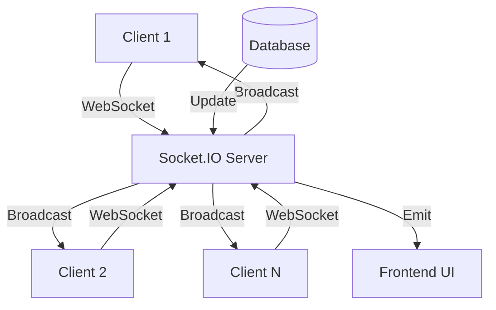
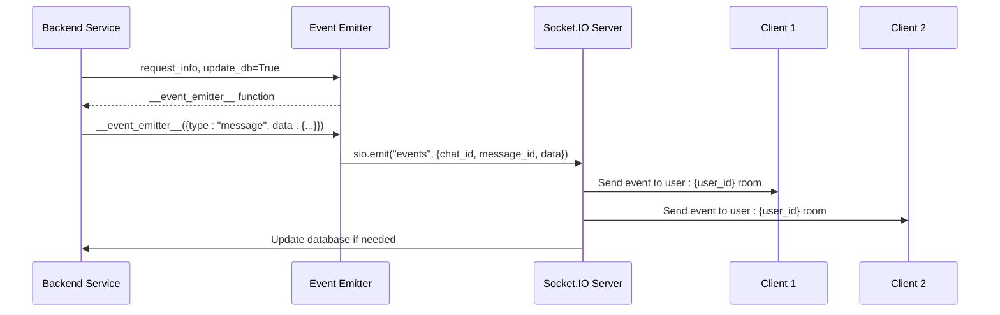
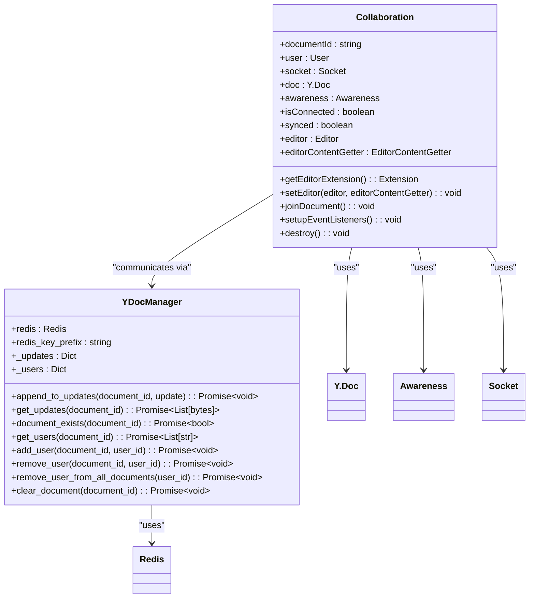
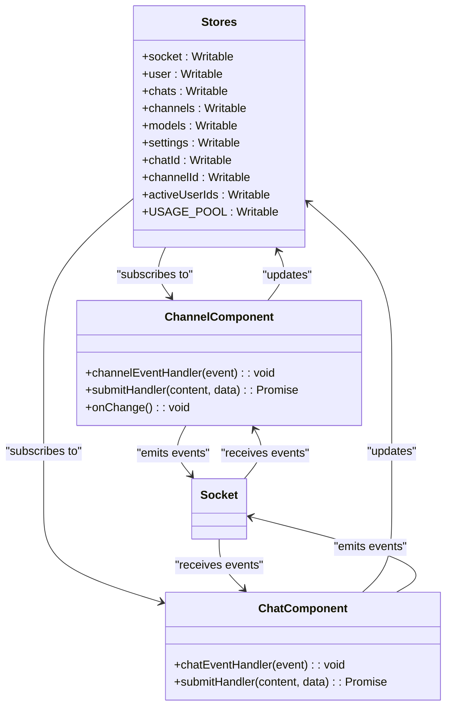
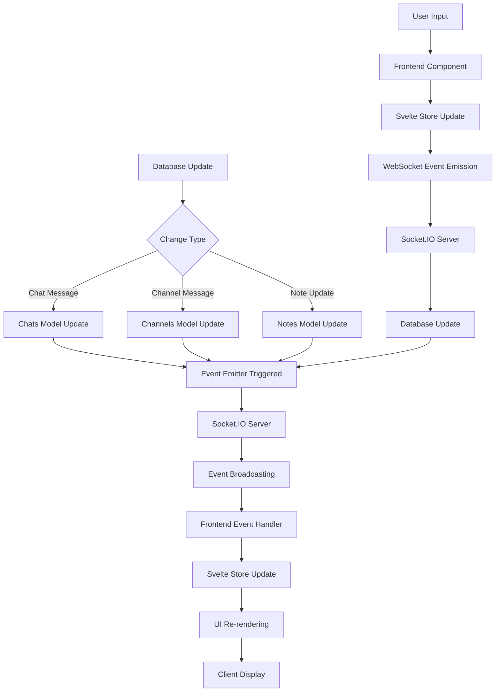
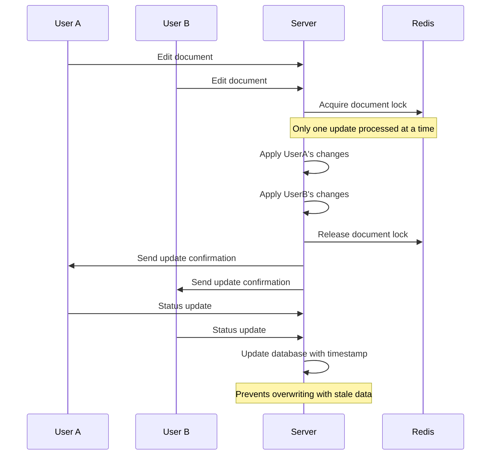
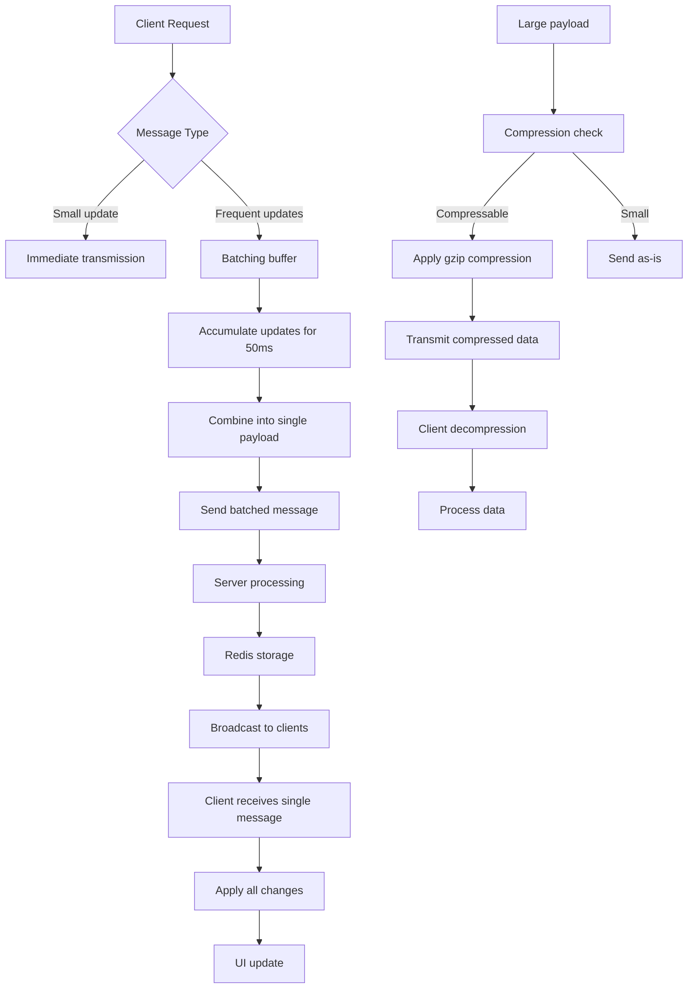
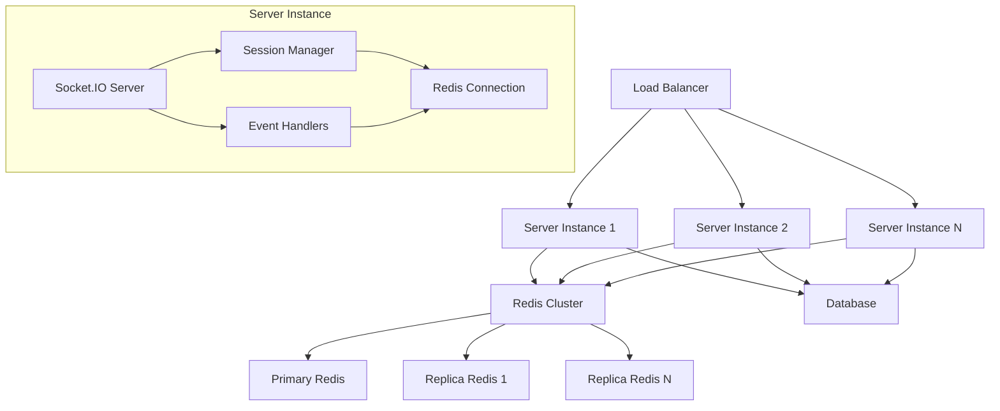

# Real-time Data Synchronization

<cite>
**Referenced Files in This Document**   
- [main.py](file://backend/open_webui/main.py)
- [socket/main.py](file://backend/open_webui/socket/main.py)
- [socket/utils.py](file://backend/open_webui/socket/utils.py)
- [index.ts](file://src/lib/stores/index.ts)
- [Collaboration.ts](file://src/lib/components/common/RichTextInput/Collaboration.ts)
- [Channel.svelte](file://src/lib/components/channel/Channel.svelte)
- [chats.py](file://backend/open_webui/models/chats.py)
- [channels.py](file://backend/open_webui/models/channels.py)
- [notes.py](file://backend/open_webui/models/notes.py)
- [+layout.svelte](file://src/routes/+layout.svelte)
</cite>

## Table of Contents
1. [Introduction](#introduction)
2. [WebSocket Communication Architecture](#websocket-communication-architecture)
3. [Event Emitter Pattern Implementation](#event-emitter-pattern-implementation)
4. [Yjs-based Collaborative Editing](#yjs-based-collaborative-editing)
5. [Svelte Store Integration](#svelte-store-integration)
6. [Data Flow from Database to UI](#data-flow-from-database-to-ui)
7. [Concurrency and Race Condition Prevention](#concurrency-and-race-condition-prevention)
8. [Performance Optimization Strategies](#performance-optimization-strategies)
9. [Connection Scaling and Management](#connection-scaling-and-management)
10. [Conclusion](#conclusion)

## Introduction
The open-webui real-time data synchronization system enables immediate updates across clients for features like chat messages, model status changes, and collaborative editing. This documentation explains the architecture and implementation of the WebSocket-based communication system that powers real-time interactions in the application. The system uses a combination of Socket.IO for WebSocket communication, Yjs for collaborative editing, and Svelte stores for state management to provide a seamless real-time experience for concurrent users.

## WebSocket Communication Architecture

The real-time data synchronization system in open-webui is built on a WebSocket-based architecture that enables bidirectional communication between the server and clients. The backend uses Socket.IO, a library that provides real-time, bidirectional, and event-based communication, to handle WebSocket connections and message broadcasting.

The WebSocket server is implemented in the `backend/open_webui/socket/main.py` file, where it initializes a Socket.IO server with appropriate configuration for CORS, transports, and connection management. The server supports both WebSocket and polling transports, with WebSocket being preferred when enabled.

**Diagram sources**
- [main.py](file://backend/open_webui/main.py#L63-L66)
- [socket/main.py](file://backend/open_webui/socket/main.py#L76-L87)

The WebSocket server handles various events for different features:

1. **Chat messages**: Events like `events:channel` are used to broadcast chat messages to all users in a channel
2. **Typing indicators**: The `typing` event type shows when users are composing messages
3. **Collaborative editing**: Yjs-based events like `ydoc:document:update` synchronize document changes
4. **User presence**: Events track user connections and disconnections

When a client connects to the WebSocket server, it authenticates using a token and joins relevant rooms based on the user's channels and documents. This room-based architecture allows efficient broadcasting of messages to specific groups of users without sending data to irrelevant clients.

**Section sources**
- [socket/main.py](file://backend/open_webui/socket/main.py#L303-L317)
- [socket/main.py](file://backend/open_webui/socket/main.py#L345-L351)

## Event Emitter Pattern Implementation

The event emitter pattern is a core component of the real-time data synchronization system in open-webui, enabling decoupled communication between different parts of the application. This pattern is implemented through the `get_event_emitter` function in the WebSocket server, which creates callback functions that can emit events to specific users or rooms.

**Diagram sources**
- [socket/main.py](file://backend/open_webui/socket/main.py#L695-L812)
- [+layout.svelte](file://src/routes/+layout.svelte#L411-L452)

The event emitter pattern is implemented in the `get_event_emitter` function, which returns an asynchronous callback function (`__event_emitter__`) that can be passed to various services in the application. This function takes event data as input and emits it through the Socket.IO server to the appropriate user or room.

Key aspects of the event emitter implementation:

1. **Request context**: The emitter is created with request information including user_id, chat_id, and message_id, which determines where events should be sent
2. **Database synchronization**: When `update_db=True`, the emitter updates the database with the event data, ensuring persistence
3. **Event types**: Different event types trigger different database operations:
   - `status`: Updates message status in the chat
   - `message`: Appends content to an existing message
   - `replace`: Replaces the entire message content
   - `embeds`: Adds embeddings to a message
   - `files`: Adds files to a message
   - `source`/`citation`: Adds source information to a message

The event emitter pattern enables various backend services to notify the frontend of changes without being tightly coupled to the WebSocket implementation. For example, when a chat completion is generated, the service can use the event emitter to send streaming responses to the client in real-time.

**Section sources**
- [socket/main.py](file://backend/open_webui/socket/main.py#L695-L812)
- [main.py](file://backend/open_webui/main.py#L67)
- [+layout.svelte](file://src/routes/+layout.svelte#L411-L452)

## Yjs-based Collaborative Editing

The collaborative editing functionality in open-webui is powered by Yjs, a shared data type that enables real-time collaboration. Yjs provides conflict-free replicated data types (CRDTs) that automatically resolve conflicts when multiple users edit the same document simultaneously.

**Diagram sources**
- [Collaboration.ts](file://src/lib/components/common/RichTextInput/Collaboration.ts#L57-L256)
- [socket/utils.py](file://backend/open_webui/socket/utils.py#L120-L224)
- [socket/main.py](file://backend/open_webui/socket/main.py#L161-L164)

The collaborative editing system works as follows:

1. **Document joining**: When a user opens a document (such as a note), the frontend calls `ydoc:document:join` with the document ID, user ID, name, and color. This adds the user to the document's awareness and joins the Socket.IO room for that document.

2. **State synchronization**: The server responds with the current document state via `ydoc:document:state`, which includes the Yjs document state as an update and the list of active sessions. The client applies this state to its local Yjs document.

3. **Change propagation**: When a user makes changes to the document, the Yjs library generates an update, which is sent to the server via `ydoc:document:update`. The server stores this update and broadcasts it to all other users in the document room.

4. **Awareness updates**: Cursor positions, selections, and other presence information are shared via `ydoc:awareness:update` events, allowing users to see where others are editing.

5. **Document persistence**: Changes are debounced and saved to the database after a short delay (500ms) to prevent excessive database writes during active editing.

The Yjs-based system automatically handles conflict resolution, ensuring that concurrent edits by multiple users are merged correctly without data loss. The operational transformation algorithm used by Yjs guarantees that all clients eventually converge to the same state, regardless of the order in which updates are received.

**Section sources**
- [Collaboration.ts](file://src/lib/components/common/RichTextInput/Collaboration.ts#L87-L256)
- [socket/main.py](file://backend/open_webui/socket/main.py#L448-L662)
- [socket/utils.py](file://backend/open_webui/socket/utils.py#L120-L224)

## Svelte Store Integration

The frontend state management in open-webui is implemented using Svelte stores, which provide a reactive system for managing application state and synchronizing it with the UI. The stores are defined in `src/lib/stores/index.ts` and are used throughout the application to maintain a consistent state across components.

**Diagram sources**
- [index.ts](file://src/lib/stores/index.ts#L1-L302)
- [Channel.svelte](file://src/lib/components/channel/Channel.svelte#L57-L246)
- [+layout.svelte](file://src/routes/+layout.svelte#L683-L697)

The integration between the WebSocket layer and Svelte stores works as follows:

1. **Socket store**: The `socket` store holds the Socket.IO connection instance and is initialized when the user authenticates. Components can subscribe to this store to access the socket connection.

2. **Event listeners**: When the user store is updated (user logs in), event listeners are attached to the socket to handle incoming events. For example, the `events:channel` event is handled by the `channelEventHandler` function.

3. **State updates**: When events are received from the WebSocket, the corresponding store values are updated. For example, when a new chat message is received, the `messages` array in the channel component is updated, which automatically triggers a UI re-render.

4. **Reactive updates**: Svelte's reactivity system ensures that any component subscribing to a store will automatically update when the store value changes, providing a seamless real-time experience.

5. **Two-way binding**: The system supports two-way data flow - UI interactions update stores, which emit WebSocket events, and incoming WebSocket events update stores, which update the UI.

The stores also manage application state that persists across sessions, such as user preferences, theme settings, and UI state (e.g., sidebar visibility). This state is synchronized between the frontend and backend through WebSocket events and API calls.

**Section sources**
- [index.ts](file://src/lib/stores/index.ts#L1-L302)
- [Channel.svelte](file://src/lib/components/channel/Channel.svelte#L57-L246)
- [+layout.svelte](file://src/routes/+layout.svelte#L683-L697)

## Data Flow from Database to UI

The data flow in open-webui's real-time synchronization system follows a well-defined path from the backend database through the WebSocket server to the frontend UI. This flow ensures that data changes are propagated to all relevant clients in real-time while maintaining data consistency.

**Diagram sources**
- [chats.py](file://backend/open_webui/models/chats.py#L167-L190)
- [channels.py](file://backend/open_webui/models/channels.py#L126-L157)
- [notes.py](file://backend/open_webui/models/notes.py#L126-L157)
- [socket/main.py](file://backend/open_webui/socket/main.py#L695-L812)
- [Channel.svelte](file://src/lib/components/channel/Channel.svelte#L115-L246)

The data flow can be broken down into the following steps:

1. **Database update**: When a user submits a message or makes an edit, the data is first stored in the database through the appropriate model (Chats, Channels, or Notes).

2. **Event emission**: After the database update, an event emitter is triggered with the relevant data. This emitter is created with context about the user, chat, and message.

3. **WebSocket broadcasting**: The event emitter sends the event through the Socket.IO server to the appropriate room (e.g., `user:{user_id}` or `channel:{channel_id}`).

4. **Frontend reception**: The frontend receives the event through an event handler (e.g., `channelEventHandler`) that is listening for specific event types.

5. **Store update**: The event handler updates the relevant Svelte store with the new data, which automatically triggers reactive updates in subscribed components.

6. **UI rendering**: The updated store values cause the UI components to re-render with the new data, displaying the changes to the user.

For streaming responses (such as chat completions), the flow is slightly different:

1. The backend processes the request and generates a stream of responses
2. Each chunk of the response is sent through the event emitter
3. The frontend receives each chunk and updates the message content incrementally
4. The UI displays the response as it streams in, creating a typing effect

This architecture ensures that all clients receive updates in real-time, providing a consistent view of the data across all connected devices.

**Section sources**
- [chats.py](file://backend/open_webui/models/chats.py#L167-L190)
- [channels.py](file://backend/open_webui/models/channels.py#L126-L157)
- [notes.py](file://backend/open_webui/models/notes.py#L126-L157)
- [socket/main.py](file://backend/open_webui/socket/main.py#L695-L812)
- [Channel.svelte](file://src/lib/components/channel/Channel.svelte#L115-L246)

## Concurrency and Race Condition Prevention

The open-webui real-time synchronization system implements several mechanisms to handle concurrency and prevent race conditions when multiple users interact with the same data simultaneously.

**Diagram sources**
- [socket/utils.py](file://backend/open_webui/socket/utils.py#L9-L47)
- [socket/main.py](file://backend/open_webui/socket/main.py#L142-L151)
- [socket/main.py](file://backend/open_webui/socket/main.py#L585-L626)

The system employs the following strategies to ensure data consistency:

1. **Yjs CRDTs**: For collaborative editing, Yjs uses conflict-free replicated data types that automatically merge concurrent edits without conflicts. This mathematical approach ensures that all clients eventually converge to the same state regardless of the order of operations.

2. **Redis locks**: For critical sections of code that modify shared state, the system uses Redis-based distributed locks. The `RedisLock` class in `socket/utils.py` implements a lock mechanism that prevents multiple processes from modifying the same data simultaneously.

3. **Debounced saving**: Document changes are saved to the database with a debounce delay of 500ms. This prevents excessive database writes during active editing and ensures that only the final state is persisted.

4. **Timestamp-based updates**: The system uses timestamps to ensure that newer updates are not overwritten by older ones. When updating messages or other entities, the system checks the last update time to prevent stale data from overwriting recent changes.

5. **Session management**: Each user session is tracked in the `SESSION_POOL` Redis dictionary, which maps session IDs to user information. This allows the system to identify which users are connected and manage their presence accurately.

6. **Room-based broadcasting**: Socket.IO rooms are used to limit the scope of message broadcasting. Users only receive updates for channels and documents they have access to, reducing the risk of unauthorized access or data leakage.

7. **Access control**: Before processing any update, the system verifies that the user has the necessary permissions to modify the target resource. This prevents unauthorized users from making changes even if they somehow gain access to the WebSocket connection.

These mechanisms work together to ensure that the system remains consistent and reliable even under high concurrency, providing a seamless collaborative experience for users.

**Section sources**
- [socket/utils.py](file://backend/open_webui/socket/utils.py#L9-L47)
- [socket/main.py](file://backend/open_webui/socket/main.py#L142-L151)
- [socket/main.py](file://backend/open_webui/socket/main.py#L585-L626)

## Performance Optimization Strategies

The open-webui real-time synchronization system implements several performance optimization strategies to handle message batching, payload optimization, and efficient data transmission.

**Diagram sources**
- [socket/main.py](file://backend/open_webui/socket/main.py#L585-L626)
- [Collaboration.ts](file://src/lib/components/common/RichTextInput/Collaboration.ts#L185-L202)
- [socket/main.py](file://backend/open_webui/socket/main.py#L600-L616)

The system employs the following performance optimization techniques:

1. **Message batching**: For high-frequency updates like typing indicators or cursor movements, the system batches multiple events into a single message to reduce network overhead. This is particularly important for collaborative editing where small changes occur frequently.

2. **Debounced operations**: Operations that don't require immediate persistence, such as document saving, are debounced to prevent excessive database writes. The 500ms debounce delay for document saves ensures that only the final state is persisted after a period of inactivity.

3. **Payload optimization**: The system minimizes payload size by:
   - Using binary formats (Uint8Array) for Yjs updates instead of JSON
   - Transmitting only changed data rather than entire objects
   - Using numeric codes for event types instead of strings when possible

4. **Efficient data structures**: The backend uses Redis for storing transient data like session pools and document updates. Redis's in-memory storage and efficient data structures (lists, sets, hashes) enable fast access and modification.

5. **Connection multiplexing**: A single WebSocket connection is used for all real-time communication, reducing the overhead of establishing multiple connections. This connection carries different types of events (chat messages, typing indicators, document updates) on different channels.

6. **Selective broadcasting**: The system uses Socket.IO rooms to ensure that messages are only sent to clients that need them. Users only receive updates for channels and documents they are actively using, reducing unnecessary network traffic.

7. **Client-side caching**: The frontend stores frequently accessed data in Svelte stores, reducing the need to re-fetch data from the server. This includes user information, channel lists, and model configurations.

8. **Stream processing**: For chat completions and other streaming responses, the system processes data in chunks rather than waiting for the entire response. This provides a more responsive user experience and reduces memory usage.

These optimizations ensure that the system can handle real-time updates efficiently, even with multiple concurrent users and high-frequency interactions.

**Section sources**
- [socket/main.py](file://backend/open_webui/socket/main.py#L585-L626)
- [Collaboration.ts](file://src/lib/components/common/RichTextInput/Collaboration.ts#L185-L202)

## Connection Scaling and Management

The open-webui real-time synchronization system is designed to handle multiple concurrent users through effective connection scaling and management strategies. The architecture supports horizontal scaling and efficient resource utilization to accommodate growing user bases.

**Diagram sources**
- [socket/main.py](file://backend/open_webui/socket/main.py#L64-L75)
- [env.py](file://backend/open_webui/env.py#L618-L662)
- [socket/main.py](file://backend/open_webui/socket/main.py#L107-L116)

The connection management system includes the following components:

1. **Redis-based session management**: When `WEBSOCKET_MANAGER` is set to "redis", the system uses Redis to manage WebSocket connections across multiple server instances. This allows the application to scale horizontally by adding more server instances behind a load balancer.

2. **Sentinel support**: The system supports Redis Sentinel for high availability. The `WEBSOCKET_SENTINEL_HOSTS` and `WEBSOCKET_SENTINEL_PORT` environment variables configure the connection to a Redis Sentinel cluster, which automatically handles failover and master election.

3. **Connection pooling**: The system maintains pools of active connections:
   - `SESSION_POOL`: Tracks user sessions and their associated information
   - `USAGE_POOL`: Monitors model usage and connection status
   - Document-specific pools for collaborative editing sessions

4. **Periodic cleanup**: A background task (`periodic_usage_pool_cleanup`) runs periodically to clean up expired connections and unused resources. This prevents memory leaks and ensures efficient resource utilization.

5. **Connection lifecycle management**: The system properly handles connection events:
   - `connect`: Authenticates the user and joins appropriate rooms
   - `disconnect`: Cleans up user sessions and notifies other users
   - `reconnect`: Restores the user's state when they reconnect

6. **Scalable event broadcasting**: The Socket.IO server with Redis manager can broadcast events across all server instances, ensuring that messages reach all connected clients regardless of which server instance they are connected to.

7. **Resource monitoring**: The system tracks active user IDs and usage patterns through the `activeUserIds` and `USAGE_POOL` stores, allowing administrators to monitor system load and plan capacity accordingly.

8. **Configurable timeouts**: Various timeout settings can be configured through environment variables:
   - `WEBSOCKET_SERVER_PING_TIMEOUT`: How long to wait for a ping response
   - `WEBSOCKET_SERVER_PING_INTERVAL`: How often to send ping requests
   - `WEBSOCKET_REDIS_LOCK_TIMEOUT`: How long a Redis lock is held

These scaling and management features ensure that the system can handle large numbers of concurrent users while maintaining performance and reliability.

**Section sources**
- [socket/main.py](file://backend/open_webui/socket/main.py#L64-L75)
- [env.py](file://backend/open_webui/env.py#L618-L662)
- [socket/main.py](file://backend/open_webui/socket/main.py#L107-L116)

## Conclusion
The real-time data synchronization system in open-webui provides a robust foundation for immediate updates across clients for features like chat messages, model status changes, and collaborative editing. By leveraging WebSocket communication through Socket.IO, the system enables bidirectional, low-latency messaging between the server and clients.

The architecture combines several key components:
- **WebSocket communication** for real-time, bidirectional messaging
- **Event emitter pattern** for decoupled communication between system components
- **Yjs-based collaborative editing** for conflict-free real-time collaboration
- **Svelte stores** for reactive state management and UI synchronization
- **Efficient data flow** from database updates to frontend rendering
- **Concurrency controls** to prevent race conditions
- **Performance optimizations** for message batching and payload efficiency
- **Scalable connection management** for handling multiple concurrent users

This comprehensive system ensures that users receive synchronized updates in real-time while maintaining data consistency and system performance. The use of established libraries like Socket.IO and Yjs, combined with thoughtful architectural decisions, creates a reliable and scalable real-time experience that can handle the demands of collaborative AI interactions.