# Real-time Event System

<cite>
**Referenced Files in This Document**   
- [main.py](file://backend/open_webui/socket/main.py)
- [Channel.svelte](file://src/lib/components/channel/Channel.svelte)
- [Thread.svelte](file://src/lib/components/channel/Thread.svelte)
- [index.ts](file://src/lib/stores/index.ts)
- [utils.py](file://backend/open_webui/socket/utils.py)
- [channels.py](file://backend/open_webui/routers/channels.py)
- [Messages.svelte](file://src/lib/components/channel/Messages.svelte)
- [Collaboration.ts](file://src/lib/components/common/RichTextInput/Collaboration.ts)
- [+layout.svelte](file://src/routes/+layout.svelte)
</cite>

## Table of Contents
1. [Introduction](#introduction)
2. [Event Emitter Pattern Implementation](#event-emitter-pattern-implementation)
3. [Core Event Types and Payload Structures](#core-event-types-and-payload-structures)
4. [Event Handling Pipeline](#event-handling-pipeline)
5. [Svelte Store Integration](#svelte-store-integration)
6. [Race Condition Prevention](#race-condition-prevention)
7. [Performance Optimization Techniques](#performance-optimization-techniques)
8. [Conclusion](#conclusion)

## Introduction
The real-time event system in open-webui is a sophisticated implementation that enables instantaneous communication between the backend and frontend components. This system is built on a robust event emitter pattern that facilitates the broadcasting of critical updates such as new chat messages, model status changes, and collaborative edits. The architecture leverages Socket.IO for bidirectional communication, ensuring that all connected clients receive updates in real-time. This documentation provides a comprehensive analysis of the event system, detailing its implementation, event types, handling pipeline, and optimization strategies.

**Section sources**
- [main.py](file://backend/open_webui/socket/main.py#L1-L839)
- [Channel.svelte](file://src/lib/components/channel/Channel.svelte#L1-L246)

## Event Emitter Pattern Implementation
The event emitter pattern in open-webui is implemented through a combination of Socket.IO events and custom event handling functions. The backend uses the `sio.emit()` method to broadcast events to specific rooms or users, while the frontend listens for these events and updates the UI accordingly. The system employs a room-based architecture where users are assigned to specific rooms based on their context (e.g., user-specific rooms, channel rooms, document rooms).

The implementation includes several key functions:
- `get_event_emitter()`: Creates an event emitter function that can send messages to specific users
- `emit_to_users()`: Sends a message to specific users using their user:{id} rooms
- `enter_room_for_users()`: Makes all sessions of a user join a specific room

These functions work together to ensure that events are delivered to the appropriate recipients based on their current context and permissions.

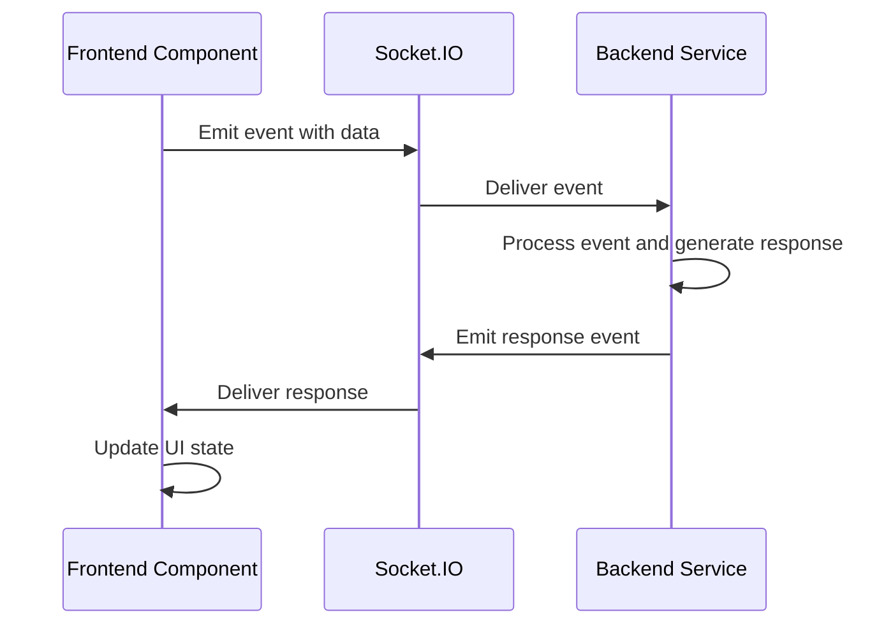

**Diagram sources**
- [main.py](file://backend/open_webui/socket/main.py#L695-L812)
- [Channel.svelte](file://src/lib/components/channel/Channel.svelte#L57-L246)

**Section sources**
- [main.py](file://backend/open_webui/socket/main.py#L256-L269)
- [Channel.svelte](file://src/lib/components/channel/Channel.svelte#L57-L77)

## Core Event Types and Payload Structures
The open-webui system defines several critical event types that facilitate real-time communication between components. Each event type has a specific payload structure that includes authentication data and user context.

### Heartbeat Events
The 'heartbeat' event is used to maintain user activity status. When a client sends a heartbeat event, the backend updates the user's last active timestamp in the database.

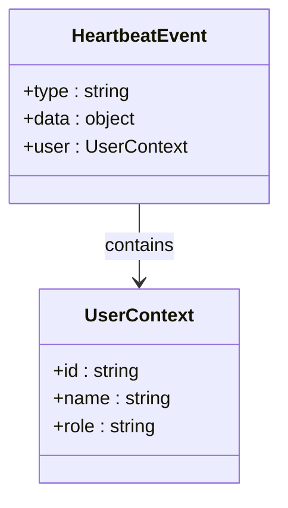

**Diagram sources**
- [main.py](file://backend/open_webui/socket/main.py#L354-L359)

### User Join Events
The 'user-join' event is triggered when a user connects to the system. This event authenticates the user and assigns them to appropriate rooms based on their channels and permissions.

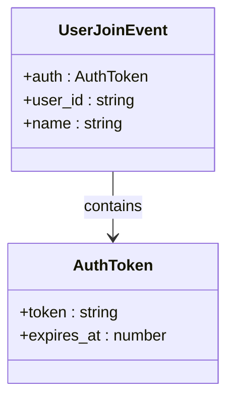

**Diagram sources**
- [main.py](file://backend/open_webui/socket/main.py#L318-L352)

### Channel Events
Channel events are used for communication within specific channels. These include message events, typing indicators, and read status updates.

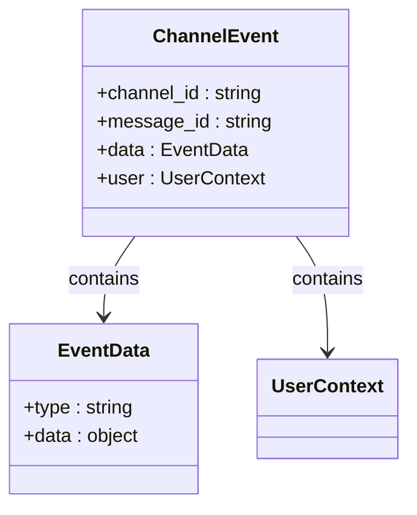

**Diagram sources**
- [main.py](file://backend/open_webui/socket/main.py#L413-L447)
- [Channel.svelte](file://src/lib/components/channel/Channel.svelte#L57-L77)

**Section sources**
- [main.py](file://backend/open_webui/socket/main.py#L354-L447)
- [Channel.svelte](file://src/lib/components/channel/Channel.svelte#L57-L77)

## Event Handling Pipeline
The event handling pipeline in open-webui follows a well-defined flow from emission in the backend to processing in frontend components. This pipeline ensures that events are properly authenticated, routed, and processed in the correct order.

### Backend Event Emission
When an event occurs in the backend (such as a new message being sent), the system creates an event object with the appropriate type and payload. This event is then emitted to the relevant room using Socket.IO's `emit()` method.

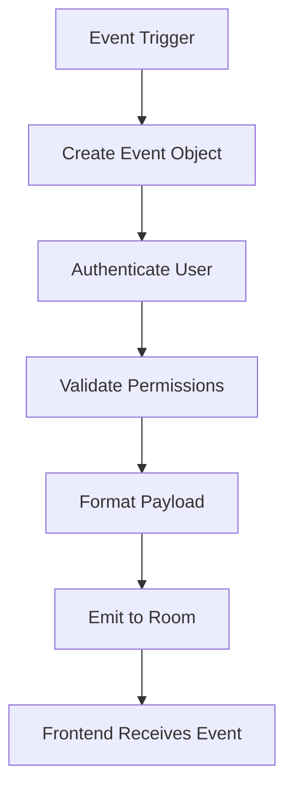

**Diagram sources**
- [main.py](file://backend/open_webui/socket/main.py#L695-L812)
- [channels.py](file://backend/open_webui/routers/channels.py#L1326-L1339)

### Frontend Event Processing
On the frontend, components listen for specific events and process them accordingly. The Channel.svelte component, for example, handles various message-related events and updates the UI state.

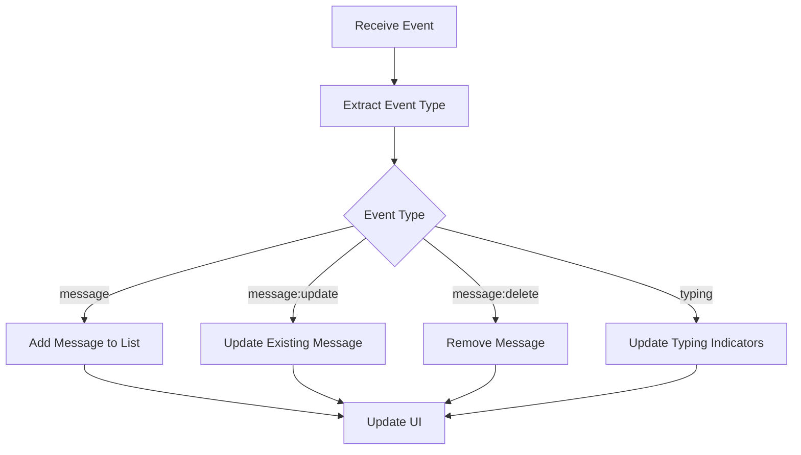

**Diagram sources**
- [Channel.svelte](file://src/lib/components/channel/Channel.svelte#L115-L174)
- [Messages.svelte](file://src/lib/components/channel/Messages.svelte#L126-L250)

**Section sources**
- [main.py](file://backend/open_webui/socket/main.py#L695-L812)
- [Channel.svelte](file://src/lib/components/channel/Channel.svelte#L115-L174)

## Svelte Store Integration
The real-time event system in open-webui is tightly integrated with Svelte stores, which serve as the central state management mechanism for the application. The stores provide a reactive way to manage application state and ensure that UI components are automatically updated when data changes.

### Store Architecture
The system uses several key stores to manage different aspects of the application state:

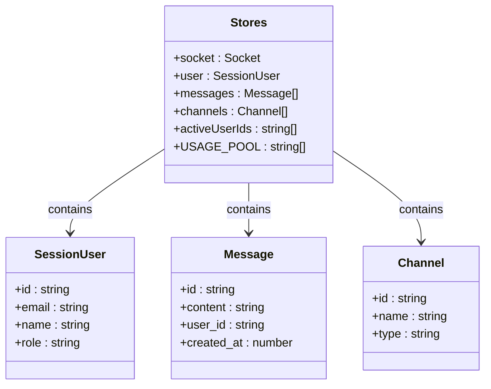

**Diagram sources**
- [index.ts](file://src/lib/stores/index.ts#L1-L302)

### Message Event Processing
When a message event is received, the system updates the relevant store, which triggers UI updates in all subscribed components. The Messages.svelte component, for example, subscribes to the messages store and automatically re-renders when new messages are added.

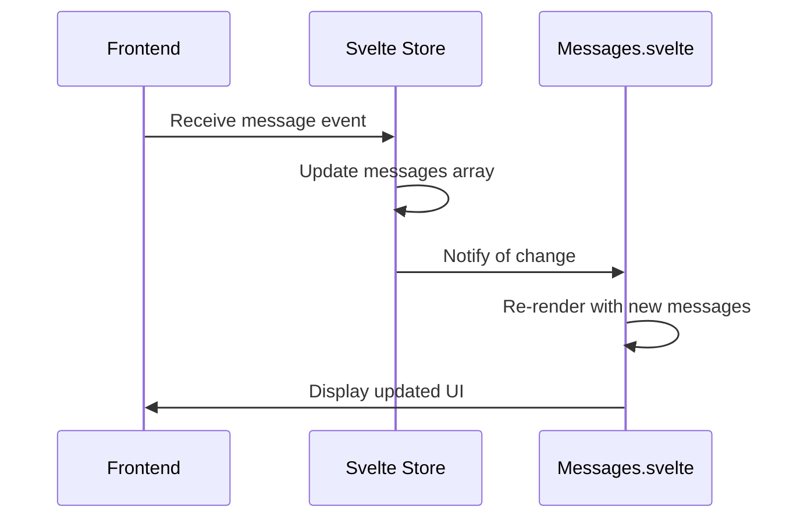

**Diagram sources**
- [Messages.svelte](file://src/lib/components/channel/Messages.svelte#L126-L250)
- [index.ts](file://src/lib/stores/index.ts#L1-L302)

**Section sources**
- [index.ts](file://src/lib/stores/index.ts#L1-L302)
- [Messages.svelte](file://src/lib/components/channel/Messages.svelte#L126-L250)

## Race Condition Prevention
The open-webui system implements several strategies to prevent race conditions and ensure proper event ordering, particularly in collaborative editing scenarios.

### Connection-Level State Tracking
The system maintains connection-level state tracking through the SESSION_POOL and USAGE_POOL dictionaries, which store information about active user sessions and resource usage.

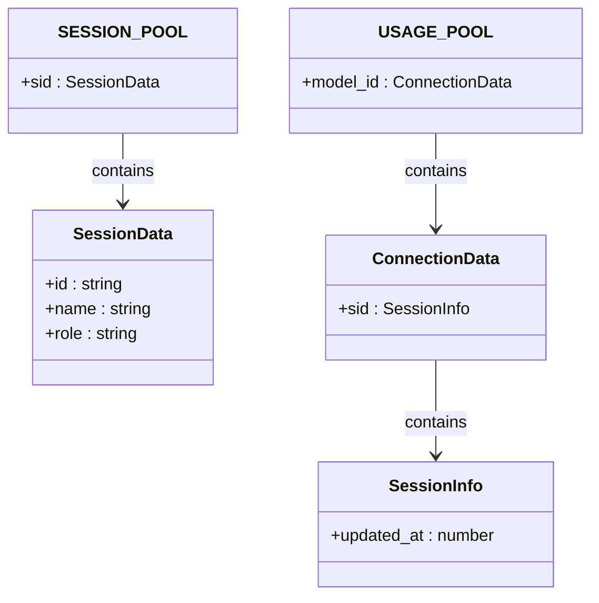

**Diagram sources**
- [main.py](file://backend/open_webui/socket/main.py#L129-L140)

### Event Ordering
The system ensures proper event ordering through the use of timestamps and sequential processing. Each message includes a created_at timestamp, and the system processes events in chronological order.

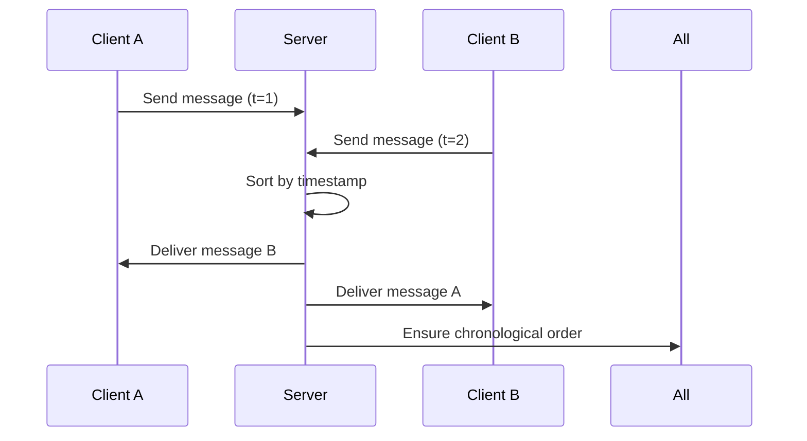

**Diagram sources**
- [main.py](file://backend/open_webui/socket/main.py#L794-L803)
- [Channel.svelte](file://src/lib/components/channel/Channel.svelte#L120-L132)

**Section sources**
- [main.py](file://backend/open_webui/socket/main.py#L129-L140)
- [Channel.svelte](file://src/lib/components/channel/Channel.svelte#L120-L132)

## Performance Optimization Techniques
The open-webui real-time event system incorporates several performance optimization techniques to ensure efficient communication and responsive user interfaces.

### Event Batching
The system implements event batching to reduce the number of individual messages sent over the network. Instead of sending multiple small updates, the system combines them into a single batched event.

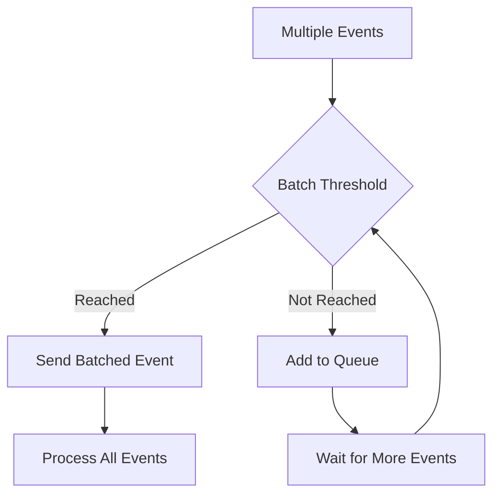

**Diagram sources**
- [main.py](file://backend/open_webui/socket/main.py#L118-L149)

### Payload Minimization
The system minimizes payload size by only including essential data in event messages. This reduces bandwidth usage and improves transmission speed.

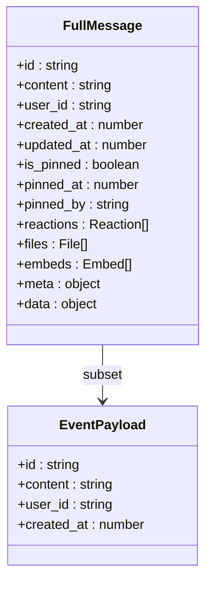

**Diagram sources**
- [main.py](file://backend/open_webui/socket/main.py#L701-L707)
- [Channel.svelte](file://src/lib/components/channel/Channel.svelte#L58-L63)

### Collaborative Editing Optimization
For collaborative editing scenarios, the system uses Yjs for operational transformation, which efficiently handles concurrent edits and minimizes network traffic.

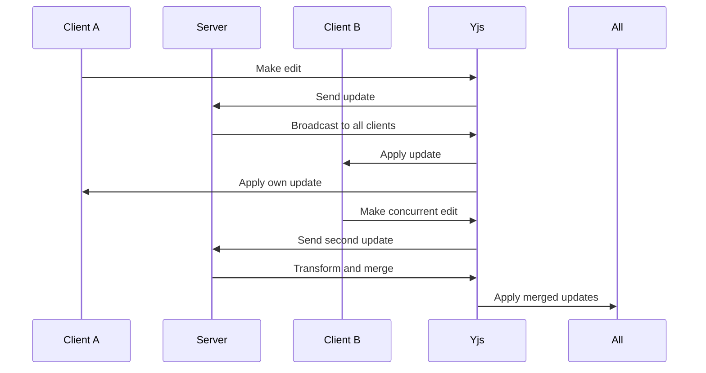

**Diagram sources**
- [Collaboration.ts](file://src/lib/components/common/RichTextInput/Collaboration.ts#L1-L294)
- [main.py](file://backend/open_webui/socket/main.py#L448-L682)

**Section sources**
- [main.py](file://backend/open_webui/socket/main.py#L118-L149)
- [Collaboration.ts](file://src/lib/components/common/RichTextInput/Collaboration.ts#L1-L294)

## Conclusion
The real-time event system in open-webui represents a sophisticated implementation of the event emitter pattern, enabling seamless communication between backend services and frontend components. Through a combination of Socket.IO for bidirectional communication, Svelte stores for state management, and careful optimization techniques, the system delivers a responsive and reliable user experience. The architecture effectively handles critical updates such as new chat messages, model status changes, and collaborative edits, while preventing race conditions and ensuring proper event ordering. The integration with Svelte stores provides a reactive foundation for UI updates, and the performance optimizations ensure efficient network usage and responsive interfaces. This comprehensive approach to real-time communication makes open-webui well-suited for collaborative AI interactions and dynamic content updates.