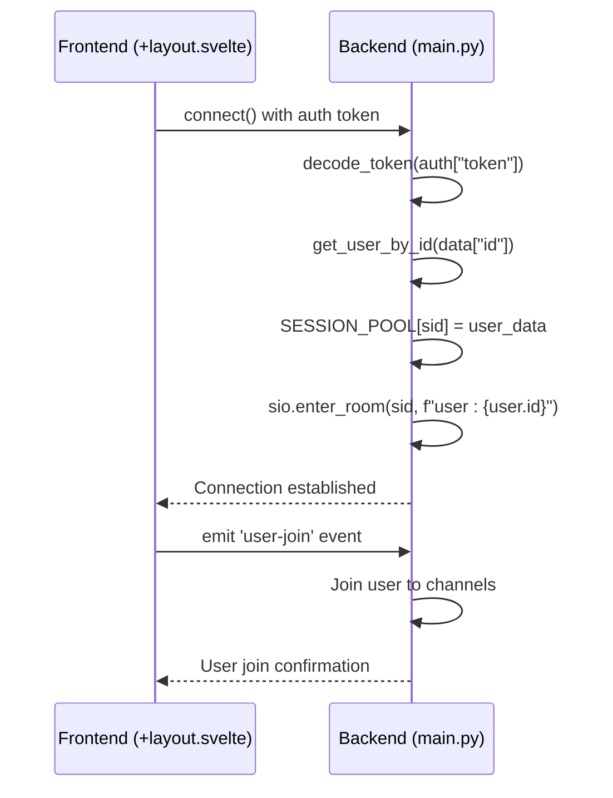
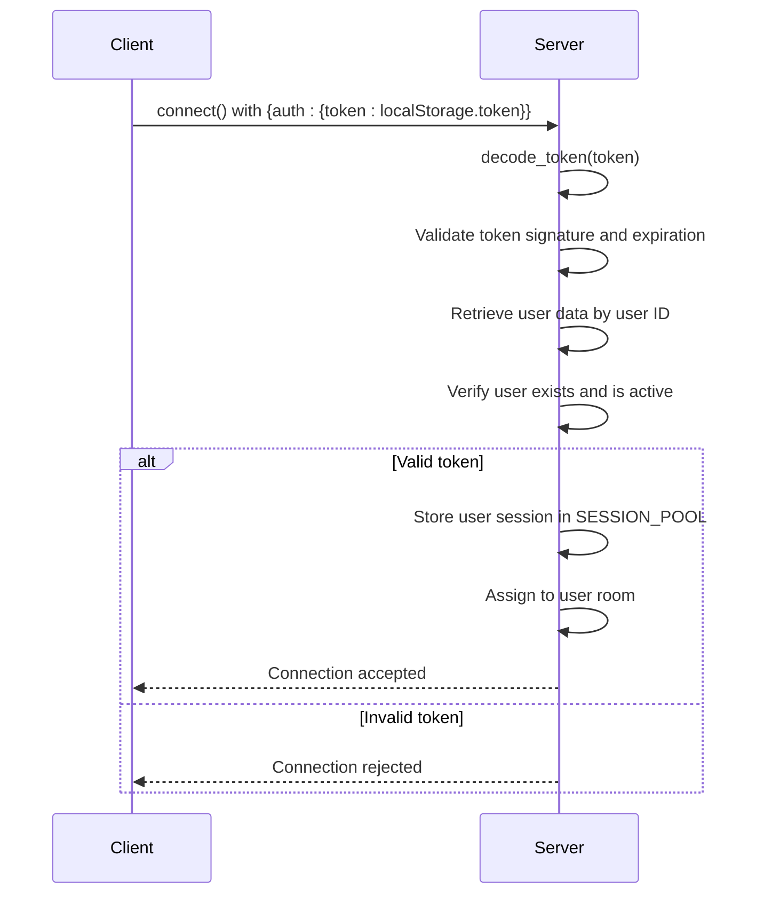
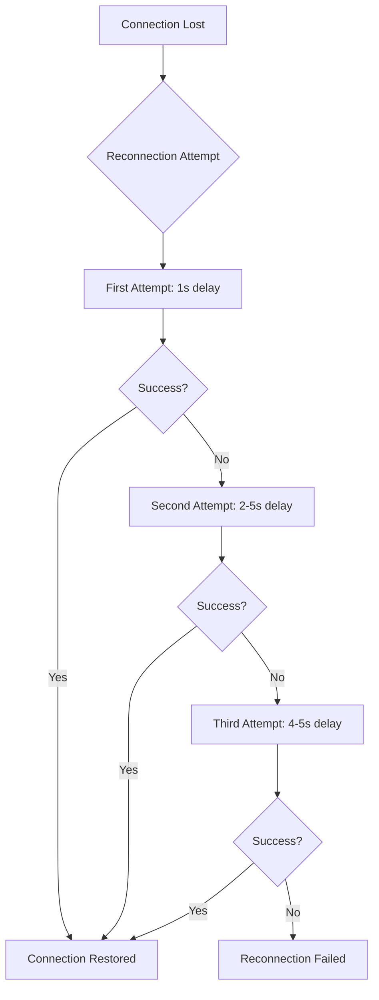
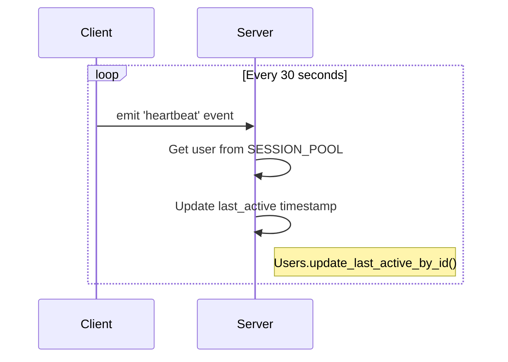
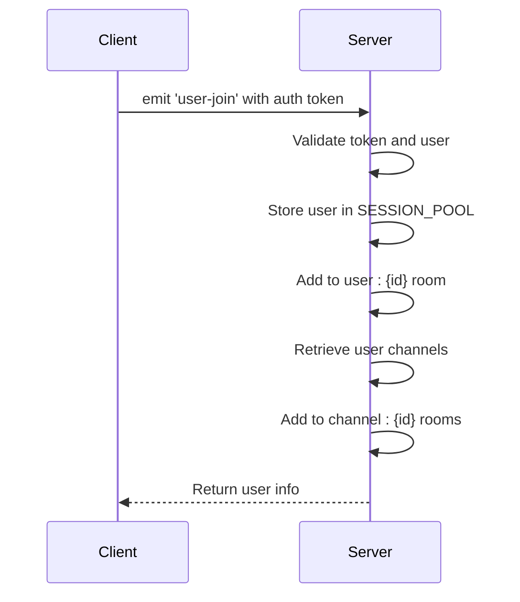
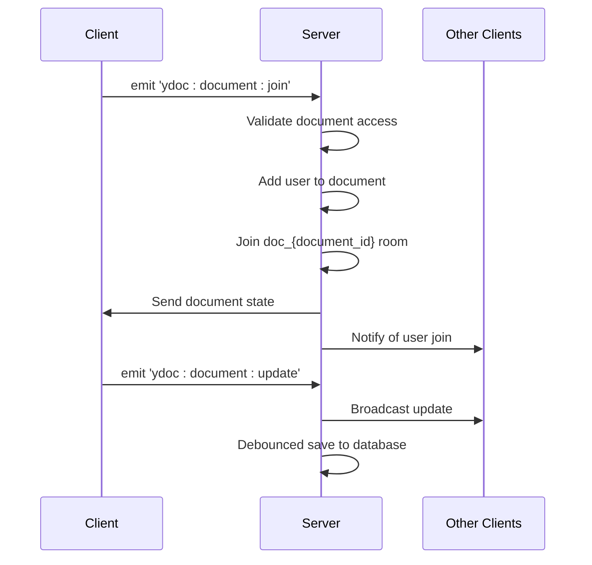
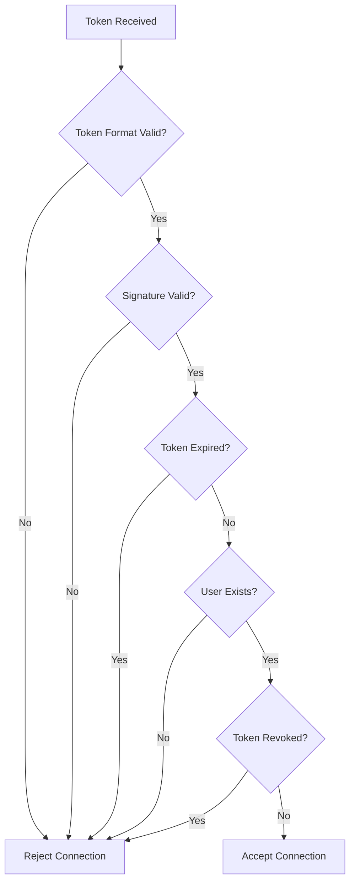
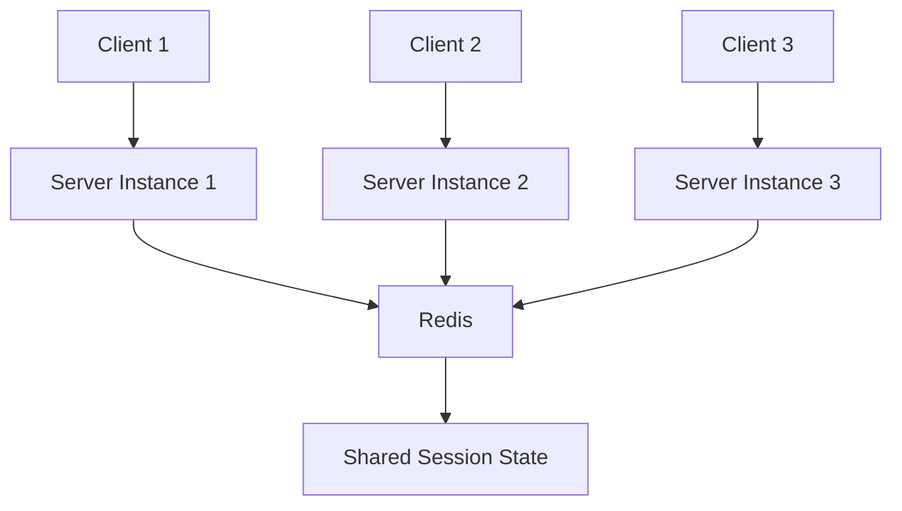

# WebSocket Connection Management

<cite>
**Referenced Files in This Document**   
- [main.py](file://backend/open_webui/socket/main.py)
- [+layout.svelte](file://src/routes/+layout.svelte)
- [auth.py](file://backend/open_webui/utils/auth.py)
- [env.py](file://backend/open_webui/env.py)
</cite>

## Table of Contents
1. [Introduction](#introduction)
2. [WebSocket Initialization Process](#websocket-initialization-process)
3. [Authentication Token Handling](#authentication-token-handling)
4. [Reconnection Strategy](#reconnection-strategy)
5. [Heartbeat Mechanism](#heartbeat-mechanism)
6. [User Join/Leave Events and Session Synchronization](#user-joinleave-events-and-session-synchronization)
7. [Security Considerations](#security-considerations)
8. [Performance Implications](#performance-implications)
9. [Conclusion](#conclusion)

## Introduction
The WebSocket connection lifecycle in open-webui provides a real-time communication channel between the frontend and backend, enabling features like live chat updates, collaborative editing, and presence detection. This document details the complete lifecycle of WebSocket connections, from initialization and authentication to reconnection strategies and heartbeat mechanisms. The implementation uses Socket.IO for bidirectional communication, with Redis for session management in distributed environments. The system is designed to maintain persistent connections while handling authentication securely and efficiently managing connection state across multiple instances.

## WebSocket Initialization Process

The WebSocket initialization process in open-webui involves both client-side setup in the frontend and server-side configuration in the backend. The connection establishment follows a structured flow that ensures proper authentication and session management.

On the client side, the initialization begins in the `+layout.svelte` file where the Socket.IO client is configured and connected. The setup process is triggered when the application loads and checks the backend configuration to determine if WebSocket support is enabled. The client establishes a connection to the server using the specified URL with the `/ws/socket.io` path.



**Diagram sources**
- [+layout.svelte](file://src/routes/+layout.svelte#L97-L155)
- [main.py](file://backend/open_webui/socket/main.py#L302-L352)

The server-side initialization in `main.py` configures the Socket.IO server with appropriate settings based on environment variables. When a connection request is received, the server checks for an authentication token in the connection data, decodes it to verify the user's identity, and stores the user session in the SESSION_POOL. The server then assigns the user to their personal room (user:{id}) and prepares them for channel participation.

**Section sources**
- [+layout.svelte](file://src/routes/+layout.svelte#L97-L155)
- [main.py](file://backend/open_webui/socket/main.py#L302-L352)

## Authentication Token Handling

Authentication in the WebSocket connection setup is handled through JWT (JSON Web Tokens) that are passed during the connection initialization and user join events. The token handling process ensures that only authenticated users can establish WebSocket connections and participate in real-time communication.

The authentication flow begins on the client side where the token is retrieved from localStorage and included in the connection configuration:



**Diagram sources**
- [+layout.svelte](file://src/routes/+layout.svelte#L105)
- [main.py](file://backend/open_webui/socket/main.py#L305-L315)
- [auth.py](file://backend/open_webui/utils/auth.py#L208-L213)

The token validation process uses the `decode_token` function from the auth utility, which verifies the JWT signature using the WEBUI_SECRET_KEY and checks that the token contains a valid user ID. If the token is valid, the user's information is retrieved from the database and stored in the session pool with selected fields excluded for privacy and performance reasons.

The system also supports token validation through Redis, where revoked tokens are tracked to prevent unauthorized access even if a token is technically valid. This adds an additional layer of security by allowing immediate token invalidation when needed.

**Section sources**
- [main.py](file://backend/open_webui/socket/main.py#L305-L315)
- [auth.py](file://backend/open_webui/utils/auth.py#L208-L213)

## Reconnection Strategy

The WebSocket reconnection strategy in open-webui is designed to provide a resilient connection that can recover from network interruptions and server restarts. Both the client and server implement mechanisms to handle disconnections and attempt reconnection with appropriate backoff parameters.

On the client side, the Socket.IO library is configured with automatic reconnection settings that include exponential backoff parameters:



**Diagram sources**
- [+layout.svelte](file://src/routes/+layout.svelte#L99-L102)
- [main.py](file://backend/open_webui/socket/main.py#L79-L80)

The client configuration includes the following reconnection parameters:
- **reconnection**: Enabled by default, allowing automatic reconnection attempts
- **reconnectionDelay**: Initial delay of 1000ms before the first reconnection attempt
- **reconnectionDelayMax**: Maximum delay of 5000ms between reconnection attempts
- **randomizationFactor**: 0.5, providing jitter to prevent thundering herd problems

When a reconnection attempt is made, the client automatically includes the authentication token in the connection request, ensuring that the user remains authenticated across reconnection events. The server handles these reconnection attempts by validating the token and restoring the user's session state, including their room memberships.

The frontend also handles reconnection events by listening to specific Socket.IO events:
- **connect_error**: Triggered when a connection attempt fails
- **reconnect_attempt**: Fired before each reconnection attempt
- **reconnect_failed**: Called when all reconnection attempts have been exhausted

These events allow the application to provide user feedback about connection status and handle connection failures gracefully.

**Section sources**
- [+layout.svelte](file://src/routes/+layout.svelte#L109-L163)

## Heartbeat Mechanism

The heartbeat mechanism in open-webui maintains persistent connections and detects stale connections through regular client-server communication. This mechanism serves multiple purposes: keeping the connection alive, updating user activity status, and ensuring connection validity.

The heartbeat system operates on a 30-second interval, with the client sending a heartbeat signal to the server:



**Diagram sources**
- [+layout.svelte](file://src/routes/+layout.svelte#L132-L137)
- [main.py](file://backend/open_webui/socket/main.py#L354-L359)

The client-side implementation in `+layout.svelte` sets up an interval timer that sends a heartbeat event every 30 seconds when the connection is active. This interval is configured as a constant value in the code, ensuring consistent timing across all clients.

```javascript
// Send heartbeat every 30 seconds
heartbeatInterval = setInterval(() => {
    if (_socket.connected) {
        console.log('Sending heartbeat');
        _socket.emit('heartbeat', {});
    }
}, 30000);
```

On the server side, the heartbeat event triggers an update to the user's last active timestamp in the database. This serves several purposes:
1. **Presence detection**: Other users can see when a user was last active
2. **Session management**: Helps identify and clean up inactive sessions
3. **Analytics**: Provides data on user engagement and activity patterns

The heartbeat mechanism is automatically cleaned up when the connection is disconnected, with the interval timer being cleared in the disconnect event handler. This prevents memory leaks and ensures efficient resource usage.

The 30-second interval represents a balance between connection reliability and server load. More frequent heartbeats would provide more accurate presence information but increase server load, while less frequent heartbeats would reduce server load but might not detect disconnections as quickly.

**Section sources**
- [+layout.svelte](file://src/routes/+layout.svelte#L132-L137)
- [main.py](file://backend/open_webui/socket/main.py#L354-L359)

## User Join/Leave Events and Session Synchronization

The user join/leave events in open-webui facilitate real-time collaboration and presence awareness by synchronizing session state between the frontend and backend. These events enable features like channel membership, collaborative editing, and user presence indicators.

When a user joins the application, the `user-join` event is emitted from the client to the server:



**Diagram sources**
- [+layout.svelte](file://src/routes/+layout.svelte#L150-L152)
- [main.py](file://backend/open_webui/socket/main.py#L318-L351)

The server-side handler for the `user-join` event performs several critical functions:
1. Validates the authentication token to ensure the user is authorized
2. Retrieves the user's channel memberships from the database
3. Adds the user's session to their personal room (user:{id})
4. Adds the user to all channel rooms they belong to (channel:{id})

This room-based architecture allows for efficient message broadcasting to specific users or channels. When a message is sent to a channel room, it is automatically delivered to all users currently connected to that channel.

For collaborative editing features, the system uses Yjs (Y-dot) for real-time collaborative editing with operational transformation. The Yjs integration includes specific events for document collaboration:



**Diagram sources**
- [main.py](file://backend/open_webui/socket/main.py#L448-L662)

The session state synchronization ensures that user interface elements reflect the current connection status. For example, when a user joins a channel, other users in that channel receive notifications and can see the user as active. Similarly, when a user leaves or disconnects, the system cleans up their session data and notifies other users.

The server maintains session state in Redis when Redis is configured as the WebSocket manager, allowing for horizontal scaling across multiple server instances. This distributed session management ensures that users can maintain their connection state even if they are routed to different server instances.

**Section sources**
- [main.py](file://backend/open_webui/socket/main.py#L318-L351)
- [main.py](file://backend/open_webui/socket/main.py#L448-L662)

## Security Considerations

The authentication flow in open-webui's WebSocket implementation incorporates several security measures to protect user data and prevent unauthorized access. These security considerations address token handling, connection validation, and data protection.

The primary security mechanism is the use of JWT (JSON Web Tokens) for authentication, which are validated on both connection establishment and subsequent events:



**Diagram sources**
- [main.py](file://backend/open_webui/socket/main.py#L305-L315)
- [auth.py](file://backend/open_webui/utils/auth.py#L208-L213)

Key security features include:
- **Token validation**: All tokens are verified using the WEBUI_SECRET_KEY to ensure they haven't been tampered with
- **Expiration checking**: Tokens have a limited lifespan defined by JWT_EXPIRES_IN configuration
- **Revocation tracking**: When Redis is available, revoked tokens are tracked to prevent reuse
- **User verification**: The user ID in the token is validated against the database to ensure the user exists

The system also implements room-based access control, where users are only added to rooms they have permission to access. For example, when joining a note for collaborative editing, the server verifies that the user has read access to the note before allowing them to join the document room.

Additional security measures include:
- **Sensitive data filtering**: When storing user data in the session pool, sensitive fields like date_of_birth, bio, and gender are excluded
- **Environment variable protection**: Critical security parameters like WEBUI_SECRET_KEY are loaded from environment variables
- **CORS configuration**: The WebSocket server respects the CORS_ALLOW_ORIGIN setting to prevent cross-site request forgery

The implementation also includes protection against connection hijacking by binding the WebSocket session to the authenticated user and validating the token on reconnection attempts. This ensures that even if a connection is interrupted, only the authenticated user can re-establish their session.

**Section sources**
- [main.py](file://backend/open_webui/socket/main.py#L305-L315)
- [auth.py](file://backend/open_webui/utils/auth.py#L208-L213)

## Performance Implications

The WebSocket connection persistence in open-webui has several performance implications, particularly when scaling to support many concurrent users. The architecture is designed to balance real-time responsiveness with server resource efficiency.

The system uses Redis as an optional backend for WebSocket session management, which enables horizontal scaling across multiple server instances:



**Diagram sources**
- [main.py](file://backend/open_webui/socket/main.py#L64-L87)
- [env.py](file://backend/open_webui/env.py#L618-L641)

When Redis is used as the WebSocket manager, the system can scale horizontally because session state is stored in a shared Redis instance rather than in local memory. This allows load balancers to distribute WebSocket connections across multiple server instances while maintaining consistent session data.

Key performance characteristics include:
- **Memory usage**: Each active WebSocket connection consumes memory for session data and connection state
- **CPU usage**: The server must process incoming events and broadcast messages to appropriate rooms
- **Network bandwidth**: Heartbeat messages and real-time updates generate continuous network traffic
- **Database load**: User activity updates from heartbeats create write operations

The system implements several optimizations to mitigate performance impacts:
- **Connection pooling**: User sessions are maintained in RedisDict structures that provide efficient access
- **Batched cleanup**: The periodic_usage_pool_cleanup function runs at intervals to remove expired connections
- **Selective data storage**: Only essential user data is stored in the session pool
- **Efficient broadcasting**: Socket.IO's room mechanism allows targeted message delivery

For large-scale deployments, the following configuration options can be adjusted to optimize performance:
- **WEBSOCKET_SERVER_PING_INTERVAL**: Controls the frequency of server ping messages
- **WEBSOCKET_SERVER_PING_TIMEOUT**: Determines how long to wait for client responses
- **WEBSOCKET_REDIS_LOCK_TIMEOUT**: Affects the timeout for distributed locks in Redis operations

The heartbeat mechanism, while essential for connection maintenance, generates regular server load. The 30-second interval represents a compromise between connection reliability and server resource usage. In high-traffic environments, this interval could be adjusted to reduce server load, though this would increase the time to detect disconnected clients.

**Section sources**
- [main.py](file://backend/open_webui/socket/main.py#L64-L87)
- [env.py](file://backend/open_webui/env.py#L651-L661)

## Conclusion
The WebSocket connection lifecycle in open-webui provides a robust foundation for real-time communication and collaboration features. The implementation effectively balances functionality, security, and performance considerations to deliver a responsive user experience. The architecture supports both single-server deployments and horizontally scaled environments through optional Redis integration for session management.

Key strengths of the implementation include:
- Comprehensive authentication handling with JWT validation and token revocation
- Resilient reconnection strategy with exponential backoff parameters
- Efficient heartbeat mechanism for connection maintenance and presence detection
- Scalable architecture that can handle multiple server instances
- Secure room-based access control for data protection

The system could be further enhanced by implementing configurable heartbeat intervals, more sophisticated connection monitoring, and enhanced error handling for network disruptions. Overall, the WebSocket implementation in open-webui provides a solid foundation for real-time features while maintaining security and scalability.