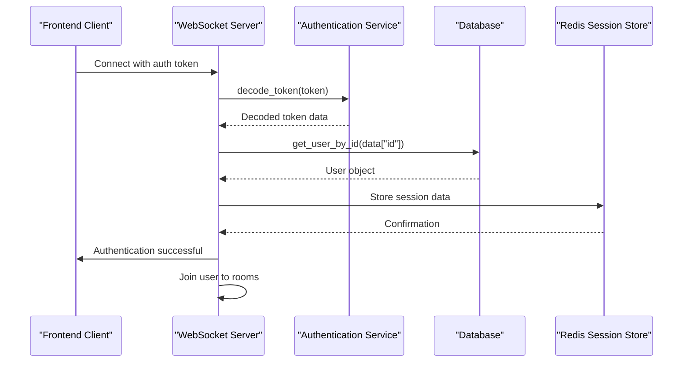
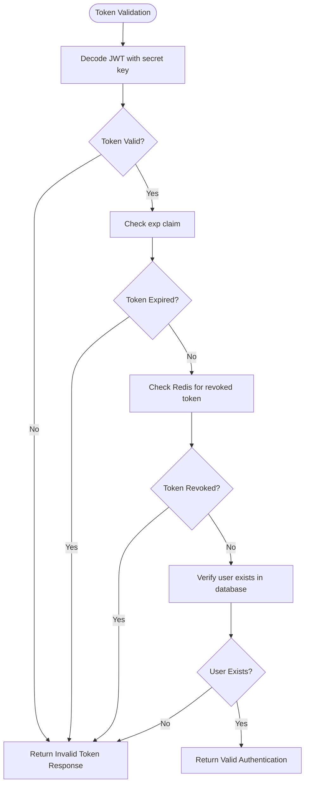
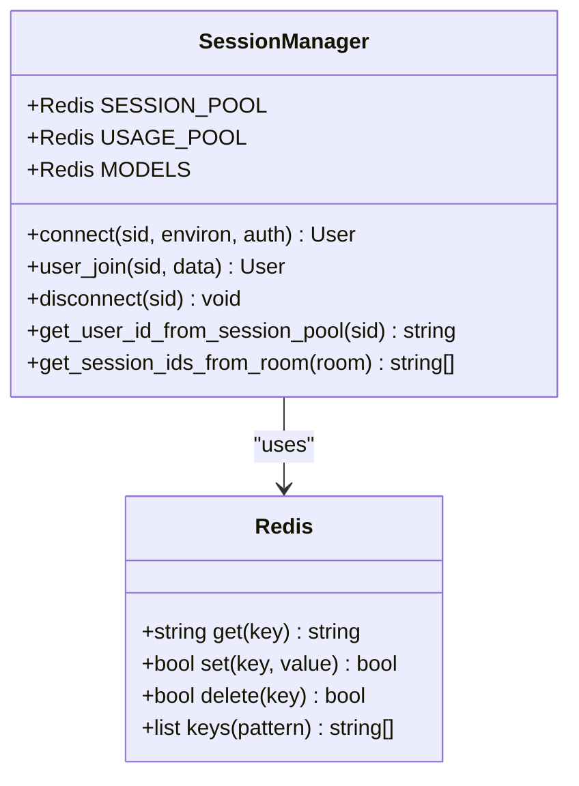
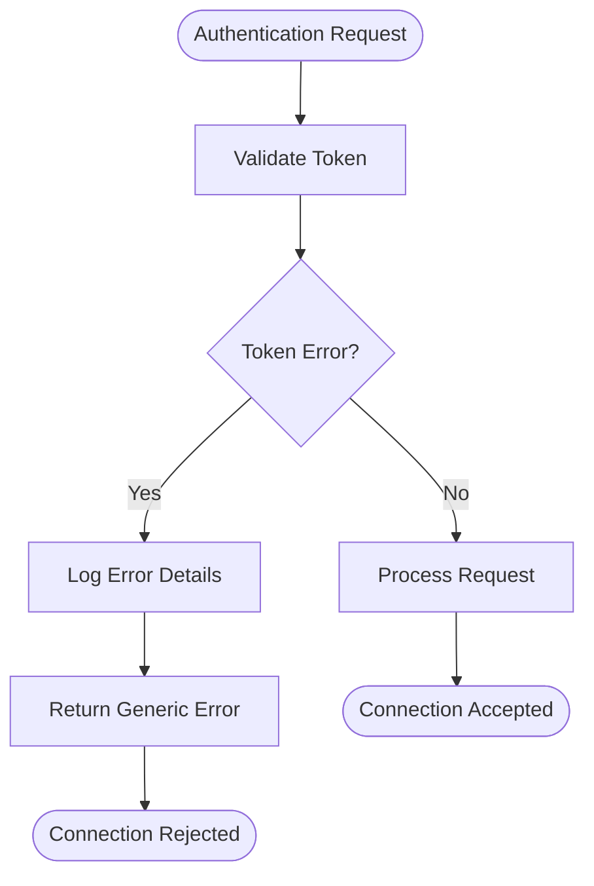
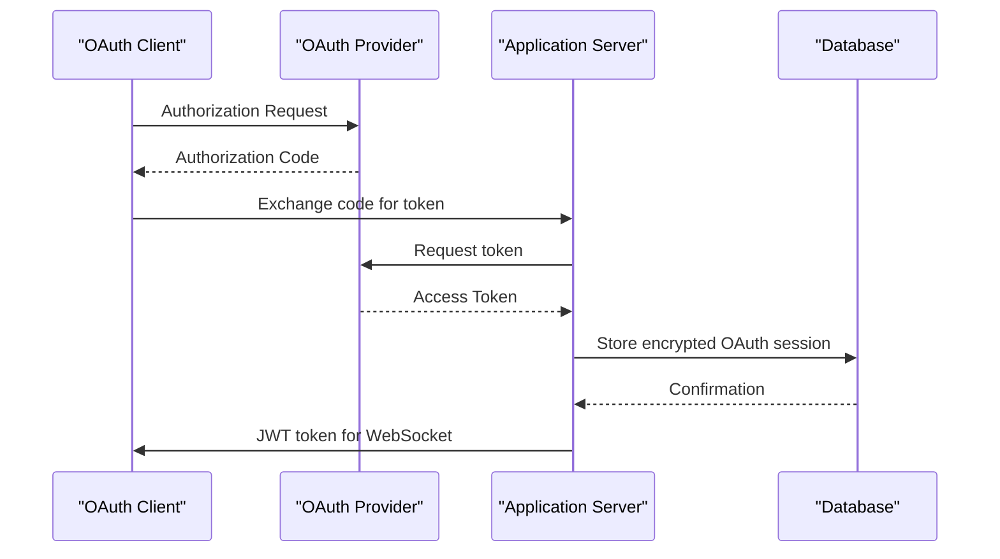

# Authentication Mechanism

<cite>
**Referenced Files in This Document**   
- [main.py](file://backend/open_webui/socket/main.py)
- [auth.py](file://backend/open_webui/utils/auth.py)
- [auths.py](file://backend/open_webui/routers/auths.py)
- [oauth.py](file://backend/open_webui/utils/oauth.py)
- [oauth_sessions.py](file://backend/open_webui/models/oauth_sessions.py)
</cite>

## Table of Contents
1. [Introduction](#introduction)
2. [WebSocket Authentication Flow](#websocket-authentication-flow)
3. [Token Validation Process](#token-validation-process)
4. [Session Management](#session-management)
5. [Error Handling](#error-handling)
6. [Security Measures](#security-measures)
7. [OAuth Integration](#oauth-integration)
8. [Frontend-Backend Connection Flow](#frontend-backend-connection-flow)

## Introduction
The WebSocket authentication mechanism in open-webui provides secure real-time communication between clients and the server. This documentation details the authentication process for WebSocket connections, focusing on the 'user-join' event handler that validates user authentication tokens during the initial connection handshake. The system integrates JWT-based authentication with Redis session management to ensure secure and efficient user validation across both HTTP and WebSocket contexts.

**Section sources**
- [main.py](file://backend/open_webui/socket/main.py#L1-L839)

## WebSocket Authentication Flow
The WebSocket authentication flow begins when a client attempts to establish a connection to the server. The authentication process is handled through the Socket.IO framework, which manages the WebSocket connections and provides event-based communication. The primary entry point for authentication is the 'user-join' event handler, which validates the user's authentication token before allowing access to protected resources.

The authentication flow follows these steps:
1. Client initiates WebSocket connection with authentication token
2. Server receives 'user-join' event with authentication data
3. Token is extracted and decoded using JWT utilities
4. User identity is verified against the database
5. Session is established in Redis for the connected user
6. User is added to appropriate communication rooms

**Diagram sources **
- [main.py](file://backend/open_webui/socket/main.py#L318-L351)
- [auth.py](file://backend/open_webui/utils/auth.py#L208-L213)

**Section sources**
- [main.py](file://backend/open_webui/socket/main.py#L302-L351)

## Token Validation Process
The token validation process is a critical component of the WebSocket authentication mechanism. When a client sends an authentication token, the server performs several validation steps to ensure the token's authenticity and validity.

The token validation process involves:
- JWT decoding using the server's secret key
- Verification of token expiration time
- Checking for token revocation in Redis
- User existence verification in the database
- Role-based access control validation

The `decode_token` function in the auth utility handles the JWT decoding process, returning the decoded payload if successful or None if the token is invalid. The `is_valid_token` function checks whether the token has been revoked by querying Redis using the token's JTI (JWT ID) as the key.

**Diagram sources **
- [auth.py](file://backend/open_webui/utils/auth.py#L208-L228)
- [auth.py](file://backend/open_webui/utils/auth.py#L304-L320)

**Section sources**
- [auth.py](file://backend/open_webui/utils/auth.py#L208-L228)

## Session Management
Session management in the WebSocket authentication system is implemented using Redis as the primary storage mechanism. When a user successfully authenticates, their session information is stored in Redis with a unique session ID (SID) as the key. This allows for efficient session lookup and management across multiple server instances in a distributed environment.

The session data includes essential user information such as:
- User ID
- Name
- Role
- Profile information (excluding sensitive fields)

The SESSION_POOL Redis dictionary maintains active WebSocket sessions, mapping session IDs to user data. This enables the server to quickly retrieve user information during WebSocket events without querying the database repeatedly. Sessions are automatically cleaned up when users disconnect, ensuring resource efficiency.

**Diagram sources **
- [main.py](file://backend/open_webui/socket/main.py#L129-L134)
- [main.py](file://backend/open_webui/socket/main.py#L310-L315)

**Section sources**
- [main.py](file://backend/open_webui/socket/main.py#L129-L134)

## Error Handling
The WebSocket authentication system implements comprehensive error handling to manage various failure scenarios during the authentication process. Errors are handled gracefully to prevent information leakage and maintain system security.

Common error scenarios and their handling:
- Invalid or missing authentication tokens: Connection is rejected without additional information
- Expired tokens: User is required to re-authenticate
- Revoked tokens: Immediate connection termination
- Database errors: Appropriate error responses without exposing system details
- Redis connectivity issues: Fallback mechanisms to maintain service availability

The error handling strategy follows security best practices by providing minimal information to clients about the nature of authentication failures. This prevents attackers from using error messages to enumerate valid users or understand system internals.

**Diagram sources **
- [main.py](file://backend/open_webui/socket/main.py#L325-L331)
- [auth.py](file://backend/open_webui/utils/auth.py#L210-L213)

**Section sources**
- [main.py](file://backend/open_webui/socket/main.py#L325-L331)

## Security Measures
The WebSocket authentication system implements multiple security measures to protect against common attacks and ensure the integrity of the authentication process.

Key security features include:
- JWT-based authentication with HS256 algorithm
- Token revocation tracking in Redis
- Session isolation between users
- Protection against token replay attacks
- Secure cookie settings (HttpOnly, SameSite, Secure)
- Rate limiting for authentication attempts

The system uses JWT tokens with a unique JTI (JWT ID) for each token, enabling efficient revocation checking. When a token is invalidated (such as during logout), its JTI is stored in Redis with a TTL matching the remaining token lifetime. This prevents the use of revoked tokens even before their natural expiration.

Additionally, the system protects against token replay attacks by ensuring each token can only be used for a single authentication session. Once a user is authenticated, subsequent connection attempts require a valid, non-revoked token.

**Section sources**
- [auth.py](file://backend/open_webui/utils/auth.py#L231-L251)
- [auths.py](file://backend/open_webui/routers/auths.py#L753-L767)

## OAuth Integration
The WebSocket authentication system seamlessly integrates with the main FastAPI authentication system, sharing session state between HTTP and WebSocket contexts. This integration is particularly important for OAuth authentication, where users may authenticate through external providers.

OAuth session validation involves:
- Storing OAuth tokens in encrypted form in the database
- Synchronizing OAuth session state between HTTP and WebSocket contexts
- Validating OAuth token expiration and refreshing when necessary
- Mapping OAuth identities to internal user accounts

The OAuth session management system uses a dedicated database table to store OAuth session information, including access tokens, refresh tokens, and expiration times. These sessions are encrypted using Fernet encryption to protect sensitive authentication data.

When a user authenticates via OAuth, the system creates a corresponding JWT token for WebSocket authentication, allowing the user to access real-time features without requiring separate authentication.

**Diagram sources **
- [oauth.py](file://backend/open_webui/utils/oauth.py#L552-L597)
- [oauth_sessions.py](file://backend/open_webui/models/oauth_sessions.py#L108-L139)

**Section sources**
- [oauth.py](file://backend/open_webui/utils/oauth.py#L552-L597)

## Frontend-Backend Connection Flow
The connection flow between the frontend and backend WebSocket authentication system follows a standardized pattern that ensures secure and reliable communication.

The complete connection flow:
1. Frontend establishes WebSocket connection with authentication token
2. Backend receives connection request and extracts authentication data
3. Token is validated using JWT decoding and database verification
4. User session is created in Redis with appropriate permissions
5. User is added to relevant communication rooms based on their access
6. Authentication success response is sent to the client
7. Real-time communication channels are established

This flow ensures that only authenticated users can access protected WebSocket endpoints while maintaining the real-time capabilities of the application. The integration with the main FastAPI authentication system allows for consistent user experience across both REST API and WebSocket interfaces.

**Section sources**
- [main.py](file://backend/open_webui/socket/main.py#L302-L351)
- [auth.py](file://backend/open_webui/utils/auth.py#L208-L213)