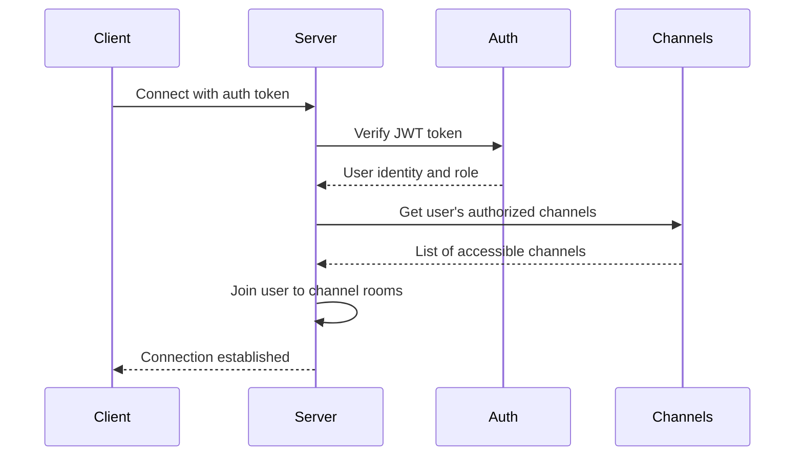
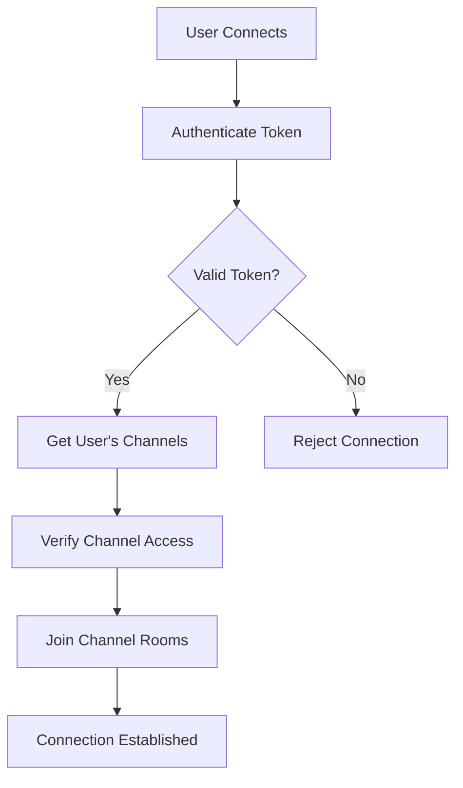

# Channel Authorization

<cite>
**Referenced Files in This Document**   
- [channels.py](file://backend/open_webui/routers/channels.py)
- [main.py](file://backend/open_webui/socket/main.py)
- [access_control.py](file://backend/open_webui/utils/access_control.py)
- [channels.py](file://backend/open_webui/models/channels.py)
- [index.ts](file://src/lib/apis/channels/index.ts)
- [index.ts](file://src/lib/stores/index.ts)
</cite>

## Table of Contents
1. [Introduction](#introduction)
2. [Channel Types and Access Control Model](#channel-types-and-access-control-model)
3. [WebSocket Connection and Authorization Flow](#websocket-connection-and-authorization-flow)
4. [Role-Based Permission Checks](#role-based-permission-checks)
5. [Resource Ownership and Group Membership Validation](#resource-ownership-and-group-membership-validation)
6. [Channel Naming Conventions for Access Control](#channel-naming-conventions-for-access-control)
7. [Subscription Authorization Process](#subscription-authorization-process)
8. [Error Handling and Unauthorized Access Attempts](#error-handling-and-unauthorized-access-attempts)
9. [Security Measures Against Privilege Escalation](#security-measures-against-privilege-escalation)
10. [Frontend Implementation of Channel Authorization](#frontend-implementation-of-channel-authorization)

## Introduction
The WebSocket channel authorization system in open-webui implements a comprehensive access control mechanism that governs how users can subscribe to and interact with various event channels. This system enforces strict permission checks based on user roles, group memberships, and resource ownership to ensure that only authorized users can access specific channels. The authorization framework is designed to prevent both vertical privilege escalation (gaining higher privileges) and horizontal privilege escalation (accessing resources belonging to other users with the same privilege level). The system integrates with the application's authentication and authorization infrastructure to provide real-time, secure communication channels for collaborative features such as chat, document editing, and notifications.

## Channel Types and Access Control Model
The open-webui system supports multiple channel types with different access control models. The primary channel types include direct message (DM) channels, group channels, and standard channels. Each channel type has specific authorization requirements and access patterns. DM channels are private conversations between users, group channels are for collaboration within user groups, and standard channels can have more flexible access controls. The access control model is implemented through the `access_control` field in the Channel model, which contains permission specifications for read and write operations. This field supports both user-level and group-level permissions, allowing fine-grained control over who can access each channel. The system also supports public channels where access control is not explicitly defined, defaulting to read access for all authenticated users.

**Section sources**
- [channels.py](file://backend/open_webui/models/channels.py#L22-L49)
- [channels.py](file://backend/open_webui/models/channels.py#L179-L182)

## WebSocket Connection and Authorization Flow
The WebSocket connection and authorization flow begins when a client establishes a connection to the server and authenticates using a JWT token. Upon successful authentication, the server verifies the user's identity and permissions, then automatically subscribes the user to all channels they are authorized to access. The connection process is initiated by the frontend emitting a "user-join" event with the authentication token, which triggers the backend to validate the token and establish the user session. Once authenticated, the server retrieves all channels associated with the user and joins the user's WebSocket session to the corresponding channel rooms. This automatic subscription mechanism ensures that users have immediate access to their authorized channels without requiring explicit subscription requests for each channel.

**Diagram sources**
- [main.py](file://backend/open_webui/socket/main.py#L318-L350)
- [index.ts](file://src/lib/stores/index.ts#L28)

## Role-Based Permission Checks
The system implements role-based permission checks to determine channel access eligibility. Users can have different roles such as "admin", "user", or "pending", with admins having elevated privileges. The authorization system checks both the user's role and specific feature permissions to determine access rights. For example, only admin users can create standard channels or perform administrative operations on channels. Regular users can create DM and group channels but are restricted from creating standard channels. The permission checks are implemented in the channel routers using dependency injection with the `get_verified_user` function, which validates the user's authentication and role. Additional permission checks are performed using the `has_permission` function, which evaluates the user's permissions against the application's configuration.

**Section sources**
- [channels.py](file://backend/open_webui/routers/channels.py#L84-L90)
- [channels.py](file://backend/open_webui/routers/channels.py#L227-L232)

## Resource Ownership and Group Membership Validation
Resource ownership and group membership validation are critical components of the channel authorization system. The system verifies whether a user owns a channel or has the necessary permissions to access it based on group memberships. For channel modification operations, the system checks if the user is either the channel creator (owner) or has been assigned a manager role in the channel. Group membership validation is performed by querying the database for all groups the user belongs to and checking if any of these groups have been granted access to the channel. The validation process also considers inherited permissions, where users inherit permissions from all groups they belong to, with the most permissive value taking precedence. This ensures that users can access channels through direct assignment or group membership.

**Section sources**
- [channels.py](file://backend/open_webui/models/channels.py#L464-L481)
- [access_control.py](file://backend/open_webui/utils/access_control.py#L108-L150)

## Channel Naming Conventions for Access Control
The system implements a consistent channel naming convention that incorporates channel identifiers for access control purposes. All channels are identified by a unique ID, and the WebSocket room names follow the pattern "channel:{channel_id}" to ensure proper namespace isolation. This naming convention allows the system to route messages to the correct channel and enforce access control at the room level. For direct message channels, the system may use the user IDs of the participants to identify the channel, ensuring that each DM channel is unique to the participants. The naming convention also supports special channels for system events and notifications, which follow similar patterns with appropriate prefixes. This structured naming approach enables efficient channel management and prevents naming conflicts that could lead to security vulnerabilities.

**Section sources**
- [main.py](file://backend/open_webui/socket/main.py#L349)
- [main.py](file://backend/open_webui/socket/main.py#L272-L284)

## Subscription Authorization Process
The subscription authorization process is automatically handled by the system when a user connects to the WebSocket server. Rather than requiring explicit subscription requests, the system proactively joins authenticated users to all channels they are authorized to access. This process begins with the user authentication and token validation, followed by retrieving the user's channel list from the database. The system then iterates through each authorized channel and joins the user's WebSocket session to the corresponding channel room. For DM and group channels, the system verifies that the user is a member of the channel before allowing access. For standard channels with access control restrictions, the system evaluates the user's permissions against the channel's access control settings. This automated subscription process ensures that users have immediate access to their channels while maintaining strict security controls.

**Diagram sources**
- [main.py](file://backend/open_webui/socket/main.py#L346-L349)
- [channels.py](file://backend/open_webui/models/channels.py#L341-L377)

## Error Handling and Unauthorized Access Attempts
The system implements comprehensive error handling for unauthorized access attempts and other authorization failures. When a user attempts to access a channel they are not authorized for, the system returns appropriate HTTP error responses with clear error messages. Unauthorized access attempts (HTTP 401) are returned when a user lacks the necessary permissions or authentication, while forbidden access attempts (HTTP 403) are returned when an authenticated user tries to access a resource they don't have permission for. The system also handles cases where channels do not exist (HTTP 404) or when there are internal server errors (HTTP 500). Error responses are standardized using the ERROR_MESSAGES constants, ensuring consistent error reporting across the application. The WebSocket system also silently rejects unauthorized subscription attempts by not joining the user to unauthorized channel rooms.

**Section sources**
- [channels.py](file://backend/open_webui/routers/channels.py#L299-L302)
- [channels.py](file://backend/open_webui/routers/channels.py#L309-L311)

## Security Measures Against Privilege Escalation
The system incorporates multiple security measures to prevent both vertical and horizontal privilege escalation attacks. Vertical privilege escalation is prevented by strict role-based access control, where only users with the "admin" role can perform administrative operations. The system also validates that users can only modify channels they own or have been explicitly granted management rights for. Horizontal privilege escalation is prevented by ensuring that users cannot access channels belonging to other users unless explicitly shared or accessible through group membership. The system implements proper input validation and parameter checking to prevent ID manipulation attacks. Additionally, all authorization checks are performed on the server side, preventing clients from bypassing security controls. The use of JWT tokens with proper expiration and revocation mechanisms further enhances security by limiting the window of opportunity for token-based attacks.

**Section sources**
- [channels.py](file://backend/open_webui/routers/channels.py#L610-L613)
- [channels.py](file://backend/open_webui/routers/channels.py#L308-L311)

## Frontend Implementation of Channel Authorization
The frontend implementation of channel authorization works in conjunction with the backend system to provide a seamless user experience while maintaining security. The frontend stores the user's authentication token in localStorage and uses it to establish WebSocket connections. When the application loads, it emits a "user-join" event with the authentication token, triggering the backend authorization process. The frontend also listens for channel events and updates the UI accordingly when users are added to or removed from channels. The stores system maintains the list of active channels and user presence information, allowing the UI to reflect real-time changes in channel membership and activity. The frontend respects the authorization decisions made by the backend and does not attempt to access channels that have not been explicitly granted, ensuring that security controls are enforced consistently across the application.

**Section sources**
- [index.ts](file://src/lib/stores/index.ts#L53-L54)
- [+layout.svelte](file://src/routes/+layout.svelte#L151)