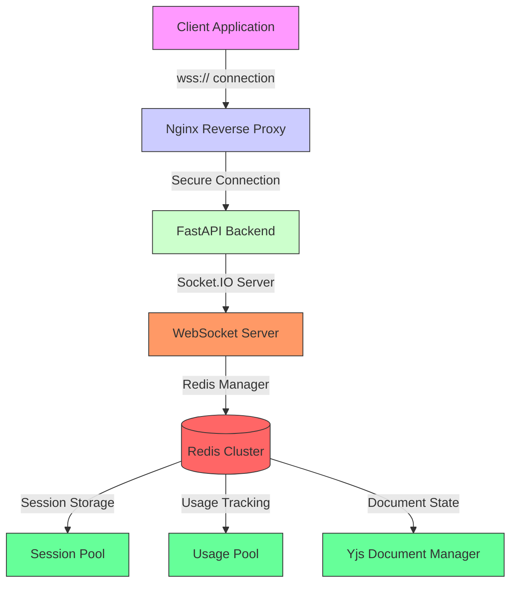
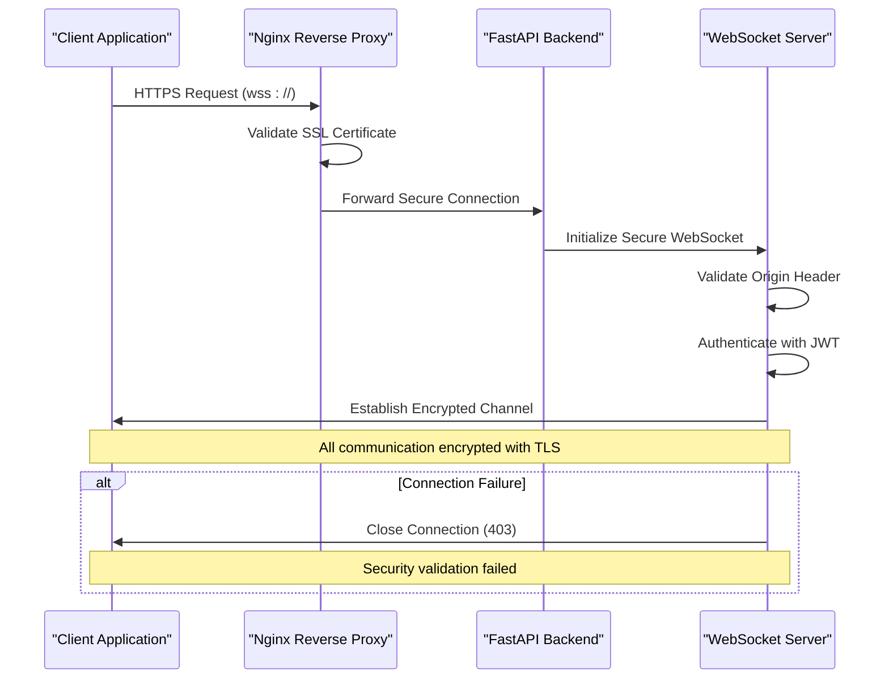
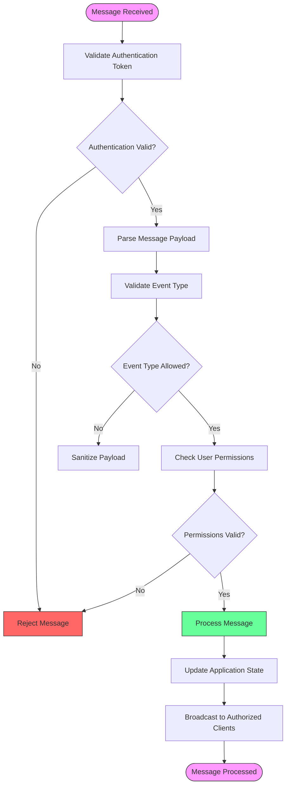
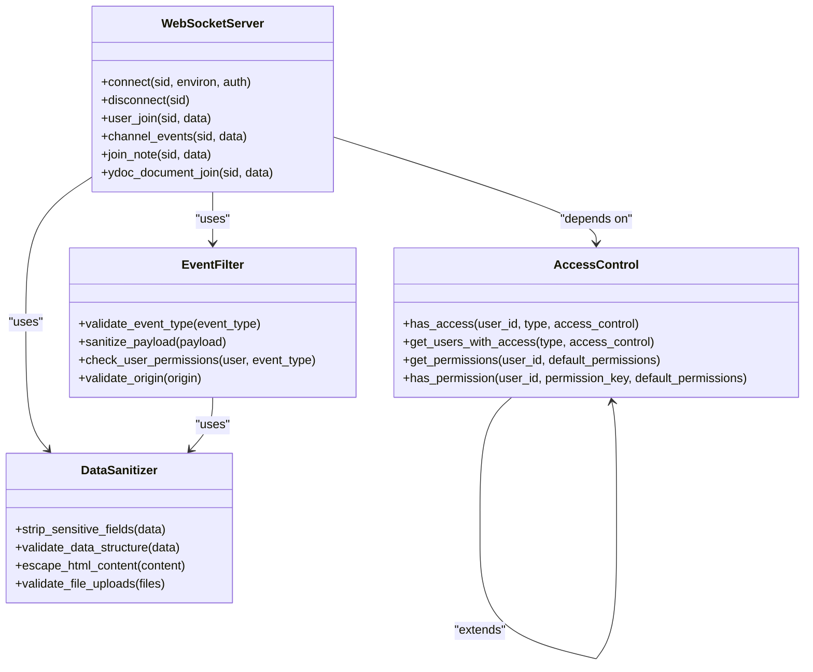
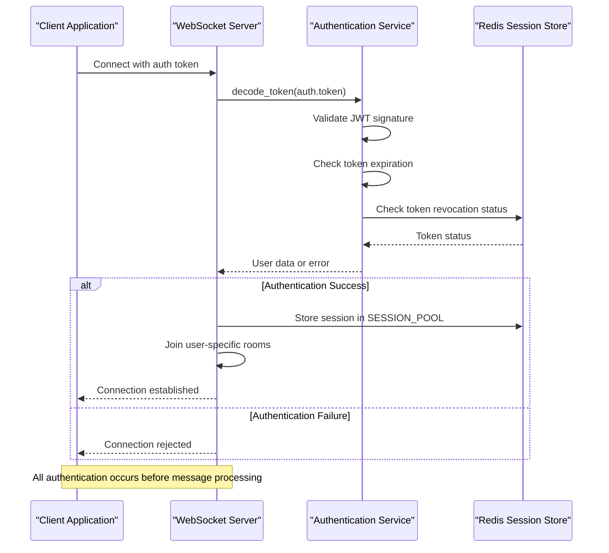
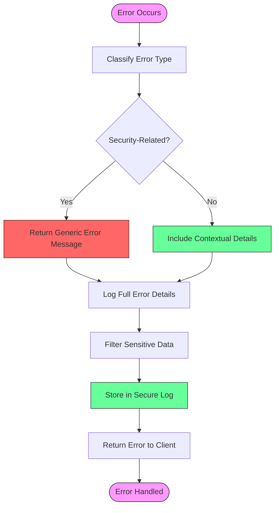
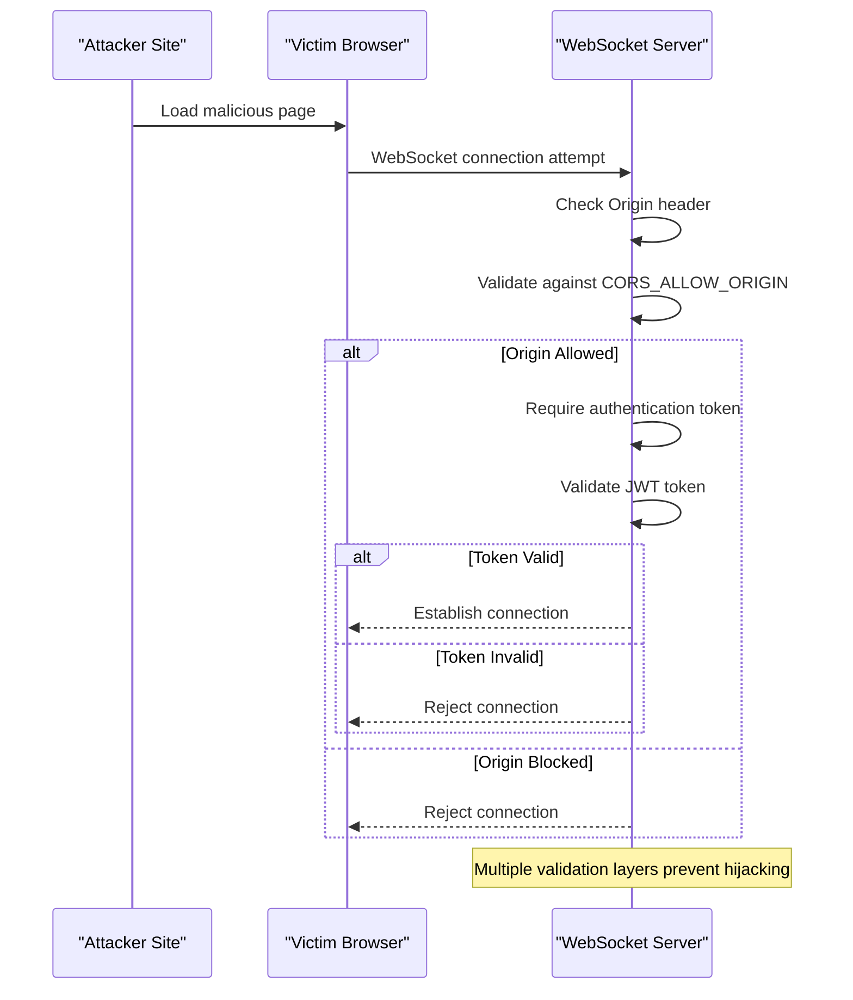
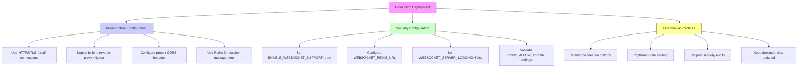

# Data Protection and Transmission Security

<cite>
**Referenced Files in This Document**   
- [main.py](file://backend/open_webui/main.py)
- [socket/main.py](file://backend/open_webui/socket/main.py)
- [env.py](file://backend/open_webui/env.py)
- [config.py](file://backend/open_webui/config.py)
- [auth.py](file://backend/open_webui/utils/auth.py)
- [security_headers.py](file://backend/open_webui/utils/security_headers.py)
- [access_control.py](file://backend/open_webui/utils/access_control.py)
- [utils.py](file://backend/open_webui/socket/utils.py)
- [+layout.svelte](file://src/routes/+layout.svelte)
</cite>

## Table of Contents
1. [Introduction](#introduction)
2. [WebSocket Implementation Overview](#websocket-implementation-overview)
3. [Secure Connection Enforcement](#secure-connection-enforcement)
4. [Message Structure and Payload Security](#message-structure-and-payload-security)
5. [Event Filtering and Data Sanitization](#event-filtering-and-data-sanitization)
6. [Authentication and Authorization](#authentication-and-authorization)
7. [Error Handling and Logging Security](#error-handling-and-logging-security)
8. [Cross-Site WebSocket Hijacking Prevention](#cross-site-websocket-hijacking-prevention)
9. [Production Deployment Best Practices](#production-deployment-best-practices)
10. [Conclusion](#conclusion)

## Introduction
This document provides a comprehensive analysis of data protection mechanisms in open-webui's WebSocket implementation. The system employs multiple layers of security to protect sensitive data during transmission between client and server, including secure connection enforcement, message structure integrity, and comprehensive access controls. The WebSocket implementation is built on the Socket.IO framework with Redis for distributed session management, providing both real-time communication capabilities and robust security features.

The security architecture focuses on preventing data leakage through proper event filtering, payload sanitization, and strict authentication mechanisms. The system integrates with reverse proxy security headers and implements measures to prevent cross-site WebSocket hijacking through origin validation. This documentation details the implementation of secure WebSocket (wss://) connections and provides best practices for securing WebSocket communications in production deployments.

## WebSocket Implementation Overview

The WebSocket implementation in open-webui is built on the Socket.IO framework, providing real-time bidirectional communication between the client and server. The system is configured to support both WebSocket and HTTP long-polling transports, with WebSocket being the preferred method when available.

**Diagram sources**
- [main.py](file://backend/open_webui/main.py#L63-L69)
- [socket/main.py](file://backend/open_webui/socket/main.py#L64-L99)
- [env.py](file://backend/open_webui/env.py#L618-L662)

The WebSocket server is initialized with several security-critical configuration options that control connection behavior, timeout settings, and logging levels. The system supports Redis-based session management for horizontal scaling, allowing multiple backend instances to share WebSocket state. The implementation includes periodic cleanup of inactive sessions and usage tracking to prevent resource exhaustion attacks.

**Section sources**
- [socket/main.py](file://backend/open_webui/socket/main.py#L1-L103)
- [main.py](file://backend/open_webui/main.py#L63-L69)

## Secure Connection Enforcement

The WebSocket implementation enforces secure connections through multiple mechanisms, starting with configuration options that mandate SSL/TLS for client sessions. The system uses environment variables to control WebSocket security settings, ensuring that connections are encrypted in transit.

**Diagram sources**
- [env.py](file://backend/open_webui/env.py#L675-L677)
- [config.py](file://backend/open_webui/config.py#L1609-L1614)
- [socket/main.py](file://backend/open_webui/socket/main.py#L77-L87)

The system implements connection security through several key configuration parameters:
- **AIOHTTP_CLIENT_SESSION_SSL**: Enforces SSL/TLS for all client sessions (default: true)
- **CORS_ALLOW_ORIGIN**: Controls cross-origin resource sharing with strict origin validation
- **WEBSOCKET_SERVER_PING_TIMEOUT** and **WEBSOCKET_SERVER_PING_INTERVAL**: Manage connection liveness with configurable timeout values
- **ENABLE_WEBSOCKET_SUPPORT**: Global toggle for WebSocket functionality

The WebSocket server is configured to only accept connections from origins specified in the CORS_ALLOW_ORIGIN environment variable, preventing unauthorized domains from establishing WebSocket connections. The system also implements ping/pong heartbeat mechanisms to detect and close stale connections, reducing the attack surface for potential hijacking attempts.

**Section sources**
- [env.py](file://backend/open_webui/env.py#L675-L677)
- [config.py](file://backend/open_webui/config.py#L1609-L1614)

## Message Structure and Payload Security

The WebSocket implementation employs a structured message format that includes authentication, event typing, and data validation to ensure payload integrity. Each message follows a consistent schema that enables proper routing and security validation.

**Diagram sources**
- [socket/main.py](file://backend/open_webui/socket/main.py#L303-L317)
- [auth.py](file://backend/open_webui/utils/auth.py#L304-L350)
- [access_control.py](file://backend/open_webui/utils/access_control.py#L124-L150)

The message structure includes several security-critical components:
- **Authentication tokens** embedded in the connection handshake
- **Event typing** to distinguish between different message categories (e.g., chat, channel, user)
- **Data validation** to ensure payload integrity
- **Room-based broadcasting** to limit message scope to authorized recipients

The system implements a publish-subscribe pattern where clients join specific rooms based on their authorization level, ensuring that sensitive messages are only delivered to authorized recipients. Message payloads are validated against expected schemas, and unauthorized fields are stripped before processing.

**Section sources**
- [socket/main.py](file://backend/open_webui/socket/main.py#L413-L447)
- [auth.py](file://backend/open_webui/utils/auth.py#L304-L350)

## Event Filtering and Data Sanitization

The WebSocket implementation includes comprehensive event filtering and data sanitization mechanisms to prevent information leakage and unauthorized data access. The system employs a zero-trust approach to incoming messages, validating all event types and sanitizing payloads before processing.

**Diagram sources**
- [socket/main.py](file://backend/open_webui/socket/main.py#L303-L694)
- [access_control.py](file://backend/open_webui/utils/access_control.py#L71-L174)
- [utils.py](file://backend/open_webui/socket/utils.py#L49-L118)

The event filtering system operates on multiple levels:
1. **Connection-level filtering**: Validates the origin and authentication token during the initial handshake
2. **Event-type filtering**: Ensures that only authorized event types are processed
3. **Payload sanitization**: Removes or escapes potentially dangerous content from message payloads
4. **Access control validation**: Verifies that users have appropriate permissions for the requested action

The system implements strict data sanitization for collaborative editing features, particularly for Yjs document operations. When users join a document, the server validates their access permissions before allowing them to receive document state updates. The implementation also includes mechanisms to prevent unauthorized users from accessing sensitive document content through WebSocket events.

**Section sources**
- [socket/main.py](file://backend/open_webui/socket/main.py#L413-L447)
- [access_control.py](file://backend/open_webui/utils/access_control.py#L124-L150)

## Authentication and Authorization

The WebSocket implementation integrates with the application's JWT-based authentication system to ensure that only authorized users can establish connections and send messages. The authentication process occurs during the WebSocket handshake, with token validation performed before any message processing.

**Diagram sources**
- [socket/main.py](file://backend/open_webui/socket/main.py#L303-L317)
- [auth.py](file://backend/open_webui/utils/auth.py#L208-L242)
- [socket/main.py](file://backend/open_webui/socket/main.py#L318-L352)

The authentication flow includes several security-critical steps:
- **JWT token validation**: The system verifies the JWT signature, expiration, and structure
- **Token revocation checking**: Uses Redis to check if tokens have been invalidated
- **Session management**: Stores authenticated user sessions in Redis with limited data exposure
- **Room-based access control**: Joins users to specific rooms based on their permissions

The implementation follows the principle of least privilege by excluding sensitive user information (such as date of birth, bio, and gender) from the session store. When users join channels or notes, the system performs additional access control checks to ensure they have appropriate permissions for the requested resource.

**Section sources**
- [socket/main.py](file://backend/open_webui/socket/main.py#L303-L352)
- [auth.py](file://backend/open_webui/utils/auth.py#L208-L242)

## Error Handling and Logging Security

The WebSocket implementation includes secure error handling and logging practices to prevent information leakage through error messages and logs. The system carefully controls what information is exposed in error responses and implements comprehensive logging with sensitive data protection.

**Diagram sources**
- [socket/main.py](file://backend/open_webui/socket/main.py#L520-L523)
- [logger.py](file://backend/open_webui/utils/logger.py#L116-L162)
- [security_headers.py](file://backend/open_webui/utils/security_headers.py#L9-L58)

The error handling system follows these security principles:
- **Generic error messages**: Security-related errors return generic messages to prevent information disclosure
- **Detailed internal logging**: Full error details are logged internally for debugging purposes
- **Sensitive data filtering**: Logs are filtered to remove authentication tokens and other sensitive information
- **Audit logging**: Security-critical events are logged separately for compliance and monitoring

The implementation uses structured logging with Loguru, which allows for different handlers for general logs and audit logs. Audit logs are stored in a separate file with compression and rotation, ensuring that security-relevant events are preserved while minimizing the risk of log-based attacks.

**Section sources**
- [socket/main.py](file://backend/open_webui/socket/main.py#L520-L523)
- [logger.py](file://backend/open_webui/utils/logger.py#L116-L162)

## Cross-Site WebSocket Hijacking Prevention

The WebSocket implementation includes multiple layers of protection against cross-site WebSocket hijacking attacks. The system employs origin validation, authentication requirements, and connection restrictions to prevent unauthorized access.

**Diagram sources**
- [socket/main.py](file://backend/open_webui/socket/main.py#L62-L63)
- [config.py](file://backend/open_webui/config.py#L1609-L1614)
- [socket/main.py](file://backend/open_webui/socket/main.py#L303-L317)

The cross-site WebSocket hijacking prevention measures include:
- **Strict origin validation**: The system validates the Origin header against the CORS_ALLOW_ORIGIN whitelist
- **Mandatory authentication**: All WebSocket connections require a valid JWT token
- **Session binding**: User sessions are bound to specific WebSocket connections
- **Connection monitoring**: The system tracks active connections and sessions

The implementation also includes protection against session fixation attacks by ensuring that authentication tokens are validated on each connection attempt. The system does not accept connections without proper authentication, preventing attackers from establishing WebSocket connections on behalf of authenticated users.

**Section sources**
- [socket/main.py](file://backend/open_webui/socket/main.py#L62-L63)
- [config.py](file://backend/open_webui/config.py#L1609-L1614)

## Production Deployment Best Practices

For secure production deployments of open-webui's WebSocket implementation, several best practices should be followed to maximize security and performance. These recommendations address configuration, infrastructure, and operational considerations.

**Diagram sources**
- [env.py](file://backend/open_webui/env.py#L618-L677)
- [config.py](file://backend/open_webui/config.py#L1609-L1614)
- [security_headers.py](file://backend/open_webui/utils/security_headers.py#L16-L58)

Key production deployment recommendations include:

### Infrastructure Configuration
- **Use HTTPS/TLS**: Ensure all WebSocket connections use wss:// protocol
- **Reverse proxy**: Deploy behind Nginx or similar proxy for SSL termination and connection management
- **Redis clustering**: Use Redis for distributed session management in multi-instance deployments
- **Load balancing**: Configure load balancers to maintain WebSocket connection affinity

### Security Configuration
- **Environment variables**: Set ENABLE_WEBSOCKET_SUPPORT=true and configure WEBSOCKET_REDIS_URL
- **CORS settings**: Carefully configure CORS_ALLOW_ORIGIN to only allow trusted domains
- **Logging**: Disable detailed WebSocket logging in production (WEBSOCKET_SERVER_LOGGING=false)
- **Security headers**: Implement Content-Security-Policy and other security headers

### Operational Practices
- **Monitoring**: Implement monitoring for connection counts, message rates, and error rates
- **Rate limiting**: Consider implementing rate limiting to prevent abuse
- **Auditing**: Regularly audit WebSocket usage and security configurations
- **Updates**: Keep all dependencies, including Socket.IO and Redis, up to date

These best practices ensure that the WebSocket implementation remains secure and performant in production environments while minimizing the attack surface for potential threats.

**Section sources**
- [env.py](file://backend/open_webui/env.py#L618-L677)
- [config.py](file://backend/open_webui/config.py#L1609-L1614)
- [security_headers.py](file://backend/open_webui/utils/security_headers.py#L16-L58)

## Conclusion
The WebSocket implementation in open-webui demonstrates a comprehensive approach to data protection and transmission security. By combining secure connection enforcement, structured message formats, rigorous event filtering, and robust authentication mechanisms, the system effectively protects sensitive data during real-time communication between client and server.

The architecture leverages industry-standard security practices, including JWT-based authentication, origin validation, and Redis-backed session management, to create a secure foundation for real-time collaboration features. The implementation carefully balances functionality with security, ensuring that users can collaborate effectively while minimizing the risk of data leakage or unauthorized access.

For production deployments, following the recommended best practices will further enhance the security posture of the WebSocket implementation. Regular security audits, proper infrastructure configuration, and vigilant monitoring are essential for maintaining the integrity of the system over time.

The comprehensive security measures documented here provide confidence that open-webui's WebSocket implementation meets modern security standards for protecting sensitive data in transit, making it suitable for deployment in environments with strict data protection requirements.