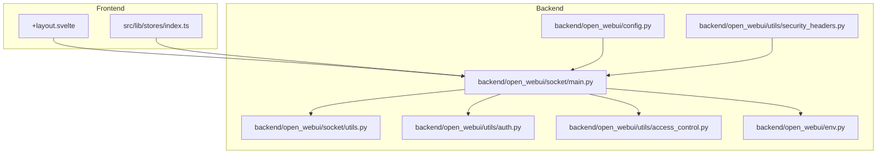
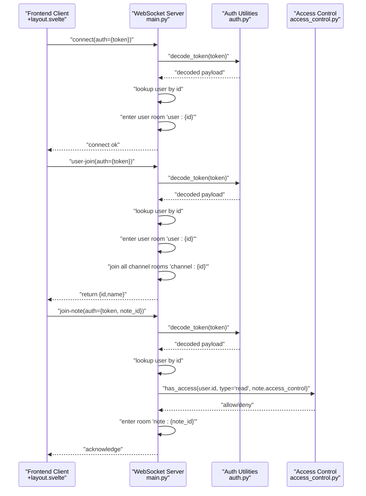
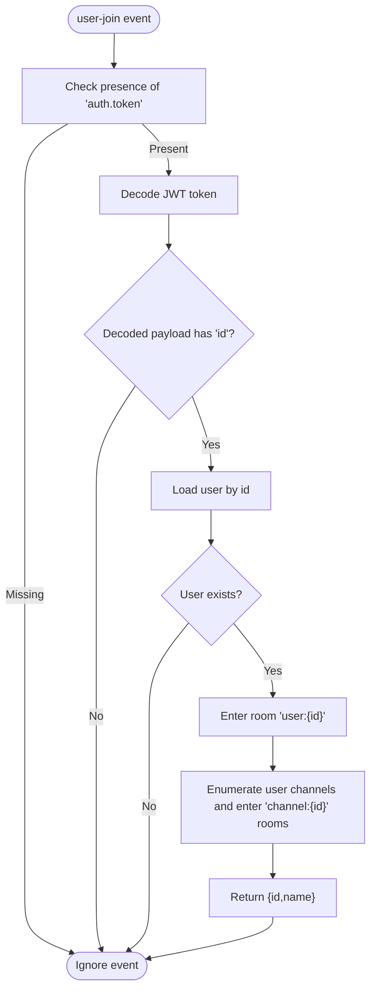
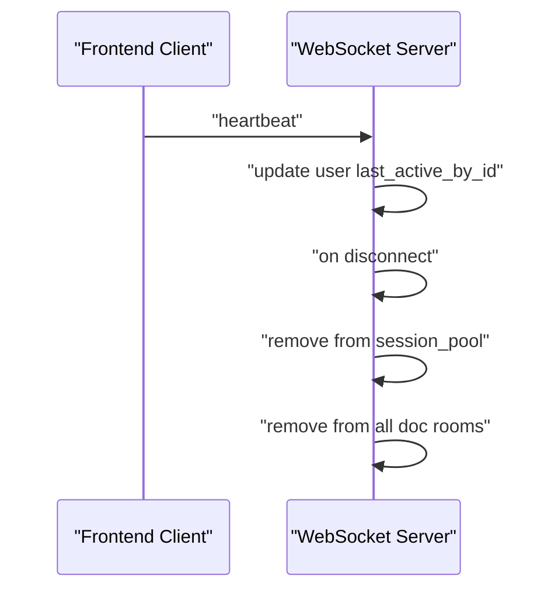
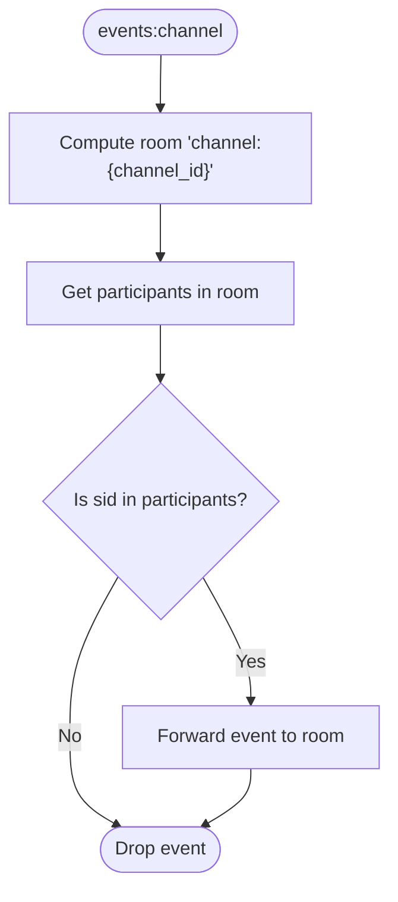
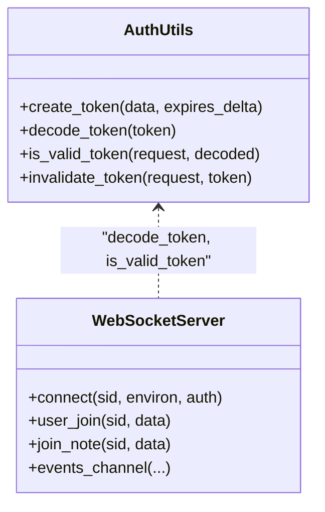
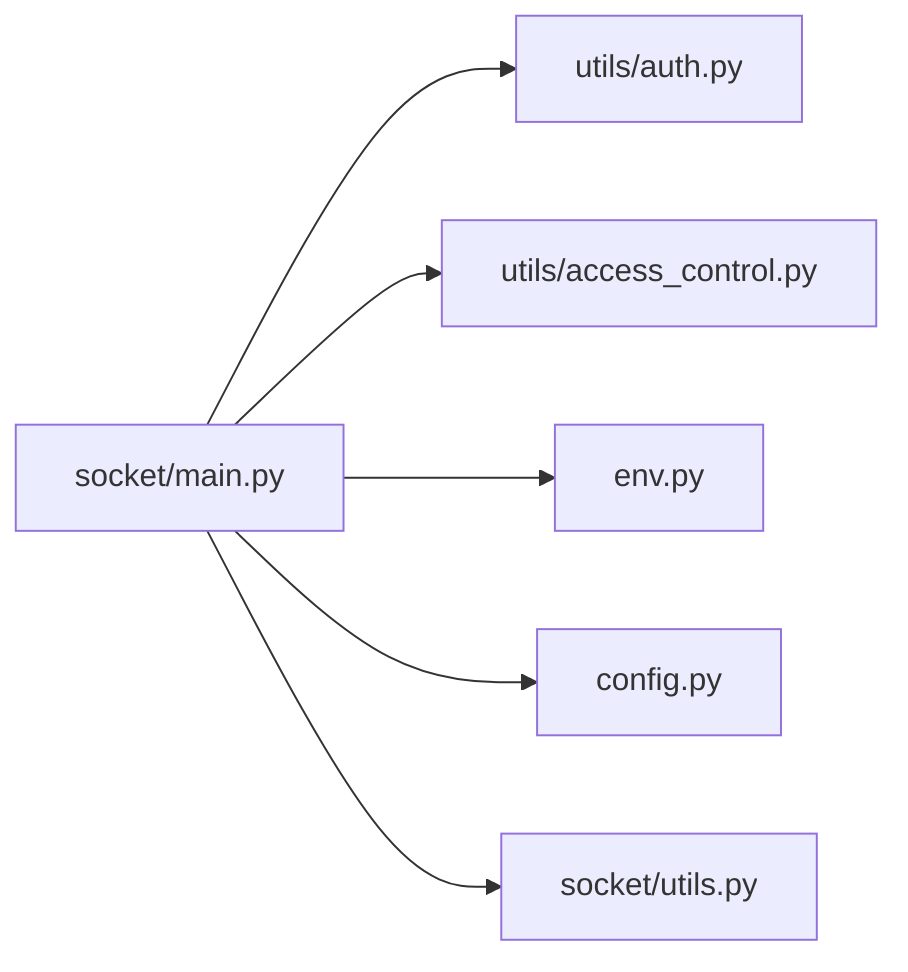

# Security and Authentication

<cite>
**Referenced Files in This Document**
- [main.py](file://backend/open_webui/socket/main.py)
- [utils.py](file://backend/open_webui/socket/utils.py)
- [auth.py](file://backend/open_webui/utils/auth.py)
- [access_control.py](file://backend/open_webui/utils/access_control.py)
- [env.py](file://backend/open_webui/env.py)
- [config.py](file://backend/open_webui/config.py)
- [security_headers.py](file://backend/open_webui/utils/security_headers.py)
- [+layout.svelte](file://src/routes/+layout.svelte)
- [stores/index.ts](file://src/lib/stores/index.ts)
</cite>

## Table of Contents
1. [Introduction](#introduction)
2. [Project Structure](#project-structure)
3. [Core Components](#core-components)
4. [Architecture Overview](#architecture-overview)
5. [Detailed Component Analysis](#detailed-component-analysis)
6. [Dependency Analysis](#dependency-analysis)
7. [Performance Considerations](#performance-considerations)
8. [Troubleshooting Guide](#troubleshooting-guide)
9. [Conclusion](#conclusion)

## Introduction
This document explains the WebSocket security and authentication implementation in open-webui. It focuses on how user identity is validated during the “user-join” event, how sessions are maintained, and how authorization controls channel subscriptions. It also covers how sensitive data is protected during transmission, the integration with the application’s JWT-based authentication system, and the OAuth session validation flow. Finally, it addresses potential security risks such as WebSocket hijacking, message injection, and denial-of-service attacks, and outlines the mitigations implemented in the codebase.

## Project Structure
The WebSocket subsystem is implemented in the backend under the socket module and integrates with the broader authentication and access control utilities. The frontend initializes the WebSocket client with a JWT token and periodically sends heartbeats to keep the session alive.

**Diagram sources**
- [main.py](file://backend/open_webui/socket/main.py#L1-L120)
- [utils.py](file://backend/open_webui/socket/utils.py#L1-L120)
- [auth.py](file://backend/open_webui/utils/auth.py#L194-L214)
- [access_control.py](file://backend/open_webui/utils/access_control.py#L124-L151)
- [env.py](file://backend/open_webui/env.py#L618-L677)
- [config.py](file://backend/open_webui/config.py#L1589-L1614)
- [+layout.svelte](file://src/routes/+layout.svelte#L88-L141)
- [stores/index.ts](file://src/lib/stores/index.ts#L26-L31)

**Section sources**
- [main.py](file://backend/open_webui/socket/main.py#L1-L120)
- [auth.py](file://backend/open_webui/utils/auth.py#L194-L214)
- [access_control.py](file://backend/open_webui/utils/access_control.py#L124-L151)
- [env.py](file://backend/open_webui/env.py#L618-L677)
- [config.py](file://backend/open_webui/config.py#L1589-L1614)
- [+layout.svelte](file://src/routes/+layout.svelte#L88-L141)
- [stores/index.ts](file://src/lib/stores/index.ts#L26-L31)

## Core Components
- WebSocket server and event handlers: Implements connection, authentication, channel joins, note collaboration, and document synchronization with authorization checks.
- Token decoding and validation: Uses JWT decoding and revocation checks against Redis.
- Access control: Enforces read/write permissions for channels and collaborative documents.
- Frontend client: Initializes the Socket.IO client with a JWT token and sends periodic heartbeats.

Key responsibilities:
- Authentication: Validates JWT tokens and ensures the user still exists and is not revoked.
- Authorization: Checks access to channels and collaborative documents before allowing room membership.
- Session lifecycle: Tracks sessions, manages rooms, and cleans up on disconnect.
- Mitigations: Heartbeat-based liveness, Redis-backed session pools, and configurable timeouts.

**Section sources**
- [main.py](file://backend/open_webui/socket/main.py#L302-L373)
- [main.py](file://backend/open_webui/socket/main.py#L382-L411)
- [main.py](file://backend/open_webui/socket/main.py#L448-L544)
- [auth.py](file://backend/open_webui/utils/auth.py#L194-L214)
- [access_control.py](file://backend/open_webui/utils/access_control.py#L124-L151)
- [+layout.svelte](file://src/routes/+layout.svelte#L88-L141)

## Architecture Overview
The WebSocket server is configured with Socket.IO and optionally backed by Redis for distributed session management. The frontend connects with a JWT token and maintains a heartbeat to keep the session alive. Events are scoped to rooms keyed by user and channel/document identifiers, and authorization checks are enforced before joining rooms.

**Diagram sources**
- [main.py](file://backend/open_webui/socket/main.py#L302-L373)
- [main.py](file://backend/open_webui/socket/main.py#L382-L411)
- [auth.py](file://backend/open_webui/utils/auth.py#L194-L214)
- [access_control.py](file://backend/open_webui/utils/access_control.py#L124-L151)
- [+layout.svelte](file://src/routes/+layout.svelte#L88-L141)

## Detailed Component Analysis

### Authentication Mechanism for “user-join”
- Token extraction: The server receives a token via the Socket.IO auth parameter on initial connect and via the “user-join” event payload.
- Decoding: The token is decoded using a shared secret and algorithm.
- Identity verification: The decoded payload must contain a user id; the server then loads the user from the database.
- Session establishment: On successful validation, the server stores a minimal user profile in the session pool and enters the user into their dedicated “user:{id}” room.
- Channel auto-join: The server enumerates the user’s channels and enters them into each “channel:{id}” room.

**Diagram sources**
- [main.py](file://backend/open_webui/socket/main.py#L318-L373)

**Section sources**
- [main.py](file://backend/open_webui/socket/main.py#L302-L373)
- [auth.py](file://backend/open_webui/utils/auth.py#L194-L214)

### Session Security and Lifecycle Management
- Session pool: The server maintains a session pool keyed by Socket.IO session id, storing a sanitized user profile.
- Room management: Users are placed into user-specific rooms and channel rooms; document collaboration rooms are also managed.
- Heartbeat: The frontend emits a periodic heartbeat; the server updates the user’s last active timestamp.
- Cleanup: On disconnect, the server removes the session and detaches the user from all collaborative documents.

**Diagram sources**
- [main.py](file://backend/open_webui/socket/main.py#L354-L360)
- [main.py](file://backend/open_webui/socket/main.py#L684-L693)

**Section sources**
- [main.py](file://backend/open_webui/socket/main.py#L231-L254)
- [main.py](file://backend/open_webui/socket/main.py#L354-L360)
- [main.py](file://backend/open_webui/socket/main.py#L684-L693)

### Authorization Checks for Channel Subscriptions
- Channel events: The “events:channel” event includes a channel id and a data payload with a type. The server verifies that the requesting session is a participant in the channel room before forwarding the event.
- Note collaboration: The “join-note” event requires a token and a note id. The server decodes the token, loads the user, retrieves the note, and checks access using the access control helper. Only users with read access (including explicit user ids or group memberships) are allowed to join the “note:{id}” room.

**Diagram sources**
- [main.py](file://backend/open_webui/socket/main.py#L413-L447)

**Section sources**
- [main.py](file://backend/open_webui/socket/main.py#L413-L447)
- [main.py](file://backend/open_webui/socket/main.py#L382-L411)
- [access_control.py](file://backend/open_webui/utils/access_control.py#L124-L151)

### Integration with Application Authentication and OAuth Sessions
- JWT creation and validation: The backend creates JWTs with a shared secret and algorithm and validates them on the WebSocket path. Revocation is enforced by checking a Redis key derived from the token’s JTI.
- Cookie-based auth: The backend sets a secure, HttpOnly cookie for JWTs and supports trusted email header validation for delegated environments.
- OAuth sessions: OAuth sessions are stored server-side and can be refreshed. While the WebSocket layer primarily relies on JWT tokens, OAuth integration ensures long-lived access tokens for downstream integrations.

**Diagram sources**
- [auth.py](file://backend/open_webui/utils/auth.py#L194-L214)
- [auth.py](file://backend/open_webui/utils/auth.py#L216-L252)
- [main.py](file://backend/open_webui/socket/main.py#L302-L373)

**Section sources**
- [auth.py](file://backend/open_webui/utils/auth.py#L194-L214)
- [auth.py](file://backend/open_webui/utils/auth.py#L216-L252)
- [main.py](file://backend/open_webui/socket/main.py#L302-L373)

### Sensitive Data Protection During Transmission
- Transport security: The WebSocket transport is enabled conditionally and defaults to polling with upgrades to WebSocket when supported. The server exposes ping intervals/timeouts to detect dead connections.
- Cookie security: JWT cookies are HttpOnly and controlled by SameSite and Secure flags, reducing exposure to cross-site scripting and enforcing same-origin usage.
- Headers: Security headers middleware applies HSTS, frame options, content type options, and CSP to HTTP responses, complementing transport-level protections.

**Section sources**
- [main.py](file://backend/open_webui/socket/main.py#L64-L103)
- [env.py](file://backend/open_webui/env.py#L618-L677)
- [security_headers.py](file://backend/open_webui/utils/security_headers.py#L1-L133)

### Mitigations Against Common WebSocket Vulnerabilities
- WebSocket hijacking: The server validates tokens per event and enforces room membership checks. The frontend authenticates with a JWT token and reconnects on errors.
- Message injection: Room membership checks ensure only authorized participants receive events. Authorization helpers enforce access policies for channels and notes.
- Denial-of-service: Heartbeat-based liveness keeps sessions fresh; Redis-backed cleanup locks protect concurrent maintenance tasks; ping intervals/timeouts help detect dead peers.

**Section sources**
- [main.py](file://backend/open_webui/socket/main.py#L354-L360)
- [main.py](file://backend/open_webui/socket/main.py#L413-L447)
- [utils.py](file://backend/open_webui/socket/utils.py#L1-L120)
- [env.py](file://backend/open_webui/env.py#L618-L677)

## Dependency Analysis
The WebSocket server depends on:
- Auth utilities for token decoding and revocation checks
- Access control utilities for channel and note permissions
- Environment configuration for transport and logging
- Redis-backed session pools and document managers for distributed state

**Diagram sources**
- [main.py](file://backend/open_webui/socket/main.py#L1-L120)
- [auth.py](file://backend/open_webui/utils/auth.py#L194-L214)
- [access_control.py](file://backend/open_webui/utils/access_control.py#L124-L151)
- [env.py](file://backend/open_webui/env.py#L618-L677)
- [config.py](file://backend/open_webui/config.py#L1589-L1614)
- [utils.py](file://backend/open_webui/socket/utils.py#L1-L120)

**Section sources**
- [main.py](file://backend/open_webui/socket/main.py#L1-L120)
- [auth.py](file://backend/open_webui/utils/auth.py#L194-L214)
- [access_control.py](file://backend/open_webui/utils/access_control.py#L124-L151)
- [env.py](file://backend/open_webui/env.py#L618-L677)
- [config.py](file://backend/open_webui/config.py#L1589-L1614)
- [utils.py](file://backend/open_webui/socket/utils.py#L1-L120)

## Performance Considerations
- Redis-backed session pools reduce memory pressure and enable horizontal scaling.
- Ping intervals/timeouts balance responsiveness with overhead.
- Debounced document saves minimize write contention in collaborative editing.

[No sources needed since this section provides general guidance]

## Troubleshooting Guide
Common issues and diagnostics:
- Invalid or revoked token: The server decodes tokens and checks revocation; failures lead to ignored events or disconnects.
- Missing or invalid auth in events: Events requiring auth ignore requests without a token or with malformed payloads.
- Room membership errors: If a session is not in the expected room, events are dropped to prevent unauthorized broadcasts.
- Heartbeat failures: If the heartbeat interval is too aggressive or network conditions are poor, reconnect logic handles transient failures.

**Section sources**
- [auth.py](file://backend/open_webui/utils/auth.py#L216-L252)
- [main.py](file://backend/open_webui/socket/main.py#L318-L373)
- [main.py](file://backend/open_webui/socket/main.py#L413-L447)
- [+layout.svelte](file://src/routes/+layout.svelte#L88-L141)

## Conclusion
The WebSocket implementation in open-webui enforces strong authentication via JWT decoding and revocation checks, enforces authorization through access control helpers, and protects sessions with heartbeat-based liveness and room-scoped event delivery. The integration with the application’s authentication and OAuth systems ensures consistent identity validation across HTTP and WebSocket paths. The codebase includes practical mitigations against hijacking, message injection, and denial-of-service risks, while maintaining performance through Redis-backed state and configurable timeouts.