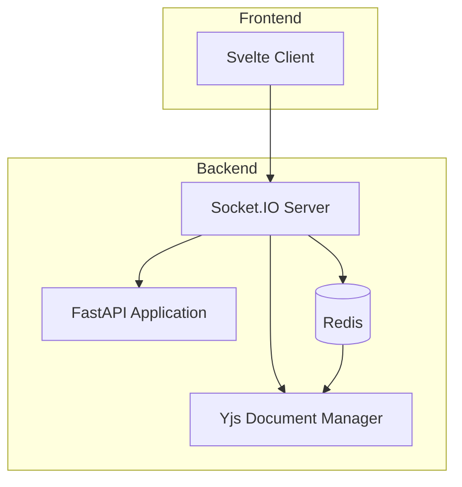
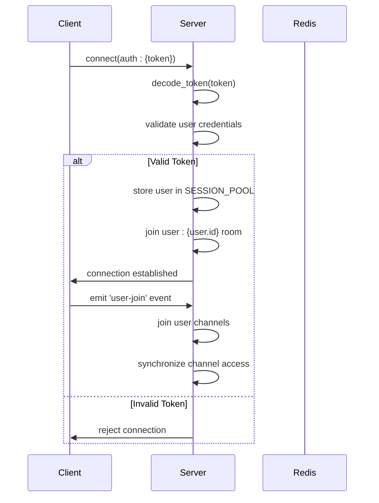
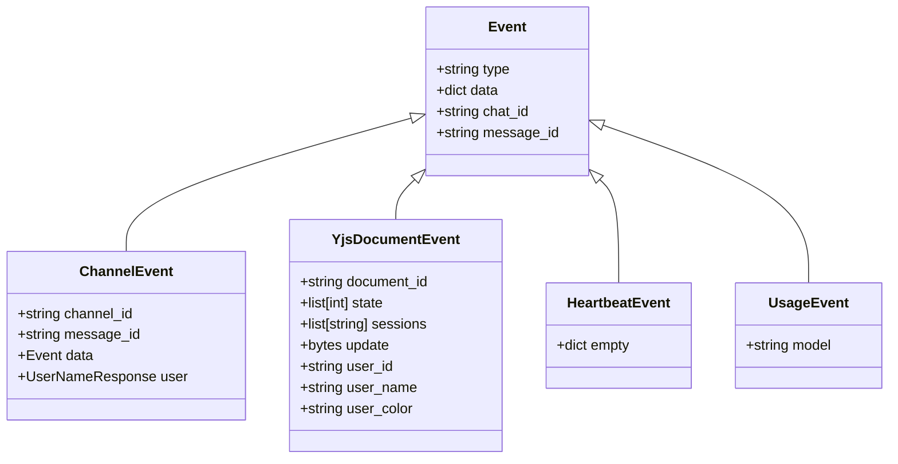
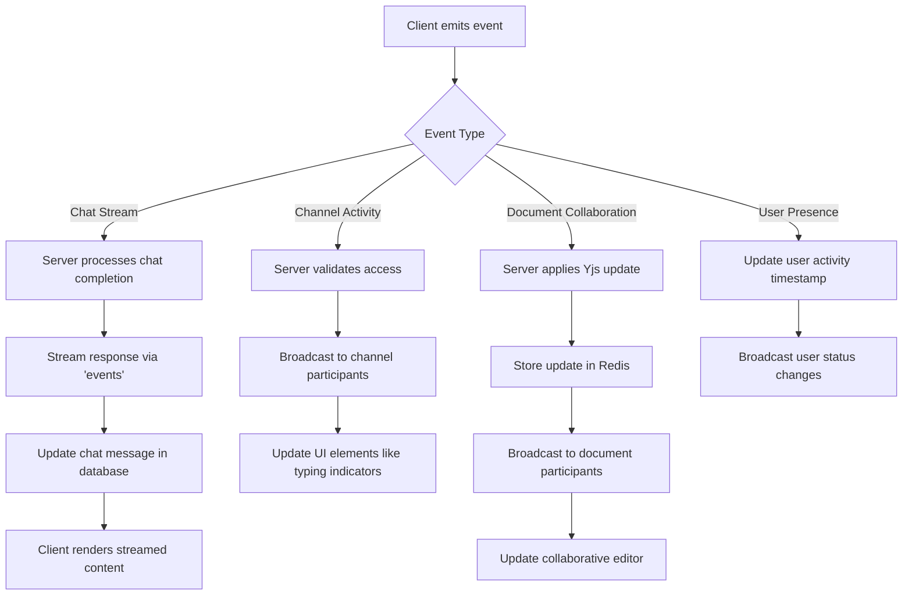
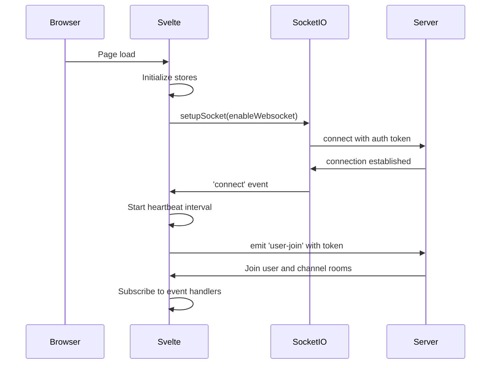
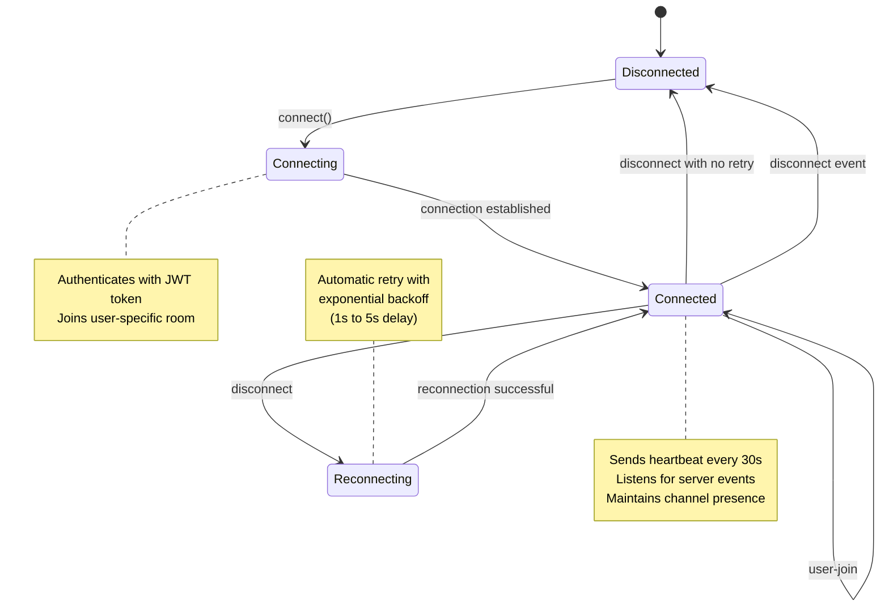
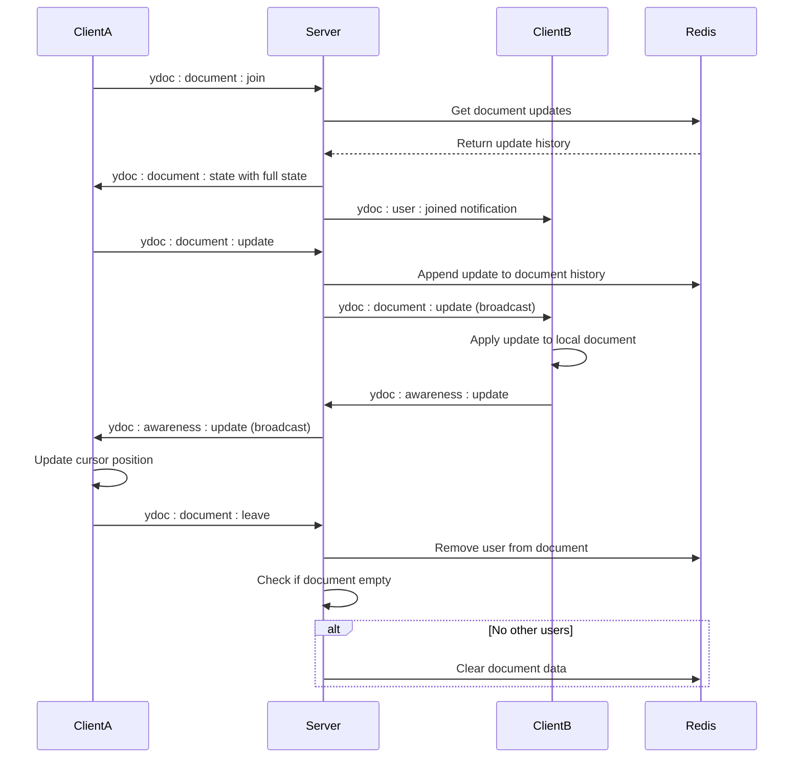
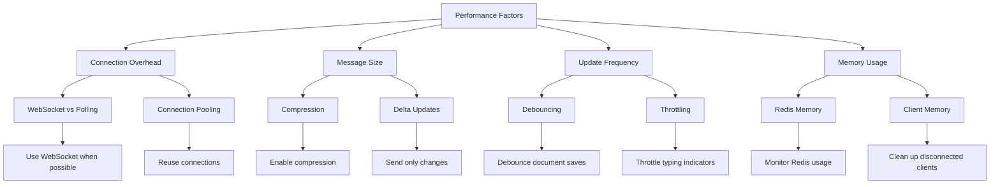
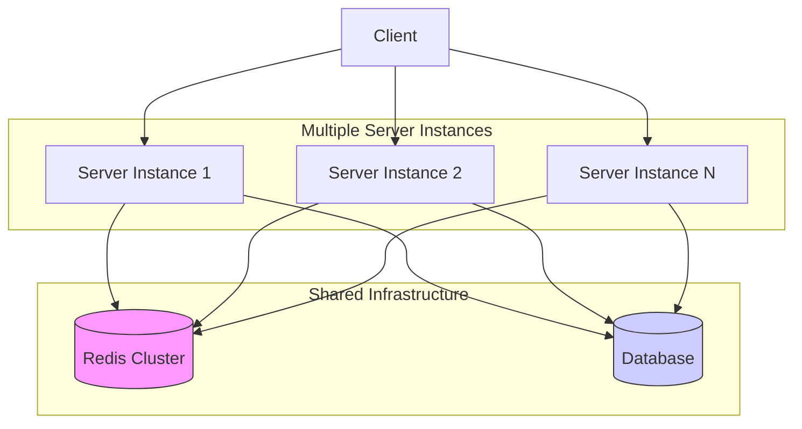

# WebSocket Implementation

<cite>
**Referenced Files in This Document**   
- [main.py](file://backend/open_webui/socket/main.py)
- [utils.py](file://backend/open_webui/socket/utils.py)
- [+layout.svelte](file://src/routes/+layout.svelte)
- [Channel.svelte](file://src/lib/components/channel/Channel.svelte)
- [index.ts](file://src/lib/stores/index.ts)
- [env.py](file://backend/open_webui/env.py)
</cite>

## Table of Contents
1. [Introduction](#introduction)
2. [WebSocket Server Architecture](#websocket-server-architecture)
3. [Connection Protocol and Authentication](#connection-protocol-and-authentication)
4. [Event Types and Message Formats](#event-types-and-message-formats)
5. [Real-time Interaction Patterns](#real-time-interaction-patterns)
6. [Client-side Implementation](#client-side-implementation)
7. [Connection Lifecycle Management](#connection-lifecycle-management)
8. [Data Synchronization with Yjs](#data-synchronization-with-yjs)
9. [Performance Considerations](#performance-considerations)
10. [Scaling Strategies](#scaling-strategies)
11. [Debugging Approaches](#debugging-approaches)

## Introduction
The open-webui application implements a comprehensive WebSocket system using Socket.IO for real-time communication between clients and the server. This documentation details the WebSocket implementation, covering the connection protocol, message formats, event types, and real-time interaction patterns. The system integrates Socket.IO with FastAPI to handle client connections, authentication, and event broadcasting, enabling features like chat messaging, model status updates, and collaborative document editing.

**Section sources**
- [main.py](file://backend/open_webui/socket/main.py#L1-L103)

## WebSocket Server Architecture



**Diagram sources**
- [main.py](file://backend/open_webui/socket/main.py#L64-L103)
- [env.py](file://backend/open_webui/env.py#L618-L677)

The WebSocket server architecture in open-webui is built on Socket.IO integrated with FastAPI. The server can operate in two modes: standalone or with Redis as a message broker for horizontal scaling. When Redis is configured as the manager (WEBSOCKET_MANAGER="redis"), the system uses Redis to synchronize state across multiple server instances, enabling the application to scale horizontally. The server configuration includes customizable ping intervals and timeouts, with default values of 25 seconds for ping interval and 20 seconds for ping timeout.

The architecture includes several key components:
- **Socket.IO Server**: Handles WebSocket connections and event broadcasting
- **Redis**: Used for distributed state management when configured
- **Yjs Document Manager**: Manages collaborative document editing with real-time synchronization
- **Session Pool**: Tracks active user sessions and their authentication state
- **Usage Pool**: Monitors model usage across connections

**Section sources**
- [main.py](file://backend/open_webui/socket/main.py#L64-L140)
- [env.py](file://backend/open_webui/env.py#L618-L677)

## Connection Protocol and Authentication



**Diagram sources**
- [main.py](file://backend/open_webui/socket/main.py#L303-L317)
- [main.py](file://backend/open_webui/socket/main.py#L318-L351)

The WebSocket connection protocol in open-webui begins with client authentication using JWT tokens. When a client attempts to connect, it sends an authentication object containing a token. The server decodes this token to verify the user's identity and retrieves the corresponding user information from the database. Upon successful authentication, the server stores the user's information in the SESSION_POOL and assigns the client to a user-specific room (user:{user.id}) for targeted message broadcasting.

The connection process includes several security measures:
- Token validation using the decode_token function
- User existence verification in the database
- Selective field exclusion when storing user data (excluding sensitive information like date_of_birth and bio)
- Room-based access control for channel and note collaboration

The system also supports a "user-join" event that clients can emit after establishing a connection, which triggers additional room joining for all channels the user has access to, ensuring proper access control and presence awareness.

**Section sources**
- [main.py](file://backend/open_webui/socket/main.py#L303-L351)
- [main.py](file://backend/open_webui/socket/main.py#L361-L381)

## Event Types and Message Formats



**Diagram sources**
- [main.py](file://backend/open_webui/socket/main.py#L288-L301)
- [main.py](file://backend/open_webui/socket/main.py#L354-L359)
- [main.py](file://backend/open_webui/socket/main.py#L413-L447)

The open-webui WebSocket implementation supports several event types, each with specific message formats and usage scenarios:

### Core Event Types

**user-join**: Emitted by clients after connection to authenticate and join user-specific rooms. Payload includes authentication token and triggers room assignment for all accessible channels.

**heartbeat**: Sent by clients every 30 seconds to maintain connection and update user activity status. The server responds by updating the user's last_active_at timestamp in the database.

**events**: Used for chat message streaming and status updates. Payload includes chat_id, message_id, and event data with various types:
- status: Updates to message processing status
- message: Streaming chat response content
- replace: Complete replacement of message content
- embeds: Embedded content additions
- files: File attachments
- source/citation: Source references for generated content

**events:channel**: Handles channel-specific interactions including:
- typing: Indicates when a user is typing in a channel
- last_read_at: Updates the user's read position in a channel

**usage**: Reports model usage for monitoring and potential billing purposes. Includes the model ID being used.

### Yjs Collaboration Events

The system implements Yjs for real-time collaborative editing with the following events:

**ydoc:document:join**: Initiates collaboration on a document (e.g., notes). The server responds with the current document state and notifies other collaborators.

**ydoc:document:update**: Broadcasts document changes from one client to others. The server stores updates in Redis and forwards them to all connected clients except the sender.

**ydoc:awareness:update**: Handles cursor positions and selection states for collaborative editing awareness.

**ydoc:document:leave**: Signals that a user has left a document, triggering cleanup if no other users remain.

**Section sources**
- [main.py](file://backend/open_webui/socket/main.py#L288-L301)
- [main.py](file://backend/open_webui/socket/main.py#L354-L359)
- [main.py](file://backend/open_webui/socket/main.py#L413-L447)
- [main.py](file://backend/open_webui/socket/main.py#L448-L662)

## Real-time Interaction Patterns



**Diagram sources**
- [main.py](file://backend/open_webui/socket/main.py#L695-L838)
- [main.py](file://backend/open_webui/socket/main.py#L413-L447)
- [main.py](file://backend/open_webui/socket/main.py#L448-L662)

The real-time interaction patterns in open-webui follow a consistent pattern of event emission, server processing, and broadcast to relevant recipients. For chat interactions, when a user submits a message, the client establishes a WebSocket connection and the server streams the AI response through the 'events' channel, updating the message content incrementally as tokens are generated.

Channel-based interactions use Socket.IO rooms to efficiently broadcast events to all participants. When a user types in a channel, the 'events:channel' event with type 'typing' is broadcast to all other participants, enabling real-time typing indicators. Similarly, when a user reads messages, the 'last_read_at' event updates their read position, which is reflected in the UI for other users.

The system implements a sophisticated document collaboration model using Yjs, where document updates are stored as operational transforms in Redis. This enables multiple users to edit the same document simultaneously with automatic conflict resolution. The server acts as the source of truth, storing all document updates and broadcasting them to connected clients.

User presence and activity are tracked through periodic heartbeat events and connection/disconnection handlers, allowing the system to maintain accurate user status information across the application.

**Section sources**
- [main.py](file://backend/open_webui/socket/main.py#L695-L838)
- [main.py](file://backend/open_webui/socket/main.py#L413-L447)
- [main.py](file://backend/open_webui/socket/main.py#L448-L662)

## Client-side Implementation



**Diagram sources**
- [+layout.svelte](file://src/routes/+layout.svelte#L97-L177)
- [index.ts](file://src/lib/stores/index.ts#L28-L31)

The client-side WebSocket implementation in open-webui is built with Svelte and follows a structured initialization pattern. The connection is established in the +layout.svelte file, which serves as the root layout component for the application. The setupSocket function initializes the Socket.IO client with appropriate configuration, including reconnection settings and authentication.

Key aspects of the client implementation:

**Connection Management**: The client uses Socket.IO with automatic reconnection enabled, configured with a reconnection delay of 1-5 seconds. The path is set to '/ws/socket.io' to match the server configuration.

**Authentication**: The client sends the authentication token in the connection handshake using the auth property, which contains the JWT token from localStorage.

**Heartbeat System**: After connection, the client establishes a heartbeat interval that sends a 'heartbeat' event every 30 seconds to maintain the connection and update user activity status.

**Event Handling**: The client subscribes to various event handlers for different types of real-time updates, including chat events, channel events, and document collaboration events.

**State Management**: Svelte stores are used to manage WebSocket state, including the socket connection, active user IDs, and usage pool information, enabling reactive updates across the application.

**Section sources**
- [+layout.svelte](file://src/routes/+layout.svelte#L97-L177)
- [index.ts](file://src/lib/stores/index.ts#L28-L31)
- [Channel.svelte](file://src/lib/components/channel/Channel.svelte#L246-L247)

## Connection Lifecycle Management



**Diagram sources**
- [main.py](file://backend/open_webui/socket/main.py#L684-L693)
- [+layout.svelte](file://src/routes/+layout.svelte#L156-L177)

The connection lifecycle management in open-webui follows a robust pattern designed to maintain reliable real-time communication even under unstable network conditions. The lifecycle consists of several states: Disconnected, Connecting, Connected, and Reconnecting.

When a client connects, it goes through the Connecting state where it authenticates with a JWT token and joins appropriate rooms based on the user's permissions. Once connected, the client enters the Connected state and establishes a heartbeat interval that sends a 'heartbeat' event every 30 seconds to maintain the connection and update the user's last active timestamp.

The system implements comprehensive disconnection handling:
- The server removes the user from SESSION_POOL when a disconnect event is received
- The Yjs document manager removes the user from all documents they were editing
- Client-side cleanup occurs through the disconnect event handler

For connection recovery, Socket.IO's built-in reconnection mechanism is used with exponential backoff (1-5 seconds). The client automatically attempts to reconnect, preserving the authentication state through the stored JWT token. This ensures that users maintain their session even after temporary network interruptions.

The server also implements periodic cleanup of the usage pool, removing connections that have not sent updates within the TIMEOUT_DURATION (3 seconds), which helps maintain accurate model usage tracking.

**Section sources**
- [main.py](file://backend/open_webui/socket/main.py#L684-L693)
- [+layout.svelte](file://src/routes/+layout.svelte#L132-L137)
- [main.py](file://backend/open_webui/socket/main.py#L167-L216)

## Data Synchronization with Yjs



**Diagram sources**
- [main.py](file://backend/open_webui/socket/main.py#L448-L662)
- [utils.py](file://backend/open_webui/socket/utils.py#L120-L224)

The open-webui application implements real-time collaborative editing using Yjs, a CRDT-based framework for conflict-free replicated data types. This enables multiple users to edit the same document simultaneously without conflicts, with changes automatically synchronized across all clients.

The data synchronization process works as follows:

**Document Joining**: When a user joins a document (typically a note), the server retrieves the complete update history from Redis and sends it to the client as an initial state. This ensures the client has the complete document state before beginning collaboration.

**Update Propagation**: As users make changes, their clients send updates to the server, which appends them to the document's update history in Redis and broadcasts them to all other connected clients. The server acts as the authoritative source of truth, preventing direct client-to-client synchronization that could lead to inconsistencies.

**Awareness Sharing**: In addition to document content, the system shares awareness information such as cursor positions and selection states. This enables features like seeing where other users are editing and who is currently active on the document.

**Automatic Cleanup**: When a user leaves a document, the server removes them from the document's user list. If no users remain, the server can optionally clean up the document data from Redis to conserve memory, though this behavior may depend on application requirements for document persistence.

The Yjs implementation is integrated with Redis for persistent storage of document updates, allowing the system to maintain document state across server restarts and enabling horizontal scaling with multiple server instances.

**Section sources**
- [main.py](file://backend/open_webui/socket/main.py#L448-L662)
- [utils.py](file://backend/open_webui/socket/utils.py#L120-L224)

## Performance Considerations



**Diagram sources**
- [main.py](file://backend/open_webui/socket/main.py#L584-L626)
- [main.py](file://backend/open_webui/socket/main.py#L167-L216)

The WebSocket implementation in open-webui incorporates several performance optimizations to ensure efficient real-time communication:

**Connection Efficiency**: The system prefers WebSocket transport over polling when enabled (controlled by ENABLE_WEBSOCKET_SUPPORT), reducing connection overhead and latency. The server configuration includes optimized ping intervals (25 seconds) and timeouts (20 seconds) to balance connection reliability with network efficiency.

**Message Optimization**: For document collaboration, the system uses Yjs's efficient update format, which represents changes as operational transforms rather than sending complete document states. This significantly reduces message size, especially for large documents with small changes.

**Update Throttling**: The implementation includes debouncing for document saves, with a 500ms delay before persisting changes to the database. This prevents excessive database writes during rapid editing and improves overall system performance.

**Memory Management**: The server implements periodic cleanup of the usage pool, removing stale connections that haven't sent updates within the timeout period. This prevents memory leaks and ensures accurate model usage tracking.

**Scalability Features**: When using Redis as the message broker, the system can scale horizontally across multiple server instances. The Redis-backed SESSION_POOL and USAGE_POOL ensure consistent state across all instances.

**Client-side Optimization**: The Svelte implementation uses stores to manage WebSocket state efficiently, minimizing unnecessary re-renders and ensuring reactive updates only when needed.

**Section sources**
- [main.py](file://backend/open_webui/socket/main.py#L584-L626)
- [main.py](file://backend/open_webui/socket/main.py#L167-L216)
- [env.py](file://backend/open_webui/env.py#L651-L661)

## Scaling Strategies



**Diagram sources**
- [main.py](file://backend/open_webui/socket/main.py#L64-L87)
- [env.py](file://backend/open_webui/env.py#L618-L642)

The open-webui WebSocket implementation supports several scaling strategies to accommodate growing user bases and maintain performance:

**Horizontal Scaling with Redis**: The primary scaling strategy involves using Redis as the Socket.IO message broker (configured with WEBSOCKET_MANAGER="redis"). This allows multiple server instances to share connection state and broadcast messages across the entire system. When a client connects to any server instance, messages can be broadcast to clients connected to other instances through Redis pub/sub mechanisms.

**Redis Sentinel Support**: For high availability, the system supports Redis Sentinel for automatic failover and master election. This is configured through WEBSOCKET_SENTINEL_HOSTS and WEBSOCKET_SENTINEL_PORT environment variables, enabling resilient Redis connectivity.

**Connection Load Balancing**: With Redis as the message broker, load balancers can distribute WebSocket connections across multiple server instances without concern for session affinity, as all instances have access to the same connection state through Redis.

**Resource Isolation**: The implementation separates WebSocket management from the main application logic, allowing independent scaling of real-time communication infrastructure. The periodic_usage_pool_cleanup task runs as a separate background process, preventing it from impacting request handling performance.

**Memory Optimization**: By storing session and usage data in Redis rather than in-memory dictionaries, the system reduces memory pressure on individual server instances and enables more efficient resource utilization.

The scaling configuration is controlled through environment variables that allow deployment-specific tuning of Redis connections, lock timeouts, and cluster settings to match the infrastructure requirements.

**Section sources**
- [main.py](file://backend/open_webui/socket/main.py#L64-L87)
- [env.py](file://backend/open_webui/env.py#L618-L642)

## Debugging Approaches

```mermaid
flowchart TD
A[Debugging Methods] --> B[Server Logging]
A --> C[Client Console]
A --> D[Network Inspection]
A --> E[Redis Monitoring]
B --> F[SOCKET Log Level]
B --> G[Event Tracing]
C --> H[Socket Events]
C --> I[Connection State]
D --> J[WebSocket Frames]
D --> K[Message Payloads]
E --> L[Redis Keys]
E --> M[Pub/Sub Channels]
F --> N[Set SRC_LOG_LEVELS["SOCKET"]]
G --> O[Log event emissions]
H --> P[Monitor event handlers]
I --> Q[Check connection status]
J --> R[Inspect frame types]
K --> S[Validate message structure]
L --> T[Check session data]
M --> U[Monitor broadcast channels]
```

**Diagram sources**
- [main.py](file://backend/open_webui/socket/main.py#L54-L56)
- [env.py](file://backend/open_webui/env.py#L75-L111)

The open-webui WebSocket implementation includes several debugging approaches to facilitate troubleshooting and monitoring:

**Server-side Debugging**: The system uses Python's logging module with configurable log levels. The SOCKET log level can be set independently through the SRC_LOG_LEVELS["SOCKET"] environment variable, allowing detailed tracing of WebSocket events without increasing verbosity for other components. The implementation includes debug logs for key operations like room joining, connection cleanup, and Redis interactions.

**Client-side Debugging**: The Svelte frontend includes console logging for socket events, connection status changes, and error conditions. Developers can monitor the browser console to observe the connection lifecycle, event emissions, and any connection errors.

**Network Inspection**: Since WebSocket communication occurs over a persistent connection, developers can use browser developer tools to inspect WebSocket frames, including message payloads and types. This is particularly useful for verifying the structure of emitted events and ensuring proper authentication.

**Redis Monitoring**: When Redis is used as the message broker, monitoring Redis keys and pub/sub channels provides insight into the distributed state. Key patterns like {REDIS_KEY_PREFIX}:session_pool and {REDIS_KEY_PREFIX}:usage_pool can be inspected to verify session data and usage tracking.

**Error Handling**: The implementation includes comprehensive error handling with try-catch blocks around critical operations, particularly those involving Redis connections and document updates. Errors are logged with context to facilitate diagnosis.

**Configuration Testing**: The system's behavior can be adjusted through environment variables for testing different scenarios, such as disabling WebSocket support (ENABLE_WEBSOCKET_SUPPORT=false) to test fallback to polling, or configuring different Redis connection settings for staging environments.

**Section sources**
- [main.py](file://backend/open_webui/socket/main.py#L54-L56)
- [env.py](file://backend/open_webui/env.py#L75-L111)
- [main.py](file://backend/open_webui/socket/main.py#L268-L269)