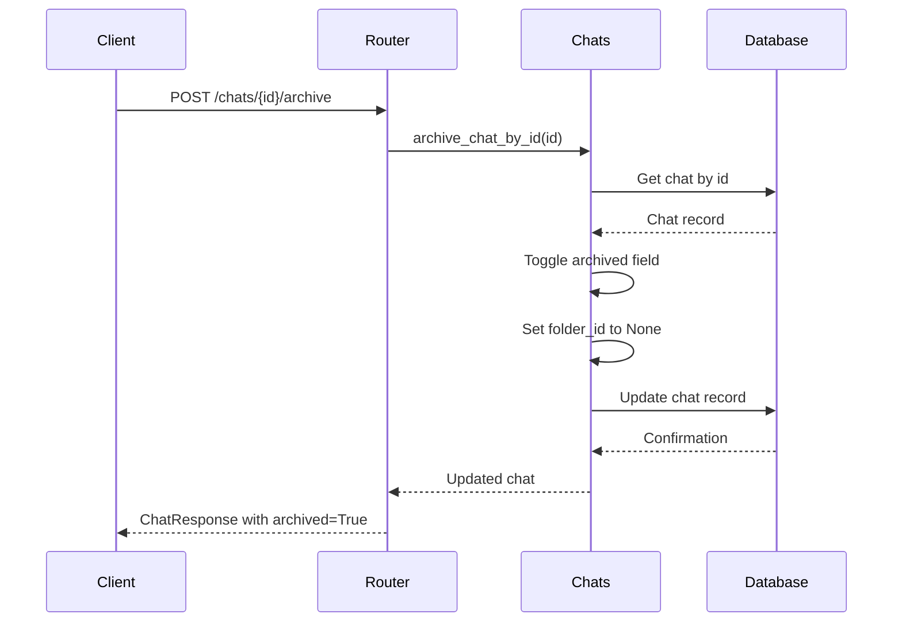
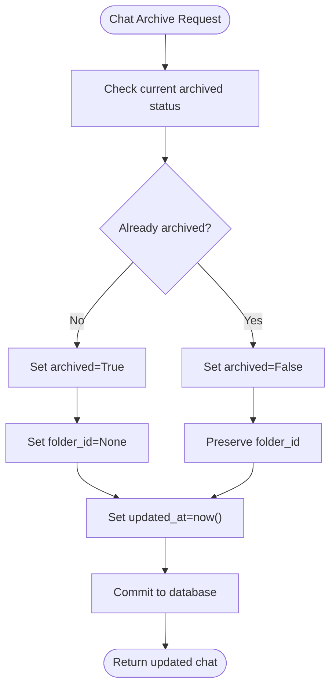
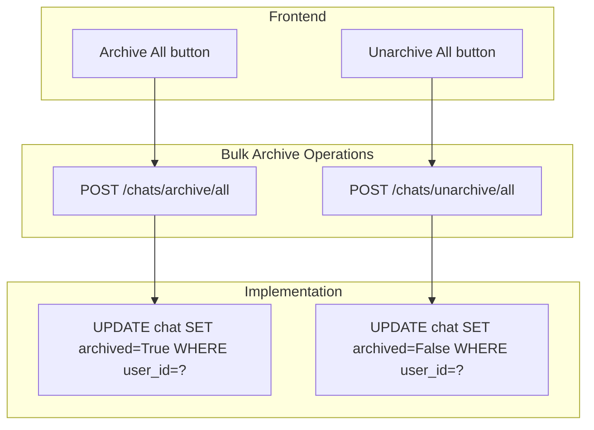
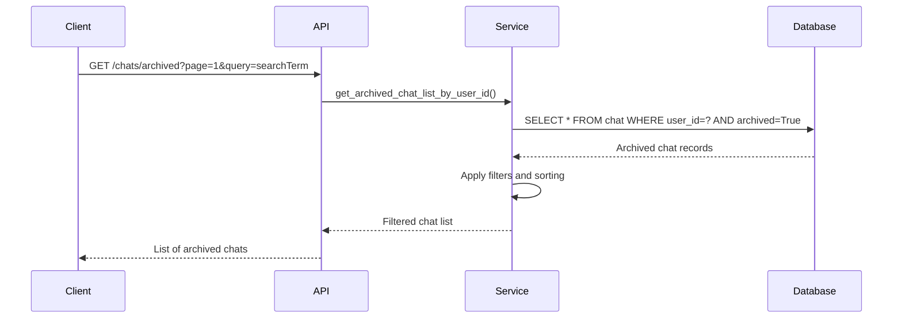
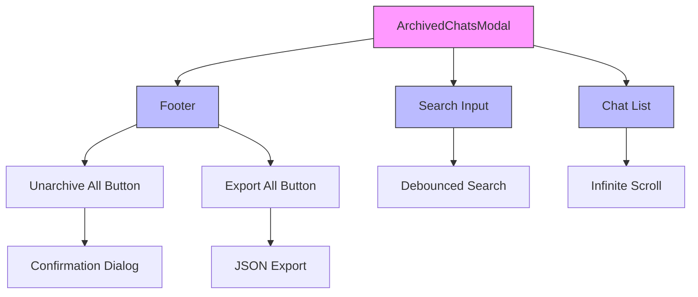

# Chat Archiving

<cite>
**Referenced Files in This Document**   
- [chats.py](file://backend/open_webui/models/chats.py)
- [chats.py](file://backend/open_webui/routers/chats.py)
- [ArchivedChatsModal.svelte](file://src/lib/components/layout/ArchivedChatsModal.svelte)
- [004_add_archived.py](file://backend/open_webui/internal/migrations/004_add_archived.py)
- [018012973d35_add_indexes.py](file://backend/open_webui/migrations/versions/018012973d35_add_indexes.py)
- [index.ts](file://src/lib/apis/chats/index.ts)
</cite>

## Table of Contents
1. [Introduction](#introduction)
2. [Chat Model Implementation](#chat-model-implementation)
3. [Archive/Unarchive Endpoints](#archiveunarchive-endpoints)
4. [Folder Management and Archiving](#folder-management-and-archiving)
5. [Bulk Archiving Operations](#bulk-archiving-operations)
6. [Retrieving Archived Chats](#retrieving-archived-chats)
7. [UI Components for Archived Chats](#ui-components-for-archived-chats)
8. [Database Indexing Strategy](#database-indexing-strategy)
9. [Common Issues and Considerations](#common-issues-and-considerations)

## Introduction
The chat archiving functionality in Open WebUI provides users with a systematic way to manage their conversation history by moving chats to an archived state. This feature enables users to declutter their active chat interface while preserving conversation history for future reference. The implementation centers around the `archived` boolean field in the Chat model, which defaults to `False` for new chats. When a chat is archived, it is removed from folders and regular view but remains accessible through dedicated endpoints and UI components. This documentation details the technical implementation, API endpoints, database optimizations, and user interface components that support the chat archiving lifecycle.

## Chat Model Implementation

The chat archiving functionality is built upon the Chat model, which includes an `archived` field to track the lifecycle state of each conversation. This field is implemented as a boolean with a default value of `False`, ensuring that all newly created chats are active by default. The model also includes comprehensive database indexing to optimize queries for both active and archived chats.

```mermaid
classDiagram
class Chat {
+id : String
+user_id : String
+title : Text
+chat : JSON
+created_at : BigInteger
+updated_at : BigInteger
+share_id : Text
+archived : Boolean = False
+pinned : Boolean = False
+meta : JSON
+folder_id : Text
}
Chat : +__table_args__ : Indexes for optimized queries
Chat : +archived field defaults to False
Chat : +folder_id set to null when archived
```

**Diagram sources**
- [chats.py](file://backend/open_webui/models/chats.py#L26-L56)

**Section sources**
- [chats.py](file://backend/open_webui/models/chats.py#L26-L75)

## Archive/Unarchive Endpoints

The chat archiving system exposes REST endpoints that allow users to toggle the archive status of individual chats. The primary endpoint `POST /chats/{id}/archive` handles both archiving and unarchiving operations by toggling the `archived` field value. When a chat is archived, the operation automatically removes it from any folder by setting the `folder_id` to `None`, while preserving the original folder assignment in case the chat is later unarchived.



**Diagram sources**
- [chats.py](file://backend/open_webui/routers/chats.py#L733-L757)
- [chats.py](file://backend/open_webui/models/chats.py#L473-L483)

**Section sources**
- [chats.py](file://backend/open_webui/routers/chats.py#L733-L757)
- [chats.py](file://backend/open_webui/models/chats.py#L473-L483)

## Folder Management and Archiving

When a chat is archived, it is automatically removed from its current folder while preserving the folder relationship for potential restoration. This behavior is implemented in the `toggle_chat_archive_by_id` method, which explicitly sets the `folder_id` to `None` when archiving a chat. This ensures that archived chats do not appear in folder views, maintaining a clean organization of active conversations. The original folder assignment is not deleted, allowing for seamless restoration of the chat to its previous organizational context when unarchived.



**Diagram sources**
- [chats.py](file://backend/open_webui/models/chats.py#L473-L483)

**Section sources**
- [chats.py](file://backend/open_webui/models/chats.py#L473-L483)

## Bulk Archiving Operations

The system supports bulk archiving operations through dedicated endpoints that allow users to archive or unarchive all their chats at once. These operations are particularly useful for users who want to reset their chat interface or organize their conversation history in bulk. The implementation uses efficient database operations to update multiple records without individual row processing, ensuring optimal performance even with large chat histories.



**Diagram sources**
- [chats.py](file://backend/open_webui/routers/chats.py#L354-L367)
- [chats.py](file://backend/open_webui/models/chats.py#L486-L493)

**Section sources**
- [chats.py](file://backend/open_webui/routers/chats.py#L354-L367)
- [chats.py](file://backend/open_webui/models/chats.py#L486-L493)

## Retrieving Archived Chats

The system provides dedicated endpoints for retrieving archived chats, allowing users to access their archived conversation history. The `GET /chats/archived` endpoint returns a list of archived chats with support for pagination, filtering, and sorting. This enables users to efficiently browse and search through their archived conversations. The implementation includes optimized database queries that leverage the index on the `archived` field for fast retrieval.



**Diagram sources**
- [chats.py](file://backend/open_webui/routers/chats.py#L314-L347)
- [chats.py](file://backend/open_webui/models/chats.py#L495-L534)

**Section sources**
- [chats.py](file://backend/open_webui/routers/chats.py#L314-L347)
- [chats.py](file://backend/open_webui/models/chats.py#L495-L534)

## UI Components for Archived Chats

The frontend implementation includes a dedicated modal component for managing archived chats, providing users with a comprehensive interface to view, search, and restore their archived conversations. The `ArchivedChatsModal.svelte` component displays a list of archived chats with search functionality, export options, and bulk unarchive capabilities. This modal is accessible from the main interface, allowing users to easily switch between active and archived conversations.



**Diagram sources**
- [ArchivedChatsModal.svelte](file://src/lib/components/layout/ArchivedChatsModal.svelte#L1-L189)

**Section sources**
- [ArchivedChatsModal.svelte](file://src/lib/components/layout/ArchivedChatsModal.svelte#L1-L189)

## Database Indexing Strategy

The chat archiving functionality is supported by a comprehensive database indexing strategy that optimizes queries for both active and archived chats. The system includes a composite index on `user_id` and `archived` fields, enabling efficient filtering of chats based on their archive status. This index ensures that queries for active chats (archived=False) and archived chats (archived=True) perform optimally, even with large datasets.

```mermaid
erDiagram
CHAT {
string id PK
string user_id
text title
json chat
bigint created_at
bigint updated_at
text share_id
boolean archived
boolean pinned
json meta
text folder_id
}
CHAT ||--o{ USER : belongs_to
CHAT }o--|| FOLDER : contained_in
INDEX "user_id_archived_idx" on CHAT(user_id, archived)
INDEX "folder_id_idx" on CHAT(folder_id)
INDEX "updated_at_user_id_idx" on CHAT(updated_at, user_id)
```

**Diagram sources**
- [018012973d35_add_indexes.py](file://backend/open_webui/migrations/versions/018012973d35_add_indexes.py#L18-L24)
- [chats.py](file://backend/open_webui/models/chats.py#L44-L56)

**Section sources**
- [018012973d35_add_indexes.py](file://backend/open_webui/migrations/versions/018012973d35_add_indexes.py#L18-L24)
- [chats.py](file://backend/open_webui/models/chats.py#L44-L56)

## Common Issues and Considerations

Several common issues and considerations arise with the chat archiving functionality. Accidental archiving can occur when users mistakenly click the archive button, potentially removing important conversations from immediate view. The system addresses this by providing easy restoration through the archived chats modal. Additionally, archived chats are excluded from regular search results by default, which may lead to confusion when users cannot find specific conversations. The search functionality includes options to include archived chats in results, but this requires explicit user action.

Another consideration is the impact on chat organization. Since archiving removes chats from folders, users may need to reorganize their chats after unarchiving them. The system preserves the original folder assignment, but users must manually reassign chats to folders after restoration. This design choice balances automatic cleanup with the preservation of organizational context.

**Section sources**
- [chats.py](file://backend/open_webui/models/chats.py#L473-L483)
- [ArchivedChatsModal.svelte](file://src/lib/components/layout/ArchivedChatsModal.svelte#L1-L189)