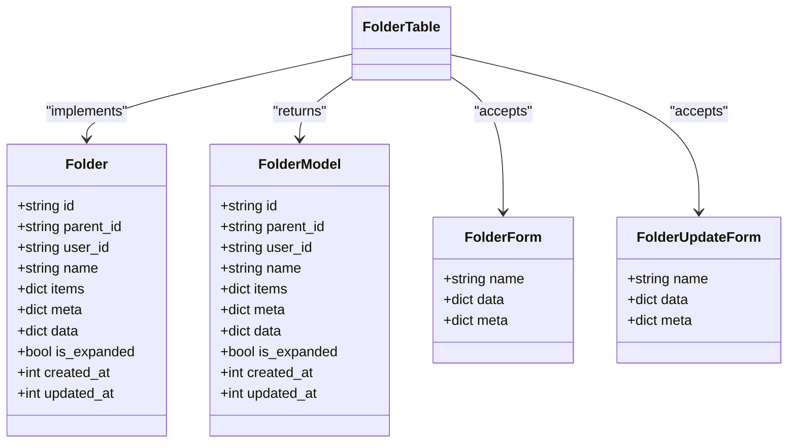
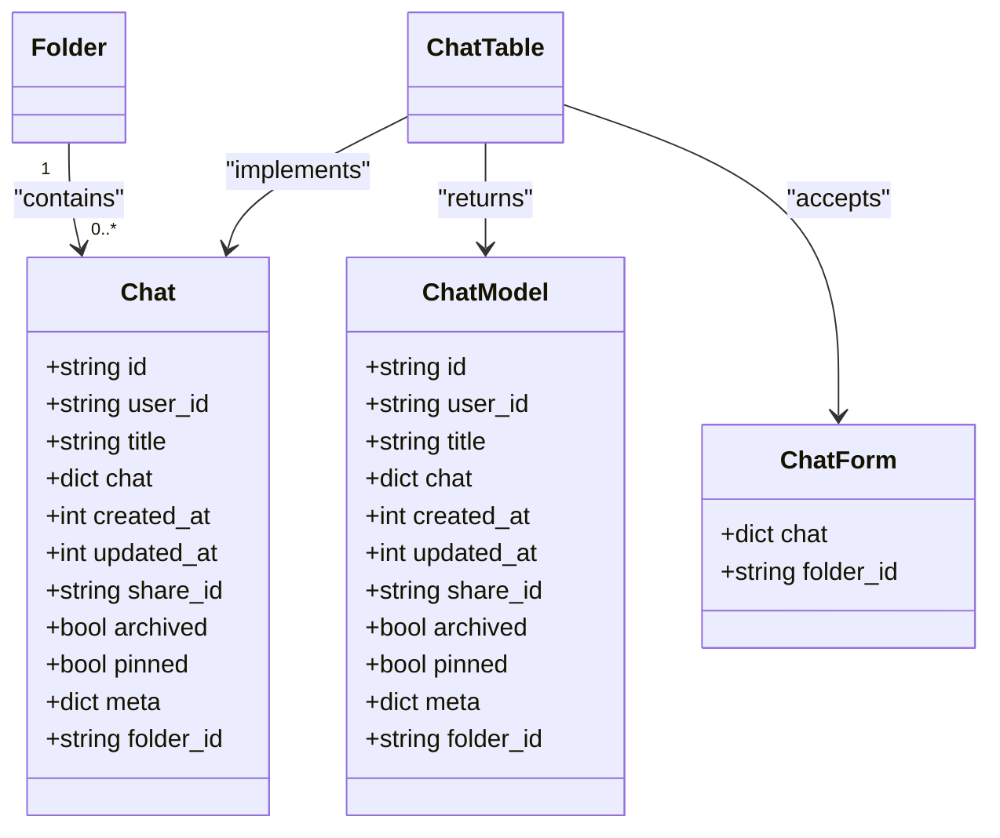
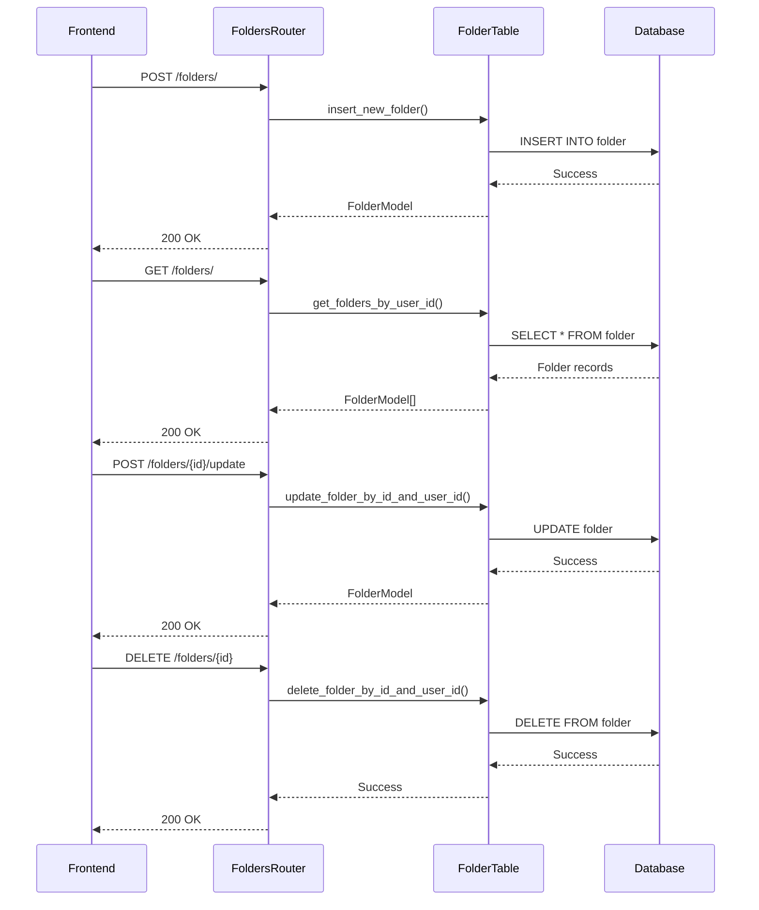
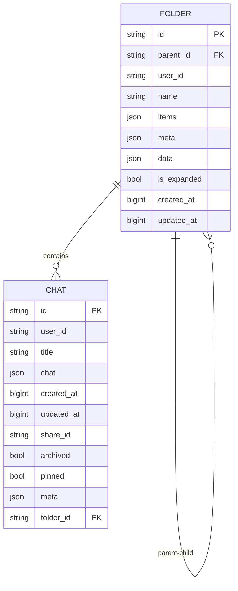
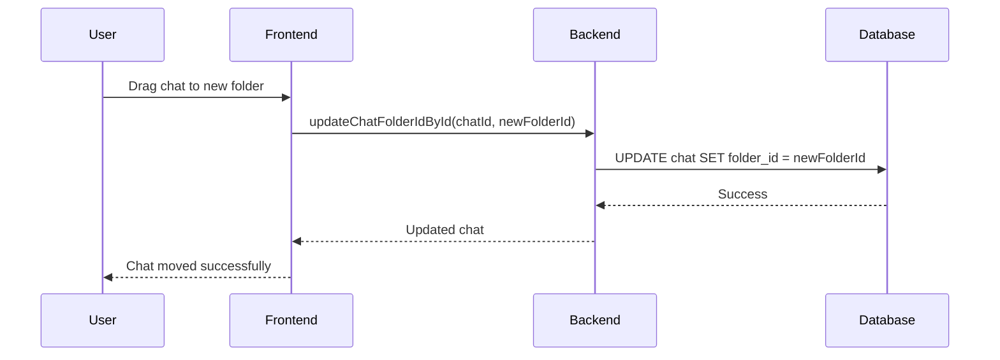
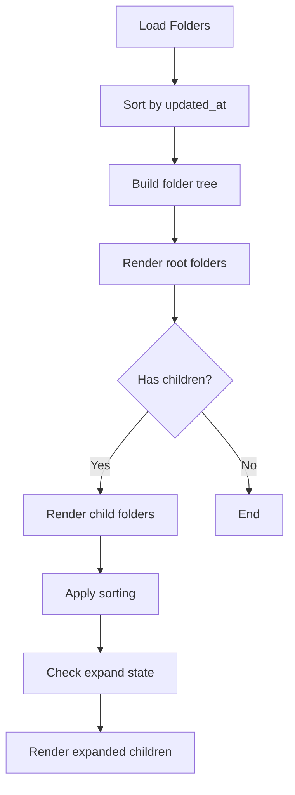
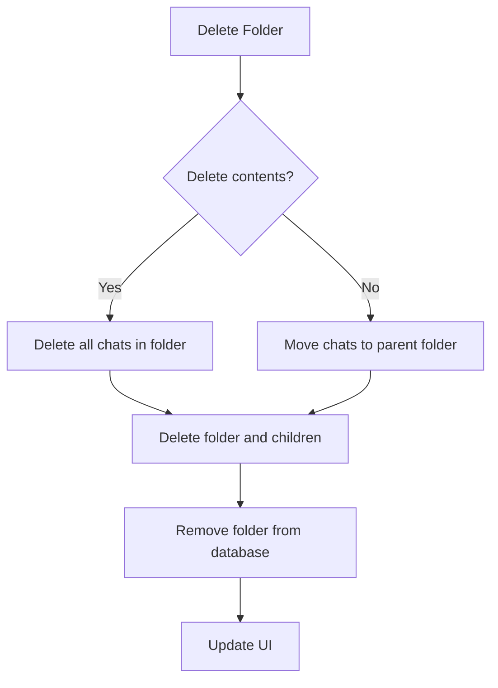
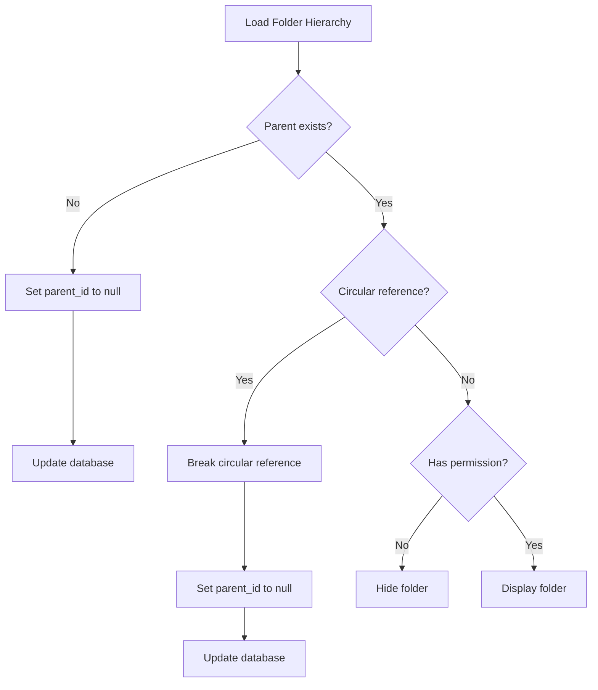

# Chat Folders

<cite>
**Referenced Files in This Document**   
- [folders.py](file://backend/open_webui/models/folders.py)
- [chats.py](file://backend/open_webui/models/chats.py)
- [folders.py](file://backend/open_webui/routers/folders.py)
- [chats.py](file://backend/open_webui/routers/chats.py)
- [Folder.svelte](file://src/lib/components/common/Folder.svelte)
- [index.ts](file://src/lib/apis/folders/index.ts)
- [Sidebar.svelte](file://src/lib/components/layout/Sidebar.svelte)
- [c69f45358db4_add_folder_table.py](file://backend/open_webui/migrations/versions/c69f45358db4_add_folder_table.py)
- [018012973d35_add_indexes.py](file://backend/open_webui/migrations/versions/018012973d35_add_indexes.py)
</cite>

## Table of Contents
1. [Introduction](#introduction)
2. [Folder Model Implementation](#folder-model-implementation)
3. [Chat Model Integration](#chat-model-integration)
4. [Folder CRUD Operations](#folder-crud-operations)
5. [Frontend Components](#frontend-components)
6. [Database Schema and Indexes](#database-schema-and-indexes)
7. [Practical Examples](#practical-examples)
8. [Common Issues and Edge Cases](#common-issues-and-edge-cases)

## Introduction
The chat folders sub-feature provides a hierarchical organization system for chats, enabling users to create nested folder structures to better manage their conversations. This documentation details the implementation of this feature, focusing on the folder_id field in the Chat model, the Folder model relationship, CRUD operations through the folders router, frontend components for drag-and-drop organization, and database optimizations. The system supports nested folder structures with proper access control and referential integrity.

## Folder Model Implementation

The Folder model implements a hierarchical structure with parent-child relationships, allowing for nested folder organization. Each folder is associated with a specific user and can contain chats and other folders.



**Diagram sources**
- [folders.py](file://backend/open_webui/models/folders.py#L24-L48)

**Section sources**
- [folders.py](file://backend/open_webui/models/folders.py#L1-L367)

## Chat Model Integration

The Chat model integrates with the folder system through the folder_id field, establishing a relationship between chats and their containing folders. This field enables efficient querying and organization of chats within the hierarchical folder structure.



**Diagram sources**
- [chats.py](file://backend/open_webui/models/chats.py#L26-L42)

**Section sources**
- [chats.py](file://backend/open_webui/models/chats.py#L1-L1175)

## Folder CRUD Operations

The folders router provides comprehensive CRUD operations for managing folders, including creation, retrieval, updating, and deletion. These operations include validation rules and access control to ensure data integrity and security.



**Diagram sources**
- [folders.py](file://backend/open_webui/routers/folders.py#L48-L328)
- [folders.py](file://backend/open_webui/models/folders.py#L86-L367)

**Section sources**
- [folders.py](file://backend/open_webui/routers/folders.py#L1-L328)

## Frontend Components

The frontend implementation provides a rich user interface for managing chat folders, including drag-and-drop functionality, folder creation, and chat movement between folders. The components are designed to work seamlessly with the backend API.

```mermaid
flowchart TD
A[Folder Component] --> B[Drag and Drop]
A --> C[Expand/Collapse]
A --> D[Add Folder]
A --> E[Update Folder]
B --> F[onDragOver]
B --> G[onDrop]
B --> H[onDragLeave]
C --> I[localStorage State]
C --> J[Collapsible]
D --> K[createNewFolder API]
E --> L[updateFolderById API]
M[Folder API] --> N[createNewFolder]
M --> O[getFolders]
M --> P[updateFolderById]
M --> Q[updateFolderParentIdById]
M --> R[deleteFolderById]
N --> S[POST /folders/]
P --> T[POST /folders/{id}/update]
Q --> U[POST /folders/{id}/update/parent]
R --> V[DELETE /folders/{id}]
```

**Diagram sources**
- [Folder.svelte](file://src/lib/components/common/Folder.svelte#L1-L203)
- [index.ts](file://src/lib/apis/folders/index.ts#L1-L275)

**Section sources**
- [Folder.svelte](file://src/lib/components/common/Folder.svelte#L1-L203)
- [index.ts](file://src/lib/apis/folders/index.ts#L1-L275)
- [Sidebar.svelte](file://src/lib/components/layout/Sidebar.svelte#L1-L1319)

## Database Schema and Indexes

The database schema for chat folders includes optimized indexes to ensure efficient queries for folder-based operations. The schema evolution is tracked through migration files that document the changes to the database structure.



**Diagram sources**
- [c69f45358db4_add_folder_table.py](file://backend/open_webui/migrations/versions/c69f45358db4_add_folder_table.py#L1-L50)
- [chats.py](file://backend/open_webui/models/chats.py#L26-L56)

The database includes several indexes to optimize folder-based queries:

| Index Name | Table | Columns | Purpose |
|------------|-------|---------|---------|
| folder_id_idx | chat | folder_id | Optimizes queries filtering by folder_id |
| user_id_pinned_idx | chat | user_id, pinned | Optimizes queries for pinned chats by user |
| user_id_archived_idx | chat | user_id, archived | Optimizes queries for archived chats by user |
| updated_at_user_id_idx | chat | updated_at, user_id | Optimizes queries ordering by updated_at |
| folder_id_user_id_idx | chat | folder_id, user_id | Optimizes queries filtering by folder_id and user_id |

**Section sources**
- [c69f45358db4_add_folder_table.py](file://backend/open_webui/migrations/versions/c69f45358db4_add_folder_table.py#L1-L50)
- [018012973d35_add_indexes.py](file://backend/open_webui/migrations/versions/018012973d35_add_indexes.py#L1-L47)

## Practical Examples

### Creating Nested Folder Structures
To create a nested folder structure, users can create parent folders and then create child folders within them. The system automatically handles the parent-child relationship through the parent_id field.

```mermaid
flowchart TD
A[Create "Projects" Folder] --> B[Create "Work" Folder]
B --> C[Set parent_id to "Projects"]
C --> D[Create "Personal" Folder]
D --> E[Set parent_id to "Projects"]
E --> F[Create "Client A" Folder]
F --> G[Set parent_id to "Work"]
```

### Moving Chats Between Folders
Chats can be moved between folders through the updateChatFolderIdById function, which updates the folder_id field in the Chat model.



### Displaying Folder Hierarchies in Sidebar
The sidebar component recursively renders folder hierarchies, maintaining expand/collapse state in localStorage for user preference persistence.



**Section sources**
- [Sidebar.svelte](file://src/lib/components/layout/Sidebar.svelte#L1-L1319)
- [chats.py](file://backend/open_webui/routers/chats.py#L201-L213)

## Common Issues and Edge Cases

### Maintaining Referential Integrity When Deleting Folders
When deleting folders, the system must handle referential integrity by either deleting or reassigning chats within the folder. The delete_folder_by_id_and_user_id method recursively deletes all child folders and provides options for handling contained chats.



### Handling Edge Cases in Nested Folder Displays
The system handles several edge cases in nested folder displays, including circular references, missing parent folders, and permission issues.



The system includes validation to prevent common issues:
- Folder name uniqueness within the same parent
- Prevention of circular folder references
- Validation of folder ownership before operations
- Proper cleanup of database references when folders are deleted

**Section sources**
- [folders.py](file://backend/open_webui/models/folders.py#L281-L311)
- [folders.py](file://backend/open_webui/routers/folders.py#L275-L328)