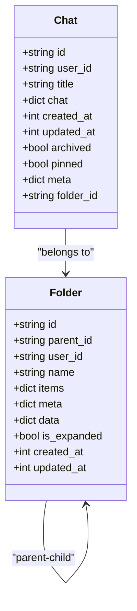
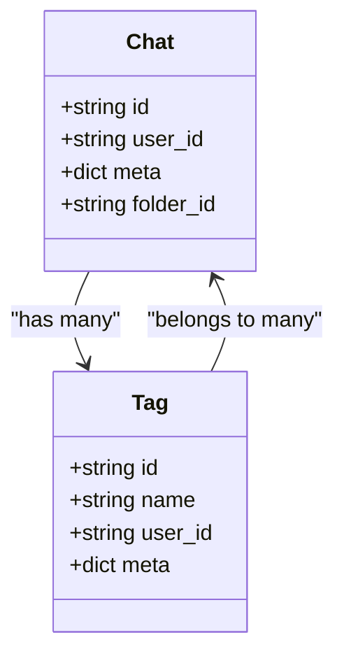
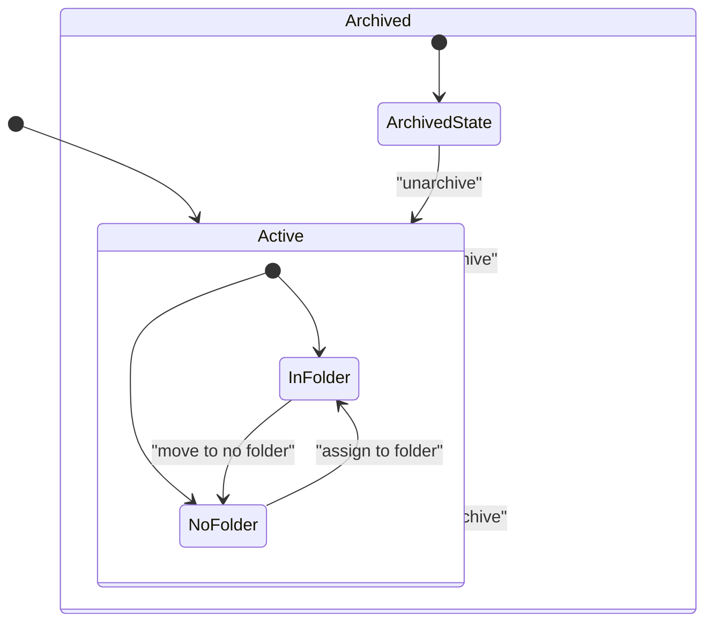
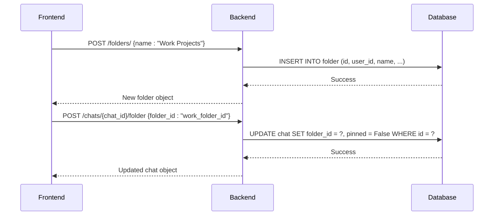
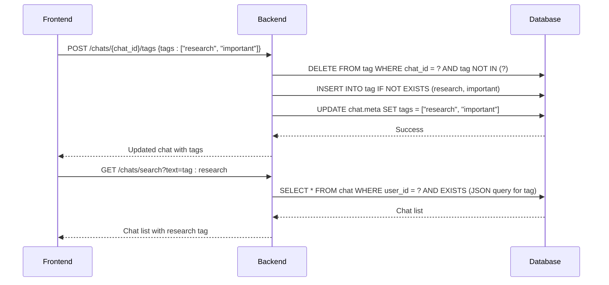

# Chat Organization

<cite>
**Referenced Files in This Document**   
- [chats.py](file://backend/open_webui/models/chats.py)
- [folders.py](file://backend/open_webui/models/folders.py)
- [tags.py](file://backend/open_webui/models/tags.py)
- [chats.py](file://backend/open_webui/routers/chats.py)
- [folders.py](file://backend/open_webui/routers/folders.py)
- [index.ts](file://src/lib/apis/chats/index.ts)
- [index.ts](file://src/lib/apis/folders/index.ts)
- [Folder.svelte](file://src/lib/components/common/Folder.svelte)
- [TagChatModal.svelte](file://src/lib/components/chat/TagChatModal.svelte)
</cite>

## Table of Contents
1. [Introduction](#introduction)
2. [Folder Organization](#folder-organization)
3. [Tagging System](#tagging-system)
4. [Archiving Functionality](#archiving-functionality)
5. [Database Indexes and Query Optimization](#database-indexes-and-query-optimization)
6. [Practical Examples](#practical-examples)
7. [Common Issues and Troubleshooting](#common-issues-and-troubleshooting)
8. [Conclusion](#conclusion)

## Introduction
The chat organization sub-feature in Open WebUI provides a comprehensive system for managing conversations through folders, tagging, and archiving. This documentation details the implementation of these features, focusing on how they enable users to efficiently organize, search, and manage their chat history. The system is designed with a hierarchical folder structure, a flexible tagging mechanism, and an archiving system that automatically removes archived chats from folders. The implementation leverages database-specific optimizations for different database engines while maintaining a consistent API interface.

**Section sources**
- [chats.py](file://backend/open_webui/models/chats.py#L1-L1175)
- [folders.py](file://backend/open_webui/models/folders.py#L1-L367)
- [tags.py](file://backend/open_webui/models/tags.py#L1-L115)

## Folder Organization

The folder organization system enables hierarchical chat organization through the `folder_id` field in the Chat model. Each chat can belong to a specific folder, allowing users to categorize their conversations. The Folder model supports a parent-child relationship through the `parent_id` field, enabling nested folder structures. When a chat is assigned to a folder, it appears in the folder's chat list, and when moved to another folder, it is automatically removed from the previous folder.

The system implements several key methods for folder management:
- `insert_new_folder`: Creates a new folder for a user
- `update_folder_parent_id_by_id_and_user_id`: Moves a folder to a different parent, enabling reorganization of the folder hierarchy
- `get_children_folders_by_id_and_user_id`: Retrieves all child folders recursively, which is essential for displaying nested folder structures
- `delete_folder_by_id_and_user_id`: Deletes a folder and all its children, with options to either delete or preserve the contained chats

When retrieving chats by folder, the system automatically includes chats from all child folders, providing a comprehensive view of all conversations within a folder hierarchy. The frontend component `Folder.svelte` implements drag-and-drop functionality for easy folder reorganization and maintains folder expansion state in local storage.

**Diagram sources**
- [chats.py](file://backend/open_webui/models/chats.py#L26-L56)
- [folders.py](file://backend/open_webui/models/folders.py#L24-L36)

**Section sources**
- [folders.py](file://backend/open_webui/models/folders.py#L87-L317)
- [folders.py](file://backend/open_webui/routers/folders.py#L111-L278)
- [Folder.svelte](file://src/lib/components/common/Folder.svelte#L1-L203)

## Tagging System

The tagging system stores tags in the `meta` JSON field of the Chat model, providing a flexible way to categorize chats without requiring schema changes. Tags are normalized by converting spaces to underscores and converting to lowercase, ensuring consistent tag names. The system uses a separate Tag model to maintain a registry of all tags, with a composite primary key of `id` and `user_id` to ensure uniqueness per user.

The tagging implementation supports database-specific queries for both SQLite and PostgreSQL:
- For SQLite, the system uses the JSON1 extension with `json_each` to query tags within the JSON field
- For PostgreSQL, it uses `json_array_elements_text` to extract and search tags from the JSON field

Key methods in the tagging system include:
- `add_chat_tag_by_id_and_user_id_and_tag_name`: Adds a tag to a chat and creates the tag in the registry if it doesn't exist
- `delete_tag_by_id_and_user_id_and_tag_name`: Removes a tag from a chat
- `get_chats_by_user_id_and_search_text`: Implements search functionality that can filter chats by tags using the `tag:tag_name` syntax
- `count_chats_by_tag_name_and_user_id`: Counts chats with a specific tag, used for determining when to clean up unused tags

The frontend `TagChatModal.svelte` component provides a user interface for managing tags, allowing users to add and remove tags from chats. The system automatically cleans up unused tags when a search for a non-existent tag returns no results, helping to maintain a clean tag registry.

**Diagram sources**
- [chats.py](file://backend/open_webui/models/chats.py#L31-L42)
- [tags.py](file://backend/open_webui/models/tags.py#L20-L30)

**Section sources**
- [tags.py](file://backend/open_webui/models/tags.py#L55-L114)
- [chats.py](file://backend/open_webui/models/chats.py#L261-L279)
- [chats.py](file://backend/open_webui/models/chats.py#L725-L770)
- [TagChatModal.svelte](file://src/lib/components/chat/TagChatModal.svelte#L1-L29)

## Archiving Functionality

The archiving functionality uses the `archived` boolean field in the Chat model to mark chats as archived. When a chat is archived, it is automatically removed from its folder (the `folder_id` is set to None) and excluded from regular chat lists. This provides a way to declutter the main chat interface while preserving the conversation history.

Key aspects of the archiving system include:
- `toggle_chat_archive_by_id`: Toggles the archived status of a chat, automatically clearing the `folder_id` when archiving
- `archive_all_chats_by_user_id`: Archives all chats for a user at once
- `unarchive_all_chats_by_user_id`: Unarchives all chats for a user
- Automatic tag cleanup: When a chat is archived and it was the last chat with a particular tag, the tag is automatically deleted from the registry

The system ensures that archived chats are not included in folder-based queries and are only accessible through the dedicated archived chats view. When a chat is unarchived, it can be reassigned to a folder, restoring its place in the folder hierarchy. The frontend provides a simple API for archiving chats through the `archiveChatById` function in the chats API.

**Diagram sources**
- [chats.py](file://backend/open_webui/models/chats.py#L38-L39)
- [chats.py](file://backend/open_webui/models/chats.py#L473-L483)

**Section sources**
- [chats.py](file://backend/open_webui/models/chats.py#L473-L483)
- [chats.py](file://backend/open_webui/models/chats.py#L486-L493)
- [chats.py](file://backend/open_webui/models/chats.py#L354-L366)
- [index.ts](file://src/lib/apis/chats/index.ts#L843-L873)

## Database Indexes and Query Optimization

The chat organization system implements several database indexes to optimize queries for common operations. These indexes are defined in the `__table_args__` of the Chat model and are crucial for maintaining performance as the number of chats grows.

The key indexes include:
- `folder_id_idx`: Optimizes queries filtering by folder_id
- `user_id_pinned_idx`: Optimizes queries for pinned chats by user
- `user_id_archived_idx`: Optimizes queries for archived status by user
- `updated_at_user_id_idx`: Optimizes queries ordering by updated_at for a specific user
- `folder_id_user_id_idx`: Optimizes queries filtering by both folder_id and user_id

These indexes ensure that operations like retrieving all chats in a folder, finding pinned chats, or listing archived chats remain performant even with large datasets. The system also implements pagination in all list retrieval methods to prevent performance issues with large result sets.

For tag-based searches, the system uses database-specific JSON querying capabilities rather than traditional indexes, as tags are stored in a JSON field. The query optimization differs between SQLite and PostgreSQL, with each database using its native JSON querying syntax to efficiently search within the JSON data.

**Section sources**
- [chats.py](file://backend/open_webui/models/chats.py#L44-L56)
- [chats.py](file://backend/open_webui/models/chats.py#L797-L905)
- [chats.py](file://backend/open_webui/models/chats.py#L977-L994)

## Practical Examples

### Creating Folders and Moving Chats
To create a new folder, use the `create_folder` endpoint with a FolderForm containing the folder name. The system will check for duplicate folder names and create the folder if it doesn't exist. To move a chat to a folder, use the `update_chat_folder_id_by_id_and_user_id` method, which updates the chat's `folder_id` field and automatically sets `pinned` to false.

**Diagram sources**
- [folders.py](file://backend/open_webui/routers/folders.py#L111-L133)
- [chats.py](file://backend/open_webui/models/chats.py#L948-L962)
- [index.ts](file://src/lib/apis/folders/index.ts#L1-L40)
- [index.ts](file://src/lib/apis/chats/index.ts#L808-L841)

### Applying Tags and Searching
To apply tags to a chat, use the `update_chat_tags_by_id` method, which replaces all existing tags with the new set. The system automatically creates any new tags in the tag registry. To search chats by tag, use the search endpoint with the `tag:tag_name` syntax in the search text.

**Diagram sources**
- [chats.py](file://backend/open_webui/models/chats.py#L261-L279)
- [chats.py](file://backend/open_webui/routers/chats.py#L409-L420)
- [chats.py](file://backend/open_webui/models/chats.py#L725-L770)

## Common Issues and Troubleshooting

### Tag Normalization Issues
One common issue is tag normalization, where tags with spaces are automatically converted to use underscores. This can lead to confusion when searching for tags. For example, a tag named "machine learning" becomes "machine_learning" in the system. Users should be aware of this normalization when searching or applying tags.

**Troubleshooting**: When implementing tag functionality, always normalize tag names by replacing spaces with underscores and converting to lowercase before storing or searching.

### Cross-Database Compatibility in Tag Queries
The system implements different query approaches for SQLite and PostgreSQL when searching tags in JSON fields. This can lead to inconsistencies if the database is changed. The system uses the database dialect name to determine which query syntax to use.

**Troubleshooting**: Ensure that the database connection properly reports its dialect name, and test tag queries thoroughly when switching database systems. The system raises a NotImplementedError for unsupported dialects.

### Performance with Large Numbers of Tags
When a user has many chats with many tags, the JSON-based tag storage can impact performance. The system mitigates this by using database-specific JSON querying capabilities, but very large datasets may still experience slowdowns.

**Troubleshooting**: Monitor query performance and consider adding additional indexes if tag-based searches become slow. The system's pagination helps mitigate this issue for list retrieval.

### Folder Hierarchy Integrity
When moving folders in the hierarchy, there's a risk of creating circular references or orphaned folders. The system includes validation to prevent folders from being moved into their own subtree.

**Troubleshooting**: Always validate folder moves to ensure the target is not a descendant of the source folder. The system automatically verifies folder integrity when retrieving folders.

**Section sources**
- [chats.py](file://backend/open_webui/models/chats.py#L725-L770)
- [chats.py](file://backend/open_webui/models/chats.py#L977-L994)
- [folders.py](file://backend/open_webui/models/folders.py#L200-L210)

## Conclusion
The chat organization system in Open WebUI provides a robust and flexible way to manage conversations through folders, tagging, and archiving. The implementation leverages the `folder_id` field for hierarchical organization, stores tags in the `meta` JSON field with database-specific query optimization, and uses the `archived` boolean field to manage chat visibility. The system includes comprehensive database indexes to ensure performance and provides a clean API for all operations. By understanding the implementation details and potential issues, developers can effectively utilize and extend this functionality to meet user needs.