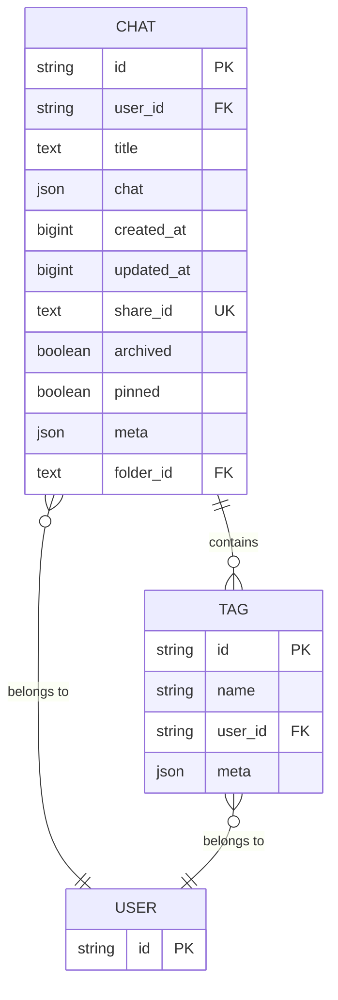
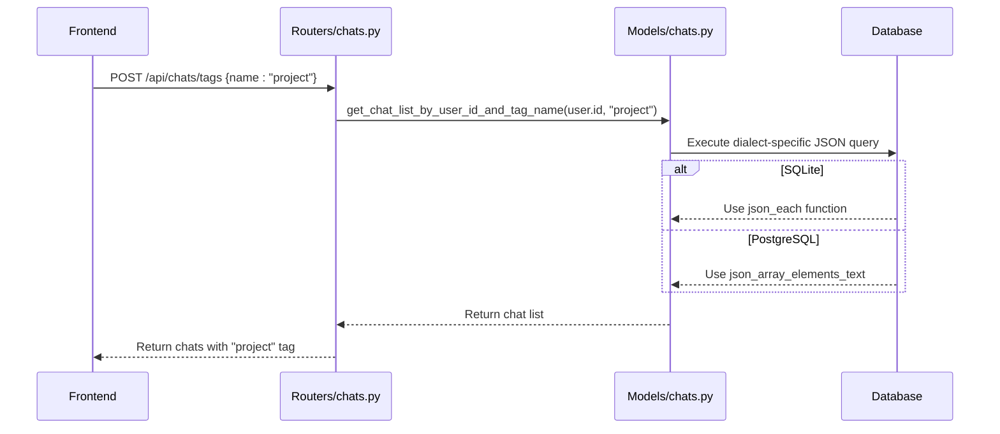
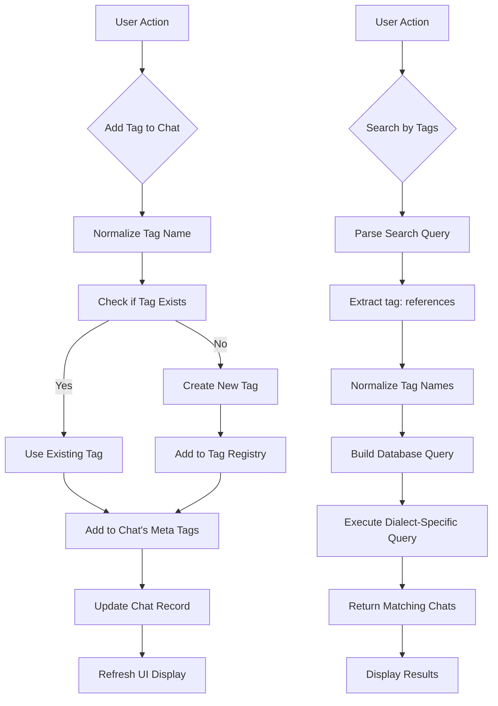
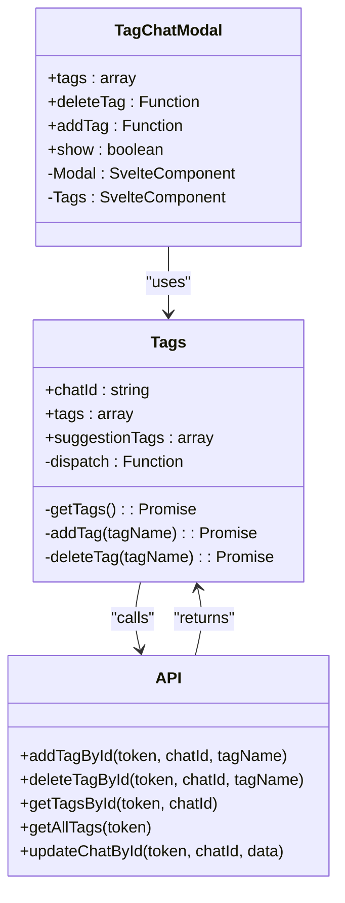

# Chat Tagging

<cite>
**Referenced Files in This Document**   
- [tags.py](file://backend/open_webui/models/tags.py)
- [chats.py](file://backend/open_webui/models/chats.py)
- [chats.py](file://backend/open_webui/routers/chats.py)
- [TagChatModal.svelte](file://src/lib/components/chat/TagChatModal.svelte)
- [Tags.svelte](file://src/lib/components/chat/Tags.svelte)
- [1af9b942657b_migrate_tags.py](file://backend/open_webui/migrations/versions/1af9b942657b_migrate_tags.py)
- [3ab32c4b8f59_update_tags.py](file://backend/open_webui/migrations/versions/3ab32c4b8f59_update_tags.py)
</cite>

## Table of Contents
1. [Introduction](#introduction)
2. [Metadata Organization with Meta JSON Field](#metadata-organization-with-meta-json-field)
3. [Tag Normalization Process](#tag-normalization-process)
4. [Database-Specific Query Implementations](#database-specific-query-implementations)
5. [Practical Examples of Tag Usage](#practical-examples-of-tag-usage)
6. [Frontend Components for Tag Management](#frontend-components-for-tag-management)
7. [Common Issues and Performance Considerations](#common-issues-and-performance-considerations)
8. [Conclusion](#conclusion)

## Introduction
The chat tagging system in Open WebUI provides a robust mechanism for organizing and retrieving chat conversations through metadata. This system leverages a flexible JSON-based approach to store tags, enabling users to categorize their chats efficiently. The implementation supports multiple database backends while maintaining consistent functionality across different environments. This document details the architecture, implementation, and usage patterns of the chat tagging system, focusing on how metadata is organized, how tags are normalized, and how queries are executed across different database systems.

## Metadata Organization with Meta JSON Field

The chat tagging system utilizes the `meta` JSON field in the Chat model to store tags as an array. This design choice provides flexibility in storing additional metadata alongside tags without requiring schema changes. The `meta` field is defined in the Chat model with a default value of an empty JSON object, allowing for extensibility beyond just tagging functionality.

The implementation uses SQLAlchemy's JSON column type, which enables efficient storage and querying of structured data within the database. When a chat is created or updated, the `meta` field can contain various properties, with the `tags` array being a key component for organization. This approach allows for future expansion of metadata capabilities without impacting existing functionality.

The system maintains a separate `Tag` table that stores tag definitions with their normalized IDs, names, and associated user IDs. This separation ensures that tag metadata (like display names) is stored independently from the chat references, reducing redundancy and improving data consistency.



**Diagram sources**
- [chats.py](file://backend/open_webui/models/chats.py#L26-L56)
- [tags.py](file://backend/open_webui/models/tags.py#L20-L30)

**Section sources**
- [chats.py](file://backend/open_webui/models/chats.py#L26-L56)
- [tags.py](file://backend/open_webui/models/tags.py#L20-L30)

## Tag Normalization Process

The tag normalization process is a critical component of the chat tagging system, ensuring consistent tag handling across the application. When a tag is created or referenced, the system automatically converts the tag name to lowercase and replaces spaces with underscores. This normalization occurs in multiple locations throughout the codebase, maintaining consistency regardless of how tags are added.

The normalization function `name.replace(" ", "_").lower()` is applied whenever a tag ID is generated from a tag name. This occurs in several key operations:
- When creating a new tag through the `insert_new_tag` method
- When retrieving a tag by name and user ID
- When adding a tag to a chat
- When deleting a tag

This consistent normalization prevents issues that could arise from case sensitivity or spacing differences when searching for tags. For example, "Project Alpha", "project alpha", and "project_alpha" would all be treated as the same tag after normalization.

The system also includes validation to prevent the creation of a tag named "none" (in any case variation), which is reserved as a special value in the application's logic. This prevents potential conflicts with UI elements or filtering operations that might use "none" as a default or placeholder value.

**Section sources**
- [tags.py](file://backend/open_webui/models/tags.py#L57)
- [tags.py](file://backend/open_webui/models/tags.py#L76)
- [chats.py](file://backend/open_webui/models/chats.py#L875)
- [chats.py](file://backend/open_webui/models/chats.py#L1028)

## Database-Specific Query Implementations

The chat tagging system implements database-specific query logic to efficiently search for chats by tags across different database backends. The system supports both SQLite and PostgreSQL, using their respective JSON querying capabilities to search within the `meta` JSON field where tags are stored.

For SQLite, the system leverages the JSON1 extension, using the `json_each` function to iterate through the tags array and find matches. The query uses the `EXISTS` clause with `json_each` to check if any element in the JSON array matches the target tag ID:

```sql
EXISTS (SELECT 1 FROM json_each(Chat.meta, '$.tags') WHERE json_each.value = :tag_id)
```

For PostgreSQL, the system uses JSON functions to achieve similar results. The query employs `json_array_elements_text` to extract text elements from the JSON array and compare them with the target tag ID:

```sql
EXISTS (SELECT 1 FROM json_array_elements_text(Chat.meta->'tags') elem WHERE elem = :tag_id)
```

The implementation dynamically selects the appropriate query syntax based on the database dialect detected at runtime. This approach ensures optimal performance on each supported database while maintaining a consistent API for the rest of the application. The system raises a `NotImplementedError` if an unsupported database dialect is detected, ensuring that new database types are explicitly supported rather than failing silently.

The query implementation is used in multiple methods, including `get_chat_list_by_user_id_and_tag_name` and `count_chats_by_tag_name_and_user_id`, providing both retrieval and counting functionality for tag-based searches.



**Diagram sources**
- [chats.py](file://backend/open_webui/models/chats.py#L977-L994)
- [chats.py](file://backend/open_webui/models/chats.py#L1030-L1049)
- [chats.py](file://backend/open_webui/routers/chats.py#L409-L419)

**Section sources**
- [chats.py](file://backend/open_webui/models/chats.py#L977-L994)
- [chats.py](file://backend/open_webui/models/chats.py#L1030-L1049)

## Practical Examples of Tag Usage

The chat tagging system supports various practical use cases for organizing and retrieving conversations. Users can apply multiple tags to chats, search by tag combinations, and view tag distributions in the UI.

To apply multiple tags to a chat, users can make sequential API calls to add each tag. The system automatically handles the array management within the `meta` field, ensuring tags are stored as a deduplicated list. When adding a tag, the system first checks if it exists in the global tag registry and creates it if necessary, then adds the normalized tag ID to the chat's tags array.

Searching chats by tag combinations is supported through the search functionality that parses special syntax in the search query. Users can search for multiple tags using the format `tag:tag_name` in their search text. The system extracts these tag references, normalizes them, and builds queries that can filter by multiple tags simultaneously. This allows for complex queries like finding all chats tagged with both "work" and "urgent".

The UI displays tag clouds in various contexts, showing the frequency of different tags across the user's chats. This is implemented by retrieving all tags for a user and potentially counting their occurrences. The tag cloud helps users identify their most commonly used categories and discover patterns in their conversation organization.

The system also handles tag cleanup automatically. When a tag is removed from a chat, the system checks if any other chats still use that tag. If no other chats reference the tag, it is removed from the global tag registry to prevent orphaned tag entries.



**Diagram sources**
- [chats.py](file://backend/open_webui/models/chats.py#L1000-L1021)
- [chats.py](file://backend/open_webui/models/chats.py#L725-L774)
- [chats.py](file://backend/open_webui/routers/chats.py#L868-L890)

**Section sources**
- [chats.py](file://backend/open_webui/models/chats.py#L1000-L1021)
- [chats.py](file://backend/open_webui/models/chats.py#L725-L774)
- [routers/chats.py](file://backend/open_webui/routers/chats.py#L868-L890)

## Frontend Components for Tag Management

The frontend implementation provides several components for tag input, autocomplete, and visual display. The primary components are `TagChatModal.svelte` and `Tags.svelte`, which work together to provide a seamless tagging experience.

The `TagChatModal.svelte` component serves as a modal interface for managing tags on a specific chat. It imports the `Tags` component and passes the current tags as a property. It also defines callback functions for adding and deleting tags, which are passed down to the child component. This modular design allows for reuse of the tag management interface in different contexts.

The `Tags.svelte` component handles the core tag display and interaction logic. It fetches the current tags for a chat using the `getTagsById` API call and displays them as interactive elements. The component supports both deletion of existing tags and addition of new tags through user input. When a tag is added or removed, the component updates the local state and makes the appropriate API calls to persist the changes.

The component also provides autocomplete functionality by fetching all available tags for the user and suggesting them as the user types. This is achieved through the `getAllTags` API call, which retrieves the complete set of tags the user has created. The suggestion list helps users maintain consistency in their tagging by encouraging the reuse of existing tags rather than creating variations.

Visual feedback is provided through event dispatching, allowing parent components to respond to tag changes. The component uses Svelte's event system to emit "add" and "delete" events when tags are modified, enabling other parts of the UI to update accordingly.



**Diagram sources**
- [TagChatModal.svelte](file://src/lib/components/chat/TagChatModal.svelte)
- [Tags.svelte](file://src/lib/components/chat/Tags.svelte)
- [chats.ts](file://src/lib/apis/chats/index.ts)

**Section sources**
- [TagChatModal.svelte](file://src/lib/components/chat/TagChatModal.svelte)
- [Tags.svelte](file://src/lib/components/chat/Tags.svelte)

## Common Issues and Performance Considerations

The chat tagging system addresses several common issues related to cross-database compatibility and performance with large tag sets. One key challenge is ensuring consistent behavior across different database systems while leveraging their specific JSON querying capabilities. The implementation handles this by detecting the database dialect at runtime and selecting the appropriate query syntax, falling back to an error for unsupported databases rather than attempting to use incompatible syntax.

Performance considerations are particularly important when dealing with large numbers of tags or chats. The system implements several optimizations to maintain responsiveness:

1. The database schema includes indexes on frequently queried fields like `user_id`, `archived`, and `pinned`, which improves the performance of tag searches that are often combined with these filters.

2. Tag counting operations are optimized by using database-level counting rather than retrieving all matching records and counting them in application code.

3. The system minimizes redundant tag registry entries by checking for existing tags before creating new ones and cleaning up unused tags when they are no longer referenced by any chats.

A potential issue arises from the JSON-based storage of tags, as full-text searches on JSON content can be slower than indexed text fields. However, this is mitigated by the use of database-specific JSON indexing and querying capabilities. For very large datasets, additional indexing strategies might be considered, such as maintaining a separate materialized view or summary table.

Another consideration is the potential for tag proliferation, where users create many similar tags due to minor variations in naming. The normalization process helps mitigate this by standardizing tag names, and the autocomplete feature encourages reuse of existing tags. However, users might still create redundant tags with different meanings but similar names, which could affect the effectiveness of the tagging system.

The system also handles edge cases such as tag names containing special characters, null bytes, or Unicode characters by normalizing them to a consistent format. This prevents issues that could arise from encoding differences or special character handling in different parts of the system.

**Section sources**
- [chats.py](file://backend/open_webui/models/chats.py#L44-L56)
- [chats.py](file://backend/open_webui/models/chats.py#L1051-L1057)
- [chats.py](file://backend/open_webui/models/chats.py#L130-L142)

## Conclusion
The chat tagging system in Open WebUI provides a comprehensive solution for organizing conversations through metadata. By leveraging the `meta` JSON field in the Chat model, the system offers flexible storage of tags as an array while maintaining data integrity through a separate tag registry. The tag normalization process ensures consistent handling of tag names across the application, converting them to lowercase and replacing spaces with underscores to prevent duplication.

The implementation demonstrates thoughtful consideration of database compatibility, with specific query logic for both SQLite and PostgreSQL that leverages their native JSON capabilities. This approach allows for efficient tag searching while maintaining a consistent API across different database backends. The frontend components provide an intuitive interface for tag management, with autocomplete and visual feedback that enhance the user experience.

Practical examples show how users can apply multiple tags to chats, search by tag combinations, and benefit from tag cloud visualizations. The system handles common issues such as cross-database compatibility and performance with large tag sets through careful indexing, optimized queries, and automatic cleanup of unused tags.

Overall, the chat tagging system represents a well-designed feature that enhances the organization and discoverability of conversations while maintaining technical robustness across different deployment environments.