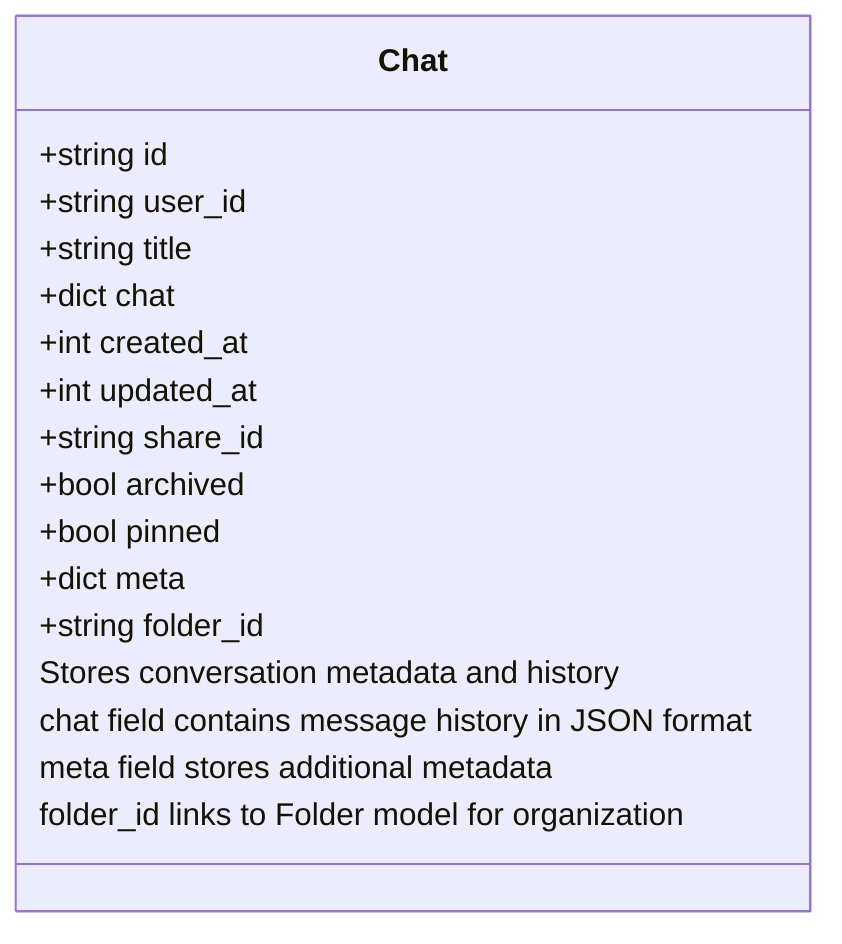
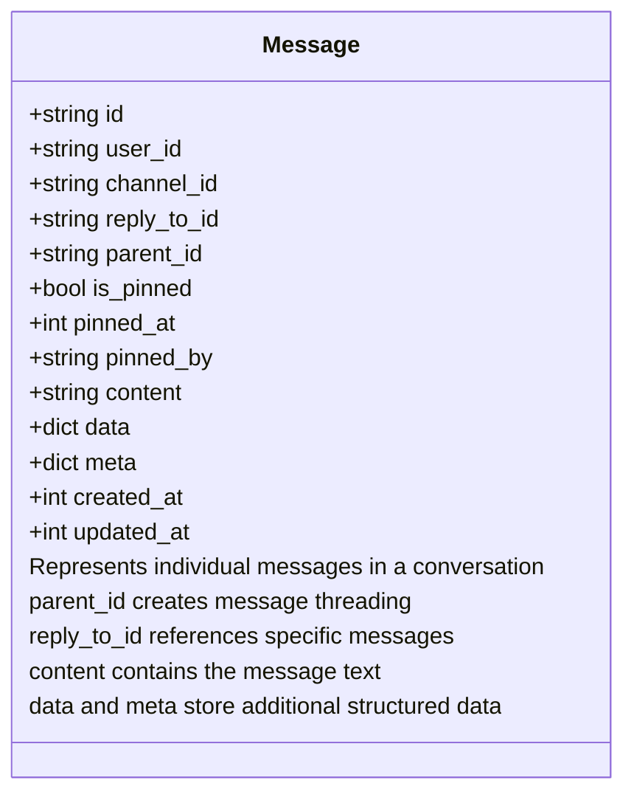
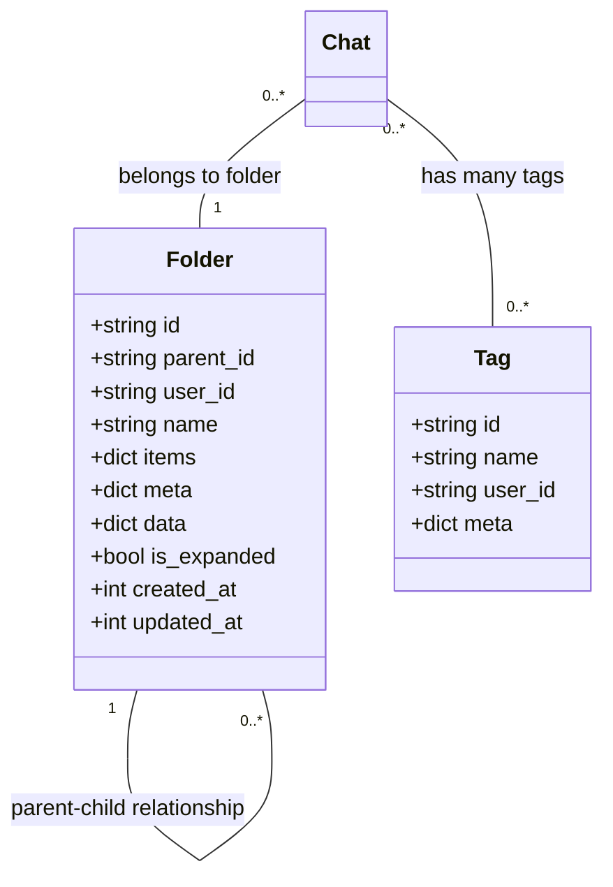
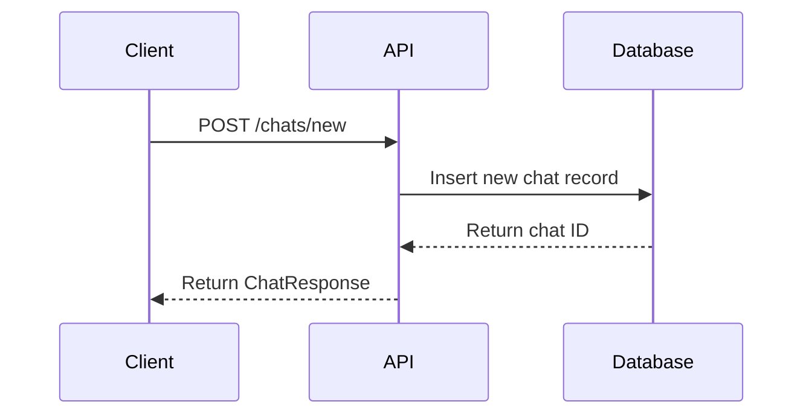
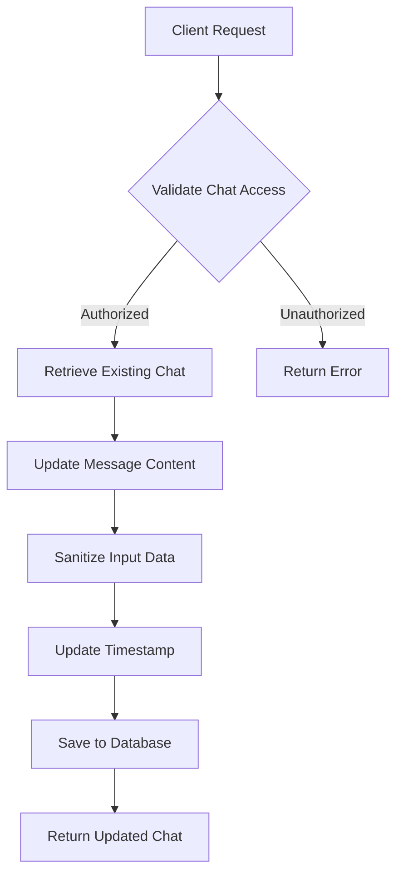
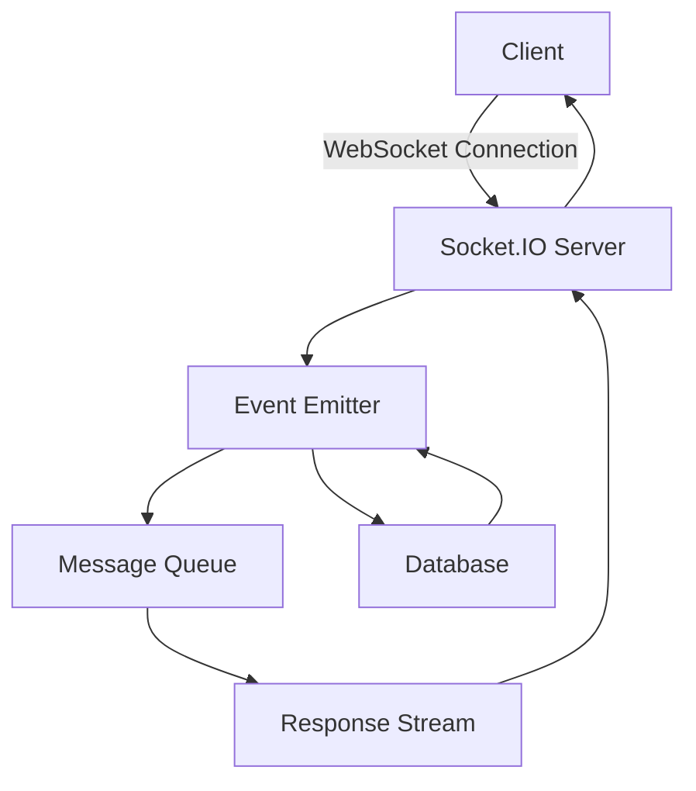
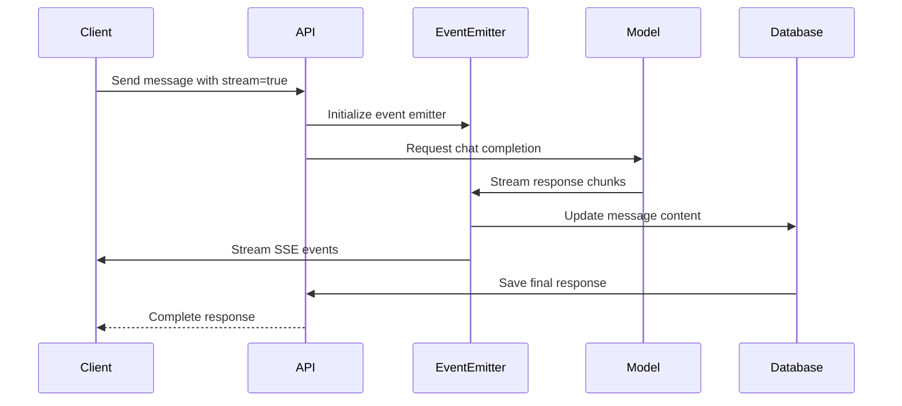
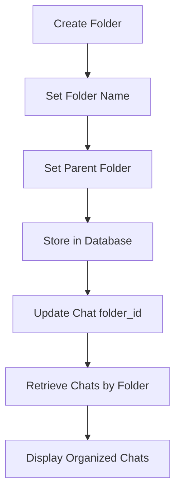
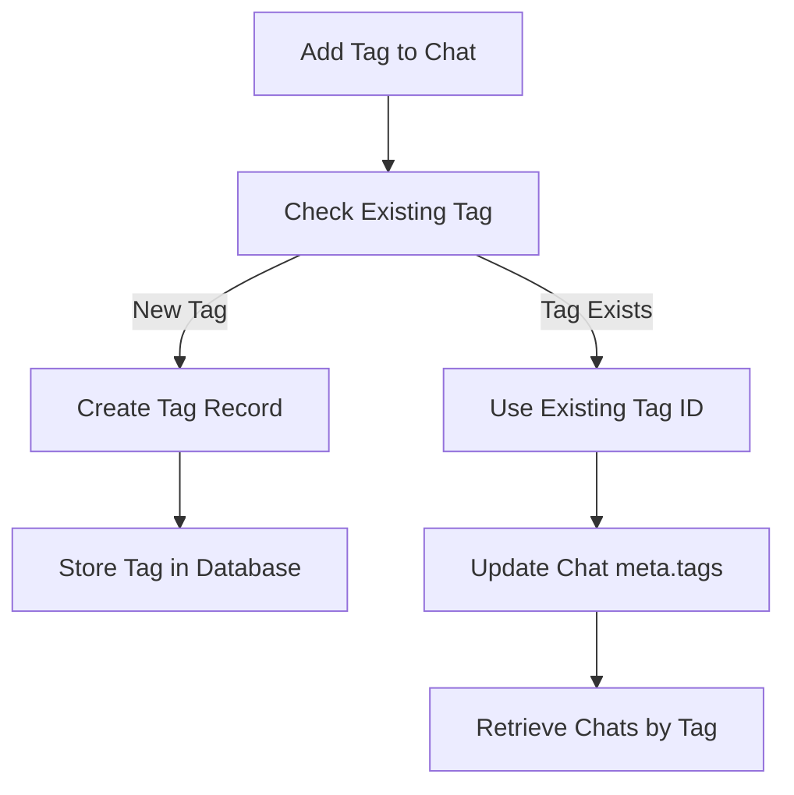
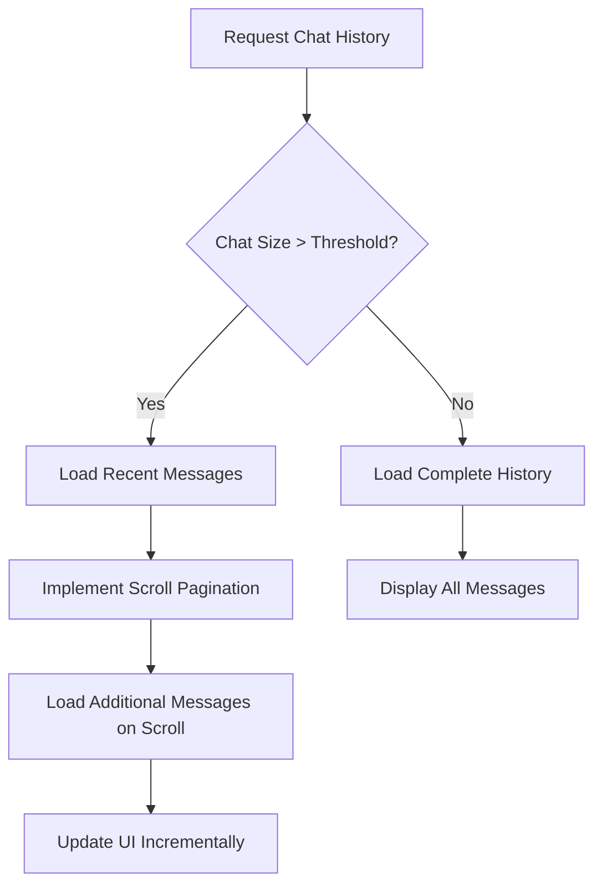

# Chat System

<cite>
**Referenced Files in This Document**   
- [chats.py](file://backend/open_webui/models/chats.py)
- [messages.py](file://backend/open_webui/models/messages.py)
- [chats.py](file://backend/open_webui/routers/chats.py)
- [main.py](file://backend/open_webui/socket/main.py)
- [chat.py](file://backend/open_webui/utils/chat.py)
- [folders.py](file://backend/open_webui/models/folders.py)
- [tags.py](file://backend/open_webui/models/tags.py)
- [index.ts](file://src/lib/apis/chats/index.ts)
- [index.ts](file://src/lib/stores/index.ts)
</cite>

## Table of Contents
1. [Introduction](#introduction)
2. [Data Models](#data-models)
3. [Chat Creation and Management](#chat-creation-and-management)
4. [Message Streaming and Real-time Communication](#message-streaming-and-real-time-communication)
5. [Conversation Organization](#conversation-organization)
6. [Performance Considerations](#performance-considerations)
7. [Troubleshooting Guide](#troubleshooting-guide)
8. [Conclusion](#conclusion)

## Introduction

The Chat System in open-webui provides a comprehensive conversational interface for interacting with AI models. This documentation details the architecture and implementation of the chat system, focusing on message creation, streaming responses, conversation management, chat organization through folders and tags, and real-time communication using WebSocket technology. The system enables users to create new chats, send messages with model selection, retrieve chat history, and manage conversations through archiving and organization features.

**Section sources**
- [chats.py](file://backend/open_webui/models/chats.py#L1-L1175)
- [messages.py](file://backend/open_webui/models/messages.py#L1-L463)

## Data Models

The chat system is built on a robust data model that defines the structure of chats, messages, folders, and tags. The primary data entities are the Chat and Message models, which store conversation data and individual messages respectively.

### Chat Data Model

The Chat model represents a conversation between a user and an AI model. It contains metadata about the chat and stores the conversation history in a JSON format.



**Diagram sources **
- [chats.py](file://backend/open_webui/models/chats.py#L26-L80)

### Message Data Model

The Message model represents individual messages within a chat conversation. It includes content, metadata, and relationships to other messages.



**Diagram sources **
- [messages.py](file://backend/open_webui/models/messages.py#L41-L63)

### Folder and Tag Data Models

The system provides organizational features through folders and tags, allowing users to categorize and manage their chats effectively.



**Diagram sources **
- [folders.py](file://backend/open_webui/models/folders.py#L24-L36)
- [tags.py](file://backend/open_webui/models/tags.py#L20-L33)

**Section sources**
- [folders.py](file://backend/open_webui/models/folders.py#L1-L367)
- [tags.py](file://backend/open_webui/models/tags.py#L1-L115)

## Chat Creation and Management

The chat system provides a comprehensive API for creating, updating, and managing conversations. The process begins with creating a new chat, which initializes a conversation with a unique identifier and metadata.

### Creating a New Chat

Creating a new chat involves sending a POST request to the `/chats/new` endpoint with the chat data. The system generates a unique ID, sets creation timestamps, and stores the initial chat structure in the database.



**Diagram sources **
- [chats.py](file://backend/open_webui/routers/chats.py#L133-L143)

### Updating Chat Messages

The system allows for dynamic updating of chat messages through the message upsert operation. This enables editing messages, adding status updates, and modifying content during the conversation.



**Diagram sources **
- [chats.py](file://backend/open_webui/models/chats.py#L304-L329)

**Section sources**
- [chats.py](file://backend/open_webui/models/chats.py#L167-L249)
- [chats.py](file://backend/open_webui/routers/chats.py#L133-L143)

## Message Streaming and Real-time Communication

The chat system implements real-time communication using WebSocket technology, enabling efficient message streaming and immediate updates to the user interface.

### WebSocket Architecture

The system uses Socket.IO for WebSocket communication, establishing persistent connections between clients and the server for real-time data exchange.



**Diagram sources **
- [main.py](file://backend/open_webui/socket/main.py#L1-L839)

### Message Streaming Process

The message streaming process involves several components working together to deliver responses in real-time as they are generated by the AI model.



**Diagram sources **
- [chat.py](file://backend/open_webui/utils/chat.py#L72-L168)
- [main.py](file://backend/open_webui/socket/main.py#L695-L799)

**Section sources**
- [chat.py](file://backend/open_webui/utils/chat.py#L72-L168)
- [main.py](file://backend/open_webui/socket/main.py#L695-L799)

## Conversation Organization

The chat system provides robust organization features through folders and tags, allowing users to categorize and manage their conversations effectively.

### Folder Management

Folders provide a hierarchical structure for organizing chats, enabling users to group related conversations together.



**Diagram sources **
- [folders.py](file://backend/open_webui/models/folders.py#L87-L114)

### Tag Management

Tags provide a flexible way to categorize chats with multiple labels, enabling cross-cutting organization beyond the folder hierarchy.



**Diagram sources **
- [chats.py](file://backend/open_webui/models/chats.py#L261-L279)
- [tags.py](file://backend/open_webui/models/tags.py#L55-L71)

**Section sources**
- [folders.py](file://backend/open_webui/models/folders.py#L87-L367)
- [chats.py](file://backend/open_webui/models/chats.py#L261-L279)

## Performance Considerations

The chat system implements several performance optimizations to handle large conversation histories and ensure responsive user experiences.

### Database Indexing

The system uses strategic database indexing to optimize common query patterns for chat retrieval.

```mermaid
erDiagram
CHAT ||--o{ FOLDER : contains
CHAT {
string id PK
string user_id FK
string title
json chat
bigint created_at
bigint updated_at
string share_id UK
boolean archived
boolean pinned
json meta
string folder_id FK
}
FOLDER {
string id PK
string parent_id FK
string user_id FK
string name
json items
json meta
json data
boolean is_expanded
bigint created_at
bigint updated_at
}
INDEX folder_id_idx ON CHAT(folder_id)
INDEX user_id_pinned_idx ON CHAT(user_id, pinned)
INDEX user_id_archived_idx ON CHAT(user_id, archived)
INDEX updated_at_user_id_idx ON CHAT(updated_at, user_id)
```

**Diagram sources **
- [chats.py](file://backend/open_webui/models/chats.py#L44-L56)

### Large Conversation Handling

For conversations with extensive message histories, the system implements pagination and selective loading to maintain performance.



**Section sources**
- [chats.py](file://backend/open_webui/models/chats.py#L535-L573)
- [index.ts](file://src/lib/apis/chats/index.ts#L99-L149)

## Troubleshooting Guide

This section addresses common issues that may occur when using the chat system and provides guidance for resolution.

### Message Delivery Failures

When messages fail to deliver or stream properly, consider the following troubleshooting steps:

1. **Check WebSocket Connection**: Verify that the WebSocket connection is established and active.
2. **Verify Authentication**: Ensure the user token is valid and has appropriate permissions.
3. **Examine Network Conditions**: Check for network connectivity issues or firewall restrictions.
4. **Review Server Logs**: Look for error messages in the application logs that might indicate the root cause.

### Streaming Interruptions

If message streaming is interrupted or incomplete:

1. **Check Server Resources**: Ensure the server has sufficient CPU and memory resources.
2. **Verify Model Availability**: Confirm the selected AI model is available and responsive.
3. **Review Timeout Settings**: Check WebSocket and request timeout configurations.
4. **Examine Error Handling**: Review the error handling in the streaming pipeline.

**Section sources**
- [main.py](file://backend/open_webui/socket/main.py#L695-L799)
- [chat.py](file://backend/open_webui/utils/chat.py#L72-L168)

## Conclusion

The Chat System in open-webui provides a comprehensive and robust conversational interface with advanced features for message creation, streaming responses, and conversation management. The system's architecture leverages WebSocket technology for real-time communication, ensuring responsive and interactive user experiences. Through the implementation of folders and tags, users can effectively organize and manage their conversations. The data model is designed for flexibility and scalability, supporting complex conversation structures and metadata. Performance optimizations, including database indexing and pagination, ensure the system can handle large conversation histories efficiently. This documentation provides a thorough understanding of the chat system's architecture and implementation, serving as a valuable resource for developers and users alike.