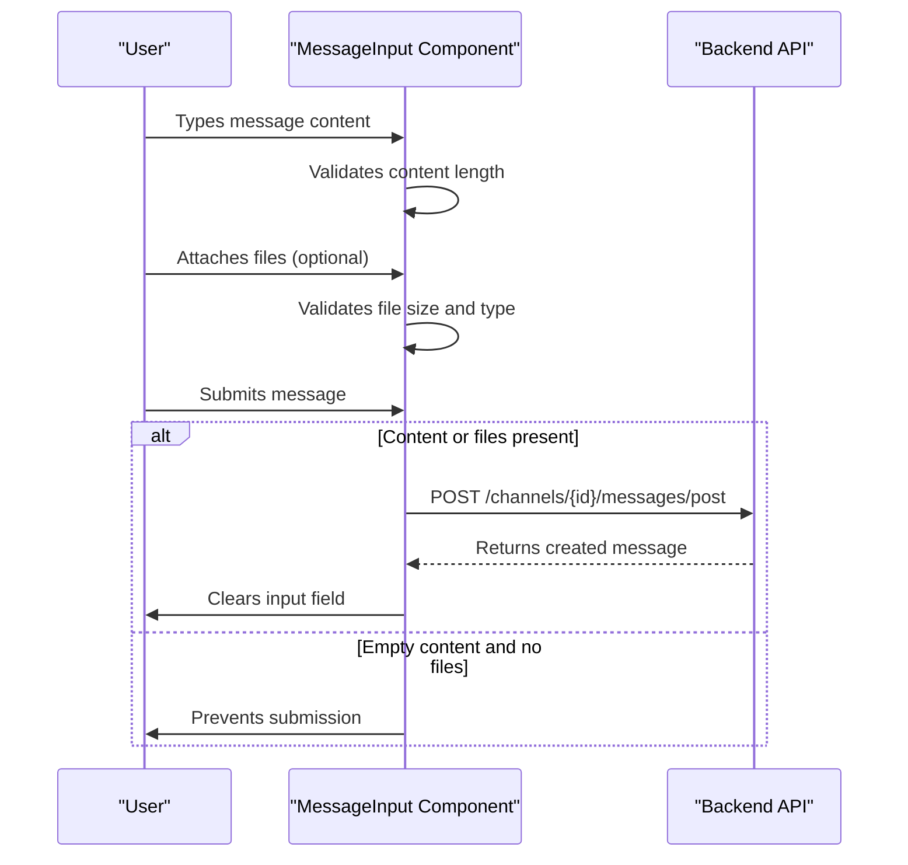
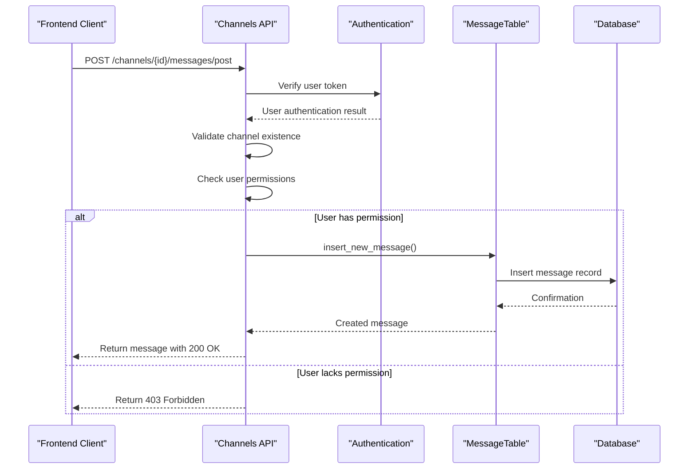
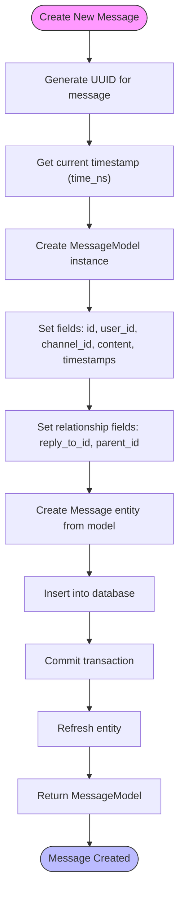
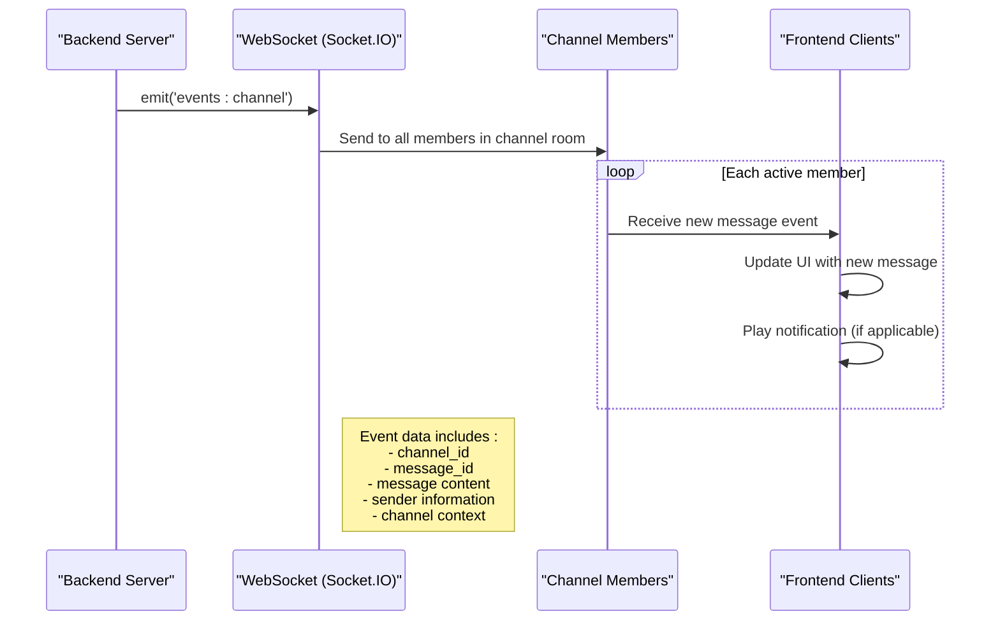
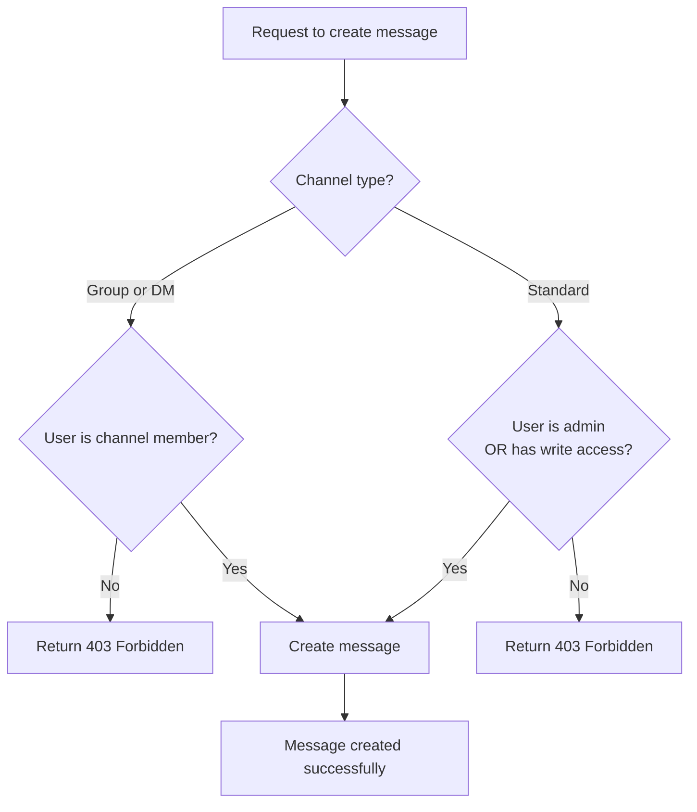

# Message Creation

<cite>
**Referenced Files in This Document**   
- [MessageInput.svelte](file://src/lib/components/channel/MessageInput.svelte)
- [messages.py](file://backend/open_webui/models/messages.py)
- [channels.py](file://backend/open_webui/routers/channels.py)
- [main.py](file://backend/open_webui/socket/main.py)
- [3781e22d8b01_update_message_table.py](file://backend/open_webui/migrations/versions/3781e22d8b01_update_message_table.py)
- [a5c220713937_add_reply_to_id_column_to_message.py](file://backend/open_webui/migrations/versions/a5c220713937_add_reply_to_id_column_to_message.py)
- [018012973d35_add_indexes.py](file://backend/open_webui/migrations/versions/018012973d35_add_indexes.py)
</cite>

## Table of Contents
1. [Introduction](#introduction)
2. [MessageForm Model Structure and Validation](#messageform-model-structure-and-validation)
3. [Frontend Message Input Component](#frontend-message-input-component)
4. [Backend Message Creation Endpoint](#backend-message-creation-endpoint)
5. [Database Insertion and MessageTable Implementation](#database-insertion-and-messagetable-implementation)
6. [WebSocket Broadcasting and Real-time Updates](#websocket-broadcasting-and-real-time-updates)
7. [Common Issues and Error Handling](#common-issues-and-error-handling)
8. [Performance Considerations](#performance-considerations)
9. [Conclusion](#conclusion)

## Introduction
The message creation sub-feature in the Chat System enables users to send messages within channels, supporting both direct messages and group conversations. This documentation details the complete flow from the frontend MessageInput component through to the backend API endpoint, database insertion, and real-time broadcasting via WebSocket. The system supports rich text input, file attachments, message threading through reply_to_id and parent_id fields, and real-time collaboration features. The implementation follows a robust architecture with proper validation, error handling, and performance optimization for database operations.

## MessageForm Model Structure and Validation
The MessageForm model defines the structure for creating new messages with both required and optional fields. The model is implemented using Pydantic and includes comprehensive validation rules to ensure data integrity.

```mermaid
classDiagram
class MessageForm {
+temp_id : Optional[str]
+content : str
+reply_to_id : Optional[str]
+parent_id : Optional[str]
+data : Optional[dict]
+meta : Optional[dict]
}
note right
Required fields :
- content : The message content (cannot be empty)
Optional fields :
- temp_id : Temporary ID for frontend tracking
- reply_to_id : Reference to message being replied to
- parent_id : Parent message ID for threading
- data : Additional structured data
- meta : Metadata including model information
end
```

**Diagram sources** 
- [messages.py](file://backend/open_webui/models/messages.py#L92-L99)

**Section sources**
- [messages.py](file://backend/open_webui/models/messages.py#L92-L99)

## Frontend Message Input Component
The MessageInput component provides the user interface for creating and sending messages. It handles user input, file attachments, and form submission while managing the user experience with features like typing indicators and drag-and-drop file uploads.



**Diagram sources** 
- [MessageInput.svelte](file://src/lib/components/channel/MessageInput.svelte#L542-L564)

**Section sources**
- [MessageInput.svelte](file://src/lib/components/channel/MessageInput.svelte#L1-L1110)

## Backend Message Creation Endpoint
The backend exposes a POST endpoint for creating new messages, which handles authentication, authorization, and message processing. The endpoint validates user permissions based on channel type and access control settings before creating the message.



**Diagram sources** 
- [channels.py](file://backend/open_webui/routers/channels.py#L1070-L1096)

**Section sources**
- [channels.py](file://backend/open_webui/routers/channels.py#L987-L1096)

## Database Insertion and MessageTable Implementation
The MessageTable class handles the database operations for message creation, including generating unique IDs, setting timestamps, and establishing relationships between messages through reply and threading mechanisms.



**Diagram sources** 
- [messages.py](file://backend/open_webui/models/messages.py#L126-L157)

**Section sources**
- [messages.py](file://backend/open_webui/models/messages.py#L126-L157)

## WebSocket Broadcasting and Real-time Updates
After a message is created, the system uses WebSocket to broadcast the new message to all channel members in real-time through the 'events:channel' event, enabling immediate visibility of new messages without requiring page refreshes.



**Diagram sources** 
- [channels.py](file://backend/open_webui/routers/channels.py#L1023-L1039)
- [main.py](file://backend/open_webui/socket/main.py#L256-L270)

**Section sources**
- [channels.py](file://backend/open_webui/routers/channels.py#L1023-L1060)
- [main.py](file://backend/open_webui/socket/main.py#L256-L270)

## Common Issues and Error Handling
The message creation system implements comprehensive error handling for common issues such as empty content, permission validation, and data integrity problems. The system validates input at multiple levels to ensure robust operation.

### Input Validation
The system validates message content before processing, rejecting empty messages and handling edge cases:

```mermaid
flowchart TD
A[Submit Message] --> B{Content empty?<br/>AND<br/>No files attached?}
B --> |Yes| C[Prevent submission<br/>Show error message]
B --> |No| D{File attachments?}
D --> |Yes| E[Validate file size<br/>(max_size from config)]
E --> F{Within limit?}
F --> |No| G[Show size error<br/>(e.g., 'File exceeds 10MB')]
F --> |Yes| H[Process file upload]
D --> |No| I[Proceed with text message]
H --> J[Create message record]
I --> J
J --> K[Save to database]
```

### Permission Validation
The system implements role-based access control for message creation:



**Section sources**
- [channels.py](file://backend/open_webui/routers/channels.py#L993-L1011)
- [MessageInput.svelte](file://src/lib/components/channel/MessageInput.svelte#L543-L545)

## Performance Considerations
The message creation system includes several performance optimizations, particularly around database operations and indexing strategies to ensure efficient querying of messages.

### Database Indexing
The system implements strategic database indexes on frequently queried fields to optimize message retrieval performance:

```mermaid
erDiagram
MESSAGE ||--o{ CHANNEL : belongs_to
MESSAGE {
string id PK
string user_id FK
string channel_id FK
string reply_to_id FK
string parent_id FK
text content
json data
json meta
bigint created_at
bigint updated_at
boolean is_pinned
bigint pinned_at
string pinned_by
}
CHANNEL {
string id PK
string name
string type
string user_id FK
text access_control
bigint created_at
}
note right of MESSAGE
Indexes on:
- channel_id + created_at (for chronological message retrieval)
- parent_id (for thread queries)
- reply_to_id (for reply lookups)
- created_at (for time-based queries)
end
```

**Diagram sources** 
- [018012973d35_add_indexes.py](file://backend/open_webui/migrations/versions/018012973d35_add_indexes.py#L18-L24)
- [3781e22d8b01_update_message_table.py](file://backend/open_webui/migrations/versions/3781e22d8b01_update_message_table.py#L29-L33)

The database schema includes optimized indexing on key fields such as channel_id and created_at to ensure fast retrieval of messages in chronological order. The Message table is designed with appropriate data types and constraints to maintain data integrity while supporting efficient queries. Timestamps are stored in nanosecond precision (BigInteger) to ensure accurate ordering of messages, even with high-frequency message creation. The system also uses batch operations where appropriate and leverages connection pooling to minimize database connection overhead.

**Section sources**
- [018012973d35_add_indexes.py](file://backend/open_webui/migrations/versions/018012973d35_add_indexes.py#L18-L24)
- [3781e22d8b01_update_message_table.py](file://backend/open_webui/migrations/versions/3781e22d8b01_update_message_table.py#L29-L33)
- [messages.py](file://backend/open_webui/models/messages.py#L41-L62)

## Conclusion
The message creation sub-feature in the Chat System provides a robust, real-time messaging capability with comprehensive support for message content, threading, and file attachments. The implementation follows a clean separation of concerns between frontend and backend components, with well-defined data models and validation rules. The system ensures data integrity through proper database constraints and indexing while providing real-time updates through WebSocket broadcasting. Security is maintained through thorough permission validation at both the channel and message levels. Performance is optimized through strategic database indexing and efficient query patterns, ensuring responsive message creation and retrieval even with large volumes of data. The architecture supports future enhancements such as message editing, deletion, and advanced threading features.