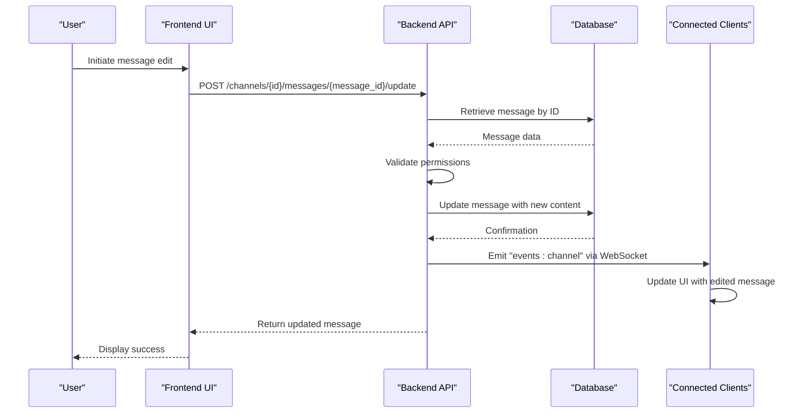
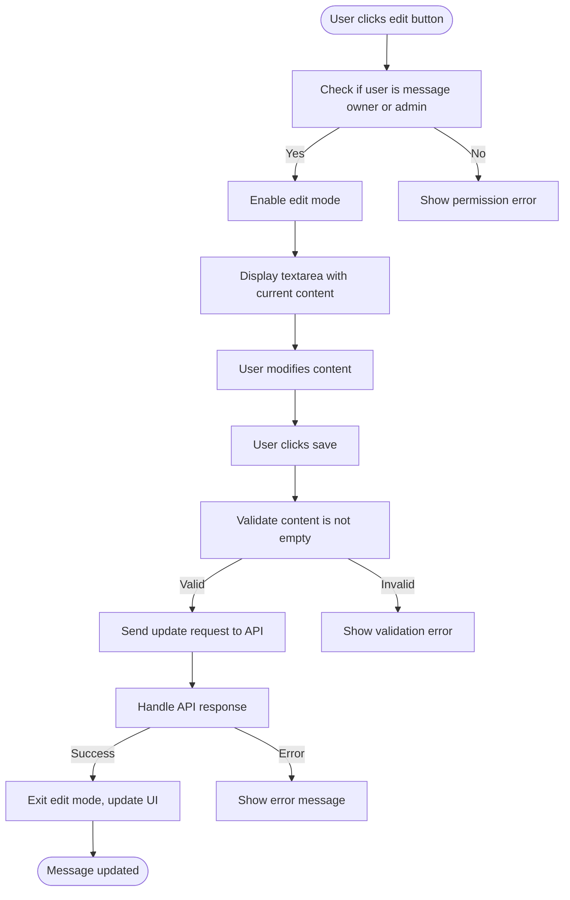
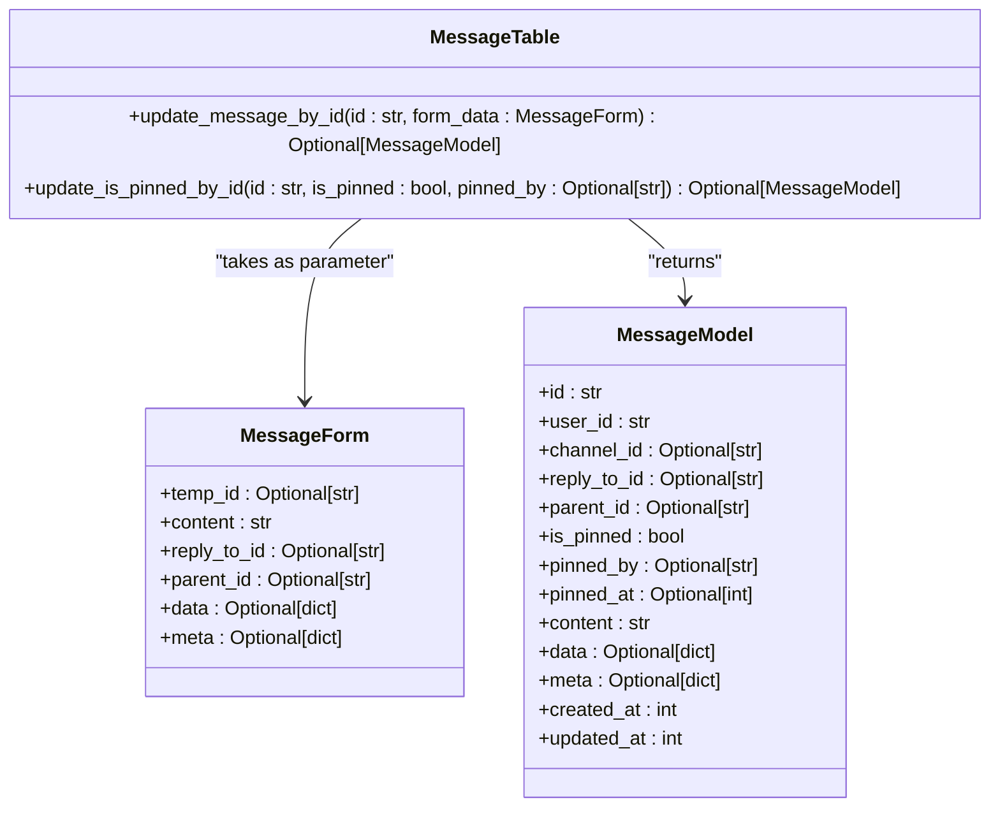

# Message Editing

<cite>
**Referenced Files in This Document**   
- [messages.py](file://backend/open_webui/models/messages.py)
- [channels.py](file://backend/open_webui/routers/channels.py)
- [Message.svelte](file://src/lib/components/channel/Messages/Message.svelte)
- [MessageInput.svelte](file://src/lib/components/channel/MessageInput.svelte)
- [index.ts](file://src/lib/apis/channels/index.ts)
</cite>

## Table of Contents
1. [Introduction](#introduction)
2. [Data Flow Overview](#data-flow-overview)
3. [Frontend Implementation](#frontend-implementation)
4. [Backend API Endpoint](#backend-api-endpoint)
5. [Message Update Logic](#message-update-logic)
6. [Permission Model](#permission-model)
7. [Concurrency and Conflict Handling](#concurrency-and-conflict-handling)
8. [Performance Considerations](#performance-considerations)
9. [Conclusion](#conclusion)

## Introduction
The message editing feature in the Chat System allows users to modify existing messages within a conversation. This functionality enables users to correct errors, update information, or refine their messages after initial submission. The system supports partial updates to message content, data, and metadata fields while preserving existing values through dictionary merging. The implementation includes comprehensive permission controls, timestamp management, and real-time updates across clients.

**Section sources**
- [messages.py](file://backend/open_webui/models/messages.py#L125-L463)
- [channels.py](file://backend/open_webui/routers/channels.py#L1280-L1346)

## Data Flow Overview
The message editing workflow follows a structured data flow from the frontend user interface to the backend database and back to all connected clients. When a user initiates an edit, the frontend captures the changes and sends them to the backend API. The backend validates permissions, updates the message in the database, and broadcasts the change to all connected clients via WebSockets. This ensures that all users viewing the conversation see the updated message in real-time.



**Diagram sources**
- [channels.py](file://backend/open_webui/routers/channels.py#L1280-L1346)
- [messages.py](file://backend/open_webui/models/messages.py#L328-L345)

## Frontend Implementation
The frontend implementation of message editing is handled through the Message component in the channel messages interface. When a user clicks the edit button on their message, the component switches to edit mode, displaying a textarea pre-populated with the current message content. The edit functionality is only available to the message owner or administrators, as determined by the frontend logic that checks user permissions before displaying the edit option.



**Diagram sources**
- [Message.svelte](file://src/lib/components/channel/Messages/Message.svelte#L1-L520)
- [MessageInput.svelte](file://src/lib/components/channel/MessageInput.svelte#L1-L1110)

**Section sources**
- [Message.svelte](file://src/lib/components/channel/Messages/Message.svelte#L1-L520)
- [MessageInput.svelte](file://src/lib/components/channel/MessageInput.svelte#L1-L1110)

## Backend API Endpoint
The backend exposes a POST endpoint at `/channels/{id}/messages/{message_id}/update` to handle message editing requests. This endpoint is protected by authentication and authorization checks to ensure only permitted users can modify messages. The endpoint validates that the message belongs to the specified channel and that the user has appropriate permissions based on channel type and access control settings.

```mermaid
flowchart TD
A[POST /channels/{id}/messages/{message_id}/update] --> B[Authenticate user]
B --> C[Retrieve channel by ID]
C --> D{Channel exists?}
D --> |No| E[Return 404 Not Found]
D --> |Yes| F[Retrieve message by ID]
F --> G{Message exists?}
G --> |No| H[Return 404 Not Found]
G --> |Yes| I{Message belongs to channel?}
I --> |No| J[Return 400 Bad Request]
I --> |Yes| K[Check user permissions]
K --> L{User has permission?}
L --> |No| M[Return 403 Forbidden]
L --> |Yes| N[Update message in database]
N --> O[Refresh message data]
O --> P[Emit WebSocket event]
P --> Q[Return updated message]
```

**Diagram sources**
- [channels.py](file://backend/open_webui/routers/channels.py#L1280-L1346)

**Section sources**
- [channels.py](file://backend/open_webui/routers/channels.py#L1280-L1346)

## Message Update Logic
The core message update logic is implemented in the `update_message_by_id` method of the `MessageTable` class. This method handles partial updates to message content, data, and meta fields through dictionary merging, preserving existing values while incorporating new ones. The implementation uses Python's dictionary unpacking operator (`**`) to merge existing and new data, ensuring that only specified fields are updated while others remain unchanged.



**Diagram sources**
- [messages.py](file://backend/open_webui/models/messages.py#L328-L345)

**Section sources**
- [messages.py](file://backend/open_webui/models/messages.py#L328-L345)

## Permission Model
The permission model for message editing enforces strict access controls based on user role, message ownership, and channel access permissions. Users can only edit messages they own unless they have administrative privileges. The system differentiates between channel types (group, direct message, and others) and applies appropriate permission checks. For non-group/direct message channels, users must have read access to the channel's access control settings to edit messages.

```mermaid
flowchart TD
A[User attempts to edit message] --> B{Channel type is "group" or "dm"?}
B --> |Yes| C[Check if user is channel member]
B --> |No| D{User is admin?}
D --> |Yes| Z[Allow edit]
D --> |No| E{User owns message?}
E --> |Yes| Z[Allow edit]
E --> |No| F[Check read access to channel access_control]
F --> |Has access| Z[Allow edit]
F --> |No access| Y[Deny edit, return 403]
C --> |Is member| Z[Allow edit]
C --> |Not member| Y[Deny edit, return 403]
Z --> AA[Update message]
AA --> AB[Refresh updated_at timestamp]
AB --> AC[Emit WebSocket event]
AC --> AD[Return success]
```

**Diagram sources**
- [channels.py](file://backend/open_webui/routers/channels.py#L1280-L1319)
- [messages.py](file://backend/open_webui/models/messages.py#L342)

**Section sources**
- [channels.py](file://backend/open_webui/routers/channels.py#L1280-L1319)
- [messages.py](file://backend/open_webui/models/messages.py#L342)

## Concurrency and Conflict Handling
The message editing system handles concurrent edits through a combination of database transactions and WebSocket-based real-time updates. When multiple users attempt to edit the same message simultaneously, the last write wins due to the sequential nature of database transactions. The system does not implement versioning or conflict resolution at the application level, relying instead on the atomicity of database operations to prevent data corruption. Real-time WebSocket updates ensure that all clients see the most recent version of the message immediately after an edit.

**Section sources**
- [channels.py](file://backend/open_webui/routers/channels.py#L1325-L1339)
- [messages.py](file://backend/open_webui/models/messages.py#L343-L344)

## Performance Considerations
The message editing feature is optimized for performance through several key design decisions. The database update operation uses the message ID as the primary key in the WHERE clause, ensuring efficient indexing and fast lookups. The implementation minimizes database queries by retrieving and updating the message in a single transaction. The use of dictionary merging for partial updates reduces the amount of data transferred between the application and database. Additionally, the WebSocket-based update broadcasting ensures that clients receive changes without requiring additional polling requests.

**Section sources**
- [messages.py](file://backend/open_webui/models/messages.py#L331-L344)
- [channels.py](file://backend/open_webui/routers/channels.py#L1293)

## Conclusion
The message editing feature in the Chat System provides a robust and secure way for users to modify their messages. The implementation combines frontend validation with backend permission checks to ensure data integrity and security. The use of dictionary merging allows for flexible partial updates while preserving existing message data. Real-time updates via WebSockets ensure that all users see the most current message content. The system's performance is optimized through efficient database queries and minimal data transfer, making it suitable for high-traffic environments.