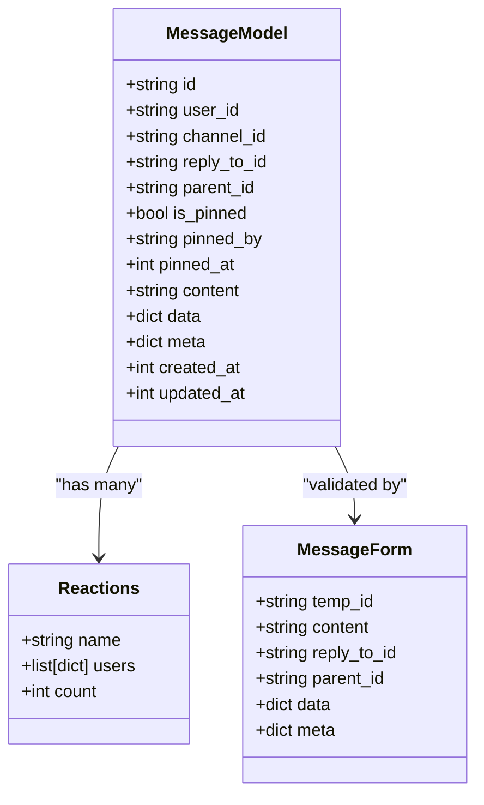
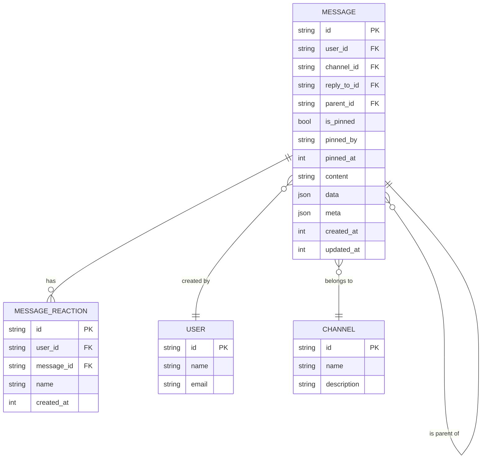
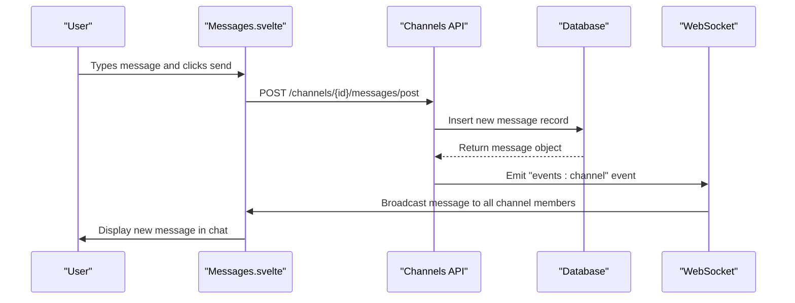
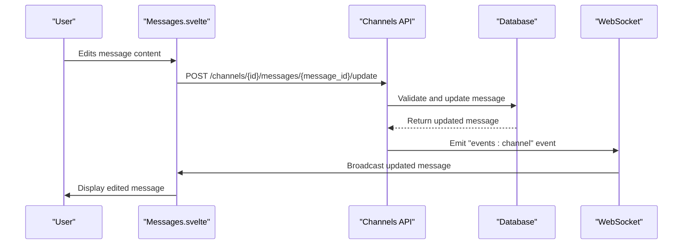
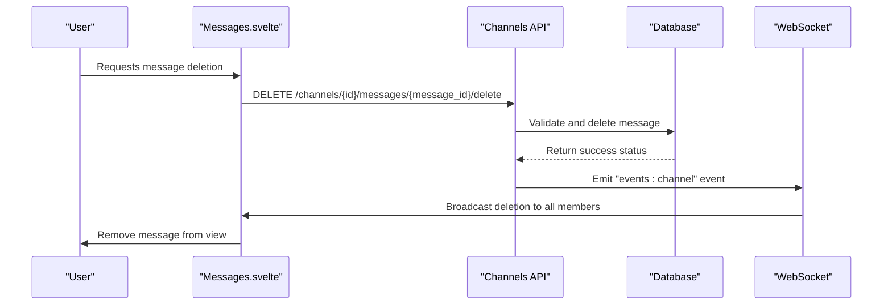
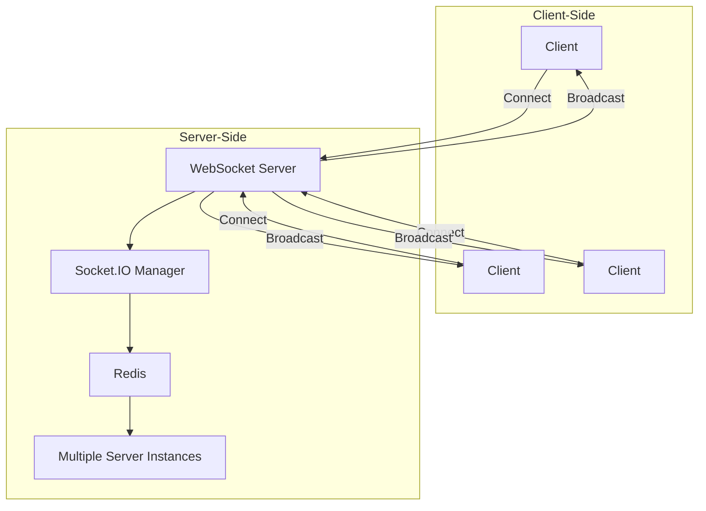
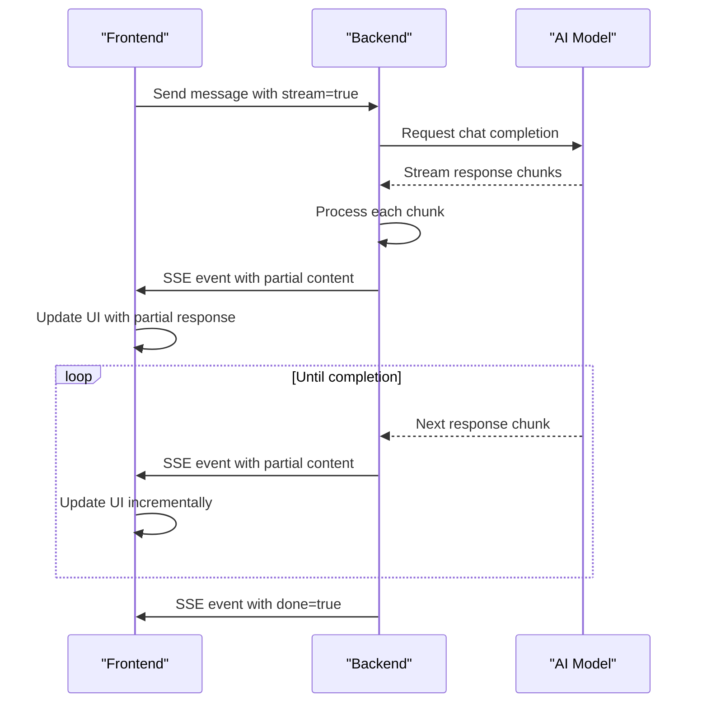
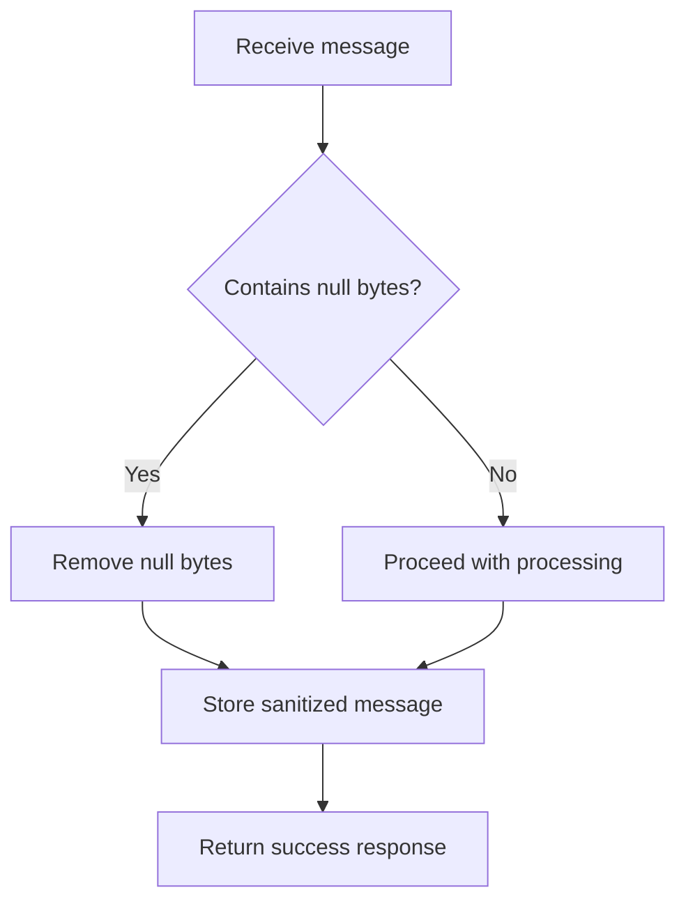

# Message Handling

<cite>
**Referenced Files in This Document**   
- [messages.py](file://backend/open_webui/models/messages.py)
- [chats.py](file://backend/open_webui/models/chats.py)
- [channels.py](file://backend/open_webui/routers/channels.py)
- [main.py](file://backend/open_webui/socket/main.py)
- [index.ts](file://src/lib/apis/channels/index.ts)
- [Messages.svelte](file://src/lib/components/channel/Messages.svelte)
- [chat.py](file://backend/open_webui/utils/chat.py)
- [index.ts](file://src/lib/utils/index.ts)
</cite>

## Table of Contents
1. [Introduction](#introduction)
2. [Message Data Model](#message-data-model)
3. [Message Creation](#message-creation)
4. [Message Editing](#message-editing)
5. [Message Deletion](#message-deletion)
6. [Real-time Updates with WebSocket](#real-time-updates-with-websocket)
7. [Message Storage and Retrieval](#message-storage-and-retrieval)
8. [Null Byte Handling](#null-byte-handling)
9. [Performance Considerations](#performance-considerations)
10. [Troubleshooting Guide](#troubleshooting-guide)

## Introduction
The message handling system in Open WebUI provides a comprehensive solution for managing chat messages with full CRUD operations, real-time updates, and efficient storage. The system is designed to support collaborative features like message reactions, pinning, and threading while maintaining data integrity and performance. This document details the implementation of message creation, editing, and deletion, including the data flow from frontend components to backend APIs, the message data model structure, WebSocket-based real-time updates, and various optimization techniques.

**Section sources**
- [messages.py](file://backend/open_webui/models/messages.py#L1-L463)
- [chats.py](file://backend/open_webui/models/chats.py#L1-L1175)

## Message Data Model
The message data model in Open WebUI is designed to support rich messaging features with metadata, relationships, and extensibility. Messages are stored in a relational database with a JSON field for flexible data storage.

### Core Message Structure
The message model includes essential fields for content, metadata, and relationships:



**Diagram sources **
- [messages.py](file://backend/open_webui/models/messages.py#L56-L116)

### Message Relationships
Messages can have hierarchical relationships through parent-child connections and reply chains:



**Diagram sources **
- [messages.py](file://backend/open_webui/models/messages.py#L21-L62)
- [migrations/versions/57c599a3cb57_add_channel_table.py](file://backend/open_webui/migrations/versions/57c599a3cb57_add_channel_table.py#L17-L48)

## Message Creation
The message creation process involves a complete data flow from the frontend UI through API endpoints to database storage, with real-time updates via WebSocket.

### Frontend to Backend Data Flow
When a user submits a message, the frontend components capture the input and send it to the backend API:



**Diagram sources **
- [Messages.svelte](file://src/lib/components/channel/Messages.svelte#L140-L173)
- [channels.py](file://backend/open_webui/routers/channels.py#L990-L1014)
- [main.py](file://backend/open_webui/socket/main.py#L413-L444)

### Backend Implementation
The backend handles message creation through a well-defined API endpoint that validates input, creates the message, and broadcasts it to connected clients:

```python
async def new_message_handler(
    request: Request, id: str, form_data: MessageForm, user=Depends(get_verified_user)
):
    # Validate channel access
    channel = Channels.get_channel_by_id(id)
    if not channel:
        raise HTTPException(status_code=404, detail="Channel not found")
    
    # Check user permissions
    if channel.type in ["group", "dm"]:
        if not Channels.is_user_channel_member(channel.id, user.id):
            raise HTTPException(status_code=403, detail="Access denied")
    else:
        if user.role != "admin" and not has_access(
            user.id, type="write", access_control=channel.access_control, strict=False
        ):
            raise HTTPException(status_code=403, detail="Access denied")
    
    # Create new message
    message = Messages.insert_new_message(form_data, channel.id, user.id)
    if message:
        # Update member activity status
        if channel.type in ["group", "dm"]:
            members = Channels.get_members_by_channel_id(channel.id)
            for member in members:
                if not member.is_active:
                    Channels.update_member_active_status(
                        channel.id, member.user_id, True
                    )
        
        # Broadcast message to all channel members
        await sio.emit(
            "events:channel",
            {
                "channel_id": channel.id,
                "message_id": message.id,
                "data": {
                    "type": "message:new",
                    "data": message.model_dump(),
                },
                "user": UserNameResponse(**user.model_dump()).model_dump(),
                "channel": channel.model_dump(),
            },
            to=f"channel:{channel.id}",
        )
    
    return MessageModel(**message.model_dump())
```

**Section sources**
- [channels.py](file://backend/open_webui/routers/channels.py#L990-L1014)

## Message Editing
Message editing allows users to modify their previously sent messages with proper validation and real-time synchronization across all connected clients.

### Edit Flow Implementation
The message editing process follows a similar pattern to message creation but with additional validation to ensure the user has permission to edit the message:



**Diagram sources **
- [index.ts](file://src/lib/apis/channels/index.ts#L575-L613)
- [channels.py](file://backend/open_webui/routers/channels.py#L1281-L1346)

### Backend Validation and Update
The backend implements strict validation rules to ensure message editing is secure and consistent:

```python
@router.post("/{id}/messages/{message_id}/update", response_model=Optional[MessageModel])
async def update_message_by_id(
    id: str, message_id: str, form_data: MessageForm, user=Depends(get_verified_user)
):
    # Validate channel and message existence
    channel = Channels.get_channel_by_id(id)
    if not channel:
        raise HTTPException(status_code=404, detail="Channel not found")
    
    message = Messages.get_message_by_id(message_id)
    if not message:
        raise HTTPException(status_code=404, detail="Message not found")
    
    # Validate message belongs to channel
    if message.channel_id != id:
        raise HTTPException(status_code=400, detail="Invalid request")
    
    # Check edit permissions
    if channel.type in ["group", "dm"]:
        if not Channels.is_user_channel_member(channel.id, user.id):
            raise HTTPException(status_code=403, detail="Access denied")
    else:
        # For non-group channels, only admin, message owner, or users with read access can edit
        if (
            user.role != "admin"
            and message.user_id != user.id
            and not has_access(user.id, type="read", access_control=channel.access_control)
        ):
            raise HTTPException(status_code=403, detail="Access denied")
    
    try:
        # Update message content
        message = Messages.update_message_by_id(message_id, form_data)
        message = Messages.get_message_by_id(message_id)
        
        # Broadcast update to all channel members
        if message:
            await sio.emit(
                "events:channel",
                {
                    "channel_id": channel.id,
                    "message_id": message.id,
                    "data": {
                        "type": "message:update",
                        "data": message.model_dump(),
                    },
                    "user": UserNameResponse(**user.model_dump()).model_dump(),
                    "channel": channel.model_dump(),
                },
                to=f"channel:{channel.id}",
            )
        
        return MessageModel(**message.model_dump())
    except Exception as e:
        log.exception(e)
        raise HTTPException(status_code=400, detail="Update failed")
```

**Section sources**
- [channels.py](file://backend/open_webui/routers/channels.py#L1281-L1346)

## Message Deletion
Message deletion in Open WebUI follows a secure process with proper validation and cascading effects on related data.

### Deletion Flow
The message deletion process ensures data consistency and notifies all connected clients:



**Diagram sources **
- [index.ts](file://src/lib/apis/channels/index.ts#L695-L727)
- [channels.py](file://backend/open_webui/routers/channels.py#L1499-L1550)

### Backend Implementation
The backend handles message deletion with comprehensive cleanup of related data:

```python
@router.delete("/{id}/messages/{message_id}/delete", response_model=bool)
async def delete_message_by_id(
    id: str, message_id: str, user=Depends(get_verified_user)
):
    # Validate channel and message existence
    channel = Channels.get_channel_by_id(id)
    if not channel:
        raise HTTPException(status_code=404, detail="Channel not found")
    
    message = Messages.get_message_by_id(message_id)
    if not message:
        raise HTTPException(status_code=404, detail="Message not found")
    
    # Validate message belongs to channel
    if message.channel_id != id:
        raise HTTPException(status_code=400, detail="Invalid request")
    
    # Check delete permissions
    if channel.type in ["group", "dm"]:
        if not Channels.is_user_channel_member(channel.id, user.id):
            raise HTTPException(status_code=403, detail="Access denied")
    else:
        # For non-group channels, only admin, message owner, or users with write access can delete
        if (
            user.role != "admin"
            and message.user_id != user.id
            and not has_access(
                user.id,
                type="write",
                access_control=channel.access_control,
                strict=False,
            )
        ):
            raise HTTPException(status_code=403, detail="Access denied")
    
    try:
        # Delete message and related data
        Messages.delete_message_by_id(message_id)
        
        # Broadcast deletion to all channel members
        await sio.emit(
            "events:channel",
            {
                "channel_id": channel.id,
                "message_id": message.id,
                "data": {
                    "type": "message:delete",
                    "data": {
                        **message.model_dump(),
                    },
                },
                "user": UserNameResponse(**user.model_dump()).model_dump(),
                "channel": channel.model_dump(),
            },
            to=f"channel:{channel.id}",
        )
        
        return True
    except Exception as e:
        log.exception(e)
        raise HTTPException(status_code=400, detail="Deletion failed")
```

**Section sources**
- [channels.py](file://backend/open_webui/routers/channels.py#L1499-L1550)

## Real-time Updates with WebSocket
The WebSocket implementation enables real-time message updates and AI response streaming, providing a responsive user experience.

### WebSocket Architecture
The WebSocket system uses Socket.IO for bidirectional communication between clients and server:



**Diagram sources **
- [main.py](file://backend/open_webui/socket/main.py#L1-L839)

### Message Streaming Implementation
The system supports streaming AI responses in real-time using Server-Sent Events (SSE):



**Diagram sources **
- [chat.py](file://backend/open_webui/utils/chat.py#L86-L168)
- [index.ts](file://src/lib/apis/streaming/index.ts#L43-L93)

### Streaming Response Handler
The backend implements a streaming response generator that processes AI model output:

```python
def event_generator():
    nonlocal q
    try:
        while True:
            data = await q.get()  # Wait for new messages
            if isinstance(data, dict):
                if "done" in data and data["done"]:
                    break  # Stop streaming when 'done' is received
                yield f"data: {json.dumps(data)}\n\n"
            elif isinstance(data, str):
                if "data:" in data:
                    yield f"{data}\n\n"
                else:
                    yield f"data: {data}\n\n"
    except Exception as e:
        log.debug(f"Error in event generator: {e}")
        pass

# Return the streaming response
return StreamingResponse(
    event_generator(), media_type="text/event-stream", background=background
)
```

**Section sources**
- [chat.py](file://backend/open_webui/utils/chat.py#L120-L149)

## Message Storage and Retrieval
Messages are stored efficiently in the database with optimized queries for retrieval and pagination.

### Chat JSON Structure
Messages are stored within a chat's JSON field, maintaining conversation context:

```json
{
  "history": {
    "messages": {
      "msg_1": {
        "id": "msg_1",
        "parentId": null,
        "childrenIds": ["msg_2", "msg_3"],
        "role": "user",
        "content": "Hello, how are you?",
        "model": "gpt-3.5-turbo",
        "done": true
      },
      "msg_2": {
        "id": "msg_2",
        "parentId": "msg_1",
        "childrenIds": [],
        "role": "assistant",
        "content": "I'm doing well, thank you for asking!",
        "model": "gpt-3.5-turbo",
        "done": true
      },
      "msg_3": {
        "id": "msg_3",
        "parentId": "msg_1",
        "childrenIds": [],
        "role": "assistant",
        "content": "I'm fine, thanks!",
        "model": "gpt-3.5-turbo",
        "done": true
      }
    },
    "currentId": "msg_3"
  },
  "models": ["gpt-3.5-turbo"],
  "options": {},
  "timestamp": 1640995200,
  "title": "Sample Conversation"
}
```

**Section sources**
- [index.ts](file://src/lib/utils/index.ts#L676-L725)

### Message History Conversion
The frontend converts message arrays to a hierarchical structure for display:

```typescript
export const convertMessagesToHistory = (messages) => {
    const history = {
        messages: {},
        currentId: null
    };

    let parentMessageId = null;
    let messageId = null;

    for (const message of messages) {
        messageId = uuidv4();

        if (parentMessageId !== null) {
            history.messages[parentMessageId].childrenIds = [
                ...history.messages[parentMessageId].childrenIds,
                messageId
            ];
        }

        history.messages[messageId] = {
            ...message,
            id: messageId,
            parentId: parentMessageId,
            childrenIds: []
        };

        parentMessageId = messageId;
    }

    history.currentId = messageId;
    return history;
};
```

**Section sources**
- [index.ts](file://src/lib/utils/index.ts#L186-L217)

## Null Byte Handling
The system implements robust null byte handling to prevent database storage issues and ensure data integrity.

### Null Byte Sanitization
Messages are sanitized before storage to remove null bytes that could cause database errors:

```python
def _clean_null_bytes(self, obj):
    """
    Recursively remove actual null bytes (\x00) and unicode escape \\u0000
    from strings inside dict/list structures.
    Safe for JSON objects.
    """
    if isinstance(obj, str):
        return obj.replace("\x00", "").replace("\u0000", "")
    elif isinstance(obj, dict):
        return {k: self._clean_null_bytes(v) for k, v in obj.items()}
    elif isinstance(obj, list):
        return [self._clean_null_bytes(v) for v in obj]
    return obj

def upsert_message_to_chat_by_id_and_message_id(
    self, id: str, message_id: str, message: dict
) -> Optional[ChatModel]:
    # Sanitize message content for null characters before upserting
    if isinstance(message.get("content"), str):
        message["content"] = message["content"].replace("\x00", "")
    
    # ... rest of the method
```

**Section sources**
- [chats.py](file://backend/open_webui/models/chats.py#L130-L142)
- [chats.py](file://backend/open_webui/models/chats.py#L311-L314)

## Performance Considerations
The message handling system implements several performance optimizations for handling large message histories and efficient database operations.

### Database Indexing
The chat table includes performance indexes for common queries:

```python
__table_args__ = (
    # Performance indexes for common queries
    # WHERE folder_id = ...
    Index("folder_id_idx", "folder_id"),
    # WHERE user_id = ... AND pinned = ...
    Index("user_id_pinned_idx", "user_id", "pinned"),
    # WHERE user_id = ... AND archived = ...
    Index("user_id_archived_idx", "user_id", "archived"),
    # WHERE user_id = ... ORDER BY updated_at DESC
    Index("updated_at_user_id_idx", "updated_at", "user_id"),
    # WHERE folder_id = ... AND user_id = ...
    Index("folder_id_user_id_idx", "folder_id", "user_id"),
)
```

**Section sources**
- [chats.py](file://backend/open_webui/models/chats.py#L44-L56)

### Pagination and Efficient Queries
The system implements pagination for retrieving message histories:

```python
def get_messages_by_channel_id(
    self, channel_id: str, skip: int = 0, limit: int = 50
) -> list[MessageReplyToResponse]:
    with get_db() as db:
        all_messages = (
            db.query(Message)
            .filter_by(channel_id=channel_id, parent_id=None)
            .order_by(Message.created_at.desc())
            .offset(skip)
            .limit(limit)
            .all()
        )
        
        messages = []
        for message in all_messages:
            reply_to_message = (
                self.get_message_by_id(message.reply_to_id)
                if message.reply_to_id
                else None
            )
            messages.append(
                MessageReplyToResponse.model_validate(
                    {
                        **MessageModel.model_validate(message).model_dump(),
                        "reply_to_message": (
                            reply_to_message.model_dump()
                            if reply_to_message
                            else None
                        ),
                    }
                )
            )
        return messages
```

**Section sources**
- [messages.py](file://backend/open_webui/models/messages.py#L227-L259)

## Troubleshooting Guide
This section addresses common issues and provides solutions for message handling problems.

### Message Delivery Failures
Common causes and solutions for message delivery failures:

| Issue | Cause | Solution |
|-------|-------|----------|
| 403 Forbidden | Insufficient permissions | Verify user has appropriate role and channel access |
| 404 Not Found | Invalid channel or message ID | Check that channel and message IDs are correct |
| WebSocket connection issues | Network problems or server overload | Check network connectivity and server status |
| Message not appearing | Broadcasting failure | Verify WebSocket events are being emitted correctly |

### Null Byte Issues
Handling messages with null bytes:



**Diagram sources **
- [chats.py](file://backend/open_webui/models/chats.py#L130-L142)

### Performance Optimization Tips
Recommendations for optimizing message handling performance:

1. **Implement client-side caching** of recent messages to reduce API calls
2. **Use pagination** when retrieving large message histories
3. **Optimize WebSocket connections** by reusing connections when possible
4. **Monitor database performance** and adjust indexing as needed
5. **Implement message compression** for large content

**Section sources**
- [chats.py](file://backend/open_webui/models/chats.py#L44-L56)
- [messages.py](file://backend/open_webui/models/messages.py#L227-L259)