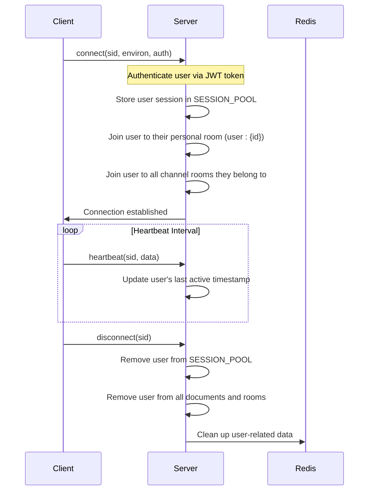
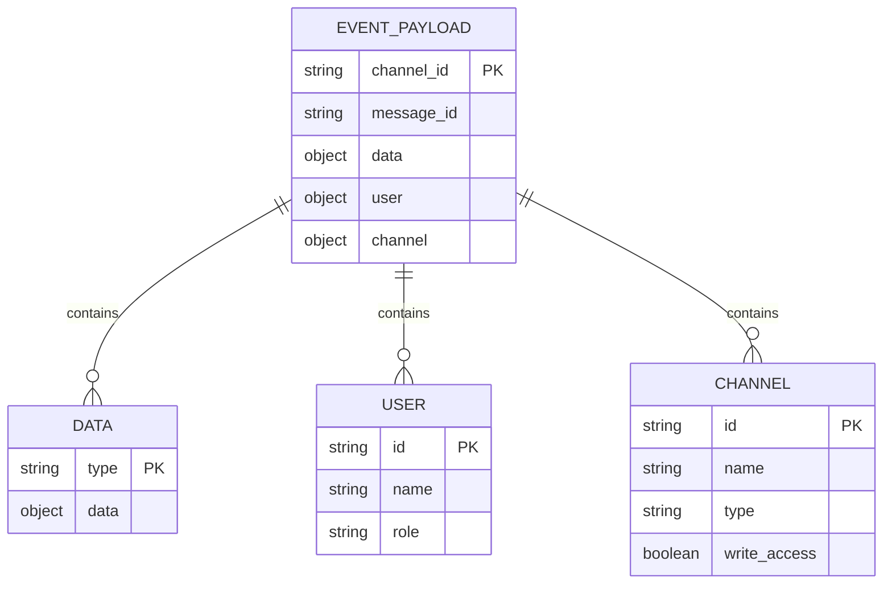
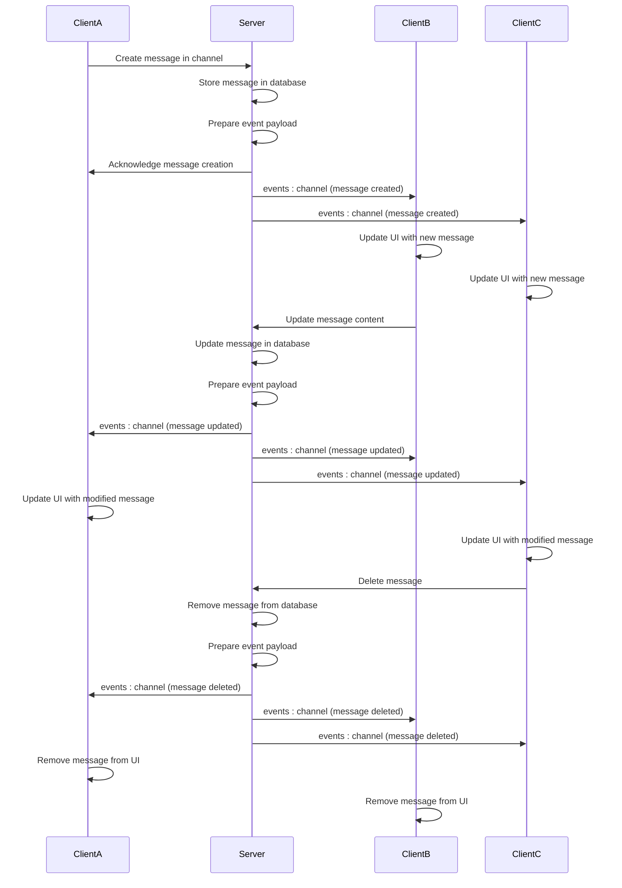
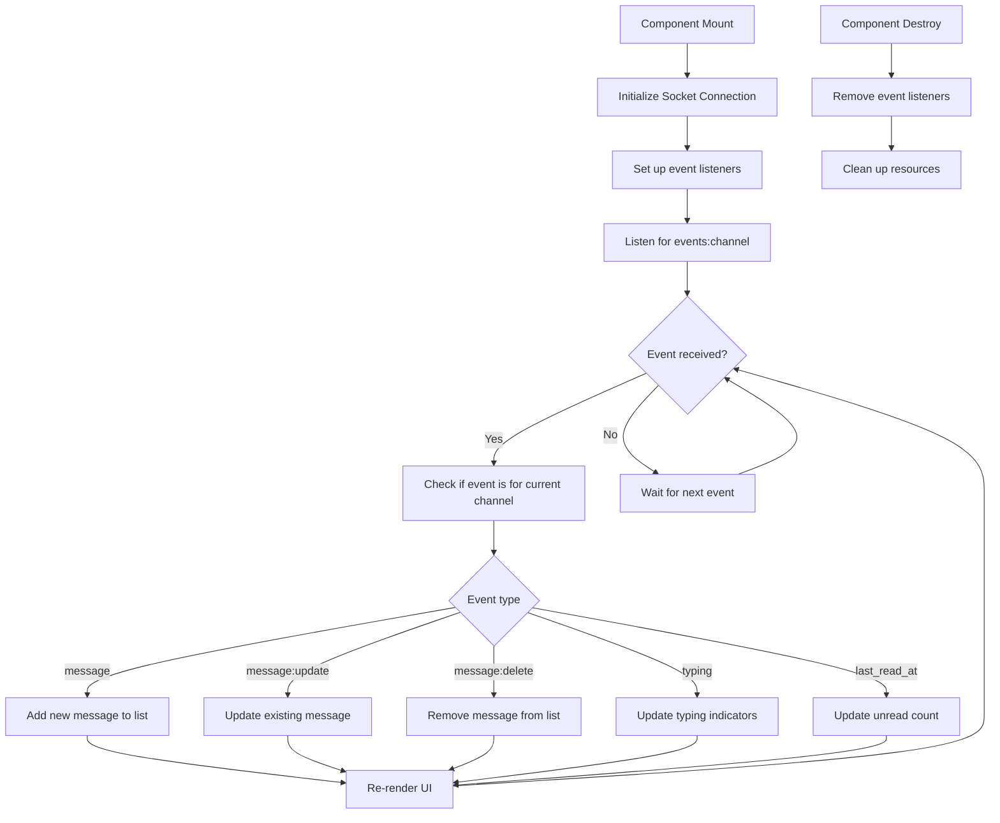
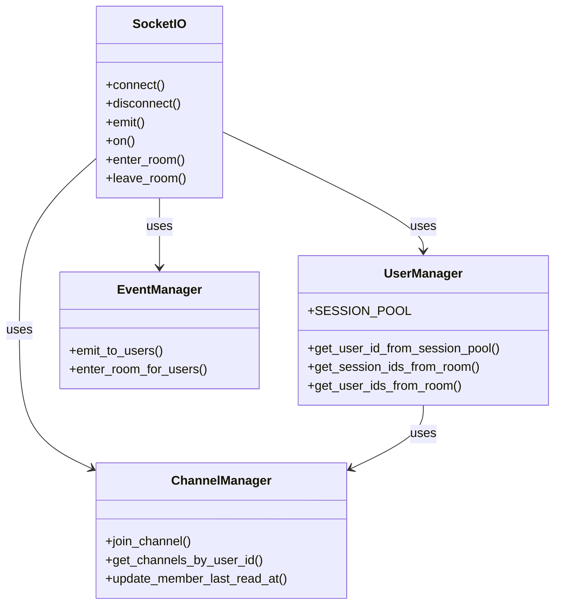
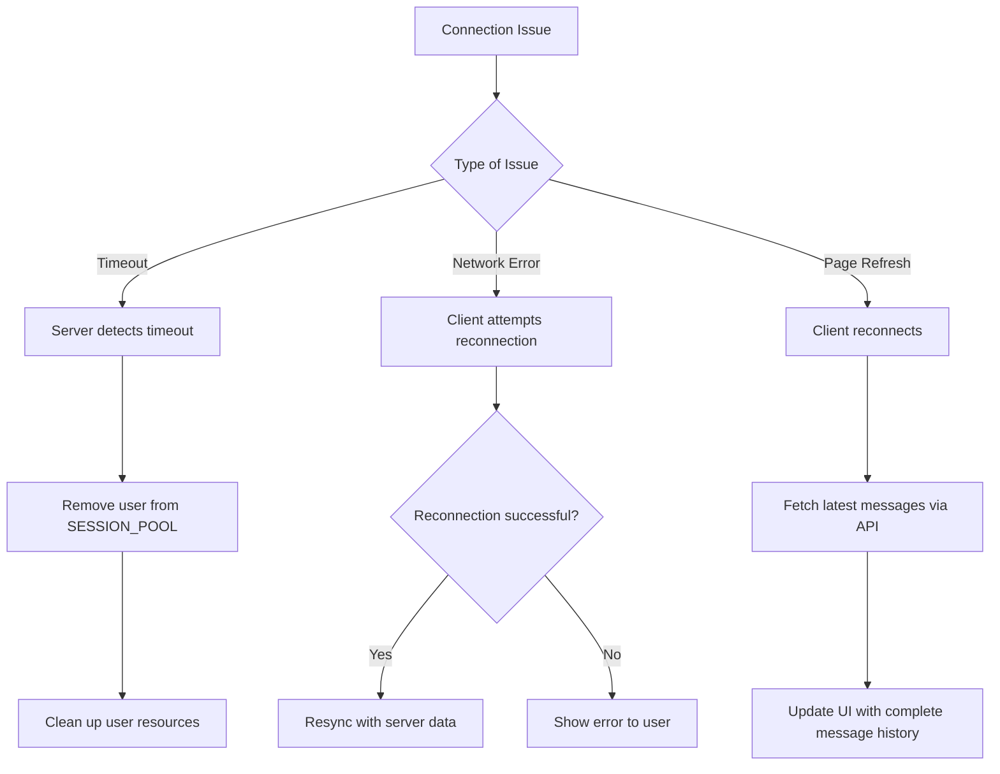
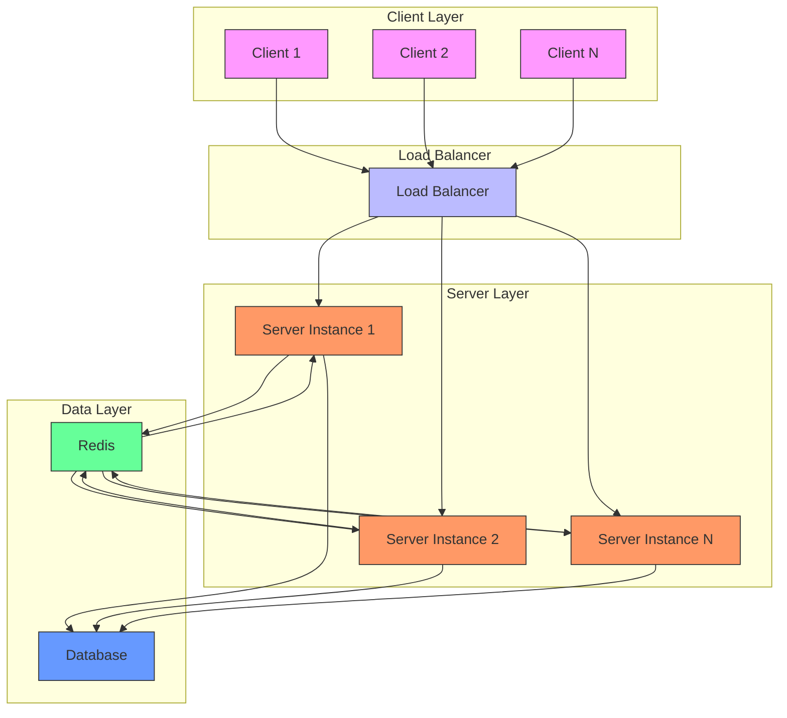

# Real-time Message Streaming

<cite>
**Referenced Files in This Document**   
- [main.py](file://backend/open_webui/socket/main.py)
- [utils.py](file://backend/open_webui/socket/utils.py)
- [messages.py](file://backend/open_webui/models/messages.py)
- [channels.py](file://backend/open_webui/routers/channels.py)
- [Messages.svelte](file://src/lib/components/channel/Messages.svelte)
- [Channel.svelte](file://src/lib/components/channel/Channel.svelte)
- [index.ts](file://src/lib/apis/channels/index.ts)
- [+layout.svelte](file://src/routes/+layout.svelte)
- [env.py](file://backend/open_webui/env.py)
</cite>

## Table of Contents
1. [Introduction](#introduction)
2. [WebSocket Connection Lifecycle](#websocket-connection-lifecycle)
3. [Event Types and Payload Structure](#event-types-and-payload-structure)
4. [Message Creation, Update, and Deletion Events](#message-creation-update-and-deletion-events)
5. [Frontend Event Handling](#frontend-event-handling)
6. [Channel Membership and Room Management](#channel-membership-and-room-management)
7. [Common Issues and Error Handling](#common-issues-and-error-handling)
8. [Performance Considerations](#performance-considerations)
9. [Conclusion](#conclusion)

## Introduction
The real-time message streaming functionality in the Chat System enables instant communication between users through WebSocket-based updates. This system allows for immediate message delivery, typing indicators, and other collaborative features without requiring page refreshes. The implementation leverages Socket.IO for bidirectional communication between the server and clients, with Redis support for horizontal scaling in distributed environments. This document provides a comprehensive analysis of the real-time messaging system, covering the connection lifecycle, event types, data payloads, frontend integration, and performance considerations.

## WebSocket Connection Lifecycle

The WebSocket connection lifecycle in the Chat System follows a well-defined sequence of events from connection establishment to disconnection. The process begins when a client connects to the WebSocket server, which is configured with specific parameters for optimal performance and reliability.

**Diagram sources**
- [main.py](file://backend/open_webui/socket/main.py#L302-L317)
- [main.py](file://backend/open_webui/socket/main.py#L684-L693)
- [env.py](file://backend/open_webui/env.py#L645-L662)

**Section sources**
- [main.py](file://backend/open_webui/socket/main.py#L302-L317)
- [main.py](file://backend/open_webui/socket/main.py#L684-L693)
- [env.py](file://backend/open_webui/env.py#L645-L662)

## Event Types and Payload Structure

The real-time messaging system uses a standardized event payload structure for all message-related events. The primary event type is "events:channel" which is used for broadcasting message updates to all connected clients in the same channel.

The event payload follows a consistent structure with the following key components:
- **channel_id**: The unique identifier of the channel where the event occurred
- **message_id**: The unique identifier of the message involved in the event
- **data**: A nested object containing the event type and associated data
- **user**: Information about the user who triggered the event
- **channel**: Information about the channel where the event occurred

The "data" object contains a "type" field that specifies the nature of the event, with different types for message creation, updates, deletions, reactions, and typing indicators. This standardized structure allows the frontend to handle different event types consistently while providing the necessary information for UI updates.

**Diagram sources**
- [main.py](file://backend/open_webui/socket/main.py#L413-L447)
- [channels.py](file://backend/open_webui/routers/channels.py#L1023-L1039)
- [Channel.svelte](file://src/lib/components/channel/Channel.svelte#L115-L180)

**Section sources**
- [main.py](file://backend/open_webui/socket/main.py#L413-L447)
- [channels.py](file://backend/open_webui/routers/channels.py#L1023-L1039)

## Message Creation, Update, and Deletion Events

The system handles message creation, updates, and deletions through a consistent event broadcasting pattern. When a message is created, updated, or deleted, the server emits an "events:channel" event to all connected clients in the same channel.

When a new message is created, the server emits an event with the type "message" in the data object. The payload includes the complete message data, including content, metadata, and user information. For message updates, the event type is "message:update", and for deletions, it's "message:delete". This consistent pattern allows the frontend to handle all message lifecycle events with a single event handler.

**Diagram sources**
- [channels.py](file://backend/open_webui/routers/channels.py#L1023-L1039)
- [channels.py](file://backend/open_webui/routers/channels.py#L1321-L1339)
- [messages.py](file://backend/open_webui/models/messages.py#L451-L459)

**Section sources**
- [channels.py](file://backend/open_webui/routers/channels.py#L1023-L1039)
- [channels.py](file://backend/open_webui/routers/channels.py#L1321-L1339)
- [messages.py](file://backend/open_webui/models/messages.py#L451-L459)

## Frontend Event Handling

The frontend implementation of the real-time messaging system is centered around the Channel.svelte component, which listens for "events:channel" events and updates the UI accordingly. The component establishes event listeners during initialization and cleans them up when the component is destroyed.

The event handler in Channel.svelte processes different event types by checking the "type" field in the event data. For new messages, it adds the message to the beginning of the messages array while removing any temporary message with the same temp_id. For message updates, it finds the existing message by ID and replaces it with the updated data. For deletions, it filters out the message with the matching ID. The component also handles typing indicators by maintaining a list of users who are currently typing and updating this list based on "typing" events.

**Diagram sources**
- [Channel.svelte](file://src/lib/components/channel/Channel.svelte#L115-L180)
- [Messages.svelte](file://src/lib/components/channel/Messages.svelte#L126-L248)
- [+layout.svelte](file://src/routes/+layout.svelte#L97-L155)

**Section sources**
- [Channel.svelte](file://src/lib/components/channel/Channel.svelte#L115-L180)
- [Messages.svelte](file://src/lib/components/channel/Messages.svelte#L126-L248)

## Channel Membership and Room Management

The system uses Socket.IO rooms to manage channel membership and ensure that messages are only broadcast to relevant clients. When a user joins a channel, they are added to the corresponding Socket.IO room, which enables targeted event broadcasting.

The room management system is implemented in the socket/main.py file, where users are automatically added to their personal room (user:{id}) and all channel rooms they belong to when they connect. The "join-channels" event handler ensures that users are added to all their channels when they join. The system also handles the "last_read_at" event, which updates the user's last read timestamp in the database and resets the unread message count in the UI.

**Diagram sources**
- [main.py](file://backend/open_webui/socket/main.py#L318-L381)
- [main.py](file://backend/open_webui/socket/main.py#L57-L87)
- [Channel.svelte](file://src/lib/components/channel/Channel.svelte#L57-L77)

**Section sources**
- [main.py](file://backend/open_webui/socket/main.py#L318-L381)
- [Channel.svelte](file://src/lib/components/channel/Channel.svelte#L57-L77)

## Common Issues and Error Handling

The real-time messaging system addresses several common issues related to WebSocket connections and message delivery. These include connection timeouts, message ordering, handling of offline clients, and ensuring data consistency across clients.

For connection timeouts, the system implements heartbeat functionality that sends a "heartbeat" event every 30 seconds to maintain the connection. The server is configured with ping timeout and interval settings to detect and handle disconnected clients promptly. When a client disconnects, the server removes the user from the SESSION_POOL and cleans up their document access.

Message ordering is maintained through the use of timestamps in nanoseconds (created_at and updated_at fields). The frontend displays messages in reverse chronological order, with the most recent messages at the top. When new messages arrive, they are inserted at the beginning of the list, ensuring correct ordering.

For offline clients, the system relies on the database as the source of truth. When a user reconnects, they retrieve the latest messages from the API rather than relying solely on WebSocket events. This ensures that no messages are missed during disconnection periods.

**Diagram sources**
- [main.py](file://backend/open_webui/socket/main.py#L354-L359)
- [+layout.svelte](file://src/routes/+layout.svelte#L131-L137)
- [Channel.svelte](file://src/lib/components/channel/Channel.svelte#L101-L103)

**Section sources**
- [main.py](file://backend/open_webui/socket/main.py#L354-L359)
- [+layout.svelte](file://src/routes/+layout.svelte#L131-L137)

## Performance Considerations

The real-time messaging system includes several performance optimizations to handle scalability and efficiency. These include Redis integration for distributed environments, message queuing, and optimizations for handling large channel memberships.

When WEBSOCKET_MANAGER is set to "redis", the system uses Redis to manage WebSocket connections across multiple server instances. This allows for horizontal scaling and ensures that events are broadcast to all connected clients regardless of which server instance they are connected to. The Redis configuration includes options for sentinel support and cluster mode for high availability.

For large channel memberships, the broadcast operation could become a performance bottleneck. The system mitigates this by using Socket.IO's built-in room broadcasting mechanism, which is optimized for this use case. Additionally, the system only sends the minimal necessary data in each event payload, reducing network overhead.

The implementation also includes a periodic cleanup process for the usage pool, which removes expired connections to prevent memory leaks. This is particularly important in long-running applications with many concurrent users.

**Diagram sources**
- [main.py](file://backend/open_webui/socket/main.py#L64-L87)
- [env.py](file://backend/open_webui/env.py#L618-L677)
- [main.py](file://backend/open_webui/socket/main.py#L167-L216)

**Section sources**
- [main.py](file://backend/open_webui/socket/main.py#L64-L87)
- [env.py](file://backend/open_webui/env.py#L618-L677)

## Conclusion

The real-time message streaming functionality in the Chat System provides a robust and scalable solution for instant communication between users. By leveraging WebSocket technology with Socket.IO, the system enables immediate message delivery and collaborative features without requiring page refreshes. The implementation follows a well-structured pattern of connection management, event broadcasting, and frontend integration that ensures reliability and performance.

Key strengths of the system include its standardized event payload structure, efficient room-based broadcasting mechanism, and comprehensive error handling for common WebSocket issues. The integration with Redis enables horizontal scaling for high-traffic environments, while the frontend implementation provides a seamless user experience with real-time updates.

The system effectively addresses challenges related to message ordering, offline clients, and performance at scale. By combining WebSocket real-time updates with traditional API calls for initial data loading and resynchronization, the implementation strikes a balance between responsiveness and data consistency. This architecture provides a solid foundation for real-time collaboration features in the Chat System.