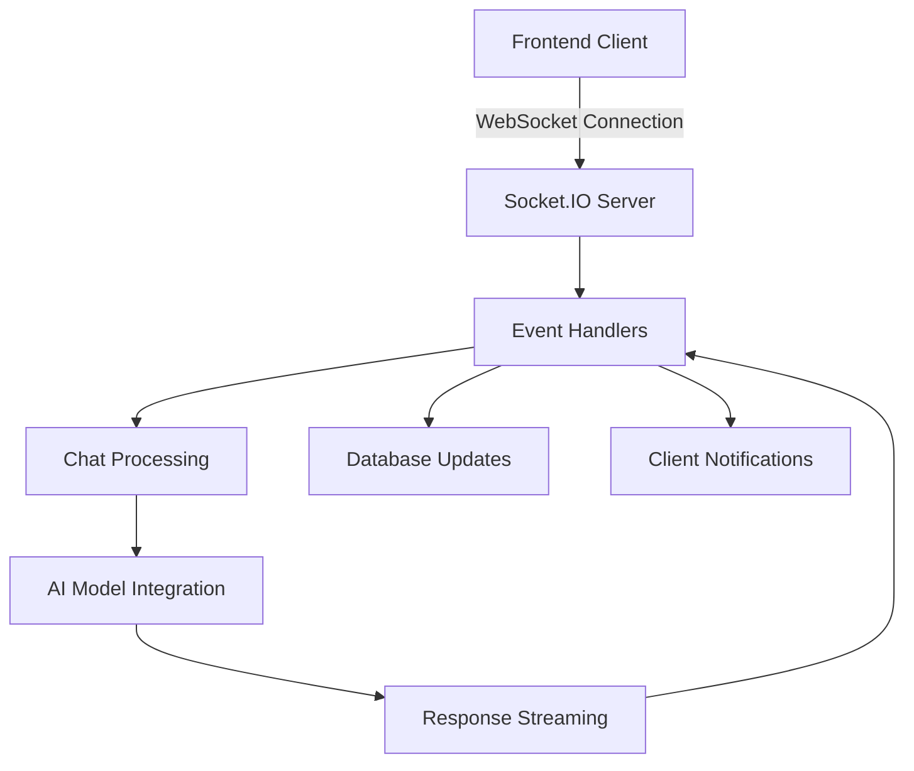
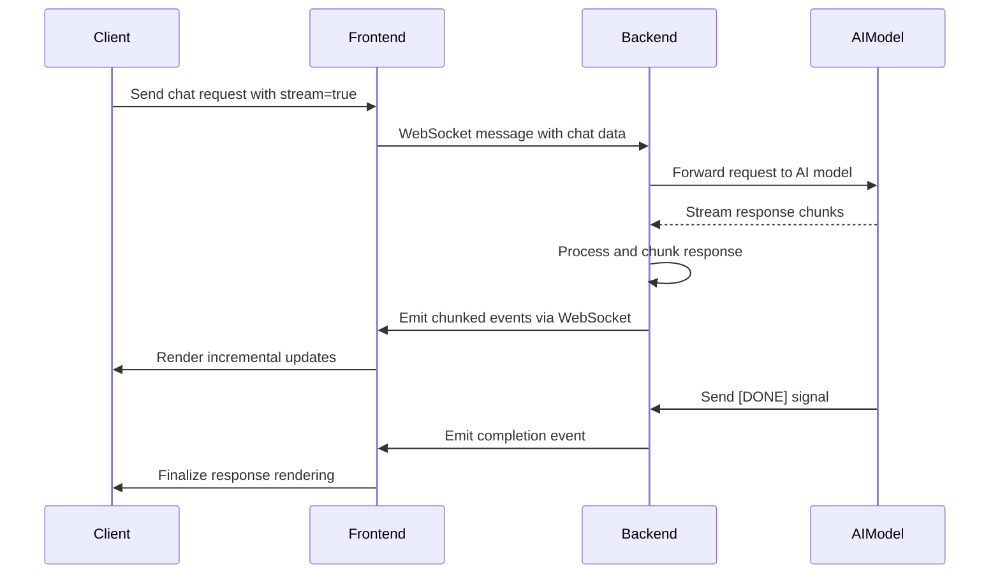
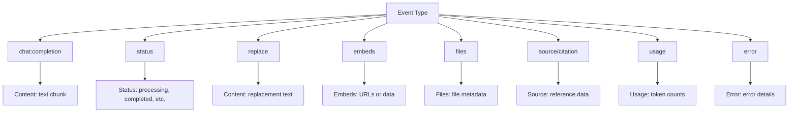
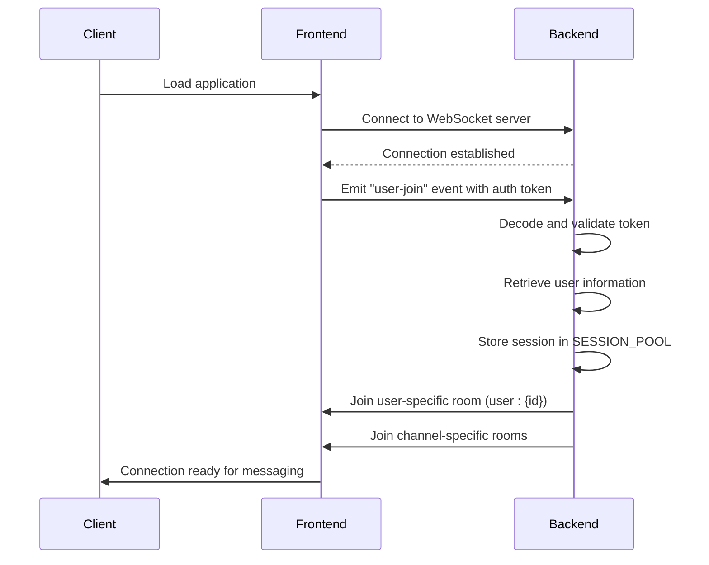
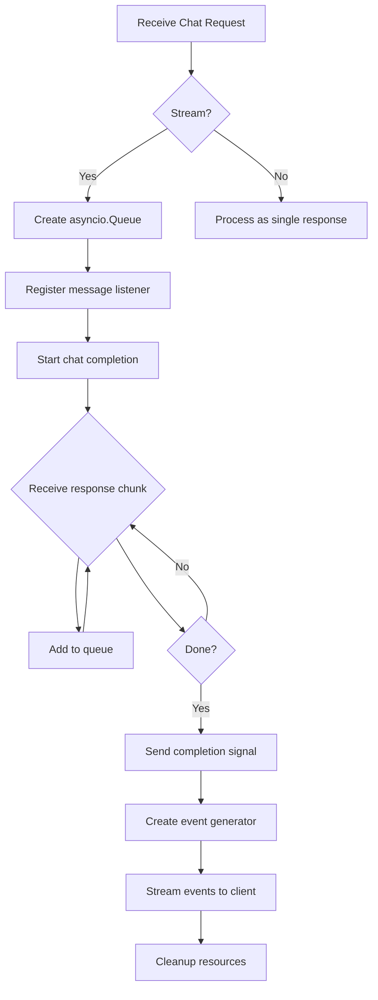
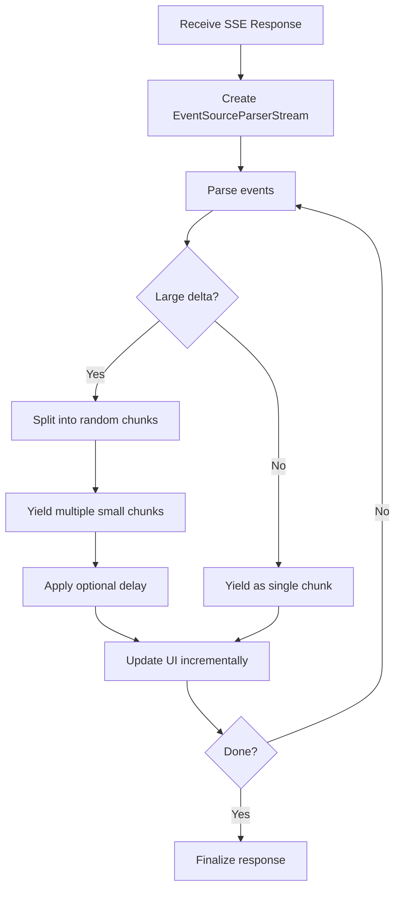

# Real-time Communication

<cite>
**Referenced Files in This Document**   
- [main.py](file://backend/open_webui/socket/main.py)
- [utils.py](file://backend/open_webui/socket/utils.py)
- [index.ts](file://src/lib/apis/streaming/index.ts)
- [chat.py](file://backend/open_webui/utils/chat.py)
- [middleware.py](file://backend/open_webui/utils/middleware.py)
- [env.py](file://backend/open_webui/env.py)
- [+layout.svelte](file://src/routes/+layout.svelte)
</cite>

## Table of Contents
1. [Introduction](#introduction)
2. [WebSocket Implementation](#websocket-implementation)
3. [Message Streaming Protocol](#message-streaming-protocol)
4. [Event Types and Communication Scenarios](#event-types-and-communication-scenarios)
5. [Establishing WebSocket Connections](#establishing-websocket-connections)
6. [Handling Streaming Responses](#handling-streaming-responses)
7. [Performance Considerations](#performance-considerations)
8. [Troubleshooting WebSocket Issues](#troubleshooting-websocket-issues)
9. [Conclusion](#conclusion)

## Introduction
The real-time communication system in Open WebUI leverages WebSocket technology to enable streaming AI responses and real-time chat updates. This documentation details the implementation of WebSocket connections, the message streaming protocol, event types, and performance optimizations for handling concurrent streams. The system is designed to provide a seamless, responsive user experience by efficiently transmitting AI-generated content in real-time.

## WebSocket Implementation

The WebSocket implementation in Open WebUI is built on the Socket.IO library, providing a robust foundation for real-time communication between the frontend and backend. The system supports both WebSocket and HTTP long-polling transports, with WebSocket being the preferred method when available.



**Diagram sources**
- [main.py](file://backend/open_webui/socket/main.py#L64-L103)
- [+layout.svelte](file://src/routes/+layout.svelte#L97-L106)

The WebSocket server is configured with several important parameters that control connection behavior:

- **Ping Interval**: 25 seconds (WEBSOCKET_SERVER_PING_INTERVAL)
- **Ping Timeout**: 20 seconds (WEBSOCKET_SERVER_PING_TIMEOUT)
- **Connection Management**: Uses Redis for distributed session management when WEBSOCKET_MANAGER is set to "redis"
- **CORS Configuration**: Respects the CORS_ALLOW_ORIGIN setting from the application configuration

The implementation supports multiple deployment scenarios through configurable managers. When WEBSOCKET_MANAGER is set to "redis", the system uses Redis to manage WebSocket connections across multiple server instances, enabling horizontal scaling. This is particularly important for production deployments where multiple backend instances may be running behind a load balancer.

**Section sources**
- [main.py](file://backend/open_webui/socket/main.py#L64-L103)
- [env.py](file://backend/open_webui/env.py#L613-L662)

## Message Streaming Protocol

The message streaming protocol in Open WebUI is designed to efficiently transmit AI-generated content in chunks, providing a smooth streaming experience to users. The protocol uses Server-Sent Events (SSE) format over the WebSocket connection, allowing for incremental delivery of AI responses.



**Diagram sources**
- [chat.py](file://backend/open_webui/utils/chat.py#L91-L149)
- [index.ts](file://src/lib/apis/streaming/index.ts#L28-L40)

The streaming protocol follows these key principles:

1. **Chunked Transmission**: AI responses are broken into smaller chunks for transmission
2. **Event-Driven Architecture**: Each chunk is sent as a separate event with appropriate metadata
3. **Client-Side Reassembly**: The frontend reassembles chunks into a complete message while rendering incrementally
4. **Error Handling**: The protocol includes mechanisms for handling transmission errors and connection interruptions

The backend processes the streaming response from AI models and converts it into the appropriate format for transmission over WebSocket. When a streaming request is received, the system creates an asyncio.Queue to buffer response chunks, which are then emitted as WebSocket events to the client.

**Section sources**
- [chat.py](file://backend/open_webui/utils/chat.py#L91-L150)
- [middleware.py](file://backend/open_webui/utils/middleware.py#L2444-L2774)

## Event Types and Communication Scenarios

Open WebUI implements a comprehensive event system to handle various communication scenarios in real-time. The system uses different event types to represent the state and content of AI responses, enabling rich, interactive experiences.

### Core Event Types

The following event types are used to communicate different aspects of the AI response:

- **chat:completion**: Contains incremental content updates from the AI model
- **status**: Indicates the processing status of a request
- **replace**: Replaces existing content with new content
- **embeds**: Adds embedded content (images, videos, etc.) to the response
- **files**: Attaches files to the response
- **source/citation**: Provides source information and citations for the response
- **usage**: Reports token usage and other metrics
- **error**: Indicates errors in processing or transmission



**Diagram sources**
- [main.py](file://backend/open_webui/socket/main.py#L716-L804)
- [index.ts](file://src/lib/apis/streaming/index.ts#L4-L24)

### Event Processing Flow

When an event is received from the AI model, the backend processes it according to its type:

1. For **chat:completion** events, the content is extracted and potentially chunked based on the configured delta size
2. For **status** events, the system updates the message status in the database
3. For **message** events, the content is appended to the existing message content
4. For **replace** events, the entire message content is replaced
5. For **embeds** and **files** events, the associated media is added to the message
6. For **source/citation** events, the source information is appended to the message sources
7. For **usage** events, the token usage is recorded and may be displayed to the user
8. For **error** events, the error is propagated to the client for display

The event emitter function handles both transmission to the client and optional database updates, ensuring that the user interface and persistent storage remain synchronized.

**Section sources**
- [main.py](file://backend/open_webui/socket/main.py#L695-L839)
- [middleware.py](file://backend/open_webui/utils/middleware.py#L2444-L2774)

## Establishing WebSocket Connections

Establishing a WebSocket connection in Open WebUI involves several steps that ensure secure and authenticated communication between the client and server.

### Connection Initialization

The frontend initializes the WebSocket connection using the Socket.IO client library with the following configuration:

```javascript
const _socket = io(`${WEBUI_BASE_URL}`, {
    reconnection: true,
    reconnectionDelay: 1000,
    reconnectionDelayMax: 5000,
    randomizationFactor: 0.5,
    path: '/ws/socket.io',
    transports: enableWebsocket ? ['websocket'] : ['polling', 'websocket'],
    auth: { token: localStorage.token }
});
```

This configuration includes:
- Automatic reconnection with exponential backoff
- Custom path for the WebSocket endpoint
- Authentication token transmission
- Fallback to polling if WebSocket is not available

### Authentication Flow

The authentication process for WebSocket connections follows these steps:



**Diagram sources**
- [+layout.svelte](file://src/routes/+layout.svelte#L151-L152)
- [main.py](file://backend/open_webui/socket/main.py#L318-L351)

The backend handles the "user-join" event by:
1. Extracting the authentication token from the event data
2. Decoding and validating the token using the decode_token function
3. Retrieving the user information from the database
4. Storing the user session in the SESSION_POOL (Redis or in-memory)
5. Adding the client to user-specific and channel-specific rooms for targeted messaging

Heartbeat monitoring is implemented to track user activity. The frontend sends a "heartbeat" event every 30 seconds, which the backend uses to update the user's last active timestamp in the database.

**Section sources**
- [main.py](file://backend/open_webui/socket/main.py#L318-L351)
- [+layout.svelte](file://src/routes/+layout.svelte#L132-L137)

## Handling Streaming Responses

Handling streaming responses involves coordination between the backend, frontend, and AI model integration layers to provide a seamless user experience.

### Backend Streaming Implementation

When a chat request with streaming enabled is received, the backend implements the following process:



**Diagram sources**
- [chat.py](file://backend/open_webui/utils/chat.py#L91-L149)

The key components of the streaming implementation are:

1. **Queue-based Buffering**: An asyncio.Queue is used to buffer response chunks from the AI model
2. **Event Listener**: A message listener is registered to handle incoming chunks
3. **Event Generator**: An async generator yields events to the client in a streaming fashion
4. **Resource Cleanup**: A background task ensures proper cleanup of event handlers

The backend also implements chunking logic to control the size of transmitted chunks. The CHAT_RESPONSE_STREAM_DELTA_CHUNK_SIZE environment variable determines how many delta updates are aggregated before being sent to the client.

### Frontend Streaming Processing

The frontend processes streaming responses using an async generator pattern:



**Diagram sources**
- [index.ts](file://src/lib/apis/streaming/index.ts#L28-L142)

The frontend implementation includes:
- **EventSourceParserStream**: Parses Server-Sent Events from the response stream
- **Chunk Splitting**: Large deltas are split into random-sized chunks (1-3 characters) to simulate more fluid streaming
- **Visibility-based Throttling**: Delays are only applied when the tab is visible to avoid throttling in background tabs
- **Incremental Rendering**: The UI is updated with each chunk, providing immediate feedback to the user

The splitLargeDeltas feature can be enabled to break large response chunks into smaller pieces, creating a more natural typing effect even when the AI model sends large blocks of text at once.

**Section sources**
- [chat.py](file://backend/open_webui/utils/chat.py#L91-L149)
- [index.ts](file://src/lib/apis/streaming/index.ts#L28-L142)
- [middleware.py](file://backend/open_webui/utils/middleware.py#L2444-L2774)

## Performance Considerations

The WebSocket streaming implementation in Open WebUI includes several performance optimizations to handle multiple concurrent streams efficiently.

### Chunk Size Configuration

The CHAT_RESPONSE_STREAM_DELTA_CHUNK_SIZE environment variable controls how frequently updates are sent to the client:

```python
delta_chunk_size = max(
    CHAT_RESPONSE_STREAM_DELTA_CHUNK_SIZE,
    int(
        metadata.get("params", {}).get("stream_delta_chunk_size")
        or 1
    ),
)
```

This configuration allows for:
- **Server-level default**: Set via environment variable (default: 1)
- **Request-level override**: Can be specified in the request parameters
- **Dynamic adjustment**: The system uses the maximum of the two values

A smaller chunk size (1) provides more frequent updates but increases network overhead. A larger chunk size reduces network traffic but may make the streaming feel less responsive. The optimal value depends on the specific use case and network conditions.

### Concurrent Stream Management

The system handles multiple concurrent streams through several mechanisms:

1. **Per-request Channels**: Each chat request uses a unique channel identifier based on user_id, session_id, and request_id
2. **Asyncio Integration**: The use of asyncio.Queue and async generators enables non-blocking processing of multiple streams
3. **Redis-backed Storage**: When using Redis as the WebSocket manager, session and usage data are stored in Redis for shared access across server instances
4. **Memory-efficient Processing**: Response chunks are processed incrementally without storing the complete response in memory

### Optimization Techniques

The implementation includes several optimization techniques:

- **Lazy Event Emission**: Events are only emitted when there are sufficient deltas to justify the network transmission
- **Background Processing**: Chat completion processing occurs in the background, allowing the main thread to handle other requests
- **Resource Cleanup**: Event handlers are removed when streaming completes to prevent memory leaks
- **Connection Pooling**: The use of Redis for session management enables efficient connection pooling in distributed deployments

The system also includes a periodic cleanup process for the usage pool, which removes expired connections to prevent memory bloat:

```python
async def periodic_usage_pool_cleanup():
    while True:
        # Remove expired connections
        expired_sids = [
            sid for sid, details in connections.items()
            if now - details["updated_at"] > TIMEOUT_DURATION
        ]
        # Clean up empty model entries
        if not connections:
            del USAGE_POOL[model_id]
```

**Section sources**
- [env.py](file://backend/open_webui/env.py#L566-L578)
- [middleware.py](file://backend/open_webui/utils/middleware.py#L2444-L2451)
- [main.py](file://backend/open_webui/socket/main.py#L167-L216)

## Troubleshooting WebSocket Issues

Common WebSocket communication problems and their solutions:

### Connection Timeouts

**Symptoms**:
- Connection fails to establish
- Frequent disconnections
- "Ping timeout" errors in logs

**Causes and Solutions**:
- **Network Latency**: High latency can cause ping timeouts. Adjust WEBSOCKET_SERVER_PING_TIMEOUT (default: 20 seconds) and WEBSOCKET_SERVER_PING_INTERVAL (default: 25 seconds) to accommodate slower networks.
- **Firewall/Proxy Restrictions**: Corporate firewalls or proxies may block WebSocket connections. Ensure that the WebSocket endpoint (/ws/socket.io) is accessible and not blocked.
- **Load Balancer Configuration**: Load balancers must be configured to support WebSocket connections and maintain sticky sessions.

### Authentication Failures

**Symptoms**:
- "user-join" event fails
- Connection established but no user context
- Permission errors

**Causes and Solutions**:
- **Invalid Token**: Ensure the authentication token is valid and not expired. The frontend should handle token refresh automatically.
- **Token Transmission**: Verify that the token is being sent in the auth object during the "user-join" event.
- **Token Decoding**: Check that the decode_token function can properly decode the token format being used.

### Streaming Interruptions

**Symptoms**:
- Streaming stops prematurely
- Incomplete responses
- Gaps in the received content

**Causes and Solutions**:
- **Queue Overflow**: The asyncio.Queue might be filling up faster than it can be processed. Monitor queue sizes and consider increasing processing capacity.
- **Network Instability**: Unstable connections can cause packet loss. Implement client-side reconnection logic and server-side session persistence.
- **Resource Limits**: Server resource constraints (CPU, memory) can affect streaming performance. Monitor server metrics and scale resources as needed.

### Debugging Tips

1. **Enable Logging**: Set appropriate log levels (SRC_LOG_LEVELS["SOCKET"]) to capture detailed WebSocket activity.
2. **Monitor Redis**: When using Redis as the WebSocket manager, monitor Redis memory usage and connection counts.
3. **Client-Side Inspection**: Use browser developer tools to inspect WebSocket frames and identify transmission issues.
4. **Load Testing**: Simulate multiple concurrent users to identify performance bottlenecks.

**Section sources**
- [main.py](file://backend/open_webui/socket/main.py#L303-L317)
- [+layout.svelte](file://src/routes/+layout.svelte#L109-L112)
- [env.py](file://backend/open_webui/env.py#L645-L661)

## Conclusion
The real-time communication system in Open WebUI provides a robust foundation for streaming AI responses and real-time chat updates. By leveraging WebSocket technology with Socket.IO, the system delivers a responsive, interactive user experience. The message streaming protocol efficiently transmits AI-generated content in chunks, while the event-driven architecture supports rich communication scenarios. Performance optimizations like configurable chunk sizes and Redis-backed session management enable the system to handle multiple concurrent streams effectively. With proper configuration and monitoring, the WebSocket implementation can provide reliable, low-latency communication for AI-powered applications.