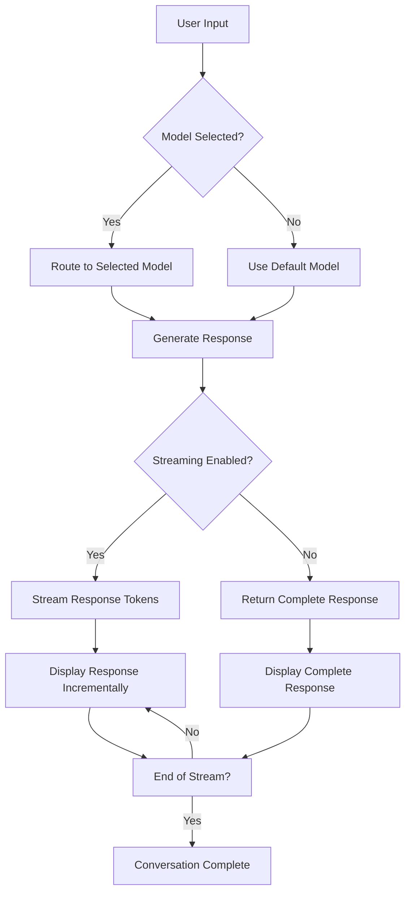
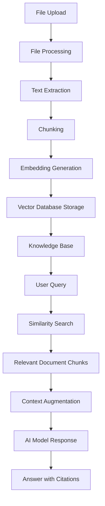
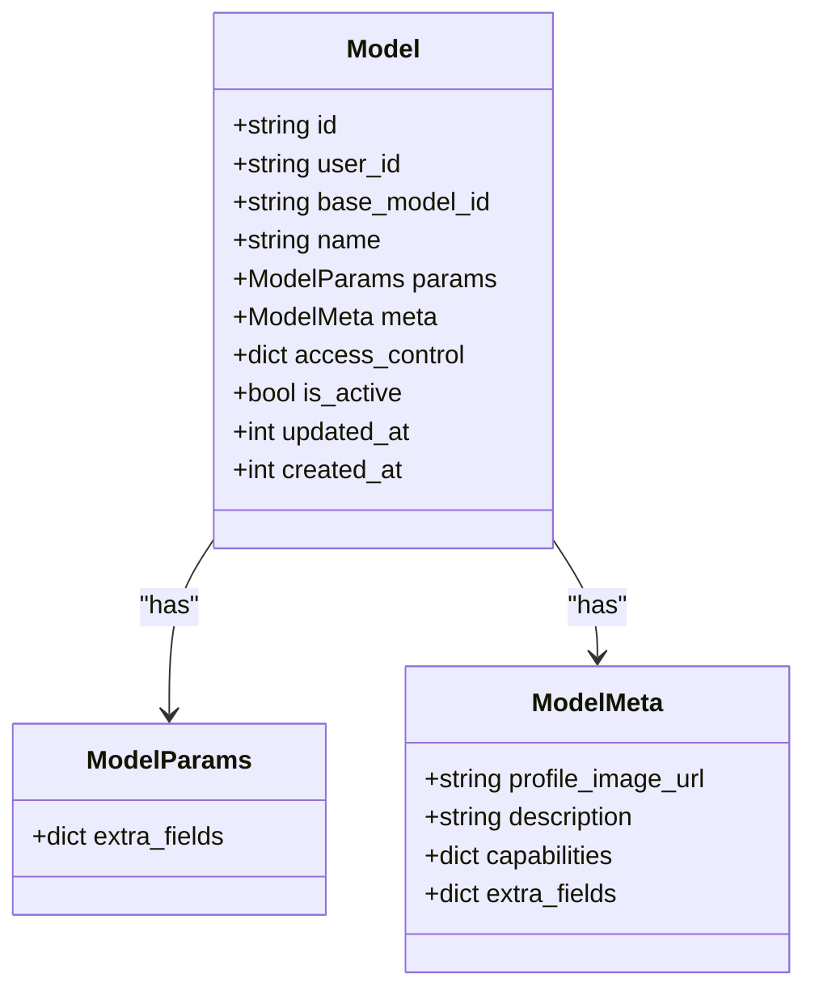
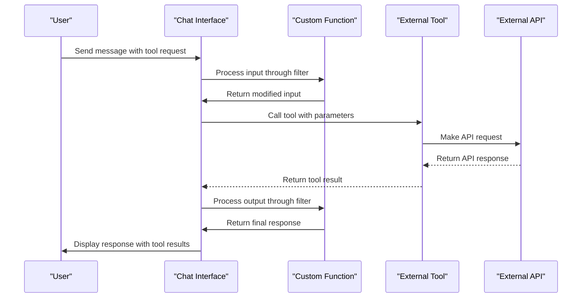

# Core Features

<cite>
**Referenced Files in This Document**   
- [chats.py](file://backend/open_webui/models/chats.py)
- [messages.py](file://backend/open_webui/models/messages.py)
- [knowledge.py](file://backend/open_webui/models/knowledge.py)
- [models.py](file://backend/open_webui/models/models.py)
- [chat.py](file://backend/open_webui/utils/chat.py)
- [functions.py](file://backend/open_webui/models/functions.py)
- [tools.py](file://backend/open_webui/models/tools.py)
- [vector/main.py](file://backend/open_webui/retrieval/vector/main.py)
- [chats.py](file://backend/open_webui/routers/chats.py)
- [knowledge.py](file://backend/open_webui/routers/knowledge.py)
- [models.py](file://backend/open_webui/routers/models.py)
- [functions.py](file://backend/open_webui/routers/functions.py)
- [tools.py](file://backend/open_webui/routers/tools.py)
</cite>

## Table of Contents
1. [Chat System with AI Model Integration](#chat-system-with-ai-model-integration)
2. [Document Processing and Knowledge Management](#document-processing-and-knowledge-management)
3. [Model Management System](#model-management-system)
4. [Extensibility through Functions and Tools](#extensibility-through-functions-and-tools)

## Chat System with AI Model Integration

The chat system in open-webui provides a robust foundation for interacting with AI models through a conversational interface. The system manages conversations through the Chat model, which stores chat history, metadata, and user-specific information. Each chat session is uniquely identified and can be organized into folders, pinned for quick access, or archived for later retrieval. The chat interface supports message streaming, allowing users to see responses as they are generated by the AI model, creating a more natural and interactive experience.

Model selection is a core feature, enabling users to choose from various AI models configured in the system. The chat system integrates with the model management system to provide a seamless experience for switching between different models. When a user initiates a chat, they can select their preferred model, and the system routes the conversation to the appropriate backend. The chat system also supports sharing conversations with others through unique share IDs, allowing collaboration and knowledge sharing.

The chat system implements conversation management features such as cloning chats, which creates a copy of an existing conversation while preserving the context and message history. Users can also update chat titles and manage chat metadata. The system supports message editing, allowing users to modify their previous messages and regenerate responses based on the updated input. This feature is particularly useful for refining prompts and improving the quality of AI-generated responses.

**Diagram sources**
- [chat.py](file://backend/open_webui/utils/chat.py#L72-L331)
- [chats.py](file://backend/open_webui/routers/chats.py#L133-L143)

**Section sources**
- [chats.py](file://backend/open_webui/models/chats.py#L26-L87)
- [chat.py](file://backend/open_webui/utils/chat.py#L72-L331)

## Document Processing and Knowledge Management

The document processing and knowledge management system in open-webui enables users to upload files, extract information, and leverage this knowledge in AI conversations through Retrieval-Augmented Generation (RAG). The system supports various file formats and uses a vector database to store and retrieve document content efficiently. When a user uploads a file, it is processed and converted into embeddings, which are stored in a vector database for fast similarity search.

Knowledge bases are created to organize and manage document collections. Users can create multiple knowledge bases, each containing a set of documents relevant to a specific topic or use case. The knowledge management system allows users to add, remove, and update files within a knowledge base. When a file is added to a knowledge base, its content is indexed in the vector database, making it available for retrieval during AI conversations. The system supports reindexing knowledge bases, which updates the vector database with the latest content from all files in the knowledge base.

The RAG implementation integrates document retrieval with AI model responses. When a user asks a question in a chat that has access to a knowledge base, the system first searches the vector database for relevant document chunks. These chunks are then included in the context provided to the AI model, allowing it to generate responses based on the specific information from the uploaded documents. This approach enhances the AI's ability to provide accurate and contextually relevant answers, especially for domain-specific queries.

**Diagram sources**
- [knowledge.py](file://backend/open_webui/models/knowledge.py#L36-L115)
- [main.py](file://backend/open_webui/retrieval/vector/main.py#L6-L87)
- [knowledge.py](file://backend/open_webui/routers/knowledge.py#L277-L339)

**Section sources**
- [knowledge.py](file://backend/open_webui/models/knowledge.py#L36-L115)
- [main.py](file://backend/open_webui/retrieval/vector/main.py#L6-L87)

## Model Management System

The model management system in open-webui provides comprehensive capabilities for configuring, organizing, and controlling access to AI models. Models are defined with various parameters including the model ID, display name, configuration parameters, and metadata. The system supports both local models and models from external providers, allowing users to integrate a wide range of AI capabilities. Each model can be configured with specific parameters that control its behavior, such as temperature, maximum tokens, and other generation settings.

Model access control is implemented through a flexible permission system that allows administrators to define who can use specific models. Models can be set as public, private, or shared with specific user groups. The system also supports model activation and deactivation, enabling administrators to control which models are available for use. Users can search and filter models based on various criteria, including name, tags, and creation date, making it easy to find and select the appropriate model for a given task.

The model management system includes features for importing and exporting model configurations, facilitating sharing and backup of model settings. Administrators can sync model configurations across different instances or environments. The system also provides an interface for creating custom models by defining new model IDs that proxy to existing models, allowing for the creation of specialized configurations without duplicating model files. This feature is particularly useful for creating variations of models with different parameter settings for specific use cases.

**Diagram sources**
- [models.py](file://backend/open_webui/models/models.py#L55-L123)
- [models.py](file://backend/open_webui/routers/models.py#L130-L166)

**Section sources**
- [models.py](file://backend/open_webui/models/models.py#L55-L123)
- [models.py](file://backend/open_webui/routers/models.py#L130-L166)

## Extensibility through Functions and Tools

The extensibility features in open-webui allow users to enhance the system's capabilities through custom functions and external tools. Functions are Python modules that can be loaded into the system to provide additional functionality, such as filters that modify chat input or output, or actions that perform specific tasks. The system supports function valves, which are configurable parameters that allow users to customize the behavior of functions without modifying the code. Functions can be created, updated, and deleted through the API, and they can be toggled on or off as needed.

Tools provide integration with external services and APIs, extending the system's capabilities beyond local processing. The system supports both local tools and external tool servers using standards like OpenAPI and MCP (Model Context Protocol). Tool servers can expose multiple endpoints that can be called from within chat conversations, enabling complex workflows and integrations with external systems. The tool system includes authentication mechanisms, such as OAuth, for securely connecting to external services that require authorization.

The integration between functions, tools, and the chat system enables powerful automation scenarios. For example, a function can be configured to automatically call a tool when specific conditions are met in a conversation. This allows for the creation of sophisticated workflows where the AI model can trigger external actions based on user input. The system also supports user-specific tool configurations through user valves, allowing different users to customize how tools behave based on their preferences or requirements.

**Diagram sources**
- [functions.py](file://backend/open_webui/models/functions.py#L19-L35)
- [tools.py](file://backend/open_webui/models/tools.py#L24-L54)
- [functions.py](file://backend/open_webui/routers/functions.py#L235-L348)
- [tools.py](file://backend/open_webui/routers/tools.py#L364-L420)

**Section sources**
- [functions.py](file://backend/open_webui/models/functions.py#L19-L35)
- [tools.py](file://backend/open_webui/models/tools.py#L24-L54)
- [functions.py](file://backend/open_webui/routers/functions.py#L235-L348)
- [tools.py](file://backend/open_webui/routers/tools.py#L364-L420)