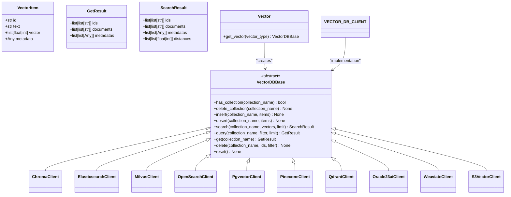

# Document Indexing and Processing Pipeline

<cite>
**Referenced Files in This Document**   
- [knowledge.py](file://backend/open_webui/models/knowledge.py)
- [retrieval.py](file://backend/open_webui/routers/retrieval.py)
- [files.py](file://backend/open_webui/routers/files.py)
- [main.py](file://backend/open_webui/retrieval/loaders/main.py)
- [factory.py](file://backend/open_webui/retrieval/vector/factory.py)
- [vector/main.py](file://backend/open_webui/retrieval/vector/main.py)
- [utils/files.py](file://backend/open_webui/utils/files.py)
</cite>

## Table of Contents
1. [Introduction](#introduction)
2. [Document Processing Workflow](#document-processing-workflow)
3. [Loader Architecture](#loader-architecture)
4. [Text Extraction and Chunking](#text-extraction-and-chunking)
5. [Vectorization and Embedding](#vectorization-and-embedding)
6. [Vector Database Integration](#vector-database-integration)
7. [RAG System Integration](#rag-system-integration)
8. [Error Handling and Troubleshooting](#error-handling-and-troubleshooting)
9. [Performance Considerations](#performance-considerations)
10. [Conclusion](#conclusion)

## Introduction
The Document Indexing and Processing Pipeline in Open WebUI provides a comprehensive system for ingesting, processing, and indexing documents for retrieval-augmented generation (RAG) applications. This pipeline supports various document types including PDF, DOCX, and other formats, enabling users to upload documents that are then processed through text extraction, chunking, and vectorization before being stored in a vector database for efficient retrieval.

The system is designed with modularity in mind, allowing for multiple content extraction engines and vector database backends. Documents are processed through a series of stages that transform raw files into searchable, semantically meaningful representations that can be effectively used by AI models for context-aware responses.

**Diagram sources**
- [files.py](file://backend/open_webui/routers/files.py#L102-L141)
- [retrieval.py](file://backend/open_webui/routers/retrieval.py#L1270-L1360)
- [main.py](file://backend/open_webui/retrieval/loaders/main.py#L187-L398)

## Document Processing Workflow
The document processing workflow begins when a user uploads a file through the system interface. The file is first stored in the storage system and registered in the database with metadata including filename, content type, and user information. Once uploaded, the document enters the processing pipeline where it is extracted, chunked, and vectorized for storage in the vector database.

The processing workflow is triggered automatically upon upload or can be initiated manually. The system first determines the appropriate loader based on the document type and configured extraction engine. After content extraction, the text is processed according to the configured text splitter (character, token, or markdown header-based), then converted into embeddings using the configured embedding model before being stored in the vector database with appropriate metadata.

Key stages in the workflow include:
- File upload and storage
- Content type detection and loader selection
- Text extraction using appropriate engine
- Text preprocessing and cleaning
- Document chunking based on configured parameters
- Vector embedding generation
- Storage in vector database with metadata

**Section sources**
- [files.py](file://backend/open_webui/routers/files.py#L102-L141)
- [retrieval.py](file://backend/open_webui/routers/retrieval.py#L1270-L1360)

## Loader Architecture
The loader architecture in Open WebUI is designed to support multiple document types and external processing services through a modular, extensible system. The architecture implements a factory pattern that selects the appropriate loader based on the document type and configured content extraction engine.

The system supports various content extraction engines including:
- **datalab_marker**: For advanced PDF and document processing with AI-powered extraction
- **document_intelligence**: Microsoft Azure Document Intelligence integration
- **mineru**: Specialized PDF processing service
- **mistral_ocr**: Mistral AI-powered OCR service
- **tika**: Apache Tika server for document content extraction
- **docling**: Document intelligence service for structured document extraction

For standard document types, the system uses LangChain document loaders:
- PyPDFLoader for PDF files
- Docx2txtLoader for DOCX files
- CSVLoader for CSV files
- TextLoader for plain text files
- Unstructured loaders for various office document formats

The loader selection process evaluates the document's file extension and content type, then selects the appropriate loader based on the configured content extraction engine. External services are used when specifically configured, falling back to internal loaders when external services are not available or configured.

**Diagram sources**
- [main.py](file://backend/open_webui/retrieval/loaders/main.py#L187-L398)
- [datalab_marker.py](file://backend/open_webui/retrieval/loaders/datalab_marker.py)
- [mineru.py](file://backend/open_webui/retrieval/loaders/mineru.py)
- [mistral.py](file://backend/open_webui/retrieval/loaders/mistral.py)

## Text Extraction and Chunking
The text extraction and chunking process transforms raw documents into manageable text segments suitable for embedding and retrieval. The system supports multiple text splitting strategies that can be configured based on the use case and document characteristics.

Three primary text splitting methods are available:
- **Character-based splitting**: Uses RecursiveCharacterTextSplitter to divide text based on character count with specified overlap
- **Token-based splitting**: Uses TokenTextSplitter with configurable token encoding (e.g., tiktoken) for more accurate chunking
- **Markdown header-based splitting**: Uses MarkdownHeaderTextSplitter to preserve document structure by splitting at heading levels

The chunking parameters are configurable through the system settings:
- CHUNK_SIZE: Maximum number of characters or tokens per chunk
- CHUNK_OVERLAP: Number of characters or tokens that overlap between consecutive chunks
- TEXT_SPLITTER: Method used for splitting text (character, token, markdown_header)

Markdown header-based splitting is particularly effective for structured documents as it maintains the document's hierarchical structure. When using this method, the system first splits the document at markdown headers (#, ##, ###, etc.), then applies character-based splitting to each section to ensure chunks don't exceed the maximum size. The resulting chunks include metadata about their position in the document hierarchy, preserving context for retrieval.

The system also handles special content types:
- Base64-encoded images in markdown are extracted and stored as separate files
- Audio files can be transcribed using speech-to-text services
- Binary files are processed according to their specific format

**Diagram sources**
- [main.py](file://backend/open_webui/retrieval/loaders/main.py#L187-L398)
- [retrieval.py](file://backend/open_webui/routers/retrieval.py#L1270-L1360)

## Vectorization and Embedding
The vectorization process converts text chunks into numerical embeddings that capture semantic meaning for efficient similarity search. The system supports multiple embedding engines and models, allowing flexibility in choosing the most appropriate technology for the use case.

Available embedding engines include:
- **Local models**: Sentence Transformers models running on the server
- **OpenAI**: Integration with OpenAI's embedding API
- **Ollama**: Integration with Ollama's local LLM server
- **Azure OpenAI**: Microsoft Azure OpenAI Service
- **External**: Custom external embedding services

The embedding configuration is managed through system settings:
- RAG_EMBEDDING_ENGINE: Specifies the embedding service to use
- RAG_EMBEDDING_MODEL: Specifies the model name or path
- RAG_EMBEDDING_BATCH_SIZE: Number of documents to process in each batch
- ENABLE_ASYNC_EMBEDDING: Whether to process embeddings asynchronously

The vectorization process follows these steps:
1. Retrieve the configured embedding function based on the selected engine
2. Split documents into batches according to the batch size setting
3. Generate embeddings for each batch of text chunks
4. Create VectorItem objects containing the embedding vector, text content, and metadata
5. Store the vectorized documents in the vector database

The system also supports content and query prefixes that can be added to the text before embedding, which can improve retrieval performance by providing additional context to the embedding model.

**Section sources**
- [retrieval.py](file://backend/open_webui/routers/retrieval.py#L121-L215)
- [factory.py](file://backend/open_webui/retrieval/vector/factory.py)

## Vector Database Integration
The vector database integration provides a flexible, pluggable architecture that supports multiple vector database backends. The system uses a factory pattern to instantiate the appropriate vector database client based on the configured vector type.

Supported vector database backends include:
- Chroma
- Elasticsearch
- Milvus (with multitenancy support)
- OpenSearch
- PGVector
- Pinecone
- Qdrant (with multitenancy support)
- Oracle 23ai
- Weaviate
- S3Vector

The VectorDBBase abstract class defines the interface that all vector database implementations must follow, ensuring consistent functionality across different backends. Key operations include:
- has_collection: Check if a collection exists
- delete_collection: Remove a collection
- insert: Add vector items to a collection
- upsert: Insert or update vector items
- search: Find similar vectors
- query: Retrieve vectors using metadata filters
- get: Retrieve all vectors from a collection
- delete: Remove vectors by ID or filter
- reset: Clear the database

Collections in the vector database are organized by knowledge base, with each knowledge base having its own collection named with the knowledge base ID. Documents are stored with metadata including:
- file_id: Reference to the original file
- hash: Content hash to prevent duplicates
- collection_name: Knowledge base identifier
- headings: Document structure information (for markdown header splitting)
- embedding_config: Configuration used for embedding generation

**Diagram sources**
- [vector/main.py](file://backend/open_webui/retrieval/vector/main.py)
- [factory.py](file://backend/open_webui/retrieval/vector/factory.py)
- [pgvector.py](file://backend/open_webui/retrieval/vector/dbs/pgvector.py)
- [s3vector.py](file://backend/open_webui/retrieval/vector/dbs/s3vector.py)

## RAG System Integration
The document indexing pipeline is tightly integrated with the Retrieval-Augmented Generation (RAG) system, providing the foundation for context-aware AI responses. Processed documents serve as knowledge sources that can be retrieved and incorporated into AI prompts to enhance response quality and accuracy.

Knowledge bases are created to organize related documents, with each knowledge base corresponding to a vector database collection. When a user queries the system, the RAG process follows these steps:
1. Convert the user query into an embedding using the same embedding model used for document indexing
2. Search the relevant knowledge base collections for similar document chunks
3. Retrieve the top-k most relevant chunks based on vector similarity
4. Optionally apply reranking using a cross-encoder model to improve relevance scoring
5. Include the retrieved context in the AI prompt to generate a response

The system supports hybrid search capabilities that combine vector similarity with keyword-based BM25 search for improved retrieval accuracy. Reranking can be configured to use different models, including:
- Sentence Transformers cross-encoders
- Jina ColBERT models
- External reranking services

Knowledge bases can be shared with specific users or groups, and access control is enforced at both the knowledge base and document levels. When a model is configured to use a knowledge base, the system automatically retrieves relevant context from the associated documents when processing queries.

**Section sources**
- [knowledge.py](file://backend/open_webui/models/knowledge.py)
- [retrieval.py](file://backend/open_webui/routers/retrieval.py#L240-L253)

## Error Handling and Troubleshooting
The document processing pipeline includes comprehensive error handling to manage failures during the indexing process. When errors occur, the system logs detailed information and updates the document status to reflect the failure, allowing users to identify and address issues.

Common issues and their solutions include:

**Failed Document Parsing**
- **Cause**: Unsupported file format, corrupted file, or missing dependencies
- **Solution**: Verify the file extension is in the ALLOWED_FILE_EXTENSIONS list, ensure the file is not corrupted, and check that required services (Tika, external loaders) are available

**Empty Document Content**
- **Cause**: Content extraction failed or document contains no extractable text
- **Solution**: Try a different content extraction engine, verify the document contains readable text, or preprocess the document to improve text extraction

**Duplicate Document Detection**
- **Cause**: The system uses content hashing to prevent duplicate indexing
- **Solution**: If a document is intentionally different but has the same hash, modify the content slightly to generate a new hash

**Vector Database Connection Issues**
- **Cause**: Vector database service is unavailable or credentials are incorrect
- **Solution**: Verify the vector database service is running, check connection settings, and validate credentials

**Embedding Generation Failures**
- **Cause**: Embedding model not available, API limits exceeded, or network issues
- **Solution**: Verify the embedding engine is properly configured, check API usage limits, and ensure network connectivity

The system provides status endpoints to monitor processing progress and retrieve error details. Document processing status can be checked via the /files/{id}/process/status endpoint, which returns the current status (pending, completed, failed) and error messages when applicable.

**Section sources**
- [files.py](file://backend/open_webui/routers/files.py#L142-L149)
- [retrieval.py](file://backend/open_webui/routers/retrieval.py#L143-L148)

## Performance Considerations
The document indexing pipeline includes several performance optimization strategies to handle large documents and high-volume processing efficiently.

**Indexing Speed Optimizations**
- **Batch Processing**: Documents are processed in batches to maximize throughput
- **Asynchronous Processing**: Embedding generation can be performed asynchronously to avoid blocking the main thread
- **Parallel Processing**: Multiple documents can be processed concurrently when system resources allow
- **Caching**: Content extraction results are cached to avoid reprocessing identical documents

**Retrieval Accuracy Enhancements**
- **Chunk Size Tuning**: Optimal chunk size balances context preservation with retrieval precision
- **Overlap Configuration**: Chunk overlap helps maintain context across boundaries
- **Hybrid Search**: Combining vector search with keyword search improves retrieval relevance
- **Reranking**: Post-processing search results with cross-encoder models refines relevance scoring

**Large Document Handling**
For large documents, the system automatically splits content into manageable chunks. The optimal chunk size depends on the use case:
- Smaller chunks (256-512 tokens) provide more precise retrieval but may lack context
- Larger chunks (1024-2048 tokens) preserve more context but may reduce retrieval precision

The system also supports hierarchical chunking for structured documents, where larger sections are first identified (e.g., by markdown headers), then subdivided into smaller chunks. This approach preserves document structure while creating appropriately sized chunks for embedding.

Resource usage can be monitored and controlled through configuration settings:
- RAG_EMBEDDING_BATCH_SIZE: Controls memory usage during embedding
- ENABLE_ASYNC_EMBEDDING: Reduces request latency by processing embeddings in the background
- CHUNK_SIZE and CHUNK_OVERLAP: Affect both indexing time and retrieval quality

**Section sources**
- [retrieval.py](file://backend/open_webui/routers/retrieval.py#L1270-L1360)
- [config.py](file://backend/open_webui/config.py)

## Conclusion
The Document Indexing and Processing Pipeline in Open WebUI provides a robust, flexible system for transforming various document types into searchable knowledge sources for RAG applications. The architecture supports multiple content extraction engines, text splitting strategies, embedding models, and vector database backends, allowing customization for different use cases and performance requirements.

Key strengths of the system include:
- Modular design with pluggable components
- Support for diverse document formats and external processing services
- Configurable text processing and chunking strategies
- Flexible vector database integration
- Comprehensive error handling and monitoring
- Performance optimizations for both indexing speed and retrieval accuracy

The pipeline effectively bridges the gap between raw documents and AI-ready knowledge, enabling the creation of context-aware applications that can leverage organizational knowledge and user-uploaded content. By understanding the workflow from document upload through indexing to retrieval, users and administrators can optimize their configurations for specific use cases and ensure reliable, high-quality results.