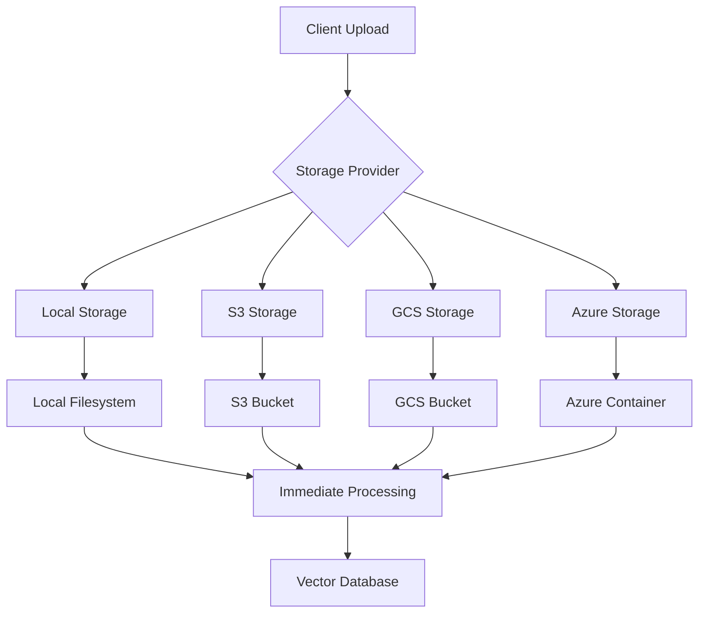
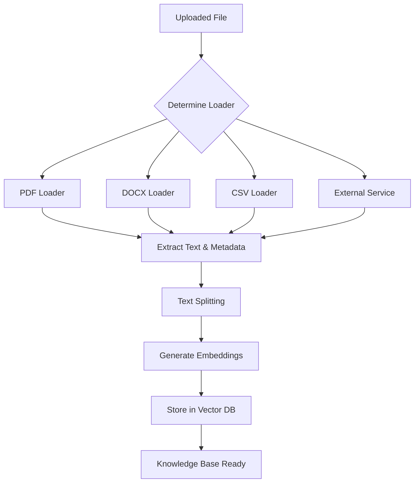
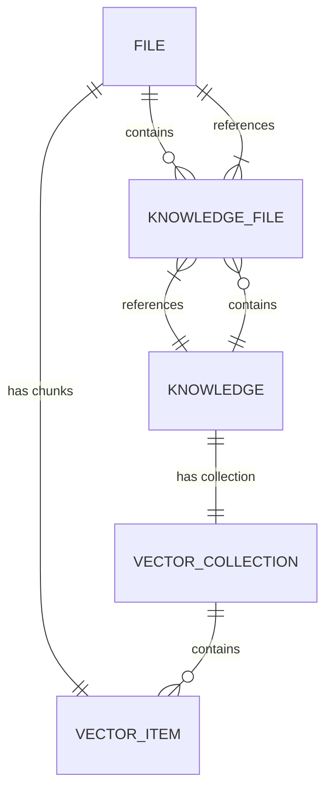

# Document Processing and Knowledge Management

<cite>
**Referenced Files in This Document**   
- [knowledge.py](file://backend/open_webui/routers/knowledge.py)
- [files.py](file://backend/open_webui/routers/files.py)
- [retrieval.py](file://backend/open_webui/routers/retrieval.py)
- [models/knowledge.py](file://backend/open_webui/models/knowledge.py)
- [models/files.py](file://backend/open_webui/models/files.py)
- [storage/provider.py](file://backend/open_webui/storage/provider.py)
- [retrieval/vector/factory.py](file://backend/open_webui/retrieval/vector/factory.py)
- [retrieval/loaders/main.py](file://backend/open_webui/retrieval/loaders/main.py)
- [retrieval/utils.py](file://backend/open_webui/retrieval/utils.py)
- [config.py](file://backend/open_webui/config.py)
- [index.ts](file://src/lib/apis/knowledge/index.ts)
- [index.ts](file://src/lib/apis/files/index.ts)
</cite>

## Table of Contents
1. [Introduction](#introduction)
2. [File Upload Workflow](#file-upload-workflow)
3. [Storage Mechanisms](#storage-mechanisms)
4. [File Metadata Management](#file-metadata-management)
5. [Knowledge Base Creation Process](#knowledge-base-creation-process)
6. [Document Processing and Indexing](#document-processing-and-indexing)
7. [Batch File Processing](#batch-file-processing)
8. [Error Handling in Document Ingestion](#error-handling-in-document-ingestion)
9. [Relationship Between Files, Knowledge Bases, and RAG System](#relationship-between-files-knowledge-bases-and-rag-system)
10. [Performance Considerations](#performance-considerations)
11. [Troubleshooting Common Issues](#troubleshooting-common-issues)
12. [Conclusion](#conclusion)

## Introduction
The Document Processing and Knowledge Management system in Open WebUI provides a comprehensive solution for handling document uploads, storage, processing, and retrieval through a Retrieval-Augmented Generation (RAG) architecture. This system enables users to upload various document types, organize them into knowledge bases, and leverage them for enhanced AI interactions. The architecture supports both local and cloud storage options, sophisticated document processing pipelines, and robust error handling mechanisms. This document provides a detailed analysis of the system's components, workflows, and implementation details.

## File Upload Workflow
The file upload workflow in Open WebUI is designed to handle document ingestion efficiently while providing real-time feedback on processing status. When a user uploads a file, the system follows a structured process that begins with the `upload_file` endpoint in the files router. This endpoint accepts the file along with optional metadata and processing parameters. The workflow first validates the file type against the allowed extensions configured in the system, ensuring security and compatibility.

Upon successful validation, the system generates a unique identifier for the file and stores it using the configured storage provider. The file is then registered in the database with initial metadata, including filename, content type, size, and user information. If processing is enabled (which is the default), the system initiates document processing either synchronously or in the background, depending on the configuration. The processing pipeline extracts text content from the document using appropriate loaders based on the file type, which may include PDF, DOCX, CSV, or various other formats.

During processing, the system updates the file's status in real-time, allowing clients to monitor progress through the `get_file_process_status` endpoint. This endpoint supports both polling and streaming responses, with the streaming option providing Server-Sent Events (SSE) for continuous status updates. The processing workflow handles various document types differently, applying specialized extraction techniques for each format to ensure optimal content retrieval. For example, PDF files may undergo OCR processing if configured, while audio files are transcribed using speech-to-text services.

**Section sources**
- [files.py](file://backend/open_webui/routers/files.py#L152-L287)
- [retrieval.py](file://backend/open_webui/routers/retrieval.py#L225-L800)
- [index.ts](file://src/lib/apis/files/index.ts#L4-L85)

## Storage Mechanisms
Open WebUI supports multiple storage mechanisms for document management, providing flexibility for different deployment scenarios. The system is designed with an abstract storage provider interface that allows seamless integration of various storage backends. The primary storage options include local storage, Amazon S3, Google Cloud Storage (GCS), and Azure Blob Storage, each accessible through a unified API interface.

The storage architecture is implemented through the `StorageProvider` abstract base class, with concrete implementations for each storage type. The `LocalStorageProvider` handles file operations on the local filesystem, storing uploaded files in a designated upload directory. For cloud storage, the system provides specialized providers: `S3StorageProvider` for Amazon S3, `GCSStorageProvider` for Google Cloud Storage, and `AzureStorageProvider` for Azure Blob Storage. Each provider implements the same interface methods for uploading, retrieving, and deleting files, ensuring consistent behavior across different storage backends.

Configuration of the storage mechanism is controlled through environment variables that specify the storage provider type and associated credentials. For S3 storage, variables include `S3_ACCESS_KEY_ID`, `S3_SECRET_ACCESS_KEY`, `S3_BUCKET_NAME`, and `S3_ENDPOINT_URL`. Similarly, GCS storage requires `GCS_BUCKET_NAME` and optionally `GOOGLE_APPLICATION_CREDENTIALS_JSON`, while Azure storage uses `AZURE_STORAGE_ENDPOINT` and `AZURE_STORAGE_CONTAINER_NAME`. The system automatically routes file operations to the appropriate provider based on the `STORAGE_PROVIDER` configuration setting.

A key feature of the storage implementation is its hybrid approach: when using cloud storage, files are first stored locally and then synchronized to the cloud provider. This design ensures that files are immediately available for processing while being asynchronously replicated to the remote storage. The system also supports metadata tagging for S3 storage, allowing additional file attributes to be stored as object tags. All storage providers implement consistent error handling and logging, with detailed error messages propagated to the client for troubleshooting.

**Diagram sources** 
- [storage/provider.py](file://backend/open_webui/storage/provider.py#L43-L377)
- [config.py](file://backend/open_webui/config.py#L11-L27)

**Section sources**
- [storage/provider.py](file://backend/open_webui/storage/provider.py#L43-L377)
- [config.py](file://backend/open_webui/config.py#L11-L27)
- [files.py](file://backend/open_webui/routers/files.py#L219-L228)

## File Metadata Management
File metadata management in Open WebUI is a comprehensive system that captures and stores detailed information about uploaded documents. The metadata structure is designed to support both system functionality and user-facing features, enabling efficient document organization, search, and access control. Each file is associated with a rich set of metadata attributes stored in the database and accessible through the API.

The core metadata fields include technical information such as file ID, user ID, hash (for content verification), filename, and path. Additional metadata captures document properties like content type, size, and creation timestamps. The system also maintains processing status information in the metadata, including processing status (pending, completed, failed) and any error messages from failed processing attempts. This status tracking enables the system to provide real-time feedback to users during the document processing workflow.

Beyond basic technical metadata, the system supports custom metadata through the `meta` field, which is a JSON structure allowing arbitrary key-value pairs. This flexibility enables integration with external systems and supports advanced use cases. The metadata also includes access control information, defining who can read or write to the file. This access control system supports both direct user permissions and group-based access, providing granular control over document visibility.

The metadata management system is implemented through the `File` model and associated database table, with corresponding API endpoints for metadata retrieval and updates. The system provides methods to retrieve file metadata by ID, update metadata fields, and search files based on metadata criteria. This metadata infrastructure is critical for the knowledge management system, as it enables the association of files with knowledge bases and supports the RAG system's document retrieval capabilities.

**Section sources**
- [models/files.py](file://backend/open_webui/models/files.py#L18-L34)
- [files.py](file://backend/open_webui/routers/files.py#L383-L404)
- [files.py](file://backend/open_webui/routers/files.py#L219-L246)

## Knowledge Base Creation Process
The knowledge base creation process in Open WebUI provides a structured approach to organizing documents for AI-assisted retrieval and generation. A knowledge base serves as a container for related documents, enabling focused information retrieval and context management. The creation process begins with the `create_new_knowledge` endpoint, which accepts parameters including the knowledge base name, description, and access control settings.

When creating a new knowledge base, the system first validates user permissions to ensure the user has the necessary rights to create knowledge bases. Administrators have full access, while regular users require specific permissions configured in the system settings. The access control parameter determines who can access the knowledge base, supporting options for public access, private access (owner only), or custom access rules specifying read and write permissions for specific users or groups.

Upon successful validation, the system generates a unique identifier for the knowledge base and stores it in the database with the provided metadata. The knowledge base is then associated with the creating user and timestamped for tracking purposes. Each knowledge base is linked to a vector database collection with the same identifier, enabling seamless integration with the RAG system. This collection serves as the storage location for document embeddings and metadata, facilitating efficient similarity searches during retrieval operations.

The knowledge base creation process also initializes various system components to support document management. The system creates the corresponding vector database collection and sets up access control rules that govern document association and retrieval. Users can later modify knowledge base properties, including name, description, and access control settings, through the update endpoint. The system maintains a complete history of knowledge base modifications through timestamp tracking, supporting audit and version control capabilities.

**Section sources**
- [knowledge.py](file://backend/open_webui/routers/knowledge.py#L84-L117)
- [models/knowledge.py](file://backend/open_webui/models/knowledge.py#L36-L65)
- [index.ts](file://src/lib/apis/knowledge/index.ts#L3-L39)

## Document Processing and Indexing
Document processing and indexing form the core of Open WebUI's knowledge management capabilities, transforming uploaded files into searchable, retrievable content for the RAG system. The processing pipeline is designed to handle various document types through specialized loaders that extract text content while preserving document structure and context. The indexing process converts this extracted content into vector embeddings stored in a vector database for efficient similarity search.

The document processing workflow begins when a file is uploaded or explicitly processed through the `process_file` function. The system first determines the appropriate loader based on the file type and configured content extraction engine. Multiple extraction engines are supported, including internal libraries, external services like Datalab Marker, and specialized tools like MinerU for PDF processing. The choice of engine can be configured globally or specified per document, providing flexibility for different use cases and quality requirements.

For text-based documents, the system uses format-specific loaders such as `PyPDFLoader` for PDFs, `Docx2txtLoader` for DOCX files, and `CSVLoader` for CSV files. These loaders extract text content while preserving structural elements like headings, tables, and metadata. For more complex documents, advanced extraction engines apply OCR, layout analysis, and semantic understanding to produce high-quality text output. The extracted text is then processed through a text splitter, which divides the content into manageable chunks suitable for embedding and retrieval.

The indexing phase converts these text chunks into vector embeddings using the configured embedding model. The system supports various embedding engines, including local sentence transformers, OpenAI, Ollama, and Azure OpenAI. The embeddings are stored in the vector database collection associated with the knowledge base, along with metadata that includes the original file ID, chunk position, and source information. This metadata enables the system to reconstruct document context during retrieval and provide citation information in AI responses.

**Diagram sources** 
- [retrieval/loaders/main.py](file://backend/open_webui/retrieval/loaders/main.py#L187-L398)
- [retrieval.py](file://backend/open_webui/routers/retrieval.py#L225-L800)
- [retrieval/utils.py](file://backend/open_webui/retrieval/utils.py#L535-L774)

**Section sources**
- [retrieval/loaders/main.py](file://backend/open_webui/retrieval/loaders/main.py#L187-L398)
- [retrieval.py](file://backend/open_webui/routers/retrieval.py#L225-L800)
- [retrieval/utils.py](file://backend/open_webui/retrieval/utils.py#L535-L774)

## Batch File Processing
Batch file processing in Open WebUI enables efficient handling of multiple documents simultaneously, optimizing resource utilization and reducing processing time for large document collections. The system provides dedicated endpoints and workflows for batch operations, allowing users to process multiple files at once and associate them with knowledge bases in a single operation.

The batch processing capability is implemented through the `add_files_to_knowledge_batch` endpoint, which accepts a list of file IDs and a target knowledge base. When invoked, the system first validates that the user has write access to the specified knowledge base and that all referenced files exist and are accessible. The system then retrieves the file metadata and content for processing, handling any missing or inaccessible files by including them in the response errors.

The actual processing is performed through the `process_files_batch` function, which orchestrates the parallel processing of multiple files. The system processes files concurrently, leveraging background tasks and thread pooling to maximize throughput. Each file is processed independently through the document processing pipeline, with its content extracted, chunked, and embedded as described in the document processing section. The batch processing system includes comprehensive error handling, continuing to process remaining files even if individual files fail.

Upon successful processing of a file, the system associates it with the target knowledge base by creating a record in the `knowledge_file` database table. This association enables the RAG system to include the document's content in retrieval operations for the knowledge base. The batch processing endpoint returns detailed results, including information about successfully processed files and any errors encountered. This feedback mechanism allows clients to identify and address issues with specific documents while confirming the successful processing of others.

**Section sources**
- [knowledge.py](file://backend/open_webui/routers/knowledge.py#L587-L662)
- [retrieval.py](file://backend/open_webui/routers/retrieval.py#L225-L800)
- [models/knowledge.py](file://backend/open_webui/models/knowledge.py#L84-L115)

## Error Handling in Document Ingestion
Error handling in document ingestion is a critical component of Open WebUI's knowledge management system, ensuring reliability and providing meaningful feedback when processing issues occur. The system implements comprehensive error handling at multiple levels, from file upload validation to document processing and indexing operations. This multi-layered approach helps maintain data integrity while providing users with actionable information to resolve issues.

During file upload, the system validates various aspects including file type, size, and content. If a file fails validation, the system returns specific error messages indicating the nature of the problem, such as unsupported file type or excessive file size. These validation errors are caught early in the process, preventing unnecessary resource consumption on invalid files. The system also checks for duplicate files based on content hash, preventing redundant processing of identical documents.

In the document processing phase, the system implements robust exception handling around each processing step. When an error occurs during text extraction, chunking, or embedding generation, the system captures the exception, logs detailed diagnostic information, and updates the file's status to "failed" with a descriptive error message. This information is stored in the file's metadata, making it accessible through the API for troubleshooting. The system distinguishes between different types of errors, such as format-specific parsing errors, resource limitations, and external service failures.

For batch operations, the error handling system is designed to be resilient, continuing to process remaining files even when individual files fail. The system collects error information for each failed file and includes it in the response, allowing clients to identify problematic documents without interrupting the entire batch process. The logging system captures detailed error information, including stack traces and contextual data, while the API returns user-friendly error messages that avoid exposing sensitive system details.

**Section sources**
- [files.py](file://backend/open_webui/routers/files.py#L102-L150)
- [retrieval.py](file://backend/open_webui/routers/retrieval.py#L225-L800)
- [models/files.py](file://backend/open_webui/models/files.py#L128-L130)

## Relationship Between Files, Knowledge Bases, and RAG System
The relationship between files, knowledge bases, and the RAG system in Open WebUI forms a cohesive architecture for document-based AI interactions. This relationship is structured as a hierarchical data model where files represent individual documents, knowledge bases serve as organizational containers, and the RAG system provides the retrieval mechanism that connects them to AI generation.

Files are the fundamental units of content, stored in the configured storage backend with associated metadata in the database. Each file contains extracted text content and processing status information, making it available for retrieval operations. Knowledge bases act as logical groupings of related files, providing a scope for document retrieval and access control. The many-to-many relationship between files and knowledge bases is managed through the `knowledge_file` junction table, allowing a single file to belong to multiple knowledge bases while maintaining separate access control for each association.

The RAG system serves as the integration layer between these components and the AI generation process. When a user queries a knowledge base, the RAG system retrieves relevant document chunks from the vector database collection associated with that knowledge base. The retrieval process uses vector similarity search to find content semantically related to the query, with results filtered to include only files associated with the queried knowledge base. This ensures that responses are contextually relevant and respect the organizational structure defined by the user.

The vector database plays a crucial role in this relationship, storing embeddings of document chunks with metadata that includes both the file ID and knowledge base ID. This dual indexing enables efficient retrieval operations that can be scoped to specific knowledge bases while maintaining the ability to trace results back to their source files. The system also supports hybrid search approaches that combine vector similarity with keyword-based BM25 scoring, improving retrieval accuracy by leveraging both semantic and lexical matching.

**Diagram sources** 
- [models/knowledge.py](file://backend/open_webui/models/knowledge.py#L36-L115)
- [models/files.py](file://backend/open_webui/models/files.py#L18-L34)
- [retrieval/vector/factory.py](file://backend/open_webui/retrieval/vector/factory.py#L1-L79)

**Section sources**
- [models/knowledge.py](file://backend/open_webui/models/knowledge.py#L36-L115)
- [models/files.py](file://backend/open_webui/models/files.py#L18-L34)
- [retrieval/vector/factory.py](file://backend/open_webui/retrieval/vector/factory.py#L1-L79)

## Performance Considerations
Performance considerations in Open WebUI's document processing and knowledge management system address the challenges of handling large documents, high-volume processing, and efficient retrieval operations. The system implements various optimization strategies to ensure responsive performance while maintaining scalability and resource efficiency.

For large document processing, the system employs chunking strategies that balance context preservation with processing efficiency. Documents are split into smaller segments using configurable chunk sizes and overlap parameters, preventing memory issues during embedding generation. The system supports multiple text splitters, including recursive character splitting and token-based splitting, allowing optimization for different document types and content structures. For extremely large documents, the system processes chunks in batches, managing memory usage and preventing timeouts.

Storage optimization is achieved through the hybrid local-cloud storage approach, where files are initially stored locally for immediate processing and then asynchronously replicated to cloud storage. This design reduces latency for processing operations while maintaining the durability and accessibility benefits of cloud storage. The system also implements efficient file handling through streaming operations, minimizing memory usage when transferring large files between storage layers.

Retrieval performance is optimized through the use of vector databases with efficient indexing and search algorithms. The system supports multiple vector database backends, each with different performance characteristics and scalability options. Hybrid search capabilities combine vector similarity with keyword-based BM25 scoring, improving retrieval accuracy while maintaining performance. The system also implements caching mechanisms for frequently accessed knowledge bases and implements query optimization techniques like relevance thresholding to reduce unnecessary processing.

**Section sources**
- [retrieval.py](file://backend/open_webui/routers/retrieval.py#L225-L800)
- [storage/provider.py](file://backend/open_webui/storage/provider.py#L43-L377)
- [config.py](file://backend/open_webui/config.py#L11-L27)

## Troubleshooting Common Issues
Troubleshooting common issues in Open WebUI's document processing and knowledge management system involves understanding typical failure points and their solutions. The most frequent issues relate to file processing failures, access control problems, and retrieval inaccuracies, each with specific diagnostic approaches and resolution strategies.

File processing failures often occur due to unsupported file types, corrupted documents, or resource limitations. When a file fails to process, the system stores error details in the file's metadata, accessible through the API. Common solutions include verifying the file format against the allowed extensions list, checking file integrity, and ensuring sufficient system resources. For PDF processing issues, configuring alternative extraction engines like Datalab Marker or enabling OCR processing can resolve problems with scanned documents or complex layouts.

Access control issues typically manifest as permission denied errors when attempting to access files or knowledge bases. These issues can be diagnosed by verifying the user's role and permissions, checking the access control settings on the specific resource, and confirming group memberships if group-based access is used. The system's access control model supports multiple layers of permissions, so issues may arise from conflicts between user-level and group-level settings.

Retrieval inaccuracies, where the RAG system returns irrelevant or incomplete results, often stem from suboptimal chunking strategies, inadequate embedding models, or insufficient document coverage. Solutions include adjusting chunk size and overlap parameters to better preserve context, updating to more capable embedding models, and ensuring comprehensive document processing. For hybrid search issues, tuning the BM25 weight parameter can improve the balance between semantic and keyword-based matching.

**Section sources**
- [files.py](file://backend/open_webui/routers/files.py#L102-L150)
- [knowledge.py](file://backend/open_webui/routers/knowledge.py#L277-L302)
- [retrieval.py](file://backend/open_webui/routers/retrieval.py#L225-L800)

## Conclusion
The Document Processing and Knowledge Management system in Open WebUI provides a robust, scalable solution for handling document-based AI interactions. Through its comprehensive architecture, the system enables users to upload, store, process, and retrieve documents efficiently, leveraging advanced RAG capabilities to enhance AI responses. The modular design supports multiple storage backends, flexible processing pipelines, and sophisticated access control, making it suitable for various deployment scenarios and use cases.

Key strengths of the system include its extensible storage architecture, comprehensive metadata management, and resilient error handling. The integration between files, knowledge bases, and the RAG system creates a cohesive environment for knowledge organization and retrieval. Performance optimizations ensure efficient handling of large documents and high-volume operations, while the troubleshooting framework provides clear guidance for resolving common issues.

The system's API-first design and well-documented endpoints enable seamless integration with frontend components and external applications. As demonstrated in the analysis, each component of the system works together to create a powerful knowledge management platform that can be customized and extended to meet specific requirements. Future enhancements could include additional document processing engines, advanced search capabilities, and improved performance monitoring tools.