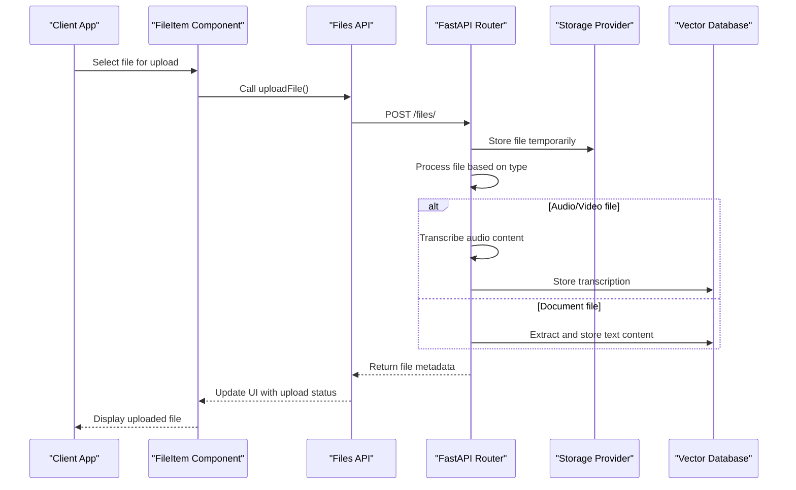
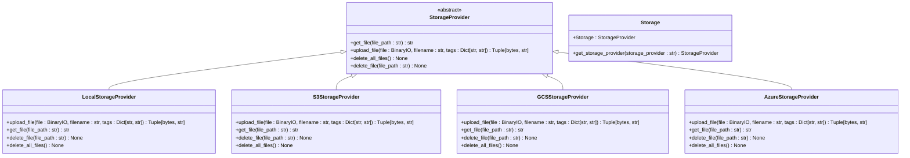
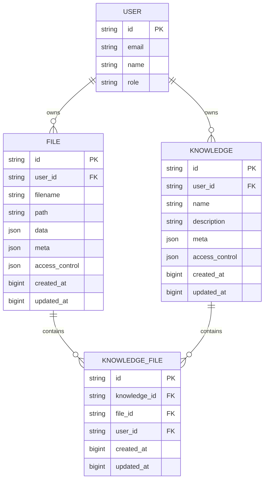
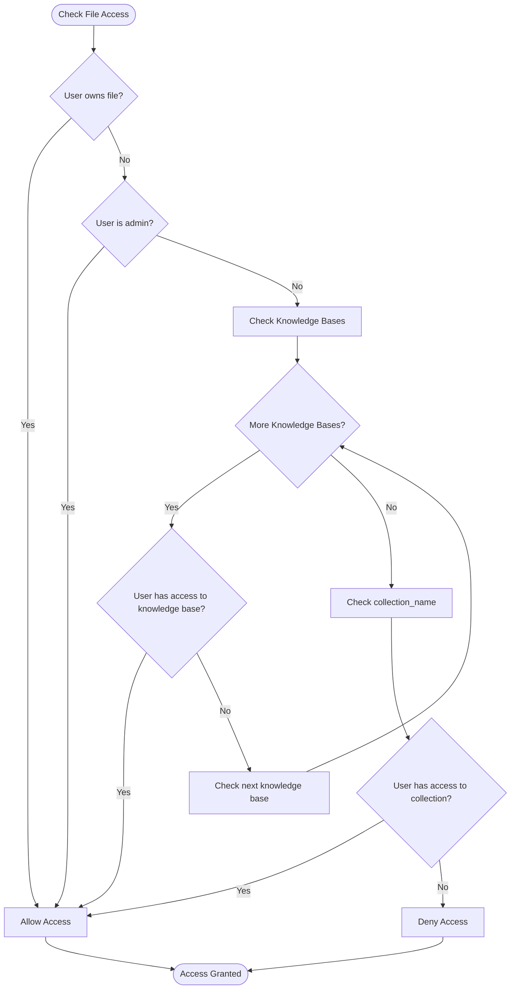
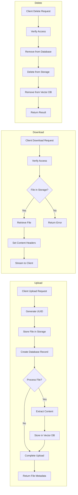
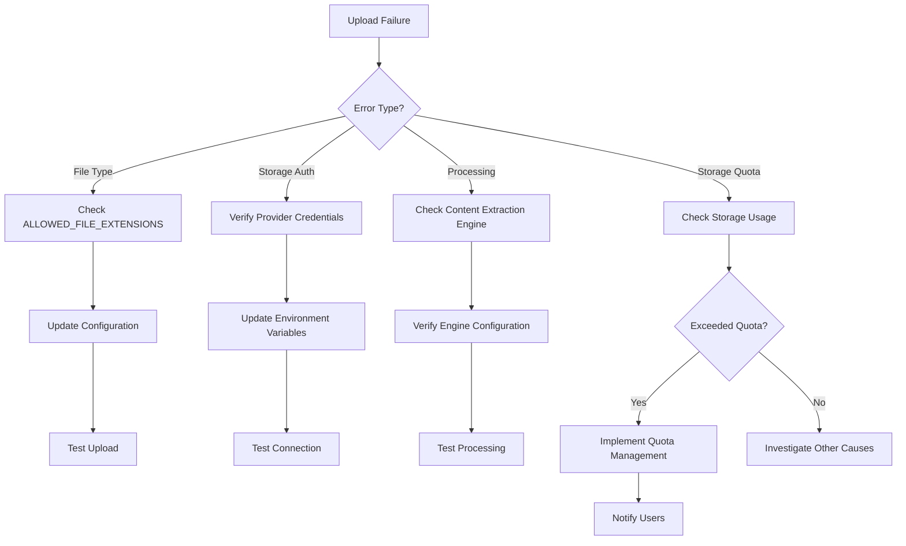
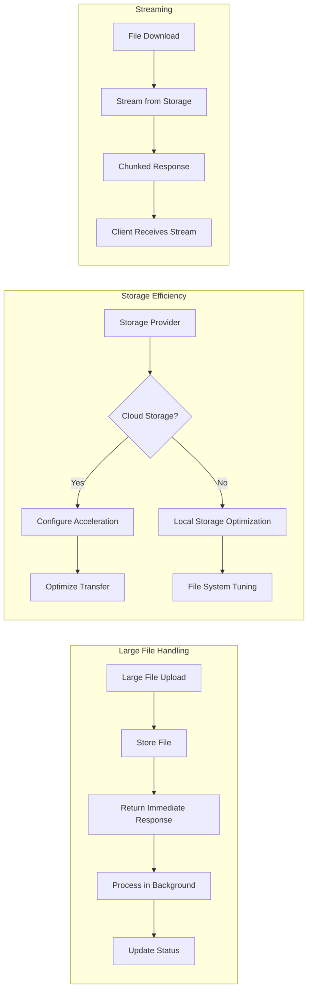

# File Management System

<cite>
**Referenced Files in This Document**   
- [files.py](file://backend/open_webui/routers/files.py)
- [provider.py](file://backend/open_webui/storage/provider.py)
- [files.py](file://backend/open_webui/models/files.py)
- [knowledge.py](file://backend/open_webui/routers/knowledge.py)
- [knowledge.py](file://backend/open_webui/models/knowledge.py)
- [FileItem.svelte](file://src/lib/components/common/FileItem.svelte)
- [FileItemModal.svelte](file://src/lib/components/common/FileItemModal.svelte)
- [index.ts](file://src/lib/apis/files/index.ts)
- [config.py](file://backend/open_webui/config.py)
</cite>

## Table of Contents
1. [Introduction](#introduction)
2. [File Upload Workflow](#file-upload-workflow)
3. [Storage Abstraction Layer](#storage-abstraction-layer)
4. [Metadata Management](#metadata-management)
5. [File Access Controls](#file-access-controls)
6. [Lifecycle Operations](#lifecycle-operations)
7. [Knowledge Base Integration](#knowledge-base-integration)
8. [Common Issues and Solutions](#common-issues-and-solutions)
9. [Performance Considerations](#performance-considerations)
10. [Conclusion](#conclusion)

## Introduction
The File Management System in Open WebUI provides a comprehensive solution for handling file uploads, storage, and retrieval within the application. This system enables users to upload various file types, process their content for AI interactions, and organize them within knowledge bases for enhanced retrieval capabilities. The architecture combines client-side Svelte components with a FastAPI backend, creating a seamless experience for managing files and leveraging their content in AI conversations.

The system supports multiple storage providers including local storage, AWS S3, Google Cloud Storage (GCS), and Azure Blob Storage, allowing for flexible deployment options. Files are processed to extract text content which is then stored in a vector database for semantic search and retrieval. The integration with knowledge bases enables users to create collections of files that can be referenced during AI conversations, enhancing the context and accuracy of responses.

**Section sources**
- [files.py](file://backend/open_webui/routers/files.py#L1-L761)
- [provider.py](file://backend/open_webui/storage/provider.py#L1-L377)

## File Upload Workflow
The file upload workflow in Open WebUI consists of client-side handling through Svelte components and backend processing through FastAPI routers. The process begins when a user selects a file for upload through the FileItem component, which triggers the upload process via the files API.

On the client side, the FileItem component provides a user interface for file selection and upload initiation. When a user selects a file, the component calls the uploadFile function from the files API, which sends a POST request to the backend with the file data and optional metadata. The API handles the file upload process, including progress tracking and error handling.



**Diagram sources**
- [FileItem.svelte](file://src/lib/components/common/FileItem.svelte#L1-L200)
- [index.ts](file://src/lib/apis/files/index.ts#L1-L322)
- [files.py](file://backend/open_webui/routers/files.py#L152-L287)

**Section sources**
- [FileItem.svelte](file://src/lib/components/common/FileItem.svelte#L1-L200)
- [index.ts](file://src/lib/apis/files/index.ts#L1-L322)
- [files.py](file://backend/open_webui/routers/files.py#L152-L287)

## Storage Abstraction Layer
The storage abstraction layer in Open WebUI provides a unified interface for storing files across different storage providers. This layer is implemented through the StorageProvider abstract base class and its concrete implementations for various storage backends. The abstraction allows the application to seamlessly switch between local storage, AWS S3, Google Cloud Storage, and Azure Blob Storage without requiring changes to the core application logic.

The LocalStorageProvider handles file storage on the local filesystem, using the UPLOAD_DIR configuration to determine the storage location. For cloud storage, the system provides implementations for S3StorageProvider, GCSStorageProvider, and AzureStorageProvider, each configured through environment variables. The storage provider is selected at runtime based on the STORAGE_PROVIDER environment variable, with "local" as the default option.



**Diagram sources**
- [provider.py](file://backend/open_webui/storage/provider.py#L43-L377)
- [config.py](file://backend/open_webui/config.py#L880-L908)

**Section sources**
- [provider.py](file://backend/open_webui/storage/provider.py#L43-L377)
- [config.py](file://backend/open_webui/config.py#L880-L908)

## Metadata Management
Metadata management in the File Management System is handled through the File model in the database, which stores both system-generated and user-provided metadata. The system captures essential file information such as filename, content type, size, and creation timestamp, while also allowing for custom metadata to be attached during upload.

The File model includes several fields for metadata storage: the 'meta' field contains a JSON object with file-specific metadata including name, content_type, size, and any additional data provided during upload; the 'data' field stores processing-related information such as extraction status and content; and the 'access_control' field manages permissions for file access. This metadata is used throughout the system for file identification, access control, and processing workflows.



**Diagram sources**
- [files.py](file://backend/open_webui/models/files.py#L18-L34)
- [knowledge.py](file://backend/open_webui/models/knowledge.py#L36-L65)

**Section sources**
- [files.py](file://backend/open_webui/models/files.py#L18-L34)
- [knowledge.py](file://backend/open_webui/models/knowledge.py#L36-L65)

## File Access Controls
File access controls in the File Management System are implemented through a combination of ownership, role-based permissions, and explicit access control rules. The system ensures that users can only access files they own, have been granted access to, or are public files accessible to all users with appropriate roles.

The access control mechanism is centered around the has_access_to_file function, which determines whether a user has the requested access type (read or write) to a specific file. This function checks multiple conditions: direct ownership of the file, administrative privileges, or membership in a group with appropriate access permissions to a knowledge base containing the file. The access_control field in both File and Knowledge models supports complex permission structures including public access (None), private access (empty object), and custom access rules specifying user and group permissions for read and write operations.



**Diagram sources**
- [files.py](file://backend/open_webui/routers/files.py#L65-L94)
- [files.py](file://backend/open_webui/models/files.py#L169-L176)

**Section sources**
- [files.py](file://backend/open_webui/routers/files.py#L65-L94)
- [files.py](file://backend/open_webui/models/files.py#L169-L176)

## Lifecycle Operations
The File Management System implements comprehensive lifecycle operations for file handling, including upload, download, and deletion. These operations are exposed through REST API endpoints and managed through corresponding service functions that handle the business logic and storage interactions.

File upload is handled by the upload_file endpoint, which accepts multipart form data containing the file and optional metadata. The system generates a unique ID for each file, stores it in the configured storage backend, and creates a database record with metadata. For processing-enabled uploads, the system automatically extracts content from supported file types and stores it in the vector database for retrieval. File download operations are implemented through the get_file_content_by_id endpoint, which retrieves files from storage and serves them with appropriate content headers, supporting both inline viewing and attachment downloads.



**Diagram sources**
- [files.py](file://backend/open_webui/routers/files.py#L152-L761)
- [files.py](file://backend/open_webui/models/files.py#L107-L287)

**Section sources**
- [files.py](file://backend/open_webui/routers/files.py#L152-L761)
- [files.py](file://backend/open_webui/models/files.py#L107-L287)

## Knowledge Base Integration
The integration between uploaded files and knowledge bases is a core feature of the File Management System, enabling users to organize files into collections for enhanced AI interactions. When files are added to a knowledge base, their content is processed and stored in a dedicated vector database collection, allowing for semantic search and retrieval during conversations.

The relationship between files and knowledge bases is managed through the knowledge_file table, which creates a many-to-many relationship between the knowledge and file tables. This allows a single file to belong to multiple knowledge bases and a knowledge base to contain multiple files. When a file is added to a knowledge base, the system processes the file content and stores it in a vector database collection named after the knowledge base ID, enabling efficient retrieval of relevant content during AI interactions.

```mermaid
classDiagram
class Knowledge {
+id : string
+user_id : string
+name : string
+description : string
+meta : json
+access_control : json
+created_at : bigint
+updated_at : bigint
}
class File {
+id : string
+user_id : string
+filename : string
+path : string
+data : json
+meta : json
+access_control : json
+created_at : bigint
+updated_at : bigint
}
class KnowledgeFile {
+id : string
+knowledge_id : string
+file_id : string
+user_id : string
+created_at : bigint
+updated_at : bigint
}
Knowledge ||--o{ KnowledgeFile : "has"
File ||--o{ KnowledgeFile : "belongs to"
class KnowledgeTable {
+add_file_to_knowledge_by_id(knowledge_id : str, file_id : str, user_id : str)
+remove_file_from_knowledge_by_id(knowledge_id : str, file_id : str)
+get_files_by_id(knowledge_id : str)
}
class FilesTable {
+get_file_by_id(id : str)
+get_files_by_user_id(user_id : str)
}
KnowledgeTable --> KnowledgeFile
FilesTable --> File
```

**Diagram sources**
- [knowledge.py](file://backend/open_webui/models/knowledge.py#L84-L102)
- [knowledge.py](file://backend/open_webui/routers/knowledge.py#L277-L340)

**Section sources**
- [knowledge.py](file://backend/open_webui/models/knowledge.py#L84-L102)
- [knowledge.py](file://backend/open_webui/routers/knowledge.py#L277-L340)

## Common Issues and Solutions
The File Management System may encounter several common issues during operation, particularly related to upload failures, storage quota management, and configuration problems. Understanding these issues and their solutions is essential for maintaining system reliability and user satisfaction.

Upload failures can occur due to various reasons including unsupported file types, storage provider authentication issues, or processing errors. The system validates file extensions against the ALLOWED_FILE_EXTENSIONS configuration and rejects uploads of unsupported types. For storage provider issues, proper configuration of environment variables such as S3_ACCESS_KEY_ID, S3_SECRET_ACCESS_KEY, and other provider-specific settings is crucial. Processing errors may occur when extracting content from complex documents, which can be mitigated by ensuring the content extraction engine is properly configured.



**Diagram sources**
- [files.py](file://backend/open_webui/routers/files.py#L202-L213)
- [config.py](file://backend/open_webui/config.py#L2660-L2665)

**Section sources**
- [files.py](file://backend/open_webui/routers/files.py#L202-L213)
- [config.py](file://backend/open_webui/config.py#L2660-L2665)

## Performance Considerations
Performance considerations for the File Management System focus on handling large files efficiently and optimizing storage operations. The system implements several strategies to ensure optimal performance, including background processing, streaming responses, and efficient storage management.

For large file handling, the system uses background tasks to process file content without blocking the upload response. This allows users to receive immediate confirmation of upload success while content extraction occurs asynchronously. The system also implements streaming responses for file downloads, reducing memory usage by avoiding loading entire files into memory at once. Storage efficiency is optimized through the use of appropriate storage providers and proper configuration of storage settings such as S3_USE_ACCELERATE_ENDPOINT for faster S3 operations.



**Diagram sources**
- [files.py](file://backend/open_webui/routers/files.py#L155-L159)
- [provider.py](file://backend/open_webui/storage/provider.py#L110-L118)

**Section sources**
- [files.py](file://backend/open_webui/routers/files.py#L155-L159)
- [provider.py](file://backend/open_webui/storage/provider.py#L110-L118)

## Conclusion
The File Management System in Open WebUI provides a robust and flexible solution for handling file uploads, storage, and integration with AI capabilities. By combining a well-structured backend with intuitive client-side components, the system enables users to efficiently manage their files and leverage their content in AI conversations. The abstraction layer for storage providers allows for deployment flexibility, while the integration with knowledge bases enhances the utility of uploaded files.

Key strengths of the system include its comprehensive access control mechanisms, support for multiple file types and storage backends, and efficient handling of large files through background processing. The system's architecture promotes scalability and maintainability, with clear separation of concerns between components. Future enhancements could include more sophisticated quota management, enhanced file preview capabilities, and improved error handling for edge cases.

The documentation provided covers the core aspects of the File Management System, from upload workflows to performance considerations, offering a comprehensive understanding of its functionality and implementation. This foundation enables developers and administrators to effectively utilize and extend the system to meet evolving requirements.