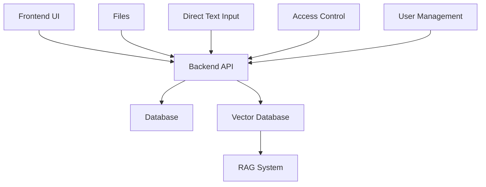
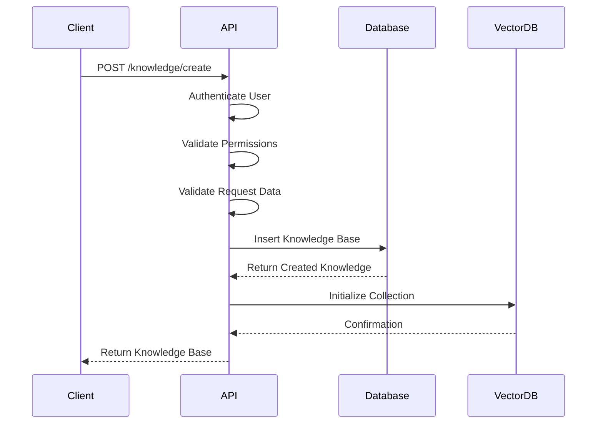
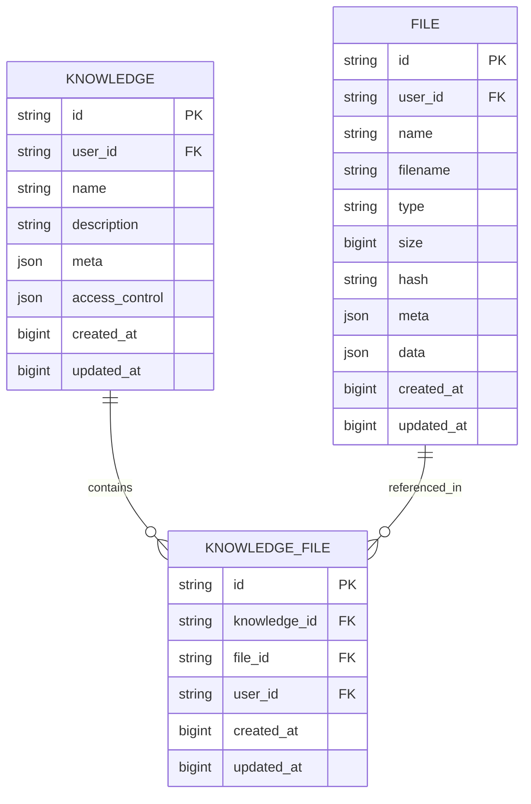
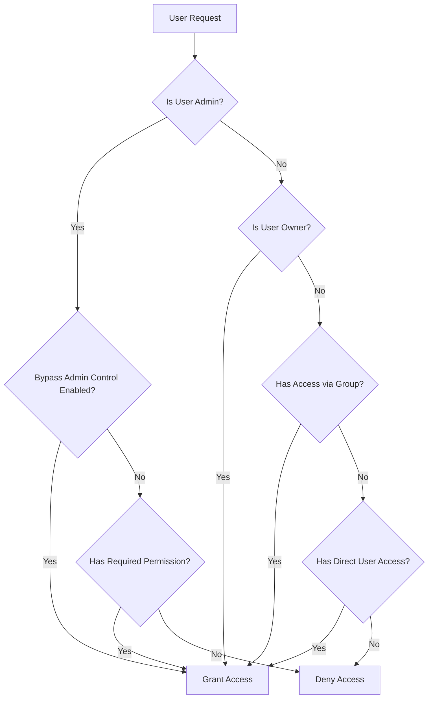
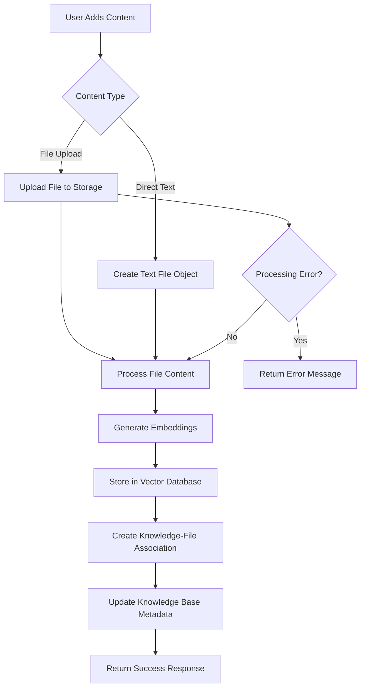
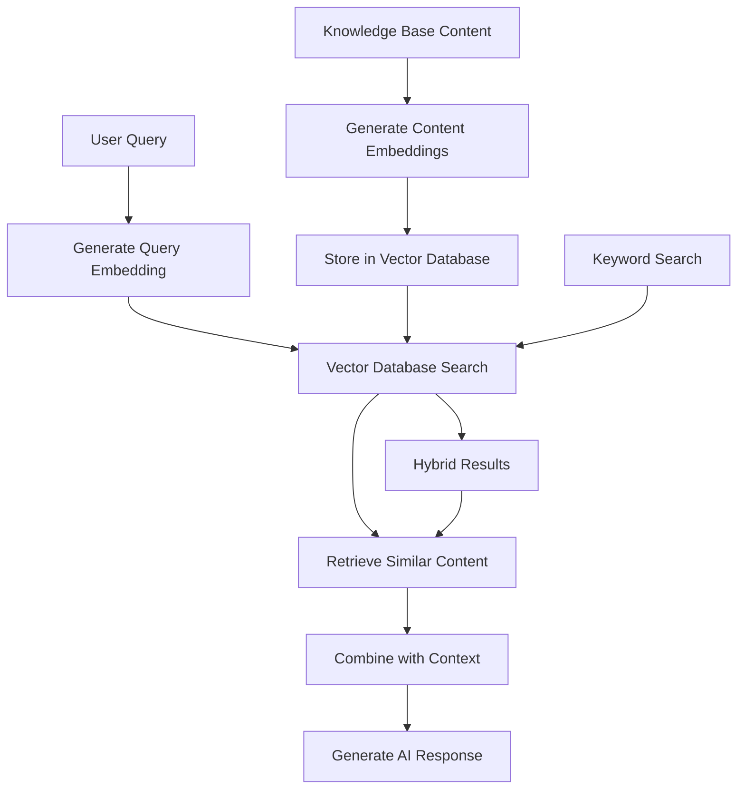
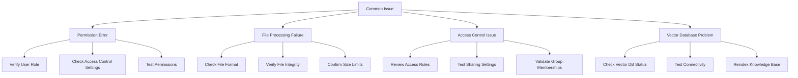
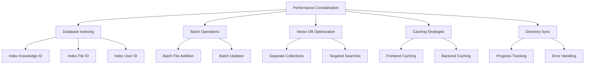

# Knowledge Base Creation and Management

<cite>
**Referenced Files in This Document**   
- [knowledge.py](file://backend/open_webui/models/knowledge.py)
- [knowledge.py](file://backend/open_webui/routers/knowledge.py)
- [index.ts](file://src/lib/apis/knowledge/index.ts)
- [Knowledge.svelte](file://src/lib/components/workspace/Knowledge.svelte)
- [CreateKnowledgeBase.svelte](file://src/lib/components/workspace/Knowledge/CreateKnowledgeBase.svelte)
- [KnowledgeBase.svelte](file://src/lib/components/workspace/Knowledge/KnowledgeBase.svelte)
- [factory.py](file://backend/open_webui/retrieval/vector/factory.py)
- [utils.py](file://backend/open_webui/retrieval/utils.py)
</cite>

## Table of Contents
1. [Introduction](#introduction)
2. [Knowledge Base Architecture](#knowledge-base-architecture)
3. [UI Interactions for Knowledge Base Management](#ui-interactions-for-knowledge-base-management)
4. [Backend API Handling](#backend-api-handling)
5. [Database Storage and Relationships](#database-storage-and-relationships)
6. [Access Control Mechanisms](#access-control-mechanisms)
7. [Content Addition Workflow](#content-addition-workflow)
8. [RAG System Integration](#rag-system-integration)
9. [Common Issues and Solutions](#common-issues-and-solutions)
10. [Performance Considerations](#performance-considerations)
11. [Conclusion](#conclusion)

## Introduction

This document provides a comprehensive guide to knowledge base creation and management within the Open WebUI system. It covers the complete workflow from UI interactions to backend processing, database storage, and integration with the Retrieval-Augmented Generation (RAG) system. The knowledge base functionality enables users to organize, store, and retrieve information efficiently, supporting both file uploads and direct text input. This system is designed to facilitate collaborative knowledge management with robust access control mechanisms and seamless integration with AI models for enhanced information retrieval.

**Section sources**
- [knowledge.py](file://backend/open_webui/models/knowledge.py#L1-L371)
- [Knowledge.svelte](file://src/lib/components/workspace/Knowledge.svelte#L1-L292)

## Knowledge Base Architecture

The knowledge base system is built on a modular architecture that separates concerns between data storage, retrieval, and user interface components. At its core, the system consists of three main layers: the frontend UI components built with Svelte, the backend API endpoints implemented with FastAPI, and the database models that persist the knowledge base data.

The architecture follows a clean separation of responsibilities where the frontend handles user interactions and displays information, the backend processes requests and enforces business logic, and the database stores the persistent data. This separation allows for independent development and scaling of each component while maintaining a cohesive system.

The knowledge base system integrates with the RAG (Retrieval-Augmented Generation) framework, enabling AI models to access and utilize the stored knowledge for generating more informed responses. This integration is facilitated through vector databases that store embeddings of the knowledge content, allowing for semantic search and retrieval.



**Diagram sources**
- [knowledge.py](file://backend/open_webui/models/knowledge.py#L1-L371)
- [Knowledge.svelte](file://src/lib/components/workspace/Knowledge.svelte#L1-L292)
- [factory.py](file://backend/open_webui/retrieval/vector/factory.py#L1-L79)

## UI Interactions for Knowledge Base Management

The user interface for knowledge base management is implemented using Svelte components that provide an intuitive and responsive experience. The main workspace component `Knowledge.svelte` serves as the entry point for knowledge base management, displaying a list of available knowledge bases with search and filtering capabilities.

When creating a new knowledge base, users interact with the `CreateKnowledgeBase.svelte` component, which presents a form with fields for the knowledge base name, description, and access control settings. The form includes real-time validation and feedback to guide users through the creation process.

For managing existing knowledge bases, the `KnowledgeBase.svelte` component provides a comprehensive interface with multiple features:
- A file management section that displays all files associated with the knowledge base
- Search functionality to quickly locate specific files
- Options to add files via upload or directory synchronization
- Direct text content editing capabilities
- Access control management through a dedicated modal

The UI supports drag-and-drop file uploads, making it easy to add multiple files to a knowledge base. It also includes a directory synchronization feature that allows users to sync an entire folder structure with the knowledge base, automatically handling file additions, updates, and deletions.

```mermaid
flowchart TD
A[User Opens Knowledge Workspace] --> B[Displays List of Knowledge Bases]
B --> C[User Clicks "New Knowledge"]
C --> D[CreateKnowledgeBase Form]
D --> E[User Enters Name and Description]
E --> F[User Configures Access Control]
F --> G[Submit Form]
G --> H[Create Knowledge Base API Call]
H --> I[Redirect to Knowledge Base View]
I --> J[KnowledgeBase Component Loads]
J --> K[Display Files and Content]
K --> L[User Interacts with Files]
L --> M[Add, Edit, or Remove Files]
```

**Diagram sources**
- [Knowledge.svelte](file://src/lib/components/workspace/Knowledge.svelte#L1-L292)
- [CreateKnowledgeBase.svelte](file://src/lib/components/workspace/Knowledge/CreateKnowledgeBase.svelte#L1-L144)
- [KnowledgeBase.svelte](file://src/lib/components/workspace/Knowledge/KnowledgeBase.svelte#L1-L800)

## Backend API Handling

The backend API for knowledge base management is implemented as a FastAPI router with endpoints for all CRUD operations and additional management functions. The API follows RESTful principles with clear endpoint naming and HTTP method usage.

The main endpoints include:
- `GET /knowledge/` - Retrieves all knowledge bases with read access for the authenticated user
- `POST /knowledge/create` - Creates a new knowledge base
- `GET /knowledge/{id}` - Retrieves a specific knowledge base by ID
- `POST /knowledge/{id}/update` - Updates an existing knowledge base
- `POST /knowledge/{id}/file/add` - Adds a file to a knowledge base
- `POST /knowledge/{id}/file/remove` - Removes a file from a knowledge base
- `DELETE /knowledge/{id}/delete` - Deletes a knowledge base

Each endpoint includes comprehensive authentication and authorization checks to ensure that users can only access resources they have permission to use. The API uses Pydantic models for request validation and response serialization, ensuring type safety and data integrity.

The API also includes specialized endpoints for batch operations, such as adding multiple files to a knowledge base in a single request, which improves performance when dealing with large numbers of files.



**Diagram sources**
- [knowledge.py](file://backend/open_webui/routers/knowledge.py#L1-L662)
- [knowledge.py](file://backend/open_webui/models/knowledge.py#L1-L371)

## Database Storage and Relationships

The knowledge base system uses a relational database model with two primary tables: `knowledge` and `knowledge_file`. The `knowledge` table stores the core information about each knowledge base, including its ID, name, description, user ownership, access control settings, and timestamps.

The `knowledge_file` table implements a many-to-many relationship between knowledge bases and files, allowing a single file to be associated with multiple knowledge bases and a single knowledge base to contain multiple files. This table includes foreign key constraints to ensure data integrity and cascading deletes to automatically clean up related records when a knowledge base or file is deleted.

The database schema includes unique constraints to prevent duplicate file associations within a knowledge base, ensuring that each file is only referenced once per knowledge base. Indexes are created on frequently queried columns to optimize performance for common operations like retrieving all files in a knowledge base or finding knowledge bases associated with a specific file.



**Diagram sources**
- [knowledge.py](file://backend/open_webui/models/knowledge.py#L1-L371)
- [6a39f3d8e55c_add_knowledge_table.py](file://backend/open_webui/migrations/versions/6a39f3d8e55c_add_knowledge_table.py#L1-L81)
- [3e0e00844bb0_add_knowledge_file_table.py](file://backend/open_webui/migrations/versions/3e0e00844bb0_add_knowledge_file_table.py#L1-L170)

## Access Control Mechanisms

The knowledge base system implements a flexible access control mechanism that allows for fine-grained permissions management. The access control settings are stored as JSON in the `access_control` field of the knowledge table and can be configured to support various sharing scenarios.

The access control model supports three main configurations:
- **Public access** (access_control = null): Available to all users with the "user" role
- **Private access** (access_control = {}): Restricted exclusively to the owner
- **Custom permissions**: Specific access control for reading and writing, with options to specify group or user-level restrictions

The system checks access permissions at multiple levels, including when retrieving knowledge bases, updating their content, and accessing associated files. The `has_access` function in the access control module evaluates whether a user has the required permissions based on their user ID, role, group memberships, and the specific access control settings of the knowledge base.

Administrators have special privileges that allow them to bypass certain access controls, enabling them to manage all knowledge bases in the system. This is controlled by the `BYPASS_ADMIN_ACCESS_CONTROL` configuration setting.



**Diagram sources**
- [knowledge.py](file://backend/open_webui/models/knowledge.py#L1-L371)
- [knowledge.py](file://backend/open_webui/routers/knowledge.py#L1-L662)
- [access_control.py](file://backend/open_webui/utils/access_control.py)

## Content Addition Workflow

The workflow for adding content to knowledge bases supports two primary methods: file uploads and direct text input. Both methods follow a similar processing pipeline that ensures content is properly stored, indexed, and made available for retrieval.

For file uploads, the process begins with the user selecting one or more files through the UI. These files are first uploaded to the file storage system, where they are processed to extract text content and generate embeddings. Once the file is processed and stored, it is associated with the knowledge base by creating a record in the `knowledge_file` table.

The direct text input workflow allows users to create content directly within the knowledge base interface. When a user submits text content, the system creates a temporary file object with the provided text, processes it through the same pipeline as uploaded files, and associates it with the knowledge base.

Both workflows include error handling and feedback mechanisms to inform users of the status of their content addition. The system validates file types and sizes, checks for processing errors, and provides appropriate error messages when issues occur.



**Diagram sources**
- [KnowledgeBase.svelte](file://src/lib/components/workspace/Knowledge/KnowledgeBase.svelte#L1-L800)
- [knowledge.py](file://backend/open_webui/routers/knowledge.py#L1-L662)
- [files.py](file://backend/open_webui/models/files.py)

## RAG System Integration

The knowledge base system is tightly integrated with the RAG (Retrieval-Augmented Generation) framework, enabling AI models to leverage stored knowledge for enhanced responses. This integration is achieved through vector databases that store embeddings of the knowledge content, allowing for semantic search and retrieval.

When a file is added to a knowledge base, its content is processed through an embedding pipeline that converts the text into numerical vectors. These vectors are stored in a vector database collection named after the knowledge base ID, creating a dedicated index for each knowledge base.

The retrieval process uses these vector embeddings to find relevant content based on semantic similarity rather than exact keyword matching. When a user query is received, the system generates an embedding of the query and searches the vector database for the most similar content. This allows the AI model to access contextually relevant information from the knowledge base, even when the query doesn't exactly match the stored content.

The system supports hybrid search strategies that combine vector search with traditional keyword-based search (BM25) to improve retrieval accuracy. This hybrid approach leverages the strengths of both methods, using vector search for semantic understanding and keyword search for precise term matching.



**Diagram sources**
- [factory.py](file://backend/open_webui/retrieval/vector/factory.py#L1-L79)
- [utils.py](file://backend/open_webui/retrieval/utils.py#L1-L800)
- [knowledge.py](file://backend/open_webui/routers/knowledge.py#L1-L662)

## Common Issues and Solutions

Several common issues may arise when working with knowledge bases, particularly related to permissions, file processing, and access control. Understanding these issues and their solutions is crucial for effective knowledge base management.

**Permission Errors**: One of the most common issues is permission errors when accessing or modifying knowledge bases. These typically occur when a user tries to access a knowledge base they don't have permission for or attempts to modify a knowledge base without write access. The solution is to verify the user's role and permissions, and ensure the knowledge base's access control settings allow the requested operation.

**File Processing Failures**: Files may fail to process due to unsupported formats, corruption, or size limitations. The system logs these failures and provides error messages to help diagnose the issue. Solutions include converting files to supported formats, checking file integrity, and ensuring files are within size limits.

**Access Control Configuration**: Incorrect access control settings can prevent users from accessing knowledge bases they should have access to. The solution is to carefully review and test access control configurations, ensuring that the appropriate users and groups have the necessary permissions.

**Vector Database Issues**: Problems with the vector database can prevent content from being properly indexed and retrieved. These issues may require reindexing the knowledge base or checking the vector database configuration and connectivity.



**Diagram sources**
- [knowledge.py](file://backend/open_webui/routers/knowledge.py#L1-L662)
- [knowledge.py](file://backend/open_webui/models/knowledge.py#L1-L371)
- [utils.py](file://backend/open_webui/retrieval/utils.py#L1-L800)

## Performance Considerations

Managing large knowledge collections requires careful consideration of performance implications. The system implements several optimization strategies to ensure efficient operation at scale.

For database operations, the system uses indexing on frequently queried fields such as knowledge base ID, file ID, and user ID. This significantly improves query performance when retrieving knowledge bases, files, and their relationships. The use of batch operations for adding multiple files reduces the number of database transactions and improves overall efficiency.

The vector database integration is optimized for fast retrieval through proper collection management and indexing. The system creates separate collections for each knowledge base, allowing for targeted searches that don't scan irrelevant content. This approach scales well as the number of knowledge bases grows.

Caching strategies are employed to reduce redundant operations. The frontend caches file content to avoid repeated API calls when switching between files, while the backend may cache frequently accessed knowledge base metadata to reduce database load.

For large file uploads, the system supports directory synchronization that can efficiently process entire folder structures. This feature includes progress tracking and error handling to ensure reliable operation even with large numbers of files.



**Diagram sources**
- [knowledge.py](file://backend/open_webui/models/knowledge.py#L1-L371)
- [knowledge.py](file://backend/open_webui/routers/knowledge.py#L1-L662)
- [factory.py](file://backend/open_webui/retrieval/vector/factory.py#L1-L79)

## Conclusion

The knowledge base creation and management system in Open WebUI provides a comprehensive solution for organizing and utilizing information within an AI-powered environment. By combining intuitive UI components with robust backend processing and efficient database storage, the system enables users to create, manage, and leverage knowledge bases effectively.

The integration with the RAG system enhances the value of stored knowledge by making it accessible to AI models for generating more informed and contextually relevant responses. The flexible access control mechanisms support both individual and collaborative knowledge management, while the support for multiple content addition methods accommodates various use cases.

Understanding the architecture, workflows, and potential issues described in this document enables users and administrators to maximize the effectiveness of the knowledge base system. By following best practices for performance optimization and troubleshooting common issues, organizations can build and maintain knowledge collections that significantly enhance their AI capabilities.

**Section sources**
- [knowledge.py](file://backend/open_webui/models/knowledge.py#L1-L371)
- [knowledge.py](file://backend/open_webui/routers/knowledge.py#L1-L662)
- [Knowledge.svelte](file://src/lib/components/workspace/Knowledge.svelte#L1-L292)