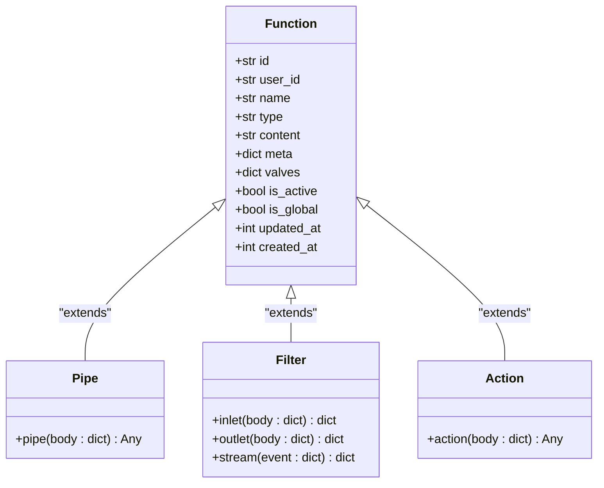
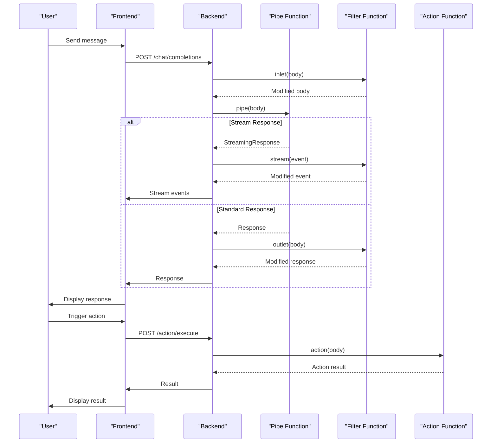
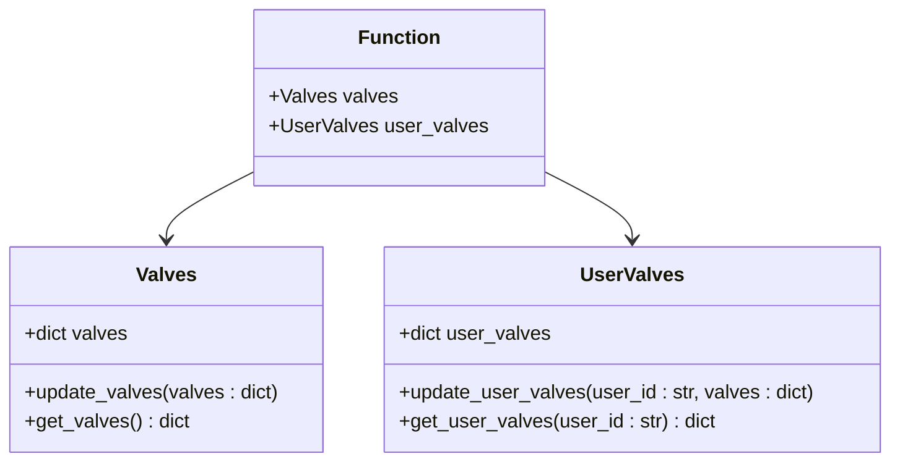
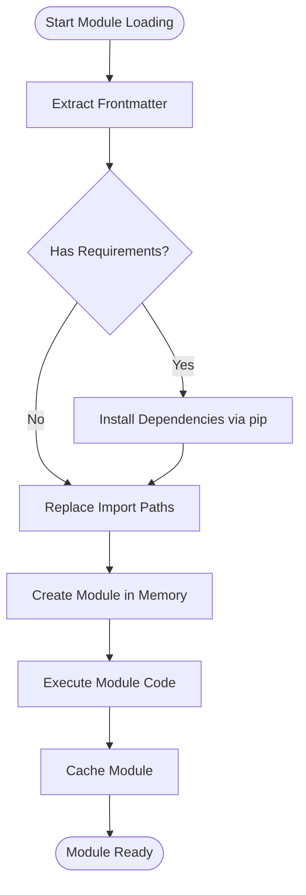
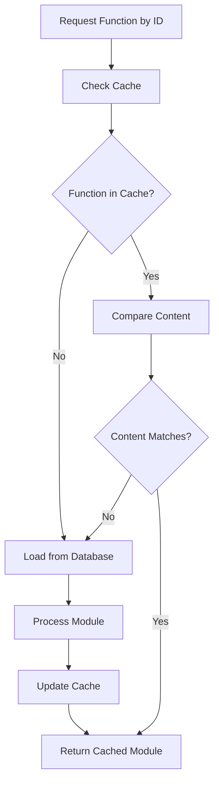
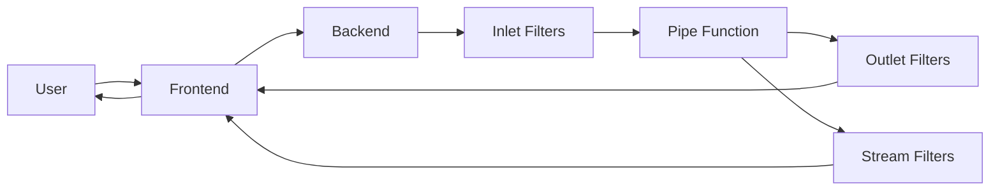
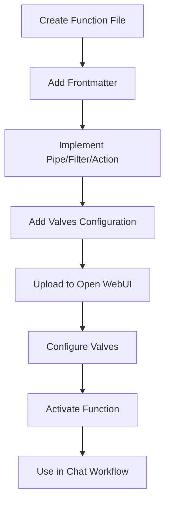
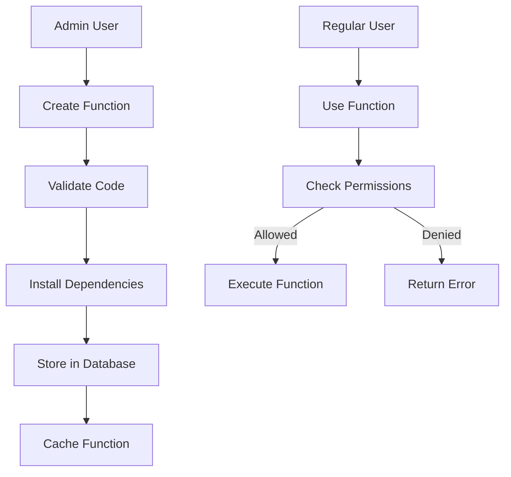
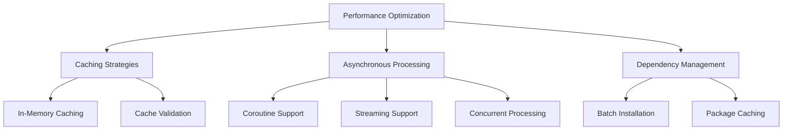

# Extensibility Framework

<cite>
**Referenced Files in This Document**   
- [plugin.py](file://backend/open_webui/utils/plugin.py)
- [functions.py](file://backend/open_webui/functions.py)
- [functions.py](file://backend/open_webui/models/functions.py)
- [functions.py](file://backend/open_webui/routers/functions.py)
- [tools.py](file://backend/open_webui/utils/tools.py)
- [tools.py](file://backend/open_webui/models/tools.py)
- [filter.py](file://backend/open_webui/utils/filter.py)
- [pipelines.py](file://backend/open_webui/routers/pipelines.py)
- [Valves.svelte](file://src/lib/components/common/Valves.svelte)
</cite>

## Table of Contents
1. [Introduction](#introduction)
2. [Plugin Architecture](#plugin-architecture)
3. [Function Types](#function-types)
4. [Valves for Runtime Configuration](#valves-for-runtime-configuration)
5. [Module Loading and Dependency Management](#module-loading-and-dependency-management)
6. [Caching System](#caching-system)
7. [Execution Pipeline](#execution-pipeline)
8. [Creating Custom Functions](#creating-custom-functions)
9. [Security Considerations](#security-considerations)
10. [Performance Optimization](#performance-optimization)
11. [Troubleshooting](#troubleshooting)

## Introduction
The Extensibility Framework in Open WebUI provides a comprehensive system for extending functionality through plugins, functions, and tools. This framework enables developers to create custom components that integrate seamlessly with the core application, allowing for enhanced capabilities such as custom processing pipelines, external tool integration, and dynamic content generation. The system is designed with flexibility, security, and performance in mind, offering multiple extension points and configuration options.

**Section sources**
- [plugin.py](file://backend/open_webui/utils/plugin.py#L1-L313)
- [functions.py](file://backend/open_webui/functions.py#L1-L354)

## Plugin Architecture
The plugin architecture in Open WebUI is built around three primary component types: Pipe, Filter, and Action. Each type serves a distinct purpose in the application's workflow and has specific invocation patterns.

### Pipe Components
Pipe components represent complete processing pipelines that can handle chat completions. They act as model endpoints and are invoked when a user selects a specific model that corresponds to a Pipe. Pipes are responsible for generating responses and can implement custom logic for processing user input and generating output.

### Filter Components
Filter components are used to modify or process data at various stages of the request-response cycle. They can be configured to run at different points in the pipeline, such as inlet (before processing) or outlet (after processing). Filters are particularly useful for tasks like input validation, content modification, or response formatting.

### Action Components
Action components represent discrete operations that can be triggered by users or other components. They are typically used for specific tasks like data retrieval, external API calls, or system operations. Actions can be integrated into the chat workflow and invoked through specific triggers or user interactions.



**Diagram sources**
- [functions.py](file://backend/open_webui/models/functions.py#L19-L35)
- [functions.py](file://backend/open_webui/functions.py#L159-L354)

**Section sources**
- [functions.py](file://backend/open_webui/functions.py#L60-L157)
- [filter.py](file://backend/open_webui/utils/filter.py#L60-L137)

## Function Types
The framework supports three distinct function types, each with its own implementation pattern and use case.

### Pipe Implementation
Pipe functions implement a `pipe` method that processes the entire request and generates a response. The method receives the request body as a parameter and returns the processed result. Pipes can return various types of responses, including strings, generators, or streaming responses.

### Filter Implementation
Filter functions can implement multiple methods depending on their intended use:
- `inlet`: Processes the request before it reaches the main handler
- `outlet`: Processes the response before it's returned to the client
- `stream`: Handles streaming responses in real-time

Filters are particularly powerful as they can modify both input and output data, enabling complex processing workflows.

### Action Implementation
Action functions implement an `action` method that performs a specific operation. Actions are typically used for discrete tasks and can be triggered by specific events or user interactions. They can return various data types depending on the operation being performed.



**Diagram sources**
- [functions.py](file://backend/open_webui/functions.py#L159-L354)
- [filter.py](file://backend/open_webui/utils/filter.py#L60-L137)

**Section sources**
- [functions.py](file://backend/open_webui/functions.py#L159-L354)
- [filter.py](file://backend/open_webui/utils/filter.py#L60-L137)

## Valves for Runtime Configuration
Valves provide a mechanism for runtime configuration of functions and tools, allowing users and administrators to customize behavior without modifying code.

### Valve Implementation
Valves are implemented as Pydantic models within function modules. The `Valves` class defines the configurable parameters, while the `UserValves` class (optional) defines user-specific configuration options.

```python
class Valves(BaseModel):
    priority: int = 0
    temperature: float = 0.7
    max_tokens: int = 256

class UserValves(BaseModel):
    enabled: bool = True
    custom_prompt: str = ""
```

### Valve Storage and Retrieval
Valve configurations are stored in the database and cached in memory for performance. The system distinguishes between global valves (admin-configurable) and user valves (user-configurable). This allows for both system-wide settings and personalized configurations.



**Diagram sources**
- [functions.py](file://backend/open_webui/models/functions.py#L102-L111)
- [functions.py](file://backend/open_webui/routers/functions.py#L374-L455)

**Section sources**
- [functions.py](file://backend/open_webui/routers/functions.py#L374-L455)
- [Valves.svelte](file://src/lib/components/common/Valves.svelte#L1-L185)

## Module Loading and Dependency Management
The framework includes a sophisticated module loading system that handles dependency installation and code execution.

### Module Loading Process
The module loading process involves several steps:
1. Extract frontmatter from the function code
2. Install required dependencies from the frontmatter
3. Replace import paths to ensure proper module resolution
4. Load the module into memory
5. Cache the loaded module for future use

### Frontmatter Dependency Installation
Dependencies are specified in the frontmatter of function files using a `requirements` field. The system automatically installs these dependencies when the function is loaded:

```python
"""
requirements: requests==2.28.1, beautifulsoup4==4.11.1
"""
```

The dependency installation process collects all requirements from active functions and admin tools, then installs them using pip in a single operation to minimize installation time and handle version conflicts.



**Diagram sources**
- [plugin.py](file://backend/open_webui/utils/plugin.py#L18-L313)
- [tools.py](file://backend/open_webui/utils/tools.py#L286-L312)

**Section sources**
- [plugin.py](file://backend/open_webui/utils/plugin.py#L18-L313)
- [tools.py](file://backend/open_webui/utils/tools.py#L286-L312)

## Caching System
The framework implements a comprehensive caching system to improve performance and reduce redundant operations.

### In-Memory Caching
The system maintains in-memory caches for loaded modules and their content:
- `FUNCTIONS`: Cache of loaded function modules
- `FUNCTION_CONTENTS`: Cache of function source code
- `TOOLS`: Cache of loaded tool modules
- `TOOL_CONTENTS`: Cache of tool source code

When a function or tool is requested, the system first checks if it exists in the cache and if the cached content matches the current database content. If they match, the cached module is returned; otherwise, the module is reloaded.

### Cache Validation
Cache validation is performed by comparing the current content in the database with the cached content. This ensures that any changes to function code are immediately reflected in the application without requiring a restart.



**Diagram sources**
- [plugin.py](file://backend/open_webui/utils/plugin.py#L169-L264)
- [functions.py](file://backend/open_webui/functions.py#L60-L78)

**Section sources**
- [plugin.py](file://backend/open_webui/utils/plugin.py#L169-L264)

## Execution Pipeline
The execution pipeline integrates functions, tools, and filters into a cohesive workflow for processing user requests.

### Pipeline Integration
Functions and tools are integrated into the chat workflow through the model selection system. When a user selects a model that corresponds to a Pipe function, the framework routes the request to that function's `pipe` method.

### Data Flow
The data flow through the execution pipeline follows this sequence:
1. User sends a message through the frontend
2. Request is received by the backend
3. Inlet filters process the request
4. Pipe function processes the request and generates a response
5. Outlet filters process the response
6. Response is sent back to the user

For streaming responses, stream filters process each event in real-time as it's generated.



**Diagram sources**
- [functions.py](file://backend/open_webui/functions.py#L159-L354)
- [pipelines.py](file://backend/open_webui/routers/pipelines.py#L60-L167)

**Section sources**
- [functions.py](file://backend/open_webui/functions.py#L159-L354)
- [pipelines.py](file://backend/open_webui/routers/pipelines.py#L60-L167)

## Creating Custom Functions
Creating custom functions involves several steps, from implementation to configuration and integration.

### Function Implementation
To create a custom function, implement one of the three base classes (Pipe, Filter, or Action) in a Python file:

```python
"""
requirements: requests==2.28.1
"""

from open_webui.functions import Function

class Pipe(Function):
    def pipe(self, body: dict) -> str:
        # Process the request and return a response
        return "Hello from custom function!"
```

### Valve Configuration
Add valve configuration to allow runtime customization:

```python
from pydantic import BaseModel

class Valves(BaseModel):
    api_key: str = ""
    base_url: str = "https://api.example.com"

class UserValves(BaseModel):
    enabled: bool = True
    custom_prompt: str = ""
```

### Integration into Chat Workflow
Once created, custom functions can be integrated into the chat workflow by:
1. Uploading the function file through the admin interface
2. Configuring valves as needed
3. Activating the function
4. Selecting the function as a model in the chat interface



**Diagram sources**
- [functions.py](file://backend/open_webui/routers/functions.py#L183-L234)
- [plugin.py](file://backend/open_webui/utils/plugin.py#L118-L166)

**Section sources**
- [functions.py](file://backend/open_webui/routers/functions.py#L183-L234)
- [plugin.py](file://backend/open_webui/utils/plugin.py#L118-L166)

## Security Considerations
The framework includes several security measures to protect against risks associated with executing third-party code.

### Code Execution Security
The system executes third-party code in the same process as the main application, which presents security risks. To mitigate these risks:
- Only administrators can create and modify functions
- Functions are executed with the same privileges as the main application
- Input validation is performed on all function parameters

### Dependency Installation Security
When installing dependencies from frontmatter:
- Only administrators can create functions with dependencies
- Dependencies are installed using the system's pip, which could potentially install malicious packages
- No sandboxing is implemented for dependency installation

### Access Control
Access to function management is restricted to administrators through the `get_admin_user` dependency. Regular users can only use functions that have been made available to them.



**Diagram sources**
- [functions.py](file://backend/open_webui/routers/functions.py#L241-L252)
- [tools.py](file://backend/open_webui/models/tools.py#L24-L54)

**Section sources**
- [functions.py](file://backend/open_webui/routers/functions.py#L241-L252)
- [tools.py](file://backend/open_webui/models/tools.py#L24-L54)

## Performance Optimization
The framework includes several features to optimize plugin performance.

### Caching Strategies
The in-memory caching system significantly improves performance by:
- Eliminating the need to reload and recompile functions on each request
- Reducing database queries for function content
- Minimizing dependency import overhead

### Asynchronous Processing
The framework supports asynchronous function execution, allowing for non-blocking operations:
- Coroutines are supported for long-running operations
- Streaming responses are handled efficiently
- Concurrent processing of multiple functions is possible

### Dependency Management
The dependency installation process is optimized by:
- Collecting all dependencies from active functions and admin tools
- Installing them in a single pip operation
- Caching installed packages to avoid redundant installations



**Diagram sources**
- [plugin.py](file://backend/open_webui/utils/plugin.py#L169-L264)
- [functions.py](file://backend/open_webui/functions.py#L159-L354)

**Section sources**
- [plugin.py](file://backend/open_webui/utils/plugin.py#L169-L264)
- [functions.py](file://backend/open_webui/functions.py#L159-L354)

## Troubleshooting
Common issues and their solutions when working with the extensibility framework.

### Dependency Installation Failures
**Issue**: Dependencies fail to install from frontmatter.
**Solution**: 
- Verify that the requirements format is correct (comma-separated list)
- Check that the package names and versions are valid
- Ensure that the system has internet access
- Verify that pip has the necessary permissions

### Function Loading Errors
**Issue**: Functions fail to load or show as inactive.
**Solution**:
- Check the function code for syntax errors
- Verify that all required dependencies are installed
- Ensure that the function implements one of the valid classes (Pipe, Filter, Action)
- Check the application logs for specific error messages

### Cache Invalidation Issues
**Issue**: Changes to function code are not reflected in the application.
**Solution**:
- Clear the function cache by restarting the application
- Verify that the database content matches the expected code
- Check that the cache validation is working correctly

### Permission Issues
**Issue**: Users cannot access functions or tools.
**Solution**:
- Verify that the function is active and not restricted
- Check that the user has the necessary permissions
- Ensure that the function is properly configured for user access

**Section sources**
- [plugin.py](file://backend/open_webui/utils/plugin.py#L267-L313)
- [functions.py](file://backend/open_webui/routers/functions.py#L16-L234)