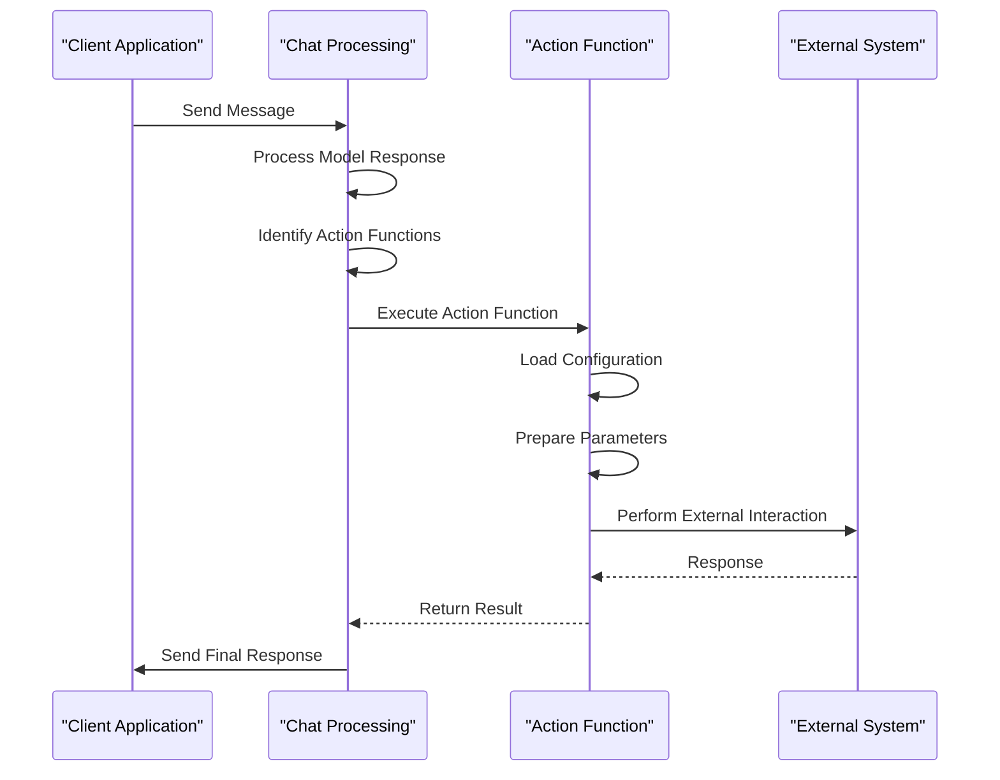

# Action Functions

<cite>
**Referenced Files in This Document**   
- [functions.py](file://backend/open_webui/functions.py)
- [models/functions.py](file://backend/open_webui/models/functions.py)
- [routers/functions.py](file://backend/open_webui/routers/functions.py)
- [utils/plugin.py](file://backend/open_webui/utils/plugin.py)
- [utils/chat.py](file://backend/open_webui/utils/chat.py)
</cite>

## Table of Contents
1. [Introduction](#introduction)
2. [Action Function Interface Implementation](#action-function-interface-implementation)
3. [Execution Flow and Integration](#execution-flow-and-integration)
4. [Asynchronous Execution Patterns](#asynchronous-execution-patterns)
5. [Error Handling and Security](#error-handling-and-security)
6. [Common Use Cases](#common-use-cases)
7. [Troubleshooting Guide](#troubleshooting-guide)

## Introduction
Action Functions in the Functions Framework serve as a critical component for executing side effects and external interactions within the AI pipeline. These functions enable integration with external systems such as databases, APIs, and file systems, allowing for comprehensive post-processing operations after model responses. The framework supports various function types, with Action Functions specifically designed to perform operations that modify state or communicate with external services. This documentation details the implementation, execution patterns, error handling, and integration points for Action Functions, providing guidance for developers and administrators.

## Action Function Interface Implementation

The Action Function interface is implemented through a modular system that allows for dynamic loading and execution of Python modules. Functions are stored in a database with metadata that defines their behavior and configuration. The core implementation revolves around the Function model, which contains fields for id, user_id, name, type, content, meta, valves, is_active, is_global, updated_at, and created_at.

Action Functions are defined as Python modules that can be dynamically loaded and executed. The system uses the `load_function_module_by_id` function from the plugin utility to load these modules, which parses the function content and creates a temporary module for execution. The function type is determined by checking for specific class types in the module: Pipe, Filter, or Action. When an Action class is found, the function is registered as an Action Function.

The framework supports configuration through "valves," which are essentially configuration parameters that can be set at both global and user levels. These valves allow for customization of function behavior without modifying the underlying code. Global valves are stored in the function's valves field, while user-specific valves are stored in the user's settings object under the functions.valves namespace.

**Section sources**
- [models/functions.py](file://backend/open_webui/models/functions.py#L19-L395)
- [utils/plugin.py](file://backend/open_webui/utils/plugin.py#L118-L166)

## Execution Flow and Integration

Action Functions are executed as part of the post-processing stage after model responses. The execution flow begins when a chat request is processed and specific action IDs are identified in the model configuration. The system retrieves the relevant Action Functions from the database and loads their modules into memory.

The execution process involves several key steps:
1. Retrieval of the function module from cache or database
2. Configuration of valves (both global and user-specific)
3. Preparation of execution parameters including the request body, model information, and event emitters
4. Invocation of the action method with the prepared parameters
5. Handling of the action's response or side effects

Integration with the AI pipeline occurs through the chat processing system, where Action Functions are triggered based on model configurations. The system supports both direct execution of actions and more complex workflows involving multiple functions. When an action is executed, it receives a comprehensive set of parameters including the original request body, model information, user data, and event emitters for real-time communication.

The framework also supports webhook integration for notifications and external system updates. For example, when a message is posted in a channel, the system can trigger notifications to users who have configured webhook URLs in their settings. This demonstrates how Action Functions can be used to extend the system's capabilities beyond the core chat functionality.

**Diagram sources**
- [utils/chat.py](file://backend/open_webui/utils/chat.py#L417-L490)
- [functions.py](file://backend/open_webui/functions.py#L159-L354)

**Section sources**
- [utils/chat.py](file://backend/open_webui/utils/chat.py#L417-L490)
- [functions.py](file://backend/open_webui/functions.py#L159-L354)

## Asynchronous Execution Patterns

The Action Functions framework employs asynchronous execution patterns to ensure non-blocking operations and efficient resource utilization. The system leverages Python's asyncio library to handle concurrent function execution, particularly important when dealing with I/O-bound operations such as API calls, database queries, and file system operations.

The `generate_function_chat_completion` function serves as the primary entry point for function execution and is implemented as an async function. It uses an internal `execute_pipe` coroutine to handle both synchronous and asynchronous function calls. When a function is identified as a coroutine (using `asyncio.iscoroutinefunction`), it is awaited directly; otherwise, it is executed as a regular function call.

For streaming responses, the framework implements a generator pattern that yields data chunks as they become available. This allows for real-time updates to be sent to clients without waiting for the entire operation to complete. The streaming functionality is particularly useful for long-running operations or when processing large amounts of data.

The event emitter system enables real-time communication between the executing function and the client interface. Functions can emit events during their execution, which are then propagated to the client through WebSocket connections. This pattern allows for progress updates, status notifications, and intermediate results to be communicated to the user interface.

**Section sources**
- [functions.py](file://backend/open_webui/functions.py#L159-L354)
- [utils/plugin.py](file://backend/open_webui/utils/plugin.py#L118-L166)

## Error Handling and Security

The Action Functions framework implements comprehensive error handling and security measures to ensure reliable and secure execution of external operations. Error handling is implemented at multiple levels, from function loading to execution and response processing.

During function loading, the system catches exceptions and logs detailed error information while preventing the application from crashing. If a function fails to load, it is automatically deactivated by setting its is_active flag to False. This prevents repeated attempts to execute problematic functions while maintaining system stability.

For execution errors, the framework uses try-except blocks to catch exceptions and return appropriate error responses to clients. The error handling system distinguishes between different types of errors, providing specific error messages for validation issues, external service failures, and internal processing errors.

Security considerations are addressed through several mechanisms:
1. Function execution occurs in isolated modules with restricted imports
2. Admin privileges are required to create, modify, or delete functions
3. User-specific valves allow for personalized configuration without exposing sensitive data
4. OAuth token handling for secure access to external services
5. Input validation and sanitization for all function parameters

The system also implements rate limiting and access control to prevent abuse of privileged operations. Functions that perform sensitive operations are typically restricted to administrative users or require explicit user consent.

**Section sources**
- [functions.py](file://backend/open_webui/functions.py#L313-L316)
- [models/functions.py](file://backend/open_webui/models/functions.py#L120-L132)
- [routers/functions.py](file://backend/open_webui/routers/functions.py#L170-L175)

## Common Use Cases

Action Functions support a variety of common use cases that extend the functionality of the AI pipeline. These use cases leverage the framework's ability to perform side effects and external interactions, enabling integration with various systems and services.

Analytics tracking is implemented through Action Functions that log user interactions, message content, and system events to external analytics platforms. These functions can be configured to send data to services like Google Analytics, Mixpanel, or custom analytics backends, providing valuable insights into user behavior and system performance.

Notification systems utilize Action Functions to send alerts and updates to users through various channels. This includes email notifications, push notifications, and webhook integrations with messaging platforms like Slack or Microsoft Teams. The notification system can be personalized based on user preferences and configured through the valves system.

Data synchronization functions maintain consistency between the application's internal state and external data sources. These functions can sync user profiles, chat histories, and document repositories with external systems, ensuring data integrity across platforms. For example, a function might synchronize user profile updates with an external CRM system or update contact information in a marketing automation platform.

Other common use cases include:
- Database operations for storing and retrieving structured data
- API calls to external services for enhanced functionality
- File system modifications for document management
- Webhook triggering for event-driven architectures
- User profile updates based on interaction patterns

These use cases demonstrate the flexibility and power of the Action Functions framework in extending the capabilities of the AI pipeline.

**Section sources**
- [routers/channels.py](file://backend/open_webui/routers/channels.py#L789-L813)
- [utils/chat.py](file://backend/open_webui/utils/chat.py#L417-L490)

## Troubleshooting Guide

When troubleshooting issues with Action Functions, consider the following common problems and solutions:

**Function Loading Failures**: If a function fails to load, check the server logs for import errors or syntax issues. Ensure that all required dependencies are installed and that the function content is valid Python code. The system automatically deactivates functions that fail to load, so verify the is_active status in the database.

**External Service Failures**: When Action Functions interact with external services, network issues or service outages can cause failures. Implement retry logic with exponential backoff for transient errors. Check authentication credentials and API rate limits when encountering persistent failures.

**Configuration Issues**: Problems with valves configuration can prevent functions from working correctly. Verify that both global and user-specific valves are properly set and that the configuration matches the expected schema. Use the API endpoints to retrieve and validate valve configurations.

**Permission Errors**: Ensure that users have the necessary permissions to execute specific functions. Administrative functions typically require elevated privileges, and access control should be verified when functions fail to execute.

**Performance Problems**: Long-running functions can impact system responsiveness. Consider implementing asynchronous processing or background tasks for operations that take significant time to complete. Monitor function execution times and optimize code as needed.

**Debugging Tips**:
- Enable detailed logging to capture function execution flow
- Use the event emitter system to trace function progress
- Test functions in isolation before integrating them into the pipeline
- Validate input parameters and handle edge cases appropriately
- Monitor system resources during function execution

**Section sources**
- [functions.py](file://backend/open_webui/functions.py#L313-L316)
- [models/functions.py](file://backend/open_webui/models/functions.py#L120-L132)
- [routers/functions.py](file://backend/open_webui/routers/functions.py#L170-L175)